# Java — Understand

> **Goal of this file:** Develop conceptual understanding. After reading, you should be able to say *"I understand how this works."* Assumes you've completed `0_foundation.md`.

> **Build status:** Currently complete: **Group 1**. Groups 2–12 will be added in follow-up passes, expanding on the same topics introduced in the Foundation file.

---

## 📖 Master Table of Contents

1. [[#1. Java Fundamentals & Syntax]] ✅
2. [[#2. Object-Oriented Programming]] ✅
3. [[#3. Collections Framework]] ✅
4. [[#4. Generics]] ✅
5. [[#5. Exception Handling]] ✅
6. [[#6. Streams, Lambdas & Functional Programming]] ✅
7. [[#7. Concurrency & Multithreading]] ✅
8. [[#8. JVM Internals & Memory Management]] ✅
9. [[#9. I/O & NIO]] ✅
10. [[#10. Modern Java Features]] ✅
11. [[#11. Reflection & Annotations]] ✅
12. [[#12. Java Platform Module System (JPMS)]] ✅

---

## 1. Java Fundamentals & Syntax

### Table of Contents (this group)
- [[#1.1 What is Java?]]
- [[#1.2 JVM, JRE, and JDK]]
- [[#1.3 Platform Independence & Bytecode]]
- [[#1.4 Variables and Data Types]]
- [[#1.5 Operators]]
- [[#1.6 Control Flow Statements]]
- [[#1.7 Arrays]]
- [[#1.8 Methods]]
- [[#1.9 Packages and Imports]]

---

### 1.1 What is Java?

Java is a **compiled, statically-typed, object-oriented language** that runs on a virtual machine rather than directly on hardware.

**How it works end-to-end:**

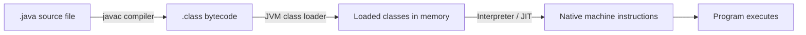

**Relationships with other concepts:** Java's design (bytecode + JVM) is *why* concepts like garbage collection, JIT compilation, and cross-platform libraries are possible at all — they all live inside the JVM layer.

**Advantages:**
- Portable across operating systems without recompiling
- Automatic memory management (no manual `free()`)
- Huge mature ecosystem (Spring, Kafka clients, build tools)

**Disadvantages:**
- Historically slower startup than natively-compiled languages (improving with tools like GraalVM/AOT)
- More verbose syntax than some modern languages (though this has improved with `var`, records, etc.)

> ⚠️ **Common misconception:** "Java is interpreted, so it's slow." In reality, the JVM uses a **JIT (Just-In-Time) compiler** that turns hot bytecode paths into native machine code at runtime, often matching or approaching C++ performance for long-running processes.

**Best intuition:** Think of Java source code as a recipe written in a universal recipe language. The JVM is a chef in every country who can read that exact recipe and cook it using local kitchen equipment (the OS/hardware).

---

### 1.2 JVM, JRE, and JDK

**How they relate (nesting):**

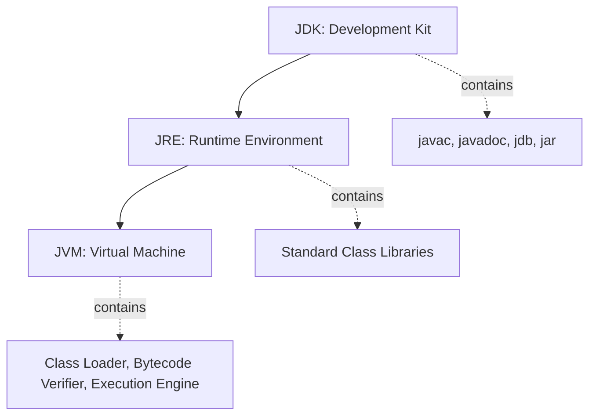

- **JVM** = the execution engine only (class loader + bytecode verifier + interpreter/JIT + garbage collector).
- **JRE** = JVM + core libraries (`java.lang`, `java.util`, etc.) needed to *run* compiled programs.
- **JDK** = JRE + development tools (`javac`, `javadoc`, `jar`, debuggers) needed to *write and build* programs.

> 📝 **Important terminology:** Since Java 11, Oracle no longer ships a separate "JRE-only" download for most use cases — the JDK is the standard distribution developers install. But the *conceptual* JVM/JRE/JDK layering still matters for understanding what runs where (e.g., a production server may only need a JRE-equivalent runtime, not full dev tools).

**Common mistake:** Assuming you need the full JDK to *run* a compiled Java application in production — a minimal runtime (or a custom-built one via `jlink`) is often more efficient at scale.

---

### 1.3 Platform Independence & Bytecode

**Internal mechanism:** `javac` compiles source into class files containing bytecode — a compact instruction set (opcodes) designed to be interpreted or JIT-compiled by *any* conforming JVM, regardless of underlying CPU architecture.

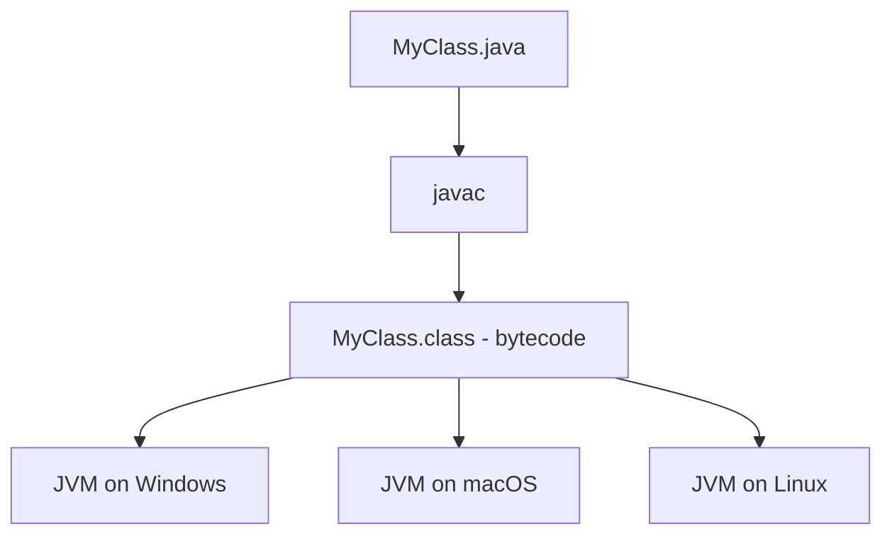

**Why this matters:** The JVM itself is *not* portable — each OS/architecture needs its own JVM binary. What's portable is the bytecode. This is a subtle but important distinction.

> ⚠️ **Common misconception:** "Java code runs anywhere without any platform-specific concerns." In practice, things like file path separators, line endings, native library bindings (JNI), and default character encodings can still differ across platforms — bytecode portability doesn't mean *zero* platform sensitivity.

**Best intuition:** Bytecode is like a shipping container — a standardized format any port (JVM) in the world knows how to unload, regardless of what's inside or where it's headed.

---

### 1.4 Variables and Data Types

**The full primitive type table:**

| Type | Size | Default | Range (approx.) |
|---|---|---|---|
| `byte` | 8-bit | 0 | -128 to 127 |
| `short` | 16-bit | 0 | -32,768 to 32,767 |
| `int` | 32-bit | 0 | ~-2.1B to 2.1B |
| `long` | 64-bit | 0L | ~-9.2×10¹⁸ to 9.2×10¹⁸ |
| `float` | 32-bit | 0.0f | ~7 decimal digits precision |
| `double` | 64-bit | 0.0d | ~15 decimal digits precision |
| `char` | 16-bit | '\u0000' | single Unicode character |
| `boolean` | JVM-dependent | false | true / false |

**How it works:** Primitives are stored directly in the location they're declared (stack for local variables). Reference types store a *reference* to the object, which itself lives on the heap.

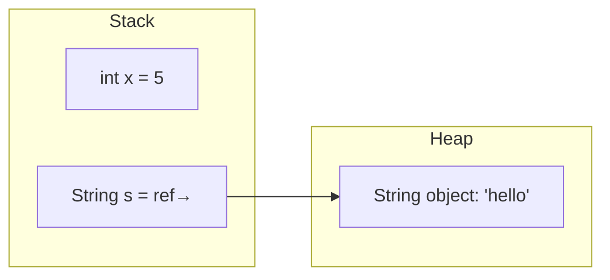

**Common mistake:** Assuming `==` compares *values* for reference types the way it does for primitives. For objects, `==` compares references (memory addresses), not content — that's what `.equals()` is for. (Covered in depth in the OOP group.)

**Autoboxing:** Java automatically converts between primitives and their wrapper classes (`int` ↔ `Integer`) when needed — this is convenient but has a performance cost in tight loops, since it creates objects on the heap.

---

### 1.5 Operators

**Categories and key nuances:**

| Category | Examples | Notes |
|---|---|---|
| Arithmetic | `+ - * / %` | Integer division truncates; watch for overflow |
| Relational | `== != > < >= <=` | `==` on objects compares references, not content |
| Logical | `&& \|\| !` | Short-circuit: right side not evaluated if left decides the result |
| Bitwise | `& \| ^ ~ << >> >>>` | Operate on raw bits; `>>>` is unsigned right shift |
| Assignment | `= += -= *= /=` | Compound assignment includes an implicit cast |
| Ternary | `condition ? a : b` | Compact if-else expression |

> ⚠️ **Common mistake:** `5 / 2` evaluates to `2`, not `2.5`, because both operands are `int` — integer division truncates. You must cast at least one operand to `double` to get a decimal result.

**Short-circuit evaluation intuition:** `a() && b()` — if `a()` returns `false`, `b()` is never called at all. This isn't just an optimization; it's often relied upon to avoid null-pointer errors, e.g. `if (obj != null && obj.isValid())`.

---

### 1.6 Control Flow Statements

**Loop comparison:**

| Loop | Best for | Guarantees at least 1 execution? |
|---|---|---|
| `for` | Known iteration count | No |
| `while` | Unknown iteration count, condition checked first | No |
| `do-while` | Must run at least once | Yes |
| enhanced `for` (for-each) | Iterating collections/arrays | No |

**Switch statement vs switch expression (Java 14+):**

```java
// Traditional switch statement (fall-through risk)
switch (day) {
    case MONDAY:
    case FRIDAY:
        System.out.println("Busy day");
        break;
    default:
        System.out.println("Normal day");
}

// Modern switch expression (no fall-through, returns a value)
String result = switch (day) {
    case MONDAY, FRIDAY -> "Busy day";
    default -> "Normal day";
};
```

> ⚠️ **Common mistake:** Forgetting `break` in a traditional `switch` statement causes **fall-through** — execution continues into the next case. This is one of the most classic Java bugs. The modern `switch` expression (`->` syntax) eliminates this entirely.

---

### 1.7 Arrays

**Memory layout:** Arrays are stored as a single contiguous block on the heap, with a fixed length set at creation time. Accessing `arr[i]` is O(1) because the JVM calculates the exact memory offset directly.

**Time complexity:**

| Operation | Complexity |
|---|---|
| Access by index | O(1) |
| Search (unsorted) | O(n) |
| Insert/delete (requires shifting) | O(n) |

**Multi-dimensional arrays:** Java doesn't have "true" 2D arrays — a 2D array is really an array of array references (jagged arrays are fully legal, meaning each row can have a different length).

```java
int[][] grid = new int[3][]; // 3 rows, columns undefined yet
grid[0] = new int[2];
grid[1] = new int[5]; // different length — perfectly valid
```

> ⚠️ **Common misconception:** "Arrays and `ArrayList` are basically the same thing." Arrays are fixed-size and can hold primitives directly; `ArrayList` is resizable but only holds objects (autoboxing primitives). Full comparison lives in the Collections group.

---

### 1.8 Methods

**Key mechanisms:**

- **Pass-by-value only:** Java *always* passes arguments by value. For objects, the value being copied is the *reference* itself — so the method can mutate the object's internal state, but reassigning the parameter inside the method does not affect the caller's variable.

```java
void reassign(StringBuilder sb) {
    sb.append("!");      // caller sees this change
    sb = new StringBuilder("new"); // caller does NOT see this
}
```

> ⚠️ **Common misconception:** "Java passes objects by reference." This is false — Java passes the *reference value* by copy. This distinction is a favorite trap in interviews (expanded fully in the Interview file).

- **Method overloading:** Same method name, different parameter lists (resolved at compile time based on argument types — this is *static* / *compile-time* polymorphism).
- **Varargs:** `void log(String... messages)` lets a method accept a variable number of arguments, internally treated as an array.

---

### 1.9 Packages and Imports

**How the JVM resolves classes:** A package maps to a directory structure (`com.company.project` → `com/company/project/`). The **classpath** tells the JVM where to look for compiled `.class` files and packages at runtime.

**Import mechanics:**
- `import java.util.List;` — imports a single class
- `import java.util.*;` — imports all classes in a package (does *not* include sub-packages)
- `java.lang.*` is imported automatically into every file — that's why `String`, `System`, `Object` need no explicit import

> 📝 **Important terminology:** The **fully qualified name** of a class includes its package, e.g. `java.util.List`. You only need the short name (`List`) once it's imported or referenced via FQN directly (useful when two imported classes share the same simple name, e.g. `java.util.List` vs `java.awt.List`).

---

[[#📖 Master Table of Contents|⬆ Back to top]]

*End of Group 1. Next: Object-Oriented Programming.*

---

## 2. Object-Oriented Programming

### Table of Contents (this group)
- [[#2.1 Classes and Objects]]
- [[#2.2 Constructors]]
- [[#2.3 The this and super Keywords]]
- [[#2.4 Encapsulation]]
- [[#2.5 Inheritance]]
- [[#2.6 Polymorphism]]
- [[#2.7 Abstraction & Abstract Classes]]
- [[#2.8 Interfaces]]
- [[#2.9 Access Modifiers]]
- [[#2.10 Static vs Instance Members]]
- [[#2.11 The Object Class (equals, hashCode, toString)]]

---

### 2.1 Classes and Objects

**How it works:** A class definition doesn't consume memory for data until you instantiate it with `new`. `new` triggers: (1) memory allocation on the heap sized to hold all instance fields, (2) field defaults applied (0/null/false), (3) constructor runs to set actual values, (4) a reference to the new object is returned.

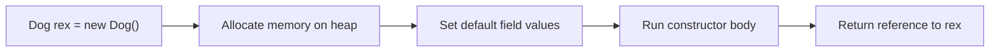

**Relationships:** Classes are the foundation every other OOP concept builds on — inheritance extends classes, interfaces are implemented by classes, encapsulation controls access to a class's members.

**Example:**
```java
class BankAccount {
    private double balance;
    BankAccount(double initial) { this.balance = initial; }
    void deposit(double amt) { balance += amt; }
}

BankAccount acc1 = new BankAccount(100);
BankAccount acc2 = new BankAccount(500);
// acc1 and acc2 are independent objects with separate state
```

**Advantages:** Models real-world entities intuitively; groups related data/behavior; supports code reuse via inheritance.

**Disadvantages:** Can lead to over-engineering (too many small classes) if applied dogmatically; deep class hierarchies can become hard to trace.

> ⚠️ **Common misconception:** "A class *is* an object." A class is only the blueprint — no memory is used for instance data until you create an object from it. (Static fields are an exception — they belong to the class itself, not any instance.)

**Common mistake:** Forgetting that each `new` call creates a fully independent object — mutating one instance's fields never affects another instance's fields (unless they share a reference to the same nested object).

**Best intuition:** A class is like a cookie cutter; an object is an actual cookie. You can make as many cookies as you want from one cutter, and eating one doesn't affect the others.

**Terminology:** *Instantiation* = the act of creating an object from a class via `new`. *Instance* = another word for "object." *State* = the current values of an object's fields.

---

### 2.2 Constructors

**How it works:** If you don't write any constructor, the compiler silently inserts a public no-argument **default constructor**. The moment you write *any* constructor yourself, that free default constructor disappears — a very common trap.

**Constructor chaining:** `this(...)` calls another constructor in the same class; `super(...)` calls a constructor in the parent class. Every constructor's first line implicitly calls `super()` (the parent's no-arg constructor) unless you explicitly call `this(...)` or `super(...)` yourself.

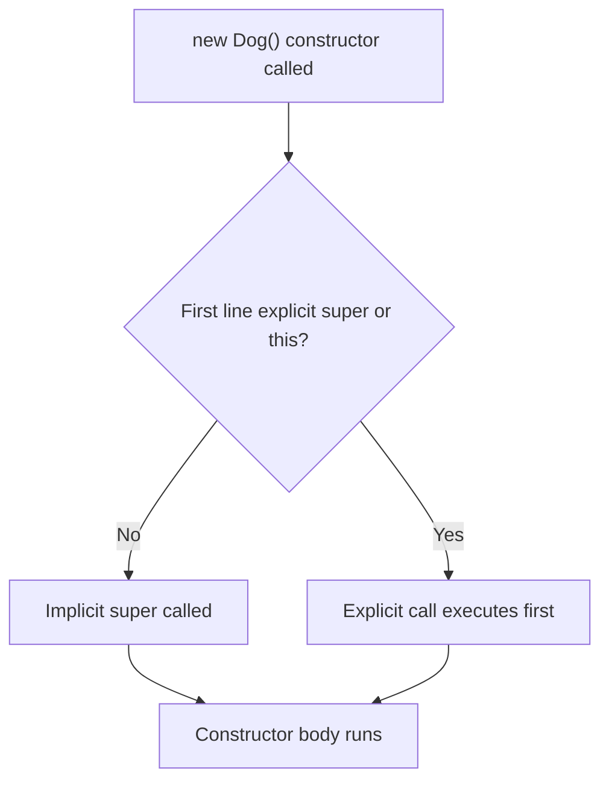

**Example:**
```java
class Animal {
    Animal() { System.out.println("Animal created"); }
}
class Dog extends Animal {
    Dog() {
        // implicit super() call happens here automatically
        System.out.println("Dog created");
    }
}
new Dog(); // prints: "Animal created" then "Dog created"
```

**Advantages:** Guarantees valid object initialization; supports multiple ways to construct an object via overloading.

**Disadvantages:** Constructor overloading can get unwieldy with many optional parameters (the classic motivation for the Builder pattern).

> ⚠️ **Common misconception:** "A class always has a default constructor available." False — the moment you define any constructor (even a parameterized one), Java stops providing the free no-arg default.

**Common mistake:** Writing a constructor with the wrong casing or a return type by accident — this silently becomes a regular method instead of a constructor (a constructor must exactly match the class name and specify no return type, not even `void`).

**Best intuition:** A constructor is like a factory assembly line's final inspection step — nothing leaves the factory without going through it, ensuring every unit meets baseline requirements before it's usable.

**Terminology:** *No-arg constructor*, *parameterized constructor*, *constructor overloading*, *constructor chaining*.

---

### 2.3 The this and super Keywords

**How it works:** `this` is an implicit reference to the current object, automatically available inside every instance method and constructor. `super` gives explicit access to the parent class's members — needed specifically when a subclass overrides a method but still wants to invoke the parent's version.

**Example:**
```java
class Employee {
    protected double salary;
    void printInfo() { System.out.println("Salary: " + salary); }
}
class Manager extends Employee {
    private double bonus;
    Manager(double salary, double bonus) {
        this.salary = salary; // 'this' distinguishes field from parameter
        this.bonus = bonus;
    }
    @Override
    void printInfo() {
        super.printInfo(); // calls Employee's version first
        System.out.println("Bonus: " + bonus);
    }
}
```

**Relationships:** `super` is the primary tool for **extending** rather than fully **replacing** inherited behavior when overriding methods.

**Advantages:** Removes ambiguity; enables clean "extend, don't duplicate" overriding patterns.

**Disadvantages:** Overuse of `super` calls scattered through deep hierarchies can make control flow hard to trace.

> ⚠️ **Common misconception:** "`super` refers to the immediate parent's parent (grandparent) if called from an overridden method." No — `super` always refers to exactly one level up, the direct parent class, regardless of how deep the hierarchy is.

**Common mistake:** Calling `super.method()` in the *middle* or *end* of an overriding method when the intended behavior actually required parent logic to run *first* (or vice versa) — ordering matters and is a frequent source of subtle bugs.

**Best intuition:** `this` is "me, right now." `super` is "my parent, one level up" — never further.

**Terminology:** *Constructor chaining via `super(...)`*, *method overriding with parent delegation*.

---

### 2.4 Encapsulation

**How it works:** Fields are declared `private`, and access is mediated through public getter/setter methods (or, in modern Java, through immutable `record` types — covered in the Modern Features group). This lets a class validate or transform data on the way in/out, and change its internal representation later without breaking callers.

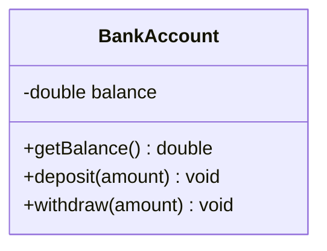

**Example:**
```java
class BankAccount {
    private double balance;
    void withdraw(double amount) {
        if (amount > balance) throw new IllegalArgumentException("Insufficient funds");
        balance -= amount;
    }
    double getBalance() { return balance; }
}
```

**Advantages:** Protects invariants (e.g., balance can never go negative); allows internal implementation to change freely; centralizes validation logic.

**Disadvantages:** Can lead to boilerplate (getter/setter for every field) if applied mechanically without thought — not every field needs both a getter *and* a setter.

> ⚠️ **Common misconception:** "Encapsulation just means making fields `private` and adding getters/setters for all of them." True encapsulation means exposing only the *behavior* needed, and only where mutation should actually be allowed — a getter/setter pair for every field, with no validation logic, provides no real protection at all (it's just a private field with extra steps).

**Common mistake:** Returning a direct reference to a mutable internal field (e.g., a `List` or array) from a getter — callers can then mutate your object's internal state without going through any of your validation logic. Return a defensive copy or unmodifiable view instead.

**Best intuition:** Encapsulation is like a capsule of medicine — you don't manipulate the raw chemicals directly; you interact through a controlled, safe interface (swallowing the capsule) that manages exposure for you.

**Terminology:** *Information hiding*, *invariant*, *defensive copy*, *getter/setter (accessor/mutator)*.

---

### 2.5 Inheritance

**How it works:** `class Dog extends Animal` means `Dog` automatically has all non-private fields/methods of `Animal`, plus whatever it adds or overrides. Java supports **single inheritance** for classes (one direct parent only) but **multiple inheritance of interfaces** (a class can implement many interfaces).

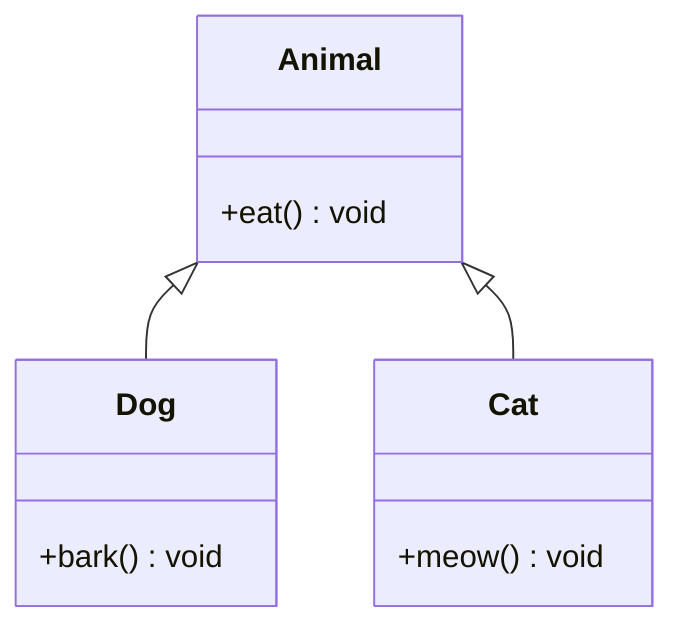

**Example:**
```java
class Animal {
    void eat() { System.out.println("Eating..."); }
}
class Dog extends Animal {
    void bark() { System.out.println("Barking..."); }
}
Dog d = new Dog();
d.eat();  // inherited from Animal
d.bark(); // defined in Dog
```

**Advantages:** Code reuse; models natural "is-a" relationships (a Dog *is an* Animal); enables polymorphism.

**Disadvantages:** Tight coupling between parent and child — changes to a parent class can silently break subclasses (the "fragile base class" problem); deep hierarchies become hard to reason about.

> ⚠️ **Common misconception:** "Java supports multiple inheritance of classes." It does not — a class can extend only one other class. Multiple inheritance of *behavior* is achieved through interfaces (including default methods), not classes.

**Common mistake:** Using inheritance purely for code reuse when there's no real "is-a" relationship (e.g., making `Stack extends Vector` in the old Java collections, widely considered a design mistake) — prefer composition ("has-a") in these cases.

**Best intuition:** Inheritance models "is-a" relationships. If you can't honestly say "a Dog *is an* Animal," inheritance is probably the wrong tool — reach for composition instead.

**Terminology:** *Superclass/parent/base class*, *subclass/child/derived class*, *"is-a" relationship*, *single inheritance*, *composition over inheritance*.

---

### 2.6 Polymorphism

**How it works:** Runtime polymorphism (also called dynamic dispatch) happens through **method overriding**: a reference of the parent type can point to a child object, and calling an overridden method invokes the *child's* version — decided at runtime based on the object's actual type, not the reference's declared type.

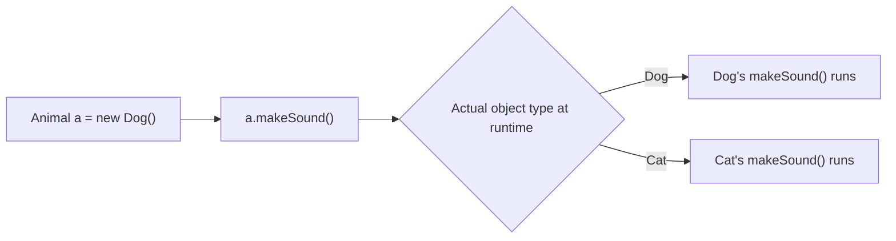

**Example:**
```java
class Animal { void makeSound() { System.out.println("Some sound"); } }
class Dog extends Animal { @Override void makeSound() { System.out.println("Woof"); } }
class Cat extends Animal { @Override void makeSound() { System.out.println("Meow"); } }

Animal[] animals = { new Dog(), new Cat() };
for (Animal a : animals) a.makeSound(); // "Woof" then "Meow"
```

**Time/space complexity:** Not applicable directly, though **virtual method dispatch** does add a small runtime cost (a vtable-style lookup) compared to a direct, non-polymorphic call — usually negligible and often eliminated by JIT inlining for monomorphic call sites.

**Advantages:** Lets you write code against an abstraction (`Animal`) that automatically works for any current or future subtype, without modification.

**Disadvantages:** Can make tracing "which method actually runs" harder when reading code, especially in deep hierarchies — you must know the object's runtime type, not just its declared type.

> ⚠️ **Common misconception:** "Overloading and overriding are the same kind of polymorphism." They're not — overloading is resolved at **compile time** based on the declared parameter types (static/compile-time polymorphism); overriding is resolved at **runtime** based on the actual object type (dynamic polymorphism).

**Common mistake:** Forgetting `@Override` and accidentally *overloading* instead of *overriding* (e.g., mismatched parameter types) — the compiler won't catch this without the annotation, and the "override" silently becomes a separate, unrelated method.

**Best intuition:** Polymorphism is like a universal remote button labeled "power" — pressing it does the right thing whether it's plugged into a TV, a stereo, or a fan; the caller doesn't need to know which.

**Terminology:** *Dynamic dispatch*, *virtual method*, *upcasting*, *runtime/dynamic polymorphism* vs. *compile-time/static polymorphism*.

---

### 2.7 Abstraction & Abstract Classes

**How it works:** An `abstract` class can mix fully implemented methods with `abstract` methods (no body — subclasses must implement them). It cannot be instantiated directly with `new`; only concrete subclasses that implement all abstract methods can be instantiated.

```java
abstract class Shape {
    abstract double area(); // no implementation - subclass must provide it
    void printArea() { System.out.println("Area: " + area()); } // shared implementation
}
class Circle extends Shape {
    double radius;
    Circle(double r) { radius = r; }
    @Override double area() { return Math.PI * radius * radius; }
}
```

**Relationships:** Abstract classes sit between concrete classes (fully implemented) and interfaces (traditionally, no implementation at all) — they let you share *some* common implementation while still forcing subclasses to fill in specifics.

**Advantages:** Enforces a consistent structure across related subclasses while still allowing shared code (avoiding duplication that a pure interface can't provide as naturally).

**Disadvantages:** Java's single-inheritance rule means a class can extend only one abstract class — this can be limiting compared to implementing multiple interfaces.

> ⚠️ **Common misconception:** "Abstract classes can't have constructors." They can, and often do — a subclass's constructor implicitly calls the abstract parent's constructor via `super()`, useful for initializing shared fields.

**Common mistake:** Making a class abstract just to prevent instantiation, without actually declaring any abstract methods — if there's nothing to force subclasses to implement, a private constructor or final class might express the intent more clearly.

**Best intuition:** An abstract class is like a recipe template that says "cook the protein your own way, but here's the shared plating instructions everyone follows."

**Terminology:** *Abstract method*, *concrete class/method*, *template method pattern* (a common design pattern built directly on this concept).

---

### 2.8 Interfaces

**How it works:** Traditionally, an interface could only declare method signatures (no bodies) plus `public static final` constants. Since Java 8, interfaces can also include **default methods** (with a body, providing shared implementation) and **static methods**. A class `implements` one or more interfaces and must provide implementations for all abstract (non-default) methods.

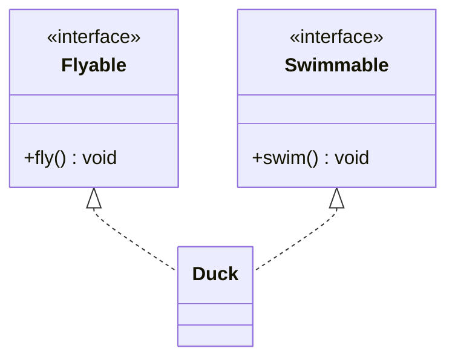

**Example:**
```java
interface Flyable {
    void fly(); // abstract - must be implemented
    default void takeOff() { System.out.println("Taking off..."); } // default - shared implementation
}
interface Swimmable {
    void swim();
}
class Duck implements Flyable, Swimmable {
    public void fly() { System.out.println("Duck flying"); }
    public void swim() { System.out.println("Duck swimming"); }
}
```

**Advantages:** Enables multiple inheritance of *type* (a class can implement many interfaces) and *behavior* (via default methods); decouples "what" from "how," supporting flexible, testable design (e.g., programming to an interface, not an implementation).

**Disadvantages:** Default methods can introduce the "diamond problem" if two interfaces provide conflicting default implementations for the same method — the implementing class must explicitly resolve the conflict.

> ⚠️ **Common misconception:** "Interfaces still can't have any implementation." This was true before Java 8. Modern Java interfaces can have default methods, static methods, and even private helper methods (Java 9+) — they're much closer to abstract classes than many developers realize, minus instance fields and constructors.

**Common mistake:** Assuming an interface can hold mutable instance state — it can't; interface fields are implicitly `public static final` (constants), not per-instance data.

**Best intuition:** An interface is a contract — "if you sign this, you promise to provide these capabilities." Default methods are like a contract that also comes with some pre-filled clauses you can accept as-is or override.

**Terminology:** *Default method*, *static interface method*, *functional interface* (an interface with exactly one abstract method — foundational to lambdas, covered in the Streams/Lambdas group), *diamond problem*.

---

### 2.9 Access Modifiers

**Full visibility table:**

| Modifier | Same class | Same package | Subclass (different package) | Everywhere |
|---|---|---|---|---|
| `private` | ✅ | ❌ | ❌ | ❌ |
| (default/package-private) | ✅ | ✅ | ❌ | ❌ |
| `protected` | ✅ | ✅ | ✅ | ❌ |
| `public` | ✅ | ✅ | ✅ | ✅ |

**How it works:** Access modifiers are enforced entirely at **compile time** by the compiler checking the caller's location against the declared visibility — there's no runtime access-control check for ordinary field/method access (unlike, say, a security manager, which is a different, largely deprecated mechanism).

**Relationships:** Access modifiers are the language-level enforcement mechanism behind encapsulation — encapsulation is the *principle*, access modifiers are the *tool*.

**Advantages:** Prevents accidental misuse of internal implementation details from unrelated code; documents intent (this is "for internal use only" vs. "part of the public API").

**Disadvantages:** Overly restrictive defaults can force awkward workarounds (e.g., excessive public getters just to expose something for testing).

> ⚠️ **Common misconception:** "Package-private (default access) is rarely useful." It's actually a deliberate, useful middle ground — commonly used to expose helper classes/methods to other classes in the same package (e.g., same module/feature) while still hiding them from the rest of the codebase.

**Common mistake:** Making fields `public` for convenience "just for now" during prototyping — this bypasses encapsulation entirely and is a common source of tightly-coupled, hard-to-refactor code later.

**Best intuition:** Think of access modifiers as concentric rings of trust: `private` (only me), package-private (my close neighborhood), `protected` (my family/descendants), `public` (anyone).

**Terminology:** *Package-private/default access*, *visibility*, *API surface*.

---

### 2.10 Static vs Instance Members

**How it works:** Static members are allocated once, associated with the `Class` object itself (loaded once by the class loader); instance members are allocated fresh for every object created with `new`.

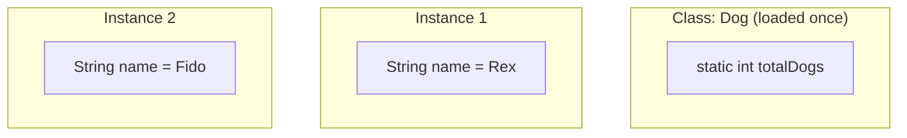

**Example:**
```java
class Dog {
    static int totalDogs = 0; // shared across all instances
    String name;              // unique per instance
    Dog(String name) {
        this.name = name;
        totalDogs++;
    }
}
new Dog("Rex");
new Dog("Fido");
System.out.println(Dog.totalDogs); // 2
```

**Advantages:** Static members are perfect for shared counters, constants, utility methods (`Math.sqrt()`), and factory methods that don't need per-instance state.

**Disadvantages:** Static state is effectively global, mutable state shared across the whole JVM — this makes static fields a common source of hidden coupling and thread-safety bugs in concurrent code.

> ⚠️ **Common misconception:** "Static methods can access instance fields directly." They can't — a static method has no implicit `this`, so it can only access other static members directly (it would need an explicit object reference to reach instance members).

**Common mistake:** Using a mutable static field as a cache or counter in a multi-threaded application without synchronization — this is one of the most common sources of race conditions in real Java code (full detail in the Concurrency group).

**Best intuition:** Instance members are like each student's individual notebook; static members are like the one shared whiteboard at the front of the classroom that everyone sees and can affect.

**Terminology:** *Class members* (another name for static members), *instance members*, *static initialization block*, *class variable*.

---

### 2.11 The Object Class (equals, hashCode, toString)

**How it works:** Every class implicitly `extends Object` if it doesn't extend anything else. `Object` provides default implementations: `equals()` compares references (`==`), `hashCode()` derives a number from the object's memory identity (implementation-dependent), and `toString()` prints the class name plus a hash in hex (e.g., `Dog@1b6d3586`).

**The equals/hashCode contract (critical for interviews):**
- If `a.equals(b)` is `true`, then `a.hashCode() == b.hashCode()` **must** also be true.
- The reverse is *not* required — two unequal objects *can* share a hash code (a "hash collision"), which is legal and expected.
- Overriding one without the other breaks the contract and causes subtle bugs in hash-based collections (`HashMap`, `HashSet`) — objects can "disappear" from a `HashSet` or fail lookups in a `HashMap`.

```java
class Point {
    int x, y;
    Point(int x, int y) { this.x = x; this.y = y; }

    @Override
    public boolean equals(Object o) {
        if (this == o) return true;
        if (!(o instanceof Point p)) return false;
        return x == p.x && y == p.y;
    }

    @Override
    public int hashCode() {
        return Objects.hash(x, y);
    }

    @Override
    public String toString() {
        return "Point(" + x + ", " + y + ")";
    }
}
```

**Advantages:** Overriding these three methods makes objects behave correctly and meaningfully inside collections, logs, and debugging output.

**Disadvantages:** Easy to get subtly wrong (asymmetric `equals`, forgetting `hashCode`, not handling `null` or type-mismatches safely) — this is one of the most bug-prone areas of everyday Java.

> ⚠️ **Common misconception:** "If I override `equals()`, `hashCode()` will still work fine by default." False — this is the single most common real-world violation of the equals/hashCode contract, and it silently breaks `HashMap`/`HashSet` behavior.

**Common mistake:** Implementing `equals()` using `==` for a field comparison when the field is itself an object (e.g., comparing two `String` fields with `==` instead of `.equals()` inside your own `equals()` override).

**Best intuition:** `equals()`/`hashCode()` are a matched pair, like a lock and key made in the same batch — using one from a different batch (overriding only one) breaks the whole system.

**Terminology:** *equals/hashCode contract*, *hash collision*, *reflexive/symmetric/transitive/consistent* (the four formal properties `equals()` must satisfy).

---

[[#📖 Master Table of Contents|⬆ Back to top]]

*End of Group 2. Next: Collections Framework.*

---

## 3. Collections Framework

### Table of Contents (this group)
- [[#3.1 The Collection Hierarchy Overview]]
- [[#3.2 List Implementations (ArrayList vs LinkedList)]]
- [[#3.3 Set Implementations (HashSet, LinkedHashSet, TreeSet)]]
- [[#3.4 Map Implementations (HashMap, LinkedHashMap, TreeMap, Hashtable)]]
- [[#3.5 Queue and Deque (ArrayDeque, PriorityQueue)]]
- [[#3.6 Iterator and Iterable]]
- [[#3.7 Comparable vs Comparator]]
- [[#3.8 The Collections Utility Class]]

---

### 3.1 The Collection Hierarchy Overview

**How it works / hierarchy:**

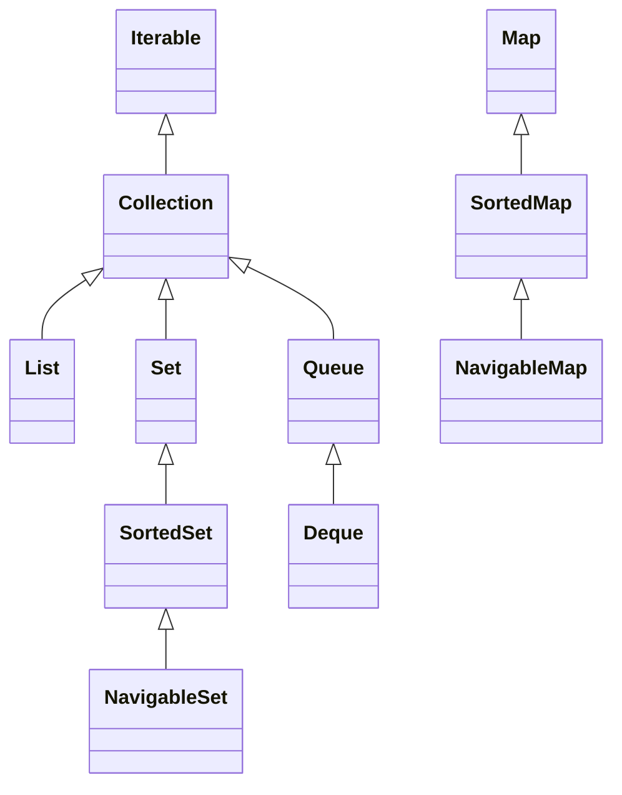

**Relationships:** `Map` is deliberately NOT part of the `Collection` hierarchy (a common interview trick question) because a map's fundamental unit is a key-value pair, not a single element — it doesn't fit the single-element contract that `Collection`/`Iterable` expects.

**Advantages:** Provides a consistent, pluggable set of data structures with well-defined interfaces, letting code depend on abstractions (`List<T>`) rather than concrete implementations (`ArrayList<T>`).

**Disadvantages:** The hierarchy has some legacy warts (`Vector`, `Stack`, `Hashtable` predate the modern framework and don't fully fit its design conventions).

> ⚠️ **Common misconception:** "`Map` is a `Collection`." It is not — `Map<K,V>` is a separate top-level interface with its own hierarchy, even though it's usually discussed alongside collections.

**Best intuition:** Think of `Collection` as "a bag of single things" and `Map` as "a bag of pairs" — fundamentally different shapes of data, hence separate hierarchies.

**Terminology:** *Collection*, *Iterable*, *concrete implementation*, *interface-based programming*.

---

### 3.2 List Implementations (ArrayList vs LinkedList)

**How it works:** `ArrayList` wraps a resizable `Object[]` array — when capacity is exceeded, a new, larger array (typically 1.5x) is allocated and old elements copied over. `LinkedList` is a doubly-linked list of nodes, each holding data plus `next`/`prev` references.

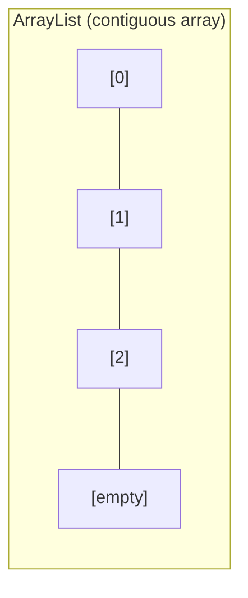

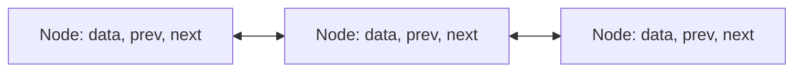

**Complexity comparison:**

| Operation | ArrayList | LinkedList |
|---|---|---|
| Get by index | O(1) | O(n) |
| Add at end | O(1) amortized | O(1) |
| Add/remove at beginning | O(n) | O(1) |
| Add/remove in middle | O(n) | O(n) to find + O(1) to link |
| Memory overhead | Low (array) | Higher (node objects w/ 2 refs each) |

**Example:**
```java
List<String> arrayList = new ArrayList<>();
arrayList.add("a"); arrayList.add("b");
System.out.println(arrayList.get(0)); // O(1)

List<String> linkedList = new LinkedList<>();
linkedList.addFirst("x"); // O(1) - LinkedList shines here
```

**Advantages/Disadvantages:** ArrayList: fast random access, cache-friendly (contiguous memory), but costly inserts/removals mid-list. LinkedList: fast insert/remove at ends, but slow random access and higher per-element memory overhead.

> ⚠️ **Common misconception:** "LinkedList is generally faster for insertions." Only true for insertions at a *known* position (front/back via `Deque` methods) — inserting into the *middle* still requires an O(n) traversal to find the position first, so it's not automatically faster than ArrayList in practice.

**Common mistake:** Defaulting to `LinkedList` for general-purpose use — in most real-world scenarios, `ArrayList` is faster and more memory-efficient due to CPU cache locality, even for many insert/remove-heavy workloads.

**Best intuition:** ArrayList is a row of labeled parking spots — instant access to any spot number, but shifting a car in the middle means shifting every car after it. LinkedList is a chain of people holding hands — easy to cut in the middle once you've walked to that spot, but no way to jump straight to "person #50."

**Terminology:** *Amortized cost*, *contiguous memory*, *doubly-linked list*, *capacity vs. size*.

---

### 3.3 Set Implementations (HashSet, LinkedHashSet, TreeSet)

**How it works:** `HashSet` is backed internally by a `HashMap` (elements are stored as `HashMap` keys with a dummy value) — its ordering is unpredictable, depending on hash bucket placement. `LinkedHashSet` adds a doubly-linked list on top to remember insertion order. `TreeSet` is backed by a `TreeMap` (a red-black tree), keeping elements always sorted.

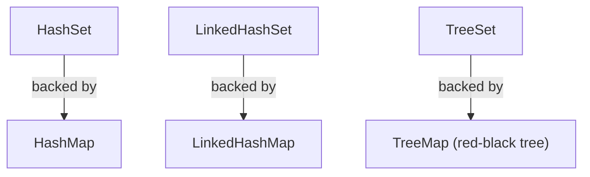

**Complexity comparison:**

| Operation | HashSet | LinkedHashSet | TreeSet |
|---|---|---|---|
| Add/remove/contains | O(1) average | O(1) average | O(log n) |
| Maintains order? | No | Insertion order | Sorted order |
| Allows null? | One null | One null | No (throws NPE on natural ordering) |

**Example:**
```java
Set<String> hashSet = new HashSet<>(List.of("banana", "apple", "cherry"));
System.out.println(hashSet); // order not guaranteed

Set<String> treeSet = new TreeSet<>(List.of("banana", "apple", "cherry"));
System.out.println(treeSet); // [apple, banana, cherry] - always sorted
```

**Advantages/Disadvantages:** HashSet is fastest for pure membership checks but gives no ordering guarantee. TreeSet gives sorted order and range queries (`headSet`, `tailSet`) at the cost of O(log n) operations instead of O(1).

> ⚠️ **Common misconception:** "Sets don't allow `null`." `HashSet` and `LinkedHashSet` allow exactly one `null` element; `TreeSet` throws `NullPointerException` when using natural ordering, since it can't compare `null` to anything.

**Common mistake:** Relying on `HashSet` iteration order to be consistent or meaningful — it's an implementation detail that depends on hash codes and internal bucket layout, and can even change between JDK versions.

**Best intuition:** HashSet is a bag you can dump items into and quickly check "is this already in the bag?" — fast, but you can't say what order they'll come out. TreeSet is a bag that automatically keeps itself alphabetized every time you look inside.

**Terminology:** *Load factor*, *hash bucket*, *red-black tree*, *natural ordering*.

---

### 3.4 Map Implementations (HashMap, LinkedHashMap, TreeMap, Hashtable)

**How it works:** `HashMap` stores entries in an array of buckets, where a key's `hashCode()` determines its bucket; collisions within a bucket are handled via a linked list, which converts to a balanced red-black tree if a single bucket grows past a threshold (8 entries, since Java 8) for better worst-case performance. `LinkedHashMap` adds insertion (or access) order tracking. `TreeMap` keeps keys sorted via a red-black tree. `Hashtable` is a legacy, fully synchronized version.

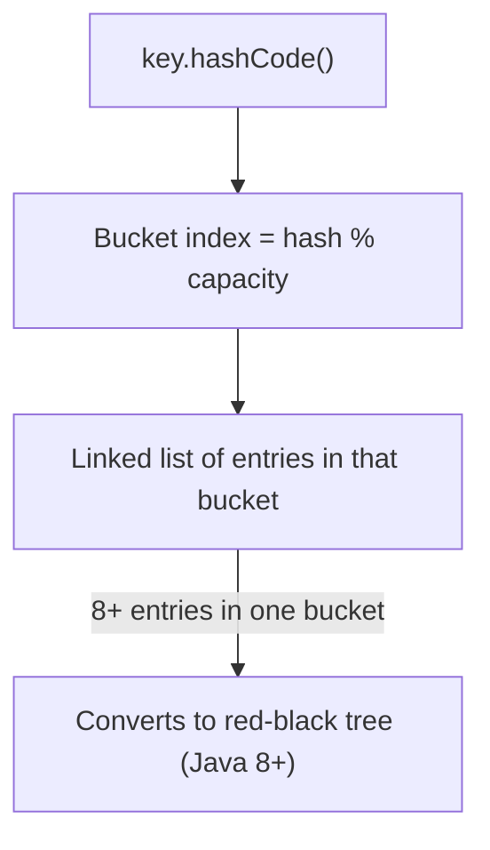

**Complexity comparison:**

| Operation | HashMap | LinkedHashMap | TreeMap | Hashtable |
|---|---|---|---|---|
| get/put/remove | O(1) average | O(1) average | O(log n) | O(1) average |
| Worst case (many collisions) | O(log n) since Java 8 | O(log n) since Java 8 | O(log n) | O(n) |
| Maintains order? | No | Insertion/access order | Sorted by key | No |
| Thread-safe? | No | No | No | Yes (synchronized) |
| Allows null key/value? | One null key, many null values | Same as HashMap | No null key | No null key or value |

**Example:**
```java
Map<String, Integer> map = new HashMap<>();
map.put("apple", 1);
map.put("banana", 2);
map.merge("apple", 10, Integer::sum); // apple -> 11
System.out.println(map.getOrDefault("cherry", 0)); // 0
```

**Advantages/Disadvantages:** HashMap is the general-purpose default (fast, no ordering). TreeMap adds sorted-order range queries at O(log n) cost. Hashtable is legacy — synchronized but with coarse-grained locking, largely superseded by `ConcurrentHashMap` (covered in the Concurrency group) for concurrent use.

> ⚠️ **Common misconception:** "HashMap has O(n) worst-case lookup due to hash collisions, forever." True before Java 8 (a bucket was always a linked list, so pathological hash collisions caused O(n) lookups — a known denial-of-service vector). Since Java 8, buckets convert to red-black trees once they exceed 8 entries, capping worst-case lookup at O(log n).

**Common mistake:** Using a mutable object as a `HashMap` key and then mutating it after insertion — this changes its `hashCode()`, making the entry unfindable at its original bucket (a "lost" entry).

**Best intuition:** A HashMap is like a library that shelves books by a formula based on their title (the hash) — incredibly fast to find a book if you know its exact title, but the shelving order looks meaningless if you just walk down the aisles.

**Terminology:** *Load factor* (default 0.75 — triggers resize/rehash), *treeification threshold* (8 entries per bucket), *collision*, *rehashing*.

---

### 3.5 Queue and Deque (ArrayDeque, PriorityQueue)

**How it works:** `Queue` is FIFO (first-in-first-out) by convention; `Deque` (double-ended queue) supports insertion/removal at both ends and can act as either a queue or a stack. `ArrayDeque` is backed by a resizable circular array and is the recommended modern replacement for the legacy `Stack` class. `PriorityQueue` is backed by a binary heap, always returning the smallest (or custom-defined "highest priority") element first, regardless of insertion order.

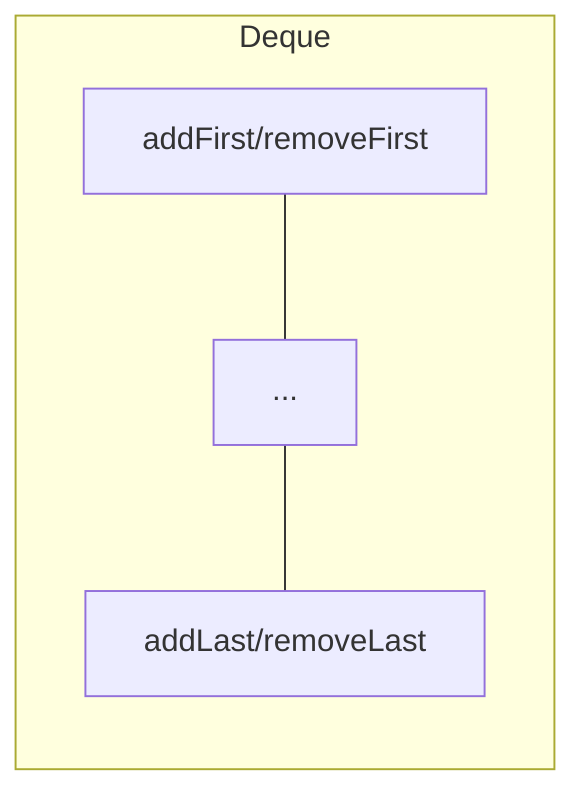

**Complexity:**

| Operation | ArrayDeque | PriorityQueue |
|---|---|---|
| Add/remove at ends | O(1) amortized | N/A (only offer/poll) |
| offer (add) | O(1) | O(log n) |
| poll (remove head) | O(1) | O(log n) |
| peek | O(1) | O(1) |

**Example:**
```java
Deque<Integer> stack = new ArrayDeque<>();
stack.push(1); stack.push(2); // LIFO via push/pop
System.out.println(stack.pop()); // 2

Queue<Integer> pq = new PriorityQueue<>();
pq.offer(5); pq.offer(1); pq.offer(3);
System.out.println(pq.poll()); // 1 - smallest first, not insertion order
```

**Advantages/Disadvantages:** `ArrayDeque` is faster and more memory-efficient than the legacy `Stack`/`LinkedList` for stack/queue use cases, with no synchronization overhead. `PriorityQueue` gives O(log n) insertion/removal with automatic ordering, but does NOT guarantee full sorted iteration order if you iterate it directly (only `poll()` returns elements in priority order).

> ⚠️ **Common misconception:** "Iterating a `PriorityQueue` with a for-each loop gives sorted order." False — the internal array only maintains the heap *invariant* (parent ≤ children), not full sorted order; only repeated `poll()` calls guarantee sorted extraction.

**Common mistake:** Using the legacy `Stack` class (extends `Vector`, fully synchronized, slower) instead of `ArrayDeque` for stack behavior in new code.

**Best intuition:** A Deque is a deck of cards you can draw from or add to at either end. A PriorityQueue is a hospital triage line — the sickest patient is always seen next, regardless of who arrived first.

**Terminology:** *FIFO/LIFO*, *binary heap*, *circular buffer*, *heap invariant*.

---

### 3.6 Iterator and Iterable

**How it works:** `Iterable<T>` has a single method, `iterator()`, which returns an `Iterator<T>`. The for-each loop (`for (T t : collection)`) is syntactic sugar the compiler translates into explicit `Iterator` calls (`hasNext()`/`next()`).

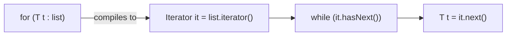

**Example:**
```java
List<String> names = new ArrayList<>(List.of("Ana", "Bob", "Cid"));
Iterator<String> it = names.iterator();
while (it.hasNext()) {
    String name = it.next();
    if (name.equals("Bob")) it.remove(); // safe removal during iteration
}
```

**Advantages:** Provides a uniform traversal contract across every collection type — array-backed, linked, tree-based, or otherwise — without callers needing to know the internal structure.

**Disadvantages:** Standard `Iterator` only supports forward traversal and single-element removal; `ListIterator` (List-specific) additionally supports backward traversal, replacing elements, and getting the current index.

> ⚠️ **Common misconception:** "You can safely remove elements from a collection while iterating with a for-each loop." False — this throws `ConcurrentModificationException`. You must use the `Iterator`'s own `remove()` method, which is specifically designed to keep the iterator's internal state consistent.

**Common mistake:** Calling `list.remove(item)` directly inside a for-each loop over `list` — this triggers `ConcurrentModificationException` because the collection's internal `modCount` changes underneath the iterator without its knowledge.

**Best intuition:** `Iterable` is "I can be walked through." `Iterator` is the actual bookmark/cursor doing the walking, one step at a time, that also knows how to safely remove the page it's currently on.

**Terminology:** *fail-fast iterator*, *modCount*, *ConcurrentModificationException*, *ListIterator*.

---

### 3.7 Comparable vs Comparator

**How it works:** `Comparable<T>` is implemented BY the class itself, defining one single "natural ordering" via `compareTo(T other)`. `Comparator<T>` is a SEPARATE object implementing `compare(T a, T b)`, allowing any number of alternative orderings without modifying the original class.

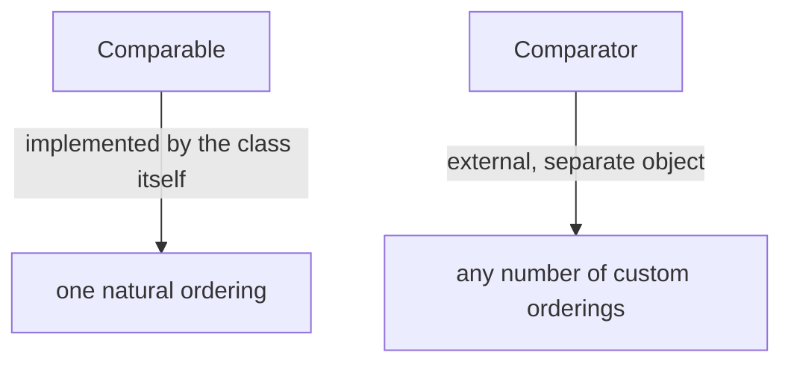

**Example:**
```java
class Person implements Comparable<Person> {
    String name; int age;
    Person(String name, int age) { this.name = name; this.age = age; }
    @Override public int compareTo(Person other) { return Integer.compare(age, other.age); } // natural order: by age
}

List<Person> people = new ArrayList<>(List.of(new Person("Ana", 30), new Person("Bob", 25)));
Collections.sort(people); // uses natural ordering (by age)

people.sort(Comparator.comparing((Person p) -> p.name)); // custom ordering (by name)
people.sort(Comparator.comparingInt((Person p) -> p.age).reversed()); // chainable, reversible
```

**Advantages:** `Comparator` allows sorting the same objects in multiple different ways at different call sites, without touching the class definition — much more flexible than being locked into one `compareTo()`.

**Disadvantages:** Having both a natural ordering (`Comparable`) and various `Comparator`s for the same class can create confusion about "which ordering is used where" if not documented clearly.

> ⚠️ **Common misconception:** "A class can only be sorted if it implements `Comparable`." False — you can always sort any list using an external `Comparator`, regardless of whether the class implements `Comparable` at all.

**Common mistake:** Implementing `compareTo()` inconsistently with `equals()` — the general contract expects `x.compareTo(y) == 0` to imply `x.equals(y)` for use in sorted collections like `TreeSet`/`TreeMap`.

**Best intuition:** `Comparable` is a person saying "here's how I naturally rank myself" (their one true ordering). `Comparator` is an external judge who can rank the same people by any criteria they choose — height, age, name — as many different ways as needed.

**Terminology:** *Natural ordering*, *comparator chaining* (`thenComparing`), *`Comparator.reversed()`*, *compareTo/equals consistency*.

---

### 3.8 The Collections Utility Class

**How it works:** `Collections` (note: singular `Collection` is the interface, plural `Collections` is this utility class) provides static methods that operate on or return collections — sorting, shuffling, finding min/max, creating unmodifiable/synchronized/empty/singleton wrapper views, and more.

**Example:**
```java
List<Integer> nums = new ArrayList<>(List.of(5, 3, 8, 1));
Collections.sort(nums);                    // [1, 3, 5, 8]
Collections.reverse(nums);                 // [8, 5, 3, 1]
System.out.println(Collections.max(nums)); // 8

List<Integer> readOnly = Collections.unmodifiableList(nums);
List<Integer> threadSafe = Collections.synchronizedList(nums);
```

**Advantages:** Centralizes common, well-tested algorithms (sorting, binary search, shuffling) so developers don't reimplement them; wrapper methods (`unmodifiableX`, `synchronizedX`) add behavior without changing the underlying collection's type.

**Disadvantages:** `Collections.synchronizedList()` and friends only guarantee safety for individual method calls, NOT compound operations (like "check-then-act" patterns) — external synchronization is still required for those.

> ⚠️ **Common misconception:** "`Collections.unmodifiableList()` creates a truly immutable, independent copy." False — it creates a *view* wrapping the original list. If the original underlying list is mutated directly, the "unmodifiable" view reflects those changes too; it only blocks modification attempts made *through the view itself*.

**Common mistake:** Assuming `Collections.synchronizedList(list)` makes iteration over the list thread-safe automatically — iterating still requires manually synchronizing on the returned list object to prevent `ConcurrentModificationException` from concurrent modifications during the iteration.

**Best intuition:** `Collections` is a toolbox of ready-made utilities that work on top of any collection, the same way `Math` is a toolbox of utilities that work on top of numbers — neither is a data structure itself, just helper functions.

**Terminology:** *Unmodifiable view* (vs. immutable copy), *synchronized wrapper*, *binary search (requires sorted input)*.

---

[[#📖 Master Table of Contents|⬆ Back to top]]

*End of Group 3. Next: Generics.*

---

## 4. Generics

### Table of Contents (this group)
- [[#4.1 What Are Generics?]]
- [[#4.2 Generic Classes]]
- [[#4.3 Generic Methods]]
- [[#4.4 Type Parameters and Naming Conventions]]
- [[#4.5 Bounded Type Parameters]]
- [[#4.6 Wildcards]]
- [[#4.7 Type Erasure]]
- [[#4.8 Generics and Inheritance (Invariance)]]
- [[#4.9 Restrictions and Limitations]]

---

### 4.1 What Are Generics?

**How it works:** Generics are a purely compile-time feature. The compiler uses type arguments to verify correctness and to insert casts automatically, then erases the type information before producing bytecode.


**Before vs after generics:**
```java
// Pre-generics (Java 1.4) - unsafe, verbose
List list = new ArrayList();
list.add("hello");
String s = (String) list.get(0);  // manual cast, ClassCastException risk
list.add(42);                     // compiles fine, blows up later

// With generics - safe, clean
List<String> list = new ArrayList<>();
list.add("hello");
String s = list.get(0);           // no cast
list.add(42);                     // compile error - caught immediately
```

**Advantages:** Compile-time type safety, elimination of manual casts, self-documenting APIs (a `Map<UserId, Order>` says far more than a raw `Map`).

**Disadvantages:** Erasure creates real limitations (no runtime type info, no generic arrays); wildcard syntax has a genuine learning curve.

> ⚠️ **Common misconception:** "Generics generate separate classes per type, like C++ templates." They don't — C++ templates are *reified* (a distinct class is generated per instantiation), while Java generics are *erased* (one class serves all type arguments).

**Best intuition:** Generics are a contract enforced by the compiler and then thrown away. The compiler is a strict inspector at build time; at runtime nobody remembers what the type argument ever was.

**Terminology:** *Type parameter* (the `T` in the declaration), *type argument* (the `String` at the use site), *parameterized type* (`List<String>`), *raw type* (`List`).

---

### 4.2 Generic Classes

**How it works:** Type parameters declared after the class name become usable throughout the class body — as field types, method parameter types, and return types. Each instantiation supplies a concrete type argument.

```java
class Pair<K, V> {
    private final K key;
    private final V value;

    Pair(K key, V value) { this.key = key; this.value = value; }

    K getKey() { return key; }
    V getValue() { return value; }

    <R> Pair<K, R> withValue(R newValue) {  // method adds its own parameter R
        return new Pair<>(key, newValue);
    }
}

Pair<String, Integer> p = new Pair<>("age", 30);
```

**The diamond operator (`<>`):** Since Java 7, the compiler infers type arguments on the right-hand side: `new ArrayList<>()` instead of `new ArrayList<String>()`. Since Java 9, it also works with anonymous inner classes.

**Advantages:** One class definition serves unlimited type combinations while retaining full type safety.

**Disadvantages:** Static members cannot use the class's type parameters (see 4.9), which sometimes forces awkward workarounds.

> ⚠️ **Common misconception:** "A generic class can have static fields of type T." It cannot — static members belong to the class itself, which is shared across all parameterizations, so there's no single `T` for them to refer to.

**Common mistake:** Using a **raw type** (`Pair p = new Pair("a", 1);`) — this silently disables generic type checking for *all* operations on that reference, not just the one you skipped, and produces unchecked warnings.

**Best intuition:** A generic class is a stencil with a blank slot. `Pair<String, Integer>` is that stencil with "String" and "Integer" penciled into the slots — but the stencil itself never changes.

**Terminology:** *Diamond operator*, *raw type*, *parameterized type*, *type inference*.

---

### 4.3 Generic Methods

**How it works:** A method declares its own type parameters in angle brackets *before* the return type. These are scoped to that method alone, so a generic method can exist in a non-generic class.

```java
class Utils {   // not a generic class
    static <T> void printAll(List<T> items) {
        for (T item : items) System.out.println(item);
    }

    static <T extends Comparable<T>> T max(T a, T b) {
        return a.compareTo(b) >= 0 ? a : b;
    }

    static <K, V> Map<V, K> invert(Map<K, V> source) {
        Map<V, K> result = new HashMap<>();
        source.forEach((k, v) -> result.put(v, k));
        return result;
    }
}
```

**Type inference:** The compiler infers T from the arguments, so you write `Utils.max(3, 7)` not `Utils.<Integer>max(3, 7)` — though the explicit form exists for the rare cases inference fails.

**Advantages:** Enables type-safe utility methods without making the entire class generic; inference keeps call sites clean.

**Disadvantages:** Inference can occasionally produce surprising results with nested generics or lambda arguments, requiring explicit type witnesses.

> ⚠️ **Common misconception:** "The `<T>` before the return type is the return type." It isn't — it's the *declaration* of the type parameter. In `static <T> T pick(...)`, the first `<T>` declares, the second `T` is the actual return type.

**Common mistake:** Forgetting to declare the type parameter and using `T` as if it were a real class, producing a "cannot find symbol: class T" compile error.

**Best intuition:** A generic method is a local variable declaration for types — `<T>` introduces T into scope the same way `int i` introduces i.

**Terminology:** *Type witness* (explicit `Class.<Type>method()` syntax), *target typing*, *type inference*.

---

### 4.4 Type Parameters and Naming Conventions

**Standard conventions:**

| Letter | Meaning | Typical use |
|---|---|---|
| `T` | Type | General-purpose single type |
| `E` | Element | Collections (`List<E>`, `Set<E>`) |
| `K` | Key | Map keys |
| `V` | Value | Map values |
| `N` | Number | Numeric type parameters |
| `R` | Result | Return type of a function (`Function<T,R>`) |
| `S`, `U` | Second, third | Additional types when T is taken |

**How it works:** These are conventions only — `class Box<Banana>` compiles fine, but every Java developer reading it will be confused. The JDK itself follows these conventions consistently, which is why they're worth adopting.

**Advantages:** Instant readability — seeing `Map<K, V>` immediately communicates intent without reading documentation.

**Disadvantages:** Single letters can become cryptic in classes with 3+ parameters; occasionally a descriptive name (`<REQUEST, RESPONSE>`) genuinely reads better.

> ⚠️ **Common misconception:** "Type parameter names have meaning to the compiler." They're arbitrary identifiers — only their *position* and *bounds* matter.

**Common mistake:** Shadowing an outer class's type parameter with the same letter in a nested class or method, causing confusing errors where `T` doesn't mean what you expect.

**Best intuition:** Type parameter names are like loop variable names — `i` for an index is convention, not law, but violating it makes everyone's life harder.

**Terminology:** *Type variable*, *scope of a type parameter*, *shadowing*.

---

### 4.5 Bounded Type Parameters

**How it works:** `<T extends Number>` tells the compiler that T is at least a `Number`, so `Number`'s methods become callable on T values. Without a bound, T is treated as `Object` and only `Object` methods are available.

```mermaid
flowchart TD
    A["&lt;T&gt; unbounded"] --> B["Only Object methods available"]
    C["&lt;T extends Number&gt;"] --> D["Number methods available: intValue, doubleValue..."]
    E["&lt;T extends Comparable&lt;T&gt;&gt;"] --> F["compareTo available - enables sorting"]
```

```java
// Unbounded - can't do arithmetic
static <T> double sumBad(List<T> nums) {
    // nums.get(0).doubleValue(); // compile error - T is just Object
    return 0;
}

// Bounded - works
static <T extends Number> double sum(List<T> nums) {
    double total = 0;
    for (T n : nums) total += n.doubleValue();  // legal now
    return total;
}
```

**Multiple bounds:** `<T extends Number & Comparable<T>>` requires T to satisfy both. The class bound (if any) must come first; the rest must be interfaces.

**Advantages:** Unlocks the bounded type's API inside generic code; documents constraints in the signature itself.

**Disadvantages:** Over-constraining a bound narrows who can use your API unnecessarily.

> ⚠️ **Common misconception:** "`extends` in a bound means class inheritance only." In bounds, `extends` covers both classes and interfaces — you write `<T extends Comparable<T>>` even though `Comparable` is an interface, never `implements`.

**Common mistake:** Writing `<T extends Comparable>` (raw) instead of `<T extends Comparable<T>>`, which loses type safety in the comparison and reintroduces unchecked warnings.

**Best intuition:** An unbounded `T` is a sealed box — you know something's inside but can only do generic things with it. A bound is a label saying "contains a Number," which lets you act on it meaningfully.

**Terminology:** *Upper bound*, *multiple bounds*, *recursive generic bound* (`<T extends Comparable<T>>`).

---

### 4.6 Wildcards

**The three forms:**

| Form | Name | Read? | Write? | Use when |
|---|---|---|---|---|
| `List<?>` | Unbounded | Yes (as Object) | No (except null) | Type genuinely irrelevant |
| `List<? extends T>` | Upper-bounded | Yes (as T) | No | You're **consuming/reading** |
| `List<? super T>` | Lower-bounded | Only as Object | Yes (T and subtypes) | You're **producing/writing** |

**PECS — Producer Extends, Consumer Super:** The mnemonic for choosing. If the parameter *produces* values for you to read, use `extends`. If it *consumes* values you write into it, use `super`.

```java
// Producer: we READ from source -> extends
static double sumAll(List<? extends Number> source) {
    double total = 0;
    for (Number n : source) total += n.doubleValue();
    // source.add(1); // illegal - compiler can't know the actual element type
    return total;
}

// Consumer: we WRITE into dest -> super
static void addNumbers(List<? super Integer> dest) {
    dest.add(1);
    dest.add(2);
    // Integer i = dest.get(0); // illegal - could be List<Object>
}

List<Integer> ints = List.of(1, 2, 3);
sumAll(ints);   // works - List<Integer> matches ? extends Number

List<Number> nums = new ArrayList<>();
addNumbers(nums); // works - List<Number> matches ? super Integer
```

**Why `? extends T` blocks writes:** Given `List<? extends Number>`, the actual list could be `List<Integer>` or `List<Double>`. Adding a `Double` to what might be a `List<Integer>` would break type safety, so the compiler forbids all adds.

**Advantages:** Makes APIs dramatically more flexible while preserving safety.

**Disadvantages:** Syntax is genuinely hard for newcomers; deeply nested wildcards become unreadable fast.

> ⚠️ **Common misconception:** "`List<?>` and `List<Object>` are the same." They're very different — `List<Object>` accepts any object as an element and permits adds; `List<?>` means "a list of some specific unknown type" and permits almost no adds.

**Common mistake:** Using `? extends T` on a parameter you need to add elements to, then being confused why `add()` won't compile. Check which direction data flows first — PECS answers it every time.

**Best intuition:** `extends` = "I promise only to take things out." `super` = "I promise only to put things in." The compiler enforces the promise you declared.

**Terminology:** *PECS*, *covariance* (`? extends`), *contravariance* (`? super`), *capture conversion*.

---

### 4.7 Type Erasure

**How it works:** The compiler replaces each type parameter with its leftmost bound (or `Object` if unbounded), inserts casts where needed, and generates bridge methods to preserve polymorphism.

```java
// What you write
class Box<T extends Number> {
    private T value;
    T get() { return value; }
}

// What the bytecode effectively contains
class Box {
    private Number value;   // T replaced by its bound
    Number get() { return value; }
}
```

```mermaid
flowchart TD
    A["List&lt;String&gt;"] --> C["Erased to: List"]
    B["List&lt;Integer&gt;"] --> C
    C --> D["Same Class object at runtime"]
```

**Provable consequences:**
```java
List<String> a = new ArrayList<>();
List<Integer> b = new ArrayList<>();
System.out.println(a.getClass() == b.getClass()); // true - same class!
```

**Why it exists:** Generics arrived in Java 5, a decade after Java 1.0. Erasure guaranteed that pre-generics code and libraries kept working unchanged — *migration compatibility* was the driving constraint.

**Advantages:** Full backward compatibility with legacy code; no bytecode bloat from per-type class generation.

**Disadvantages:** No runtime type information, which causes every restriction in section 4.9.

> ⚠️ **Common misconception:** "You can get the type argument at runtime via reflection." Generally not for a plain object — but there's a genuine exception: type arguments in a class's *declaration* (e.g., `class StringList extends ArrayList<String>`) or in field/method signatures ARE retained in metadata and readable via `getGenericSuperclass()`. This is exactly what libraries like Jackson's `TypeReference` and Spring's `ParameterizedTypeReference` exploit.

**Common mistake:** Trying `if (list instanceof List<String>)` — illegal at compile time, because that information doesn't exist at runtime.

**Best intuition:** Erasure is scaffolding around a building under construction. It shapes everything during the build, then gets removed — the finished building has no trace of it.

**Terminology:** *Erasure*, *bridge method*, *reification* (what Java generics are NOT), *migration compatibility*.

---

### 4.8 Generics and Inheritance (Invariance)

**How it works:** Generic types are **invariant**: `List<Integer>` is neither a subtype nor a supertype of `List<Number>`, despite `Integer extends Number`.

```mermaid
flowchart TD
    A["Integer IS-A Number ✓"] --> B["List&lt;Integer&gt; IS-A List&lt;Number&gt; ✗"]
    B --> C["Invariance prevents this hole"]
```

**Why the rule must exist:**
```java
List<Integer> ints = new ArrayList<>();
// List<Number> nums = ints;  // ILLEGAL - imagine if it compiled...
// nums.add(3.14);            // ...we'd have inserted a Double into a List<Integer>
// Integer i = ints.get(0);   // ...ClassCastException at runtime
```

**The array contrast:** Arrays *are* covariant (`Integer[]` IS-A `Object[]`), which is a known design flaw — it defers the error to runtime as `ArrayStoreException` instead of catching it at compile time.

```java
Object[] arr = new Integer[3];
arr[0] = "oops";  // compiles fine, throws ArrayStoreException at runtime
```

**Advantages:** Genuine compile-time safety, with no runtime store checks required.

**Disadvantages:** Makes APIs rigid by default — which is exactly the problem wildcards were introduced to solve.

> ⚠️ **Common misconception:** "Invariance is an arbitrary restriction." It's the direct, necessary consequence of erasure plus mutability — the array covariance example shows what the alternative costs you.

**Common mistake:** Writing `void process(List<Number> items)` and then discovering callers can't pass a `List<Integer>`. Use `List<? extends Number>` instead.

**Best intuition:** A box of apples is not a box of fruit — because someone could put a banana in a "box of fruit," and that would ruin your apple box.

**Terminology:** *Invariance*, *covariance*, *contravariance*, *ArrayStoreException*.

---

### 4.9 Restrictions and Limitations

**The full list, each a consequence of erasure:**

| Restriction | Why | Workaround |
|---|---|---|
| No `new T()` | T unknown at runtime | Pass a `Supplier<T>` or `Class<T>` |
| No `new T[10]` | Can't create typed array | `(T[]) new Object[10]` with `@SuppressWarnings` |
| No primitives (`List<int>`) | Erasure needs a reference type | Use wrappers (`List<Integer>`) |
| No `instanceof List<String>` | Type arg gone at runtime | `instanceof List<?>` |
| No static fields of type T | Static is shared across all parameterizations | Make the member generic instead |
| No generic exception classes | catch blocks resolved at runtime | Use a non-generic exception with a typed field |
| Can't overload on erased signature | `f(List<String>)` and `f(List<Integer>)` erase identically | Rename one method |

```java
class Registry<T> {
    // static T defaultValue;              // ILLEGAL
    // T create() { return new T(); }      // ILLEGAL

    T create(Supplier<T> factory) {        // legal workaround
        return factory.get();
    }

    T create(Class<T> type) throws Exception {   // reflection workaround
        return type.getDeclaredConstructor().newInstance();
    }
}
```

**Advantages:** These constraints are the price paid for backward compatibility — a trade Java deliberately accepted.

**Disadvantages:** Some genuinely useful patterns require awkward workarounds (`Class<T>` tokens, `Supplier<T>` factories) that other languages handle natively.

> ⚠️ **Common misconception:** "These limits will be fixed in a future Java version." Project Valhalla is exploring specialized generics for value types, but full reification would break decades of binary compatibility — the erasure model is effectively permanent for reference types.

**Common mistake:** Attempting `List<String>[] arrays = new List<String>[10];` — illegal. Use `List<List<String>>` instead, which sidesteps the generic array problem entirely.

**Best intuition:** Every restriction traces back to one question: "does the JVM know T at runtime?" The answer is no, so anything requiring that knowledge is forbidden.

**Terminology:** *Reifiable type*, *type token* (`Class<T>`), *heap pollution*, *unchecked warning*.

---

[[#📖 Master Table of Contents|⬆ Back to top]]

*End of Group 4. Next: Exception Handling.*

---

## 5. Exception Handling

### Table of Contents (this group)
- [[#5.1 What Is an Exception?]]
- [[#5.2 The Throwable Hierarchy]]
- [[#5.3 Checked vs Unchecked Exceptions]]
- [[#5.4 try-catch-finally]]
- [[#5.5 throw and throws]]
- [[#5.6 try-with-resources]]
- [[#5.7 Custom Exceptions]]
- [[#5.8 Exception Chaining]]
- [[#5.9 Stack Traces]]
- [[#5.10 Errors vs Exceptions]]

---

### 5.1 What Is an Exception?

**How it works:** When something goes wrong, the JVM (or your code) creates a `Throwable` object and begins *stack unwinding* — walking back up the call stack looking for a matching `catch` block. If none is found anywhere, the thread terminates and the trace is printed.

```mermaid
flowchart TD
    A["method3() throws exception"] --> B{"catch in method3?"}
    B -- No --> C{"catch in method2?"}
    C -- No --> D{"catch in method1?"}
    D -- No --> E["Thread terminates, trace printed"]
    B -- Yes --> F["Handled, execution continues"]
    C -- Yes --> F
    D -- Yes --> F
```

**Relationships:** Exceptions interact directly with `finally` and try-with-resources (cleanup during unwinding), and with threads — an uncaught exception kills only the thread it occurred on, not necessarily the whole JVM.

**Advantages:** Errors can't be silently ignored the way return codes can; error-handling code stays separate from the main logic path; rich diagnostic context travels with the failure.

**Disadvantages:** Creating an exception captures the full stack trace, which is genuinely expensive — exceptions used for ordinary control flow can measurably slow a hot path.

> ⚠️ **Common misconception:** "Throwing an exception is cheap." The `throw` itself is fast, but constructing the exception object calls `fillInStackTrace()`, which walks the entire call stack. This is why exceptions must never be used for expected, routine outcomes.

**Common mistake:** Using exceptions as control flow — for example, throwing to break out of a loop, or relying on `NumberFormatException` to test whether a string is numeric in a tight parsing loop.

**Best intuition:** An exception is an emergency flare, not a turn signal. It's for situations the current method genuinely cannot resolve, not for routine branching.

**Terminology:** *Throw*, *catch*, *stack unwinding*, *propagation*, *handler*.

---

### 5.2 The Throwable Hierarchy

**The structure:**

```mermaid
classDiagram
    Throwable <|-- Error
    Throwable <|-- Exception
    Exception <|-- RuntimeException
    Exception <|-- IOException
    Error <|-- OutOfMemoryError
    Error <|-- StackOverflowError
    RuntimeException <|-- NullPointerException
    RuntimeException <|-- IllegalArgumentException
    IOException <|-- FileNotFoundException
```

**How it works:** A `catch` block matches if the thrown object is an instance of the declared type *or any of its subtypes*. This is why `catch (Exception e)` catches nearly everything, and why more specific catches must come first.

**Key members inherited from `Throwable`:** `getMessage()`, `getCause()`, `getStackTrace()`, `printStackTrace()`, and `addSuppressed()` (used by try-with-resources).

**Advantages:** The hierarchy allows both precise handling (`catch (FileNotFoundException e)`) and broad safety nets (`catch (IOException e)`) using the same mechanism.

**Disadvantages:** The inheritance-based matching makes it easy to accidentally over-catch — `catch (Exception e)` silently swallows `RuntimeException`s that indicate real bugs.

> ⚠️ **Common misconception:** "`Exception` is the root of everything throwable." `Throwable` is the root; `Exception` and `Error` are siblings beneath it. This matters because `catch (Exception e)` does *not* catch `Error`s.

**Common mistake:** Ordering catch blocks from general to specific — the compiler rejects this, since an unreachable specific block after a general one is a definite error.

**Best intuition:** The hierarchy is a filter with adjustable mesh size. Catching a leaf type is a fine mesh; catching `Exception` is a net that stops almost everything, including things you'd rather let through.

**Terminology:** *Throwable*, *catch matching*, *unreachable catch block*, *suppressed exception*.

---

### 5.3 Checked vs Unchecked Exceptions

**How the compiler decides:** Anything extending `Exception` but *not* `RuntimeException` is checked. `RuntimeException` and its subclasses, plus everything under `Error`, are unchecked.

```mermaid
flowchart TD
    T["Throwable"] --> E["Error - unchecked"]
    T --> X["Exception"]
    X --> R["RuntimeException - unchecked"]
    X --> C["All other Exceptions - CHECKED"]
```

**Comparison:**

| | Checked | Unchecked |
|---|---|---|
| Compiler enforces handling | Yes | No |
| Extends | `Exception` (not RuntimeException) | `RuntimeException` or `Error` |
| Intended for | Recoverable external conditions | Programming errors |
| Examples | `IOException`, `SQLException` | `NullPointerException`, `IllegalArgumentException` |

**Example:**
```java
// Checked - must handle or declare
void readFile() throws IOException {
    Files.readString(Path.of("data.txt"));
}

// Unchecked - no declaration required
void divide(int a, int b) {
    if (b == 0) throw new IllegalArgumentException("b must not be zero");
}
```

**Advantages of checked:** The compiler guarantees the caller at least acknowledges the failure mode; API contracts are explicit in the signature.

**Disadvantages of checked:** They propagate virally up call stacks, encourage empty catch blocks as a shortcut, and interact badly with lambdas (functional interfaces like `Function` declare no checked exceptions).

> ⚠️ **Common misconception:** "Checked exceptions are objectively better practice because the compiler enforces them." This is genuinely contested. Modern frameworks — Spring is the clearest example, wrapping `SQLException` into unchecked `DataAccessException` — deliberately favor unchecked exceptions, and newer JVM languages omit checked exceptions entirely. Both positions have serious advocates; know the trade-off rather than a single verdict.

**Common mistake:** Declaring `throws Exception` on a method signature. It technically satisfies the compiler but destroys the information the mechanism exists to convey.

**Best intuition:** Checked = "the world outside might fail, and you should have a plan." Unchecked = "your code has a bug; fix the code rather than catching this."

**Terminology:** *Checked*, *unchecked*, *catch-or-declare requirement*, *exception translation*.

---

### 5.4 try-catch-finally

**Execution order:**

```mermaid
flowchart TD
    A["try block starts"] --> B{"Exception thrown?"}
    B -- No --> C["try completes"]
    B -- Yes --> D{"Matching catch?"}
    D -- Yes --> E["catch runs"]
    D -- No --> F["Propagates up"]
    C --> G["finally ALWAYS runs"]
    E --> G
    F --> G
    G --> H["Continue or propagate"]
```

**Multi-catch (Java 7+):**
```java
try {
    process();
} catch (IOException | SQLException e) {   // one block, two types
    log.error("Processing failed", e);
} finally {
    cleanup();
}
```

**The `finally` override trap:**
```java
static int trap() {
    try {
        return 1;
    } finally {
        return 2;   // discards the try's return value entirely
    }
}
// returns 2 - and any exception in try would be silently discarded too
```

**Advantages:** Guaranteed cleanup; multi-catch removes duplicated handling code; clear separation of the failure path from the happy path.

**Disadvantages:** Nested try blocks quickly become unreadable; `finally` has genuinely surprising interactions with `return`.

> ⚠️ **Common misconception:** "`finally` always runs, no matter what." Almost always — but not if `System.exit()` is called, if the JVM crashes, or if the thread is killed at the OS level. It *does* run on `return`, `break`, and propagating exceptions.

**Common mistake:** Putting `return` or `throw` inside `finally`. It silently discards whatever the `try` block was returning or throwing, including real exceptions — one of the nastiest silent-failure patterns in Java.

**Best intuition:** `finally` is the "no matter how this ends" clause. Anything that must happen — releasing a lock, closing a handle — belongs there, but nothing that *decides the outcome* does.

**Terminology:** *Multi-catch*, *finally block*, *swallowed exception*, *effectively final* (multi-catch parameters are implicitly final).

---

### 5.5 throw and throws

**How they differ:**

| | `throw` | `throws` |
|---|---|---|
| Where | Inside a method body | In the method signature |
| Purpose | Actually raises an exception | Declares what may be raised |
| Count | One exception per statement | Comma-separated list |

```java
public void withdraw(double amount) throws InsufficientFundsException {
    if (amount > balance) {
        throw new InsufficientFundsException("Balance too low");
    }
    balance -= amount;
}
```

**Overriding rules:** An overriding method may declare fewer or narrower checked exceptions than the parent, but never broader ones — otherwise code written against the parent type couldn't handle what the subclass throws.

```java
class Parent { void m() throws IOException {} }
class Child extends Parent {
    @Override void m() throws FileNotFoundException {}  // OK - narrower
    // @Override void m() throws Exception {}           // ILLEGAL - broader
}
```

**Advantages:** `throws` makes failure modes part of the public contract, visible in the signature and in generated documentation.

**Disadvantages:** `throws` clauses propagate up the call chain, forcing intermediate methods that can't do anything useful to either declare or wrap.

> ⚠️ **Common misconception:** "`throws` means the method definitely throws." It means the method *may* throw — it's a declaration of possibility, not a guarantee.

**Common mistake:** Declaring `throws` for unchecked exceptions. It's legal and occasionally used as documentation, but it's not enforced and can mislead readers into thinking the exception is checked.

**Best intuition:** `throw` is pulling the fire alarm. `throws` is the sign on the door saying "this room contains an alarm that might go off."

**Terminology:** *Throws clause*, *covariant exception declaration*, *exception contract*.

---

### 5.6 try-with-resources

**How it works:** Any object implementing `AutoCloseable` declared in the try's parentheses is closed automatically when the block exits — in *reverse* declaration order, and before any catch or finally block runs.

```java
// Manual, pre-Java-7 - verbose and error-prone
BufferedReader r = null;
try {
    r = new BufferedReader(new FileReader("f.txt"));
    return r.readLine();
} finally {
    if (r != null) r.close();   // close() itself can throw, masking the original
}

// try-with-resources - correct and concise
try (BufferedReader r = new BufferedReader(new FileReader("f.txt"))) {
    return r.readLine();
}
```

**Multiple resources close in reverse order:**
```java
try (Connection conn = getConnection();
     PreparedStatement stmt = conn.prepareStatement(sql);
     ResultSet rs = stmt.executeQuery()) {
    // rs closed first, then stmt, then conn
}
```

**Suppressed exceptions:** If the body throws *and* `close()` also throws, the body's exception propagates and the close exception is attached as *suppressed*, retrievable via `getSuppressed()`. The old manual pattern lost the original entirely.

**Advantages:** Eliminates resource leaks; preserves the more informative exception; far less boilerplate.

**Disadvantages:** Only works with `AutoCloseable` types; resource variables are implicitly final and cannot be reassigned inside the block.

> ⚠️ **Common misconception:** "try-with-resources replaces `finally`." It replaces `finally` *for closing resources*. Other cleanup — releasing a lock, resetting a flag, emitting a metric — still needs an explicit `finally`, which you can combine with try-with-resources.

**Common mistake:** Constructing resources outside the parentheses and passing only the reference in Java 8 — this was fixed in Java 9, which allows effectively-final external variables directly in the resource list.

**Best intuition:** try-with-resources is a valet: you hand over the thing at the door, and it's guaranteed to be returned properly however the evening ends.

**Terminology:** *AutoCloseable*, *Closeable*, *suppressed exception*, *reverse close order*.

---

### 5.7 Custom Exceptions

**How to write one properly:**
```java
public class InsufficientFundsException extends RuntimeException {
    private final BigDecimal shortfall;

    public InsufficientFundsException(String message, BigDecimal shortfall, Throwable cause) {
        super(message, cause);          // always preserve the cause
        this.shortfall = shortfall;     // carry structured context
    }

    public BigDecimal getShortfall() { return shortfall; }
}
```

**Choosing the base class:** Extend `RuntimeException` when the caller usually can't recover meaningfully (most business-rule violations); extend `Exception` when you genuinely want to force callers to plan for it.

**Advantages:** Domain-meaningful names make logs and stack traces self-explanatory; structured fields let callers react programmatically rather than parsing message strings.

**Disadvantages:** An exception class per error condition bloats the codebase; too fine a granularity makes catch blocks unwieldy.

> ⚠️ **Common misconception:** "Every distinct error deserves its own exception class." Prefer a small number of well-designed exception types carrying structured detail (an error code, a field name) over dozens of near-identical classes.

**Common mistake:** Omitting the constructor that accepts a `cause`. Without it, callers wrapping a lower-level failure have no way to preserve the original, and the root cause vanishes from the stack trace.

**Best intuition:** A custom exception is a domain noun. `InsufficientFundsException` reads like a business rule; `ProcessingException` reads like someone gave up naming it.

**Terminology:** *Exception translation*, *cause*, *domain exception*, *error code*.

---

### 5.8 Exception Chaining

**How it works:** Passing the original exception as the `cause` argument preserves the full causal chain. `printStackTrace()` renders it as a series of "Caused by:" sections.

```java
try {
    jdbcTemplate.query(sql);
} catch (SQLException e) {
    throw new UserLookupException("Failed to load user " + id, e);  // e is the cause
}
```

**Resulting trace shape:**
```
UserLookupException: Failed to load user 42
    at UserRepository.findById(UserRepository.java:31)
    ...
Caused by: SQLException: connection timed out
    at ...
```

**Advantages:** Callers see a meaningful, layer-appropriate exception while debuggers retain the low-level root cause; abstraction boundaries stay clean without losing diagnostics.

**Disadvantages:** Deeply nested chains (four or five "Caused by" layers) become noisy, and each wrap adds a stack trace to capture.

> ⚠️ **Common misconception:** "Wrapping an exception replaces the original." It nests it. The original is fully preserved and reachable via `getCause()` — nothing is lost, provided you actually pass the cause.

**Common mistake:** `throw new ServiceException("Failed: " + e.getMessage());` — this drops the cause, discarding the original stack trace and leaving only a message fragment. Pass `e` as the second argument instead.

**Best intuition:** Chaining is a paper trail. Each layer adds its own summary on top without shredding the document underneath.

**Terminology:** *Cause*, *wrapping*, *exception translation*, *root cause*.

---

### 5.9 Stack Traces

**Anatomy:**
```
Exception in thread "main" java.lang.NullPointerException: Cannot invoke "String.length()" because "s" is null
    at com.example.Service.process(Service.java:42)      <- where it happened
    at com.example.Controller.handle(Controller.java:18)  <- who called that
    at com.example.Main.main(Main.java:9)                 <- entry point
```

**Read top-down for "where," bottom-up for "how we got here."** The topmost application frame (skipping library frames) is almost always where your investigation starts.

**Helpful NullPointerExceptions (Java 14+):** Modern JVMs name the exact expression that was null — `because "s" is null` — rather than just giving a line number. This is enabled by default from Java 15 onward.

**Advantages:** Pinpoints the failure location and the full call path; costs nothing to obtain since it's captured automatically.

**Disadvantages:** Capturing a trace is the expensive part of exception creation; traces from proxied or lambda-heavy framework code contain many synthetic frames that obscure the signal.

> ⚠️ **Common misconception:** "The top line of a stack trace is always the bug." The top frame is where the failure *surfaced*, often deep inside library code. The bug is usually in the topmost frame belonging to your own package.

**Common mistake:** Calling `e.printStackTrace()` instead of logging. It writes to `System.err`, bypassing log aggregation, log levels, and correlation IDs — so in a production service, the trace effectively disappears.

**Best intuition:** A stack trace is a receipt showing every method that was mid-execution, most recent first.

**Terminology:** *Stack frame*, *fillInStackTrace*, *helpful NullPointerException*, *synthetic frame*.

---

### 5.10 Errors vs Exceptions

**How they differ in intent:**

| | `Error` | `Exception` |
|---|---|---|
| Represents | JVM/system-level failure | Application-level condition |
| Recoverable | Generally no | Generally yes |
| Should you catch it | Almost never | Yes, where meaningful |
| Examples | `OutOfMemoryError`, `StackOverflowError` | `IOException`, `IllegalArgumentException` |

**Why you shouldn't catch `Error`:** By the time an `OutOfMemoryError` fires, the JVM's state is already compromised — the handler itself may fail to allocate. `StackOverflowError` is similar: it signals a bug (usually unbounded recursion) that catching only hides.

**The one nuance:** Top-level frameworks and thread pools sometimes catch `Throwable` deliberately, purely to log the failure before the thread dies. That is a legitimate, narrow exception to the rule — and it should always rethrow or terminate, never continue as if nothing happened.

**Advantages of the split:** The type hierarchy encodes recoverability, so `catch (Exception e)` naturally excludes the things you shouldn't be handling.

**Disadvantages:** The boundary isn't perfectly clean — `StackOverflowError` is arguably recoverable in some interpreter-style workloads, but it's classified as an `Error` anyway.

> ⚠️ **Common misconception:** "Catching `Throwable` is a good defensive safety net." It swallows `OutOfMemoryError` and `StackOverflowError`, letting a fatally-damaged JVM limp along producing corrupt results instead of failing fast and visibly.

**Common mistake:** Writing `catch (Throwable t)` in application code as a catch-all. Use `catch (Exception e)` unless you're writing a framework-level boundary that logs and rethrows.

**Best intuition:** Exceptions are problems with the work. Errors are problems with the workshop — you don't handle a collapsing building by catching it.

**Terminology:** *Fatal error*, *unrecoverable*, *fail-fast*, *uncaught exception handler*.

---

[[#📖 Master Table of Contents|⬆ Back to top]]

*End of Group 5. Next: Streams, Lambdas & Functional Programming.*

---

## 6. Streams, Lambdas & Functional Programming

### Table of Contents (this group)
- [[#6.1 What Is Functional Programming in Java?]]
- [[#6.2 Lambda Expressions]]
- [[#6.3 Functional Interfaces]]
- [[#6.4 Built-in Functional Interfaces]]
- [[#6.5 Method References]]
- [[#6.6 What Is a Stream?]]
- [[#6.7 Intermediate Operations]]
- [[#6.8 Terminal Operations]]
- [[#6.9 Collectors]]
- [[#6.10 Optional]]
- [[#6.11 Parallel Streams]]

---

### 6.1 What Is Functional Programming in Java?

**How it works:** Java is not a functional language — it's an object-oriented language with functional *features* grafted on. Lambdas are compiled to instances of functional interfaces (via `invokedynamic`), not to a distinct function type.

**Core principles Java adopted:**

| Principle | Java's support |
|---|---|
| Functions as values | Via functional interfaces + lambdas |
| Immutability | Encouraged (`final`, records) but not enforced |
| Pure functions (no side effects) | Convention only, not enforced |
| Declarative composition | Stream pipelines, `Function.andThen` |

**Relationships:** Lambdas need functional interfaces to have a type; streams need lambdas to express operations; `Optional` applies the same map/filter vocabulary to a single value instead of a sequence. The whole group is one interlocking design.

**Advantages:** More readable for data transformation; easier to parallelize; less boilerplate than anonymous classes.

**Disadvantages:** Stack traces become harder to read; debugging a pipeline is harder than stepping through a loop; overuse produces unreadable one-liners.

> ⚠️ **Common misconception:** "Streams are faster than loops." Usually the opposite for simple operations — a plain `for` loop over an array typically beats a stream, because streams add pipeline setup and megamorphic call overhead. Streams are for *clarity*, and their performance is competitive rather than superior.

**Common mistake:** Rewriting every loop as a stream. A three-line loop that reads clearly gains nothing from becoming a stream chain.

**Best intuition:** Imperative code is turn-by-turn driving directions. Functional code is giving the destination and letting the navigation system pick the route.

**Terminology:** *Declarative*, *pure function*, *side effect*, *higher-order function*, *invokedynamic*.

---

### 6.2 Lambda Expressions

**Syntax forms:**
```java
() -> System.out.println("hi")            // no params
x -> x * 2                                 // one param, parens optional
(x, y) -> x + y                            // multiple params
(String s) -> s.length()                   // explicit type
x -> { int y = x * 2; return y + 1; }      // block body needs return
```

**How it compiles:** Lambdas do *not* generate an anonymous inner class file. The compiler emits an `invokedynamic` instruction, and the JVM builds the implementation at runtime via `LambdaMetafactory` — often reusing a single instance for stateless lambdas.

```mermaid
flowchart LR
    A["Lambda in source"] --> B["invokedynamic bytecode"]
    B --> C["LambdaMetafactory at runtime"]
    C --> D["Functional interface instance"]
```

**Variable capture:** A lambda can only use local variables that are `final` or *effectively final* (never reassigned after initialization).

```java
int count = 0;
Runnable r = () -> System.out.println(count);  // OK - effectively final
// count++;   // adding this breaks the lambda above - no longer effectively final
```

**`this` semantics:** Inside a lambda, `this` refers to the *enclosing* instance. Inside an anonymous inner class, `this` refers to the anonymous class itself. This is a genuine behavioral difference, not just syntax.

**Advantages:** Concise; no synthetic class files; better JIT optimization potential than anonymous classes.

**Disadvantages:** No name means no self-recursion; stack traces show synthetic names like `lambda$process$0`.

> ⚠️ **Common misconception:** "A lambda is just syntactic sugar for an anonymous inner class." They compile completely differently — anonymous classes produce a `.class` file per instance site and always allocate a new object; lambdas use `invokedynamic` and may reuse one instance.

**Common mistake:** Trying to mutate a captured local variable, then working around the compiler error with a one-element array (`int[] counter = {0}`). It compiles, but it's a side effect hiding in functional clothing — and it breaks under parallelism.

**Best intuition:** A lambda is a value that happens to be behavior — you can store it, pass it, and return it like any other object.

**Terminology:** *Effectively final*, *capture*, *invokedynamic*, *LambdaMetafactory*, *target type*.

---

### 6.3 Functional Interfaces

**How it works:** Any interface with exactly one abstract method qualifies. Default and static methods don't count toward the total, which is why `Comparator` remains functional despite having many default methods.

```java
@FunctionalInterface
interface Validator<T> {
    boolean validate(T input);              // the single abstract method

    default Validator<T> and(Validator<T> other) {   // doesn't break functional status
        return x -> this.validate(x) && other.validate(x);
    }
}
```

**The `@FunctionalInterface` annotation** is optional but valuable: it makes the compiler reject the interface if someone later adds a second abstract method, protecting every lambda already written against it.

**Pre-existing functional interfaces:** `Runnable`, `Callable`, `Comparator`, and `ActionListener` all became lambda-compatible retroactively — they already had exactly one abstract method.

**Advantages:** Reuses the existing type system; lambdas gain full type checking; interfaces can be extended with default methods without breaking implementations.

**Disadvantages:** Every lambda shape needs a corresponding interface, which is why `java.util.function` has over forty of them.

> ⚠️ **Common misconception:** "`@FunctionalInterface` is required for lambdas to work." It isn't — it's purely a compile-time safety check. Any interface with one abstract method accepts a lambda, annotated or not.

**Common mistake:** Writing a custom functional interface when a built-in one already fits. `interface StringTransformer { String apply(String s); }` is just `Function<String, String>`.

**Best intuition:** A functional interface is a shape — "takes one thing, returns a boolean." The lambda is something that fits that shape.

**Terminology:** *SAM (Single Abstract Method) interface*, *target typing*, *default method*.

---

### 6.4 Built-in Functional Interfaces

**The four core shapes:**

| Interface | Method | Takes | Returns | Use for |
|---|---|---|---|---|
| `Function<T,R>` | `apply` | T | R | Transformation |
| `Predicate<T>` | `test` | T | boolean | Filtering / conditions |
| `Consumer<T>` | `accept` | T | void | Side effects |
| `Supplier<T>` | `get` | nothing | T | Lazy production |

**Important variants:**

| Interface | Shape |
|---|---|
| `BiFunction<T,U,R>` | Two inputs, one output |
| `UnaryOperator<T>` | `Function<T,T>` — same type in and out |
| `BinaryOperator<T>` | `BiFunction<T,T,T>` — used by `reduce` |
| `BiPredicate<T,U>` | Two inputs, boolean |
| `IntFunction`, `IntPredicate`, `ToIntFunction`... | Primitive specializations |

**Why primitive specializations exist:** `Function<Integer, Integer>` boxes on every call. `IntUnaryOperator` works on raw `int`, avoiding allocation entirely — significant in hot loops.

**Composition:**
```java
Function<Integer,Integer> doubled = x -> x * 2;
Function<Integer,Integer> plusTen = x -> x + 10;

doubled.andThen(plusTen).apply(5);   // 20 -> then +10 -> 20? No: (5*2)+10 = 20
doubled.compose(plusTen).apply(5);   // (5+10)*2 = 30

Predicate<String> notEmpty = s -> !s.isEmpty();
Predicate<String> shortStr = s -> s.length() < 10;
notEmpty.and(shortStr).test("hello");   // true
```

**Advantages:** Standardized vocabulary understood across every Java library; built-in composition methods.

**Disadvantages:** Over forty interfaces to remember; naming (`compose` vs `andThen`) is easy to invert.

> ⚠️ **Common misconception:** "`andThen` and `compose` are the same in reverse, so it doesn't matter which you use." Order genuinely differs — `f.andThen(g)` runs f first, `f.compose(g)` runs g first. With non-commutative operations, this changes the result.

**Common mistake:** Using `Function<Integer,Integer>` in numeric hot paths instead of `IntUnaryOperator`, silently boxing millions of values.

**Best intuition:** Four verbs cover almost everything: *transform* (Function), *test* (Predicate), *consume* (Consumer), *produce* (Supplier).

**Terminology:** *Primitive specialization*, *boxing overhead*, *function composition*.

---

### 6.5 Method References

**The four forms:**

| Form | Syntax | Equivalent lambda |
|---|---|---|
| Static method | `Integer::parseInt` | `s -> Integer.parseInt(s)` |
| Instance method of a particular object | `System.out::println` | `x -> System.out.println(x)` |
| Instance method of an arbitrary object | `String::toUpperCase` | `s -> s.toUpperCase()` |
| Constructor | `ArrayList::new` | `() -> new ArrayList<>()` |

**The confusing pair:** `String::toUpperCase` and `System.out::println` look identical in structure but differ fundamentally — in the first, the receiver becomes the lambda's *parameter*; in the second, the receiver is a *fixed object* already chosen.

```java
// Arbitrary object: the stream element becomes the receiver
names.stream().map(String::toUpperCase);      // s -> s.toUpperCase()

// Particular object: System.out is fixed, element becomes the argument
names.forEach(System.out::println);            // s -> System.out.println(s)
```

**Advantages:** Removes naming noise; often clearer intent; no parameter names to invent.

**Disadvantages:** Ambiguous when overloads exist; harder to read for those unfamiliar with the four forms; you can't add logic without converting back to a lambda.

> ⚠️ **Common misconception:** "Method references are always more readable." When the target method's name doesn't convey what's happening in context, an explicit lambda with a well-named parameter reads better.

**Common mistake:** Reaching for a method reference when the lambda needs even trivial extra work (a null check, an argument reorder) — you then have to expand it back, so starting with the lambda is often simpler.

**Best intuition:** A method reference says "call this existing method"; a lambda says "here's what to do." Use the reference when there's genuinely nothing to add.

**Terminology:** *Bound receiver* (particular object), *unbound receiver* (arbitrary object), *constructor reference*.

---

### 6.6 What Is a Stream?

**Pipeline anatomy:**

```mermaid
flowchart LR
    A["Source: collection, array, generator"] --> B["Intermediate: filter, map, sorted"]
    B --> C["Intermediate: more operations"]
    C --> D["Terminal: collect, forEach, reduce"]
    D --> E["Result"]
```

**Three defining properties:**
1. **No storage** — a stream doesn't hold elements; it pulls them from a source.
2. **Lazy** — intermediate operations do nothing until a terminal operation runs.
3. **Single-use** — consuming a stream closes it; reusing throws `IllegalStateException`.

**Laziness demonstrated:**
```java
Stream<String> s = names.stream()
    .filter(n -> { System.out.println("filtering " + n); return n.length() > 3; });
// Nothing printed yet - no terminal operation

s.toList();   // NOW the filtering runs
```

**Element-at-a-time processing:** Streams don't complete each stage before starting the next. Each element flows through the entire pipeline before the next begins — which is why `findFirst()` on a filtered infinite stream terminates.

```java
Stream.iterate(1, n -> n + 1)      // infinite
      .filter(n -> n % 7 == 0)
      .findFirst();                 // returns 7 - only 7 elements ever examined
```

**Advantages:** Readable multi-step transformations; laziness enables short-circuiting and infinite sources; easy parallelization.

**Disadvantages:** Single-use is a common surprise; debugging is harder; overhead makes them slower than loops for trivial work.

> ⚠️ **Common misconception:** "Each stream operation processes the whole collection before moving on." Elements flow through one at a time (with exceptions — `sorted()` and `distinct()` are stateful and must buffer).

**Common mistake:** Storing a stream in a field or variable and using it twice, producing `IllegalStateException: stream has already been operated upon or closed`. Store the *source* collection instead, or use a `Supplier<Stream<T>>`.

**Best intuition:** A stream is a conveyor belt with workstations. Items move down the belt one at a time; nothing moves until someone at the end starts pulling.

**Terminology:** *Lazy evaluation*, *short-circuiting*, *stateful vs stateless operation*, *spliterator*.

---

### 6.7 Intermediate Operations

**The common set:**

| Operation | Effect | Stateful? |
|---|---|---|
| `filter(Predicate)` | Keeps matching elements | No |
| `map(Function)` | Transforms each element | No |
| `flatMap(Function)` | Flattens nested structures | No |
| `peek(Consumer)` | Observes without changing | No |
| `distinct()` | Removes duplicates | Yes — buffers seen elements |
| `sorted()` | Orders elements | Yes — must see all elements |
| `limit(n)` / `skip(n)` | Truncates | Short-circuits / stateful |

**`map` vs `flatMap`** — the most-confused pair:
```java
List<List<String>> nested = List.of(List.of("a","b"), List.of("c","d"));

nested.stream().map(List::size).toList();          // [2, 2] - one result per list
nested.stream().flatMap(List::stream).toList();    // [a, b, c, d] - flattened
```
`map` is one-to-one; `flatMap` is one-to-many, splicing each element's sub-stream into a single flat stream.

**Stateful operations break laziness:** `sorted()` must consume the entire upstream before emitting anything, which is why sorting an infinite stream hangs forever.

**Advantages:** Composable; lazy; each step expresses a single clear intent.

**Disadvantages:** Stateful operations buffer memory; too many chained steps hurt readability.

> ⚠️ **Common misconception:** "`peek()` is a safe way to debug a stream." It's unreliable — the JDK explicitly permits implementations to skip `peek` when the result isn't needed. In Java 9+, `stream.peek(...).count()` may not invoke `peek` at all, because `count()` can determine size without traversal.

**Common mistake:** Using `map` where `flatMap` is needed, producing `Stream<Stream<T>>` or `Stream<List<T>>` instead of a flat stream.

**Best intuition:** `map` transforms each item in place. `flatMap` opens each container and pours the contents into one stream.

**Terminology:** *Stateless*, *stateful*, *short-circuiting*, *flattening*.

---

### 6.8 Terminal Operations

**The common set:**

| Operation | Returns | Short-circuits? |
|---|---|---|
| `collect(Collector)` | Any structure | No |
| `toList()` (Java 16+) | Unmodifiable list | No |
| `forEach(Consumer)` | void | No |
| `reduce(...)` | Single value / Optional | No |
| `count()` | long | No |
| `anyMatch` / `allMatch` / `noneMatch` | boolean | Yes |
| `findFirst` / `findAny` | Optional | Yes |
| `min` / `max` | Optional | No |

**`reduce` explained:**
```java
// Three forms
Optional<Integer> sum = nums.stream().reduce((a, b) -> a + b);        // no identity
Integer sum2 = nums.stream().reduce(0, (a, b) -> a + b);              // with identity
// Third form adds a combiner for parallel streams
```
The identity form never returns `Optional` — an empty stream returns the identity itself.

**Short-circuiting matters:**
```java
Stream.iterate(1, n -> n + 1)
      .anyMatch(n -> n > 100);   // terminates at 101; without short-circuiting, infinite
```

**Advantages:** Clear pipeline termination; short-circuiting avoids unnecessary work; `Optional` returns force handling of the empty case.

**Disadvantages:** `forEach` invites side effects; `reduce` with a non-associative operator silently breaks in parallel.

> ⚠️ **Common misconception:** "`toList()` and `collect(Collectors.toList())` are interchangeable." `Stream.toList()` (Java 16+) returns an **unmodifiable** list and permits nulls; `Collectors.toList()` returns a mutable `ArrayList`. Code that mutates the result will break when switching to `toList()`.

**Common mistake:** Using `forEach` with side effects to build a collection instead of `collect` — this defeats the purpose and is unsafe in parallel.

**Best intuition:** Terminal operations are the "go" button. Everything upstream is just a plan until one runs.

**Terminology:** *Short-circuiting*, *identity*, *associativity*, *eager evaluation*.

---

### 6.9 Collectors

**The essential collectors:**

```java
// To collections
.collect(Collectors.toList())
.collect(Collectors.toSet())
.collect(Collectors.toMap(Person::getId, Function.identity()))

// Joining
.collect(Collectors.joining(", ", "[", "]"))

// Grouping
Map<String, List<Person>> byCity =
    people.stream().collect(Collectors.groupingBy(Person::getCity));

// Grouping with downstream
Map<String, Long> countByCity =
    people.stream().collect(Collectors.groupingBy(Person::getCity, Collectors.counting()));

// Partitioning - always exactly two keys: true and false
Map<Boolean, List<Person>> adults =
    people.stream().collect(Collectors.partitioningBy(p -> p.getAge() >= 18));

// Statistics
IntSummaryStatistics stats =
    people.stream().collect(Collectors.summarizingInt(Person::getAge));
```

**Downstream collectors** are what make `groupingBy` powerful — the second argument decides what to do with each group, and can itself be another `groupingBy` for multi-level grouping.

```mermaid
flowchart TD
    A["groupingBy(city)"] --> B["Map key: city"]
    A --> C["Downstream collector decides value"]
    C --> D["toList - default"]
    C --> E["counting"]
    C --> F["mapping + toSet"]
    C --> G["another groupingBy - nested"]
```

**Advantages:** Extremely expressive; composable via downstream collectors; covers most aggregation needs without manual loops.

**Disadvantages:** Nested collectors become dense fast; `toMap` has genuinely dangerous default behavior.

> ⚠️ **Common misconception:** "`Collectors.toMap` handles duplicate keys sensibly." It throws `IllegalStateException` on a duplicate key. You must supply a merge function as the third argument to control the outcome — this catches people constantly in production.

**Common mistake:** `Collectors.toMap(Person::getId, p -> p)` on data with duplicate IDs, which works in testing and throws in production once real data contains a duplicate.

**Best intuition:** A collector is a recipe for assembling results. `groupingBy` sorts items into labeled bins; the downstream collector decides what happens inside each bin.

**Terminology:** *Downstream collector*, *merge function*, *partitioning*, *teeing* (Java 12+).

---

### 6.10 Optional

**How it works:** `Optional<T>` wraps either a value or nothing, with a map/filter vocabulary mirroring streams.

```java
Optional<User> user = repository.findById(id);

String name = user.map(User::getName)
                  .filter(n -> !n.isBlank())
                  .orElse("Unknown");

user.ifPresentOrElse(
    u -> log.info("Found {}", u),
    () -> log.warn("No user {}", id)
);
```

**The method table:**

| Method | Behavior |
|---|---|
| `orElse(v)` | Returns v if empty — **always evaluates v** |
| `orElseGet(supplier)` | Returns supplier result if empty — lazy |
| `orElseThrow()` | Throws `NoSuchElementException` if empty |
| `orElseThrow(supplier)` | Throws your exception |
| `ifPresent(consumer)` | Runs only if present |
| `map` / `flatMap` / `filter` | Transform without unwrapping |

**`orElse` vs `orElseGet`:**
```java
opt.orElse(expensiveCall());      // expensiveCall() ALWAYS runs, even if present
opt.orElseGet(() -> expensiveCall());  // runs only if empty
```

**Advantages:** Makes absence explicit in the type; chainable; eliminates a whole class of null checks.

**Disadvantages:** Adds allocation; misused as a field type or parameter it adds noise without benefit.

> ⚠️ **Common misconception:** "`Optional` should replace `null` everywhere." Its designers intended it specifically for **return types** where absence is a valid result. Using it for fields, method parameters, or collection elements is explicitly discouraged — and `Optional` isn't `Serializable`, so it breaks entity classes.

**Common mistake:** `if (opt.isPresent()) { opt.get(); }` — this is the null check it was meant to replace, written more verbosely. Use `map`, `ifPresent`, or `orElse` instead.

**Best intuition:** `Optional` is a box that might be empty, labeled clearly on the outside. `null` is an unlabeled box you only discover is empty by reaching in.

**Terminology:** *Present*, *empty*, *lazy evaluation*, *monadic chaining*.

---

### 6.11 Parallel Streams

**How it works:** Parallel streams split the source via a `Spliterator`, process chunks on the **common ForkJoinPool**, and combine results. The pool size defaults to `availableProcessors() - 1`.

```mermaid
flowchart TD
    A["Source split by Spliterator"] --> B["Chunk 1"]
    A --> C["Chunk 2"]
    A --> D["Chunk N"]
    B --> E["Combine"]
    C --> E
    D --> E
    E --> F["Result"]
```

**When it helps:** Large datasets (typically 10,000+ elements), genuinely CPU-bound work, and a source that splits evenly (`ArrayList`, arrays — not `LinkedList`).

**When it hurts:** Small collections, I/O-bound work, or operations requiring encounter order. The splitting and merging overhead frequently exceeds the parallelism gain.

```java
// Correct: associative, stateless
long sum = LongStream.rangeClosed(1, 10_000_000).parallel().sum();

// Broken: shared mutable state, race condition
List<String> results = new ArrayList<>();
data.parallelStream().forEach(results::add);   // ArrayList is not thread-safe
```

**Advantages:** Multi-core use with one method call; no manual thread management.

**Disadvantages:** Shares one JVM-wide pool; hard to debug; easy to make slower; blocking operations starve the shared pool.

> ⚠️ **Common misconception:** "Adding `.parallel()` makes code faster." It often makes it *slower*. Beyond the overhead, all parallel streams in the JVM share the common ForkJoinPool — one blocking parallel stream can stall every other one in the application, including in unrelated libraries.

**Common mistake:** Using `parallelStream()` for I/O — database or HTTP calls block the shared pool's threads, degrading everything else in the JVM that relies on it.

**Best intuition:** Parallel streams are a power tool for one specific job: heavy CPU work over large, evenly-splittable data. Reaching for them by default is like using a chainsaw to open envelopes.

**Terminology:** *Spliterator*, *common ForkJoinPool*, *work stealing*, *associativity*, *encounter order*.

---

[[#📖 Master Table of Contents|⬆ Back to top]]

*End of Group 6. Next: Concurrency & Multithreading.*

---

## 7. Concurrency & Multithreading

### Table of Contents (this group)
- [[#7.1 Processes vs Threads]]
- [[#7.2 Creating Threads]]
- [[#7.3 Thread Lifecycle]]
- [[#7.4 Race Conditions and Shared State]]
- [[#7.5 synchronized]]
- [[#7.6 volatile]]
- [[#7.7 The Java Memory Model]]
- [[#7.8 wait, notify, and notifyAll]]
- [[#7.9 Locks and the java.util.concurrent Package]]
- [[#7.10 Atomic Variables]]
- [[#7.11 Executors and Thread Pools]]
- [[#7.12 Callable, Future, and CompletableFuture]]
- [[#7.13 Concurrent Collections]]
- [[#7.14 Deadlock, Livelock, and Starvation]]
- [[#7.15 Virtual Threads]]

---

### 7.1 Processes vs Threads

**How it works:** Each process gets its own address space from the OS. Threads within a process share the heap and static fields, but each gets its own stack, program counter, and local variables.

```mermaid
flowchart TD
    subgraph Process["JVM Process"]
    H["Shared: Heap, static fields, class metadata"]
    subgraph T1["Thread 1"]
    S1["Own stack, PC, locals"]
    end
    subgraph T2["Thread 2"]
    S2["Own stack, PC, locals"]
    end
    end
    T1 --> H
    T2 --> H
```

**What's shared vs. private:**

| Shared across threads | Private per thread |
|---|---|
| Heap (all objects) | Stack (frames, locals) |
| Static fields | Program counter |
| Class metadata | ThreadLocal values |

**Advantages:** Shared memory makes inter-thread communication essentially free compared to inter-process communication.

**Disadvantages:** That same sharing is why race conditions exist. Processes are isolated by default; threads are not.

> ⚠️ **Common misconception:** "Multithreading always makes programs faster." It helps when threads wait (I/O) or when work genuinely parallelizes across cores. For a single CPU-bound task, adding threads adds context-switching overhead and makes things slower.

**Common mistake:** Assuming local variables need synchronization. They live on each thread's own stack and are never shared — only heap objects and static fields need protection.

**Best intuition:** Processes are separate houses. Threads are roommates sharing one house — convenient, but you have to coordinate over the kitchen.

**Terminology:** *Address space*, *context switch*, *thread stack*, *shared mutable state*.

---

### 7.2 Creating Threads

**The three approaches:**

```java
// 1. Extend Thread - uses up your one inheritance slot
class Worker extends Thread {
    public void run() { doWork(); }
}
new Worker().start();

// 2. Implement Runnable - preferred over extending
Thread t = new Thread(() -> doWork());
t.start();

// 3. ExecutorService - preferred in real code
ExecutorService pool = Executors.newFixedThreadPool(4);
pool.submit(() -> doWork());
```

**`start()` vs `run()`** — the classic trap:
```java
t.start();  // creates a new thread, calls run() on it
t.run();    // just a normal method call on the CURRENT thread - no concurrency
```

**Advantages of `Runnable` over extending `Thread`:** Java allows only one superclass, so extending `Thread` blocks inheriting anything else. `Runnable` also separates the *task* from the *thread that runs it*, which is what lets executors reuse threads.

**Disadvantages of raw threads:** Unbounded creation, no reuse, no result handling, no lifecycle management. This is why executors exist.

> ⚠️ **Common misconception:** "Calling `run()` starts a thread." It doesn't — it executes the body synchronously on the calling thread. Nothing concurrent happens, and this bug is invisible until you notice the work isn't overlapping.

**Common mistake:** Calling `start()` twice on the same `Thread` object, which throws `IllegalThreadStateException`. A `Thread` is single-use.

**Best intuition:** `Runnable` is the job description; `Thread` is the worker. Executors let you keep the workers and swap the jobs.

**Terminology:** *Task vs. thread*, *daemon thread*, *IllegalThreadStateException*.

---

### 7.3 Thread Lifecycle

```mermaid
stateDiagram-v2
    [*] --> NEW: new Thread()
    NEW --> RUNNABLE: start()
    RUNNABLE --> BLOCKED: waiting for monitor lock
    BLOCKED --> RUNNABLE: lock acquired
    RUNNABLE --> WAITING: wait(), join(), park()
    WAITING --> RUNNABLE: notify(), notifyAll()
    RUNNABLE --> TIMED_WAITING: sleep(n), wait(n)
    TIMED_WAITING --> RUNNABLE: timeout or notify
    RUNNABLE --> TERMINATED: run() completes
    TERMINATED --> [*]
```

**The states in practice:**

| State | Meaning |
|---|---|
| `NEW` | Created but `start()` not yet called |
| `RUNNABLE` | Running or ready to run (JVM doesn't distinguish) |
| `BLOCKED` | Waiting to acquire a monitor lock |
| `WAITING` | Waiting indefinitely for another thread's signal |
| `TIMED_WAITING` | Waiting with a timeout |
| `TERMINATED` | Finished or threw |

**`sleep()` vs `wait()`:** `sleep()` holds any locks it has; `wait()` releases the lock it's waiting on. This distinction is the source of many deadlocks.

**Advantages:** State inspection (`thread.getState()`, thread dumps) is the primary diagnostic tool for hangs.

**Disadvantages:** `RUNNABLE` conflates "actually executing" with "ready but not scheduled," so it tells you less than it appears to.

> ⚠️ **Common misconception:** "`BLOCKED` and `WAITING` are the same." `BLOCKED` means contending for a `synchronized` monitor. `WAITING` means voluntarily paused awaiting a signal. In a thread dump, many `BLOCKED` threads indicate lock contention; many `WAITING` threads usually indicate an idle pool.

**Common mistake:** Using `Thread.sleep()` inside a `synchronized` block to "wait for" a condition — it holds the lock the whole time, blocking everyone else. Use `wait()` or a proper condition.

**Best intuition:** `BLOCKED` is queuing at a locked door. `WAITING` is sitting in the lobby until someone calls your name.

**Terminology:** *Monitor*, *thread dump*, *parking*, *spurious wakeup*.

---

### 7.4 Race Conditions and Shared State

**Why `count++` is not atomic:**
```java
count++;
// Compiles to roughly:
//   1. read count from memory
//   2. add 1
//   3. write count back
// Two threads can interleave between any of these steps
```

```mermaid
sequenceDiagram
    participant A as Thread A
    participant M as Memory (count=5)
    participant B as Thread B
    A->>M: read 5
    B->>M: read 5
    A->>A: compute 6
    B->>B: compute 6
    A->>M: write 6
    B->>M: write 6
    Note over M: Two increments, result is 6 not 7
```

**The two distinct problems:**
1. **Atomicity** — an operation that should be indivisible gets interleaved (the example above).
2. **Visibility** — one thread's write is never seen by another because of caching or reordering.

Solving one does not solve the other. `volatile` fixes visibility only; `synchronized` and atomics fix both.

**Check-then-act** is the other classic race shape:
```java
if (!map.containsKey(key)) {   // another thread can insert here
    map.put(key, value);        // before this line runs
}
// Use map.putIfAbsent(key, value) or computeIfAbsent instead
```

**Advantages of understanding this:** Nearly every concurrency bug reduces to atomicity, visibility, or ordering.

**Disadvantages:** Races are nondeterministic — they pass tests, pass code review, and fail in production under load.

> ⚠️ **Common misconception:** "If I never see the bug in testing, the code is thread-safe." Race conditions depend on timing, core count, and JIT optimization state. Code that works on a 2-core dev laptop can fail on a 32-core server, and vice versa.

**Common mistake:** Assuming reads don't need synchronization. An unsynchronized read of a value written by another thread can return a stale value indefinitely.

**Best intuition:** A race condition is two people editing the same document without seeing each other's changes — the last save silently wins.

**Terminology:** *Atomicity*, *visibility*, *ordering*, *check-then-act*, *read-modify-write*.

---

### 7.5 synchronized

**How it works:** Every Java object has an intrinsic lock (a *monitor*). `synchronized` acquires it on entry and releases it on exit — including when an exception propagates.

```java
synchronized void method() { }              // locks on 'this'
static synchronized void method() { }        // locks on the Class object
synchronized (lockObject) { }                // locks on a specific object
```

**What it guarantees:** Both mutual exclusion *and* visibility. Releasing a monitor flushes writes to main memory; acquiring it invalidates cached reads. This is why `synchronized` solves visibility without needing `volatile`.

**Reentrancy:** A thread already holding a lock can acquire it again without deadlocking — essential for a synchronized method calling another synchronized method on the same object.

**Advantages:** Simple, hard to misuse structurally (the lock always releases), and heavily optimized by the JVM (biased locking historically, lock elision, adaptive spinning).

**Disadvantages:** Cannot time out, cannot be interrupted, cannot be acquired in one method and released in another, and offers no fairness guarantees.

> ⚠️ **Common misconception:** "`synchronized` methods lock the method." They lock an *object* — `this` for instance methods, the `Class` object for static methods. Two different instances of the same class can run the same synchronized method simultaneously, because they hold different locks.

**Common mistake:** Synchronizing on a mutable field or on a `String` literal. If the field is reassigned, threads end up locking different objects; string literals are interned and shared JVM-wide, so unrelated code can contend on the same lock.

```java
// Wrong
private String lock = "LOCK";       // interned, shared globally

// Right
private final Object lock = new Object();
```

**Best intuition:** A monitor is a single key to a room. Only the key-holder enters; everyone else queues at the door.

**Terminology:** *Intrinsic lock*, *monitor*, *reentrancy*, *lock elision*, *critical section*.

---

### 7.6 volatile

**What it guarantees:**
- **Visibility** — writes are immediately visible to all threads.
- **Ordering** — prevents reordering across the volatile access (a memory barrier).

**What it does NOT guarantee:** Atomicity of compound operations.

```java
volatile int count;
count++;   // STILL a race - volatile doesn't make read-modify-write atomic
```

**The canonical correct use — a stop flag:**
```java
private volatile boolean running = true;

public void run() {
    while (running) { doWork(); }   // without volatile, may loop forever
}

public void stop() { running = false; }
```
Without `volatile`, the JIT may hoist the field read out of the loop, caching it in a register — so the thread never observes the change and spins indefinitely. This is a real, reproducible bug, not a theoretical one.

**Advantages:** Much cheaper than locking; sufficient for single-writer flags and safe publication of immutable objects.

**Disadvantages:** Only correct for operations that are already atomic — a single read or single write.

> ⚠️ **Common misconception:** "`volatile` makes a variable thread-safe." It makes it *visible*. `count++` on a volatile field is still a race, because increment is three operations. Use `AtomicInteger` for that.

**Common mistake:** Using `volatile` on a mutable object reference and assuming the object's *contents* are safely shared. `volatile` protects the reference, not the object it points to.

**Best intuition:** `volatile` is a "always check the noticeboard, never trust your memory of it" instruction. It doesn't stop two people writing on the board at once.

**Terminology:** *Memory barrier*, *happens-before*, *safe publication*, *cache coherence*.

---

### 7.7 The Java Memory Model

**The problem it solves:** Compilers, JITs, and CPUs all reorder instructions for performance. Without rules, one thread's writes could become visible to another in any order, or never.

**Happens-before** is the core concept: if action A *happens-before* action B, then A's effects are guaranteed visible to B.

**The guaranteed happens-before relationships:**

| Rule | Guarantee |
|---|---|
| Program order | Within one thread, statements happen in order |
| Monitor lock | Unlock happens-before any later lock on the same monitor |
| Volatile | A write happens-before any later read of that field |
| Thread start | `start()` happens-before anything in the new thread |
| Thread join | Everything in a thread happens-before `join()` returns |
| Transitivity | If A→B and B→C, then A→C |

```mermaid
flowchart LR
    A["Thread 1: write data"] --> B["Thread 1: release lock"]
    B -.happens-before.-> C["Thread 2: acquire lock"]
    C --> D["Thread 2: sees the write"]
```

**Advantages:** Gives a precise, portable contract — the same rules hold on x86 and ARM despite very different hardware memory models.

**Disadvantages:** Genuinely subtle. Reasoning correctly about happens-before is one of the harder parts of Java.

> ⚠️ **Common misconception:** "The JMM describes what the hardware does." It describes the *minimum guarantees* the JVM must provide. Hardware may be stronger — x86 has fairly strong ordering, so buggy code often works there and fails on ARM. Testing on one architecture proves little.

**Common mistake:** Double-checked locking without `volatile`. Without it, another thread can observe a partially-constructed object, because construction and reference assignment can be reordered.

```java
private volatile Singleton instance;   // volatile is REQUIRED here

Singleton get() {
    if (instance == null) {
        synchronized (this) {
            if (instance == null) instance = new Singleton();
        }
    }
    return instance;
}
```

**Best intuition:** Happens-before is a promise about what one thread is guaranteed to see of another's work. Without an explicit relationship, you're guaranteed nothing.

**Terminology:** *Happens-before*, *memory barrier/fence*, *reordering*, *safe publication*, *data race*.

---

### 7.8 wait, notify, and notifyAll

**How it works:** These are `Object` methods, callable only while holding that object's monitor. `wait()` releases the lock and suspends; `notify()` wakes one waiter; `notifyAll()` wakes all.

**The mandatory pattern — always wait in a loop:**
```java
synchronized (lock) {
    while (!condition) {      // WHILE, never IF
        lock.wait();
    }
    proceed();
}
```

**Why a loop, not an `if`:** Two reasons. *Spurious wakeups* — the JVM is permitted to wake a thread with no notification at all. And with `notifyAll()`, several threads wake but only one can proceed; the rest must re-check and wait again.

**`notify()` vs `notifyAll()`:** `notify()` wakes an arbitrary single waiter. If waiters are waiting for *different* conditions, it may wake one that can't proceed while the one that could stays asleep — a lost-wakeup hang. `notifyAll()` is the safe default.

**Advantages:** Built into every object; no extra classes needed.

**Disadvantages:** Error-prone, single condition queue per object, and largely superseded by `BlockingQueue` and `Condition`.

> ⚠️ **Common misconception:** "`wait()` and `sleep()` are similar." `wait()` releases the monitor; `sleep()` holds it. Sleeping inside a synchronized block while others wait for that lock is a common cause of stalls.

**Common mistake:** Calling `wait()` or `notify()` without holding the monitor, which throws `IllegalMonitorStateException` at runtime.

**Best intuition:** `wait()` is stepping out of the room and giving up the key, asking to be called back. `sleep()` is napping in the room with the key in your pocket.

**Terminology:** *Spurious wakeup*, *lost wakeup*, *condition queue*, *guarded block*.

---

### 7.9 Locks and the java.util.concurrent Package

**`ReentrantLock` vs `synchronized`:**

```java
private final ReentrantLock lock = new ReentrantLock();

lock.lock();
try {
    criticalSection();
} finally {
    lock.unlock();      // MUST be in finally
}
```

Note that `lock()` goes *outside* the try. If it were inside and threw, `finally` would call `unlock()` on a lock never held, throwing `IllegalMonitorStateException` and masking the original error.

**What explicit locks add:**

| Capability | `synchronized` | `ReentrantLock` |
|---|---|---|
| Timeout | No | `tryLock(time, unit)` |
| Interruptible | No | `lockInterruptibly()` |
| Fairness option | No | Yes (constructor flag) |
| Multiple conditions | One queue | `newCondition()`, many |
| Non-block-structured | No | Yes |
| Auto-release | Yes | No — manual `finally` |

**`ReadWriteLock`:** Allows many concurrent readers or one writer. Valuable when reads vastly outnumber writes. `StampedLock` (Java 8+) adds optimistic reads that avoid locking entirely on the read path.

**Coordination utilities:**

| Class | Purpose |
|---|---|
| `CountDownLatch` | Wait until N events complete (one-shot) |
| `CyclicBarrier` | N threads wait for each other, reusable |
| `Semaphore` | Limit concurrent access to N permits |
| `Phaser` | Flexible multi-phase barrier |

**Advantages:** Timeouts and interruptibility make deadlock recovery possible rather than fatal.

**Disadvantages:** Manual unlock is a real hazard — a missing `finally` leaks the lock permanently.

> ⚠️ **Common misconception:** "`ReentrantLock` is faster than `synchronized`." Modern JVMs optimize `synchronized` heavily; performance is comparable under most conditions. Choose `ReentrantLock` for its *features*, not for speed.

**Common mistake:** Forgetting `unlock()` in a `finally`, so an exception permanently holds the lock and every other thread hangs.

**Best intuition:** `synchronized` is an automatic door that always closes behind you. `ReentrantLock` is a manual door with a timer and a peephole — more control, but you must close it yourself.

**Terminology:** *Fairness*, *tryLock*, *Condition*, *optimistic read*, *barrier*.

---

### 7.10 Atomic Variables

**How it works:** Atomic classes use **CAS (compare-and-swap)** — a single CPU instruction that atomically checks whether a value is what you expect and, if so, replaces it.

```mermaid
flowchart TD
    A["Read current value"] --> B["Compute new value"]
    B --> C{"CAS: is memory still the old value?"}
    C -- Yes --> D["Write succeeds"]
    C -- No --> A
```

```java
AtomicInteger counter = new AtomicInteger();
counter.incrementAndGet();              // atomic, lock-free
counter.compareAndSet(5, 10);           // only if currently 5
counter.updateAndGet(x -> x * 2);       // atomic with a function
```

**The family:** `AtomicInteger`, `AtomicLong`, `AtomicBoolean`, `AtomicReference<T>`, plus `LongAdder`/`DoubleAdder` for high contention.

**`LongAdder` vs `AtomicLong`:** Under heavy contention, `AtomicLong`'s CAS loop retries constantly. `LongAdder` maintains per-thread cells and sums them on read — dramatically faster for write-heavy counters, at the cost of a slightly more expensive `sum()`.

**Advantages:** No lock acquisition, no blocking, no deadlock possible.

**Disadvantages:** Only single-variable operations. Coordinating two atomics is not itself atomic.

> ⚠️ **Common misconception:** "Lock-free means faster in all cases." Under high contention, CAS retry loops burn CPU. `LongAdder` exists precisely because `AtomicLong` degrades badly when many threads increment the same counter.

**Common mistake:** Using two atomics where an invariant spans both — `if (atomicA.get() > 0) atomicB.increment();` is still a race. Atomicity applies per variable, not across them.

**Best intuition:** CAS is "I'll change this only if nobody else changed it first — otherwise I'll look again and retry."

**Terminology:** *CAS*, *lock-free*, *ABA problem*, *contention*, *striping*.

---

### 7.11 Executors and Thread Pools

**Core structure:**
```java
ExecutorService pool = new ThreadPoolExecutor(
    corePoolSize,        // threads kept alive even when idle
    maximumPoolSize,     // ceiling
    keepAliveTime, unit, // idle timeout for threads above core
    workQueue,           // where tasks wait
    threadFactory,
    rejectedExecutionHandler
);
```

**How tasks flow — the counterintuitive part:**

```mermaid
flowchart TD
    A["Task submitted"] --> B{"Threads < core?"}
    B -- Yes --> C["Create new thread"]
    B -- No --> D{"Queue has space?"}
    D -- Yes --> E["Queue the task"]
    D -- No --> F{"Threads < max?"}
    F -- Yes --> G["Create new thread"]
    F -- No --> H["Rejection handler"]
```

The critical implication: **the queue fills before the pool grows past core size.** With an unbounded queue, `maximumPoolSize` is never reached — the pool never grows beyond core, and tasks accumulate in memory indefinitely.

**The `Executors` factory methods and their hazards:**

| Factory | Queue | Hazard |
|---|---|---|
| `newFixedThreadPool(n)` | Unbounded `LinkedBlockingQueue` | Unbounded memory growth |
| `newCachedThreadPool()` | `SynchronousQueue` | Unbounded thread creation |
| `newSingleThreadExecutor()` | Unbounded | Same as fixed |
| `newVirtualThreadPerTaskExecutor()` | N/A | Java 21+, one virtual thread per task |

**Rejection policies:** `AbortPolicy` (default, throws), `CallerRunsPolicy` (runs on the submitting thread, providing natural backpressure), `DiscardPolicy`, `DiscardOldestPolicy`.

**Advantages:** Thread reuse, bounded resource usage, task queueing, lifecycle management.

**Disadvantages:** Misconfiguration is easy and the failure modes are memory exhaustion or unbounded thread creation.

> ⚠️ **Common misconception:** "`newFixedThreadPool` protects against overload." It bounds *threads*, not *tasks* — its queue is unbounded, so tasks pile up until the heap is exhausted. Bounded queues plus a rejection policy are what actually provide backpressure.

**Common mistake:** Never calling `shutdown()`. Non-daemon pool threads keep the JVM alive indefinitely.

**Best intuition:** A thread pool is a small team with an inbox. Fixed pools have an infinite inbox — the team size is capped but the backlog isn't.

**Terminology:** *Core vs. maximum pool size*, *backpressure*, *rejection policy*, *work queue*.

---

### 7.12 Callable, Future, and CompletableFuture

**`Runnable` vs `Callable`:**

| | `Runnable` | `Callable<V>` |
|---|---|---|
| Returns | void | V |
| Throws checked | No | Yes |
| Method | `run()` | `call()` |

**`Future` limitations:** `get()` blocks. There's no callback, no chaining, no combining. It's a handle, not a pipeline.

**`CompletableFuture` fixes this:**
```java
CompletableFuture.supplyAsync(() -> fetchUser(id))
    .thenApply(User::getEmail)                      // transform
    .thenCompose(email -> lookupAsync(email))       // chain another future
    .thenCombine(otherFuture, (a, b) -> merge(a,b)) // combine two
    .exceptionally(ex -> fallback())                // handle failure
    .thenAccept(this::send);                        // consume
```

**Method naming pattern:** `thenApply` transforms a value; `thenCompose` flattens a nested future (the `flatMap` analogue); `thenCombine` merges two independent futures. The `Async` suffix (`thenApplyAsync`) runs the step on a different thread.

**Advantages:** Non-blocking composition, built-in error handling, combining independent async work.

**Disadvantages:** Default async methods use the common ForkJoinPool — the same shared pool as parallel streams, with the same starvation risk. Always pass an explicit executor for anything blocking.

> ⚠️ **Common misconception:** "`CompletableFuture` makes code asynchronous automatically." Only if the work itself is async or submitted to an executor. Calling `get()` immediately after creating one is just blocking with extra steps.

**Common mistake:** Swallowing exceptions. A failed `CompletableFuture` that nobody inspects fails silently — always attach `exceptionally` or `handle`.

**Best intuition:** `Future` is a receipt you must go and redeem. `CompletableFuture` is a receipt that lets you say "when it's ready, do this, then this" and walk away.

**Terminology:** *Async composition*, *thenCompose vs thenApply*, *common pool*, *completion stage*.

---

### 7.13 Concurrent Collections

**The main options:**

| Collection | Mechanism | Best for |
|---|---|---|
| `ConcurrentHashMap` | Node-level CAS + fine-grained locks | General concurrent map |
| `CopyOnWriteArrayList` | Copies the array on every write | Read-heavy, rare writes |
| `ConcurrentLinkedQueue` | Lock-free CAS | Non-blocking queue |
| `LinkedBlockingQueue` | Locks + blocking | Producer-consumer |
| `ArrayBlockingQueue` | Bounded, locks | Bounded producer-consumer |
| `ConcurrentSkipListMap` | Lock-free skip list | Sorted concurrent map |

**`ConcurrentHashMap` internals (Java 8+):** Abandoned the old segment-based locking for per-bin CAS with synchronized locking only on collision. Reads are entirely lock-free.

**Atomic compound operations** are the real value — they replace unsafe check-then-act:
```java
map.putIfAbsent(key, value);
map.computeIfAbsent(key, k -> expensive(k));   // computed at most once
map.merge(key, 1, Integer::sum);                // atomic counter
```

**`CopyOnWriteArrayList`:** Every write copies the entire backing array. Reads never lock and never see a `ConcurrentModificationException`. Correct only when writes are genuinely rare — the classic case is a listener/observer list.

**Advantages:** Correct concurrent behavior with far better throughput than wrapping a collection in `synchronized`.

**Disadvantages:** Iterators are weakly consistent — they reflect some state during traversal, not a consistent snapshot. `size()` is approximate under concurrent modification.

> ⚠️ **Common misconception:** "`Collections.synchronizedMap` is equivalent to `ConcurrentHashMap`." The former locks the whole map per operation and still requires manual synchronization for iteration and compound operations. `ConcurrentHashMap` allows concurrent reads and provides atomic compound methods.

**Common mistake:** Performing check-then-act on a `ConcurrentHashMap` — `if (!map.containsKey(k)) map.put(k, v);` is a race even though each individual call is atomic. Use `putIfAbsent` or `computeIfAbsent`.

**Best intuition:** Synchronized wrappers put one lock on the whole building. Concurrent collections lock individual rooms — or no rooms at all for reads.

**Terminology:** *Weakly consistent iterator*, *lock striping*, *copy-on-write*, *compound atomic operation*.

---

### 7.14 Deadlock, Livelock, and Starvation

**Deadlock** requires four simultaneous conditions (Coffman conditions): mutual exclusion, hold-and-wait, no preemption, and circular wait. Breaking any one prevents it.

```mermaid
flowchart LR
    T1["Thread 1: holds A, wants B"] -->|waits for| B["Lock B"]
    T2["Thread 2: holds B, wants A"] -->|waits for| A["Lock A"]
    B --> T2
    A --> T1
```

```java
// Classic deadlock - inconsistent lock ordering
Thread 1: synchronized(a) { synchronized(b) { } }
Thread 2: synchronized(b) { synchronized(a) { } }
```

**The standard fix — global lock ordering:** Always acquire locks in a consistent order, often by comparing `System.identityHashCode` when the objects have no natural ordering.

**Livelock:** Threads actively respond to each other but make no progress — two people repeatedly stepping aside in a corridor. Common in naive retry logic where all threads back off and retry in lockstep. Randomized backoff breaks it.

**Starvation:** A thread never gets scheduled or never acquires a lock, typically because higher-priority threads or unfair locks always win. Fair locks (`new ReentrantLock(true)`) address it at a throughput cost.

**Advantages of knowing these:** Deadlock is diagnosable from a thread dump — the JVM explicitly reports "Found one Java-level deadlock."

**Disadvantages:** Livelock and starvation are much harder to detect; the process appears healthy while doing no useful work.

> ⚠️ **Common misconception:** "Deadlock only happens with `synchronized`." Any blocking resource can deadlock — database row locks, semaphores, thread pools waiting on tasks submitted to the same pool (a very common and subtle case).

**Common mistake:** A task in a fixed pool submitting a subtask to the *same* pool and blocking on its result. If all threads do this, every thread waits for a task that can never be scheduled — thread-pool deadlock.

**Best intuition:** Deadlock is two people frozen, each waiting for the other. Livelock is two people endlessly dodging each other. Starvation is one person never getting a turn.

**Terminology:** *Coffman conditions*, *lock ordering*, *lock-free progress*, *fairness*, *thread dump*.

---

### 7.15 Virtual Threads

**How they work:** Virtual threads are scheduled by the JVM onto a small pool of *carrier* platform threads. When a virtual thread blocks on I/O, the JVM *unmounts* it from its carrier, freeing that OS thread for other work.

```mermaid
flowchart TD
    subgraph VT["Millions of virtual threads"]
    V1["VT 1"]
    V2["VT 2"]
    V3["VT N"]
    end
    subgraph Carrier["Few carrier platform threads"]
    C1["OS thread 1"]
    C2["OS thread 2"]
    end
    V1 -->|mounted| C1
    V2 -->|blocked, unmounted| C1
    V3 -->|mounted| C2
```

**Comparison:**

| | Platform thread | Virtual thread |
|---|---|---|
| Managed by | OS | JVM |
| Stack | ~1 MB, fixed | Small, grows on heap |
| Practical count | Thousands | Millions |
| Blocking cost | Blocks an OS thread | Unmounts, frees the carrier |
| Best for | CPU-bound | I/O-bound |

```java
// One virtual thread per task - no pooling needed
try (var executor = Executors.newVirtualThreadPerTaskExecutor()) {
    IntStream.range(0, 10_000).forEach(i ->
        executor.submit(() -> { callService(i); return null; }));
}
```

**Pinning** is the main pitfall: a virtual thread inside a `synchronized` block cannot unmount when it blocks, so it pins its carrier thread. Enough pinned threads and the carrier pool starves. Use `ReentrantLock` instead of `synchronized` around blocking calls in virtual-thread code.

**Advantages:** Simple blocking code that scales like async code; no thread pool sizing; existing `Thread`-based APIs work unchanged.

**Disadvantages:** No benefit for CPU-bound work; `ThreadLocal` at massive scale becomes a memory concern; pinning requires care.

> ⚠️ **Common misconception:** "Virtual threads make everything faster." They increase *concurrency* for blocking I/O. CPU-bound work is still limited by core count — a million virtual threads doing computation is slower than a few, not faster.

**Common mistake:** Pooling virtual threads. They're designed to be created per task and discarded; pooling them reintroduces the constraint they exist to remove.

**Best intuition:** Platform threads are employees on payroll — expensive, so you keep a small pool busy. Virtual threads are sticky notes — create one per task and throw it away.

**Terminology:** *Carrier thread*, *mounting/unmounting*, *pinning*, *structured concurrency*, *continuation*.

---

[[#📖 Master Table of Contents|⬆ Back to top]]

*End of Group 7. Next: JVM Internals & Memory Management.*

---

## 8. JVM Internals & Memory Management

### Table of Contents (this group)
- [[#8.1 JVM Architecture Overview]]
- [[#8.2 Class Loading]]
- [[#8.3 Runtime Memory Areas]]
- [[#8.4 The Heap and Object Allocation]]
- [[#8.5 The Stack]]
- [[#8.6 Metaspace]]
- [[#8.7 Garbage Collection Basics]]
- [[#8.8 Generational GC]]
- [[#8.9 Garbage Collector Implementations]]
- [[#8.10 References (Strong, Soft, Weak, Phantom)]]
- [[#8.11 Memory Leaks in Java]]
- [[#8.12 JIT Compilation]]
- [[#8.13 JVM Tuning and Monitoring]]

---

### 8.1 JVM Architecture Overview

```mermaid
flowchart TD
    A[".class files"] --> B["Class Loader Subsystem"]
    B --> C["Runtime Data Areas"]
    C --> D["Execution Engine"]
    D --> E["Native method interface / OS"]
    C --> C1["Heap - shared"]
    C --> C2["Metaspace - shared"]
    C --> C3["Stacks - per thread"]
    D --> D1["Interpreter"]
    D --> D2["JIT Compiler"]
    D --> D3["Garbage Collector"]
```

**How it fits together:** The class loader reads bytecode and hands it to the runtime data areas. The execution engine interprets it initially, then the JIT compiles hot paths to native code while the GC reclaims unreachable objects concurrently.

**Relationships:** Everything in this group interlocks — class loading populates metaspace, allocation fills the heap, GC empties it, and JIT decides how fast the whole thing runs.

**Advantages:** Complete abstraction over hardware; automatic memory management; runtime optimization that a static compiler can't perform.

**Disadvantages:** Startup cost (loading, verification, warm-up); memory overhead beyond the raw data; less predictable latency than manually-managed languages.

> ⚠️ **Common misconception:** "The JVM just interprets bytecode." It interprets *initially*, then JIT-compiles frequently-executed code to native machine code. Long-running JVM processes execute mostly compiled native code, not interpreted bytecode.

**Best intuition:** The JVM is an operating system for your program — it loads code, allocates memory, schedules optimization, and cleans up, all behind a single portable interface.

**Terminology:** *Runtime data areas*, *execution engine*, *native interface*, *HotSpot* (Oracle/OpenJDK's JVM implementation).

---

### 8.2 Class Loading

**The five phases:**

```mermaid
flowchart LR
    A["Loading: find and read bytecode"] --> B["Verification: check safety"]
    B --> C["Preparation: allocate statics with defaults"]
    C --> D["Resolution: resolve symbolic references"]
    D --> E["Initialization: run static blocks"]
```

**The loader hierarchy and delegation:**

| Loader | Loads |
|---|---|
| Bootstrap | Core JDK classes (`java.lang`, etc.) |
| Platform (formerly Extension) | JDK platform modules |
| Application (System) | Your classpath |
| Custom | Whatever you implement |

**Parent delegation:** A loader asks its *parent* to load a class before trying itself. This is a security mechanism — it makes it impossible to substitute your own `java.lang.String`, because bootstrap always wins.

**When initialization triggers:** First instantiation, first static method call, first non-constant static field access, or reflection. Accessing a `static final` compile-time constant does *not* trigger it — the value is inlined at compile time.

**Advantages:** Lazy loading keeps startup fast; verification blocks malformed bytecode; delegation prevents core class spoofing.

**Disadvantages:** Class loading is a real startup cost; custom loaders create subtle identity issues.

> ⚠️ **Common misconception:** "The same class name means the same class." A class's identity is `(name, classloader)`. The same `.class` file loaded by two different loaders produces two *distinct* types — assigning between them throws `ClassCastException` with the baffling message that `com.example.Foo` cannot be cast to `com.example.Foo`.

**Common mistake:** Confusing `ClassNotFoundException` (reflection couldn't find the class — a lookup failure) with `NoClassDefFoundError` (the class was present at compile time but absent or failed to initialize at runtime — usually a classpath mismatch).

**Best intuition:** Delegation is asking your manager before doing something yourself. Since the request travels all the way up first, core classes always come from the most trusted source.

**Terminology:** *Parent delegation*, *class identity*, *linking*, *static initializer*, *lazy initialization*.

---

### 8.3 Runtime Memory Areas

**The regions and their scope:**

| Area | Shared? | Holds | On exhaustion |
|---|---|---|---|
| Heap | Shared | All objects and arrays | `OutOfMemoryError: Java heap space` |
| Metaspace | Shared | Class metadata | `OutOfMemoryError: Metaspace` |
| JVM Stack | Per thread | Frames, locals, operands | `StackOverflowError` |
| PC Register | Per thread | Current instruction address | — |
| Native Method Stack | Per thread | Native (JNI) frames | `StackOverflowError` |

```mermaid
flowchart TD
    subgraph Shared["Shared across all threads"]
    H["Heap: objects"]
    M["Metaspace: class metadata"]
    CC["Code Cache: JIT-compiled code"]
    end
    subgraph PerThread["Per thread"]
    S1["Stack + PC + native stack"]
    S2["Stack + PC + native stack"]
    end
```

**The Code Cache** is often overlooked — it stores JIT-compiled native code. If it fills, the JVM stops compiling and silently falls back to interpretation, causing a severe, mysterious slowdown with no error.

**Advantages:** Separating per-thread from shared memory means stacks need no synchronization at all.

**Disadvantages:** Total JVM memory is heap *plus* metaspace *plus* stacks *plus* code cache — sizing a container by heap alone reliably causes OOM kills.

> ⚠️ **Common misconception:** "`-Xmx` sets the JVM's memory limit." It sets the *heap* maximum only. Metaspace, thread stacks (~1 MB each), code cache, and direct buffers all live outside it. A container limit must account for all of them.

**Common mistake:** Setting a container memory limit equal to `-Xmx`, then being surprised by OOM kills. Budget roughly 25–50% headroom above heap for non-heap memory.

**Best intuition:** The heap is the warehouse (shared, needs a cleaning crew). Stacks are each worker's personal desk — private, tidy, and cleared automatically as they finish tasks.

**Terminology:** *Native memory*, *code cache*, *direct buffer*, *RSS (resident set size)*.

---

### 8.4 The Heap and Object Allocation

**How allocation actually works:** Not a general-purpose malloc. The JVM uses **bump-pointer allocation** in a **TLAB** (Thread-Local Allocation Buffer) — each thread gets a private slice of Eden and allocates by simply advancing a pointer. This makes allocation roughly as cheap as a pointer increment, with no locking.

```mermaid
flowchart LR
    A["new Object()"] --> B{"Fits in thread's TLAB?"}
    B -- Yes --> C["Bump pointer - very fast, no lock"]
    B -- No --> D{"TLAB refill possible?"}
    D -- Yes --> E["New TLAB from Eden"]
    D -- No --> F["Slow path: shared Eden or direct to old gen"]
```

**Object layout:** Every object carries a header — a mark word (hash code, GC age, lock state) plus a class pointer — typically 12–16 bytes before any fields. This is why a `List<Integer>` of a million elements costs vastly more than an `int[1_000_000]`.

**Escape analysis:** The JIT can prove an object never escapes its method and eliminate the allocation entirely via **scalar replacement**, keeping fields in registers. This is why micro-benchmarks sometimes show zero allocation where the source clearly allocates.

**Advantages:** TLAB allocation is extremely fast; escape analysis removes many allocations outright.

**Disadvantages:** Per-object header overhead is significant for small objects; allocation rate directly drives GC frequency.

> ⚠️ **Common misconception:** "Allocation in Java is slow, so object pooling helps." Allocation is a pointer bump — usually faster than pooling. Pooling keeps objects alive longer, promoting them to the old generation and causing *more* expensive collections. Pool only genuinely expensive resources (connections, threads), never plain objects.

**Common mistake:** Reintroducing object pools for ordinary domain objects as an "optimization," which typically degrades GC behavior.

**Best intuition:** Allocation is like a bartender sliding the next glass down the counter — one motion, no searching. It's the cleanup afterwards that costs.

**Terminology:** *TLAB*, *bump-pointer allocation*, *object header*, *escape analysis*, *scalar replacement*.

---

### 8.5 The Stack

**Frame contents:** Each method invocation pushes a frame containing the local variable array, the operand stack, and a reference to the runtime constant pool.

```java
void outer() {   // frame 1
    inner();     // frame 2 pushed on top
}                // frames pop in reverse order
```

**`StackOverflowError`** results from exceeding stack depth — nearly always unbounded recursion. Default stack size is roughly 512 KB to 1 MB per thread, adjustable with `-Xss`.

**Why locals need no synchronization:** Each thread has its own stack, so local variables are inherently thread-confined. Only heap references shared between threads require protection — a point that connects directly to Group 7.

**Advantages:** Automatic, deterministic cleanup with zero GC involvement; extremely fast push/pop.

**Disadvantages:** Fixed size per thread; deep recursion fails; large stacks multiply across thousands of threads.

> ⚠️ **Common misconception:** "Increasing `-Xss` fixes `StackOverflowError`." It raises the ceiling, but genuine infinite recursion will still overflow. It also multiplies memory across every thread — raising `-Xss` to 4 MB with 500 threads reserves 2 GB. Fix the recursion instead.

**Common mistake:** Recursive algorithms over large datasets without converting to iteration. Java lacks guaranteed tail-call optimization, so deep recursion always risks overflow.

**Best intuition:** The stack is a stack of plates. Each call adds one; each return removes one. Add too many and it topples.

**Terminology:** *Stack frame*, *operand stack*, *thread confinement*, *tail call*, *`-Xss`*.

---

### 8.6 Metaspace

**What changed in Java 8:** PermGen was a fixed-size region *inside* the heap holding class metadata and (pre-Java 7) the string pool. It was notoriously prone to `OutOfMemoryError: PermGen space`. Metaspace replaced it, living in **native memory** and growing dynamically by default.

| | PermGen (≤ Java 7) | Metaspace (Java 8+) |
|---|---|---|
| Location | Heap | Native memory |
| Default size | Fixed, small | Unbounded |
| Tuning flag | `-XX:MaxPermSize` | `-XX:MaxMetaspaceSize` |
| Interned strings | In PermGen (≤ Java 6) | In heap |

**Advantages:** Dynamic growth eliminates the most common PermGen failure; class metadata is unloaded when its class loader becomes unreachable.

**Disadvantages:** Unbounded by default means a metaspace leak consumes native memory until the OS kills the process — often with no `OutOfMemoryError` at all.

> ⚠️ **Common misconception:** "Metaspace can't run out." It's unbounded by *default*, which means a class-loading leak grows until the container or OS kills the process. Setting `-XX:MaxMetaspaceSize` gives you a clean `OutOfMemoryError` and a heap dump instead of a silent kill — which is usually preferable.

**Common mistake:** Assuming a metaspace leak is a heap problem. Repeated redeployment in an application server leaking class loaders grows metaspace while heap looks perfectly healthy.

**Best intuition:** Metaspace is the library catalog rather than the books. It describes your classes; the heap holds the objects made from them.

**Terminology:** *PermGen*, *class metadata*, *class unloading*, *native memory*.

---

### 8.7 Garbage Collection Basics

**Reachability, not scope, determines collectability.** An object is eligible when no chain of references from a **GC root** reaches it.

**GC roots include:** local variables on active stacks, static fields, JNI references, and active thread objects.

```mermaid
flowchart TD
    R1["GC Root: stack local"] --> A["Object A"]
    R2["GC Root: static field"] --> B["Object B"]
    A --> C["Object C"]
    D["Object D"] --> E["Object E"]
    E --> D
    style D fill:#f99
    style E fill:#f99
```
D and E reference each other but neither is reachable from a root — both are collected. This is why tracing collectors handle cycles that naive reference counting cannot.

**The mark-sweep-compact cycle:**
1. **Mark** — traverse from roots, marking everything reachable
2. **Sweep** — reclaim unmarked space
3. **Compact** — move survivors together to eliminate fragmentation

**Stop-the-world pauses** halt all application threads. Modern collectors minimize but never fully eliminate them.

**Advantages:** No manual freeing; cycles handled correctly; compaction keeps allocation fast.

**Disadvantages:** Pauses are unpredictable; CPU is spent on collection; the collector can't know your intent.

> ⚠️ **Common misconception:** "`System.gc()` forces garbage collection." It's a *suggestion* the JVM may ignore entirely, and `-XX:+DisableExplicitGC` disables it outright. Calling it typically triggers a full collection with a long pause and makes things worse. Production code should never call it.

**Common mistake:** Setting references to `null` to "help" the GC. In almost all cases the object is already unreachable when the variable goes out of scope; explicit nulling adds noise without benefit.

**Best intuition:** GC doesn't look for garbage — it finds everything still in use and treats the rest as free space. That's why collection cost scales with *live* data, not with garbage.

**Terminology:** *Reachability*, *GC root*, *tracing collector*, *stop-the-world*, *fragmentation*.

---

### 8.8 Generational GC

**The weak generational hypothesis:** Most objects die young. Measurements across many workloads consistently show the vast majority of objects become unreachable almost immediately.

**Heap layout:**

```mermaid
flowchart LR
    subgraph Young["Young Generation"]
    E["Eden - new allocations"]
    S0["Survivor 0"]
    S1["Survivor 1"]
    end
    subgraph Old["Old Generation"]
    O["Tenured - long-lived objects"]
    end
    E -->|"survives minor GC"| S0
    S0 -->|"copied each cycle"| S1
    S1 -->|"age threshold reached"| O
```

**The lifecycle:** Objects allocate in Eden. A **minor GC** copies survivors to a survivor space, incrementing their age. After surviving enough cycles (`-XX:MaxTenuringThreshold`, default 15), objects are **promoted** to the old generation. **Major/full GC** collects the old generation and is far more expensive.

**Why this is efficient:** Minor GC cost is proportional to *surviving* objects, not to the size of Eden. If 95% of Eden is garbage, collecting a large Eden is nearly free.

**Advantages:** Dramatically cheaper collection for typical workloads; fast bump-pointer allocation in Eden.

**Disadvantages:** Poorly suited to workloads where most objects survive (large caches); premature promotion causes expensive old-gen growth.

> ⚠️ **Common misconception:** "A bigger heap always means less GC." A bigger *young* generation reduces minor GC frequency, but a bigger *old* generation makes full GCs longer. And for large heaps, an oversized young gen can increase promotion pressure. Sizing requires measuring, not just increasing.

**Common mistake:** Holding objects in caches or collections just long enough to survive into the old generation, creating steady promotion pressure and frequent expensive full GCs — the "medium-lived object" problem.

**Best intuition:** Generational GC is a restaurant that clears tables constantly in the fast-turnover section and only occasionally deep-cleans the private dining rooms.

**Terminology:** *Eden*, *survivor space*, *tenuring*, *promotion*, *minor vs. full GC*, *weak generational hypothesis*.

---

### 8.9 Garbage Collector Implementations

**The collectors and their trade-offs:**

| Collector | Flag | Pause target | Best for |
|---|---|---|---|
| Serial | `-XX:+UseSerialGC` | Long | Small heaps, single core, containers |
| Parallel | `-XX:+UseParallelGC` | Long, but high throughput | Batch jobs, throughput-first |
| G1 (default) | `-XX:+UseG1GC` | ~100–200 ms | General purpose, balanced |
| ZGC | `-XX:+UseZGC` | Sub-millisecond | Low latency, very large heaps |
| Shenandoah | `-XX:+UseShenandoahGC` | Sub-millisecond | Low latency, Red Hat-led |

**G1 (Garbage First)** divides the heap into equal-sized regions rather than contiguous generations. It collects regions with the most garbage first — hence the name — and targets a configurable pause goal via `-XX:MaxGCPauseMillis`.

**ZGC and Shenandoah** perform marking and relocation *concurrently* with the application, keeping pauses essentially independent of heap size. ZGC is generational as of recent JDK versions, improving throughput considerably over its original design.

**The fundamental trade-off:** Throughput, pause time, and memory footprint — you generally optimize two at the expense of the third. Low-pause collectors do more concurrent work, consuming more CPU overall.

**Advantages:** Workload-appropriate choice can transform latency profiles.

**Disadvantages:** Switching collectors changes tuning entirely; low-pause collectors trade throughput for latency.

> ⚠️ **Common misconception:** "ZGC is strictly better than G1 because pauses are shorter." ZGC trades throughput and CPU for latency. For a batch job where total wall-clock time matters and pauses don't, Parallel GC often finishes fastest. Match the collector to what you actually care about.

**Common mistake:** Copying GC flags from a blog post without measuring. GC tuning is workload-specific; flags that help one service can badly hurt another.

**Best intuition:** Parallel GC is a full shutdown for efficient deep cleaning. ZGC is staff tidying continuously around customers — smoother experience, more total effort.

**Terminology:** *Region-based*, *concurrent marking*, *pause target*, *throughput vs. latency*, *colored pointers* (ZGC's mechanism).

---

### 8.10 References (Strong, Soft, Weak, Phantom)

**The four strengths:**

| Type | Collected when | Typical use |
|---|---|---|
| Strong | Never while reachable | Normal references |
| Soft | Memory is running low | Memory-sensitive caches |
| Weak | Next GC cycle, if only weakly reachable | Canonicalizing maps, metadata |
| Phantom | After finalization, before reclamation | Cleanup actions replacing `finalize()` |

```java
Object strong = new Object();                          // never collected while in scope
SoftReference<Data> soft = new SoftReference<>(data);  // cleared under memory pressure
WeakReference<Key> weak = new WeakReference<>(key);    // cleared at next GC
PhantomReference<Res> ph = new PhantomReference<>(r, queue);  // for cleanup
```

**`WeakHashMap`** holds keys weakly, so entries vanish once no other code references the key. Note the trap: if the *value* strongly references the key, the entry never clears.

**Advantages:** Enables caches and listener registries that don't prevent collection.

**Disadvantages:** Soft reference behavior is JVM-implementation-dependent and unpredictable; weak references can vanish sooner than expected.

> ⚠️ **Common misconception:** "`SoftReference` makes a good cache." It's unpredictable — the JVM decides when to clear, often all at once under pressure, and soft references extend GC work. Purpose-built caches (Caffeine) with explicit size and time bounds are far more predictable in production.

**Common mistake:** Using `WeakHashMap` where values reference their keys, silently defeating the weakness and leaking anyway.

**Best intuition:** Strong is a signed contract. Soft is "keep it unless you're short on space." Weak is "keep it only while someone else cares." Phantom is a notification that it's gone.

**Terminology:** *Reachability strength*, *reference queue*, *canonicalizing map*, *`Cleaner`* (the modern `finalize()` replacement).

---

### 8.11 Memory Leaks in Java

**The definition:** A Java memory leak is unintentionally *retaining* references — the objects are reachable, so GC correctly refuses to collect them.

**The classic leak sources:**

| Source | Mechanism |
|---|---|
| Static collections | Static fields are GC roots; entries live for the JVM's lifetime |
| Unregistered listeners | The publisher holds a reference to a dead subscriber |
| `ThreadLocal` in pools | Value persists on the pooled thread indefinitely |
| Unclosed resources | Streams and connections hold native memory and buffers |
| Inner class references | A non-static inner class implicitly holds its enclosing instance |
| Class loader leaks | One retained class keeps its entire loader and all its classes alive |

```java
// Classic: a static cache with no bound and no eviction
private static final Map<String, Data> CACHE = new HashMap<>();
// Every entry lives forever - a static field is a GC root
```

**The dominator concept:** In heap analysis, the *retained size* of an object is everything that would be freed if it were collected. Finding the object with a large retained size — the dominator — identifies the leak root.

**Advantages of understanding this:** Leaks are diagnosable systematically via heap dumps, not by guesswork.

**Disadvantages:** Symptoms appear long after the cause, often as gradually rising memory and increasing GC frequency.

> ⚠️ **Common misconception:** "Garbage collection means Java can't leak memory." GC reclaims *unreachable* objects. It cannot know that a reachable object is no longer wanted. Every Java leak is a retention bug, not a GC failure.

**Common mistake:** Adding to a static or long-lived collection without a corresponding removal or eviction policy — by far the most common leak in real applications.

**Best intuition:** GC is a cleaner who only removes things nobody is holding. If you keep gripping something you don't need, it stays forever.

**Terminology:** *Retained size*, *shallow size*, *dominator tree*, *GC root path*, *classloader leak*.

---

### 8.12 JIT Compilation

**Tiered compilation:** The JVM combines interpretation with two compilers.

```mermaid
flowchart LR
    A["Bytecode interpreted"] -->|"invocation count rises"| B["C1: fast compile, light optimization"]
    B -->|"still hot"| C["C2: slow compile, aggressive optimization"]
    C -->|"assumption violated"| A
```

**Key optimizations:**
- **Inlining** — replacing a call with the method body, the enabler for most other optimizations
- **Escape analysis** — proving an object doesn't escape, allowing scalar replacement
- **Loop unrolling** and **dead code elimination**
- **Speculative optimization** — assuming a branch is never taken or a call site is monomorphic

**Deoptimization** is what makes speculation safe. If an assumption is violated (a new subclass appears, an "impossible" branch is taken), the JVM discards the compiled code and falls back to the interpreter. This is a normal, healthy mechanism.

**Warm-up** is the practical consequence: the first thousands of executions run interpreted or lightly compiled. Benchmarks that don't warm up measure the interpreter, not real performance.

**Advantages:** Runtime profile data enables optimizations a static compiler cannot make — such as inlining a virtual call because only one implementation has ever been loaded.

**Disadvantages:** Warm-up latency; compilation consumes CPU; performance is non-deterministic early in a process's life.

> ⚠️ **Common misconception:** "Compiled Java is slower than C++ because of the JVM." For long-running server workloads, JIT-compiled Java is often competitive, precisely because runtime profiling allows optimizations static compilation can't. The real gaps are startup time and memory footprint, not steady-state throughput.

**Common mistake:** Writing microbenchmarks with a plain loop and a timer. Without warm-up and dead-code prevention, results are meaningless — use JMH, which handles both.

**Best intuition:** The JIT is a chef who watches which dishes get ordered constantly and pre-preps those, while rare dishes are made from scratch each time.

**Terminology:** *Tiered compilation*, *C1/C2*, *inlining*, *deoptimization*, *OSR (on-stack replacement)*, *JMH*.

---

### 8.13 JVM Tuning and Monitoring

**Essential flags:**

```bash
-Xms4g -Xmx4g                          # set equal to avoid resize pauses
-XX:MaxMetaspaceSize=512m              # bound metaspace for clean failure
-XX:+UseG1GC                           # explicit collector choice
-XX:MaxGCPauseMillis=200               # G1 pause goal
-XX:+HeapDumpOnOutOfMemoryError        # capture evidence
-XX:HeapDumpPath=/var/log/dumps
-Xlog:gc*:file=gc.log:time,uptime:filecount=5,filesize=10M   # unified logging, Java 9+
```

**Container awareness:** Modern JVMs respect cgroup limits. `-XX:MaxRAMPercentage=75` is preferable to a fixed `-Xmx` in containers, since it adapts when the limit changes.

**The tooling:**

| Tool | Purpose |
|---|---|
| `jcmd` | Swiss-army: thread dumps, heap dumps, VM flags, GC stats |
| `jstat` | Live GC statistics |
| `jmap` | Heap dump capture |
| JFR (Flight Recorder) | Low-overhead continuous production profiling |
| Eclipse MAT | Heap dump analysis, leak suspects, dominator tree |
| `async-profiler` | CPU and allocation profiling with flame graphs |

**Java Flight Recorder** is the standout for production — overhead low enough to run continuously, and it captures allocation, GC, lock contention, and I/O events with full context.

**Advantages:** Modern tooling makes most memory issues diagnosable rather than speculative.

**Disadvantages:** GC tuning is workload-specific and easy to make worse; heap dumps of large heaps are expensive to capture and analyze.

> ⚠️ **Common misconception:** "Tuning GC flags is the first step when performance is poor." It's usually the last. Excessive allocation, retained memory, or a slow dependency causes most problems, and no flag fixes those. Measure first — the fix is normally in the code.

**Common mistake:** Setting `-Xms` much lower than `-Xmx`. The heap then grows incrementally, causing repeated resize pauses during warm-up. Setting them equal is standard for server workloads.

**Best intuition:** Tuning without measurement is adjusting a recipe you haven't tasted. Profile first; the bottleneck is rarely where intuition suggests.

**Terminology:** *Unified logging (`-Xlog`)*, *JFR*, *heap dump*, *flame graph*, *`MaxRAMPercentage`*.

---

[[#📖 Master Table of Contents|⬆ Back to top]]

*End of Group 8. Next: I/O & NIO.*

---

## 9. I/O & NIO

### Table of Contents (this group)
- [[#9.1 What Is I/O?]]
- [[#9.2 Byte Streams]]
- [[#9.3 Character Streams (Readers and Writers)]]
- [[#9.4 Buffering]]
- [[#9.5 The Decorator Pattern in Java I/O]]
- [[#9.6 Character Encoding]]
- [[#9.7 File Handling: File vs Path]]
- [[#9.8 NIO.2 and the Files API]]
- [[#9.9 Channels and Buffers]]
- [[#9.10 Non-Blocking I/O and Selectors]]
- [[#9.11 Serialization]]
- [[#9.12 Resource Management]]

---

### 9.1 What Is I/O?

**The three generations of Java I/O:**

| API | Introduced | Model | Primary use |
|---|---|---|---|
| `java.io` | Java 1.0 | Blocking streams | Files, simple text processing |
| `java.nio` | Java 1.4 | Channels, buffers, selectors | High-concurrency networking |
| NIO.2 (`java.nio.file`) | Java 7 | Modern filesystem API | All file operations |

**Why I/O is slow:** A disk read is roughly a hundred thousand times slower than a memory access; a network round trip is slower still. Every technique in this group — buffering, channels, non-blocking I/O — exists to work around that gap.

**Relationships:** This group connects directly to Group 7. Blocking I/O ties up a thread, which is why thread pools, and later virtual threads, matter so much for I/O-heavy services.

**Advantages:** Java's abstractions are consistent — the same `InputStream` interface covers files, sockets, and in-memory arrays.

**Disadvantages:** Three overlapping APIs with confusingly similar names, and the older ones are still widely taught despite better replacements.

> ⚠️ **Common misconception:** "NIO means non-blocking I/O." NIO stands for *New* I/O. It supports non-blocking mode, but `FileChannel` is always blocking, and most NIO.2 file operations are ordinary blocking calls. The name misleads constantly.

**Best intuition:** I/O is the boundary between your program's fast, private memory and a slow, shared outside world. Everything here is about crossing that boundary as few times as possible.

**Terminology:** *System call*, *blocking vs. non-blocking*, *synchronous vs. asynchronous*, *throughput vs. latency*.

---

### 9.2 Byte Streams

**The hierarchy:**

```mermaid
flowchart TD
    IS["InputStream"] --> FIS["FileInputStream"]
    IS --> BAIS["ByteArrayInputStream"]
    IS --> BIS["BufferedInputStream"]
    IS --> DIS["DataInputStream"]
    OS["OutputStream"] --> FOS["FileOutputStream"]
    OS --> BAOS["ByteArrayOutputStream"]
    OS --> BOS["BufferedOutputStream"]
```

**The core contract:** `read()` returns the next byte as an `int` in the range 0–255, or `-1` at end of stream. It returns `int` rather than `byte` specifically so `-1` can signal EOF without colliding with a valid byte value.

```java
// Reading in chunks - far faster than byte-at-a-time
try (InputStream in = new FileInputStream("data.bin")) {
    byte[] buf = new byte[8192];
    int n;
    while ((n = in.read(buf)) != -1) {
        process(buf, 0, n);   // only the first n bytes are valid
    }
}
```

**Advantages:** Universal — works for any binary data; simple, well-understood contract.

**Disadvantages:** Byte-at-a-time reading is extremely slow without buffering; no built-in encoding awareness.

> ⚠️ **Common misconception:** "`read(byte[])` fills the array." It reads *up to* the array's length and returns how many bytes it actually got. Assuming a full read is a genuine bug — network streams routinely return partial reads.

**Common mistake:** Ignoring the return value of `read(byte[])` and processing the whole array, including stale data from the previous iteration.

**Best intuition:** A byte stream is a pipe delivering raw material. It has no idea whether those bytes are text, an image, or noise.

**Terminology:** *EOF*, *partial read*, *mark and reset*, *`available()`* (which returns bytes readable without blocking, not the total size).

---

### 9.3 Character Streams (Readers and Writers)

**Why they exist separately from byte streams:** In UTF-8, a character occupies one to four bytes. Reading text as bytes and casting to `char` corrupts anything outside ASCII. Readers perform the decoding.

```mermaid
flowchart LR
    A["Bytes on disk"] --> B["InputStreamReader + charset"]
    B --> C["Characters"]
    C --> D["BufferedReader.readLine()"]
```

**The bridge classes** are `InputStreamReader` and `OutputStreamWriter` — they convert between the byte world and the character world, and they're where you specify the encoding.

```java
try (BufferedReader r = new BufferedReader(
        new InputStreamReader(new FileInputStream("f.txt"), StandardCharsets.UTF_8))) {
    String line;
    while ((line = r.readLine()) != null) process(line);
}

// Modern equivalent - encoding defaults to UTF-8
try (BufferedReader r = Files.newBufferedReader(Path.of("f.txt"))) { ... }
```

**Advantages:** Correct handling of multi-byte characters; `readLine()` handles all line-ending conventions.

**Disadvantages:** An extra layer to construct; easy to forget the charset argument.

> ⚠️ **Common misconception:** "A `char` holds one character." A Java `char` is 16 bits (a UTF-16 code unit). Characters outside the Basic Multilingual Plane — many emoji, some CJK extensions — need *two* chars (a surrogate pair). This is why `"😀".length()` returns 2, and why iterating by `char` can split a character in half.

**Common mistake:** Using `String.length()` or `charAt()` to count or index user-visible characters. Use `codePointCount()` and `codePoints()` when correctness with emoji or non-BMP text matters.

**Best intuition:** Byte streams move crates; character streams know the crates contain text and reassemble the words correctly.

**Terminology:** *Code unit vs. code point*, *surrogate pair*, *BMP*, *decoder*.

---

### 9.4 Buffering

**Why it matters so much:** Each unbuffered `read()` is a system call — a transition into the kernel. A buffered read fetches 8 KB at once and serves subsequent calls from memory.

```mermaid
flowchart TD
    A["Unbuffered: 8192 read() calls = 8192 syscalls"] --> B["Very slow"]
    C["Buffered: 1 syscall fills 8KB buffer"] --> D["8191 reads served from memory"]
```

The difference is typically one to two orders of magnitude for byte-at-a-time access — one of the largest single-line performance improvements available in Java.

**Flushing:** Buffered output holds data in memory until the buffer fills or `flush()` is called. `close()` flushes automatically, which is why an unclosed writer can silently lose the last chunk of data.

**Advantages:** Enormous speedup; `BufferedReader` adds the essential `readLine()`.

**Disadvantages:** Written data isn't durable until flushed; buffers consume memory per stream.

> ⚠️ **Common misconception:** "`flush()` guarantees data is on disk." It pushes data from the JVM's buffer to the operating system, which may still hold it in its own page cache. For genuine durability you need `FileChannel.force(true)` or a `FileDescriptor.sync()` — relevant for write-ahead logs and anything that must survive a power loss.

**Common mistake:** Wrapping a `ByteArrayInputStream` in a `BufferedInputStream`. The data is already in memory, so buffering adds a copy and no benefit.

**Best intuition:** Buffering is grocery shopping. Unbuffered I/O is driving to the store for each individual item.

**Terminology:** *System call*, *page cache*, *flush vs. fsync*, *buffer size*.

---

### 9.5 The Decorator Pattern in Java I/O

**How it works:** Each wrapper implements the same interface as what it wraps and adds one capability. This is the textbook example of the Decorator pattern.

```mermaid
flowchart LR
    A["FileInputStream: raw bytes"] --> B["BufferedInputStream: adds buffering"]
    B --> C["GZIPInputStream: adds decompression"]
    C --> D["InputStreamReader: adds decoding"]
    D --> E["BufferedReader: adds readLine()"]
```

```java
try (BufferedReader r = new BufferedReader(
        new InputStreamReader(
            new GZIPInputStream(
                new FileInputStream("data.txt.gz")), StandardCharsets.UTF_8))) {
    r.lines().forEach(this::process);
}
```

**Why not inheritance:** With five independent features, subclassing would need thirty-two classes to cover every combination. Decoration needs five.

**Closing:** Closing the outermost wrapper closes everything beneath it, which is why try-with-resources on the outer object alone is sufficient.

**Advantages:** Combinatorial flexibility with a small number of classes; new capabilities compose with existing ones.

**Disadvantages:** Verbose, deeply-nested construction that reads inside-out; the ordering of wrappers matters and isn't always obvious.

> ⚠️ **Common misconception:** "Wrapper order doesn't matter." It does. `new GZIPInputStream(new BufferedInputStream(file))` buffers the compressed bytes; `new BufferedInputStream(new GZIPInputStream(file))` buffers the decompressed output. Both work, with different performance characteristics.

**Common mistake:** Closing an inner stream directly while an outer wrapper still holds buffered data, discarding it.

**Best intuition:** Each wrapper is a layer of packaging. You open the outermost, and everything inside opens with it.

**Terminology:** *Decorator pattern*, *wrapping*, *composition over inheritance*, *chained close*.

---

### 9.6 Character Encoding

**The encodings that matter:**

| Encoding | Bytes per char | Notes |
|---|---|---|
| US-ASCII | 1 | 128 characters only |
| ISO-8859-1 | 1 | 256 characters; every byte is valid, so it never fails |
| UTF-8 | 1–4 | Modern default; ASCII-compatible |
| UTF-16 | 2 or 4 | Java's internal `String` representation |

**The platform default problem:** Historically, omitting a charset used the platform default, which varied by OS and locale. The same code produced different results on a developer's machine and a Linux server — a classic source of mojibake.

**Java 18 changed this:** UTF-8 became the default charset for the standard APIs, removing the most common source of these bugs. Code targeting earlier versions must still specify explicitly.

```java
// Always explicit - correct on every version
new String(bytes, StandardCharsets.UTF_8);
Files.readString(path, StandardCharsets.UTF_8);
```

**Advantages:** UTF-8 covers every script, is ASCII-compatible, and is the web's standard.

**Disadvantages:** Mixing encodings corrupts data silently rather than throwing.

> ⚠️ **Common misconception:** "Decoding with the wrong charset throws an error." Usually it doesn't. ISO-8859-1 accepts *any* byte sequence, so mis-decoded UTF-8 produces garbled characters silently. UTF-8 decoding of invalid bytes typically substitutes the replacement character rather than failing. Corruption is quiet by default.

**Common mistake:** Reading a file with the default charset, writing it back with another, and permanently corrupting non-ASCII content in a round trip.

**Best intuition:** An encoding is a codebook. If writer and reader use different codebooks, the message still decodes into *something* — just the wrong thing.

**Terminology:** *Charset*, *code point*, *mojibake*, *BOM*, *replacement character*.

---

### 9.7 File Handling: File vs Path

**Why `File` was replaced:**

| Problem with `File` | How `Path`/`Files` fixes it |
|---|---|
| `delete()` returns `false` with no reason | `Files.delete()` throws a specific `IOException` |
| No symbolic link support | Full symlink awareness with `LinkOption` |
| No file attribute access | `Files.readAttributes()` for POSIX, DOS, owner |
| No atomic operations | `StandardCopyOption.ATOMIC_MOVE` |
| No directory change notification | `WatchService` |

```java
// Old - silent failure
File f = new File("data.txt");
if (!f.delete()) { /* why? no idea */ }

// New - explains itself
Files.delete(Path.of("data.txt"));   // throws NoSuchFileException, AccessDeniedException, etc.
```

**Interoperability:** `file.toPath()` and `path.toFile()` bridge the two, which matters when working with older libraries.

**Advantages of `Path`:** Real error information, symlink handling, attribute access, and filesystem-independent path manipulation.

**Disadvantages:** Legacy APIs still expect `File`, so conversion is common.

> ⚠️ **Common misconception:** "`Path` represents an existing file." A `Path` is purely a *name* — an abstract location. It can reference something that doesn't exist, and creating one performs no filesystem access at all. Existence checks require `Files.exists()`.

**Common mistake:** Building paths with string concatenation and hardcoded separators. `Path.of("dir", "sub", "file.txt")` or `path.resolve("child")` handles platform differences correctly.

**Best intuition:** A `Path` is a postal address; `Files` is the courier that acts on it. Having the address doesn't mean the building exists.

**Terminology:** *Absolute vs. relative path*, *normalize*, *resolve*, *symbolic link*, *`FileSystem`*.

---

### 9.8 NIO.2 and the Files API

**The high-value methods:**

```java
// Whole-file operations - concise and correct
String content = Files.readString(path);              // Java 11+
List<String> lines = Files.readAllLines(path);
Files.writeString(path, content);
byte[] data = Files.readAllBytes(path);

// Streaming - constant memory, must be closed
try (Stream<String> lines = Files.lines(path)) {
    lines.filter(l -> !l.isBlank()).forEach(this::process);
}

// Directory traversal
try (Stream<Path> walk = Files.walk(dir, 3)) {   // depth-limited
    walk.filter(Files::isRegularFile).forEach(this::handle);
}

// Copy, move, attributes
Files.copy(src, dst, StandardCopyOption.REPLACE_EXISTING);
Files.move(src, dst, StandardCopyOption.ATOMIC_MOVE);
BasicFileAttributes attrs = Files.readAttributes(path, BasicFileAttributes.class);
```

**`WatchService`** monitors directories for creation, modification, and deletion events — useful for configuration hot-reload and drop-folder processing.

**Advantages:** Concise, correct, and informative on failure; streaming variants handle files larger than memory.

**Disadvantages:** The stream-returning methods hold file handles and must be closed — an easy leak.

> ⚠️ **Common misconception:** "`Files.lines()` behaves like any other stream, so closing is optional." It holds an open file handle. Not closing it leaks a descriptor, and the failure appears much later as "too many open files" in unrelated code. `Files.lines`, `Files.walk`, `Files.list`, and `Files.find` all require try-with-resources.

**Common mistake:** `Files.readAllLines()` on a large file, loading everything into memory. Use `Files.lines()` for constant-memory streaming.

**Best intuition:** NIO.2 is what the file API should have been from the start — it tells you what went wrong instead of returning `false`.

**Terminology:** *`WatchService`*, *atomic move*, *`DirectoryStream`*, *file attributes*, *`FileVisitor`*.

---

### 9.9 Channels and Buffers

**The model:** A `Channel` connects to a file or socket; a `Buffer` holds data. Unlike streams, channels are bidirectional and always work through buffers.

**`ByteBuffer` state** is the concept people find hardest — three markers govern everything:

```mermaid
flowchart LR
    A["position: next read/write index"] --> B["limit: first index not to read/write"]
    B --> C["capacity: total size, fixed"]
```

```java
ByteBuffer buf = ByteBuffer.allocate(1024);
channel.read(buf);     // writing INTO the buffer; position advances
buf.flip();            // limit = position, position = 0 - now ready to read FROM
while (buf.hasRemaining()) process(buf.get());
buf.clear();           // reset for the next read
```

**`flip()` is the pivot** between filling and draining. Forgetting it is the single most common NIO bug — the buffer appears empty because position already sits at the end.

**Heap vs. direct buffers:**

| | `allocate()` (heap) | `allocateDirect()` (native) |
|---|---|---|
| Location | Java heap | Native memory |
| Allocation cost | Cheap | Expensive |
| I/O performance | Extra copy to native | Zero-copy |
| Freed by | Normal GC | Only when the buffer object is collected |

**Memory-mapped files** (`FileChannel.map()`) map a file region directly into memory, letting the OS page it in on demand — extremely fast for large files with random access.

**Advantages:** Zero-copy transfers (`transferTo`), memory mapping, and the foundation for non-blocking I/O.

**Disadvantages:** Substantially more error-prone than streams; direct buffers leak easily.

> ⚠️ **Common misconception:** "Direct buffers are always faster." They cost far more to allocate and are reclaimed unpredictably. They pay off for long-lived buffers used repeatedly in I/O, not for short-lived ones — allocating direct buffers per request is a well-known native memory leak pattern.

**Common mistake:** Forgetting `flip()` after a read, then finding zero bytes to process.

**Best intuition:** A buffer is a bucket with a fill line. `flip()` turns it from "how much have I poured in" to "how much can I pour out."

**Terminology:** *position, limit, capacity*, *flip, clear, rewind, compact*, *direct buffer*, *memory-mapped file*, *zero-copy*.

---

### 9.10 Non-Blocking I/O and Selectors

**The problem it solves:** With blocking I/O, each connection needs its own thread. Ten thousand connections means ten thousand threads — roughly 10 GB of stack memory plus heavy context switching.

```mermaid
flowchart TD
    A["One thread + Selector"] --> B["select() blocks until any channel is ready"]
    B --> C["Iterate ready keys"]
    C --> D["Handle read/write without blocking"]
    D --> B
```

```java
Selector selector = Selector.open();
channel.configureBlocking(false);
channel.register(selector, SelectionKey.OP_READ);

while (true) {
    selector.select();                          // blocks until something is ready
    for (SelectionKey key : selector.selectedKeys()) {
        if (key.isReadable()) handleRead(key);
        // must remove the key or it reappears next iteration
    }
    selector.selectedKeys().clear();
}
```

**The reactor pattern** — a small number of event-loop threads dispatching to handlers — underpins Netty, Vert.x, and Node.js.

**Advantages:** Scales to very high connection counts with few threads; low memory per connection.

**Disadvantages:** Callback-structured code is significantly harder to read, debug, and reason about than sequential blocking code.

> ⚠️ **Common misconception:** "Non-blocking I/O is faster." It's not faster *per operation* — it's more *scalable*. For a few hundred connections, blocking I/O with a thread pool is simpler and often performs just as well. Non-blocking pays off at high connection counts.

**Common mistake:** Doing blocking work (a database call, heavy computation) inside an event-loop handler, which stalls every connection that loop serves. Offload to a separate executor.

**Best intuition:** Blocking I/O is one waiter per table. Non-blocking is one waiter watching every table and serving whichever raises a hand.

**Terminology:** *Selector*, *SelectionKey*, *event loop*, *reactor pattern*, *C10K problem*, *backpressure*.

---

### 9.11 Serialization

**How it works:** Implementing `Serializable` (a marker interface with no methods) lets `ObjectOutputStream` write an object's full graph as bytes, and `ObjectInputStream` reconstruct it.

```java
class User implements Serializable {
    private static final long serialVersionUID = 1L;
    private String name;
    private transient String password;   // excluded from serialization
}
```

**`serialVersionUID`** identifies the class version. If it doesn't match on deserialization, `InvalidClassException` is thrown. Omitting it means the JVM computes one from the class structure, so *any* structural change breaks compatibility — always declare it explicitly if you use serialization at all.

**Why it's considered a mistake:** Deserialization instantiates arbitrary classes and executes code during reconstruction. Attacker-controlled bytes can trigger gadget chains leading to remote code execution. This has produced many severe CVEs across the ecosystem.

**Advantages:** Zero-configuration persistence of object graphs, including cycles.

**Disadvantages:** Serious security exposure, brittle versioning, Java-only, and verbose output.

> ⚠️ **Common misconception:** "Java serialization is fine if the data comes from a trusted source." Trust boundaries erode — a queue, cache, or session store can be poisoned. Oracle has publicly described serialization as a long-standing mistake, and JEP 290 added filtering as mitigation precisely because the design cannot be made safe generally. Treat it as legacy.

**Common mistake:** Deserializing data crossing any trust boundary without a filter. If you must use it, apply an allow-list via `ObjectInputFilter`.

**Best intuition:** Java serialization is a box that rebuilds itself when opened — and the instructions for rebuilding come from inside the box.

**Terminology:** *`serialVersionUID`*, *`transient`*, *gadget chain*, *`ObjectInputFilter`*, *externalizable*.

---

### 9.12 Resource Management

**Why it's critical:** Every open file, socket, and channel holds an OS file descriptor. Processes have a hard limit (often 1024 by default, higher in servers). Exhausting it breaks *everything*, including unrelated operations.

```java
// Correct - closes in reverse order, preserves the primary exception
try (InputStream in = Files.newInputStream(src);
     OutputStream out = Files.newOutputStream(dst)) {
    in.transferTo(out);
}
```

**The failure mode is delayed and misleading:** A leak in one code path exhausts descriptors gradually, and the eventual "Too many open files" error surfaces wherever the next open happens to occur — usually somewhere innocent.

**Streams that hold handles** are the most commonly missed case: `Files.lines()`, `Files.walk()`, `Files.list()`, and `Files.find()` all need closing, which is easy to forget because streams elsewhere don't.

**Advantages:** try-with-resources makes correct cleanup the shortest path, and preserves the original exception via suppression (see Group 5).

**Disadvantages:** Only helps for `AutoCloseable` types, and only if the resource is declared in the header.

> ⚠️ **Common misconception:** "The garbage collector closes files eventually." Some classes historically had finalizers that closed handles, but this is unreliable, deprecated, and may never run. Descriptors are an OS resource, not heap memory — GC has no obligation to reclaim them promptly.

**Common mistake:** Creating a resource *outside* the try-with-resources header and only referencing it inside — it then isn't managed. Declare it in the header, or (Java 9+) pass an effectively-final existing variable.

**Best intuition:** File descriptors are borrowed library books with a strict limit. GC eventually tidies your desk, but the library doesn't care — return them yourself.

**Terminology:** *File descriptor*, *`ulimit`*, *suppressed exception*, *resource leak*, *`AutoCloseable`*.

---

[[#📖 Master Table of Contents|⬆ Back to top]]

*End of Group 9. Next: Modern Java Features.*

---

## 10. Modern Java Features

### Table of Contents (this group)
- [[#10.1 The Java Release Model]]
- [[#10.2 var and Local Variable Type Inference]]
- [[#10.3 Text Blocks]]
- [[#10.4 Records]]
- [[#10.5 Sealed Classes]]
- [[#10.6 Pattern Matching for instanceof]]
- [[#10.7 Switch Expressions and Pattern Matching for switch]]
- [[#10.8 Enhanced Enums and Utility Methods]]
- [[#10.9 The HTTP Client]]
- [[#10.10 Structured Concurrency and Scoped Values]]

---

### 10.1 The Java Release Model

**How it works:** A feature release every six months (March and September), with an LTS designation roughly every two years. Non-LTS releases receive updates only until the next release; LTS versions get years of support from vendors.

| Version | Type | Notable additions |
|---|---|---|
| 8 | LTS (legacy) | Lambdas, streams, `Optional` |
| 11 | LTS | `var` in lambdas, HTTP Client, `String` methods |
| 17 | LTS | Records, sealed classes, pattern matching for `instanceof` |
| 21 | LTS | Virtual threads, pattern matching for `switch`, record patterns |

**Preview features** are a key part of this model. A feature ships as *preview* (requiring `--enable-preview`), gathers feedback, possibly changes, and only then becomes permanent. This is why some features exist in several forms across versions.

**Advantages:** Features reach developers far sooner; preview allows real-world feedback before permanence; LTS gives production a stable target.

**Disadvantages:** Preview features can change between versions, breaking code; the pace makes "what's available" version-dependent in a way that complicates learning.

> ⚠️ **Common misconception:** "Non-LTS releases are unstable or experimental." They're production-quality releases — the difference is support duration, not stability. What genuinely warrants caution is *preview* features, which are explicitly subject to change and require an opt-in flag.

**Common mistake:** Using a preview feature in production code without realizing the API may change in the next release, requiring a rewrite on upgrade.

**Best intuition:** Feature releases are like continuous delivery for the language. LTS versions are the ones you actually deploy and stay on.

**Terminology:** *LTS*, *preview feature*, *incubator module*, *JEP (JDK Enhancement Proposal)*, *`--enable-preview`*.

---

### 10.2 var and Local Variable Type Inference

**How it works:** The compiler infers the type from the initializer and writes it into the bytecode. The variable is as strongly typed as if you'd declared it explicitly — `var` is purely a source-level convenience.

**Where it works and where it doesn't:**

| Allowed | Not allowed |
|---|---|
| Local variables with an initializer | Fields |
| Enhanced `for` loop variables | Method parameters |
| Traditional `for` loop indices | Return types |
| try-with-resources variables | Without an initializer |
| Lambda parameters (Java 11+) | Assigned `null` alone |

```java
var list = new ArrayList<String>();     // ArrayList<String>
var entry = map.entrySet().iterator().next();   // avoids a very long type name

var x;              // error - no initializer to infer from
var y = null;       // error - null has no useful type
```

**A subtle trap:** `var` infers the *concrete* type, not the interface. `var list = new ArrayList<String>()` gives `ArrayList<String>`, not `List<String>` — which quietly works against the "program to the interface" guidance from Group 3.

**Advantages:** Removes duplication when the type appears on both sides; makes long generic types tolerable.

**Disadvantages:** Can hide the type where it isn't obvious from the initializer, harming readability at review time when reviewers lack IDE type hints.

> ⚠️ **Common misconception:** "`var` makes Java dynamically typed." It doesn't. The type is fixed at compile time and cannot change; only the *written* declaration is inferred. This differs fundamentally from JavaScript's `var` or Python's untyped variables.

**Common mistake:** Using `var` with a method call whose return type isn't evident — `var result = service.process(input)` tells a reader nothing about what `result` is.

**Best intuition:** `var` is shorthand for a type the compiler already knows. It saves keystrokes, not type safety.

**Terminology:** *Type inference*, *denotable type*, *diamond operator*, *effectively final*.

---

### 10.3 Text Blocks

**How it works:** Content between `"""` delimiters is taken literally, including newlines. The compiler strips *incidental* whitespace — the common indentation shared by all lines — determined by the least-indented line, including the closing delimiter.

```java
String html = """
        <html>
            <body>Hello</body>
        </html>
        """;
// The 8-space common indent is removed; the 4-space relative indent is kept
```

**Closing delimiter position controls indentation:**

```mermaid
flowchart TD
    A["Closing delimiter aligned with content"] --> B["That indentation is stripped"]
    C["Closing delimiter further left"] --> D["Less stripped - content keeps indentation"]
```

**Escape sequences unique to text blocks:**
- `\` at line end — joins lines without a newline
- `\s` — preserves a trailing space that would otherwise be stripped

```java
String sql = """
    SELECT id, name \
    FROM users \
    WHERE active = true""";   // single line despite the source layout
```

**Advantages:** Dramatically improves readability of embedded SQL, JSON, HTML, and regex; eliminates escaped quotes.

**Disadvantages:** Whitespace rules are subtle enough to surprise; trailing spaces are stripped unless explicitly preserved.

> ⚠️ **Common misconception:** "A text block preserves exactly what I typed." It strips common leading whitespace and all trailing whitespace per line. If exact content matters — a fixed-width format, or a string compared against a literal — verify the result rather than assuming.

**Common mistake:** Placing the closing `"""` at column zero, which preserves all the source indentation in the resulting string.

**Best intuition:** A text block is a here-document. The closing delimiter's position acts as a left margin marker.

**Terminology:** *Incidental whitespace*, *essential whitespace*, *line terminator normalization*, *here-document*.

---

### 10.4 Records

**What one line generates:**

```java
record Point(int x, int y) { }
```
The compiler produces a canonical constructor, `x()` and `y()` accessors, `equals()`, `hashCode()`, and `toString()` — all correct and mutually consistent, addressing the equals/hashCode contract risk from Group 2.

**Key properties:** Records are implicitly `final`, their fields are `final`, they cannot extend another class (they extend `Record`), and accessors are named after the component (`x()`, not `getX()`).

**Compact constructors** validate or normalize without repeating assignments:

```java
record Range(int lo, int hi) {
    Range {                              // compact - no parameter list
        if (lo > hi) throw new IllegalArgumentException("lo > hi");
        // fields assigned automatically after this body
    }
}
```

**Records can have additional members:**
```java
record Money(BigDecimal amount, Currency currency) {
    static Money zero(Currency c) { return new Money(BigDecimal.ZERO, c); }
    Money plus(Money other) { return new Money(amount.add(other.amount), currency); }
}
```

**Advantages:** Eliminates boilerplate and the bugs it hides; immutability by default; works naturally with pattern matching.

**Disadvantages:** No inheritance; shallow immutability only; not suited to JPA entities, which require mutability and a no-arg constructor.

> ⚠️ **Common misconception:** "Records are deeply immutable." Only the *references* are final. A `record Team(String name, List<Player> players)` lets callers mutate the list freely. Defensive copying in a compact constructor is required for genuine immutability — the same lesson as encapsulation in Group 2.

**Common mistake:** Attempting to use records as JPA entities. Hibernate needs a no-arg constructor and mutable fields; records provide neither. They work well as DTOs and projections, not entities.

**Best intuition:** A record is a named tuple with a real type. It says "this class exists to carry these values, nothing more."

**Terminology:** *Component*, *canonical constructor*, *compact constructor*, *nominal tuple*, *shallow immutability*.

---

### 10.5 Sealed Classes

**How it works:** A sealed type declares its permitted subtypes explicitly, so the compiler knows the complete set.

```java
public sealed interface Shape permits Circle, Square, Triangle { }

public record Circle(double radius) implements Shape { }
public record Square(double side) implements Shape { }
public record Triangle(double base, double height) implements Shape { }
```

**Every permitted subtype must be one of:** `final`, `sealed` (continuing the restriction), or `non-sealed` (reopening it for arbitrary extension).

```mermaid
flowchart TD
    A["sealed interface Shape"] --> B["final class Circle"]
    A --> C["sealed class Polygon - restricts further"]
    A --> D["non-sealed class Custom - open again"]
```

**Exhaustiveness is the payoff.** With a sealed hierarchy, a `switch` covering every permitted type needs no `default` branch — and if someone adds a fourth subtype later, every such switch fails to compile until updated. That's a compile-time guarantee you cannot get otherwise.

**Advantages:** Models closed domains precisely (payment types, order states, result variants); enables exhaustive switching; documents the full hierarchy in one place.

**Disadvantages:** Permitted subtypes must be in the same module (or same package if unnamed), so it doesn't suit extensible plugin APIs.

> ⚠️ **Common misconception:** "Sealed classes are just `final` with extra steps." `final` prevents *all* extension; sealed permits a *known set*. The purpose is enabling exhaustiveness checking, which `final` cannot provide since a single class has no alternatives to enumerate.

**Common mistake:** Sealing a type that genuinely needs third-party extension, such as a plugin interface. Sealing is for closed sets, not open ones.

**Best intuition:** A sealed type is an enum whose cases can carry different data. It's how Java expresses algebraic data types.

**Terminology:** *Permitted subtype*, *exhaustiveness*, *algebraic data type*, *sum type*, *non-sealed*.

---

### 10.6 Pattern Matching for instanceof

**How it works:** The type test and cast merge into one construct that binds a variable, scoped to where the test is known true.

```java
// Before
if (obj instanceof String) {
    String s = (String) obj;      // repeats the type, adds a line
    process(s);
}

// After
if (obj instanceof String s) {
    process(s);
}
```

**Flow scoping** is the interesting part — the binding is in scope wherever the compiler can prove the test succeeded, which includes negation:

```java
if (!(obj instanceof String s)) {
    return;                        // s not in scope here
}
process(s);                        // s IS in scope - we returned otherwise
```

This enables the guard-clause style from Group 2 without nesting.

**Combining with conditions:**
```java
if (obj instanceof String s && s.length() > 5) {   // s usable in the same condition
    process(s);
}
```

**Advantages:** Removes redundant casts and the `ClassCastException` risk they carry; enables flatter code.

**Disadvantages:** Flow scoping rules take some getting used to; heavy `instanceof` chains often signal a design that should use polymorphism instead.

> ⚠️ **Common misconception:** "The binding is only available inside the if-block." Flow scoping is smarter — after an early return in a negated test, the binding is in scope for the remainder of the method. The compiler tracks where the type is provably known.

**Common mistake:** Using long `instanceof` chains where polymorphism or a sealed hierarchy with pattern-matching switch would be cleaner. Pattern matching makes type-checking readable, but readable type-checking is still type-checking.

**Best intuition:** It's the cast you were going to write anyway, done once, by the compiler, safely.

**Terminology:** *Type pattern*, *pattern variable*, *flow scoping*, *binding variable*.

---

### 10.7 Switch Expressions and Pattern Matching for switch

**Switch expressions (Java 14)** return values, use arrow syntax with no fall-through, and require exhaustiveness:

```java
int days = switch (month) {
    case JAN, MAR, MAY, JUL, AUG, OCT, DEC -> 31;
    case APR, JUN, SEP, NOV -> 30;
    case FEB -> isLeap ? 29 : 28;
};                                   // no default needed - enum is exhaustive
```

`yield` returns a value from a block-bodied case:
```java
case COMPLEX -> {
    var computed = expensiveCalculation();
    yield computed * 2;
}
```

**Pattern matching for switch (Java 21)** extends matching to types, with guards and record deconstruction:

```java
String describe(Shape shape) {
    return switch (shape) {
        case Circle c when c.radius() > 100 -> "large circle";   // guarded
        case Circle c -> "circle of radius " + c.radius();
        case Square(double side) -> "square of side " + side;    // record pattern
        case Triangle t -> "triangle";
    };                               // exhaustive: Shape is sealed
}
```

**Record patterns** deconstruct in place, and nest:
```java
case Line(Point(var x1, var y1), Point(var x2, var y2)) -> distance(x1, y1, x2, y2);
```

**Null handling changed:** A traditional switch throws `NullPointerException` on a null selector. A pattern switch can include `case null` explicitly — if it doesn't, it still throws, preserving compatibility.

**Advantages:** Eliminates fall-through bugs; exhaustiveness verified at compile time; deconstruction reads far better than chained accessors.

**Disadvantages:** Exhaustiveness only helps with sealed types or enums; guards add subtlety about ordering, since the first matching case wins.

> ⚠️ **Common misconception:** "Pattern matching for switch replaces polymorphism." They serve different goals. Polymorphism belongs where behavior lives with the data; pattern matching suits cases where behavior belongs *outside* the type hierarchy — serialization, rendering, or operations over types you don't own.

**Common mistake:** Ordering a general case before a more specific guarded one. Cases are evaluated in order, so `case Circle c` before `case Circle c when c.radius() > 100` makes the guarded case unreachable — the compiler catches the obvious form, but not all orderings.

**Best intuition:** Pattern matching is destructuring plus dispatch. You ask "what shape is this, and what's inside it" in one expression.

**Terminology:** *Switch expression*, *`yield`*, *type pattern*, *record pattern*, *guard (`when`)*, *exhaustiveness*.

---

### 10.8 Enhanced Enums and Utility Methods

**Collection factory methods (Java 9):**
```java
List.of("a", "b");  Set.of(1, 2);  Map.of("k", "v");
Map.ofEntries(Map.entry("a", 1), Map.entry("b", 2));
List.copyOf(existing);              // immutable snapshot
```
These are genuinely immutable and reject `null` at construction — unlike `Collections.unmodifiableList`, which is a live view (see Group 3).

**String methods (Java 11–12):**

| Method | Behavior |
|---|---|
| `isBlank()` | True if empty or only whitespace |
| `strip()` | Unicode-aware trim (`trim()` only handles ASCII) |
| `lines()` | Stream of lines |
| `repeat(n)` | Repeat the string |
| `formatted(args)` | Instance-style `String.format` |

**`Optional` additions:** `ifPresentOrElse` (Java 9), `or` (9), `stream` (9), `orElseThrow()` no-arg (10), `isEmpty` (11).

**Other conveniences:** `Stream.toList()` (16), `Files.readString`/`writeString` (11), `Objects.requireNonNullElse` (9), `teeing` collector (12).

**Advantages:** Removes dependencies on Guava and Apache Commons for common tasks; less code to review.

**Disadvantages:** Availability varies by version, so a team on Java 11 can't use Java 17 methods — a real friction point in mixed environments.

> ⚠️ **Common misconception:** "`strip()` and `trim()` are the same." `trim()` removes characters at or below U+0020, which misses Unicode whitespace such as non-breaking spaces. `strip()` uses `Character.isWhitespace` and handles them correctly — relevant whenever input is pasted from a web page or document.

**Common mistake:** Assuming `List.of()` returns a mutable list. It's immutable and also rejects `null` elements, which surprises code migrating from `Arrays.asList()`.

**Best intuition:** These are the paper cuts the language accumulated over twenty years, finally addressed.

**Terminology:** *Factory method*, *immutable collection*, *Unicode whitespace*, *convenience API*.

---

### 10.9 The HTTP Client

**How it works:** `HttpClient` (Java 11) supports HTTP/1.1 and HTTP/2, synchronous and asynchronous requests, and WebSocket, with a builder-based API.

```java
HttpClient client = HttpClient.newBuilder()
    .version(HttpClient.Version.HTTP_2)
    .connectTimeout(Duration.ofSeconds(5))
    .followRedirects(HttpClient.Redirect.NORMAL)
    .build();

HttpRequest request = HttpRequest.newBuilder()
    .uri(URI.create("https://api.example.com/data"))
    .timeout(Duration.ofSeconds(10))
    .header("Content-Type", "application/json")
    .POST(HttpRequest.BodyPublishers.ofString(json))
    .build();

// Synchronous
HttpResponse<String> resp = client.send(request, HttpResponse.BodyHandlers.ofString());

// Asynchronous - returns CompletableFuture (Group 7)
client.sendAsync(request, HttpResponse.BodyHandlers.ofString())
      .thenApply(HttpResponse::body)
      .thenAccept(this::process);
```

**Two distinct timeouts** matter: `connectTimeout` on the client (establishing the connection) and `timeout` on the request (the full exchange). Both default to *infinite* — which connects directly to the thread-exhaustion warning in Group 7.

**Advantages:** No third-party dependency; HTTP/2 multiplexing; async support integrating with `CompletableFuture`; connection pooling built in.

**Disadvantages:** Fewer conveniences than mature libraries (no built-in retry policy, no interceptor chain, limited JSON integration).

> ⚠️ **Common misconception:** "`HttpClient` instances should be created per request." It's designed to be created once and reused — it maintains a connection pool and, for HTTP/2, multiplexes over connections. Creating one per request discards pooling entirely and leaks resources under load.

**Common mistake:** Omitting timeouts. Both default to infinite, so a hung server holds a thread indefinitely — the exact scenario that saturates thread pools and takes down a service.

**Best intuition:** It's the HTTP client Java should have had a decade earlier. Adequate for most needs; reach for a library when you want retries, circuit breaking, or rich instrumentation.

**Terminology:** *`BodyPublisher`*, *`BodyHandler`*, *HTTP/2 multiplexing*, *connection pool*.

---

### 10.10 Structured Concurrency and Scoped Values

**The problem structured concurrency solves:** With an executor, spawned tasks have no defined relationship to their caller. If the caller fails or is cancelled, subtasks keep running; if one subtask fails, siblings continue pointlessly. Errors and lifetimes are unmanaged.

```java
try (var scope = new StructuredTaskScope.ShutdownOnFailure()) {
    var user = scope.fork(() -> fetchUser(id));
    var orders = scope.fork(() -> fetchOrders(id));

    scope.join();                 // wait for all
    scope.throwIfFailed();        // propagate any failure

    return new Profile(user.get(), orders.get());
}   // scope close guarantees all subtasks have terminated
```

If either fork fails, the other is cancelled automatically and the scope won't exit until both have finished. The task lifetimes are bounded by the block — the same discipline try-with-resources brings to resources.

**Scoped values** replace `ThreadLocal` for sharing immutable data with subtasks:

```java
final static ScopedValue<User> CURRENT_USER = ScopedValue.newInstance();

ScopedValue.where(CURRENT_USER, user).run(() -> {
    handleRequest();        // CURRENT_USER readable here and in forked subtasks
});                          // automatically unbound after
```

They're immutable, automatically scoped, and inherited by structured subtasks — avoiding the `ThreadLocal` leak and cleanup problems raised in Groups 7 and 8, which matter far more with millions of virtual threads.

**Advantages:** Task lifetimes are bounded and visible; failures propagate predictably; cancellation is automatic; no leaked threads.

**Disadvantages:** These have moved through multiple preview rounds with API changes — check status for your target JDK before relying on them.

> ⚠️ **Common misconception:** "Structured concurrency is a replacement for executors generally." It's for tasks with a *parent-child* relationship and a shared lifetime — a request fanning out to dependencies. Long-lived background workers and queue consumers remain executor territory.

**Common mistake:** Adopting preview APIs in production without accounting for API changes on upgrade. These specific APIs have evolved noticeably across preview rounds.

**Best intuition:** Structured concurrency does for concurrent tasks what blocks did for control flow — everything started inside finishes before you leave.

**Terminology:** *`StructuredTaskScope`*, *fork/join scope*, *`ScopedValue`*, *preview API*, *cancellation propagation*.

---

[[#📖 Master Table of Contents|⬆ Back to top]]

*End of Group 10. Next: Reflection & Annotations.*

---

## 11. Reflection & Annotations

### Table of Contents (this group)
- [[#11.1 What Is Reflection?]]
- [[#11.2 The Class Object]]
- [[#11.3 Inspecting Fields, Methods, and Constructors]]
- [[#11.4 Creating Objects and Invoking Methods Reflectively]]
- [[#11.5 Accessing Private Members]]
- [[#11.6 What Are Annotations?]]
- [[#11.7 Built-in Annotations]]
- [[#11.8 Creating Custom Annotations]]
- [[#11.9 Retention and Target]]
- [[#11.10 Reading Annotations at Runtime]]
- [[#11.11 Annotation Processing at Compile Time]]
- [[#11.12 Dynamic Proxies]]
- [[#11.13 MethodHandles and VarHandles]]

---

### 11.1 What Is Reflection?

**How it works:** Class metadata loaded into metaspace (Group 8) remains queryable at runtime. Reflection is the API over that metadata.

```mermaid
flowchart LR
    A[".class file"] --> B["Class loader"]
    B --> C["Metadata in metaspace"]
    C --> D["Class object"]
    D --> E["Fields, Methods, Constructors, Annotations"]
```

**What frameworks use it for:**

| Framework | Reflective use |
|---|---|
| Spring | Bean instantiation, dependency injection, AOP proxies |
| Hibernate | Entity field mapping, lazy-loading proxies |
| Jackson | Serializing and deserializing arbitrary types |
| JUnit | Discovering and invoking test methods |

**Advantages:** Enables generic frameworks that work with code written after the framework; supports plugin architectures and configuration-driven behavior.

**Disadvantages:** Slower than direct calls, defeats compile-time checking, breaks refactoring tools, and obscures dependencies from static analysis.

> ⚠️ **Common misconception:** "Reflection is unusably slow." Modern JVMs optimize reflective calls substantially — the first call is expensive, but repeated calls on a cached `Method` can approach direct invocation after JIT warm-up. The bigger costs are usually lookup (`getMethod` does a search) and loss of inlining, not the invocation itself.

**Common mistake:** Calling `getMethod()` or `getDeclaredField()` inside a loop. The lookup is the expensive part; cache the resulting `Method` or `Field` object and reuse it.

**Best intuition:** Reflection is a program reading its own blueprint while running. Powerful, but you lose every guarantee the compiler was giving you.

**Terminology:** *Introspection*, *metadata*, *runtime type information*, *late binding*.

---

### 11.2 The Class Object

**Three ways to obtain one:**

```java
Class<?> a = String.class;                     // class literal - compile-time, safest
Class<?> b = "text".getClass();                // from an instance
Class<?> c = Class.forName("java.lang.String"); // by name - runtime, may throw
```

`Class.forName()` initializes the class by default (running static initializers); the three-argument form lets you load without initializing.

**Useful queries:**
```java
c.getName();            // "java.lang.String" - fully qualified
c.getSimpleName();      // "String"
c.getSuperclass();      // java.lang.Object
c.getInterfaces();      // implemented interfaces
c.isInterface();  c.isEnum();  c.isRecord();  c.isSealed();
c.getPermittedSubclasses();   // for sealed types, Group 10
```

**Generics and erasure:** As covered in Group 4, type arguments are erased — but declaration-site generic information survives. `getGenericSuperclass()` and `getGenericInterfaces()` recover it, which is exactly how Jackson's `TypeReference` works.

**Advantages:** Single consistent entry point; `Class<T>` carries type information usable as a token.

**Disadvantages:** `Class.forName()` uses string names, so typos and renames become runtime failures.

> ⚠️ **Common misconception:** "`getName()` returns what you'd write in source." For arrays and nested classes it doesn't — an `int[]` is `[I`, a `String[]` is `[Ljava.lang.String;`, and a nested class uses `Outer$Inner`. Use `getCanonicalName()` for the source-form name.

**Common mistake:** Comparing classes with `equals()` across class loaders. As Group 8 covered, class identity is (name, loader) — the same class from two loaders is not equal.

**Best intuition:** A `Class` object is the runtime identity card for a type — one per type per class loader.

**Terminology:** *Class literal*, *type token*, *canonical name*, *binary name*.

---

### 11.3 Inspecting Fields, Methods, and Constructors

**The `get*` vs `getDeclared*` distinction** is the single most confused point:

| Method | Returns |
|---|---|
| `getFields()` | Public fields, **including inherited** |
| `getDeclaredFields()` | All fields declared in this class, **excluding inherited** |
| `getMethods()` | Public methods, including inherited |
| `getDeclaredMethods()` | All methods declared here, excluding inherited |

```mermaid
flowchart TD
    A["getFields: public + inherited"] --> B["Misses private fields"]
    C["getDeclaredFields: all + this class only"] --> D["Misses superclass fields"]
    D --> E["Walk the hierarchy for complete coverage"]
```

```java
// Getting every field, including private and inherited
List<Field> all = new ArrayList<>();
for (Class<?> c = type; c != null; c = c.getSuperclass()) {
    all.addAll(Arrays.asList(c.getDeclaredFields()));
}
```

**Modifiers** are read via `Modifier`:
```java
int mods = field.getModifiers();
Modifier.isStatic(mods);  Modifier.isFinal(mods);  Modifier.isPrivate(mods);
```

**Advantages:** Complete structural visibility, enabling generic mapping and serialization.

**Disadvantages:** Synthetic members (compiler-generated bridge methods from Group 4, lambda methods, `this$0` in inner classes) appear in results and usually need filtering.

> ⚠️ **Common misconception:** "`getDeclaredFields()` returns fields in declaration order." The JLS explicitly does not guarantee any order, and it can vary between JVM implementations and versions. Never rely on it for anything order-sensitive like fixed-format serialization.

**Common mistake:** Using `getDeclaredFields()` on a subclass and being surprised that inherited fields are missing — or `getFields()` and finding private fields missing. Neither alone gives the full picture.

**Best intuition:** `getDeclared*` means "written in this exact class"; the plain form means "publicly visible on this type."

**Terminology:** *Synthetic member*, *bridge method*, *declared vs. inherited*, *`Modifier`*.

---

### 11.4 Creating Objects and Invoking Methods Reflectively

**Instantiation:**
```java
// Deprecated since Java 9 - swallowed constructor exceptions confusingly
// Object o = clazz.newInstance();

// Correct modern form
Object o = clazz.getDeclaredConstructor().newInstance();

// With arguments
Constructor<?> ctor = clazz.getDeclaredConstructor(String.class, int.class);
Object obj = ctor.newInstance("name", 42);
```

**Method invocation:**
```java
Method m = clazz.getMethod("process", String.class);
Object result = m.invoke(instance, "input");     // null instance for static methods
```

**Exception wrapping** is the notable behavior: an exception thrown by the invoked method arrives wrapped in `InvocationTargetException`. The real exception is `getCause()`.

```java
try {
    method.invoke(target, args);
} catch (InvocationTargetException e) {
    throw e.getCause();     // unwrap - the wrapper is noise in a stack trace
}
```

**Advantages:** Enables configuration-driven and plugin-based instantiation.

**Disadvantages:** No compile-time checking of names or signatures; overload resolution must be done manually by supplying exact parameter types.

> ⚠️ **Common misconception:** "`newInstance()` on `Class` is the normal way to instantiate reflectively." It was deprecated in Java 9 specifically because it propagated constructor exceptions without wrapping them, bypassing the compiler's checked-exception analysis. Always use `getDeclaredConstructor().newInstance()`.

**Common mistake:** Not unwrapping `InvocationTargetException`, producing logs where the real cause is buried a layer down and the wrapper contributes nothing.

**Best intuition:** Reflective invocation is calling a method by describing it in strings rather than naming it in code. Everything the compiler would have checked is now your responsibility.

**Terminology:** *`InvocationTargetException`*, *canonical constructor*, *varargs invocation*, *boxing in `invoke`*.

---

### 11.5 Accessing Private Members

**How it works:** `setAccessible(true)` disables access checks for a specific `Field`, `Method`, or `Constructor` object.

```java
Field f = obj.getClass().getDeclaredField("secret");
f.setAccessible(true);
Object value = f.get(obj);
```

**Strong encapsulation changed this.** Since Java 9's module system (Group 12), and enforced by default from Java 16, reflective access into JDK internals is blocked unless explicitly opened. Accessing your *own* application classes on the classpath still works.

```mermaid
flowchart TD
    A["setAccessible on your own class"] --> B["Works"]
    C["setAccessible on JDK internals"] --> D["InaccessibleObjectException since Java 16"]
    D --> E["Requires --add-opens to permit"]
```

**Advantages:** Lets frameworks populate fields with no setter — essential for Hibernate entities and Jackson deserialization.

**Disadvantages:** Bypasses invariants the class was enforcing; breaks when fields are renamed; blocked for JDK internals in modern versions.

> ⚠️ **Common misconception:** "`setAccessible(true)` always works." It hasn't since Java 16 for JDK internal packages — those throw `InaccessibleObjectException` unless the module is opened with `--add-opens`. This is the most common cause of libraries failing on newer JDKs, and it's why the 8-to-11+ migration is hard.

**Common mistake:** Depending on a library that reflects into JDK internals, then discovering it fails on a newer JDK. The `--add-opens` flag is a temporary bridge, not a fix — the library needs updating.

**Best intuition:** `setAccessible` is a master key. It opens doors in your own building, but the JDK changed its locks.

**Terminology:** *Strong encapsulation*, *`--add-opens`*, *`InaccessibleObjectException`*, *deep reflection*.

---

### 11.6 What Are Annotations?

**How they work:** An annotation is a special interface declared with `@interface`, compiled into class-file metadata. By itself it does nothing — behavior comes entirely from something reading it.

```mermaid
flowchart LR
    A["@Transactional on a method"] --> B["Stored in class file"]
    B --> C["Spring reads it at startup"]
    C --> D["Wraps the bean in a proxy"]
    D --> E["Transaction begins and commits around calls"]
```

**Why they replaced XML:** Configuration lived far from the code it configured, so the two drifted apart and refactoring broke references silently. Annotations keep metadata adjacent to what it describes.

**Advantages:** Co-located with the code, refactor-safe, compiler-verifiable in some cases.

**Disadvantages:** Couples code to a framework; heavy annotation use hides substantial behavior behind terse markers.

> ⚠️ **Common misconception:** "Annotations do something on their own." They're inert metadata. `@Transactional` without Spring's infrastructure is a comment. This matters practically — self-invocation bypasses Spring's proxy, so the annotation appears to be ignored, as noted in Group 4.

**Common mistake:** Expecting an annotation to work when the mechanism reading it isn't active — a `@Cacheable` method with caching not enabled silently does nothing.

**Best intuition:** An annotation is a sticky note. It changes nothing until someone reads it and acts.

**Terminology:** *Metadata*, *marker annotation*, *meta-annotation*, *declarative configuration*.

---

### 11.7 Built-in Annotations

| Annotation | Purpose | Retention |
|---|---|---|
| `@Override` | Compiler verifies a method actually overrides | Source |
| `@Deprecated` | Marks outdated API; warns on use | Runtime |
| `@SuppressWarnings` | Silences specific compiler warnings | Source |
| `@FunctionalInterface` | Verifies exactly one abstract method | Runtime |
| `@SafeVarargs` | Asserts a generic varargs method is safe | Runtime |

**Meta-annotations** (annotations on annotations): `@Retention`, `@Target`, `@Inherited`, `@Documented`, `@Repeatable`.

**`@Override` earns its keep:** It catches the classic error of intending to override but accidentally overloading — a mismatched parameter type produces a silent, separate method without it. This connects directly to the overriding-vs-overloading distinction in Group 2.

**`@Deprecated` gained parameters in Java 9:**
```java
@Deprecated(since = "2.5", forRemoval = true)
public void oldMethod() { }
```
`forRemoval = true` produces a stronger warning, signalling genuine scheduled removal rather than mere discouragement.

**Advantages:** Compile-time verification of intent at essentially no cost.

**Disadvantages:** `@SuppressWarnings` is easily overused, hiding real problems.

> ⚠️ **Common misconception:** "`@Override` is optional decoration." It's a correctness check. Without it, a typo in the method name or a wrong parameter type compiles as a new method, and the intended override never runs — a genuinely hard bug to spot.

**Common mistake:** Applying `@SuppressWarnings` at class level, which silences warnings across every member rather than the one line that needed it.

**Best intuition:** Built-in annotations are assertions to the compiler: "I meant to do this — check me."

**Terminology:** *Meta-annotation*, *marker annotation*, *`forRemoval`*, *warning suppression scope*.

---

### 11.8 Creating Custom Annotations

**Declaration:**
```java
@Retention(RetentionPolicy.RUNTIME)
@Target(ElementType.METHOD)
public @interface Retry {
    int times() default 3;
    long delayMs() default 100;
    Class<? extends Exception>[] on() default { Exception.class };
}
```

**Element rules:** Return types are limited to primitives, `String`, `Class`, enums, other annotations, and arrays of these. No arbitrary object types, and `null` is never a valid default.

**The `value` shortcut:** An element named `value` can be supplied without a name when it's the only one specified:
```java
public @interface Role { String value(); }

@Role("ADMIN")              // shorthand
@Role(value = "ADMIN")      // equivalent
```

**Repeatable annotations (Java 8):**
```java
@Repeatable(Roles.class)
public @interface Role { String value(); }
public @interface Roles { Role[] value(); }

@Role("ADMIN") @Role("AUDITOR")     // now legal
public void sensitive() { }
```

**Advantages:** Expresses domain concepts declaratively; enables your own framework conventions.

**Disadvantages:** Requires infrastructure to read them; overuse produces codebases where behavior is invisible at the call site.

> ⚠️ **Common misconception:** "Annotation elements can default to null." They cannot — `null` is not a permitted default or value. Use a sentinel such as an empty string or an empty array to represent absence.

**Common mistake:** Omitting `@Retention(RUNTIME)`, so the annotation vanishes before runtime and reflection finds nothing. The default retention is `CLASS`, which is not runtime-visible.

**Best intuition:** A custom annotation is a vocabulary word for your framework. It needs both a definition and a reader that understands it.

**Terminology:** *Element*, *default value*, *`value` shortcut*, *repeatable annotation*, *container annotation*.

---

### 11.9 Retention and Target

**Retention policies:**

| Policy | Present in source | In class file | At runtime | Example |
|---|---|---|---|---|
| `SOURCE` | Yes | No | No | `@Override`, Lombok |
| `CLASS` (default) | Yes | Yes | No | Bytecode tools |
| `RUNTIME` | Yes | Yes | Yes | Spring, JPA, Jackson |

**Targets** restrict where an annotation may appear:

```java
@Target({ElementType.METHOD, ElementType.FIELD})
```

Common values: `TYPE`, `METHOD`, `FIELD`, `PARAMETER`, `CONSTRUCTOR`, `ANNOTATION_TYPE`, `TYPE_USE`, `RECORD_COMPONENT`.

`TYPE_USE` (Java 8) allows annotations anywhere a type appears, which is what enables `@NonNull String` and similar type-checker annotations.

**`@Inherited`** makes a class-level annotation visible on subclasses via `getAnnotation()`. It applies only to classes, not interfaces or methods — a frequent surprise.

**Advantages:** Retention control keeps class files lean when runtime visibility isn't needed; targets prevent nonsensical placement.

**Disadvantages:** The `CLASS` default trips people constantly, since it's neither of the two useful options for most purposes.

> ⚠️ **Common misconception:** "Annotations are available at runtime by default." The default is `CLASS` — stored in the file but not readable by reflection. Any annotation a framework must read needs `@Retention(RUNTIME)` explicitly.

**Common mistake:** Expecting `@Inherited` to propagate method-level annotations to overriding methods. It doesn't — it works only for class-level annotations on superclasses.

**Best intuition:** Retention answers "how long does this note survive?" Target answers "where may it be stuck?"

**Terminology:** *`RetentionPolicy`*, *`ElementType`*, *`TYPE_USE`*, *`@Inherited`*.

---

### 11.10 Reading Annotations at Runtime

**The API:**
```java
clazz.isAnnotationPresent(Service.class);
Retry retry = method.getAnnotation(Retry.class);
Annotation[] all = method.getAnnotations();            // includes inherited
Annotation[] declared = method.getDeclaredAnnotations();  // this element only
```

**A typical framework scan:**
```java
for (Method m : clazz.getDeclaredMethods()) {
    Retry r = m.getAnnotation(Retry.class);
    if (r != null) {
        register(m, r.times(), r.delayMs());
    }
}
```

**Meta-annotation resolution:** Spring's `@RestController` is itself annotated with `@Controller` and `@ResponseBody`. Plain JDK reflection doesn't resolve such hierarchies — Spring's `AnnotatedElementUtils` does the recursive search. This is why custom composed annotations work in Spring but not with naive reflection.

**Advantages:** Fully dynamic discovery; supports plugin and extension models.

**Disadvantages:** Startup cost proportional to the classes scanned; failures are runtime rather than compile-time.

> ⚠️ **Common misconception:** "`getAnnotations()` finds meta-annotations." It doesn't recurse. If `@RestController` is meta-annotated with `@Controller`, asking for `@Controller` on a `@RestController` class returns null under plain reflection. Frameworks implement the recursive lookup themselves.

**Common mistake:** Scanning the entire classpath at startup for annotated classes. This is slow and scales poorly — restrict scanning to specific packages, or better, generate the index at build time.

**Best intuition:** Reading annotations is looking for sticky notes. Plain reflection reads the note; it doesn't follow references to other notes.

**Terminology:** *Composed annotation*, *meta-annotation resolution*, *classpath scanning*, *annotation index*.

---

### 11.11 Annotation Processing at Compile Time

**How it works:** A processor implementing `javax.annotation.processing.Processor` runs during compilation, inspects annotated elements, and can generate source files or emit errors.

```mermaid
flowchart LR
    A["Source with annotations"] --> B["javac invokes processors"]
    B --> C["Processor reads annotated elements"]
    C --> D["Generates new source"]
    D --> E["Compiled in a further round"]
```

**Real examples:** MapStruct generates mapper implementations; Dagger generates dependency-injection code; Lombok generates getters and setters (by manipulating the compiler's AST, which is why it's technically an unsupported hack rather than a standard processor); Immutables generates value classes.

**Advantages:** Zero runtime cost, generated code is debuggable and inspectable, and errors surface at compile time rather than in production.

**Disadvantages:** Slows compilation; generated sources can confuse IDEs without plugin support; writing a processor is considerably harder than writing runtime reflection.

> ⚠️ **Common misconception:** "Lombok is a standard annotation processor." It's not — it modifies the compiler's internal AST using non-public APIs, which is why it periodically breaks on new JDK releases and needs IDE plugins to work at all. MapStruct and Dagger are conventional processors using only the public API.

**Common mistake:** Choosing runtime reflection where compile-time generation would work. Generated code is faster, verified at build time, and visible to debuggers — MapStruct versus a reflective mapper is the clearest illustration.

**Best intuition:** Annotation processing writes the boilerplate for you before compilation, rather than improvising it at runtime.

**Terminology:** *Processing round*, *`Filer`*, *`Element`*, *generated sources*, *AST manipulation*.

---

### 11.12 Dynamic Proxies

**How JDK proxies work:** `Proxy.newProxyInstance` generates a class at runtime implementing the requested interfaces, routing every call to an `InvocationHandler`.

```java
InvocationHandler handler = (proxy, method, args) -> {
    long start = System.nanoTime();
    try {
        return method.invoke(target, args);
    } finally {
        log.info("{} took {}ns", method.getName(), System.nanoTime() - start);
    }
};

MyService proxied = (MyService) Proxy.newProxyInstance(
    MyService.class.getClassLoader(),
    new Class<?>[]{ MyService.class },
    handler);
```

**The interface limitation:** JDK proxies can only proxy *interfaces*. For classes, frameworks use bytecode generation (CGLIB, ByteBuddy) to create a subclass — which is why Spring cannot proxy `final` classes or `final` methods.

```mermaid
flowchart TD
    A["Target has an interface"] --> B["JDK dynamic proxy"]
    C["Target is a class"] --> D["CGLIB/ByteBuddy subclass"]
    D --> E["Fails on final classes or methods"]
```

**Why self-invocation bypasses proxies:** Calling `this.otherMethod()` inside a proxied bean invokes the target directly, never passing through the proxy — so `@Transactional` and `@Cacheable` silently do nothing. This is one of the most common Spring surprises, and it follows directly from how proxying works.

**Advantages:** Cross-cutting concerns without touching business code; the foundation of AOP.

**Disadvantages:** Stack traces gain proxy frames; behavior differs between proxied and direct calls; `final` blocks subclass proxying.

> ⚠️ **Common misconception:** "Spring AOP works on any method call." It works only on calls arriving *through the proxy* — external calls into the bean. Internal self-invocation bypasses it entirely. The fix is to restructure so the call crosses a bean boundary, or use AspectJ weaving instead.

**Common mistake:** Marking a Spring service class or its methods `final`, which silently disables CGLIB proxying and the annotations that depend on it.

**Best intuition:** A proxy is a receptionist who logs every visitor. If you're already inside the building and walk down the hall, the receptionist never sees you.

**Terminology:** *`InvocationHandler`*, *CGLIB*, *ByteBuddy*, *self-invocation*, *AOP weaving*.

---

### 11.13 MethodHandles and VarHandles

**Why they exist:** Classic reflection performs access checks on every call and resists JIT optimization. `MethodHandle` (Java 7) performs access checks once at lookup time, producing a handle the JIT can inline nearly as well as a direct call.

```java
MethodHandles.Lookup lookup = MethodHandles.lookup();
MethodType type = MethodType.methodType(String.class, int.class, int.class);
MethodHandle mh = lookup.findVirtual(String.class, "substring", type);
String result = (String) mh.invokeExact("hello world", 0, 5);
```

**`invokeExact` vs `invoke`:** `invokeExact` requires the call site's types to match the handle's type exactly — fastest, but strict. `invoke` permits conversions and boxing at some cost.

**`VarHandle` (Java 9)** provides typed access to fields and array elements with explicit memory-ordering semantics — the supported replacement for `sun.misc.Unsafe`:

```java
VarHandle vh = MethodHandles.lookup()
    .findVarHandle(Counter.class, "count", int.class);

vh.getVolatile(counter);                  // volatile read (Group 7)
vh.compareAndSet(counter, 0, 1);          // CAS without AtomicInteger
```

**Comparison:**

| | Reflection | MethodHandle | VarHandle |
|---|---|---|---|
| Access check | Every call | Once, at lookup | Once, at lookup |
| JIT-friendly | Limited | Yes | Yes |
| Memory ordering control | No | No | Yes |
| Ease of use | Simple | Verbose | Verbose |

**Advantages:** Near-direct performance; `VarHandle` gives fine-grained memory semantics safely.

**Disadvantages:** Verbose and unforgiving APIs; `invokeExact` type mismatches fail at runtime with confusing messages.

> ⚠️ **Common misconception:** "`MethodHandle` is just a faster `Method`." The models differ. `MethodHandle` is designed for the JIT to treat like a direct call when the handle is a static final field — which is where the performance comes from. Stored in an instance field and looked up repeatedly, much of the advantage disappears.

**Common mistake:** Using `invokeExact` with mismatched types — including boxing differences — producing `WrongMethodTypeException` at runtime rather than a compile error.

**Best intuition:** Reflection asks permission every time. A method handle gets permission once and hands you a direct line.

**Terminology:** *`MethodType`*, *`Lookup`*, *`invokeExact`*, *`VarHandle`*, *`Unsafe` replacement*.

---

[[#📖 Master Table of Contents|⬆ Back to top]]

*End of Group 11. Next: Java Platform Module System (JPMS).*

---

## 12. Java Platform Module System (JPMS)

### Table of Contents (this group)
- [[#12.1 What Is JPMS?]]
- [[#12.2 The module-info.java Descriptor]]
- [[#12.3 requires]]
- [[#12.4 exports]]
- [[#12.5 opens]]
- [[#12.6 Services: uses and provides]]
- [[#12.7 The Module Path vs the Classpath]]
- [[#12.8 Automatic and Unnamed Modules]]
- [[#12.9 Strong Encapsulation]]
- [[#12.10 jlink and Custom Runtimes]]
- [[#12.11 Migration Strategy]]

---

### 12.1 What Is JPMS?

**The problems it addresses:**

| Classpath problem | JPMS answer |
|---|---|
| No structure — everything public is visible | Only exported packages are accessible |
| Missing dependencies found at runtime | Verified at compile and startup |
| Duplicate/conflicting JARs ("JAR hell") | Split packages rejected at startup |
| JDK monolithic and unshrinkable | JDK split into ~70 modules, `jlink` builds subsets |

```mermaid
flowchart LR
    subgraph Classpath["Classpath (flat)"]
    A["Everything public is visible to everything"]
    end
    subgraph Modules["Module path (structured)"]
    B["Module A exports only api package"]
    C["Module B requires A"]
    C -->|"can use api only"| B
    end
```

**Relationships:** This group closes loops from earlier ones — the reflection restrictions in Group 11, the `NoClassDefFoundError` classpath issues in Group 1, and the class loading model in Group 8 all connect here.

**Advantages:** Real encapsulation beyond `public`; dependency errors surface at startup; enables minimal runtimes.

**Disadvantages:** Adoption in application code has been limited; the ecosystem largely uses the newer JDKs without modularizing; migration friction is real.

> ⚠️ **Common misconception:** "Moving to Java 9+ means adopting modules." It doesn't. The classpath still works exactly as before, and most applications run on Java 17 or 21 with no `module-info.java` anywhere. What *does* affect everyone is strong encapsulation of JDK internals — that applies regardless of whether you modularize.

**Common mistake:** Conflating "migrating off Java 8" with "modularizing." The former is usually necessary; the latter is optional and often not worth the effort for applications.

**Best intuition:** Modules are to packages what packages are to classes — one more level of grouping, with real access control this time.

**Terminology:** *Module*, *module descriptor*, *readability*, *accessibility*, *split package*.

---

### 12.2 The module-info.java Descriptor

**Structure:**
```java
module com.example.orders {
    requires com.example.common;              // dependency
    requires transitive com.example.model;    // dependency others also get
    requires static com.example.optional;     // compile-time only

    exports com.example.orders.api;           // public to everyone
    exports com.example.orders.spi to com.example.plugin;   // qualified

    opens com.example.orders.entity;          // deep reflection allowed

    uses com.example.orders.PricingStrategy;  // consumes a service
    provides PricingStrategy with StandardPricing;   // supplies one
}
```

**Naming convention:** Reverse-DNS, matching the package structure. The module name is independent of the JAR filename and is what other modules reference.

**Compilation:** `module-info.java` compiles to `module-info.class` in the JAR root. The JVM reads it at startup to build the module graph.

**Advantages:** All dependency and visibility information in one readable file; verified by the compiler.

**Disadvantages:** Another build artifact to maintain; tooling support was rough for years, though it has improved.

> ⚠️ **Common misconception:** "The module name comes from the JAR filename." Only for *automatic* modules (see 12.8). An explicit module's name comes from its descriptor, and the JAR can be named anything.

**Common mistake:** Placing `module-info.java` in a package directory. It must sit at the source root, above all packages.

**Best intuition:** The descriptor is a contract stating what a module needs and what it offers — everything else is private by default.

**Terminology:** *Module descriptor*, *explicit module*, *reverse-DNS naming*, *module graph*.

---

### 12.3 requires

**The three forms:**

| Form | Meaning |
|---|---|
| `requires X` | This module reads X |
| `requires transitive X` | This module reads X, *and* anyone reading this module also reads X |
| `requires static X` | Needed at compile time, optional at runtime |

**Why `transitive` matters:** If your exported API returns a type from another module, consumers need to read that module too. Without `transitive`, every consumer must declare the dependency themselves.

```java
// If getConfig() returns a type from com.example.model,
// consumers can't use it unless we declare transitive
requires transitive com.example.model;
public Config getConfig();
```

**Implicit dependency:** Every module implicitly `requires java.base`, which contains `java.lang`, `java.util`, and the core APIs. You never declare it.

**Advantages:** Dependencies are explicit and verified at startup rather than discovered at runtime.

**Disadvantages:** Cycles between modules are forbidden, which can force restructuring of code that compiled fine on the classpath.

> ⚠️ **Common misconception:** "`requires` is like a Maven dependency." Maven resolves *artifacts* for the build; `requires` establishes *readability* in the module graph at compile and run time. You need both — Maven to get the JAR, `requires` to be allowed to use it.

**Common mistake:** Forgetting `transitive` when your API exposes types from a dependency, forcing every consumer to add a `requires` they shouldn't need to know about.

**Best intuition:** `requires` is "I need to see this." `transitive` adds "and so will anyone using me."

**Terminology:** *Readability*, *implied readability*, *`java.base`*, *cyclic dependency*.

---

### 12.4 exports

**How it works:** Only exported packages are accessible outside the module. A `public` class in a non-exported package is unreachable from other modules — which is the central change JPMS introduces.

```mermaid
flowchart TD
    subgraph Module["module com.example.lib"]
    A["com.example.lib.api - EXPORTED"]
    B["com.example.lib.internal - not exported"]
    end
    C["Other modules"] -->|accessible| A
    C -.->|IllegalAccessError| B
```

**Qualified exports** restrict visibility to named modules:
```java
exports com.example.lib.spi to com.example.plugin, com.example.tooling;
```
Useful for exposing extension points to specific collaborators without making them public API.

**Advantages:** Genuine internal packages become possible for the first time; the public API surface is explicit and small.

**Disadvantages:** Qualified exports hardcode consumer names, coupling the provider to its clients.

> ⚠️ **Common misconception:** "`public` means accessible." Since Java 9 there are two conditions: the class must be `public` *and* its package must be exported by a module the caller reads. `public` alone is no longer sufficient across module boundaries.

**Common mistake:** Exporting every package out of habit, which surrenders the entire benefit. Export the API; keep implementation packages closed.

**Best intuition:** `exports` is the module's public API declaration. Everything else is genuinely private, not merely conventionally so.

**Terminology:** *Qualified export*, *accessibility*, *API surface*, *`IllegalAccessError`*.

---

### 12.5 opens

**The distinction from `exports`:**

| | `exports` | `opens` |
|---|---|---|
| Compile-time access | Yes | No |
| Reflective access to public members | Yes | Yes |
| Deep reflection (`setAccessible`) | No | Yes |

This is the piece that connects directly to Group 11 — `setAccessible(true)` requires the package to be *open*, not merely exported.

```java
opens com.example.entity;                    // to everyone
opens com.example.entity to com.fasterxml.jackson.databind;   // qualified
open module com.example.app { }              // entire module open
```

**Why frameworks need it:** Hibernate populates private entity fields; Jackson deserializes into private fields; Spring injects into private fields. All require deep reflection.

**Advantages:** Separates compile-time API from reflective access, so you can grant one without the other.

**Disadvantages:** Modularized applications must explicitly open packages to each framework, which is easy to forget and produces confusing runtime errors.

> ⚠️ **Common misconception:** "`exports` lets frameworks reflect into my classes." It permits reflection on *public* members only. Setting a private field requires `opens`. This distinction causes a large share of JPMS runtime failures.

**Common mistake:** Exporting an entity package for Hibernate and getting `InaccessibleObjectException` at runtime, because the package needed `opens` rather than `exports`.

**Best intuition:** `exports` is "you may reference this at compile time." `opens` is "you may pry it open at runtime."

**Terminology:** *Deep reflection*, *open module*, *qualified opens*, *`InaccessibleObjectException`*.

---

### 12.6 Services: uses and provides

**How it works:** JPMS integrates with `ServiceLoader`. A consumer declares `uses`, providers declare `provides ... with`, and the runtime wires them without either naming the other directly.

```java
// Consumer module
module com.example.app {
    uses com.example.spi.PaymentProvider;
}

// Provider module — the app never names this
module com.example.stripe {
    provides com.example.spi.PaymentProvider with com.example.stripe.StripeProvider;
}
```

```java
ServiceLoader.load(PaymentProvider.class)
             .forEach(provider -> register(provider));
```

**Advantages:** True plugin architecture — adding a provider module to the module path is sufficient; no configuration or code change in the consumer.

**Disadvantages:** Indirection makes it harder to trace which implementation is actually running; ordering is not guaranteed.

> ⚠️ **Common misconception:** "Services are new in Java 9." `ServiceLoader` has existed since Java 6, using `META-INF/services` files. JPMS gives it a declarative, compiler-verified form — the mechanism is older than the module system.

**Common mistake:** Declaring `provides` without the consumer declaring `uses`. Without `uses`, the module system doesn't wire the service and `ServiceLoader` finds nothing.

**Best intuition:** `uses` says "I'll take whatever implementations show up." `provides` says "here's one." Neither knows the other's name.

**Terminology:** *`ServiceLoader`*, *service provider interface (SPI)*, *provider method*, *`META-INF/services`*.

---

### 12.7 The Module Path vs the Classpath

**The two worlds:**

```mermaid
flowchart TD
    subgraph MP["--module-path"]
    A["Explicit modules: full rules apply"]
    B["Plain JARs: become automatic modules"]
    end
    subgraph CP["--class-path"]
    C["Everything merges into the unnamed module"]
    end
    A -->|can read| B
    A -.->|CANNOT read| C
```

**The critical asymmetry:** Explicit modules cannot read the unnamed module. There is no syntax for `requires unnamed` — so a modularized application cannot depend on a classpath JAR. Any dependency must be on the module path, becoming at least an automatic module.

**Commands:**
```bash
javac --module-path libs -d out $(find src -name "*.java")
java --module-path out:libs --module com.example.app/com.example.app.Main
```

**Advantages:** The classpath still works unchanged, so migration is optional and incremental.

**Disadvantages:** Two coexisting models create genuine confusion, and mixed setups behave in ways that surprise people.

> ⚠️ **Common misconception:** "Java 9+ requires the module path." The classpath remains fully supported and is what most applications still use. Placing a JAR on one path or the other changes its behavior entirely — the same JAR is a module on one and part of the unnamed module on the other.

**Common mistake:** Adding `module-info.java` while leaving dependencies on the classpath, then finding they're unreadable. Modularizing means moving dependencies to the module path too.

**Best intuition:** Two roads to the same destination. The module road has traffic rules; the classpath road has none — and you can't merge from the classpath into module traffic.

**Terminology:** *Module path*, *classpath*, *unnamed module*, *root module*, *`--add-modules`*.

---

### 12.8 Automatic and Unnamed Modules

**Automatic modules** — a plain JAR on the module path:
- Name derived from `Automatic-Module-Name` in the manifest, or from the filename if absent
- Exports *all* packages
- Reads *all* other modules, including the unnamed module
- Exists purely as a migration bridge

**Unnamed module** — everything on the classpath:
- Reads every module
- Exports everything
- Cannot be read by explicit modules

| | Explicit | Automatic | Unnamed |
|---|---|---|---|
| Has descriptor | Yes | No | No |
| Exports | Declared | Everything | Everything |
| Readable by explicit modules | Yes | Yes | **No** |
| Location | Module path | Module path | Classpath |

**`Automatic-Module-Name`** in a JAR manifest is the recommended first step for library authors — it fixes the module name so consumers aren't affected when the filename changes, without committing to a full descriptor.

**Advantages:** Enables incremental migration without waiting for every dependency to modularize.

**Disadvantages:** Filename-derived names are unstable — a version bump can change the module name and break dependents.

> ⚠️ **Common misconception:** "Automatic modules are as safe as explicit ones." They export everything and read everything, so they provide no encapsulation. They're scaffolding, not a destination.

**Common mistake:** Depending on a filename-derived automatic module name in a published library. If the upstream JAR is renamed, your `requires` breaks. Only depend on modules declaring `Automatic-Module-Name` or a real descriptor.

**Best intuition:** Automatic modules are a temporary visitor pass — full access, no commitments, and it may expire.

**Terminology:** *`Automatic-Module-Name`*, *derived module name*, *migration bridge*.

---

### 12.9 Strong Encapsulation

**What changed, and when:**

| Version | JDK internal access |
|---|---|
| 8 | Fully permitted |
| 9–15 | Warning, still permitted (`--illegal-access=permit` default) |
| 16 | Denied by default |
| 17+ | Denied, and the relaxation option removed |

This is the single most disruptive JPMS consequence, and it applies whether or not you modularize your own code.

**What broke:** Libraries reflecting into `sun.misc.Unsafe`, `java.lang.ClassLoader` internals, or `java.util` internals — which included older versions of Mockito, Spring, Hibernate, and many serialization libraries.

**The escape hatches:**
```bash
--add-opens java.base/java.lang=ALL-UNNAMED     # permit deep reflection
--add-exports java.base/sun.nio.ch=ALL-UNNAMED  # permit compile/link access
```

**Advantages:** The JDK can finally evolve internals without breaking the ecosystem, and internal APIs are genuinely internal.

**Disadvantages:** It made the 8-to-11+ migration substantially harder than any prior Java upgrade.

> ⚠️ **Common misconception:** "`--add-opens` is a fine long-term solution." It reopens precisely what encapsulation was designed to close, and each flag is a dependency on JDK internals that may vanish. Treat it as a migration bridge with a removal plan — the real fix is updating the library.

**Common mistake:** Adding broad `--add-opens` flags to silence errors without identifying which dependency needs them, leaving the application permanently coupled to internal APIs.

**Best intuition:** The JDK moved its internals behind a locked door. Some tenants still have old keys, but the locks are being changed regardless.

**Terminology:** *Strong encapsulation*, *`--add-opens`*, *`--add-exports`*, *`--illegal-access`*, *internal API*.

---

### 12.10 jlink and Custom Runtimes

**How it works:** `jlink` links only the modules an application needs into a self-contained runtime image, excluding the rest of the JDK.

```bash
jdeps --print-module-deps --ignore-missing-deps app.jar
# java.base,java.sql,java.logging

jlink --add-modules java.base,java.sql,java.logging \
      --strip-debug --compress=2 --no-header-files --no-man-pages \
      --output custom-runtime
```

A full JDK is a few hundred megabytes; a minimal `jlink` image can be well under 50 MB. In container images that reduces pull time, storage, and attack surface meaningfully.

**Requirement:** All dependencies must be modules — explicit or automatic. Classpath JARs cannot be linked, which is the main practical barrier.

**Advantages:** Substantially smaller images, faster container startup, and fewer classes present means fewer potential vulnerabilities.

**Disadvantages:** Requires modular dependencies; the image is platform-specific, so cross-platform builds need per-target runs.

> ⚠️ **Common misconception:** "`jlink` produces a native executable." It produces a *Java runtime* containing selected modules plus a launcher — the application still runs on the JVM. GraalVM `native-image` is the tool that produces an actual native binary, with different trade-offs (no warm-up, but reflection needs configuration).

**Common mistake:** Attempting `jlink` with classpath dependencies. Use `jdeps` first to determine module requirements and identify what isn't modularized.

**Best intuition:** `jlink` packs only the JDK parts your program touches, instead of shipping the whole toolbox.

**Terminology:** *Runtime image*, *`jdeps`*, *link time*, *AppCDS*, *`native-image`*.

---

### 12.11 Migration Strategy

**The recommended order** — bottom-up, one step at a time:

```mermaid
flowchart TD
    A["1. Upgrade JDK, stay on classpath"] --> B["2. Fix illegal-access warnings"]
    B --> C["3. Update libraries using internals"]
    C --> D["4. Add Automatic-Module-Name if publishing a library"]
    D --> E["5. Modularize leaf modules first, if worthwhile"]
```

**Step 1 is the essential one.** Most applications stop here permanently, and that's a legitimate outcome — you get the newer JDK's performance, GC, and language features without writing a single `module-info.java`.

**Diagnostics:**
```bash
jdeps --jdk-internals app.jar     # find internal API usage
jdeps --print-module-deps app.jar # determine required modules
```

**Split packages** are a common blocker: the same package appearing in two JARs is legal on the classpath but rejected on the module path. Legacy JARs frequently do this.

**Advantages:** Incremental — each step delivers value independently, and you can stop at any point.

**Disadvantages:** Full modularization has limited payoff for applications; the benefits concentrate in libraries and in `jlink` scenarios.

> ⚠️ **Common misconception:** "Every project should eventually modularize." Adoption in application code has been modest, and that's a reasonable equilibrium. Modules pay off for *libraries* (real encapsulation, clear API surface) and for `jlink` deployments. A typical Spring Boot service gains little for meaningful effort.

**Common mistake:** Treating modularization as the goal of a Java 8 migration. The goal is running on a supported JDK; modules are a separate, optional decision.

**Best intuition:** Modules are a tool, not a destination. Reach for them when encapsulation or runtime size genuinely matters — otherwise the classpath remains a fully supported choice.

**Terminology:** *Split package*, *`jdeps`*, *bottom-up migration*, *`Automatic-Module-Name`*.

---

[[#📖 Master Table of Contents|⬆ Back to top]]

*End of Group 12 — curriculum complete.*

---

## 🎓 Where to Go Next

You now understand how each concept works — mechanisms, trade-offs, and the misconceptions that trip people up. You should be able to say: *"I understand how this works."*

Continue to **`2_interview.md`**, which reframes this same curriculum for technical interviews: definitions, follow-up questions, edge cases, comparison tables, and the traps interviewers use.
