# Python — Understand

> **Goal of this file:** Go beneath the surface of every concept in `0_foundation.md`. After reading, you should be able to say *"I understand how this actually works."* Mechanisms, memory behaviour, execution order, trade-offs and the misconceptions that survive years of writing Python.

> **Build status:** All twelve topic groups are written. Every group in the table of contents below is complete.

---

## 📖 Master Table of Contents

1. [[#1. Python Fundamentals & Syntax]] ✅
2. [[#2. Built-in Data Structures]] ✅
3. [[#3. Functions & Functional Programming]] ✅
4. [[#4. Object-Oriented Programming & the Data Model]] ✅
5. [[#5. Exceptions & Error Handling]] ✅
6. [[#6. Iterators, Generators & Comprehensions]] ✅
7. [[#7. Decorators, Context Managers & Metaprogramming]] ✅
8. [[#8. Modules, Packages & Environments]] ✅
9. [[#9. Concurrency, Parallelism & Asyncio]] ✅
10. [[#10. CPython Internals & Memory Management]] ✅
11. [[#11. Files, I/O & Serialization]] ✅
12. [[#12. Typing, Tooling & Modern Python]] ✅

---

## 1. Python Fundamentals & Syntax

### Table of Contents (this group)
- [[#1.1 What is Python?]]
- [[#1.2 The Interpreter, Bytecode and CPython]]
- [[#1.3 Variables, Names and Objects]]
- [[#1.4 Numbers and Numeric Types]]
- [[#1.5 Strings and Text]]
- [[#1.6 Operators and Expressions]]
- [[#1.7 Control Flow Statements]]
- [[#1.8 Functions and Parameters]]
- [[#1.9 Scope and Namespaces]]
- [[#1.10 Truthiness, None and Equality]]

---

### 1.1 What is Python?

**How it works:** Python is defined by a language reference, not by a single program — but in practice one implementation, CPython, defines what "Python" does. Source text is parsed into an abstract syntax tree, compiled to bytecode, and executed by a stack-based virtual machine written in C. Because that compilation happens at import time and is cached, the language *feels* interpreted while still being compiled in the technical sense.

**Why the distinction matters:** Almost every performance question about Python ("why is my loop slow?", "why doesn't threading help?") is really a question about what the CPython interpreter does per bytecode instruction. Treating Python as a black box makes those questions unanswerable; treating it as a compiler plus a VM makes them concrete.

**Dynamic typing:** Types belong to objects, not to names. A name can refer to an `int` now and a `str` on the next line, so the interpreter must check types at the moment an operation runs rather than at compile time. This is what makes Python flexible and also what makes it slower than a statically compiled language.

**Advantages:** Very high development speed, a vast standard library and ecosystem, readable syntax that survives being handed to a new team, and an interpreter available on every mainstream platform.

**Disadvantages:** Single-threaded CPU-bound code is slow compared with compiled languages, runtime type errors surface late, and distribution of a Python application is harder than shipping one static binary.

> ⚠️ **Common misconception:** "Python is an interpreted language, so it is never compiled." Python is compiled to bytecode every time a module is imported; the `__pycache__` directory holds the cached result. What Python does *not* do is compile ahead of time to native machine code.

**Best intuition:** Python is a fast-to-write front end over a C engine. When you want speed, your job is usually to give the C engine more work per Python-level instruction, not to micro-optimise the Python.

**Terminology:** *CPython* (the reference implementation), *bytecode*, *dynamic typing*, *duck typing*, *reference implementation*.

---

### 1.2 The Interpreter, Bytecode and CPython

**How it works:** Running a module takes four steps: tokenise the source, parse it into an AST, compile the AST to bytecode, then execute the bytecode in the evaluation loop. The compiled result for an imported module is written to `__pycache__/<name>.<tag>.pyc` so later runs can skip straight to execution — the top-level script itself is never cached this way.

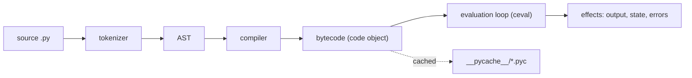

**Internal mechanism:** Bytecode lives inside a *code object*, which also carries constants, names and argument metadata. You can read it directly with the `dis` module — the single best tool for settling arguments about what Python actually does.

**Example:**
```python
import dis

def add(a, b):
    return a + b

dis.dis(add)
#   LOAD_FAST  a
#   LOAD_FAST  b
#   BINARY_OP  + 
#   RETURN_VALUE
```

**Cache invalidation:** A `.pyc` records the source's size and modification time (or, in hash-based mode, a hash of the source). If either differs, the interpreter recompiles. This is why editing a file always takes effect, and why a stale `.pyc` is almost never the cause of a bug you are chasing.

**Advantages:** Portability (the same bytecode semantics everywhere), fast start-up for large codebases thanks to caching, and full introspection of compiled code at runtime.

**Disadvantages:** Bytecode is an implementation detail with no stability guarantee — it changes between minor versions, which is exactly why `.pyc` files carry a version tag in their name.

> 💡 **Tip:** `python -X importtime script.py` prints how long each import took. It is the fastest way to find out why a CLI takes two seconds to print its help text.

**Best intuition:** Think of `.py` → `.pyc` as the same relationship as `.java` → `.class`, except that Python performs the step for you automatically and silently.

**Terminology:** *code object*, *evaluation loop* (`ceval`), *`dis`*, *magic number*, *PyPy*, *JIT*.

---

### 1.3 Variables, Names and Objects

**How it works:** An assignment binds a name in a namespace to an object. The object holds the value; the name is only a reference. Two names can refer to one object, and the object outlives any individual name as long as at least one reference remains.

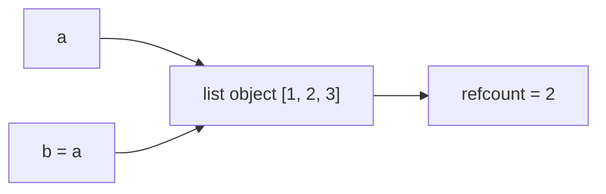

**Internal mechanism:** Every object carries a reference count. Binding a new name increments it; rebinding or deleting a name decrements it. When the count reaches zero the object is deallocated immediately — see [[#10. CPython Internals & Memory Management]] for the cycle collector that handles the cases reference counting alone cannot.

**Mutability is the consequence:** Because names share objects, mutating an object through one name is visible through every other name bound to it. Rebinding a name, by contrast, affects only that name.

**Example:**
```python
a = [1, 2, 3]
b = a
b.append(4)     # mutates the shared object
print(a)        # [1, 2, 3, 4]

b = [9]         # rebinds the name b only
print(a)        # [1, 2, 3, 4]
```

**Advantages:** Uniform model — there are no primitives with different assignment semantics — and cheap assignment, since nothing is copied.

**Disadvantages:** Accidental sharing is easy, and a function that mutates an argument changes the caller's object. Copying must be requested explicitly with `copy.copy` or `copy.deepcopy`.

> ⚠️ **Common misconception:** "Python passes by value" or "Python passes by reference." Neither term fits. Python passes *object references by value*: the function gets its own name bound to the caller's object, so rebinding the parameter does not affect the caller, but mutating the object does.

**Common mistake:** Using a mutable default argument (`def f(items=[])`). The default object is created once, when the function is defined, and every call that relies on the default shares it — so the list keeps growing between calls.

**Best intuition:** Names are luggage tags, not suitcases. Sticking a second tag on a suitcase does not produce a second suitcase.

**Terminology:** *name binding*, *reference*, *aliasing*, *mutability*, *shallow copy* vs. *deep copy*.

---

### 1.4 Numbers and Numeric Types

**How it works:** An `int` is a variable-length object storing the number in 30-bit digits, so arithmetic grows the allocation as needed instead of overflowing. A `float` maps directly onto the machine's 64-bit IEEE-754 double, inheriting its precision and its rounding behaviour exactly.

**Why floats surprise people:** `0.1` cannot be represented exactly in binary, so `0.1 + 0.2` produces a number very slightly above `0.3`. This is not a Python bug — it is how binary floating point works in every language that uses IEEE-754.

**Example:**
```python
0.1 + 0.2 == 0.3          # False
abs(0.1 + 0.2 - 0.3) < 1e-9   # True — compare with a tolerance

from decimal import Decimal
Decimal("0.1") + Decimal("0.2") == Decimal("0.3")   # True
```

**Comparison of numeric types:**

| Type | Exact? | Use it for |
|---|---|---|
| `int` | Yes, unbounded | Counting, indexing, IDs |
| `float` | No (binary approximation) | Measurement, science, statistics |
| `Decimal` | Yes, configurable precision | Money, anything audited |
| `Fraction` | Yes, rational | Exact ratios, symbolic work |

**Time/space complexity:** Small-integer arithmetic is effectively O(1); very large integers cost O(n) in the number of digits for addition and up to O(n²) for schoolbook multiplication, which is why cryptographic code cares about integer size.

**Advantages:** No overflow for `int`, a consistent numeric tower, and exact alternatives available in the standard library.

**Disadvantages:** Boxed integers use far more memory than a machine word, and `float` carries every classic IEEE-754 pitfall.

> ⚠️ **Common misconception:** "`Decimal` is just a slower float." It is a different arithmetic model — base 10 with explicit precision and rounding rules — which is why financial systems require it.

**Common mistake:** Building money code on `float`, then discovering that a million small roundings have drifted the ledger by a few cents.

**Best intuition:** `float` measures, `int` counts, `Decimal` accounts.

**Terminology:** *arbitrary precision*, *IEEE-754*, *machine epsilon*, *numeric tower*, *rounding mode*.

---

### 1.5 Strings and Text

**How it works:** Since PEP 393, CPython stores a string in the narrowest representation its characters allow — one byte per character for Latin-1 text, two bytes if any character needs it, four bytes for the rest. Indexing therefore stays O(1) while pure-ASCII text stays compact.

**Text versus bytes:** `str` is text; `bytes` is data. `encode()` turns text into bytes using a codec, `decode()` turns bytes back into text. There is no implicit conversion in either direction, which is the single largest behavioural difference from Python 2.

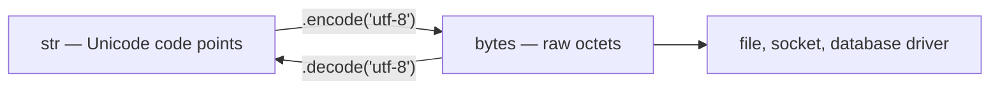

**Immutability:** Strings never change. `s += x` in a loop allocates a new string each iteration, so building text that way is quadratic; `"".join(parts)` allocates once and is the idiomatic fix.

**Example:**
```python
parts = []
for row in rows:
    parts.append(row.strip())
text = "\n".join(parts)        # one allocation, O(n)
```

| | `str` | `bytes` |
|---|---|---|
| Holds | Unicode code points | 8-bit values |
| Literal | `"héllo"` | `b"h\xc3\xa9llo"` |
| Indexing yields | A one-character `str` | An `int` (0–255) |
| Use for | Anything human-readable | Files, sockets, protocols |

**Advantages:** Correct Unicode handling by default, safe hashing and dict keys thanks to immutability, and a very rich method set.

**Disadvantages:** Every transformation allocates, and encoding errors surface at the boundary rather than where the bad assumption was made.

> ⚠️ **Common misconception:** "`len(s)` returns the number of characters a user sees." It returns the number of code points. An emoji with a skin-tone modifier, or a letter plus a combining accent, is several code points but one perceived character.

**Common mistake:** Relying on the platform default encoding when opening a file. On Windows that is not UTF-8, so the same code reads a file correctly on one machine and raises `UnicodeDecodeError` on another. Always pass `encoding="utf-8"` explicitly.

**Best intuition:** `str` is what a person reads; `bytes` is what a wire carries. Encoding is the border crossing, and borders need explicit paperwork.

**Terminology:** *code point*, *grapheme cluster*, *codec*, *PEP 393 compact representation*, *`UnicodeDecodeError`*.

---

### 1.6 Operators and Expressions

**How it works:** The compiler turns an operator into a bytecode instruction, and the instruction dispatches to a *special method* on the operands' types. For `a + b` the interpreter tries `type(a).__add__(a, b)`; if that returns `NotImplemented`, it tries the reflected operation `type(b).__radd__(b, a)`; if that also declines, it raises `TypeError`.

**Internal mechanism:** Special methods are looked up on the *type*, not the instance, which is why assigning `obj.__add__ = ...` on a single object does not change what `obj + x` does.

**Example:**
```python
class Money:
    def __init__(self, cents): self.cents = cents
    def __add__(self, other):
        if not isinstance(other, Money):
            return NotImplemented          # let the other side try
        return Money(self.cents + other.cents)
    def __repr__(self): return f"Money({self.cents})"

Money(150) + Money(99)      # Money(249)
```

**Short-circuiting:** `and` and `or` do not return booleans — they return one of their operands, and they stop evaluating as soon as the answer is known. `x or default` is therefore an idiom, not a trick.

**Chained comparison:** `a < b < c` evaluates `b` once and means `a < b and b < c`, which differs from most C-family languages where it would compare a boolean against `c`.

**Advantages:** Operator overloading makes domain types (vectors, money, dates) read naturally, and the `NotImplemented` protocol lets unrelated types cooperate.

**Disadvantages:** Overloading can hide expensive work behind innocent-looking syntax, and a wrong `__eq__` silently breaks containers that rely on it.

> ⚠️ **Common misconception:** "Returning `NotImplemented` is the same as raising `NotImplementedError`." They are unrelated: `NotImplemented` is a value that tells Python to try the other operand's method; `NotImplementedError` is an exception for unfinished code.

**Common mistake:** Using `is` to compare values (`if x is 0:`). It compares identity and only appears to work because of small-integer caching.

**Best intuition:** Operators are polite requests, not commands: each side gets a chance to handle the operation, and only if both decline does Python give up.

**Terminology:** *special (dunder) method*, *reflected operation*, *`NotImplemented`*, *short-circuit evaluation*, *operator precedence*.

---

### 1.7 Control Flow Statements

**How it works:** Conditionals and loops compile to conditional-jump instructions over the bytecode. A `for` loop is sugar over the iterator protocol: Python calls `iter()` on the iterable once, then `next()` repeatedly until `StopIteration` is raised, which it catches to end the loop — see [[#6. Iterators, Generators & Comprehensions]].

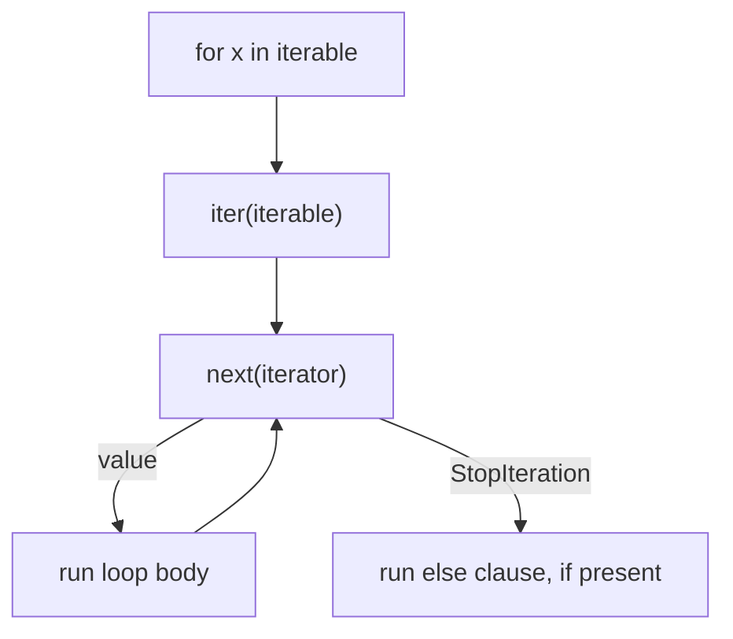

**Indentation as syntax:** The tokenizer emits INDENT and DEDENT tokens, so block structure is part of the grammar. Mixing tabs and spaces is a syntax error rather than a style problem.

**The loop `else`:** `for ... else` runs the `else` block only if the loop finished without `break`. It reads oddly but removes the "found a match" flag variable that search loops otherwise need.

**Example:**
```python
for user in users:
    if user.is_admin:
        print("admin present")
        break
else:
    print("no admin found")     # only when no break happened
```

**Structural pattern matching:** `match` compares a subject against patterns and binds names while it does so. It matches *shape*, not just equality — sequences, mappings and class patterns are all supported.

```python
match event:
    case {"type": "click", "pos": (x, y)}:
        handle_click(x, y)
    case {"type": "key", "key": str(k)}:
        handle_key(k)
    case _:
        ignore(event)
```

**Advantages:** Very readable flow, an iteration model that works identically for lists, files, generators and database cursors, and pattern matching for shape-driven dispatch.

**Disadvantages:** No `do ... while`, no C-style `for(;;)`, and `match` silently treats a bare lowercase name as a capture pattern that matches anything — a real foot-gun.

> ⚠️ **Common misconception:** "`for i in range(len(x))` is the normal way to loop." It is the translated-from-C way. Iterate over the items directly, or use `enumerate(x)` when you genuinely need the index.

**Common mistake:** Mutating a list while iterating over it. The loop's internal index keeps advancing while the list shrinks, so items are skipped silently. Iterate over a copy, or build a new list.

**Best intuition:** Python's loops are conveyor belts, not counters — they ask the collection for the next thing rather than computing where it lives.

**Terminology:** *iterable*, *iterator*, *`StopIteration`*, *loop `else`*, *capture pattern*, *INDENT/DEDENT*.

---

### 1.8 Functions and Parameters

**How it works:** `def` executes at runtime: it builds a function object from a compiled code object, evaluates the default values *once*, attaches them, and binds the result to a name. Calling the function pushes a new frame holding its local variables, executes its bytecode, then pops the frame.

**Argument binding order:** positional arguments fill parameters left to right, `*args` absorbs the rest, keyword arguments match by name, `**kwargs` absorbs unmatched keywords, and any parameter still unfilled takes its default or raises `TypeError`.


**Positional-only and keyword-only:** A `/` in the signature marks everything before it positional-only; a `*` marks everything after it keyword-only. Both exist so a library can change parameter *names* without breaking callers, or force clarity at the call site.

**Example:**
```python
def connect(host, port, /, *, timeout=5.0, retries=3):
    ...

connect("db.internal", 5432, timeout=1.0)   # ok
connect(host="db.internal", port=5432)      # TypeError — positional-only
```

**Defaults are evaluated once:** This is the mechanism behind the mutable-default bug. The fix is a sentinel:

```python
def append_to(item, target=None):
    if target is None:
        target = []
    target.append(item)
    return target
```

**Advantages:** One signature covers many call styles, functions are first-class objects, and introspection (`inspect.signature`) makes tooling and frameworks possible.

**Disadvantages:** Flexible signatures can be hard to read, and the once-evaluated default rule bites nearly every Python programmer at least once.

> ⚠️ **Common misconception:** "Default arguments are evaluated at each call." They are evaluated once, when the `def` statement runs. A default of `datetime.now()` freezes the import-time timestamp for the life of the process.

**Common mistake:** Annotating a mutable default as `= []` or `= {}` and mutating it inside the function, which shares state across every call.

**Best intuition:** A `def` is an assignment statement that happens to produce a callable — everything after the colon is data attached to that object, evaluated when the `def` runs.

**Terminology:** *frame*, *code object*, *`*args` / `**kwargs`*, *keyword-only*, *positional-only*, *sentinel default*.

---

### 1.9 Scope and Namespaces

**How it works:** The compiler decides each name's scope statically. If a function body assigns to a name anywhere, that name is local for the whole function — even on lines before the assignment. Reading it first raises `UnboundLocalError`, which is why the error mentions a local variable you thought was global.

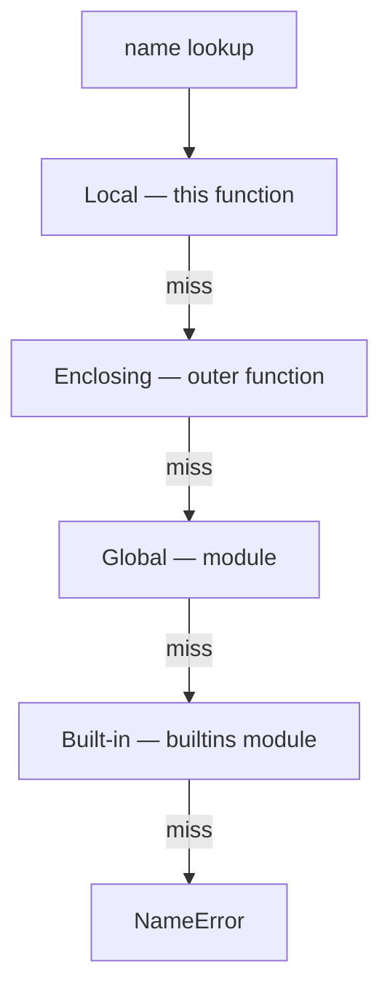

**Internal mechanism:** Local variables do not live in a dictionary. The compiler assigns each an index into the frame's array of fast locals, accessed with `LOAD_FAST` — which is why locals are measurably faster than globals, whose lookup goes through the module dictionary with `LOAD_GLOBAL`.

**Example:**
```python
count = 0

def bump():
    count += 1      # UnboundLocalError: 'count' is local because it is assigned here

def bump_fixed():
    global count
    count += 1      # explicit, and works
```

**`nonlocal`:** Rebinds a name in the nearest enclosing *function* scope, which is how closures accumulate state without a class or a global.

**Comprehension scope:** A comprehension runs in its own function-like scope, so its loop variable does not leak into the surrounding code — a deliberate Python 3 change from Python 2.

**Advantages:** Predictable resolution, fast local access, and no accidental global mutation — writing to a global requires saying so.

**Disadvantages:** The "assignment makes it local everywhere in the function" rule surprises newcomers, and heavy `global` use makes data flow hard to follow.

> ⚠️ **Common misconception:** "`if`, `for` and `while` create a scope." They do not. Only modules, functions (including lambdas and comprehensions) and classes do — a name bound inside an `if` block is visible after it.

**Common mistake:** Creating closures in a loop and expecting each to capture the current value. Closures capture the *variable*, not its value at creation, so all of them see the final value. Bind it explicitly with a default argument or `functools.partial`.

**Best intuition:** LEGB is a lookup chain, and `global`/`nonlocal` are write permissions for links further up that chain.

**Terminology:** *LEGB*, *`UnboundLocalError`*, *fast locals*, *closure cell*, *`global`*, *`nonlocal`*.

---

### 1.10 Truthiness, None and Equality

**How it works:** `bool(obj)` calls `type(obj).__bool__()`; if that is absent it calls `__len__()` and treats zero as false; if neither exists the object is true. That is the whole rule, and it is why any container is falsy when empty and any plain object is truthy.

**Identity versus equality:** `is` compares the identity of two objects — in CPython, their addresses. `==` calls `__eq__`. They coincide for singletons like `None`, `True` and `False`, and they *appear* to coincide for small integers and interned strings because CPython caches those objects.

**Example:**
```python
a = 256; b = 256
a is b          # True — cached small int

a = 257; b = 257
a is b          # False (in a fresh interpreter) — separate objects
a == b          # True — same value
```

| | `==` | `is` |
|---|---|---|
| Asks | Same value? | Same object? |
| Customisable | Yes, via `__eq__` | No |
| Use for | Values, almost always | `None`, `True`, `False`, sentinels, caches |

**`None` as a sentinel:** `None` is a singleton, so `x is None` is both faster and safer than `x == None` — the latter can be intercepted by a custom `__eq__` and give a wrong answer.

**Hashing follows equality:** Any object used as a dict key or set member must satisfy: if `a == b` then `hash(a) == hash(b)`. Overriding `__eq__` without `__hash__` makes the class unhashable, which is Python protecting you from a broken invariant rather than punishing you.

**Advantages:** Truthiness makes guard clauses short and readable, and the singleton rule makes `None` checks unambiguous.

**Disadvantages:** Falsy-but-valid values are a classic bug source: `0`, `""` and `[]` are all legitimate data that a truthiness check silently rejects.

> ⚠️ **Common misconception:** "`if x:` and `if x is not None:` mean the same thing." They differ for every falsy value. If `0` or `""` is a valid input, the truthiness check discards real data.

**Common mistake:** Writing `if value:` to test whether an optional argument was supplied, then being unable to pass `0` or an empty list.

**Best intuition:** `is` asks "the same suitcase?", `==` asks "the same contents?", and truthiness asks "is there anything in it at all?"

**Terminology:** *truthy* / *falsy*, *singleton*, *identity*, *interning*, *hashability*, *sentinel*.

---

[[#📖 Master Table of Contents|⬆ Back to top]]

*End of Group 1. Next: Built-in Data Structures.*

---

## 2. Built-in Data Structures

### Table of Contents (this group)
- [[#2.1 Lists]]
- [[#2.2 Tuples and Named Tuples]]
- [[#2.3 Dictionaries]]
- [[#2.4 Sets and Frozensets]]
- [[#2.5 Indexing and Slicing]]
- [[#2.6 Hashing and Hashability]]
- [[#2.7 Sorting and Ordering]]
- [[#2.8 The collections Module]]
- [[#2.9 Unpacking and Star Expressions]]
- [[#2.10 Copying and Aliasing Containers]]
- [[#2.11 Choosing the Right Data Structure]]

---

### 2.1 Lists

**How it works:** A CPython list is an array of pointers to objects, not an array of the objects themselves. That is why a list can hold mixed types at no extra cost and why indexing is O(1) — the interpreter jumps straight to a slot and follows the pointer.

**Internal mechanism:** The array is over-allocated. When an append fills the array, CPython allocates a larger block (growing by roughly 12% plus a constant), copies the pointers and frees the old block. Because the extra room is proportional to the size, `append` is O(1) *amortised* even though individual appends occasionally copy everything.

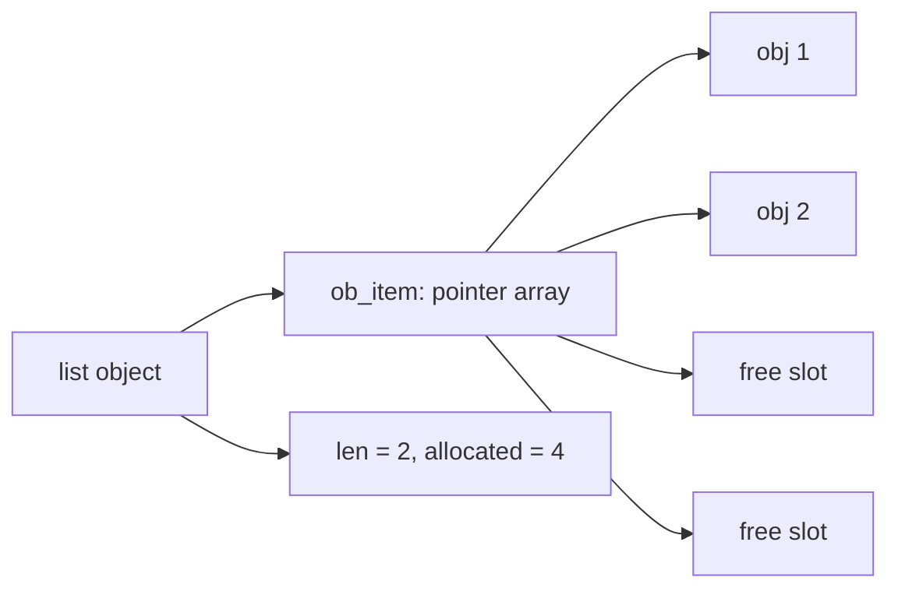

**Time/space complexity:** Index and `append` O(1) amortised; `insert(0, x)` and `pop(0)` O(n) because every following pointer shifts; `in` is O(n); `len` is O(1).

**Example:**
```python
row = []
for value in source:          # amortised O(1) per append
    row.append(value)

row.insert(0, "header")       # O(n) — every element moves
```

**Advantages:** Ordered, mutable, heterogeneous, memory-compact in terms of pointers, and backed by highly optimised C code.

**Disadvantages:** Insertion and deletion anywhere but the end are linear, membership tests are linear, and storing numbers means storing pointers to boxed objects — far heavier than a NumPy array.

> ⚠️ **Common misconception:** "A list is a linked list." It is a dynamic array. Linked-list intuitions — cheap insertion in the middle, expensive indexing — are exactly backwards for Python lists.

**Common mistake:** Using `list.pop(0)` as a queue operation. Each call is O(n), so draining a queue of n items is O(n²); `collections.deque` makes it O(1).

**Best intuition:** A list is a numbered shelf of references. Adding at the end is cheap; making room in the middle means sliding everything along.

**Terminology:** *dynamic array*, *over-allocation*, *amortised complexity*, *pointer array*, *in-place mutation*.

---

### 2.2 Tuples and Named Tuples

**How it works:** A tuple stores its pointers in a fixed-size block allocated once, with no spare capacity and no growth mechanism. That makes it slightly smaller and faster to build than a list, and it is why a tuple cannot be extended.

**Immutability is shallow:** The tuple guarantees its *slots* never change. It says nothing about the objects in those slots, so a tuple containing a list can still have that list mutated.

**Example:**
```python
point = (3, 4)
point[0] = 9            # TypeError

config = ([1, 2], "x")
config[0].append(3)     # fine — the list itself is mutable
```

**Named tuples:** `collections.namedtuple` and `typing.NamedTuple` generate a tuple subclass with named fields. Instances stay real tuples — indexable, unpackable, comparable — while gaining `.field` access and a readable `repr`.

```python
from typing import NamedTuple

class Point(NamedTuple):
    x: float
    y: float

p = Point(3, 4)
p.x, p[0], tuple(p)     # 3, 3, (3, 4)
```

**Time/space complexity:** Same O(1) indexing as a list, with a smaller constant memory footprint and no resizing cost.

**Advantages:** Hashable when their contents are, safe to share across threads and caches, unpackable, and cheap to create — which is why functions return tuples.

**Disadvantages:** Fixed size, and positional access (`row[3]`) becomes unreadable quickly, which is exactly what named tuples fix.

> 💡 **Tip:** Reach for a named tuple or a frozen dataclass the moment a tuple grows past two or three fields. `result[4]` in a code review is a defect waiting to happen.

**Common mistake:** Forgetting the trailing comma in a one-element tuple: `(5)` is the integer `5`; `(5,)` is a tuple.

**Best intuition:** A list is a shopping list you keep editing; a tuple is a receipt — fixed the moment it is printed.

**Terminology:** *immutable*, *shallow immutability*, *namedtuple*, *record*, *singleton tuple*.

---

### 2.3 Dictionaries

**How it works:** A dict is a hash table. Storing a key computes `hash(key)`, uses the low bits to pick a slot, and stores the entry there; a lookup repeats the calculation and compares keys with `==` to confirm. Collisions are resolved by probing other slots according to a deterministic sequence.

**Internal mechanism:** Since Python 3.6, CPython splits the table in two: a compact array of entries in insertion order, plus an array of indices into it. That is what makes dicts both ordered and about 20–25% smaller than the older design — the ordering guarantee was made official in 3.7.

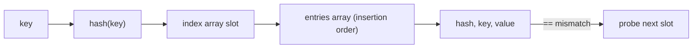

**Resizing:** When the table becomes about two-thirds full, CPython allocates a larger one and reinserts every entry. An individual insert is therefore O(1) amortised, with occasional expensive inserts.

**Time/space complexity:** Lookup, insert and delete are O(1) on average and O(n) in the pathological case where every key collides. Iteration is O(n) in insertion order.

**Example:**
```python
counts = {}
for word in words:
    counts[word] = counts.get(word, 0) + 1

# Same thing, without the double lookup
from collections import defaultdict
counts = defaultdict(int)
for word in words:
    counts[word] += 1
```

**Advantages:** Constant-time access by key, insertion-ordered iteration, a huge method surface (`get`, `setdefault`, `|` merge since 3.9), and the fact that it is the most optimised container in CPython.

**Disadvantages:** Keys must be hashable, memory overhead is significant compared with a list of pairs, and iteration order is insertion order — not sorted order, which people frequently assume.

> ⚠️ **Common misconception:** "Dicts are unordered." That was true before 3.7. They now preserve insertion order by language guarantee — but that still is not *sorted* order, and relying on it to mean sorted is a bug.

**Common mistake:** Mutating a dict while iterating over it, which raises `RuntimeError: dictionary changed size during iteration`. Iterate over `list(d.items())` when you must modify.

**Best intuition:** A dict is a cloakroom: the hash is the ticket number that tells the attendant exactly which hook to walk to.

**Terminology:** *hash table*, *open addressing*, *probing*, *load factor*, *compact dict*, *key view*.

---

### 2.4 Sets and Frozensets

**How it works:** A set is the same hash-table machinery as a dict with only keys and no values. Membership testing hashes the item and checks one slot, which is why `in` is O(1) for a set and O(n) for a list.

**Set algebra:** Union (`|`), intersection (`&`), difference (`-`) and symmetric difference (`^`) are implemented in C and run in time proportional to the smaller operand for intersection — far faster than the nested loops they replace.

**Example:**
```python
current = {"a", "b", "c"}
wanted = {"b", "c", "d"}

to_add = wanted - current       # {'d'}
to_remove = current - wanted    # {'a'}
unchanged = current & wanted    # {'b', 'c'}
```

**Ordering:** Sets have no order at all — not even insertion order. Iteration order depends on hash values and insertion history, and string hashing is randomised per process by default, so the order can differ between runs.

**Time/space complexity:** `add`, `remove` and `in` are O(1) average; union is O(len(a) + len(b)); intersection is O(min(len(a), len(b))).

**Advantages:** Constant-time membership, deduplication for free, and expressive algebra that reads like the problem statement.

**Disadvantages:** Unordered, items must be hashable, and the memory cost per item is much higher than a list's.

> ⚠️ **Common misconception:** "Sets are sorted because they print in a tidy order for small integers." Small integers hash to themselves, which makes the order *look* sorted. Add strings and the illusion disappears.

**Common mistake:** Using a set to deduplicate while expecting the original order to survive. Use `list(dict.fromkeys(items))` when order matters.

**Best intuition:** A set is a guest list: it answers "are you on it?" instantly and does not care who arrived first.

**Terminology:** *hash set*, *frozenset*, *set algebra*, *deduplication*, *hash randomisation*.

---

### 2.5 Indexing and Slicing

**How it works:** `s[i]` calls `__getitem__` with an integer; `s[a:b:c]` calls the same method with a `slice` object. Negative indices are converted by adding the length, and out-of-range *slice* bounds are clamped rather than raising — which is why `items[5:10]` on a three-item list returns `[]` instead of an error.

**Slicing copies:** For built-in sequences, a slice produces a new object containing the same element references. `a[:]` is therefore a shallow copy, and slicing a large list repeatedly is a silent way to allocate a great deal of memory.

**Example:**
```python
items = [0, 1, 2, 3, 4, 5]
items[1:4]        # [1, 2, 3]      — stop is exclusive
items[:3]         # [0, 1, 2]
items[::2]        # [0, 2, 4]
items[::-1]       # reversed copy
items[1:3] = [9]  # slice assignment: [0, 9, 3, 4, 5]
```

**Slice assignment:** Assigning to a slice of a list can change its length, which is how elements are inserted or removed in bulk. This only works on mutable sequences.

**Time/space complexity:** Indexing O(1); a slice of k items is O(k) in time and memory. `items[::-1]` copies the whole sequence, while `reversed(items)` is a lazy iterator that copies nothing.

**Advantages:** One uniform syntax across every sequence type, clamped bounds that avoid off-by-one crashes, and slice assignment for bulk edits.

**Disadvantages:** Every slice allocates, exclusive `stop` trips people up, and `items[i]` on a non-existent index raises while `items[i:j]` quietly returns nothing — inconsistent enough to hide bugs.

> 💡 **Tip:** Name your slices when they mean something: `HEADER = slice(0, 4)` then `row[HEADER]`. Slice objects are first-class values.

**Common mistake:** Reversing a huge list with `[::-1]` inside a loop when `reversed()` would do the job without allocating.

**Best intuition:** Indices point at the gaps between items, not at the items. That is why `a[:n] + a[n:]` reconstructs the original exactly.

**Terminology:** *slice object*, *stride*, *exclusive stop*, *clamping*, *shallow copy*.

---

### 2.6 Hashing and Hashability

**How it works:** `hash(obj)` calls `type(obj).__hash__`. Hash-based containers require two guarantees: the hash must not change while the object is stored, and equal objects must have equal hashes. Python enforces the first by refusing to hash mutable built-ins and the second by convention, which your code must uphold.

**The `__eq__`/`__hash__` contract:** Defining `__eq__` on a class sets `__hash__` to `None`, making instances unhashable. That is deliberate — Python cannot know how you want equal objects to hash, and a silently wrong hash produces lookups that fail unpredictably.

**Example:**
```python
class Point:
    def __init__(self, x, y): self.x, self.y = x, y
    def __eq__(self, other):
        return isinstance(other, Point) and (self.x, self.y) == (other.x, other.y)
    __hash__ = None           # what Python does implicitly

# Correct version: hash the same fields equality uses
class HashablePoint(Point):
    def __hash__(self): return hash((self.x, self.y))
```

**Hash randomisation:** Since Python 3.3, `str` and `bytes` hashes are salted with a per-process random seed, so they differ between runs. This exists to defeat denial-of-service attacks that deliberately collide dictionary keys; it is also why set iteration order can vary run to run.

**Time/space complexity:** Hashing a string is O(n) in its length, but the result is cached on the string object, so repeated lookups with the same key pay it once.

**Advantages:** Makes O(1) containers possible, gives value objects identity-free equality, and enables memoisation and deduplication.

**Disadvantages:** Easy to get wrong in user classes, and a mutable object used as a key after mutation becomes unfindable — a bug with no error message.

> ⚠️ **Common misconception:** "Hash equality means the objects are equal." Different objects can share a hash (a collision); containers always confirm with `==`. Only the reverse implication must hold.

**Common mistake:** Making a class hashable on fields that later change, so the object goes missing from the set it was added to.

**Best intuition:** The hash is a filing-cabinet drawer number. Two documents can share a drawer; you still read them to find the one you want.

**Terminology:** *hashable*, *hash collision*, *`__hash__`/`__eq__` contract*, *hash randomisation*, *immutable key*.

---

### 2.7 Sorting and Ordering

**How it works:** Python sorts with Timsort, an adaptive merge sort that detects existing runs of ordered data. On already-sorted or partially-sorted input it approaches O(n); in the worst case it is O(n log n), and it is stable by design.

**The `key` function:** `key` is called once per element (n calls), and the results are sorted. That is the decorate-sort-undecorate pattern built into the language, and it is why `key` beats the removed `cmp` parameter — a comparison function would be called O(n log n) times.

**Example:**
```python
# Sort by department, then by descending salary — two stable passes
people.sort(key=lambda p: -p.salary)
people.sort(key=lambda p: p.department)

# Or one pass with a tuple key
people.sort(key=lambda p: (p.department, -p.salary))
```

**Stability in practice:** Because equal keys keep their relative order, you can sort by the least significant criterion first and then by the most significant, and the earlier ordering survives inside each group.

**Time/space complexity:** O(n log n) worst case, O(n) on nearly-sorted input, O(n) extra memory. `sorted()` allocates a new list; `list.sort()` sorts in place and returns `None`.

**Advantages:** Stable, adaptive, C-implemented, and `key` covers virtually every real sorting requirement.

**Disadvantages:** Mixed-type comparisons raise `TypeError` in Python 3, `key` is called on every element even when only the top few are needed, and in-place sort returning `None` catches people out.

> 💡 **Tip:** For the top or bottom k items, `heapq.nlargest(k, data)` beats sorting the whole sequence when k is small relative to n.

**Common mistake:** Writing `items = items.sort()`, which binds `None`. `sort()` mutates; `sorted()` returns.

**Best intuition:** Timsort looks for stretches that are already in order and merges them, so real-world data — which is rarely random — sorts faster than the textbook bound suggests.

**Terminology:** *Timsort*, *stable sort*, *key function*, *decorate-sort-undecorate*, *in-place*.

---

### 2.8 The collections Module

**How it works:** Each container in `collections` trades some generality for a better constant factor or a better complexity class on a specific access pattern, and each is implemented in C.

| Container | Use it when | Key property |
|---|---|---|
| `deque` | Queues, sliding windows | O(1) append/pop at both ends |
| `defaultdict` | Grouping, counting | Missing key calls a factory |
| `Counter` | Tallying, top-n | `most_common`, arithmetic on counts |
| `OrderedDict` | Order-sensitive equality, LRU | `move_to_end`, order matters to `==` |
| `ChainMap` | Layered config | Views several mappings as one |

**Internal mechanism:** A `deque` is a doubly linked list of fixed-size blocks, so both ends are O(1) while random access in the middle is O(n) — the exact inverse of a list's profile. A bounded `deque(maxlen=k)` discards from the opposite end automatically, which makes sliding windows a one-liner.

**Example:**
```python
from collections import Counter, defaultdict, deque

Counter("mississippi").most_common(2)     # [('i', 4), ('s', 4)]

by_dept = defaultdict(list)
for person in people:
    by_dept[person.dept].append(person)   # no setdefault dance

window = deque(maxlen=5)                  # keeps only the last 5 items
```

**Advantages:** Correct complexity for common patterns, less code, and C-speed implementations that beat hand-written equivalents.

**Disadvantages:** `defaultdict` creates entries on *read*, which silently grows the dict when you only meant to look; `OrderedDict` is largely redundant now that plain dicts keep insertion order.

> ⚠️ **Common misconception:** "`defaultdict` and `dict.setdefault` are the same." `setdefault` evaluates its default argument on every call, even when the key exists; `defaultdict` calls the factory only on a miss — and only on `__getitem__`, not on `.get()`.

**Common mistake:** Reading `d[missing_key]` on a `defaultdict` inside a membership check, which inserts the key as a side effect and skews later counts.

**Best intuition:** These are the data structures you would otherwise write badly. Learning the five above removes most hand-rolled container code from a codebase.

**Terminology:** *deque*, *bounded deque*, *factory function*, *multiset*, *`ChainMap`*.

---

### 2.9 Unpacking and Star Expressions

**How it works:** Unpacking iterates the right-hand side and binds each produced value to the corresponding name. A starred target collects the remaining items into a list, and because it works on any iterable, it works on generators and file objects too.

**Example:**
```python
first, *middle, last = [1, 2, 3, 4, 5]     # 1, [2, 3, 4], 5
(a, b), c = (1, 2), 3                      # nested unpacking
head, *tail = "abc"                        # 'a', ['b', 'c']

merged = {**defaults, **overrides}         # later keys win
combined = [*list_a, *list_b]
```

**In calls:** `f(*args)` spreads a sequence into positional parameters and `f(**kwargs)` spreads a mapping into keyword arguments — the mirror image of `*args`/`**kwargs` in a definition.

**Swapping:** `a, b = b, a` works because the right-hand side is built as a tuple first, then unpacked — no temporary variable and no ordering trap.

**Time/space complexity:** O(n) in the number of items, with the starred portion allocating a new list.

**Advantages:** Removes index arithmetic, makes multiple return values readable, and merges structures in one expression.

**Disadvantages:** Unpacking an iterator consumes it, exactly one starred target is allowed per assignment, and a length mismatch raises `ValueError` at runtime rather than being caught earlier.

> 💡 **Tip:** `first, *_ = parts` is the idiomatic way to say "I only want the first item and I know there are more".

**Common mistake:** Unpacking a generator you still need afterwards — after `a, *rest = gen`, the generator is exhausted.

**Best intuition:** A star means "everything else, as a list" on the left, and "spread these out" on the right.

**Terminology:** *sequence unpacking*, *starred target*, *argument spreading*, *nested unpacking*.

---

### 2.10 Copying and Aliasing Containers

**How it works:** Assignment binds a name; it never copies. `copy.copy(x)` builds a new outer object whose slots reference the *same* inner objects. `copy.deepcopy(x)` walks the object graph, copying everything and using a memo dict so that shared references stay shared and cycles terminate.

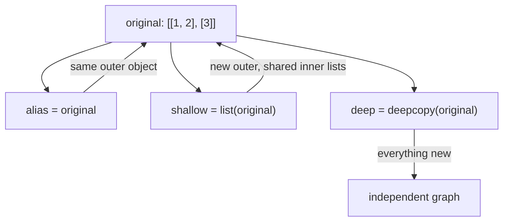

**Example:**
```python
import copy

grid = [[0] * 3 for _ in range(3)]
shallow = copy.copy(grid)
shallow[0][0] = 9
grid[0][0]                  # 9 — inner lists are shared

deep = copy.deepcopy(grid)
deep[0][0] = 5
grid[0][0]                  # still 9
```

**The multiplication trap:** `[[0] * 3] * 3` creates three references to *one* inner list, so writing to one row writes to all three. The comprehension form creates a fresh list per row.

**Time/space complexity:** Shallow copy is O(n) in the number of top-level items; deep copy is O(total nodes) and can be surprisingly slow on large graphs.

**Advantages:** Explicit control over how much independence you actually need, and `deepcopy` handles cycles correctly.

**Disadvantages:** Shallow copies give a false sense of safety, `deepcopy` is slow and breaks on sockets, file handles and locks, and classes may need `__deepcopy__` to behave sensibly.

> ⚠️ **Common misconception:** "`list(x)` copies the list, so I am safe." It copies the outer list only. Any nested mutable object is still shared.

**Common mistake:** Building a grid with `[[0] * cols] * rows` and then wondering why every row changes at once.

**Best intuition:** Shallow copy duplicates the box; deep copy duplicates the box and everything inside it, recursively.

**Terminology:** *aliasing*, *shallow copy*, *deep copy*, *memo dict*, *object graph*.

---

### 2.11 Choosing the Right Data Structure

**How it works:** Every container is a trade-off between access patterns. Picking one is a matter of listing the operations your code performs most often and choosing the structure whose complexity matches.

| Operation | `list` | `deque` | `dict` / `set` | `tuple` |
|---|---|---|---|---|
| Index access | O(1) | O(n) | — | O(1) |
| Append / pop at end | O(1)* | O(1) | — | — |
| Append / pop at front | O(n) | O(1) | — | — |
| Membership (`in`) | O(n) | O(n) | O(1) | O(n) |
| Insert in middle | O(n) | O(n) | — | — |
| Memory per item | Low | Low | High | Lowest |

**The dominant mistake:** A membership test inside a loop. `for x in a: if x in b:` is O(n × m) when `b` is a list and O(n) when `b` is a set — the difference between a job finishing in seconds and not finishing at all.

**Example:**
```python
# O(n * m)
missing = [x for x in wanted if x not in current_list]

# O(n + m)
current = set(current_list)
missing = [x for x in wanted if x not in current]
```

**Advantages of thinking this way:** Most Python performance problems are container-choice problems, and they are fixed by changing one line rather than by rewriting in another language.

**Disadvantages:** Converting to a set costs O(n) and memory, so for very small collections a list scan is genuinely faster — measure rather than assume for n below roughly ten.

> 💡 **Tip:** Profile first. `timeit` for micro-decisions, `cProfile` or `py-spy` for whole programs — the bottleneck is rarely where it feels like it is.

**Common mistake:** Reaching for a `list` reflexively, then discovering at scale that every operation the code performs is one of the linear ones.

**Best intuition:** Ask "what does this code ask of the data most often?" — lookup, ordering, both ends, or fixed shape — and let the answer choose the container.

**Terminology:** *access pattern*, *amortised cost*, *space-time trade-off*, *asymptotic complexity*.

---

[[#📖 Master Table of Contents|⬆ Back to top]]

*End of Group 2. Next: Functions & Functional Programming.*

---

## 3. Functions & Functional Programming

### Table of Contents (this group)
- [[#3.1 First-Class Functions]]
- [[#3.2 Closures]]
- [[#3.3 Lambda Expressions]]
- [[#3.4 Higher-Order Functions]]
- [[#3.5 The functools Module]]
- [[#3.6 Recursion]]
- [[#3.7 Pure Functions and Side Effects]]
- [[#3.8 Callable Objects]]
- [[#3.9 Function Introspection]]
- [[#3.10 Functional Style in Python]]

---

### 3.1 First-Class Functions

**How it works:** `def` compiles the body into a code object and, when executed, wraps it in a function object carrying `__code__`, `__defaults__`, `__closure__`, `__globals__` and `__dict__`. Because that object is ordinary, it can live anywhere any other object can.

**Internal mechanism:** Calling `f()` looks up `f` by name, then invokes the callable protocol on whatever it finds. Nothing in the call site knows or cares whether the target is a function, a lambda, a class or an instance with `__call__`.

**Example:**
```python
def parse_json(payload): ...
def parse_csv(payload): ...

PARSERS = {"json": parse_json, "csv": parse_csv}

def parse(kind, payload):
    try:
        parser = PARSERS[kind]
    except KeyError:
        raise ValueError(f"unsupported format: {kind}") from None
    return parser(payload)
```

**Functions carry attributes:** Because a function has a `__dict__`, you can attach metadata to it — which is exactly how many registration decorators mark functions for later discovery.

**Advantages:** Dispatch tables replace long `if/elif` chains, behaviour can be injected for testing, and the whole decorator mechanism follows from this one property.

**Disadvantages:** Indirection hides control flow from readers and from static analysis; a dict of callables is harder to grep than explicit branches.

> ⚠️ **Common misconception:** "`f` and `f()` are interchangeable." `f` is the function object; `f()` calls it. Passing `f()` where a callback was expected registers the *result*, which is usually `None` — a bug that shows up only when the callback silently does nothing.

**Common mistake:** Writing `button.on_click(handler())` instead of `button.on_click(handler)`.

**Best intuition:** A function name is just a variable that happens to hold something callable.

**Terminology:** *first-class object*, *callable*, *dispatch table*, *callback*, *function attribute*.

---

### 3.2 Closures

**How it works:** When an inner function references a name from an enclosing function, the compiler marks that name as a *cell variable*. The enclosing frame stores it in a cell object, and the inner function keeps a reference to that cell in `__closure__`. The cell — and the value in it — outlives the enclosing call.

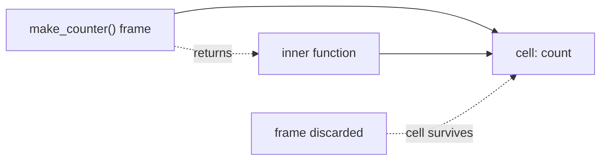

**Late binding:** A closure captures the *cell*, not the value at creation time. Every closure created in a loop shares the loop variable's cell, so all of them observe the final value — the single most-asked closure question in interviews.

**Example:**
```python
def make_counter():
    count = 0
    def increment():
        nonlocal count      # rebind the captured cell
        count += 1
        return count
    return increment

c = make_counter()
c(), c(), c()               # 1, 2, 3
```

**The loop trap and its fix:**
```python
fns = [lambda: i for i in range(3)]          # all return 2
fns = [lambda i=i: i for i in range(3)]      # 0, 1, 2 — default binds now
```

**Advantages:** Private state without a class, configured behaviour built at runtime, and the basis for decorators and callbacks.

**Disadvantages:** Captured objects stay alive as long as the closure does, which makes closures a quiet source of memory retention; and state hidden in a cell is harder to inspect than an attribute.

> ⚠️ **Common misconception:** "A closure copies the variables it uses." It shares them. Two closures made in the same call see each other's changes.

**Common mistake:** Building callbacks in a loop without binding the loop variable, then wondering why every callback acts on the last item.

**Best intuition:** A closure is a function with a backpack — it carries references to the variables it needed, not copies of their values.

**Terminology:** *closure cell*, *free variable*, *late binding*, *`nonlocal`*, *lexical scope*.

---

### 3.3 Lambda Expressions

**How it works:** `lambda` compiles to the same function object `def` produces — the only differences are that the body must be a single expression, the result has no docstring, and `__name__` is `"<lambda>"`.

**Where the limit bites:** No statements means no assignment (except the walrus operator), no `try`, no `raise`, no loops. That is a deliberate design choice to keep lambdas small rather than an implementation limitation.

**Example:**
```python
sorted(people, key=lambda p: (p.last, p.first))
sorted(items, key=lambda kv: kv[1], reverse=True)

# When a lambda gets a name, it should have been a def
area = lambda r: 3.14159 * r ** 2      # PEP 8 advises against this
```

**Advantages:** Keeps trivial callbacks at the call site where they are read, and avoids polluting the namespace with one-use helpers.

**Disadvantages:** Anonymous frames make tracebacks less helpful, they cannot be documented or tested directly, and they cannot be pickled — which breaks `multiprocessing`.

> 💡 **Tip:** `operator.itemgetter(1)` and `operator.attrgetter("name")` replace the most common lambdas, are implemented in C, and are faster and picklable.

**Common mistake:** Assigning a lambda to a name. If it deserves a name it deserves a `def`, a docstring and a useful traceback.

**Best intuition:** A lambda is a `def` with the ceremony removed — use it exactly where the ceremony was the problem.

**Terminology:** *anonymous function*, *expression-only body*, *`operator` module*, *picklable*.

---

### 3.4 Higher-Order Functions

**How it works:** A higher-order function accepts or returns callables. Python's built-ins include `map`, `filter`, `sorted(key=)`, `min`/`max(key=)`, `functools.reduce` and every decorator.

**Laziness:** In Python 3, `map` and `filter` return iterators, not lists. Nothing runs until the result is consumed, and consuming it once exhausts it.

**Example:**
```python
names = map(str.strip, lines)            # lazy: nothing has run yet
long = filter(lambda s: len(s) > 3, names)
result = list(long)                      # now both run, one item at a time

# The comprehension most Python developers prefer
result = [s.strip() for s in lines if len(s.strip()) > 3]
```

**Comprehensions versus map/filter:** Comprehensions are usually clearer and marginally faster when a lambda would be needed; `map` wins when the function already exists (`map(int, values)` beats `[int(v) for v in values]` in both speed and clarity).

**Time/space complexity:** All are O(n) in the number of items, and the lazy forms use O(1) memory rather than materialising a list.

**Advantages:** Composable pipelines, constant memory over large inputs, and code that states the transformation rather than the bookkeeping.

**Disadvantages:** Nested `map`/`filter`/`lambda` chains become unreadable quickly, and laziness surprises people who print the result and see `<map object>`.

> ⚠️ **Common misconception:** "`map` returns a list." It did in Python 2. In Python 3 it returns a lazy iterator, so `len(map(...))` fails and iterating twice yields nothing the second time.

**Common mistake:** Building a `map` object, iterating it in a loop, then trying to reuse it afterwards.

**Best intuition:** Higher-order functions separate *what to do to each item* from *how to walk the items*.

**Terminology:** *higher-order function*, *lazy iterator*, *fold/reduce*, *predicate*, *composition*.

---

### 3.5 The functools Module

**How it works:** Each tool in `functools` wraps or transforms a callable while preserving its callability.

| Tool | Purpose | Note |
|---|---|---|
| `partial` | Pre-bind arguments | Picklable, unlike a lambda |
| `wraps` | Copy metadata onto a wrapper | Essential in decorators |
| `lru_cache` / `cache` | Memoise by arguments | Arguments must be hashable |
| `reduce` | Fold a sequence | Often clearer as a loop |
| `singledispatch` | Dispatch on first arg's type | Open for extension |
| `cached_property` | Compute once per instance | Stored in the instance `__dict__` |

**Internal mechanism of `lru_cache`:** It keeps a dictionary keyed by the call arguments plus a linked list tracking recency, evicting the least recently used entry when `maxsize` is exceeded. `cache` is `lru_cache(maxsize=None)` — unbounded, and therefore a memory leak if the key space is unbounded.

**Example:**
```python
from functools import partial, singledispatch, cache

connect_local = partial(connect, host="127.0.0.1", port=5432)

@singledispatch
def render(value): return str(value)

@render.register
def _(value: list): return ", ".join(render(v) for v in value)

@cache
def config_for(env: str): return load_config(env)     # bounded key space — safe
```

**Advantages:** Correct, C-backed implementations of patterns that are easy to get subtly wrong, and `wraps` keeps decorated functions introspectable.

**Disadvantages:** `lru_cache` holds strong references to arguments *and* results, so caching methods keeps every `self` alive; and `reduce` is usually less readable than the loop it replaces.

> ⚠️ **Common misconception:** "`@cache` is free performance." It trades memory for time and only works with hashable arguments. On a method, it also silently extends the lifetime of every instance it has seen.

**Common mistake:** Decorating an instance method with `lru_cache` and creating a per-process leak keyed by `self`.

**Best intuition:** `functools` is the standard library admitting which function patterns everyone writes, and supplying the versions that are actually correct.

**Terminology:** *partial application*, *memoisation*, *LRU eviction*, *single dispatch*, *wrapper metadata*.

---

### 3.6 Recursion

**How it works:** Each recursive call allocates a new frame holding its own locals. CPython caps the number of frames (`sys.getrecursionlimit()`, default 1000) and raises `RecursionError` beyond it, so a runaway recursion fails cleanly instead of crashing the process.

**No tail-call optimisation:** Python deliberately does not eliminate tail calls. Guido van Rossum's stated reason is that intact stack traces are worth more than the optimisation, so deep recursion is always converted to iteration rather than being made cheap.

**Example:**
```python
def walk(node, depth=0):
    yield node, depth
    for child in node.children:
        yield from walk(child, depth + 1)      # natural for trees

# Deep linear recursion — rewrite as a loop instead
def total(items):
    return sum(items)
```

**Memoised recursion:** Adding `@cache` to a recursive function turns exponential repeated work into linear work, which is the standard demonstration with Fibonacci.

**Time/space complexity:** Each frame costs memory, so recursion depth is O(d) in space. Naive recursive Fibonacci is O(2^n); memoised it is O(n).

**Advantages:** Code that matches the shape of recursive data — trees, JSON, file systems, parsers — and is far easier to verify than a hand-maintained explicit stack.

**Disadvantages:** Frame overhead makes it slower than iteration, the depth limit is real, and a missing or wrong base case produces a `RecursionError` rather than a helpful message.

> 💡 **Tip:** Raising the recursion limit is almost never the fix. Convert to an explicit stack, or use `yield from` generators that keep the traversal lazy.

**Common mistake:** Recursing over a linear structure — a list of a million rows — and hitting the limit at a thousand.

**Best intuition:** Recursion follows the shape of the data. If the data is a chain, use a loop; if it branches, recursion usually reads better.

**Terminology:** *base case*, *recursion limit*, *stack frame*, *tail call*, *memoisation*.

---

### 3.7 Pure Functions and Side Effects

**How it works:** A pure function's output depends only on its arguments, and it leaves no trace anywhere else. Python cannot enforce purity — the discipline is yours — but the payoff is concrete: pure functions are cacheable, parallelisable, and testable without fixtures.

**Where impurity hides:** Mutating an argument, reading module-level state, calling `datetime.now()` or `random`, logging, and I/O are all side effects. The last three are unavoidable; the design goal is to push them to the edges.

**Example:**
```python
# Impure: reads the clock, mutates the input
def add_timestamps(rows):
    for row in rows:
        row["seen_at"] = datetime.now()
    return rows

# Pure core, impure edge
def with_timestamp(row, now):
    return {**row, "seen_at": now}

rows = [with_timestamp(r, datetime.now()) for r in rows]     # clock read once, at the edge
```

**Advantages:** Deterministic tests with no mocking, safe memoisation, safe concurrency, and functions that can be reasoned about locally.

**Disadvantages:** Creating new objects instead of mutating costs allocations, and threading dependencies (clock, random seed, config) through signatures adds parameters.

> 💡 **Tip:** Injecting `now` as a parameter with a default of `None` makes time-dependent code testable without freezing the clock globally.

**Common mistake:** A "getter" that quietly mutates — sorting the caller's list, or filling in defaults on the argument dict — so behaviour changes depending on call order.

**Best intuition:** Keep decisions pure and effects at the boundary. Functional core, imperative shell.

**Terminology:** *purity*, *referential transparency*, *side effect*, *idempotence*, *functional core / imperative shell*.

---

### 3.8 Callable Objects

**How it works:** `x()` invokes `type(x).__call__`. Functions implement it, classes implement it (calling a class constructs an instance), and any object whose class defines `__call__` becomes callable.

**Why it matters:** It makes "callable" a protocol rather than a type, so a stateful object can be passed anywhere a function is expected — a configured validator, a rate limiter, a model wrapper.

**Example:**
```python
class RateLimiter:
    def __init__(self, per_minute): self.per_minute, self.calls = per_minute, []
    def __call__(self, request):
        now = time.monotonic()
        self.calls = [t for t in self.calls if now - t < 60]
        if len(self.calls) >= self.per_minute:
            raise TooManyRequests
        self.calls.append(now)
        return request

limit = RateLimiter(per_minute=60)
limit(request)          # used exactly like a function
```

**Advantages:** State plus callability without closures, introspectable and testable attributes, and the ability to add methods (`reset()`, `stats()`) alongside the call.

**Disadvantages:** Readers may not expect an instance to be callable, and `callable(x)` tells you nothing about the signature it accepts.

> ⚠️ **Common misconception:** "Only functions are callable." Classes, methods, `partial` objects, generators' `send`, and any `__call__`-defining instance are callable too.

**Common mistake:** Checking `isinstance(x, types.FunctionType)` when the real requirement is `callable(x)`.

**Best intuition:** A callable class is a closure that grew up — the captured state became attributes you can inspect.

**Terminology:** *callable protocol*, *`__call__`*, *functor (in the OO sense)*, *`callable()`*.

---

### 3.9 Function Introspection

**How it works:** Function objects expose their own metadata: `__name__`, `__qualname__`, `__doc__`, `__module__`, `__defaults__`, `__kwdefaults__`, `__annotations__` and `__code__`. The `inspect` module turns those into a usable API — most importantly `inspect.signature`, which produces a `Signature` object that can be bound to arguments.

**Example:**
```python
import inspect

def create_user(name: str, *, admin: bool = False) -> "User": ...

sig = inspect.signature(create_user)
list(sig.parameters)                # ['name', 'admin']
sig.parameters["admin"].default     # False
sig.return_annotation               # 'User'
```

**Why frameworks depend on it:** pytest matches fixture names to parameter names; FastAPI builds request parsing and OpenAPI schemas from annotations; Click derives CLI flags from signatures; dependency injection containers resolve constructors this way.

**Annotations at runtime:** Annotations are evaluated at definition time by default, which is why forward references need quotes. `from __future__ import annotations` defers them to strings, and PEP 649 (Python 3.14) makes lazy evaluation the standard behaviour, with `inspect.get_annotations` as the safe way to read them.

**Advantages:** Tooling can adapt to code it has never seen, and decorators can inspect what they wrap.

**Disadvantages:** Introspection breaks when decorators do not use `functools.wraps`, and signature-driven frameworks make parameter names part of your public API.

> ⚠️ **Common misconception:** "Type hints are checked at runtime." They are stored as metadata. Only a checker (mypy, pyright) or a validating library (Pydantic, `typeguard`) acts on them.

**Common mistake:** Writing a decorator without `@wraps`, which erases `__name__`, `__doc__` and the signature — breaking documentation, dispatch and test discovery downstream.

**Best intuition:** Python functions carry their own manual, and frameworks read it instead of asking you for configuration.

**Terminology:** *`inspect.signature`*, *`__qualname__`*, *annotation*, *forward reference*, *metadata preservation*.

---

### 3.10 Functional Style in Python

**How it works:** Python provides the functional building blocks — first-class functions, closures, immutable types, lazy iterators, comprehensions — without the guarantees a functional language offers. There is no enforced immutability, no purity checking, and no tail-call elimination.

**What the community settled on:** Comprehensions and generator expressions instead of `map`/`filter` with lambdas; small pure helpers; immutable value objects (`frozen=True` dataclasses, tuples, `frozenset`); and plain loops when a loop is clearer.

**Example:**
```python
# Functional-leaning, idiomatic Python
totals = {
    region: sum(o.amount for o in orders)
    for region, orders in grouped.items()
}

# A pipeline that stays lazy end to end
lines = (line.strip() for line in file)
records = (parse(line) for line in lines if line)
valid = (r for r in records if r.is_valid)
```

**Immutability in practice:** `tuple`, `frozenset`, `str`, `bytes` and frozen dataclasses cover most needs. Making data immutable at module boundaries removes whole classes of aliasing bugs described in [[#2.10 Copying and Aliasing Containers]].

**Advantages:** Fewer moving parts, easier testing and caching, and lazy pipelines that process more data than fits in memory.

**Disadvantages:** Over-applied, it produces unreadable one-liners; and without tail calls, recursive functional idioms hit the stack limit.

> 💡 **Tip:** If a comprehension needs a comment to explain it, write the loop. Readability is the language's stated priority, and reviewers hold you to it.

**Common mistake:** Chaining `reduce`, `map` and `lambda` into a single expression that nobody — including its author a month later — can decode.

**Best intuition:** Python is multi-paradigm on purpose. Borrow the functional habits that reduce hidden state, and leave the ones that fight the language.

**Terminology:** *multi-paradigm*, *immutability*, *lazy pipeline*, *generator expression*, *functional core*.

---

[[#📖 Master Table of Contents|⬆ Back to top]]

*End of Group 3. Next: Object-Oriented Programming & the Data Model.*

---

## 4. Object-Oriented Programming & the Data Model

### Table of Contents (this group)
- [[#4.1 Classes and Instances]]
- [[#4.2 Attributes and the Instance Dictionary]]
- [[#4.3 Instance, Class and Static Methods]]
- [[#4.4 Inheritance and the MRO]]
- [[#4.5 super() and Cooperative Inheritance]]
- [[#4.6 Special Methods and the Data Model]]
- [[#4.7 Properties]]
- [[#4.8 Descriptors]]
- [[#4.9 Dataclasses]]
- [[#4.10 Abstract Base Classes and Protocols]]
- [[#4.11 Slots and Memory Layout]]
- [[#4.12 Composition and Delegation]]

---

### 4.1 Classes and Instances

**How it works:** A `class` statement executes its body in a fresh namespace, then hands that namespace to the metaclass — normally `type` — which builds the class object. The class is itself an object, bound to the class name like any other value.

**Instantiation:** Calling a class runs `type.__call__`, which calls `__new__` to allocate the instance and then `__init__` to initialise it. `__new__` creates, `__init__` configures — and only `__new__` can return a different object.

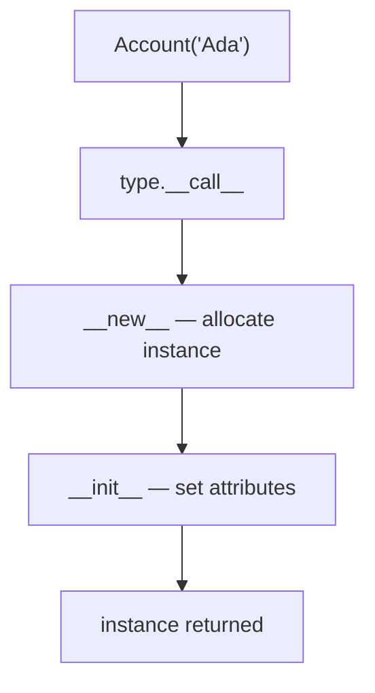

**Example:**
```python
class Account:
    interest_rate = 0.02              # class attribute, shared

    def __init__(self, owner, balance=0):
        self.owner = owner            # instance attributes, per object
        self.balance = balance

    def __repr__(self):
        return f"Account({self.owner!r}, {self.balance})"
```

**Class bodies run once:** The body executes at definition time, not per instance. Anything expensive or mutable declared there is shared by every instance — the class-attribute mutation trap.

**Advantages:** State and behaviour stay together, instances are cheap to create, and classes are ordinary objects that can be passed around and generated.

**Disadvantages:** Instances carry a `__dict__` by default, so thousands of small objects cost real memory; and Python's openness means nothing is truly private.

> ⚠️ **Common misconception:** "`__init__` is the constructor." `__new__` constructs; `__init__` initialises an already-created object. The distinction matters for immutable types and singletons.

**Common mistake:** Declaring a mutable class attribute (`tags = []`) and mutating it through an instance, which changes it for every instance.

**Best intuition:** A class is a factory that is itself an object — which is why you can store it, subclass it, and build it at runtime.

**Terminology:** *class object*, *instance*, *`__new__` vs. `__init__`*, *class attribute*, *metaclass*.

---

### 4.2 Attributes and the Instance Dictionary

**How it works:** `obj.name` invokes `__getattribute__`, which follows a fixed order: data descriptors on the type, then the instance `__dict__`, then non-data descriptors and plain class attributes along the MRO, and finally `__getattr__` as a fallback if nothing was found.

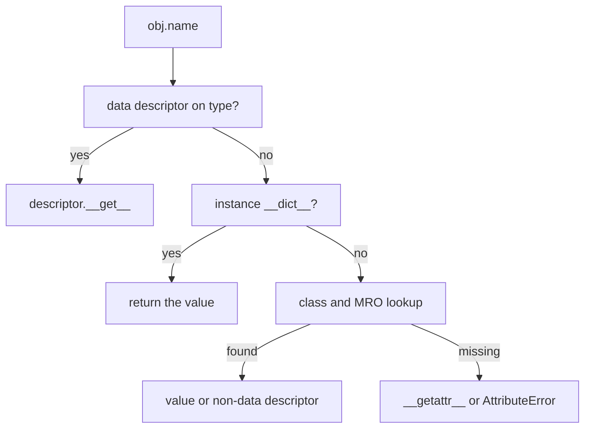

**Writing attributes:** `obj.name = value` goes through `__setattr__`, which stores into the instance `__dict__` unless a data descriptor on the type intercepts it. That is why a property's setter wins over a plain assignment.

**Example:**
```python
class Config:
    debug = False                     # class-level default

c = Config()
c.debug                               # False — found on the class
c.debug = True                        # creates an instance attribute
Config.debug                          # still False
del c.debug                           # instance attribute gone; class default visible again
```

**Advantages:** Defaults live in one place, instances only pay for what they override, and dynamic attributes make frameworks and ORMs possible.

**Disadvantages:** A per-instance dict costs memory, typos create new attributes instead of raising, and shadowing a class attribute by assignment surprises people reading the class.

> ⚠️ **Common misconception:** "Assigning to `self.x` updates the class attribute `x`." It creates an instance attribute that shadows the class one. Only `ClassName.x = ...` changes the shared value.

**Common mistake:** Sharing state accidentally through a mutable class attribute, since `self.items.append(...)` mutates the shared object rather than creating an instance-level one.

**Best intuition:** The instance dict is a small override layer sitting on top of the class's defaults.

**Terminology:** *`__dict__`*, *attribute shadowing*, *`__getattr__` vs. `__getattribute__`*, *data descriptor*, *MRO lookup*.

---

### 4.3 Instance, Class and Static Methods

**How it works:** Functions stored on a class are non-data descriptors. Accessing `obj.method` calls the function's `__get__`, which returns a *bound method* — a small object pairing the function with the instance, so `self` is supplied automatically.

**The three decorators:** `classmethod` binds to the class instead of the instance, so `cls` is whatever class the call came through — including subclasses, which is what makes alternative constructors inheritable. `staticmethod` disables binding entirely.

**Example:**
```python
class Shape:
    registry = {}

    def __init_subclass__(cls, **kw):          # runs for every subclass
        super().__init_subclass__(**kw)
        Shape.registry[cls.__name__] = cls

    @classmethod
    def create(cls, name, *args):              # cls respects subclassing
        return cls.registry[name](*args)

    @staticmethod
    def describe():
        return "shapes have an area"
```

| | Receives | Typical use |
|---|---|---|
| Instance method | `self` | Behaviour on one object |
| `@classmethod` | `cls` | Alternative constructors, registries |
| `@staticmethod` | nothing | Grouped helper, no state |

**Advantages:** Alternative constructors that work correctly in subclasses, and a clear signal of how much context a method actually needs.

**Disadvantages:** `staticmethod` is often a sign the function belongs at module level, and `classmethod` on deep hierarchies can make it hard to see which class `cls` actually is.

> 💡 **Tip:** If a `@classmethod` returns `cls(...)` rather than a hard-coded class name, subclasses get correct factory behaviour for free.

**Common mistake:** Writing `def method():` without `self` and calling it on an instance, which raises `TypeError` about positional arguments.

**Best intuition:** `self` means "this object", `cls` means "this class, including whichever subclass was used", and neither means "just a function in a namespace".

**Terminology:** *bound method*, *unbound function*, *`classmethod`*, *`staticmethod`*, *alternative constructor*.

---

### 4.4 Inheritance and the MRO

**How it works:** Python computes each class's method resolution order once, at class creation, using the **C3 linearisation** algorithm. Attribute lookup walks that single list in order, so behaviour is deterministic even with multiple inheritance.

**C3 guarantees:** A class always precedes its parents; parents appear in the order listed; and the order is consistent across the whole hierarchy. If no such order exists, the class statement itself raises `TypeError` rather than producing an ambiguous class.

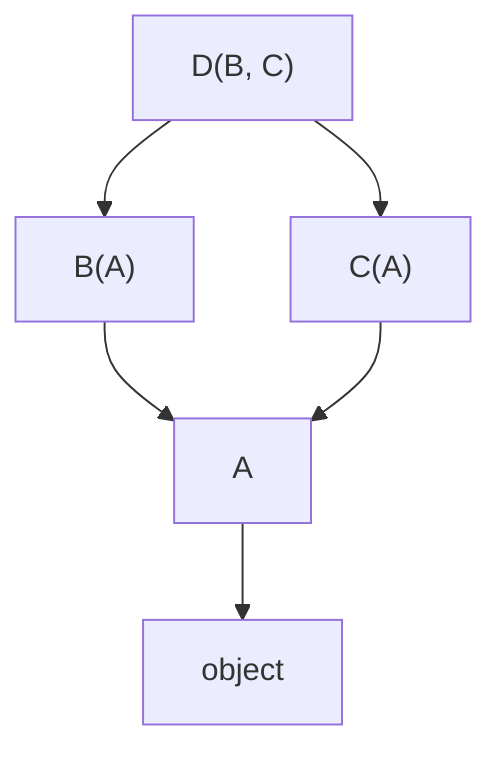

**Example:**
```python
class A: 
    def who(self): return "A"
class B(A):
    def who(self): return "B"
class C(A):
    def who(self): return "C"
class D(B, C): pass

D.__mro__        # D, B, C, A, object
D().who()        # "B"
```

**The diamond problem:** With `D(B, C)` both inheriting from `A`, C3 puts `A` *after* both `B` and `C`, so `A` is visited once and only once. That is what makes cooperative `super()` chains work.

**Advantages:** Deterministic resolution, mixins that compose predictably, and an explicit error at definition time when a hierarchy is inconsistent.

**Disadvantages:** Deep hierarchies make behaviour hard to locate, and multiple inheritance couples classes in ways that are hard to refactor later.

> ⚠️ **Common misconception:** "Multiple inheritance searches depth-first, left to right." That was old Python. C3 is breadth-aware: shared bases are deferred until after every class that inherits from them.

**Common mistake:** Building deep inheritance chains to share a few helper methods, where composition or a module-level function would be clearer and easier to test.

**Best intuition:** The MRO is a single queue of classes computed once. Every lookup — attribute, method, `super()` — walks the same queue.

**Terminology:** *C3 linearisation*, *`__mro__`*, *diamond inheritance*, *mixin*, *base class*.

---

### 4.5 super() and Cooperative Inheritance

**How it works:** `super()` does not mean "my parent". It means "the next class after *this* one in the MRO of the object's actual type". The zero-argument form uses a hidden `__class__` cell that the compiler adds to methods defined inside a class body.

**Why that matters:** In a mixin chain, each class calls `super()` and the call travels down the MRO, letting every class contribute. Hard-coding `Parent.method(self)` breaks that chain and can run a class twice or skip it entirely.

**Example:**
```python
class Base:
    def setup(self): return ["base"]

class Logging(Base):
    def setup(self): return ["logging"] + super().setup()

class Metrics(Base):
    def setup(self): return ["metrics"] + super().setup()

class Service(Logging, Metrics):
    pass

Service().setup()      # ['logging', 'metrics', 'base'] — every class ran once
```

**Cooperative design rules:** Every class in the chain must call `super()`, accept compatible arguments (usually `*args, **kwargs`), and there must be a class at the end that stops — normally `object`.

**Advantages:** Mixins compose without knowing each other, initialisation runs exactly once per class, and subclasses can insert behaviour anywhere in the chain.

**Disadvantages:** It only works if every participant cooperates; one class that forgets `super()` silently truncates the chain, and the resulting bug is hard to see.

> ⚠️ **Common misconception:** "`super()` calls the parent class." It calls the next class in the MRO of the *instance's* type, which in multiple inheritance is frequently a sibling rather than an ancestor.

**Common mistake:** Calling `super().__init__()` with the wrong signature in a mixin, so the chain breaks for some subclass combinations but not others.

**Best intuition:** `super()` is a cursor that advances one step along the MRO — not a pointer to a parent.

**Terminology:** *cooperative multiple inheritance*, *MRO cursor*, *mixin*, *`__class__` cell*, *method chaining*.

---

### 4.6 Special Methods and the Data Model

**How it works:** Python's syntax and built-ins are implemented as protocol lookups on the *type*. `len(x)` calls `type(x).__len__(x)`, `for` calls `__iter__`, `with` calls `__enter__`/`__exit__`, `x[k]` calls `__getitem__`. Implementing the methods is all that is required for a class to participate.

| Protocol | Methods | Gives you |
|---|---|---|
| Representation | `__repr__`, `__str__`, `__format__` | Debuggable output |
| Comparison | `__eq__`, `__lt__`, `__hash__` | Sorting, sets, dict keys |
| Container | `__len__`, `__getitem__`, `__contains__` | Indexing, `in`, `len` |
| Iteration | `__iter__`, `__next__` | `for`, unpacking, comprehensions |
| Context | `__enter__`, `__exit__` | `with` blocks |
| Callable | `__call__` | Function-like objects |
| Numeric | `__add__`, `__mul__`, … | Operators |

**Example:**
```python
class Deck:
    def __init__(self, cards): self._cards = list(cards)
    def __len__(self): return len(self._cards)
    def __getitem__(self, i): return self._cards[i]
    def __repr__(self): return f"Deck({len(self)} cards)"

deck = Deck(range(52))
len(deck), deck[0], deck[:3]     # len, indexing and slicing all work
for card in deck: ...            # __getitem__ alone makes it iterable
random.choice(deck)              # so does anything built on the sequence protocol
```

**`__repr__` versus `__str__`:** `__repr__` is for developers and should be unambiguous — ideally valid Python. `__str__` is for users and falls back to `__repr__` when undefined, which is why defining `__repr__` first is the better habit.

**Advantages:** Your types behave like built-ins, work with standard library functions you have never heard of, and stay readable at the call site.

**Disadvantages:** Implementing part of a protocol produces objects that work in some contexts and fail in others, and expensive dunder methods hide cost behind ordinary syntax.

> 💡 **Tip:** Define `__repr__` on every class you will debug. A log line reading `<Order object at 0x7f...>` costs far more time than the two lines it takes to fix.

**Common mistake:** Defining `__eq__` without `__hash__` and then storing instances in a set — Python makes the class unhashable, and the failure surfaces far from the class.

**Best intuition:** The data model is a set of interfaces. Python's syntax is the caller; your dunder methods are the implementation.

**Terminology:** *data model*, *dunder method*, *protocol*, *`__repr__` contract*, *sequence protocol*.

---

### 4.7 Properties

**How it works:** `property` is a data descriptor stored on the class. Because data descriptors take priority over the instance `__dict__`, every read and write of that attribute goes through your methods, with no change needed at any call site.

**Example:**
```python
class Temperature:
    def __init__(self, celsius=0.0):
        self.celsius = celsius            # goes through the setter

    @property
    def celsius(self): return self._celsius

    @celsius.setter
    def celsius(self, value):
        if value < -273.15:
            raise ValueError("below absolute zero")
        self._celsius = value

    @property
    def fahrenheit(self): return self._celsius * 1.8 + 32
```

**Computed attributes:** A read-only property is the natural way to expose a derived value. If it is expensive and the inputs do not change, `functools.cached_property` computes it once per instance and stores it in the instance dict.

**Advantages:** Plain attribute syntax with validation, derived values without a separate call, and the freedom to add logic later without breaking callers — the reason Python code avoids pre-emptive getters and setters.

**Disadvantages:** Properties hide work behind attribute access, so `obj.total` may hit a database if someone is careless; and they add a Python-level call to every access, which matters in hot loops.

> ⚠️ **Common misconception:** "A property makes an attribute private." It does not. `_celsius` is still reachable, and Python offers no enforcement — only convention.

**Common mistake:** Naming the backing field the same as the property, which makes the setter call itself and recurse until `RecursionError`.

**Best intuition:** A property is a method wearing an attribute's clothes — use it when the value *is* data conceptually, even if it is computed.

**Terminology:** *data descriptor*, *getter/setter*, *computed attribute*, *`cached_property`*, *backing field*.

---

### 4.8 Descriptors

**How it works:** A descriptor is any object defining `__get__`, `__set__` or `__delete__`, stored as a *class* attribute. Python's attribute machinery calls those methods instead of returning the object itself.

**Data versus non-data:** A descriptor defining `__set__` or `__delete__` is a *data descriptor* and takes priority over the instance dict. One defining only `__get__` is *non-data* and is overridden by an instance attribute of the same name. Functions are non-data descriptors — which is exactly why you can shadow a method by assigning to `self.method`.

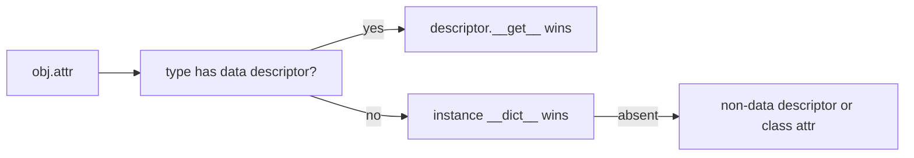

**Example:**
```python
class Positive:
    def __set_name__(self, owner, name):      # learns its own attribute name
        self._name = f"_{name}"

    def __get__(self, obj, objtype=None):
        if obj is None: return self
        return getattr(obj, self._name)

    def __set__(self, obj, value):
        if value <= 0:
            raise ValueError(f"{self._name[1:]} must be positive")
        setattr(obj, self._name, value)

class Order:
    quantity = Positive()
    price = Positive()
```

**Where they already are:** `property`, `classmethod`, `staticmethod`, `functools.cached_property`, `__slots__` entries and ORM model fields are all descriptors. Learning them explains several unrelated-looking features at once.

**Advantages:** Reusable attribute behaviour across many classes and fields, validation defined once, and the foundation for declarative frameworks.

**Disadvantages:** Indirection that is invisible at the call site, easy to get wrong for per-instance storage, and a steep step up in complexity from a simple property.

> 💡 **Tip:** Use `__set_name__` (Python 3.6+) instead of passing the attribute name into the descriptor's constructor. It removes the duplication that used to make descriptors fragile.

**Common mistake:** Storing the value on the descriptor itself rather than on the instance, so every instance of the class shares one value.

**Best intuition:** A descriptor is a property you can reuse — the same validation applied to many attributes on many classes.

**Terminology:** *descriptor protocol*, *data vs. non-data descriptor*, *`__set_name__`*, *attribute machinery*.

---

### 4.9 Dataclasses

**How it works:** `@dataclass` reads the class's annotated fields and generates the methods you asked for — `__init__`, `__repr__`, `__eq__`, plus ordering with `order=True` and immutability with `frozen=True`. The generated code is compiled once, at class creation, so instances pay no extra runtime cost.

**Options that matter:**

| Option | Effect |
|---|---|
| `frozen=True` | Blocks attribute assignment; generates `__hash__` |
| `slots=True` | Adds `__slots__` (3.10+), cutting memory |
| `order=True` | Generates `<`, `<=`, `>`, `>=` from field order |
| `kw_only=True` | Makes fields keyword-only (3.10+) |
| `field(default_factory=…)` | Fresh mutable default per instance |

**Example:**
```python
from dataclasses import dataclass, field, replace

@dataclass(frozen=True, slots=True)
class LineItem:
    sku: str
    quantity: int = 1
    tags: tuple[str, ...] = ()
    notes: list[str] = field(default_factory=list)   # never `= []`

item = LineItem("abc", 2)
replace(item, quantity=3)        # new instance, original untouched
```

**Mutable defaults:** A bare mutable default raises `ValueError` at class creation — dataclasses detect the shared-state bug that plain functions let through, and require `default_factory` instead.

**Advantages:** Far less boilerplate, correct `__eq__`/`__hash__` pairing, immutability and slots as one-word options, and full compatibility with type checkers.

**Disadvantages:** `frozen` is shallow, inheritance rules about defaults are fiddly (a field with a default cannot precede one without), and heavy validation still belongs in a library such as Pydantic or `attrs`.

> ⚠️ **Common misconception:** "`frozen=True` makes the object immutable." It blocks attribute *assignment*. A list stored in a field can still be mutated, so use tuples for truly immutable values.

**Common mistake:** Writing `tags: list[str] = []`, which dataclasses reject — the fix is `field(default_factory=list)`.

**Best intuition:** A dataclass is a record with the five obvious methods written for you, correctly, for free.

**Terminology:** *field*, *`default_factory`*, *frozen*, *slots*, *`dataclasses.replace`*.

---

### 4.10 Abstract Base Classes and Protocols

**How it works:** An ABC (`abc.ABC` plus `@abstractmethod`) refuses instantiation until every abstract method is implemented — a check performed at instantiation, not at class definition. A `typing.Protocol` defines a structural interface: any class with matching methods is compatible, checked statically with no inheritance and no registration.

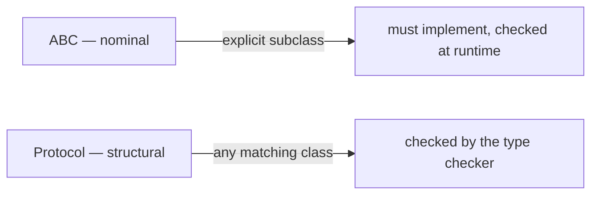

**Example:**
```python
from abc import ABC, abstractmethod
from typing import Protocol, runtime_checkable

class Repository(ABC):                     # nominal: opt in by inheriting
    @abstractmethod
    def get(self, key: str) -> bytes: ...

@runtime_checkable
class Closeable(Protocol):                 # structural: no inheritance needed
    def close(self) -> None: ...

def shutdown(resource: Closeable) -> None:
    resource.close()                       # any object with close() qualifies
```

**Which to use:** ABCs when you own the hierarchy and want shared implementation plus a runtime guarantee. Protocols when you are describing what you need from objects you do not control — file-like, closeable, iterable.

**Advantages:** ABCs catch incomplete implementations early and can provide mixin methods; protocols give duck typing that a type checker can verify, with zero runtime coupling.

**Disadvantages:** ABC checks happen only at instantiation, so an unimplemented method in a never-instantiated class goes unnoticed; `runtime_checkable` protocols check only method *names*, not signatures.

> 💡 **Tip:** `collections.abc` already defines the interfaces for iterables, sequences, mappings and sets. Inheriting from `collections.abc.Mapping` gives you a dozen methods from three.

**Common mistake:** Using `isinstance` with a `runtime_checkable` protocol and assuming it verified the signatures — it only confirms the attributes exist.

**Best intuition:** ABC asks "are you one of us?"; protocol asks "can you do what I need?".

**Terminology:** *nominal vs. structural typing*, *`@abstractmethod`*, *`Protocol`*, *`collections.abc`*, *virtual subclass*.

---

### 4.11 Slots and Memory Layout

**How it works:** Declaring `__slots__` tells the class to allocate a fixed array of attribute slots and skip the per-instance `__dict__`. Each slot name becomes a descriptor pointing at a fixed offset, so lookup is a direct index rather than a dictionary probe.

**Example:**
```python
class PointDict:
    def __init__(self, x, y): self.x, self.y = x, y

class PointSlots:
    __slots__ = ("x", "y")
    def __init__(self, x, y): self.x, self.y = x, y

# PointSlots instances are substantially smaller; the exact saving depends on
# the interpreter version, but it is typically around half for tiny objects.
```

**What you give up:** No new attributes at runtime, no `__dict__` (unless you add `"__dict__"` to the slots, which defeats the point), no `cached_property`, and inheritance needs every class in the chain to declare slots for the saving to hold.

**Time/space complexity:** Attribute access is marginally faster; memory per instance drops substantially, which is what matters when instances number in the millions.

**Advantages:** Large memory savings for many small objects, slightly faster attribute access, and typos raise `AttributeError` instead of silently creating new attributes.

**Disadvantages:** Loss of dynamism breaks libraries that attach attributes (some ORMs, mocking tools, pickling helpers), and it complicates multiple inheritance.

> ⚠️ **Common misconception:** "Slots make Python fast." They cut memory and give a small access improvement. They do not change algorithmic performance, and applying them everywhere is premature optimisation.

**Common mistake:** Adding `__slots__` to a base class but not the subclasses, so subclass instances get a `__dict__` anyway and the saving disappears.

**Best intuition:** Slots trade Python's open attribute model for a compact fixed layout — worth it exactly when the object count is large.

**Terminology:** *`__slots__`*, *instance dict*, *slot descriptor*, *memory footprint*, *`@dataclass(slots=True)`*.

---

### 4.12 Composition and Delegation

**How it works:** Composition stores collaborators as attributes and calls them; delegation forwards a method call to one of those attributes. Neither requires an inheritance relationship, so the classes stay independently testable and replaceable.

**Example:**
```python
class Engine:
    def start(self): return "running"

class Car:
    def __init__(self, engine): self.engine = engine       # composed
    def start(self): return self.engine.start()            # delegated

# Dynamic delegation when forwarding everything is genuinely wanted
class Proxy:
    def __init__(self, target): self._target = target
    def __getattr__(self, name):            # only called when normal lookup fails
        return getattr(self._target, name)
```

**Choosing between them:** Inheritance is right when the subclass is substitutable for its base everywhere (Liskov). Composition is right when you want *some* of another object's behaviour, or when the relationship may change.

| | Inheritance | Composition |
|---|---|---|
| Coupling | Tight, compile-time | Loose, runtime |
| Substitutable | Yes, by design | Only if you implement the interface |
| Swap implementation | Hard | Pass a different object |
| Testing | Needs the whole hierarchy | Inject a fake |

**Advantages:** Dependencies become visible constructor parameters, fakes drop straight in for tests, and behaviour can change at runtime.

**Disadvantages:** More forwarding code, and `__getattr__`-based delegation is invisible to type checkers and IDEs.

> 💡 **Tip:** Dependency injection in Python usually needs no framework — passing collaborators into `__init__` with sensible defaults covers nearly every case.

**Common mistake:** Subclassing `dict` or `list` to add behaviour, then discovering that built-in methods bypass your overrides. Subclass `collections.UserDict`/`UserList`, or compose.

**Best intuition:** Inherit to *be* something; compose to *use* something.

**Terminology:** *composition*, *delegation*, *Liskov substitution*, *dependency injection*, *`UserDict`*.

---

[[#📖 Master Table of Contents|⬆ Back to top]]

*End of Group 4. Next: Exceptions & Error Handling.*

---

## 5. Exceptions & Error Handling

### Table of Contents (this group)
- [[#5.1 The Exception Hierarchy]]
- [[#5.2 try, except, else and finally]]
- [[#5.3 Raising and Re-raising]]
- [[#5.4 Custom Exceptions]]
- [[#5.5 Exception Chaining]]
- [[#5.6 EAFP and LBYL]]
- [[#5.7 Tracebacks]]
- [[#5.8 Warnings]]
- [[#5.9 Exception Groups]]

---

### 5.1 The Exception Hierarchy

**How it works:** Raising an exception creates an instance of an exception class and unwinds the stack until a frame has a matching `except` clause. Matching is `isinstance`-based, so catching a base class catches every subclass beneath it.

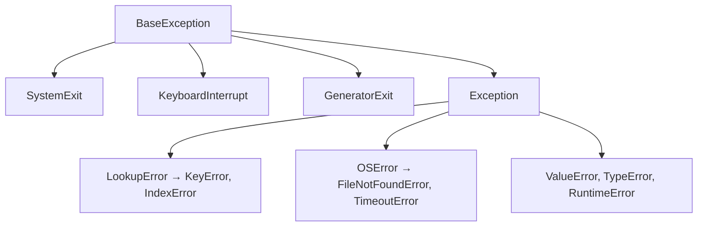

**Why `BaseException` exists separately:** `KeyboardInterrupt`, `SystemExit` and `GeneratorExit` are *control flow*, not errors. They deliberately sit outside `Exception` so that `except Exception:` — the broadest sane catch — does not swallow Ctrl-C or block a clean shutdown.

**Example:**
```python
try:
    risky()
except FileNotFoundError:        # most specific first
    ...
except OSError:                  # catches Permission, Timeout, ConnectionError…
    ...
except Exception:                # never BaseException
    ...
```

**Order matters:** Clauses are tested top to bottom, and the first match wins. A broad clause placed above a narrow one makes the narrow one unreachable — silently, with no warning.

**Advantages:** Precise or broad catching as needed, related errors grouped under meaningful bases (`OSError` covers the whole family of I/O failures), and `isinstance` semantics that work with your own hierarchies too.

**Disadvantages:** The hierarchy is large enough that people default to catching too broadly, and the built-in names do not always match intuition — `ValueError` for a wrong value, `TypeError` for a wrong type, and both for a wrong-looking argument.

> ⚠️ **Common misconception:** "`except Exception` catches everything." It does not catch `KeyboardInterrupt`, `SystemExit` or `GeneratorExit` — by design, and that is what you want.

**Common mistake:** Writing `except Exception:` (or bare `except:`) around a large block and losing the ability to distinguish a bug from an expected failure.

**Best intuition:** The hierarchy is a set of nested boxes. Catch the smallest box that you actually know how to handle.

**Terminology:** *`BaseException`*, *stack unwinding*, *exception matching*, *`OSError` family*, *bare except*.

---

### 5.2 try, except, else and finally

**How it works:** The interpreter installs an exception handler for the `try` block. On a raise it searches that frame's handlers in order, then unwinds to the caller if none match. `finally` is registered separately, so it runs on every exit path — success, exception, `return`, `break` or `continue`.

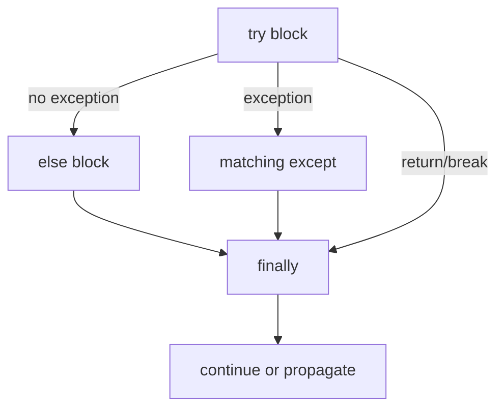

**Why `else` exists:** Code in `else` runs only if the `try` succeeded, and is *not* protected by the handlers. That keeps the `try` block down to the single statement that can fail, so a `KeyError` from the follow-up code is not accidentally caught by the same clause.

**Example:**
```python
try:
    conn = connect(dsn)
except ConnectionError as exc:
    logger.warning("connect failed: %s", exc)
    raise
else:
    rows = conn.query(sql)      # not guarded by the except above
finally:
    conn_pool.release(dsn)      # always, even on return or raise
```

**`finally` and `return`:** A `return` inside `finally` discards any in-flight exception and overrides the original return value — an easy way to make a failure vanish silently. Never return from `finally`.

**Time/space complexity:** Setting up a `try` block is essentially free in CPython 3.11+ ("zero-cost" exceptions): no work happens unless an exception is actually raised. Raising and handling is the expensive part.

**Advantages:** Each concern gets its own block, cleanup is guaranteed, and the structure makes the failure paths explicit rather than hidden in nested conditionals.

**Disadvantages:** Over-broad `try` blocks catch failures from code that was never meant to be guarded, and `finally` can mask exceptions if it raises or returns.

> 💡 **Tip:** Keep the `try` block to the smallest expression that can fail, and put everything else in `else`. This single habit removes most accidental over-catching.

**Common mistake:** Wrapping twenty lines in one `try` with a single `except Exception`, so a typo in line 18 is reported as if it were an expected error.

**Best intuition:** `try` is "might fail", `except` is "here is how I recover", `else` is "the happy path", `finally` is "regardless".

**Terminology:** *zero-cost exceptions*, *handler table*, *stack unwinding*, *cleanup*, *`else` clause*.

---

### 5.3 Raising and Re-raising

**How it works:** `raise Exc(...)` instantiates the class if needed, attaches a traceback frame and starts unwinding. A bare `raise` inside an `except` block re-raises the *current* exception with its traceback intact, which is what you want when you only meant to observe the failure.

**Losing versus keeping the traceback:**
```python
try:
    parse(payload)
except ValueError as exc:
    log.warning("bad payload")
    raise                      # keeps the original traceback

try:
    parse(payload)
except ValueError as exc:
    raise exc                  # adds a frame; the original path is still there but noisier
```

**`raise ... from ...`:** Explicit chaining sets `__cause__` and prints "The above exception was the direct cause of the following exception". Without `from`, Python still sets `__context__` implicitly and prints "During handling of the above exception, another exception occurred".

**Example:**
```python
def load_config(path):
    try:
        return json.loads(Path(path).read_text(encoding="utf-8"))
    except FileNotFoundError as exc:
        raise ConfigMissing(path) from exc      # domain error, original preserved
```

**Suppressing context:** `raise New() from None` clears the chain, which is appropriate when the underlying error is an implementation detail that would only confuse the caller.

**Advantages:** Failures propagate to a level that can actually handle them, tracebacks carry the full history, and translation to domain errors keeps the original cause attached.

**Disadvantages:** Re-raising inside deeply nested handlers produces long chained tracebacks; and `raise` outside an `except` block with no argument is itself a `RuntimeError`.

> ⚠️ **Common misconception:** "`raise exc` and bare `raise` are the same." Both keep the original traceback, but `raise exc` appends the current frame, and — more importantly — if `exc` was captured earlier in a different scope, you may re-raise something stale.

**Common mistake:** Catching an exception, logging it, and then *not* re-raising, so the caller proceeds as though the operation succeeded.

**Best intuition:** Catch only when you can act. If your handler ends in a log statement, it should probably end in `raise` too.

**Terminology:** *bare raise*, *`__cause__` / `__context__`*, *traceback preservation*, *exception translation*, *`from None`*.

---

### 5.4 Custom Exceptions

**How it works:** A custom exception is an ordinary class inheriting from `Exception`. Arguments passed to the constructor land in `args`, which is what the default `__str__` prints, so a minimal subclass already behaves correctly.

**Designing a hierarchy:** Give each library or package one base exception, then derive specific ones from it. Callers can then choose their precision: catch `PaymentError` for anything in the payment domain, or `CardDeclined` for the one case they handle differently.

**Example:**
```python
class StoreError(Exception):
    """Base for every error raised by this package."""

class NotFound(StoreError):
    def __init__(self, key):
        super().__init__(f"no entry for {key!r}")
        self.key = key                 # structured data, not just a message

class Conflict(StoreError):
    pass
```

**Carrying data:** Attaching attributes (`self.key`, `self.retry_after`) lets handlers make decisions without parsing the message string — and keeps logs structured.

**Inheriting from built-ins:** Deriving from `ValueError` or `KeyError` is useful when your error genuinely *is* one, because existing code that catches the built-in keeps working. Do it deliberately, not by habit.

**Advantages:** Precise handling, self-documenting failure modes, and a stable public contract for a library's callers.

**Disadvantages:** Over-designed hierarchies with dozens of classes nobody catches individually; and exceptions that carry heavy objects keep them alive as long as the exception is referenced.

> 💡 **Tip:** One base exception per package is the single most useful convention. It lets a caller write `except mylib.Error:` and know they have covered your library.

**Common mistake:** Raising `Exception("something went wrong")` in library code, forcing callers to catch everything or match on message text.

**Best intuition:** Exception classes are an API. Name them for what the caller needs to distinguish, not for what went wrong internally.

**Terminology:** *exception hierarchy*, *`args`*, *domain exception*, *error contract*, *structured error data*.

---

### 5.5 Exception Chaining

**How it works:** Every exception has `__context__` (set implicitly when raised during handling of another) and `__cause__` (set explicitly by `raise ... from ...`). The traceback printer walks these links and prints the whole chain, oldest first.

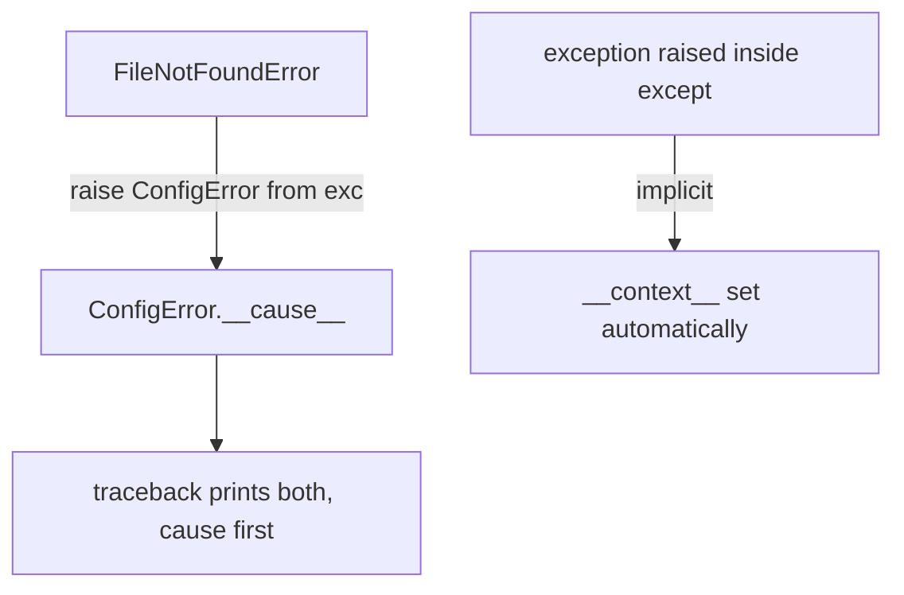

**The three forms:**

| Form | Sets | Traceback says |
|---|---|---|
| `raise New()` inside `except` | `__context__` | "During handling … another exception occurred" |
| `raise New() from exc` | `__cause__` | "The above exception was the direct cause …" |
| `raise New() from None` | `__suppress_context__` | Only the new exception |

**Example:**
```python
try:
    value = int(raw)
except ValueError as exc:
    raise ConfigError(f"port must be an integer, got {raw!r}") from exc
```

**Why it matters in production:** Error trackers group by the outermost exception. Without chaining, a `ConfigError` tells you nothing about *why*; with it, the original `FileNotFoundError` and its line are right there in the same event.

**Advantages:** Domain-level errors without loss of diagnostic detail, and automatic context even when you forget `from`.

**Disadvantages:** Long chains are noisy in logs, and accidental context (an exception raised inside a handler for an unrelated failure) can be misleading.

> ⚠️ **Common misconception:** "`from None` hides a bug." It hides the *cause*, which is right when the cause is an internal detail — but it also removes the evidence, so use it only when you have already logged what mattered.

**Common mistake:** Translating errors without `from`, then wondering why the traceback in the error tracker is useless.

**Best intuition:** `from` answers "why did this happen?"; implicit context answers "what was going on at the time?".

**Terminology:** *`__cause__`*, *`__context__`*, *implicit chaining*, *exception translation*, *`__suppress_context__`*.

---

### 5.6 EAFP and LBYL

**How it works:** EAFP performs the operation and handles failure; LBYL tests a precondition first. The performance difference comes from where the cost sits: a `try` block costs nothing when no exception occurs, while a check costs a lookup on every call — but raising and handling an exception is comparatively expensive.

**When each wins:**

| Situation | Prefer |
|---|---|
| Failure is rare | EAFP — no cost on the common path |
| Failure is common | LBYL — avoids expensive raises |
| Shared or concurrent state | EAFP — a check can go stale (TOCTOU) |
| Several preconditions to report | LBYL — clearer messages |

**Example:**
```python
# Race condition: the file can vanish between the check and the open
if os.path.exists(path):          # LBYL — unsafe here
    with open(path) as fh: ...

try:                              # EAFP — atomic
    with open(path) as fh: ...
except FileNotFoundError:
    ...
```

**Time/space complexity:** In CPython 3.11+ an untaken `try` is free; a raised-and-caught exception costs roughly a microsecond. Inside a loop over millions of items where most iterations fail, that adds up and LBYL wins.

**Advantages:** EAFP is atomic, shorter, and handles conditions you did not enumerate. LBYL is explicit, cheap on frequent failures, and can validate several things before acting.

**Disadvantages:** EAFP can catch more than intended if the `try` block is large; LBYL duplicates the interpreter's own checks and can be wrong under concurrency.

> 💡 **Tip:** `dict.get(key, default)`, `getattr(obj, name, default)` and `contextlib.suppress` give you the EAFP result with none of the syntax.

**Common mistake:** Checking `if key in d:` then `d[key]`, which does two lookups and still races if another thread mutates the dict.

**Best intuition:** Ask "is failure normal here?" — if it is exceptional, use EAFP; if it happens all the time, it is not an exception.

**Terminology:** *EAFP*, *LBYL*, *TOCTOU race*, *zero-cost exceptions*, *`contextlib.suppress`*.

---

### 5.7 Tracebacks

**How it works:** Each frame in the unwinding stack appends an entry to a traceback object, reachable as `exc.__traceback__`. The printer walks it from the outermost call inward, showing file, line, function and source text for each frame.

**Fine-grained locations:** Since Python 3.11, tracebacks underline the exact sub-expression that failed, so `a.b.c().d` reports which link in the chain was `None` rather than just the line number.

**Example:**
```python
import traceback, logging

try:
    process()
except Exception:
    logging.exception("processing failed")     # message + full traceback
    # or capture it as text
    detail = traceback.format_exc()
```

**`logging.exception` vs. `logging.error`:** `exception()` must be called from inside an `except` block and automatically attaches the traceback. `error()` does not, unless you pass `exc_info=True` — which is why so many production logs show an error with no stack.

**Reading a traceback:** Start at the bottom for the failure, then read upward to find the last frame in *your* code. In a chained traceback, the earliest block is the root cause.

**Advantages:** Precise diagnosis with no extra instrumentation, machine-readable through the `traceback` module, and complete history through chaining.

**Disadvantages:** Tracebacks can leak sensitive data into logs, they hold references to every frame's locals (which delays garbage collection), and deep recursion produces unreadably long output.

> ⚠️ **Common misconception:** "Catching an exception frees the memory it referenced." While `exc` is bound — and it stays bound until the end of the `except` block — the traceback keeps every frame and its locals alive. Python deletes the name at the end of the block for exactly this reason.

**Common mistake:** `logging.error(str(exc))`, which throws away the traceback and leaves you with "KeyError: 'id'" and no idea where.

**Best intuition:** A traceback is a snapshot of the call stack at the moment of failure — treat it as evidence, and never discard it.

**Terminology:** *traceback object*, *frame*, *`exc_info`*, *fine-grained error locations*, *`logging.exception`*.

---

### 5.8 Warnings

**How it works:** `warnings.warn(message, category)` issues a warning through the warnings machinery, which consults a list of filters to decide whether to print it, ignore it, show it once, or turn it into an exception. Filters match on category, message, module and line.

**Categories that matter:**

| Category | Meaning | Default |
|---|---|---|
| `DeprecationWarning` | Will be removed; aimed at developers | Hidden except in `__main__` |
| `PendingDeprecationWarning` | Removal planned further out | Hidden |
| `UserWarning` | Generic warning to the caller | Shown |
| `RuntimeWarning` | Dubious runtime behaviour | Shown |
| `ResourceWarning` | Unclosed file or socket | Hidden unless in dev mode |

**Example:**
```python
import warnings

def old_api(x):
    warnings.warn(
        "old_api() is deprecated; use new_api()",
        DeprecationWarning,
        stacklevel=2,          # point at the caller, not at this line
    )
    return new_api(x)
```

**`stacklevel` matters:** Without it the warning points at your own library file, which tells the user nothing. `stacklevel=2` points at the code that called the deprecated function.

**Advantages:** A non-fatal channel for communicating problems, filterable per category and module, and convertible to errors in CI so deprecations are fixed before they break.

**Disadvantages:** Hidden by default in the cases that matter most (deprecations in libraries), shown once per location so they are easy to miss, and no help at all if nobody reads the output.

> 💡 **Tip:** Run tests with `-W error::DeprecationWarning` and Python with `-X dev` in CI. Deprecations then fail the build while the fix is still cheap.

**Common mistake:** Omitting `stacklevel`, so users see a warning pointing inside your package and have no idea which of their calls triggered it.

**Best intuition:** A warning is a message to a developer; an exception is a message to the program. Use the one that matches who needs to act.

**Terminology:** *warnings filter*, *`DeprecationWarning`*, *`stacklevel`*, *`-X dev`*, *`simplefilter`*.

---

### 5.9 Exception Groups

**How it works:** An `ExceptionGroup` (Python 3.11+) wraps several exceptions raised together. `except*` clauses match by type *inside* the group, handle the matching subset, and let the rest propagate — so one `try` statement can run several `except*` clauses, unlike ordinary `except`.

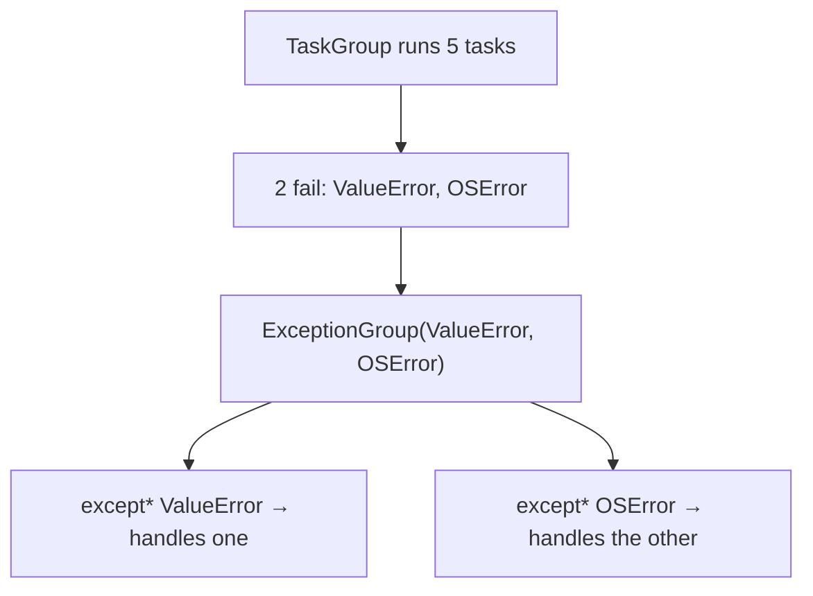

**Example:**
```python
try:
    async with asyncio.TaskGroup() as tg:
        for url in urls:
            tg.create_task(fetch(url))
except* TimeoutError as eg:
    logger.warning("%d timeouts", len(eg.exceptions))
except* ValueError as eg:
    logger.error("%d bad responses", len(eg.exceptions))
```

**Why it was needed:** Before 3.11, concurrent code had to pick one failure to report and discard the rest. `asyncio.gather(return_exceptions=True)` returned them as *values*, which meant errors stopped behaving like errors. Groups keep them as exceptions.

**Filtering:** `eg.subgroup(pred)` and `eg.split(pred)` partition a group, which is how `except*` is implemented and how you can route different failures to different handlers programmatically.

**Advantages:** No failure is lost in concurrent code, handlers stay type-based, and groups nest so structure is preserved.

**Disadvantages:** `except*` is new syntax with sharp edges — you cannot mix it with plain `except` in the same `try`, and `continue`/`break`/`return` are not allowed inside an `except*` block.

> ⚠️ **Common misconception:** "`except Exception` catches an `ExceptionGroup`." It does — the group itself is an `Exception` — but it gives you the wrapper, not the individual errors. Use `except*` to handle the contents.

**Common mistake:** Upgrading to `asyncio.TaskGroup` while keeping `except ValueError:` handlers, which no longer match because the error arrives wrapped in a group.

**Best intuition:** An exception group is a failure *set*. `except*` is a filter over that set, not a branch over a single value.

**Terminology:** *`ExceptionGroup`*, *except-star syntax*, *`BaseExceptionGroup`*, *subgroup/split*, *`TaskGroup`*.

---

[[#📖 Master Table of Contents|⬆ Back to top]]

*End of Group 5. Next: Iterators, Generators & Comprehensions.*

---

## 6. Iterators, Generators & Comprehensions

### Table of Contents (this group)
- [[#6.1 The Iterator Protocol]]
- [[#6.2 Iterables and Iterators]]
- [[#6.3 Generator Functions]]
- [[#6.4 Generator Expressions]]
- [[#6.5 yield from and Delegation]]
- [[#6.6 Comprehensions]]
- [[#6.7 The itertools Module]]
- [[#6.8 Lazy Evaluation and Pipelines]]
- [[#6.9 Two-way Generators]]
- [[#6.10 Infinite Sequences]]

---

### 6.1 The Iterator Protocol

**How it works:** `for x in obj` compiles to: call `iter(obj)` once, then call `next()` on the result repeatedly, catching `StopIteration` to end the loop. `iter()` uses `__iter__`, falling back to the legacy sequence protocol (`__getitem__` with integer indices starting at 0) when `__iter__` is absent.

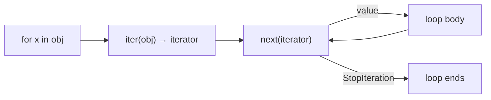

**Internal mechanism:** `StopIteration` is a real exception, caught by the loop's bytecode. That is why a `StopIteration` escaping from user code inside a generator used to silently end the loop — and why PEP 479 now converts it into a `RuntimeError` instead.

**Example:**
```python
class Countdown:
    def __init__(self, n): self.n = n
    def __iter__(self): return self                 # I am my own iterator
    def __next__(self):
        if self.n <= 0:
            raise StopIteration
        self.n -= 1
        return self.n + 1

list(Countdown(3))       # [3, 2, 1] — and now it is exhausted
```

**Advantages:** One protocol for every kind of sequence, constant memory over arbitrarily long streams, and user types that work with `for`, `in`, unpacking, comprehensions and every standard-library function that takes an iterable.

**Disadvantages:** An object that is its own iterator can be consumed only once, which surprises callers who expect list-like behaviour.

> ⚠️ **Common misconception:** "`StopIteration` is an error." It is normal control flow — the defined way for an iterator to say it is finished.

**Common mistake:** Returning `self` from `__iter__` in a container class, making it single-use. A container should return a *fresh* iterator each time.

**Best intuition:** `__iter__` hands out a cursor; `__next__` advances that cursor.

**Terminology:** *iterator protocol*, *`StopIteration`*, *sequence protocol fallback*, *PEP 479*, *cursor*.

---

### 6.2 Iterables and Iterators

**How it works:** An iterable implements `__iter__` and can produce many independent iterators. An iterator implements both `__iter__` (returning itself) and `__next__`, and carries the position — so it is consumed exactly once.

| | Iterable | Iterator |
|---|---|---|
| Implements | `__iter__` | `__iter__` and `__next__` |
| Holds position | No | Yes |
| Reusable | Yes | No |
| Examples | list, dict, str, range | generator, `map`, `zip`, file object |

**Why files are both:** A file object is its own iterator, which is why a second `for line in f:` over the same handle yields nothing — the position is at the end.

**Example:**
```python
data = [1, 2, 3]
list(data), list(data)        # [1,2,3] twice — new iterator each time

it = iter(data)
list(it), list(it)            # [1,2,3] then [] — exhausted
```

**Multiple passes:** `itertools.tee(iterator, n)` produces n independent iterators from one, but it buffers whatever one has consumed and the others have not — so it can use as much memory as materialising a list.

**Advantages:** Reusable sources behave predictably, and single-use iterators make streaming explicit.

**Disadvantages:** The distinction is invisible at a glance: `map(...)`, `zip(...)` and generator objects look like sequences until a second pass quietly yields nothing.

> ⚠️ **Common misconception:** "A generator is a list I can loop over twice." It is an iterator. The second loop finds it empty, with no error to tell you.

**Common mistake:** Passing a generator to two functions, where the first consumes it and the second silently receives nothing.

**Best intuition:** An iterable is a book; an iterator is a bookmark. You can have many bookmarks in one book, but each bookmark only moves forward.

**Terminology:** *iterable*, *iterator*, *exhaustion*, *`itertools.tee`*, *single-pass*.

---

### 6.3 Generator Functions

**How it works:** A function containing `yield` compiles to a generator function: calling it creates a generator object and executes nothing. Each `next()` runs the body until the next `yield`, hands back the value, and freezes the frame — locals, instruction pointer and all — until the following `next()`.

```mermaid
flowchart TD
    A["gen = countdown(3)"] --> B["frame created, body not run"]
    B --> C["next() → runs to first yield"]
    C --> D["value returned, frame suspended"]
    D -->|"next()"| E["resumes after the yield"]
    E --> F["function returns → StopIteration"]
```

**Internal mechanism:** The frame is heap-allocated rather than living on the call stack, which is what allows it to survive between calls. That frame keeps its locals — and anything they reference — alive for the generator's lifetime.

**Example:**
```python
def read_records(path):
    with open(path, encoding="utf-8") as fh:      # stays open across yields
        for line in fh:
            line = line.strip()
            if line:
                yield parse(line)

for record in read_records("big.csv"):            # constant memory
    process(record)
```

**`return` in a generator:** A `return` ends the generator and its value becomes the `StopIteration.value` — which is what `yield from` picks up, and is otherwise invisible to a `for` loop.

**Time/space complexity:** O(1) memory for the generator itself regardless of how many items it yields; each `next()` costs one resume, slightly more than a plain loop iteration.

**Advantages:** Constant memory over huge sequences, natural streaming, early termination for free, and readable code that looks like the loop it replaces.

**Disadvantages:** Single-use, harder to debug (the frame is suspended when you inspect it), and exceptions surface at consumption time rather than where the generator was created.

> 💡 **Tip:** If a generator holds a resource open across yields — a file, a connection — the consumer's behaviour controls when it is released. `contextlib.closing` or an explicit `close()` makes that deterministic.

**Common mistake:** Adding `yield` to a function that callers expect to run immediately. Nothing happens until someone iterates, so the side effects silently never occur.

**Best intuition:** A generator is a function with a pause button and a memory of where it stopped.

**Terminology:** *generator function*, *generator object*, *suspended frame*, *`StopIteration.value`*, *lazy production*.

---

### 6.4 Generator Expressions

**How it works:** A generator expression compiles to an anonymous generator function that is called immediately, producing a generator object. The first iterable is evaluated eagerly — at creation — while everything else runs lazily on consumption.

**Example:**
```python
total = sum(row.amount for row in rows)        # no intermediate list
names = (u.name for u in users if u.active)    # nothing computed yet
first = next(names, None)                      # computes exactly one
```

**When parentheses are optional:** As the sole argument to a function, the extra parentheses can be dropped — `sum(x * x for x in data)`. With more than one argument they are required.

**Comprehension versus generator expression:**

| | `[x for x in it]` | `(x for x in it)` |
|---|---|---|
| Builds | A list, immediately | A generator |
| Memory | O(n) | O(1) |
| Reusable | Yes | No |
| Best for | Repeated use, indexing | One pass, large data |

**Advantages:** Constant memory, composable into pipelines, and short-circuiting functions such as `any` and `next` stop as soon as they can.

**Disadvantages:** Single-use, invisible cost deferral, and debugging output shows `<generator object ...>` rather than the data.

> ⚠️ **Common misconception:** "A generator expression is lazy about everything." The outermost iterable is evaluated when the expression is created, so `(x for x in expensive())` calls `expensive()` immediately.

**Common mistake:** Using a generator expression where the result is iterated more than once — the second pass sees nothing.

**Best intuition:** Square brackets mean "build it now"; parentheses mean "build it as you go".

**Terminology:** *generator expression*, *lazy evaluation*, *short-circuiting*, *eager outer iterable*.

---

### 6.5 yield from and Delegation

**How it works:** `yield from sub` yields every value from `sub`, and — when `sub` is a generator — establishes a transparent channel: `send()`, `throw()` and `close()` on the outer generator are forwarded to the inner one, and the inner generator's `return` value becomes the value of the `yield from` expression.

**Example:**
```python
def flatten(items):
    for item in items:
        if isinstance(item, (list, tuple)):
            yield from flatten(item)      # recursion stays lazy and flat
        else:
            yield item

list(flatten([1, [2, [3, 4]], 5]))        # [1, 2, 3, 4, 5]
```

**Capturing a return value:**
```python
def inner():
    yield 1
    return "done"

def outer():
    result = yield from inner()           # result == "done"
    yield result
```

**Why it matters historically:** `yield from` (PEP 380) made generator delegation correct, which is what allowed `asyncio` coroutines to be built on generators before `async`/`await` syntax existed.

**Time/space complexity:** Delegation avoids re-yielding through every level manually, so deep recursion costs O(depth) in suspended frames rather than O(depth) work per item.

**Advantages:** Composable generators, correct forwarding of two-way operations, and clean recursive traversal.

**Disadvantages:** Deep chains mean deep frame stacks, and a `yield from` on a non-generator iterable forwards values but has nothing to forward `send()` to.

> 💡 **Tip:** `yield from` is not just shorthand for a loop. The loop form breaks `send`, `throw`, `close` and the return value — use `yield from` whenever the inner object is a generator.

**Common mistake:** Writing `for x in sub: yield x` inside a coroutine-style generator and losing two-way communication.

**Best intuition:** `yield from` splices another generator into this one, pipes and all.

**Terminology:** *delegation*, *PEP 380*, *sub-generator*, *transparent forwarding*, *`StopIteration.value`*.

---

### 6.6 Comprehensions

**How it works:** A comprehension compiles to a dedicated code object with its own scope, executed immediately. The loop variable therefore does not leak — a deliberate Python 3 change — and the first iterable is evaluated in the enclosing scope before the comprehension's own frame starts.

**The three forms plus one:**
```python
[f(x) for x in it if p(x)]        # list
{f(x) for x in it}                # set
{k(x): v(x) for x in it}          # dict
(f(x) for x in it)                # generator expression
```

**Nesting order:** Multiple `for` clauses read in the same order as nested loops — `[(a, b) for a in xs for b in ys]` iterates `ys` inside `xs`. Conditions attach to the clause they follow.

**Example:**
```python
matrix = [[1, 2], [3, 4]]
flat = [n for row in matrix for n in row]             # [1, 2, 3, 4]
transposed = [[row[i] for row in matrix] for i in range(2)]

# if/else goes before the for, because it is a conditional expression
labels = ["even" if n % 2 == 0 else "odd" for n in range(4)]
```

**Time/space complexity:** O(n) time and O(n) memory for the built container. Comprehensions are faster than the equivalent `append` loop because the append is done by a specialised bytecode instruction rather than a method lookup and call.

**Advantages:** Concise, faster than manual loops, no accumulator variable, and expressive enough to replace most `map`/`filter` usage.

**Disadvantages:** Readability collapses quickly with nesting or multiple conditions, and a comprehension always builds the whole container — which is the wrong choice for large data.

> ⚠️ **Common misconception:** "Comprehensions are just syntactic sugar for loops." They are — but with their own scope, so `del` of the loop variable afterwards fails and name shadowing behaves differently from Python 2.

**Common mistake:** Using a list comprehension purely for its side effects (`[send(x) for x in items]`), which builds and discards a list of `None`. Write the loop.

**Best intuition:** A comprehension describes the collection you want, not the steps to build it.

**Terminology:** *comprehension scope*, *nested clause order*, *conditional expression*, *side-effect comprehension*.

---

### 6.7 The itertools Module

**How it works:** Every function in `itertools` returns a lazy iterator implemented in C, so combining them costs almost nothing per item and keeps memory constant.

| Function | Produces | Typical use |
|---|---|---|
| `chain(a, b)` | Items of each in turn | Joining sources |
| `islice(it, n)` | First n items, lazily | Limiting a stream |
| `groupby(it, key)` | Runs of equal keys | Grouping *sorted* data |
| `zip_longest(a, b)` | Pads the shorter | Aligning uneven sequences |
| `accumulate(it)` | Running totals | Cumulative sums |
| `batched(it, n)` | Fixed-size tuples | Chunked API calls (3.12+) |
| `count/cycle/repeat` | Infinite sources | Counters, round-robin |
| `product/permutations/combinations` | Combinatorics | Test matrices, search |

**The `groupby` trap:** It groups *consecutive* equal keys, so the input must be sorted by the same key first. Unsorted input produces many small groups rather than one per key — and the group iterator is invalidated as soon as you advance to the next group.

**Example:**
```python
from itertools import groupby, islice, batched

rows.sort(key=lambda r: r.dept)                     # required for groupby
for dept, group in groupby(rows, key=lambda r: r.dept):
    print(dept, len(list(group)))                   # materialise before advancing

for chunk in batched(ids, 500):                     # 3.12+
    api.delete_many(chunk)
```

**Advantages:** Constant memory, C-speed iteration, and named operations that make intent obvious compared with hand-written index juggling.

**Disadvantages:** Several functions have sharp edges (`groupby` ordering, `tee` buffering, infinite iterators), and heavy chaining becomes hard to read.

> 💡 **Tip:** The module documentation's "recipes" section contains ready-made implementations of `take`, `unique_everseen`, `sliding_window` and more — most of them now also available in the third-party `more-itertools`.

**Common mistake:** Using `groupby` on unsorted data and getting duplicate groups for the same key.

**Best intuition:** `itertools` is the standard library's answer to "I need to do something to a stream without materialising it".

**Terminology:** *lazy iterator*, *`groupby` runs*, *`tee` buffering*, *combinatoric iterator*, *recipes*.

---

### 6.8 Lazy Evaluation and Pipelines

**How it works:** Chained generators form a pull-based pipeline: the consumer asks the last stage for an item, which asks the stage before it, all the way back to the source. One item moves through the whole chain before the next one starts.

```mermaid
flowchart LR
    A["file lines"] --> B["strip"]
    B --> C["parse"]
    C --> D["filter valid"]
    D --> E["consumer: sum / write / insert"]
    E -.pulls one item at a time.-> A
```

**Example:**
```python
def pipeline(path):
    lines = (line.strip() for line in open(path, encoding="utf-8"))
    rows = (parse(line) for line in lines if line)
    return (row for row in rows if row.is_valid)

total = sum(row.amount for row in pipeline("huge.csv"))   # constant memory
```

**Early termination:** Because nothing is computed ahead of demand, `next(pipeline(...))` does the work for exactly one item. That is what makes `any`, `all`, `next` and `islice` genuinely cheap on large sources.

**Time/space complexity:** Time is O(n) as usual; memory is O(1) plus whatever a single item costs, regardless of the source size.

**Advantages:** Processes data larger than memory, composes cleanly, and makes early exit free.

**Disadvantages:** Errors surface at consumption time, far from the pipeline definition; resources stay open until the pipeline is exhausted or closed; and a pipeline can only be consumed once.

> ⚠️ **Common misconception:** "Building the pipeline does the work." Nothing runs until something consumes it — which is why a pipeline built inside a `with` block and consumed outside it reads from a closed file.

**Common mistake:** Returning a generator that reads from a file opened in a `with` block that has already exited, producing `ValueError: I/O operation on closed file`.

**Best intuition:** A pipeline is a chain of straws, not a chain of buckets. Nothing moves until someone sucks at the end.

**Terminology:** *pull-based*, *lazy pipeline*, *early termination*, *resource lifetime*, *streaming*.

---

### 6.9 Two-way Generators

**How it works:** `yield` is an expression, not just a statement. `gen.send(value)` resumes the generator and makes `value` the result of the `yield` that suspended it. `gen.throw(exc)` raises an exception at that point, and `gen.close()` raises `GeneratorExit` there.

**The priming rule:** A newly created generator has not reached its first `yield`, so the first `send` must be `send(None)` — or equivalently `next(gen)` — otherwise Python raises `TypeError`.

**Example:**
```python
def running_average():
    total = count = 0
    average = None
    while True:
        value = yield average          # receives what send() passes in
        total += value
        count += 1
        average = total / count

avg = running_average()
next(avg)              # prime it
avg.send(10)           # 10.0
avg.send(20)           # 15.0
```

**Cleanup with `close()`:** `GeneratorExit` is raised inside the generator at the suspended `yield`, so a `try/finally` around the body is how a generator releases resources deterministically. Yielding again after `GeneratorExit` is an error.

**Historical role:** This is the machinery `asyncio` was originally built on — `yield` suspending, the event loop resuming with a value — before `async`/`await` gave it dedicated syntax. Modern async code should use coroutines, not generator-based ones.

**Advantages:** A suspended computation that can be fed values, natural for accumulators and coroutine-style protocols, and deterministic cleanup through `close`.

**Disadvantages:** Priming is easy to forget, the control flow is genuinely hard to read, and native coroutines are clearer for anything asynchronous.

> ⚠️ **Common misconception:** "`send` is how you pass arguments to a generator." Arguments go in the call that creates it; `send` feeds a *running* generator at its current `yield`.

**Common mistake:** Calling `send(value)` before priming, producing `TypeError: can't send non-None value to a just-started generator`.

**Best intuition:** A two-way generator is a conversation: each `yield` is a turn where it speaks and then listens.

**Terminology:** *priming*, *`send`/`throw`/`close`*, *`GeneratorExit`*, *generator-based coroutine*, *suspension point*.

---

### 6.10 Infinite Sequences

**How it works:** An infinite iterator never raises `StopIteration`. It is usable only because consumers can stop early — `islice`, `takewhile`, `zip` with a finite partner, or `break`.

**Example:**
```python
from itertools import count, cycle, islice, takewhile

ids = count(1000)                            # 1000, 1001, 1002, …
next(ids)                                    # one at a time is fine

first_ten = list(islice(count(), 10))        # bounded
small = list(takewhile(lambda n: n < 5, count()))

for server, request in zip(cycle(servers), requests):    # round-robin
    send(server, request)
```

**Where they appear:** Sequential ID generation, round-robin scheduling, retry back-off schedules, polling loops, and simulation clocks — anywhere an arbitrary upper bound would be a lie.

**Time/space complexity:** O(1) memory; time depends entirely on how much the consumer pulls.

**Advantages:** No arbitrary limits, natural modelling of unbounded processes, and composition with the rest of `itertools`.

**Disadvantages:** Any eager operation on one — `list()`, `sorted()`, `len()`, `sum()`, `max()` — never terminates and consumes memory until the process is killed.

> ⚠️ **Common misconception:** "Python will stop me from listing an infinite generator." It will not. The process grows until the operating system kills it.

**Common mistake:** Debugging by printing a `count()`-based pipeline with `list()`, which hangs the session.

**Best intuition:** Infinite sources are safe as long as something downstream sets the boundary. Always pair them with a limiter.

**Terminology:** *`count`/`cycle`/`repeat`*, *`islice`*, *`takewhile`*, *bounded consumption*, *round-robin*.

---

[[#📖 Master Table of Contents|⬆ Back to top]]

*End of Group 6. Next: Decorators, Context Managers & Metaprogramming.*

---

## 7. Decorators, Context Managers & Metaprogramming

### Table of Contents (this group)
- [[#7.1 Decorators]]
- [[#7.2 Decorators with Arguments]]
- [[#7.3 Class Decorators]]
- [[#7.4 Context Managers]]
- [[#7.5 The contextlib Module]]
- [[#7.6 Metaclasses]]
- [[#7.7 init_subclass and set_name]]
- [[#7.8 Dynamic Attributes]]
- [[#7.9 Reflection]]
- [[#7.10 exec, eval and Code Generation]]

---

### 7.1 Decorators

**How it works:** `@deco` above `def f` compiles to `f = deco(f)`, executed at definition time. The decorator receives the function object and returns whatever should be bound to the name — usually a wrapper closure that calls the original.

```mermaid
flowchart LR
    A["def f"] --> B["function object"]
    B --> C["deco(f)"]
    C --> D["wrapper closure"]
    D --> E["name f now refers to wrapper"]
    D -.calls.-> B
```

**Why `functools.wraps` matters:** The wrapper is a different function object with its own `__name__`, `__doc__`, `__annotations__` and signature. `@wraps(func)` copies those across and sets `__wrapped__`, so `help()`, `inspect.signature`, pytest fixture resolution and framework discovery keep working.

**Example:**
```python
import functools, time

def timed(func):
    @functools.wraps(func)
    def wrapper(*args, **kwargs):
        start = time.perf_counter()
        try:
            return func(*args, **kwargs)
        finally:
            logger.info("%s took %.3fs", func.__name__, time.perf_counter() - start)
    return wrapper
```

**Stacking order:** Decorators apply bottom-up. With `@a` above `@b`, the result is `a(b(f))`, so `b` wraps the function and `a` wraps that — the outermost decorator runs first at call time.

**Advantages:** Cross-cutting behaviour in one place, applied declaratively; no edits to the wrapped function; and composable through stacking.

**Disadvantages:** Indirection hides what actually runs, stack traces gain frames, and a decorator that forgets `wraps` silently breaks introspection everywhere downstream.

> ⚠️ **Common misconception:** "A decorator runs when the function is called." The decorator itself runs once, at import time. Only the wrapper it returns runs per call — which is why an expensive decorator slows start-up, not throughput.

**Common mistake:** Omitting `@functools.wraps`, then finding that documentation, Celery task names or FastAPI route signatures are wrong.

**Best intuition:** A decorator is a function transformer applied at definition time.

**Terminology:** *wrapper*, *`functools.wraps`*, *`__wrapped__`*, *decorator stacking*, *definition-time execution*.

---

### 7.2 Decorators with Arguments

**How it works:** A parameterised decorator is a function returning a decorator — three levels: the factory takes the configuration, the decorator takes the function, the wrapper takes the call arguments.

**Example:**
```python
import functools

def retry(attempts=3, exceptions=(Exception,)):
    def decorator(func):                       # receives the function
        @functools.wraps(func)
        def wrapper(*args, **kwargs):          # receives the call
            last = None
            for attempt in range(attempts):
                try:
                    return func(*args, **kwargs)
                except exceptions as exc:
                    last = exc
            raise last
        return wrapper
    return decorator

@retry(attempts=5)
def fetch(url): ...
```

**The parentheses trap:** `@retry` and `@retry()` are different. The first passes the *function* as `attempts`; the second calls the factory correctly. Supporting both requires an explicit check for whether the single argument is callable.

**Class-based alternative:** A class with `__init__` for configuration and `__call__` for the wrapping is often easier to read than three nested functions, and gives the decorator inspectable state.

**Advantages:** One configurable decorator instead of many variants, and closures capture the configuration cleanly.

**Disadvantages:** Three levels of nesting is genuinely hard to read, and the missing-parentheses mistake produces a confusing error far from its cause.

> 💡 **Tip:** Make configuration keyword-only (`def retry(*, attempts=3)`). Then `@retry` without parentheses fails immediately with a clear error instead of silently binding the function to a parameter.

**Common mistake:** Writing `@retry` where `@retry()` was meant, which "works" until the first call fails with a bizarre `TypeError`.

**Best intuition:** Configuration, then function, then call — three layers, in that order.

**Terminology:** *decorator factory*, *three-level nesting*, *keyword-only configuration*, *class-based decorator*.

---

### 7.3 Class Decorators

**How it works:** A class decorator receives the fully created class object and returns what the name should refer to — normally the same class after modification, occasionally a subclass or a wholly different object.

**Example:**
```python
def register(registry):
    def decorator(cls):
        registry[cls.__name__] = cls        # inspect and record
        cls.registered = True               # or modify
        return cls
    return decorator

HANDLERS = {}

@register(HANDLERS)
class JsonHandler: ...
```

**Where the standard library uses them:** `@dataclass` generates methods from annotations, `@functools.total_ordering` fills in comparison methods, and `@typing.final` marks a class as non-subclassable for type checkers.

**Versus metaclasses:**

| | Class decorator | Metaclass |
|---|---|---|
| Runs | After the class exists | While it is being built |
| Affects subclasses | No | Yes, inherited |
| Can change the namespace | No | Yes |
| Complexity | Low | High |

**Advantages:** Simple to write and to read, composable by stacking, and applied explicitly where you can see it.

**Disadvantages:** Not inherited — every subclass must be decorated too — and cannot influence how the class body is evaluated.

> ⚠️ **Common misconception:** "A class decorator applies to subclasses." It does not. If inherited behaviour is required, use `__init_subclass__` or a metaclass.

**Common mistake:** Forgetting to `return cls`, which binds the class name to `None` and produces a bewildering error at first use.

**Best intuition:** A class decorator is post-processing; a metaclass is a different factory.

**Terminology:** *class decorator*, *registration*, *`total_ordering`*, *post-creation modification*.

---

### 7.4 Context Managers

**How it works:** `with expr as name:` evaluates `expr`, calls `__enter__` and binds its return value to `name`. On leaving the block — normally, by exception, by `return` or by `break` — it calls `__exit__(exc_type, exc_value, traceback)`.

```mermaid
flowchart TD
    A["with obj as x"] --> B["obj.__enter__() → x"]
    B --> C["block body"]
    C -->|normal| D["__exit__(None, None, None)"]
    C -->|exception| E["__exit__(type, value, tb)"]
    E -->|returns True| F["exception suppressed"]
    E -->|returns False| G["exception propagates"]
```

**Suppression:** Returning a truthy value from `__exit__` swallows the exception. This is how `contextlib.suppress` works — and why accidentally returning a truthy value from `__exit__` is a serious bug that hides failures.

**Example:**
```python
class Transaction:
    def __init__(self, conn): self.conn = conn
    def __enter__(self):
        self.conn.execute("BEGIN")
        return self.conn
    def __exit__(self, exc_type, exc, tb):
        self.conn.execute("ROLLBACK" if exc_type else "COMMIT")
        return False               # never swallow
```

**Multiple managers:** `with a() as x, b() as y:` enters left to right and exits right to left, which is what makes nested resource ownership correct by construction.

**Advantages:** Cleanup that cannot be forgotten, exception-safe by design, and a natural place to express paired operations — open/close, acquire/release, begin/commit.

**Disadvantages:** `__exit__` swallowing exceptions by accident, and managers that hide expensive setup behind a single line.

> ⚠️ **Common misconception:** "`with` is only for files." It is for any paired setup and teardown: locks, transactions, temporary directories, timers, mocked state, changed working directories.

**Common mistake:** Returning a truthy value from `__exit__` — often by ending it with a call that returns something — and silently discarding every exception raised in the block.

**Best intuition:** `with` is `try/finally` with the cleanup written once, next to the setup that needs it.

**Terminology:** *context manager protocol*, *`__enter__`/`__exit__`*, *exception suppression*, *resource acquisition*.

---

### 7.5 The contextlib Module

**How it works:** `@contextmanager` turns a generator into a context manager: everything before the single `yield` is `__enter__`, the yielded value is bound by `as`, and everything after — inside a `finally` — is `__exit__`.

**Example:**
```python
from contextlib import contextmanager, suppress, ExitStack

@contextmanager
def timed(label):
    start = time.perf_counter()
    try:
        yield                                   # the block runs here
    finally:
        logger.info("%s: %.3fs", label, time.perf_counter() - start)

with timed("import"):
    run_import()
```

**The toolkit:**

| Tool | Purpose |
|---|---|
| `@contextmanager` | Generator-based context manager |
| `suppress(Exc)` | Ignore specific exceptions |
| `closing(obj)` | Call `obj.close()` on exit |
| `ExitStack()` | Manage a dynamic number of managers |
| `nullcontext(x)` | A no-op manager, for optional resources |
| `redirect_stdout(f)` | Temporarily capture output |

**`ExitStack` in practice:** When the number of resources is only known at runtime — opening N files, acquiring N locks — `ExitStack` registers each as it is entered and unwinds them all correctly on exit.

**Exception handling in a generator manager:** An exception in the block is raised *at the `yield`*, so `try/finally` (or `try/except`) around it is how you observe or clean up after it.

**Advantages:** Far less boilerplate than a class, reads top to bottom, and `ExitStack` solves the dynamic case that `with` syntax cannot express.

**Disadvantages:** A generator manager must yield exactly once — zero or two yields raise `RuntimeError` — and it cannot easily be reused for two concurrent `with` blocks unless created fresh each time.

> 💡 **Tip:** `nullcontext()` removes the "with or without" branch: `cm = open(path) if path else nullcontext()` then a single `with cm as f:`.

**Common mistake:** Reusing a single `@contextmanager` instance for two `with` blocks, which fails because its generator is already exhausted.

**Best intuition:** The `yield` is the hole where the `with` block's body is pasted.

**Terminology:** *`@contextmanager`*, *`ExitStack`*, *`suppress`*, *`nullcontext`*, *single-yield rule*.

---

### 7.6 Metaclasses

**How it works:** `class C(Base, metaclass=M)` evaluates the class body into a namespace dict, then calls `M(name, bases, namespace)`. The metaclass's `__new__` can inspect or rewrite that namespace before the class object exists; `__init__` runs after; and `__call__` controls what happens when the class is *instantiated*.

```mermaid
flowchart TD
    A["class body executes"] --> B["namespace dict"]
    B --> C["metaclass.__new__(name, bases, ns)"]
    C --> D["metaclass.__init__(cls, …)"]
    D --> E["class object exists"]
    E -->|"C(...)"| F["metaclass.__call__ → __new__ → __init__"]
```

**Example:**
```python
class ValidatedMeta(type):
    def __new__(mcls, name, bases, ns):
        if bases and "handle" not in ns:
            raise TypeError(f"{name} must define handle()")
        cls = super().__new__(mcls, name, bases, ns)
        cls.registry_key = name.lower()
        return cls

class Handler(metaclass=ValidatedMeta):
    pass

class JsonHandler(Handler):
    def handle(self, payload): ...     # required, or TypeError at definition time
```

**Where they are genuinely used:** ORMs (turning class attributes into columns), ABCs (`ABCMeta` implements abstract-method checking), serialisation frameworks, and enum creation. `type` itself is the default metaclass — and `type` is its own metaclass.

**Advantages:** Validation at class-creation time, inherited automatically by every subclass, and full control over the namespace before the class exists.

**Disadvantages:** Hard to read, conflicts when two bases have different metaclasses, and confusing interactions with class decorators and typing. Most uses are better served by `__init_subclass__`.

> ⚠️ **Common misconception:** "Metaclasses control instance creation." They control *class* creation; they affect instance creation only through `__call__`, which is a separate hook.

**Common mistake:** Reaching for a metaclass when a class decorator or `__init_subclass__` would do, and inheriting a metaclass conflict the first time someone mixes your class with another framework's.

**Best intuition:** A class is an instance of its metaclass. Everything else follows from that.

**Terminology:** *`type`*, *metaclass conflict*, *class namespace*, *`ABCMeta`*, *`__prepare__`*.

---

### 7.7 init_subclass and set_name

**How it works:** `__init_subclass__` is an implicit class method on a base class, called with the new subclass every time one is defined. `__set_name__` is called on every class attribute when the owning class is created, receiving the owner class and the attribute's name.

**Example:**
```python
class Plugin:
    registry = {}

    def __init_subclass__(cls, /, name=None, **kwargs):
        super().__init_subclass__(**kwargs)          # always cooperate
        Plugin.registry[name or cls.__name__.lower()] = cls

class CsvPlugin(Plugin, name="csv"):                 # keyword goes to the hook
    ...

Plugin.registry          # {'csv': CsvPlugin}
```

**`__set_name__` for descriptors:**
```python
class Field:
    def __set_name__(self, owner, name):
        self.name = name                 # no duplication: Field() knows its own name

class Model:
    title = Field()      # __set_name__(Model, "title") runs at class creation
```

**Why they replaced most metaclasses:** Both hooks (PEP 487, Python 3.6) cover the two dominant metaclass use cases — subclass registration/validation and descriptor naming — with ordinary methods, no metaclass conflicts and far less complexity.

**Advantages:** Simple, inherited, cooperative with `super()`, and free of metaclass conflicts when classes are combined.

**Disadvantages:** They run *after* the class namespace is built, so they cannot rewrite the body; and forgetting `super().__init_subclass__(**kwargs)` breaks cooperation in deeper hierarchies.

> 💡 **Tip:** Ask "do I need to change the class body, or just react to the finished class?" Only the first genuinely requires a metaclass.

**Common mistake:** Omitting the `super()` call in `__init_subclass__`, which silently skips other base classes' hooks.

**Best intuition:** These are the metaclass hooks you actually wanted, available without writing a metaclass.

**Terminology:** *PEP 487*, *`__init_subclass__`*, *`__set_name__`*, *subclass registration*, *class keyword arguments*.

---

### 7.8 Dynamic Attributes

**How it works:** `__getattr__(self, name)` is called only when normal lookup fails; `__getattribute__` intercepts every access; `__setattr__` and `__delattr__` intercept writes and deletes. `__dir__` controls what `dir()` reports.

**Example:**
```python
class Config:
    def __init__(self, data): 
        object.__setattr__(self, "_data", data)     # bypass our own __setattr__

    def __getattr__(self, name):                    # only on miss
        try:
            return self._data[name]
        except KeyError:
            raise AttributeError(name) from None

    def __setattr__(self, name, value):
        self._data[name] = value

cfg = Config({"host": "localhost"})
cfg.host        # 'localhost'
cfg.port = 80   # stored in _data
```

**The recursion trap:** Inside `__setattr__`, writing `self.x = v` calls `__setattr__` again. Use `object.__setattr__(self, ...)` or `self.__dict__[...]`. The same applies to reading `self._data` inside `__getattr__` when `_data` itself is missing — hence the careful initialisation above.

**What it cannot do:** Implicit dunder lookups bypass both hooks entirely, so a proxy must define `__len__`, `__iter__`, `__eq__` and friends explicitly rather than forwarding them dynamically.

**Advantages:** Attribute-style access to dynamic data, lazy loading, proxies and mocks, and cleaner APIs for configuration objects.

**Disadvantages:** Invisible to type checkers, IDE completion and code search; typos become silent lookups; and `__getattribute__` in particular has a real per-access cost.

> ⚠️ **Common misconception:** "`__getattr__` intercepts all attribute access." Only the failures. Anything found on the instance or the class never reaches it.

**Common mistake:** Raising `KeyError` instead of `AttributeError` from `__getattr__`, which breaks `hasattr`, `getattr` defaults and `copy`/`pickle`.

**Best intuition:** `__getattr__` is the fallback the interpreter consults before giving up.

**Terminology:** *`__getattr__` vs. `__getattribute__`*, *proxy*, *lazy attribute*, *recursion guard*, *`__dir__`*.

---

### 7.9 Reflection

**How it works:** Every Python object exposes its structure at runtime. `type()` gives the class, `vars()` the instance dict, `dir()` the reachable names, `getattr`/`setattr`/`hasattr` read and write by name, and `inspect` provides higher-level access to signatures, source and class hierarchies.

**Example:**
```python
import inspect

def public_methods(obj):
    return [
        name for name, member in inspect.getmembers(obj, callable)
        if not name.startswith("_")
    ]

def to_dict(obj):
    return {k: v for k, v in vars(obj).items() if not k.startswith("_")}
```

**Where frameworks rely on it:** pytest collects functions named `test_*`; serialisers walk `__dataclass_fields__` or annotations; dependency injection reads constructor signatures; admin interfaces build forms from model fields.

**`getattr` with a default** is the safe form — `getattr(obj, name, fallback)` — and is often clearer than `hasattr` followed by access, which performs two lookups and swallows property errors.

**Advantages:** Generic tools that work on unknown types, less repetitive code, and the ability to build declarative frameworks.

**Disadvantages:** Static analysis cannot follow it, renames break silently, and dynamic attribute names from untrusted input are a security problem.

> ⚠️ **Common misconception:** "`dir()` lists everything an object has." It lists what the object *reports*, which `__dir__` can customise, and it omits dynamic attributes produced by `__getattr__`.

**Common mistake:** `getattr(obj, user_supplied_name)` — mass assignment and attribute disclosure in one line. Always validate against an explicit allow-list.

**Best intuition:** Reflection is how a program reads its own documentation. Use it in tools, sparingly in application code.

**Terminology:** *reflection*, *`getattr`/`setattr`*, *`inspect.getmembers`*, *allow-list*, *`__dir__`*.

---

### 7.10 exec, eval and Code Generation

**How it works:** `compile(source, filename, mode)` turns text into a code object; `eval` runs one in expression mode and returns the value; `exec` runs statements and returns `None`. Both accept explicit `globals` and `locals` dictionaries.

**Why libraries generate code:** `dataclasses`, `attrs`, `namedtuple` and Pydantic build `__init__` and `__eq__` as source text and `exec` it, because a generated function runs at full speed while a reflective equivalent would pay introspection cost on every call.

**Example:**
```python
# How dataclasses-style generation works, in miniature
def make_init(fields):
    args = ", ".join(fields)
    body = "\n".join(f"    self.{f} = {f}" for f in fields)
    source = f"def __init__(self, {args}):\n{body}\n"
    namespace = {}
    exec(source, {}, namespace)          # trusted, generated source only
    return namespace["__init__"]
```

**Why restricting globals does not make it safe:** Python objects reachable from any expression expose `__class__`, `__bases__` and `__subclasses__`, from which an attacker can navigate to arbitrary callables. "Sandboxed `eval`" has been broken repeatedly; there is no supported way to do it in CPython.

**Safe alternatives:** `ast.literal_eval` for data literals, `json.loads` for JSON, a small parser or a dispatch dict for expressions, and `importlib` for loading named modules.

**Advantages:** Genuinely faster generated methods, and the ability to build APIs that would otherwise require heavy runtime introspection.

**Disadvantages:** Arbitrary code execution if any input is untrusted, invisible to linters and type checkers, tracebacks pointing at `<string>`, and debuggers that cannot step into the generated code.

> ⚠️ **Common misconception:** "`eval` with empty globals is sandboxed." It is not. Treat `eval`/`exec` on external input as remote code execution, without exception.

**Common mistake:** Using `eval` to parse configuration or user-supplied numbers where `ast.literal_eval` or `int()` would do.

**Best intuition:** Generate code from *your* templates, never from someone else's strings.

**Terminology:** *`compile`*, *`exec` vs. `eval`*, *`ast.literal_eval`*, *code generation*, *sandbox escape*.

---

[[#📖 Master Table of Contents|⬆ Back to top]]

*End of Group 7. Next: Modules, Packages & Environments.*

---

## 8. Modules, Packages & Environments

### Table of Contents (this group)
- [[#8.1 Modules and the Import System]]
- [[#8.2 Packages]]
- [[#8.3 Absolute and Relative Imports]]
- [[#8.4 sys.path and Module Resolution]]
- [[#8.5 Circular Imports]]
- [[#8.6 main and Entry Points]]
- [[#8.7 Virtual Environments]]
- [[#8.8 Dependency Management]]
- [[#8.9 Distributing a Package]]
- [[#8.10 Namespace Packages and Plugins]]

---

### 8.1 Modules and the Import System

**How it works:** `import x` first checks `sys.modules`. On a miss, a chain of *finders* locates the module, a *loader* executes its code in a fresh namespace, and the resulting module object is stored in `sys.modules` before the name is bound. Every later import of `x` is a dictionary lookup.

```mermaid
flowchart TD
    A["import x"] --> B{"x in sys.modules?"}
    B -->|yes| C["bind the cached module"]
    B -->|no| D["finders search sys.path"]
    D --> E["loader compiles and executes"]
    E --> F["store in sys.modules"]
    F --> C
```

**Modules execute once:** Top-level code in a module runs exactly once per process. That is why module-level state behaves like a singleton — and why import side effects are so hard to reason about.

**Example:**
```python
import sys
sys.modules["json"]           # the cached module object
import json as j              # same object, new name
j is sys.modules["json"]      # True
```

**Reloading:** `importlib.reload(module)` re-executes the code but leaves existing references pointing at the old objects, so reloading is unreliable for anything but interactive experimentation.

**Advantages:** Fast repeat imports, a natural namespace boundary, and a fully introspectable, pluggable import mechanism.

**Disadvantages:** Import side effects run at unpredictable times, the module cache makes testing import-dependent behaviour awkward, and heavy imports dominate start-up time.

> ⚠️ **Common misconception:** "Importing a module twice runs it twice." It runs once per process; the second import is a cache hit. Two *different* names for the same file (via different `sys.path` entries) can, however, create two separate module objects.

**Common mistake:** Doing work at import time — opening connections, reading files, calling APIs — which makes importing the module a side-effectful operation that tests and tools cannot avoid.

**Best intuition:** An import is "run this file once, then hand me the namespace it produced".

**Terminology:** *`sys.modules`*, *finder/loader*, *module object*, *import side effect*, *`importlib`*.

---

### 8.2 Packages

**How it works:** A directory becomes a package when Python can import it. With an `__init__.py`, that file runs on first import and its namespace *is* the package's namespace. Importing `a.b.c` imports `a`, then `a.b`, then `a.b.c` — running each `__init__.py` on the way down.

**What `__init__.py` is for:** Defining the package's public surface (`from .core import Client`), setting `__all__`, and package-level initialisation. Keeping it small matters: everything it imports is loaded whenever *any* submodule is imported.

**Example:**
```python
# myapp/__init__.py
from .client import Client          # myapp.Client works
__all__ = ["Client"]
__version__ = "1.2.0"
```

**Structure:**
```
myapp/
    __init__.py        # package namespace
    client.py          # myapp.client
    api/
        __init__.py    # myapp.api
        routes.py      # myapp.api.routes
```

**Advantages:** Hierarchical organisation, a controlled public API, and a single place for package-level configuration.

**Disadvantages:** A heavy `__init__.py` slows every import of the package, and re-exporting aggressively creates import cycles between submodules.

> 💡 **Tip:** Keep `__init__.py` to re-exports and constants. If it imports the whole package, `import myapp.util` pays for the database driver too.

**Common mistake:** Importing submodules from `__init__.py` that themselves import from the package, creating a cycle that only breaks when someone imports in a new order.

**Best intuition:** A package is a module whose body happens to live in `__init__.py` and whose namespace can contain other modules.

**Terminology:** *package*, *`__init__.py`*, *subpackage*, *`__all__`*, *public API*.

---

### 8.3 Absolute and Relative Imports

**How it works:** An absolute import resolves from the top of `sys.path`. A relative import resolves from the importing module's `__package__` — one leading dot means the current package, two means the parent.

**Example:**
```python
# inside myapp/api/routes.py
from myapp.models import User      # absolute: explicit, greppable
from ..models import User          # relative: survives renaming the top package
from .helpers import parse         # relative sibling
```

**Why relative imports fail in scripts:** Running a file directly sets `__package__` to `None`, so a relative import has nothing to resolve against and raises `ImportError: attempted relative import with no known parent package`. Running it as `python -m myapp.api.routes` sets the package correctly.

| | Absolute | Relative |
|---|---|---|
| Readability | Explicit path | Shorter, positional |
| Rename top package | Must update | Unaffected |
| Works in a directly run script | Yes | No |
| PEP 8 preference | Recommended | Acceptable within a package |

**Advantages:** Absolute imports are unambiguous and searchable; relative imports keep a package self-contained and movable.

**Disadvantages:** Relative imports obscure where a name comes from and break direct script execution; absolute imports tie the code to the distribution name.

> ⚠️ **Common misconception:** "Relative imports are discouraged." PEP 8 prefers absolute imports but explicitly accepts relative ones inside a package, particularly for deep hierarchies.

**Common mistake:** Running `python myapp/api/routes.py` and hitting a relative-import error, then converting everything to absolute imports instead of running `python -m myapp.api.routes`.

**Best intuition:** Absolute says where a module lives in the world; relative says where it lives relative to me.

**Terminology:** *absolute import*, *relative import*, *`__package__`*, *`-m` execution*, *implicit relative import (removed in Python 3)*.

---

### 8.4 sys.path and Module Resolution

**How it works:** `sys.path` is a list of directories searched in order. It starts with the script's directory (or the current directory for `-c` and the REPL), then `PYTHONPATH` entries, then the environment's `site-packages`, then the standard library.

```mermaid
flowchart TD
    A["import name"] --> B["sys.modules cache"]
    B -->|miss| C["script dir / cwd"]
    C -->|miss| D["PYTHONPATH"]
    D -->|miss| E["site-packages (venv)"]
    E -->|miss| F["standard library"]
    F -->|miss| G["ModuleNotFoundError"]
```

**Shadowing:** Because the script's directory comes first, a local `random.py` or `email.py` shadows the standard library module of the same name — for your code *and* for every library that imports it. The error is usually a bizarre `AttributeError` far from the file you created.

**Example:**
```python
import sys
sys.path[:3]                     # where imports are searched first
import json; json.__file__       # which file actually provided the module
```

**Editable installs:** `pip install -e .` puts a link to your source directory on the path, so imports resolve to your working copy — which is why the same import can resolve differently in development and in production.

**Advantages:** One documented search order, per-environment isolation, and full introspection of where any module came from.

**Disadvantages:** Shadowing is silent, `sys.path` manipulation at runtime makes resolution unpredictable, and the current-directory entry means behaviour depends on where you launched the process.

> 💡 **Tip:** When an import behaves unexpectedly, print `module.__file__`. It answers "which copy am I actually running?" in one line.

**Common mistake:** Naming a file after a standard-library or third-party module — `types.py`, `logging.py`, `select.py` — and breaking imports across the whole process.

**Best intuition:** `sys.path` is a search path like the shell's `PATH`, with the same shadowing hazards.

**Terminology:** *`sys.path`*, *`site-packages`*, *shadowing*, *editable install*, *`ModuleNotFoundError`*.

---

### 8.5 Circular Imports

**How it works:** When A imports B and B imports A, the second import finds A already in `sys.modules` — but only partially executed. Any name defined *after* the import statement in A does not exist yet, so B sees a half-built module.

```mermaid
flowchart LR
    A["a.py starts executing"] --> B["import b"]
    B --> C["b.py executes"]
    C --> D["import a → cached, incomplete"]
    D --> E["uses a.Thing → AttributeError"]
```

**Why `import a` sometimes works when `from a import Thing` does not:** Binding the module object succeeds even while it is incomplete; the attribute is only looked up when used. Deferring the attribute access until call time is therefore a valid workaround.

**Example:**
```python
# models.py
from .services import notify          # ImportError if services imports models

# Fix 1: import the module, use the attribute later
from . import services
def save(self): services.notify(self)

# Fix 2: import inside the function
def save(self):
    from .services import notify
    notify(self)
```

**Real fixes:** Move the shared piece into a third module, invert the dependency (pass the collaborator in), or use `typing.TYPE_CHECKING` for imports needed only for annotations.

**Advantages:** None — a cycle is a design signal that two modules are really one concern, or that a dependency points the wrong way.

**Disadvantages:** Fragile behaviour that depends on import order, so the same code works in production and fails in a test that imports modules in a different sequence.

> ⚠️ **Common misconception:** "Function-level imports fix circular imports." They defer the problem, which is often enough — but the cycle is still there, and it will resurface. Treat it as a temporary measure.

**Common mistake:** Adding a type annotation that requires an import, creating a cycle at runtime for something only the type checker needs. Guard it with `if TYPE_CHECKING:` and quote the annotation.

**Best intuition:** A cycle means the boundary between the two modules is in the wrong place.

**Terminology:** *partially initialised module*, *import order dependence*, *`TYPE_CHECKING`*, *dependency inversion*, *deferred import*.

---

### 8.6 main and Entry Points

**How it works:** Python sets `__name__` to `"__main__"` in the module it is running as the program, and to the module's dotted name everywhere else. The `if __name__ == "__main__":` guard therefore distinguishes execution from import.

**Why the guard is mandatory for multiprocessing:** On Windows and macOS (spawn start method), child processes *import* the main module to rebuild state. Without the guard, that import re-runs the process-spawning code, and the program forks recursively until it is killed.

**Example:**
```python
# myapp/cli.py
def main() -> int:
    ...
    return 0

if __name__ == "__main__":
    raise SystemExit(main())
```

**Entry points:** Declared in `pyproject.toml`, they generate a console command at install time:
```toml
[project.scripts]
myapp = "myapp.cli:main"
```

**`__main__.py`:** A package containing `__main__.py` can be run as `python -m myapp`, which is the standard way to make a package executable without installing a script.

**Advantages:** One file can be both a library and a program, installed commands work on every platform, and `-m` execution sets up the package correctly for relative imports.

**Disadvantages:** Code under the guard is invisible to importers and often untested, and entry points only exist after installation — not when running from a source checkout.

> 💡 **Tip:** Keep `main()` a thin wrapper that parses arguments and calls a normal function. That function is then testable without simulating a command line.

**Common mistake:** Omitting the guard in a script that uses `multiprocessing`, producing an infinite spawn loop that is baffling the first time you see it.

**Best intuition:** `__name__` answers "am I the program, or a part of one?".

**Terminology:** *`__main__`*, *entry point*, *console script*, *`-m` execution*, *spawn start method*.

---

### 8.7 Virtual Environments

**How it works:** `python -m venv .venv` creates a directory containing a `pyvenv.cfg`, a `bin`/`Scripts` folder with interpreter shims, and an empty `site-packages`. Activating it puts that folder first on `PATH`, so `python` and `pip` resolve to the environment's copies and installs land inside it.

```mermaid
flowchart LR
    A["python -m venv .venv"] --> B[".venv/bin/python"]
    B --> C[".venv/lib/.../site-packages"]
    C --> D["imports resolve here first"]
    E["system Python"] -.untouched.-> F["OS packages"]
```

**Why isolation matters:** Two projects routinely need incompatible versions of the same library, and installing into the system Python can break operating-system tooling that depends on it. Modern Linux distributions block system-wide `pip install` for exactly this reason.

**Example:**
```bash
python -m venv .venv
source .venv/bin/activate        # Windows: .venv\Scripts\activate
pip install -r requirements.txt
python -c "import sys; print(sys.prefix)"   # points at .venv
```

**The modern alternatives:** `uv` and `pdm`/`poetry` create and manage environments automatically per project; containers give the same isolation at the OS level. The underlying idea — one dependency set per project — is identical.

**Advantages:** Reproducible per-project dependencies, no system pollution, trivially disposable (delete the folder), and no special privileges required.

**Disadvantages:** Another thing to remember to activate, environments are not relocatable (paths are baked in), and disk usage multiplies across projects.

> ⚠️ **Common misconception:** "A virtual environment isolates the Python version too." It does not — it links to one interpreter. Changing Python version means creating a new environment with that interpreter, which is what `pyenv`, `uv python` and containers manage.

**Common mistake:** Forgetting to activate, installing into the system Python, and then wondering why the import fails inside the project.

**Best intuition:** A virtual environment is a private `site-packages` plus a `PATH` trick. Nothing more magical than that.

**Terminology:** *`venv`*, *`site-packages`*, *activation*, *`sys.prefix`*, *interpreter shim*.

---

### 8.8 Dependency Management

**How it works:** `pyproject.toml` declares dependencies as version *ranges* — what the project supports. A lock file records the exact resolved versions and hashes that were actually installed and tested, so every machine reproduces the same tree.

**Example:**
```toml
[project]
name = "myapp"
requires-python = ">=3.11"
dependencies = [
    "httpx>=0.27,<1.0",
    "pydantic>=2.6",
]

[dependency-groups]
dev = ["pytest>=8", "ruff"]
```

**Ranges versus pins:**

| | Library | Application |
|---|---|---|
| Declare | Permissive ranges | Ranges plus a lock file |
| Pin exactly | No — causes conflicts for users | Yes, via the lock file |
| Why | Must co-exist with other packages | Must be reproducible |

**Transitive dependencies:** The resolver must find one version of each package that satisfies every requirement. Over-pinning in a library makes that impossible for users — the classic cause of "cannot resolve dependencies" errors.

**Advantages:** Reproducible installs, a single standard configuration file, and separate groups for development-only tools.

**Disadvantages:** Lock files are tool-specific and large; resolution can be slow; and a lock file guarantees the same versions, not the same behaviour, since C extensions and system libraries still vary.

> 💡 **Tip:** Applications commit their lock file; libraries do not. The library's job is to declare what it works with; the application's job is to record what it shipped.

**Common mistake:** Pinning exact versions in a library's `dependencies`, which makes it uninstallable alongside anything else with the same requirement.

**Best intuition:** `pyproject.toml` says what you support; the lock file says what you shipped.

**Terminology:** *`pyproject.toml`*, *lock file*, *version specifier*, *transitive dependency*, *resolver*.

---

### 8.9 Distributing a Package

**How it works:** A build backend (`hatchling`, `setuptools`, `flit`, `poetry-core`) reads `pyproject.toml` and produces two artefacts: an sdist (`.tar.gz`, source) and a wheel (`.whl`, built). `pip` prefers the wheel, which installs by unpacking with no build step.

**Wheel naming:** `myapp-1.0-py3-none-any.whl` is pure Python and installs anywhere; `numpy-2.0-cp312-cp312-manylinux_x86_64.whl` is compiled for one Python version, ABI and platform. That is why "it installed locally but not in the container" is nearly always a wheel-compatibility issue.

**Example:**
```toml
[build-system]
requires = ["hatchling"]
build-backend = "hatchling.build"

[project]
name = "myapp"
version = "1.0.0"
```
```bash
python -m build          # produces dist/*.whl and dist/*.tar.gz
python -m twine upload dist/*
```

**Versioning:** Semantic versioning is the community norm, and PEP 440 defines what Python accepts — including pre-release (`1.0rc1`) and post-release forms. Publishing is immutable: a version on PyPI can be yanked but never replaced.

**Advantages:** Fast, reproducible installs; no compiler needed on the target machine; and a standard, backend-agnostic configuration format.

**Disadvantages:** Building compiled wheels for every platform is genuinely hard (hence `cibuildwheel`), and a missing wheel silently falls back to building from source — slowly, or not at all.

> ⚠️ **Common misconception:** "`pip install` downloads source and builds it." For most packages it downloads a pre-built wheel. Source builds are the fallback, and the reason some installs suddenly need a C compiler.

**Common mistake:** Publishing without testing the artefact — install the built wheel into a clean environment and import it before uploading.

**Best intuition:** An sdist is the recipe; a wheel is the finished meal.

**Terminology:** *wheel*, *sdist*, *build backend*, *PEP 440*, *ABI tag*, *`manylinux`*.

---

### 8.10 Namespace Packages and Plugins

**How it works:** A namespace package (PEP 420) has no `__init__.py`. When Python finds directories with a matching name on `sys.path` and none contains `__init__.py`, it creates a namespace package whose contents are the union of those directories — so separately installed distributions can share one import prefix.

**Plugin discovery via entry points:** A package declares in its metadata that it provides something under a named group. The host reads that metadata with `importlib.metadata.entry_points()` and imports only what it needs — no scanning, no importing every installed package.

**Example:**
```toml
# in the plugin package
[project.entry-points."myapp.plugins"]
csv = "myapp_csv.plugin:Plugin"
```
```python
# in the host application
from importlib.metadata import entry_points

for ep in entry_points(group="myapp.plugins"):
    plugin_cls = ep.load()          # imports only this plugin
    register(plugin_cls())
```

**Advantages:** Extensibility without the host knowing its plugins, independent release cycles per plugin, and shared namespaces for organisational package families.

**Disadvantages:** A stray `__init__.py` in one distribution breaks the namespace; debugging "which directory provided this" is harder; and entry points only exist for *installed* packages, not for a source tree on `sys.path`.

> ⚠️ **Common misconception:** "Missing `__init__.py` is always a mistake." Since PEP 420 it is how namespace packages work — but inside a regular package it usually *is* a mistake, and causes subtle packaging bugs where a subdirectory silently ships empty.

**Common mistake:** Relying on entry points while developing from a checkout without installing the package (`pip install -e .`), so the host finds no plugins at all.

**Best intuition:** Namespace packages merge directories under one name; entry points are a phone book of what is installed.

**Terminology:** *PEP 420*, *namespace package*, *entry point*, *`importlib.metadata`*, *plugin group*.

---

[[#📖 Master Table of Contents|⬆ Back to top]]

*End of Group 8. Next: Concurrency, Parallelism & Asyncio.*

---

## 9. Concurrency, Parallelism & Asyncio

### Table of Contents (this group)
- [[#9.1 Concurrency and Parallelism]]
- [[#9.2 The Global Interpreter Lock]]
- [[#9.3 Threads]]
- [[#9.4 Thread Synchronisation]]
- [[#9.5 Multiprocessing]]
- [[#9.6 concurrent.futures]]
- [[#9.7 The Event Loop]]
- [[#9.8 Coroutines and await]]
- [[#9.9 Tasks and Task Groups]]
- [[#9.10 Async Iteration and Context Managers]]
- [[#9.11 Blocking Calls in Async Code]]
- [[#9.12 Choosing a Concurrency Model]]

---

### 9.1 Concurrency and Parallelism

**How it works:** Concurrency is about structure — several tasks interleaved on one or more cores. Parallelism is about execution — several tasks progressing at the same instant on different cores. A single-core machine can be concurrent but never parallel.

```mermaid
flowchart TD
    A["Concurrency: tasks interleave"] --> B["one core, rapid switching"]
    C["Parallelism: tasks run together"] --> D["several cores, simultaneous"]
    E["I/O-bound work"] --> A
    F["CPU-bound work"] --> C
```

**Why the distinction decides your tool:** I/O-bound code spends its time waiting, so interleaving is enough — threads or asyncio. CPU-bound code needs real cores, which in CPython means processes (or releasing the GIL inside a C extension).

**Diagnosing which you have:** Measure CPU utilisation while the program runs. Near 100% of one core means CPU-bound; low utilisation with long wall-clock time means I/O-bound.

**Advantages of concurrency:** Much better throughput when waiting dominates, with far less memory than one thread per connection.

**Disadvantages:** Shared state needs synchronisation, bugs are timing-dependent and hard to reproduce, and debugging is markedly harder than in sequential code.

> ⚠️ **Common misconception:** "Adding threads makes Python faster." For CPU-bound work in CPython, threads add overhead and contention without adding throughput — the GIL serialises the bytecode execution.

**Common mistake:** Reaching for `multiprocessing` on an I/O-bound workload, paying process and serialisation costs for a problem threads would have solved more cheaply.

**Best intuition:** Concurrency is one cook juggling several dishes; parallelism is several cooks. Waiting for water to boil needs the first; chopping a mountain of onions needs the second.

**Terminology:** *concurrency*, *parallelism*, *I/O-bound*, *CPU-bound*, *throughput vs. latency*.

---

### 9.2 The Global Interpreter Lock

**How it works:** The GIL is a mutex protecting CPython's interpreter state. A thread must hold it to execute bytecode, and it is released around blocking I/O, `time.sleep`, and inside C extensions that explicitly release it. Since 3.2 the interpreter also asks a running thread to drop it periodically (by default every 5 ms) so others get a turn.

```mermaid
flowchart TD
    A["Thread A holds GIL"] --> B["executes bytecode"]
    B --> C{"blocking I/O or switch interval?"}
    C -->|yes| D["release GIL"]
    D --> E["Thread B acquires GIL"]
    C -->|no| B
```

**Why it exists:** Reference counting is not atomic. Without a global lock, every `Py_INCREF`/`Py_DECREF` would need per-object synchronisation, slowing single-threaded code — which is most Python code — considerably. The GIL was the pragmatic trade.

**What it does not prevent:** Race conditions in your own code. `counter += 1` is load, add, store — three bytecodes — and a thread switch between them loses an increment. The GIL protects the *interpreter*, not your invariants.

**The free-threaded build:** PEP 703 added an experimental build without the GIL in Python 3.13, and PEP 779 made that build officially supported in 3.14. It is still opt-in, not the default, and extensions must be built for it. Python 3.12 also added a per-interpreter GIL (PEP 684), which lets separate subinterpreters run in parallel within one process.

**Advantages:** Simple, fast single-threaded execution; straightforward C extension API; no fine-grained locking overhead in the interpreter.

**Disadvantages:** No parallel speed-up for CPU-bound pure-Python threads, and a long-running C call that does not release the GIL stalls every other thread.

> ⚠️ **Common misconception:** "The GIL makes Python thread-safe." It makes the interpreter safe from corruption. Your shared counters, dicts and invariants still need locks.

**Common mistake:** Benchmarking a CPU-bound function with threads, seeing no improvement, and concluding Python "cannot do concurrency" — the right tool was processes.

**Best intuition:** The GIL is a talking stick: one thread speaks at a time, and hands it over whenever it pauses to wait.

**Terminology:** *GIL*, *switch interval*, *reference counting*, *free-threaded build (PEP 703)*, *per-interpreter GIL (PEP 684)*.

---

### 9.3 Threads

**How it works:** `threading.Thread` wraps an OS thread. All threads in a process share memory, so passing data is free but mutation is dangerous. `start()` begins execution, `join()` waits for completion, and a daemon thread does not keep the process alive at exit.

**Example:**
```python
import threading, queue

work = queue.Queue()

def worker():
    while True:
        item = work.get()
        try:
            handle(item)
        finally:
            work.task_done()          # always, even on failure

for _ in range(4):
    threading.Thread(target=worker, daemon=True).start()
```

**Where threads genuinely help:** Any call that releases the GIL — socket reads, file I/O, `requests`, database drivers, `time.sleep`, and NumPy operations that release it internally. Ten threads waiting on ten HTTP requests really do wait in parallel.

**Time/space complexity:** Each thread costs an OS stack (often around 8 MB of virtual address space, far less resident) plus scheduling overhead. Thousands of threads become impractical; thousands of async tasks do not.

**Advantages:** Works with existing synchronous libraries, shares memory without serialisation, and is simple for a small number of concurrent operations.

**Disadvantages:** No CPU parallelism in CPython, race conditions are easy and hard to reproduce, exceptions in a thread do not propagate to the main thread, and cancellation is not supported.

> ⚠️ **Common misconception:** "Threads are for speed." In CPython they are for *waiting* — overlapping latency, not multiplying compute.

**Common mistake:** Letting a thread die silently. An unhandled exception kills only that thread; the program continues believing the work is in progress. Always wrap the body or use `threading.excepthook`.

**Best intuition:** A thread is a second worker in the same room, sharing every tool on the bench — convenient and dangerous for exactly the same reason.

**Terminology:** *daemon thread*, *`join`*, *`queue.Queue`*, *`threading.excepthook`*, *GIL release*.

---

### 9.4 Thread Synchronisation

**How it works:** Synchronisation primitives coordinate access to shared state. A `Lock` grants exclusive access; an `RLock` may be re-acquired by the same thread; an `Event` broadcasts a one-way signal; a `Condition` lets threads wait for a predicate; a `Semaphore` caps concurrency; a `Queue` combines a lock and a condition into a safe hand-off.

| Primitive | Use for |
|---|---|
| `Lock` | One critical section at a time |
| `RLock` | Re-entrant sections (recursive calls) |
| `Event` | Signal "it happened" to many threads |
| `Condition` | Wait for a predicate to become true |
| `Semaphore` | Limit concurrent access to N |
| `Queue` | Safe producer/consumer hand-off |

**Example:**
```python
import threading

lock = threading.Lock()
balance = 0

def deposit(amount):
    global balance
    with lock:                 # always a context manager
        balance += amount      # load-add-store made atomic by the lock
```

**Deadlock:** Two threads each holding one lock and waiting for the other's. The classic prevention is a fixed global lock ordering, plus timeouts (`lock.acquire(timeout=...)`) so a deadlock becomes a detectable failure.

**Atomicity in practice:** Some operations — `list.append`, `dict[key] = value` — are atomic in CPython today because they complete within one bytecode. Relying on that is fragile: it is an implementation detail, not a guarantee, and read-modify-write sequences are never atomic.

**Advantages:** Correctness for shared state, ready-made high-level tools (`Queue`) that remove most manual locking.

**Disadvantages:** Locks serialise, cutting the concurrency you were trying to gain; deadlocks are easy to create and hard to reproduce; and lock granularity is a genuinely difficult design problem.

> 💡 **Tip:** Prefer message passing over shared state. A `queue.Queue` between producer and consumer threads eliminates most locking, and most lock bugs with it.

**Common mistake:** Acquiring a lock without `with`, then returning or raising before releasing it — permanently blocking every other thread.

**Best intuition:** A lock is a single key to a room. The fewer rooms and the shorter the visits, the better the whole system works.

**Terminology:** *critical section*, *deadlock*, *lock ordering*, *re-entrant lock*, *producer/consumer*.

---

### 9.5 Multiprocessing

**How it works:** Each process has its own interpreter, memory and GIL, so CPU-bound work runs in parallel. Data moves between processes by *pickling* — objects are serialised, sent through a pipe, and reconstructed on the other side.

```mermaid
flowchart LR
    A["parent process"] -->|pickle| B["process 1"]
    A -->|pickle| C["process 2"]
    B -->|pickle result| A
    C -->|pickle result| A
    B --- D["own GIL, own memory"]
    C --- E["own GIL, own memory"]
```

**Start methods:** `fork` (Linux default historically) copies the parent cheaply but is unsafe with threads; `spawn` (Windows and macOS default, and the default on Linux from Python 3.14) starts a fresh interpreter and re-imports the main module — which is why the `__main__` guard is mandatory.

**Example:**
```python
from multiprocessing import Pool

def transform(chunk): ...

if __name__ == "__main__":            # required for spawn
    with Pool(processes=4) as pool:
        results = pool.map(transform, chunks)
```

**Time/space complexity:** Process start-up costs tens of milliseconds, and every argument and result is serialised. The work per task must be large enough to dominate that overhead — otherwise multiprocessing is slower than a plain loop.

**Advantages:** Real parallelism across cores, isolation (a crash takes down one worker), and no shared-state race conditions by construction.

**Disadvantages:** Expensive start-up and data transfer, everything must be picklable (no lambdas, no local functions, no open sockets), debugging is harder, and memory multiplies per process.

> ⚠️ **Common misconception:** "Processes share memory if I use a global." They do not. Under `fork` a child sees a *copy* at fork time; under `spawn` it sees nothing. Shared state requires `multiprocessing.Value`, `Array`, `Manager` or `shared_memory`.

**Common mistake:** Sending large dataframes to workers, where serialisation costs more than the computation saves. Send file paths or offsets and let each worker read its own slice.

**Best intuition:** Processes are separate kitchens. Real parallel cooking, but everything you hand over has to be packed and shipped.

**Terminology:** *fork vs. spawn*, *pickling*, *`Pool`*, *`shared_memory`*, *IPC overhead*.

---

### 9.6 concurrent.futures

**How it works:** An `Executor` owns a pool of workers. `submit()` schedules a callable and returns a `Future` — a handle to a result that may not exist yet. `map()` is the batch form, and `as_completed()` yields futures in completion order rather than submission order.

**Example:**
```python
from concurrent.futures import ThreadPoolExecutor, as_completed

with ThreadPoolExecutor(max_workers=16) as pool:
    futures = {pool.submit(fetch, url): url for url in urls}
    for future in as_completed(futures):
        url = futures[future]
        try:
            data = future.result()        # re-raises the worker's exception here
        except TimeoutError:
            logger.warning("timeout for %s", url)
```

**Exception handling:** A worker's exception is captured in the future and re-raised by `result()`. If you never call `result()`, the failure is silent — which is the single most common bug with executors.

**Threads or processes:** Swapping `ThreadPoolExecutor` for `ProcessPoolExecutor` changes nothing but the import and the constraints: process pools require picklable functions and arguments, and pay serialisation costs.

**Advantages:** One clean API for both models, automatic pool lifecycle through the context manager, exceptions propagated to the caller, and easy result collection.

**Disadvantages:** No back-pressure — `submit` queues unboundedly, so a fast producer can exhaust memory; cancellation only works for tasks that have not started; and `map` returns results in input order, which delays fast results behind slow ones.

> 💡 **Tip:** `as_completed` for responsiveness, `map` for ordered results. Choosing the wrong one is why a batch "feels slow" even when total time is the same.

**Common mistake:** Submitting work and never touching the futures, so every exception disappears and the job reports success.

**Best intuition:** An executor is a team with an inbox. A future is the receipt you exchange for the finished work — or the error.

**Terminology:** *`Future`*, *executor*, *`as_completed`*, *back-pressure*, *pool lifecycle*.

---

### 9.7 The Event Loop

**How it works:** The loop holds a queue of callbacks ready to run and a set of file descriptors and timers it is watching. It runs one ready callback to completion, then the next. A coroutine that awaits something registers interest and yields control; when the awaited event fires, the loop schedules it again.

```mermaid
flowchart TD
    A["ready queue"] --> B["run one callback to completion"]
    B --> C{"awaits something?"}
    C -->|yes| D["register with selector/timer, suspend"]
    C -->|no| E["task completes"]
    D --> F["OS reports readiness"]
    F --> A
```

**Single-threaded cooperation:** Everything runs in one thread, so no locks are needed between tasks — but nothing else runs while a callback executes. Cooperation is voluntary: a task that never awaits never yields.

**Example:**
```python
import asyncio

async def main():
    await asyncio.gather(fetch(a), fetch(b), fetch(c))    # concurrent

asyncio.run(main())        # creates the loop, runs main, closes the loop cleanly
```

**Time/space complexity:** A task costs a coroutine object and a small wrapper — on the order of a kilobyte — so tens of thousands are routine, against a few thousand threads at most.

**Advantages:** Very high concurrency for I/O, no lock contention between tasks, deterministic switch points that make reasoning easier than with pre-emptive threads.

**Disadvantages:** One blocking call stalls everything; the ecosystem must be async all the way down; debugging suspended tasks is harder; and CPU-bound work has no place in the loop.

> ⚠️ **Common misconception:** "Asyncio is multithreaded." It is single-threaded by default. Parallelism comes only from delegating to threads or processes explicitly.

**Common mistake:** Creating and closing loops manually. `asyncio.run()` handles setup, cancellation of pending tasks and shutdown of async generators correctly.

**Best intuition:** The event loop is a receptionist with one desk and a very good memory: it serves whoever is ready and never waits on hold.

**Terminology:** *event loop*, *selector*, *cooperative scheduling*, *`asyncio.run`*, *callback*.

---

### 9.8 Coroutines and await

**How it works:** `async def` creates a coroutine function; calling it returns a coroutine object and executes nothing. `await x` suspends the current coroutine until `x` completes, returning control to the loop. `x` must be *awaitable* — a coroutine, a Task, or an object implementing `__await__`.

**Example:**
```python
async def fetch_user(client, user_id):
    response = await client.get(f"/users/{user_id}")     # suspends here
    return response.json()

# Sequential — each await waits for the previous one
a = await fetch_user(client, 1)
b = await fetch_user(client, 2)

# Concurrent — both start before either finishes
a, b = await asyncio.gather(fetch_user(client, 1), fetch_user(client, 2))
```

**Await points are the only switch points:** Between two awaits, a coroutine runs uninterrupted. That makes many race conditions impossible — but it also means a long computation between awaits blocks every other task.

**Forgetting to await:** Calling a coroutine without awaiting produces a coroutine object that never runs, and a `RuntimeWarning: coroutine was never awaited`. It is the most common async bug, and linters catch it.

**Advantages:** Sequential-looking code for asynchronous operations, explicit and visible suspension points, and very cheap concurrency.

**Disadvantages:** Function colouring — a synchronous caller cannot await, so async spreads through the call graph; and the library must be async for any of it to help.

> ⚠️ **Common misconception:** "`await` means run in parallel." `await` means *wait here*. Concurrency comes from scheduling several coroutines with `gather`, `create_task` or a `TaskGroup`.

**Common mistake:** Awaiting in a loop (`for url in urls: await fetch(url)`) and getting sequential behaviour with async syntax and no benefit.

**Best intuition:** `async def` marks a function that can pause; `await` is where it pauses; concurrency is what you schedule around those pauses.

**Terminology:** *coroutine*, *awaitable*, *suspension point*, *function colouring*, *`RuntimeWarning: never awaited`*.

---

### 9.9 Tasks and Task Groups

**How it works:** `asyncio.create_task(coro)` wraps a coroutine in a `Task` and schedules it immediately — it starts running at the next suspension point of the current coroutine. `gather` awaits several awaitables; `TaskGroup` (3.11+) does the same with structured guarantees.

**TaskGroup versus gather:**

| | `gather` | `TaskGroup` |
|---|---|---|
| On one failure | Others keep running | Others are cancelled |
| Error reporting | First exception, or values with `return_exceptions=True` | `ExceptionGroup` with all failures |
| Scope | Manual | Bound to the `async with` block |

**Example:**
```python
async def fetch_all(urls):
    async with asyncio.TaskGroup() as tg:              # structured concurrency
        tasks = [tg.create_task(fetch(u)) for u in urls]
    return [t.result() for t in tasks]                 # all finished here
```

**Keep a reference:** The loop holds only a weak reference to a task, so a task created and immediately forgotten can be garbage collected mid-flight. Store tasks in a set (and discard on completion) or use a `TaskGroup`, which owns them.

**Cancellation:** `task.cancel()` raises `CancelledError` inside the coroutine at its next await. `CancelledError` inherits from `BaseException`, so `except Exception` does not swallow it — cancellation propagates as intended.

**Advantages:** Real concurrency, structured lifetimes with `TaskGroup`, and complete failure reporting through exception groups.

**Disadvantages:** Unreferenced tasks vanish, exceptions in unawaited tasks are only reported when the task is garbage collected, and cancellation semantics take practice to get right.

> 💡 **Tip:** Prefer `TaskGroup` in new code. It makes the concurrent block a lexical scope — nothing outlives it, and no failure is lost.

**Common mistake:** `asyncio.create_task(...)` without keeping the result, producing tasks that silently disappear under load.

**Best intuition:** A coroutine is a plan; a task is that plan handed to the scheduler; a task group is a supervisor that waits for all of them.

**Terminology:** *`Task`*, *`TaskGroup`*, *structured concurrency*, *`CancelledError`*, *fire-and-forget*.

---

### 9.10 Async Iteration and Context Managers

**How it works:** `async for` uses `__aiter__` and `__anext__`, which return awaitables and signal the end with `StopAsyncIteration`. `async with` uses `__aenter__` and `__aexit__`, both coroutines. An `async def` containing `yield` is an asynchronous generator.

**Example:**
```python
async def paginate(client, url):
    while url:
        response = await client.get(url)          # awaits inside the generator
        page = response.json()
        for item in page["items"]:
            yield item
        url = page.get("next")

async with httpx.AsyncClient() as client:         # async setup and teardown
    async for item in paginate(client, "/items"):
        await handle(item)
```

**Why they exist:** The synchronous forms cannot await anything. Without async variants, iterating a database cursor or opening a connection pool would have to block the loop.

**Cleanup of async generators:** They need `aclose()` to run their `finally` blocks. `asyncio.run()` shuts down async generators as part of its cleanup, which is one more reason to use it rather than driving the loop manually.

**Advantages:** Streaming over network resources without buffering, natural pagination, and resource management that can await.

**Disadvantages:** Async generators cannot be consumed by synchronous code at all, cleanup timing is subtle, and mixing sync and async iteration protocols is a frequent source of `TypeError`.

> ⚠️ **Common misconception:** "`async for` iterates in parallel." It is still sequential — one item at a time. For concurrency, schedule tasks per item.

**Common mistake:** Using a plain `with` on an async context manager, which returns the manager object instead of the resource and fails confusingly later.

**Best intuition:** These are the ordinary statements with permission to wait.

**Terminology:** *`__aiter__`/`__anext__`*, *`StopAsyncIteration`*, *async generator*, *`__aenter__`/`__aexit__`*, *`aclose`*.

---

### 9.11 Blocking Calls in Async Code

**How it works:** The event loop runs one callback at a time. Any operation that does not await — a synchronous socket read, a CPU-heavy loop, `time.sleep`, a blocking database driver — holds the loop for its entire duration, so every other task stops.

**Example:**
```python
# Wrong: blocks the whole loop
async def handler():
    data = requests.get(url).json()        # synchronous HTTP
    time.sleep(1)                          # synchronous sleep

# Right
async def handler():
    data = (await client.get(url)).json()  # async client
    await asyncio.sleep(1)
    result = await asyncio.to_thread(cpu_light_blocking_call)   # offload
```

**Offloading:** `asyncio.to_thread(fn, *args)` runs a blocking call in a worker thread; a `ProcessPoolExecutor` via `loop.run_in_executor` handles CPU-bound work. Both keep the loop responsive at the cost of a thread or process.

**Detecting it:** `asyncio.run(main(), debug=True)` (or `PYTHONASYNCIODEBUG=1`) logs callbacks that take longer than 100 ms, which is usually enough to find the offender immediately.

**Advantages of offloading:** Existing synchronous libraries remain usable, and one slow dependency does not force a rewrite.

**Disadvantages:** Thread hand-off costs latency, threads reintroduce shared-state hazards, and offloading CPU-bound work to threads does not help because of the GIL — it needs processes.

> ⚠️ **Common misconception:** "Wrapping a blocking call in `async def` makes it non-blocking." It does not. The body still runs to completion without yielding; only `await` yields.

**Common mistake:** `time.sleep()` inside a coroutine — the entire server pauses. `asyncio.sleep()` is the async equivalent, and the two are easy to confuse in a hurry.

**Best intuition:** The loop is a single lane. Anything that does not yield is a vehicle parked across it.

**Terminology:** *blocking call*, *`asyncio.to_thread`*, *`run_in_executor`*, *debug mode*, *loop starvation*.

---

### 9.12 Choosing a Concurrency Model

**How it works:** Classify the workload first, then pick the model that matches it. The decision is nearly mechanical once you know whether the program waits or computes, and whether your libraries are synchronous or asynchronous.

| Workload | Model | Why |
|---|---|---|
| I/O-bound, sync libraries, tens of operations | `ThreadPoolExecutor` | Simple, no rewrite |
| I/O-bound, thousands of operations | `asyncio` | Cheap tasks, one thread |
| CPU-bound, pure Python | `ProcessPoolExecutor` | Real parallelism |
| CPU-bound, array maths | NumPy / native library | Releases the GIL, vectorised |
| Mixed | asyncio plus an executor | Loop stays responsive |

**Hybrid is normal:** A web service is typically async at the edge, with `to_thread` for a blocking driver and a process pool for occasional heavy computation. That is a sensible architecture, not a compromise.

**Example:**
```python
async def endpoint(payload):
    rows = await db.fetch(payload.query)                       # async I/O
    report = await asyncio.to_thread(render_pdf, rows)         # blocking lib
    return report
```

**Measure first:** Profile before choosing. If the profile shows time in `read`, `recv` or `poll`, it is I/O-bound. If it shows time in your own functions, it is CPU-bound and no amount of threading will help.

**Advantages of choosing deliberately:** Right-sized complexity, and speed-ups that are real rather than theoretical.

**Disadvantages:** Each model has its own failure modes — races for threads, serialisation for processes, blocking for async — so mixing them multiplies what can go wrong.

> 💡 **Tip:** Before adding any concurrency, check whether the work can be avoided: caching, batching or a better query usually beats parallelising the same slow thing.

**Common mistake:** Rewriting a service in async to fix a bottleneck that turns out to be a missing database index.

**Best intuition:** Waiting problems want concurrency; computing problems want cores; and most performance problems want neither.

**Terminology:** *workload classification*, *hybrid concurrency*, *profiling*, *`to_thread`*, *vectorisation*.

---

[[#📖 Master Table of Contents|⬆ Back to top]]

*End of Group 9. Next: CPython Internals & Memory Management.*

---

## 10. CPython Internals & Memory Management

### Table of Contents (this group)
- [[#10.1 Everything is an Object]]
- [[#10.2 Reference Counting]]
- [[#10.3 The Cycle Collector]]
- [[#10.4 Memory Allocators]]
- [[#10.5 Interning and Object Caches]]
- [[#10.6 Measuring Memory]]
- [[#10.7 Memory Leaks]]
- [[#10.8 Weak References]]
- [[#10.9 Bytecode and the Evaluation Loop]]
- [[#10.10 Interpreter Optimisations]]
- [[#10.11 Profiling]]

---

### 10.1 Everything is an Object

**How it works:** Every Python value is a heap-allocated C struct beginning with a `PyObject` header: a reference count and a pointer to its type object. Variable-size objects (lists, strings, tuples) add a length field. Nothing is stored "on the stack" as a raw machine value.

```mermaid
flowchart LR
    A["name x"] --> B["PyObject header"]
    B --> C["ob_refcnt: 3"]
    B --> D["ob_type → int type object"]
    B --> E["value payload"]
    D --> F["type object is itself a PyObject"]
```

**Consequences:** An integer costs around 28 bytes rather than 8, every arithmetic operation allocates a new object, and attribute access follows pointers. This is the structural reason Python is slower than C and why NumPy — which stores unboxed values in contiguous arrays — is so much faster for numeric work.

**Example:**
```python
import sys
sys.getsizeof(0)         # ~28 bytes: header plus payload
sys.getsizeof([])        # ~56 bytes for the empty list object alone
sys.getsizeof([1, 2, 3]) # the list, not the integers it points to
```

**Types are objects too:** `int`, your classes, and `type` itself are all `PyObject`s. That uniformity is what makes classes first-class values and metaclasses possible.

**Advantages:** One memory model for everything, uniform introspection, and dynamic typing without special cases.

**Disadvantages:** Substantial per-object overhead, pointer chasing that defeats CPU caches, and allocation pressure from ordinary arithmetic.

> ⚠️ **Common misconception:** "Small integers are primitives." They are full objects; CPython merely caches the common ones so you rarely allocate a new `5`.

**Common mistake:** Storing millions of numbers in a Python list and being surprised by the memory. An `array.array` or a NumPy array stores the values themselves, not pointers to boxed objects.

**Best intuition:** Python has no primitives. Every value is a box with a label and a counter.

**Terminology:** *`PyObject`*, *object header*, *boxing*, *type object*, *heap allocation*.

---

### 10.2 Reference Counting

**How it works:** Each object's header holds `ob_refcnt`. Creating a reference increments it; deleting a name, rebinding it, leaving a scope or removing it from a container decrements it. At zero the object is deallocated immediately and its references to other objects are released in turn.

**Example:**
```python
import sys

data = [1, 2, 3]
sys.getrefcount(data)     # 2: `data` plus the temporary argument reference

other = data
sys.getrefcount(data)     # 3

del other
sys.getrefcount(data)     # 2 again
```

**Deterministic destruction:** Because deallocation happens at zero, `__del__` and file closing are usually immediate in CPython — which is why so much code relies on files closing when they go out of scope. That behaviour is not guaranteed by the language, and PyPy does not provide it.

**Cost:** Every reference change is a write to shared memory. In a multi-threaded program those writes are exactly what makes removing the GIL difficult, and they are why the free-threaded build uses biased reference counting and deferred techniques instead.

**Time/space complexity:** O(1) per reference change, with deallocation cascading in proportion to the size of the structure being freed.

**Advantages:** Immediate reclamation, predictable memory behaviour, and no stop-the-world pauses for the common case.

**Disadvantages:** Cannot free reference cycles, adds overhead to every operation, and makes thread-safe interpreter design much harder.

> ⚠️ **Common misconception:** "`del x` deletes the object." It deletes the *name* and decrements the count. The object survives while anything else references it.

**Common mistake:** Relying on `__del__` for important cleanup. Its timing depends on reference counts, exceptions holding tracebacks, and interpreter shutdown — use context managers instead.

**Best intuition:** Every object keeps a tally of who is looking at it, and cleans itself up the moment nobody is.

**Terminology:** *`ob_refcnt`*, *`sys.getrefcount`*, *deterministic destruction*, *deallocation cascade*, *`__del__`*.

---

### 10.3 The Cycle Collector

**How it works:** The `gc` module tracks container objects — those that can reference others. Periodically it looks for groups whose reference counts are entirely explained by references *within* the group, meaning nothing outside can reach them, and frees them.

```mermaid
flowchart LR
    A["a.partner = b"] --> B["b.partner = a"]
    B --> A
    C["no external references"] -.-> A
    D["refcount never reaches 0"] --> E["cycle collector finds and frees it"]
```

**Generations:** New objects start in generation 0, which is collected most often. Survivors are promoted to generation 1, then 2. The thresholds (`gc.get_threshold()`, by default 700, 10, 10) mean generation 0 is examined after roughly 700 more allocations than deallocations.

**Example:**
```python
import gc

class Node:
    def __init__(self): self.other = None

a, b = Node(), Node()
a.other, b.other = b, a          # cycle
del a, b                          # refcounts stay at 1 — not freed yet
gc.collect()                      # now they are
```

**When collection hurts:** A large, long-lived graph of objects is scanned repeatedly in generation 2. Services holding big in-memory structures sometimes see latency spikes from full collections, and disabling the collector (or freezing the startup heap with `gc.freeze()`) is a recognised tuning technique.

**Time/space complexity:** A collection is proportional to the number of tracked objects in the generation being examined — which is why a large heap makes full collections expensive.

**Advantages:** Cycles are handled automatically, tunable thresholds, and full introspection (`gc.get_referrers`) for debugging.

**Disadvantages:** Pauses proportional to heap size, non-deterministic timing, and objects with `__del__` in a cycle historically being uncollectable (resolved in Python 3.4 by PEP 442).

> 💡 **Tip:** `gc.freeze()` after start-up moves everything loaded so far into a permanent generation that is never scanned again — useful for forking servers, where it also prevents copy-on-write pages from being dirtied.

**Common mistake:** Calling `gc.collect()` in a loop "to free memory". It is expensive and almost never the fix; find the reference that should not exist instead.

**Best intuition:** Reference counting handles the 95% case immediately; the cycle collector sweeps up the islands that reference only each other.

**Terminology:** *generational GC*, *`gc.collect`*, *thresholds*, *uncollectable objects*, *`gc.freeze`*.

---

### 10.4 Memory Allocators

**How it works:** CPython layers three allocators. Large requests go straight to the operating system. Small objects (512 bytes or less) come from **pymalloc**, which carves 1 MB *arenas* into 4 KB *pools*, each pool serving one size class in fixed-size *blocks*. Freeing returns a block to its pool's free list rather than to the OS.

```mermaid
flowchart TD
    A["object allocation"] --> B{"size <= 512 bytes?"}
    B -->|yes| C["pymalloc: pool free list"]
    B -->|no| D["malloc / OS"]
    C --> E["pool (4 KB, one size class)"]
    E --> F["arena (1 MB)"]
    F -->|fully free| G["may return to OS"]
```

**Why memory does not shrink:** An arena is only returned to the operating system when every pool inside it is empty. One surviving small object can hold a whole arena, which is why RSS often stays high after a large workload finishes — memory is free for Python's reuse, but not visible as free to the OS.

**Example:**
```python
import sys
sys.getallocatedblocks()      # blocks currently allocated by pymalloc
# Grows with live small objects; a useful leak signal over time
```

**Free lists:** Some types keep their own caches of ready-made objects — historically lists, dicts and frames — so creating and destroying them in a loop reuses memory rather than returning it. That is why object churn is cheaper in Python than raw allocation counts suggest.

**Advantages:** Very fast small-object allocation, far fewer system calls, and good locality within pools.

**Disadvantages:** Fragmentation can pin arenas, process memory rarely shrinks after peaks, and the layering makes memory accounting confusing.

> ⚠️ **Common misconception:** "Deleting objects returns memory to the OS." Usually it returns it to pymalloc's free lists. Only whole empty arenas can go back, and fragmentation often prevents that.

**Common mistake:** Diagnosing a "leak" from RSS alone after a large batch. Compare `tracemalloc` snapshots to see whether Python-level objects are actually still alive.

**Best intuition:** Python buys memory wholesale in arenas and retails it in blocks; the wholesaler rarely gives money back.

**Terminology:** *pymalloc*, *arena*, *pool*, *block*, *fragmentation*, *RSS*.

---

### 10.5 Interning and Object Caches

**How it works:** CPython pre-creates the integers -5 to 256 and reuses them for every occurrence. String literals that look like identifiers are interned into a shared table at compile time, so equal literals are the same object. Both are optimisations, not language guarantees.

**Example:**
```python
a = 256; b = 256
a is b                 # True — cached

a = 257; b = 257
a is b                 # False in a fresh interpreter — separate objects

x = "hello"; y = "hello"
x is y                 # True — interned literal

import sys
z = sys.intern("".join(["hel", "lo"]))   # explicit interning
```

**Why identifier-like strings:** Attribute and variable names are compared constantly during execution. Interning makes those comparisons a pointer check instead of a character-by-character comparison, which is a measurable interpreter-wide win.

**Where it misleads:** Inside a single function body, constant folding can make even large integers or long strings share an object, so `is` appears to work — until the same expression is split across lines or functions, where it fails.

**Advantages:** Less memory for repeated values, faster equality for names and dict keys, and faster attribute lookup.

**Disadvantages:** It makes `is` accidentally appear correct for values, and explicit interning of many unique strings grows a table that is never freed.

> ⚠️ **Common misconception:** "Python interns all strings." It interns compile-time identifier-like literals, and you can request more with `sys.intern`. Strings built at runtime are generally not interned.

**Common mistake:** Using `is` to compare values in tests, which passes for small integers and short strings and fails on real data.

**Best intuition:** Interning is a cache for values Python knows it will see repeatedly — never a promise about identity.

**Terminology:** *small integer cache*, *string interning*, *`sys.intern`*, *constant folding*, *identity vs. equality*.

---

### 10.6 Measuring Memory

**How it works:** The layers must be measured with the right tool. `sys.getsizeof` reports one object's own size, excluding what it references. `tracemalloc` records allocation sites and supports snapshot comparison. Process RSS, reported by the OS, includes the interpreter, allocator free lists and fragmentation.

| Question | Tool |
|---|---|
| How big is this object? | `sys.getsizeof` (shallow) |
| How big is this structure? | Recursive walk, or `pympler.asizeof` |
| Where did allocations come from? | `tracemalloc` snapshots |
| How much is the process using? | RSS via `psutil` or the OS |
| Which line is growing over time? | `tracemalloc.compare_to` |

**Example:**
```python
import tracemalloc

tracemalloc.start()
snapshot1 = tracemalloc.take_snapshot()
run_workload()
snapshot2 = tracemalloc.take_snapshot()

for stat in snapshot2.compare_to(snapshot1, "lineno")[:10]:
    print(stat)        # top 10 lines by memory growth
```

**Why `getsizeof` misleads:** `sys.getsizeof([obj] * 1000)` reports the list's pointer array, not the object it points to a thousand times. Nested structures need a recursive measure that tracks identity to avoid double counting.

**Advantages:** Allocation-site attribution from the standard library, and snapshot diffing that turns "memory grows" into "this line grows".

**Disadvantages:** `tracemalloc` adds noticeable overhead, RSS lags reality because of allocator behaviour, and no built-in tool gives a true deep size.

> 💡 **Tip:** In production, sample `tracemalloc` at a low frequency or enable it only when a memory alert fires. The overhead is real but acceptable for a diagnostic window.

**Common mistake:** Concluding there is a leak because RSS did not fall after a batch job. Compare allocation snapshots before accusing the code.

**Best intuition:** Object size, Python heap and process memory are three different numbers. Always know which one you are looking at.

**Terminology:** *`getsizeof`*, *`tracemalloc`*, *snapshot diff*, *RSS*, *deep size*.

---

### 10.7 Memory Leaks

**How it works:** In Python a leak is an unwanted reference. The garbage collector frees anything unreachable, so growth means something reachable is holding objects: a module-level cache, a registry, a closure, a logging handler, an exception with its traceback, or a C extension that never decrements a count.

**The usual suspects:**

| Pattern | Why it retains |
|---|---|
| Unbounded module-level cache | Nothing ever evicts |
| `@lru_cache` on a method | Caches `self`, so instances never die |
| Event/callback registry | Holds bound methods, which hold instances |
| Stored exception objects | Traceback pins every frame and its locals |
| Closures in long-lived tasks | Capture whatever was in scope |
| C extension bug | Reference count never decremented |

**Example:**
```python
# Leak: cache keyed by user input, unbounded
_cache = {}
def render(template, **ctx):
    key = (template, tuple(sorted(ctx.items())))
    if key not in _cache:
        _cache[key] = compile_template(template, ctx)    # grows forever
    return _cache[key]

# Fix: bound it
from functools import lru_cache
@lru_cache(maxsize=512)
def compile_cached(template): ...
```

**Finding the holder:** `gc.get_referrers(obj)` lists what references an object, and `objgraph` renders reference chains back to a root. Both answer the only question that matters: what is still pointing at this?

**Advantages of Python's model:** Genuine dangling-pointer and double-free bugs are impossible; every leak has a findable owner in Python code.

**Disadvantages:** Leaks are logical rather than mechanical, so they hide in perfectly reasonable-looking caches, and the symptom (slow growth) takes hours or days to appear.

> ⚠️ **Common misconception:** "Python cannot leak because it has a garbage collector." It cannot leak *unreachable* memory. Reachable-but-unwanted memory is the entire problem.

**Common mistake:** `@lru_cache` on an instance method, which keeps every instance the method was ever called on alive for the life of the process.

**Best intuition:** Do not look for freed memory — look for the reference nobody meant to keep.

**Terminology:** *unbounded cache*, *retention*, *`gc.get_referrers`*, *reference chain*, *`objgraph`*.

---

### 10.8 Weak References

**How it works:** `weakref.ref(obj)` creates a reference that does not increment the reference count. When the object is collected, calling the weak reference returns `None`, and any registered callback fires. `WeakValueDictionary` and `WeakKeyDictionary` drop entries automatically when their targets die.

**Example:**
```python
import weakref

class Session: ...

registry = weakref.WeakValueDictionary()

def register(name, session):
    registry[name] = session          # does not keep the session alive

s = Session()
register("a", s)
len(registry)      # 1
del s
len(registry)      # 0 — entry removed automatically
```

**What can be referenced weakly:** Most user-defined classes; not `int`, `str`, `tuple` or `list` instances unless subclassed. Classes using `__slots__` need `"__weakref__"` in the slots to support it.

**Where they are used:** Caches that should not extend object lifetime, parent/child links that would otherwise form cycles, observer registries, and descriptors storing per-instance state outside the instance.

**Advantages:** Observation without ownership, automatic cleanup of registry entries, and cycles avoided by construction.

**Disadvantages:** The referent can vanish between checking and using it, callbacks run at unpredictable times, and not every type supports weak references.

> 💡 **Tip:** In a `WeakValueDictionary` cache, the value can disappear between `in` and `[]`. Use `.get()` and handle `None`, or hold a strong reference for the duration of the work.

**Common mistake:** Assuming a weak cache keeps entries as long as they are useful. It keeps them only as long as something *else* holds the object.

**Best intuition:** A weak reference is a sticky note saying where something was, not a hand holding it in place.

**Terminology:** *`weakref.ref`*, *`WeakValueDictionary`*, *referent*, *finaliser callback*, *`__weakref__` slot*.

---

### 10.9 Bytecode and the Evaluation Loop

**How it works:** The compiler emits bytecode into a code object; the evaluation loop (`ceval`) fetches each instruction and executes it against a value stack and the frame's fast locals. Instructions are pairs of an opcode and an argument, and since 3.11 many carry inline caches.

**Example:**
```python
import dis

def total(items):
    result = 0
    for item in items:
        result += item
    return result

dis.dis(total)
#  LOAD_CONST 0        push 0
#  STORE_FAST result
#  LOAD_FAST  items    → GET_ITER → FOR_ITER
#  BINARY_OP  +=       → STORE_FAST result
#  RETURN_VALUE
```

**Why it explains performance:** A line's cost is the cost of its instructions. `obj.method()` is a `LOAD_ATTR` plus a call; a local read is a single array index; a global read is a dictionary lookup. That is the entire basis of Python micro-optimisation advice.

**Frames:** Each call pushes a frame holding the value stack and fast locals. Since 3.11 frames are much cheaper to create, which is why function calls became noticeably faster in that release.

**Advantages:** Full visibility into what the interpreter will do, a stable mental model for cost, and a decisive tool (`dis`) for settling arguments.

**Disadvantages:** Bytecode changes between versions with no compatibility guarantee, and reasoning at this level rarely changes the design decisions that actually matter.

> 💡 **Tip:** Use `dis` to answer semantic questions ("does this copy?", "how many lookups?"), not to micro-optimise. Algorithmic and data-structure choices dominate almost every real program.

**Common mistake:** Optimising instruction counts while the program's real cost is a quadratic loop or an N+1 query.

**Best intuition:** Bytecode is the interpreter's to-do list. Reading it tells you exactly what work a line creates.

**Terminology:** *code object*, *`ceval`*, *value stack*, *fast locals*, *inline cache*, *`dis`*.

---

### 10.10 Interpreter Optimisations

**How it works:** Python 3.11 introduced a *specialising adaptive interpreter* (PEP 659). Generic instructions such as `BINARY_OP` and `LOAD_ATTR` observe the types they actually see and rewrite themselves into specialised forms — integer addition, or an attribute fetch at a known offset — with a guard that falls back if the assumption breaks.

```mermaid
flowchart LR
    A["BINARY_OP (generic)"] --> B["observes int + int repeatedly"]
    B --> C["specialised to BINARY_OP_ADD_INT"]
    C --> D{"still ints?"}
    D -->|yes| E["fast path"]
    D -->|no| F["de-optimise back to generic"]
```

**What else changed:** 3.11 also made frames cheaper and exception handling zero-cost when nothing raises — together giving the large speed-up that release is known for. Python 3.12 refined specialisation further; 3.13 added an experimental copy-and-patch JIT, and 3.14 continued that work. None of it requires code changes.

**What it means for you:** Monomorphic code — a call site that always sees the same types — specialises well. Highly polymorphic code does not, and repeatedly de-optimising costs more than staying generic. This is an argument for consistent types in hot paths, which type hints encourage.

**Advantages:** Large speed-ups for free on upgrade, no source changes, and a direction of travel that continues to improve.

**Disadvantages:** Benefits are uneven and workload-dependent, micro-benchmarks can be misleading, and the JIT remains experimental rather than a guaranteed win.

> 💡 **Tip:** Upgrading the interpreter is often the cheapest performance work available. Benchmark your own workload — published numbers rarely match a specific application.

**Common mistake:** Assuming a version upgrade will speed up an I/O-bound service. Interpreter improvements help CPU time, which such a service barely spends.

**Best intuition:** The interpreter now learns from what your code actually does and rewrites itself to suit — as long as the code is consistent.

**Terminology:** *PEP 659*, *specialising adaptive interpreter*, *inline cache*, *de-optimisation*, *copy-and-patch JIT*.

---

### 10.11 Profiling

**How it works:** Deterministic profilers (`cProfile`) instrument every call, producing exact counts with real overhead. Statistical profilers (`py-spy`, `scalene`) sample the stack periodically, giving a close approximation with negligible cost — which is what makes them safe in production.

| Tool | Kind | Use for |
|---|---|---|
| `timeit` | Micro-benchmark | Comparing small alternatives |
| `cProfile` | Deterministic | Finding hot functions in development |
| `py-spy` | Sampling | Live processes, production |
| `tracemalloc` | Memory | Allocation attribution |
| `line_profiler` | Line-level | Narrowing within one function |

**Example:**
```python
import cProfile, pstats

cProfile.run("main()", "profile.out")
pstats.Stats("profile.out").sort_stats("cumulative").print_stats(20)
```
```bash
py-spy top --pid 12345          # live view, no restart, no code change
py-spy record -o flame.svg --pid 12345
```

**Cumulative versus total time:** Total (`tottime`) is time in the function itself; cumulative includes everything it calls. Sorting by cumulative finds the expensive *paths*; sorting by total finds the expensive *code*.

**Advantages:** Replaces guesswork with evidence, attributes cost to real call paths, and sampling profilers work on production processes without redeployment.

**Disadvantages:** `cProfile` overhead distorts fast functions, profiling a synthetic workload can point at the wrong thing entirely, and neither shows time spent waiting on another service.

> 💡 **Tip:** Profile with production-shaped data. A profile over ten test rows tells you almost nothing about behaviour over ten million.

**Common mistake:** Optimising the function at the top of the list when it is called once, while the function called ten million times sits lower with a smaller per-call cost.

**Best intuition:** Profiling answers "where does the time go?". Everything before that answer is speculation.

**Terminology:** *deterministic vs. sampling profiler*, *`tottime` vs. `cumtime`*, *flame graph*, *`py-spy`*, *micro-benchmark*.

---

[[#📖 Master Table of Contents|⬆ Back to top]]

*End of Group 10. Next: Files, I/O & Serialization.*

---

## 11. Files, I/O & Serialization

### Table of Contents (this group)
- [[#11.1 Opening Files]]
- [[#11.2 Text and Binary I/O]]
- [[#11.3 Paths with pathlib]]
- [[#11.4 Buffering and Flushing]]
- [[#11.5 JSON]]
- [[#11.6 CSV and Tabular Data]]
- [[#11.7 Pickle and Serialization Formats]]
- [[#11.8 Temporary Files and Atomic Writes]]
- [[#11.9 Streaming Large Files]]
- [[#11.10 Network I/O]]

---

### 11.1 Opening Files

**How it works:** `open()` asks the operating system for a file descriptor and wraps it in a layered Python object: a raw file, a buffer, and — in text mode — a `TextIOWrapper` that decodes bytes into `str`. The `with` block closes the whole stack, releasing the descriptor.

```mermaid
flowchart LR
    A["open(path, 'r', encoding='utf-8')"] --> B["FileIO — raw descriptor"]
    B --> C["BufferedReader — chunked reads"]
    C --> D["TextIOWrapper — decode + newline translation"]
    D --> E["str returned to your code"]
```

**Modes:**

| Mode | Meaning | If the file exists | If it does not |
|---|---|---|---|
| `r` | Read | Opens | `FileNotFoundError` |
| `w` | Write | **Truncates** | Creates |
| `a` | Append | Writes at end | Creates |
| `x` | Exclusive create | `FileExistsError` | Creates |
| `r+` | Read and write | Opens at start | Error |

**Example:**
```python
from pathlib import Path

with open("out.txt", "w", encoding="utf-8", newline="\n") as fh:
    fh.write("line\n")          # explicit newline handling for cross-platform files

text = Path("in.txt").read_text(encoding="utf-8")     # short form, closes itself
```

**Descriptors are finite:** Every process has a limit on open descriptors (often 1024 by default). Forgetting to close files in a loop exhausts it and raises `OSError: Too many open files`, frequently far from the leak.

**Advantages:** Explicit lifetime, layered design that lets you choose the level you need, and `with` making close-on-exception automatic.

**Disadvantages:** Easy to leak descriptors without `with`, `w` silently truncates, and the platform default encoding causes portability bugs.

> ⚠️ **Common misconception:** "CPython closes files for me when they go out of scope." Reference counting usually does — but not if an exception holds the frame, not deterministically on PyPy, and not at all if the object is in a cycle.

**Common mistake:** `open(path, "w")` to check whether a file exists, which destroys it. Use `Path.exists()`, or open with `x` when creation must be exclusive.

**Best intuition:** A file object is a stack of adapters over a number the OS gave you. `with` guarantees you give it back.

**Terminology:** *file descriptor*, *`TextIOWrapper`*, *truncation*, *exclusive create*, *descriptor limit*.

---

### 11.2 Text and Binary I/O

**How it works:** Text mode decodes bytes to `str` using an encoding and translates line endings; binary mode hands back `bytes` untouched. The encoding must match what the file actually contains — nothing in the file itself tells Python what it is.

**Encoding defaults:** Without `encoding=`, Python uses `locale.getpreferredencoding()`, which is UTF-8 on most Linux systems and historically not on Windows. PEP 686 makes UTF-8 mode the default in Python 3.15, but explicit is still correct.

**Example:**
```python
# Text: decoded, newlines translated
with open("notes.txt", encoding="utf-8") as fh:
    for line in fh: ...

# Binary: exact bytes, no translation
with open("image.png", "rb") as fh:
    header = fh.read(8)

# Surviving imperfect input
with open("messy.csv", encoding="utf-8", errors="replace") as fh: ...
```

**Newline translation:** In text mode, `\r\n` is translated to `\n` on read and `\n` is written as the platform default on write. `newline=""` disables that — which is exactly what the `csv` module requires.

**Error handlers:** `strict` (raise), `replace` (insert U+FFFD), `ignore` (drop), `surrogateescape` (round-trip undecodable bytes). Choosing between failing loudly and surviving is a deliberate decision, not a default.

**Advantages:** Correct Unicode handling in text mode, exact fidelity in binary mode, and configurable tolerance for imperfect data.

**Disadvantages:** Silent corruption when the encoding guess is wrong, platform-dependent defaults, and newline translation that surprises people writing CSV.

> ⚠️ **Common misconception:** "UTF-8 is the default everywhere." It is not, on every platform and version — always pass `encoding="utf-8"` explicitly.

**Common mistake:** Opening a CSV without `newline=""`, producing blank lines between rows on Windows.

**Best intuition:** Binary is what is on disk; text is an interpretation of it. Interpretations need to be stated.

**Terminology:** *codec*, *`errors=` handler*, *newline translation*, *`surrogateescape`*, *UTF-8 mode*.

---

### 11.3 Paths with pathlib

**How it works:** `Path` is an object modelling a filesystem path, with a platform-appropriate implementation chosen automatically. The `/` operator joins components, and methods wrap the corresponding `os` calls.

**Example:**
```python
from pathlib import Path

root = Path("/srv/app")
config = root / "conf" / "settings.toml"       # joining, platform-correct

config.name        # 'settings.toml'
config.stem        # 'settings'
config.suffix      # '.toml'
config.parent      # Path('/srv/app/conf')

for py in root.rglob("*.py"):                  # recursive glob
    print(py.relative_to(root))
```

**Reading and writing:** `read_text()`, `write_text()`, `read_bytes()` and `write_bytes()` open, transfer and close in one call — ideal for small files, and unsuitable for large ones since they load everything.

**Resolution:** `resolve()` makes a path absolute and follows symlinks; `expanduser()` expands `~`. Both matter when validating user-supplied paths, because `../` sequences only become visible after resolution.

**Advantages:** Readable joining, rich query methods, cross-platform correctness, and objects that carry meaning rather than strings that must be parsed.

**Disadvantages:** Some older APIs still expect strings (`str(path)` is the fix), and the convenience readers load entire files.

> 💡 **Tip:** `Path.cwd()` and relative paths depend on where the process started. In services, anchor paths to a configured root or to `Path(__file__).parent` instead.

**Common mistake:** Building paths by string concatenation with `/` or `\`, which breaks on the other platform and mishandles trailing separators.

**Best intuition:** A path is data with structure. `pathlib` treats it that way; string manipulation does not.

**Terminology:** *`PurePath` vs. `Path`*, *`resolve`*, *`glob`/`rglob`*, *`stem`/`suffix`*, *path traversal*.

---

### 11.4 Buffering and Flushing

**How it works:** Writes accumulate in a buffer and are handed to the OS in blocks (8 KB by default for binary files). The OS then has its own cache before data reaches the device. `flush()` moves data from Python's buffer to the OS; `os.fsync()` asks the OS to put it on the device.

```mermaid
flowchart LR
    A["f.write(data)"] --> B["Python buffer"]
    B -->|flush / full| C["OS page cache"]
    C -->|fsync| D["physical storage"]
```

**Buffering modes:** Fully buffered for files, line-buffered for interactive terminals, and unbuffered for raw binary (`buffering=0`). That is why `print` appears immediately in a terminal but can be delayed when output is piped to a file.

**Example:**
```python
import os

with open("ledger.jsonl", "a", encoding="utf-8") as fh:
    fh.write(json.dumps(entry) + "\n")
    fh.flush()              # out of Python's buffer
    os.fsync(fh.fileno())   # durable on disk — slow, use where it matters
```

**Why logs vanish on a crash:** A killed process loses whatever sat in its buffers. That is the usual explanation for "the log stops just before the crash" — the informative lines were buffered and never written.

**Advantages:** Far fewer system calls and much higher throughput, with flush available exactly where durability matters.

**Disadvantages:** Data loss on abnormal termination, confusing interleaving when several writers share a file, and `fsync` being genuinely expensive.

> 💡 **Tip:** For logs you must have after a crash, use line buffering (`buffering=1` in text mode) or `flush=True` on `print` for the critical lines — not for every line, which costs throughput.

**Common mistake:** Assuming `write()` means the data is safe. It is in a buffer; durability needs `flush` plus `fsync`.

**Best intuition:** Writing is posting a letter. `flush` is it leaving your building; `fsync` is delivery confirmation.

**Terminology:** *buffer*, *line buffering*, *`flush`*, *`fsync`*, *page cache*, *durability*.

---

### 11.5 JSON

**How it works:** `json.dumps` walks Python objects and emits JSON text; `json.loads` parses text into Python objects. The type mapping is fixed and lossy in both directions.

| Python | JSON | Round-trip note |
|---|---|---|
| `dict` | object | Keys become strings |
| `list`, `tuple` | array | Tuples come back as lists |
| `str` | string | — |
| `int`, `float` | number | `Decimal` needs a custom encoder |
| `True`/`False`/`None` | `true`/`false`/`null` | — |
| `datetime`, `set`, `bytes` | unsupported | Must be converted explicitly |

**Example:**
```python
import json
from datetime import datetime, date

def default(obj):
    if isinstance(obj, (datetime, date)):
        return obj.isoformat()
    raise TypeError(f"not serialisable: {type(obj).__name__}")

json.dumps({"at": datetime.now()}, default=default)
json.dumps(data, ensure_ascii=False, separators=(",", ":"))   # compact UTF-8
```

**Streaming limits:** The standard library parses a whole document at once, so a 2 GB JSON file needs several gigabytes of memory. Line-delimited JSON (one object per line) is the usual answer, with `ijson` for genuinely streaming parses.

**Advantages:** Universal, human-readable, schema-free, and present in every language and tool.

**Disadvantages:** No native date, decimal, binary or set types; larger and slower than binary formats; and no schema unless you add one.

> ⚠️ **Common misconception:** "JSON round-trips Python objects." Tuples become lists, dict keys become strings, and sets, bytes and datetimes fail outright unless you convert them.

**Common mistake:** `json.dumps` on a dict with integer keys, then being surprised that `json.loads` returns string keys.

**Best intuition:** JSON is a lowest common denominator by design. Fit your data to it explicitly rather than expecting it to understand Python.

**Terminology:** *serialisation*, *`default=` hook*, *`object_hook`*, *NDJSON*, *lossy round-trip*.

---

### 11.6 CSV and Tabular Data

**How it works:** The `csv` module implements a state machine over dialects — delimiter, quote character, escaping, line terminator. `csv.reader` yields lists; `csv.DictReader` yields dicts keyed by the header row.

**Why not `split(",")`:** Real CSV contains quoted fields with commas inside, embedded newlines, escaped quotes and a BOM at the start of Excel exports. The module handles all of that; splitting handles none of it.

**Example:**
```python
import csv

with open("in.csv", newline="", encoding="utf-8-sig") as fh:   # -sig strips the BOM
    for row in csv.DictReader(fh):
        process(row["email"], int(row["age"]))

with open("out.csv", "w", newline="", encoding="utf-8") as fh:
    writer = csv.DictWriter(fh, fieldnames=["id", "name"])
    writer.writeheader()
    writer.writerows(rows)
```

**`newline=""` is required:** Without it, the module's own line-ending handling collides with text-mode translation, producing blank lines between rows on Windows.

**Types are lost:** Everything read from CSV is a string. Numbers, dates and booleans must be converted explicitly, and empty fields arrive as `""` rather than `None`.

**Advantages:** Universally supported, streamable row by row, human-inspectable, and handled correctly by the standard library.

**Disadvantages:** No types, no schema, no standard dialect, poor handling of very wide or deeply nested data, and encoding varies per producer.

> 💡 **Tip:** For anything beyond exchange with a spreadsheet, prefer Parquet: typed, compressed, columnar, and an order of magnitude faster to read.

**Common mistake:** Omitting `newline=""` and shipping a file with a blank line between every row.

**Best intuition:** CSV is a text format that *looks* like a table. Every type it contains is one you reconstruct yourself.

**Terminology:** *dialect*, *`DictReader`*, *BOM*, *quoting*, *`newline=""`*.

---

### 11.7 Pickle and Serialization Formats

**How it works:** `pickle` writes a small stack-machine program describing how to rebuild an object. Unpickling *executes* that program, which is why it can reconstruct arbitrary objects — and why it can execute arbitrary code.

**The security rule:** `pickle.loads` on data you do not control is remote code execution. No configuration makes it safe. Use JSON, MessagePack or a schema format for anything crossing a trust boundary.

**Format comparison:**

| Format | Cross-language | Typed | Safe on untrusted input | Typical use |
|---|---|---|---|---|
| JSON | Yes | Weakly | Yes | APIs, config, logs |
| Pickle | No | Yes | **No** | Python-to-Python caches |
| MessagePack | Yes | Weakly | Yes | Compact messaging |
| Protobuf / Avro | Yes | Strongly | Yes | Schema'd pipelines |
| Parquet | Yes | Strongly | Yes | Columnar analytics |

**Example:**
```python
import pickle

blob = pickle.dumps(model, protocol=pickle.HIGHEST_PROTOCOL)   # trusted origin only

# Cross-process caches, ML model artefacts — never user uploads
```

**Version fragility:** A pickle embeds module and class paths. Renaming a class or moving a module breaks every stored pickle, which makes it a poor choice for long-lived storage.

**Advantages:** Handles almost any Python object with no schema work, and is fast enough for local caches and inter-process transfer.

**Disadvantages:** Unsafe on untrusted input, Python-only, brittle across refactors and versions, and opaque to any other tool.

> ⚠️ **Common misconception:** "Pickle is fine if the data is only internal." Internal data is frequently attacker-influenced — a cache key, a queue message, a database column. Treat the trust boundary, not the file path, as the criterion.

**Common mistake:** Caching pickled objects in Redis and then accepting a cache-poisoning path into that store.

**Best intuition:** Pickle is executable code that happens to look like data.

**Terminology:** *serialisation protocol*, *`__reduce__`*, *deserialisation attack*, *schema evolution*, *columnar format*.

---

### 11.8 Temporary Files and Atomic Writes

**How it works:** `tempfile.NamedTemporaryFile` creates a file with a unique name and restrictive permissions, avoiding the race where an attacker pre-creates a predictable path. An atomic write writes fully to a temporary file in the *same directory*, then `os.replace()` renames it over the target — a rename within a filesystem is atomic, so readers see either the old file or the new one.

```mermaid
flowchart LR
    A["write to tmp in same dir"] --> B["flush + fsync"]
    B --> C["os.replace(tmp, target)"]
    C --> D["readers see old or new, never partial"]
```

**Example:**
```python
import os, tempfile
from pathlib import Path

def atomic_write_text(path: Path, text: str) -> None:
    fd, tmp = tempfile.mkstemp(dir=path.parent, suffix=".tmp")
    try:
        with os.fdopen(fd, "w", encoding="utf-8") as fh:
            fh.write(text)
            fh.flush()
            os.fsync(fh.fileno())         # durable before the rename
        os.replace(tmp, path)             # atomic swap
    except BaseException:
        os.unlink(tmp)
        raise
```

**Same filesystem matters:** `os.replace` is atomic only within one filesystem. A temporary file in `/tmp` renamed onto `/data` is a copy-and-delete, which is not atomic — hence writing the temporary file beside the target.

**Advantages:** Readers never observe partial files, crashes leave either the old version or a stray temporary file, and secure temporary creation avoids a classic symlink attack.

**Disadvantages:** `fsync` is slow, it needs write permission in the target directory, and it does not compose into multi-file transactions.

> 💡 **Tip:** Configuration and state files should always be written this way. A truncated config after a crash turns a restart into an outage.

**Common mistake:** Writing directly over the live file. A crash or a concurrent reader then sees a half-written document.

**Best intuition:** Never edit the original. Build the replacement, then swap it in with a single instantaneous operation.

**Terminology:** *atomic rename*, *`os.replace`*, *`mkstemp`*, *symlink attack*, *same-filesystem constraint*.

---

### 11.9 Streaming Large Files

**How it works:** Iterating a file object yields one line at a time from the buffer; `read(size)` returns a fixed-size chunk. Either way, memory is bounded by the chunk rather than by the file.

**Example:**
```python
# Line-oriented text
with open("huge.log", encoding="utf-8") as fh:
    for line in fh:
        handle(line)

# Fixed-size binary chunks
with open("big.bin", "rb") as fh:
    while chunk := fh.read(1024 * 1024):
        digest.update(chunk)

# Memory-mapped random access without loading the file
import mmap
with open("index.bin", "rb") as fh:
    with mmap.mmap(fh.fileno(), 0, access=mmap.ACCESS_READ) as mm:
        header = mm[:16]
```

**Compressed streams:** `gzip`, `bz2` and `lzma` expose the same file-like interface, so a pipeline reading `gzip.open(path, "rt")` streams a compressed file with no change to the consuming code.

**Time/space complexity:** O(n) time, O(chunk) memory. The chunk size trades system-call count against memory — 64 KB to 1 MB is the usual range for binary work.

**Advantages:** Files larger than memory become ordinary, processing starts immediately, and pipelines compose with generators.

**Disadvantages:** No random access without seeking, single-pass by default, and line iteration is unsafe if a "line" can be arbitrarily long (a malformed 2 GB line is a memory bomb).

> ⚠️ **Common misconception:** "Reading line by line is always memory-safe." One line is one allocation. A file with no newlines is read as a single enormous string.

**Common mistake:** `fh.read()` on an input whose size is not known — fine in testing, fatal on the day someone uploads a large file.

**Best intuition:** Never ask for the whole file unless you know how big it is and are willing to hold it.

**Terminology:** *chunked read*, *line iteration*, *`mmap`*, *compressed stream*, *bounded memory*.

---

### 11.10 Network I/O

**How it works:** At the bottom sits a socket; above it, protocol libraries. A network read can return fewer bytes than requested, block indefinitely without a timeout, or fail at any point — none of which is typical of local files.

**What application code actually uses:** `httpx` or `requests` for HTTP, `aiohttp`/`httpx` for async, database drivers with their own pooling, and `asyncio` streams for custom protocols. Raw sockets appear mainly in low-level work.

**Example:**
```python
import httpx

with httpx.Client(timeout=httpx.Timeout(5.0, connect=2.0)) as client:
    response = client.get(url)
    response.raise_for_status()          # do not ignore HTTP error codes
    data = response.json()

# Streaming a large download without loading it into memory
with client.stream("GET", url) as response:
    for chunk in response.iter_bytes():
        out.write(chunk)
```

**Connection reuse:** Creating a client per request pays TCP and TLS setup every time. A long-lived client with a connection pool is typically several times faster, which is why frameworks encourage a module-level or dependency-injected client.

**Failure modes:** Timeouts (connect, read, total), retries with back-off, partial responses, DNS failures, and connection-pool exhaustion. Every one of them appears in production, and none of them appears in a local test.

**Advantages:** Mature libraries handling the protocol details, connection pooling, and a straightforward mapping onto async for high concurrency.

**Disadvantages:** Every call can fail in several distinct ways, defaults are frequently unsafe (no timeout), and retries without idempotency can duplicate side effects.

> ⚠️ **Common misconception:** "The library has a sensible default timeout." `requests` has none by default — a call can hang until the operating system gives up, holding a worker for minutes.

**Common mistake:** Creating a new HTTP client per request, exhausting ephemeral ports under load while paying full handshake cost every time.

**Best intuition:** Local file I/O fails rarely and quickly; network I/O fails often and slowly. Design for the second.

**Terminology:** *timeout*, *connection pool*, *back-off*, *idempotency*, *partial read*, *TLS handshake*.

---

[[#📖 Master Table of Contents|⬆ Back to top]]

*End of Group 11. Next: Typing, Tooling & Modern Python.*

---

## 12. Typing, Tooling & Modern Python

### Table of Contents (this group)
- [[#12.1 Type Hints and Annotations]]
- [[#12.2 Generics and Type Variables]]
- [[#12.3 Static Type Checking]]
- [[#12.4 Runtime Validation]]
- [[#12.5 Structural Pattern Matching]]
- [[#12.6 Modern Syntax Features]]
- [[#12.7 Testing with pytest]]
- [[#12.8 Linting and Formatting]]
- [[#12.9 Logging]]
- [[#12.10 Debugging Tools]]
- [[#12.11 Recent Python Releases]]

---

### 12.1 Type Hints and Annotations

**How it works:** An annotation is an expression the compiler records in `__annotations__`. By default it is evaluated at definition time, which is why a forward reference must be quoted. `from __future__ import annotations` stores them as strings instead, and PEP 649 (Python 3.14) makes evaluation lazy by default — computed only when something actually reads them.

```mermaid
flowchart LR
    A["def f(x: int) -> str"] --> B["__annotations__ stored"]
    B --> C["type checker reads them"]
    B --> D["frameworks read them at runtime"]
    B --> E["interpreter ignores them during execution"]
```

**Example:**
```python
from __future__ import annotations          # or rely on PEP 649 in 3.14+

def find(users: list[User], user_id: int) -> User | None:
    return next((u for u in users if u.id == user_id), None)

def process(data: dict[str, list[int]]) -> tuple[int, float]: ...
```

**Modern syntax:** Since 3.9, built-in containers are subscriptable (`list[int]` rather than `typing.List[int]`); since 3.10, `X | Y` replaces `Union[X, Y]` and `X | None` replaces `Optional[X]`. The old spellings still work but read as legacy code.

**Gradual typing:** Annotations are optional per function and per module, so a codebase can be typed incrementally. Untyped code is treated as `Any`, which silences checking through it — which is why "typed at the edges first" is the usual strategy.

**Advantages:** Editor completion and refactoring that actually work, a checker that catches `None` handling and signature mistakes, and annotations that serve as always-accurate documentation.

**Disadvantages:** No runtime enforcement, meaningful effort to add to an existing codebase, and complex generic signatures that can be harder to read than the code they describe.

> ⚠️ **Common misconception:** "Type hints slow Python down." They are metadata; the interpreter does not check them. The only cost is evaluating the annotation expressions at definition time, which PEP 649 removes.

**Common mistake:** Annotating a parameter as `str` while the caller may pass `None`, instead of `str | None`. The checker then cannot warn about the missing `None` branch.

**Best intuition:** Hints are a message to humans and tools, written in a language the interpreter happens to parse.

**Terminology:** *annotation*, *gradual typing*, *forward reference*, *PEP 563 / PEP 649*, *`Any`*.

---

### 12.2 Generics and Type Variables

**How it works:** A type variable is a placeholder that the checker binds per call. `def first(items: list[T]) -> T` says the return type is whatever the list contains, so `first([1, 2])` is an `int` and `first(["a"])` is a `str` — checked statically, erased at runtime.

**Example:**
```python
# Modern syntax (PEP 695, Python 3.12+)
def first[T](items: list[T]) -> T | None:
    return items[0] if items else None

class Stack[T]:
    def __init__(self) -> None: self._items: list[T] = []
    def push(self, item: T) -> None: self._items.append(item)
    def pop(self) -> T: return self._items.pop()

# Pre-3.12 equivalent
from typing import TypeVar, Generic
T = TypeVar("T")
def first_old(items: list[T]) -> T | None: ...
```

**Variance, briefly:** A `list[Dog]` is *not* a `list[Animal]`, because a caller could append a `Cat` to it. Read-only containers such as `Sequence[Animal]` do accept `Sequence[Dog]`. Accepting the most general type you actually need — `Iterable` or `Sequence` rather than `list` — avoids most variance problems.

**Bounds and constraints:** `T: str` (bounded) restricts to subtypes of `str`; constrained type variables restrict to a fixed set. Both let a generic function require the operations it uses.

**Advantages:** Precise relationships between parameter and return types, reusable container and utility types, and refactoring safety across a large codebase.

**Disadvantages:** Signatures become dense quickly, variance is genuinely subtle, and none of it exists at runtime — `isinstance(x, list[int])` is an error.

> 💡 **Tip:** Accept the widest type you can use and return the narrowest you can promise: take `Iterable[T]`, return `list[T]`. It makes functions easy to call and their results easy to use.

**Common mistake:** Annotating a parameter as `list[X]` when the function only iterates it, forcing callers to convert tuples, sets and generators for no reason.

**Best intuition:** A type variable is a promise that two places in a signature refer to the same type, whatever it turns out to be.

**Terminology:** *type variable*, *PEP 695*, *bound*, *variance*, *type erasure*, *`Sequence` vs. `list`*.

---

### 12.3 Static Type Checking

**How it works:** A checker builds a model of every module — imports, definitions, annotations — and verifies that each call, assignment and return is consistent. It never executes the code, so it finds only what is statically decidable, and it reports everything it cannot prove.

**Example:**
```python
def get_name(user: User | None) -> str:
    return user.name          # error: "name" is not a known attribute of "None"

def get_name_fixed(user: User | None) -> str:
    if user is None:
        return "anonymous"
    return user.name          # narrowed to User — fine
```

**Type narrowing:** Checkers follow control flow. After `if user is None: return`, the remaining code sees `User`. `isinstance` checks, `assert`, truthiness and `match` all narrow, which is what makes union types practical rather than tedious.

**Strictness is a dial:** Starting strict on a large untyped codebase produces thousands of errors and gets disabled. The workable path is lenient settings, per-module overrides tightened as modules are annotated, and `disallow_untyped_defs` switched on only for finished packages.

**mypy versus pyright:**

| | mypy | pyright / Pylance |
|---|---|---|
| Written in | Python | TypeScript |
| Speed | Slower | Very fast |
| Editor integration | Via plugins | Native in VS Code |
| Strictness defaults | Lenient | Stricter |

**Advantages:** Catches a genuine class of bugs before runtime, makes large refactors safe, and turns documentation into something that cannot silently go stale.

**Disadvantages:** Untyped third-party libraries return `Any` and silence checking; heavily dynamic code is hard to express; and the tooling is a separate step that must run in CI to matter.

> ⚠️ **Common misconception:** "Type checking proves the program is correct." It proves type consistency. Logic errors, wrong values and bad SQL pass unnoticed.

**Common mistake:** Silencing errors with `# type: ignore` without a reason. Use the specific code (`# type: ignore[arg-type]`) and a comment, so the suppression can be reviewed later.

**Best intuition:** The checker is a very fast reviewer that only reads types — thorough about that, blind to everything else.

**Terminology:** *narrowing*, *`Any`*, *strict mode*, *stub file (`.pyi`)*, *`type: ignore`*.

---

### 12.4 Runtime Validation

**How it works:** A validation library reads the annotations on a model class and generates code that parses, coerces and checks incoming data. Pydantic v2 does that with a Rust core, which makes it fast enough to sit in a request path.

**Example:**
```python
from pydantic import BaseModel, Field, EmailStr

class CreateUser(BaseModel):
    email: EmailStr
    age: int = Field(ge=0, le=130)
    tags: list[str] = []

user = CreateUser.model_validate(request.json())     # raises ValidationError with details
user.age            # guaranteed int in range from here on
```

**Where it belongs:** At trust boundaries — HTTP requests, message payloads, configuration files, third-party API responses. Inside the program, once data is validated, plain dataclasses are enough and cheaper.

**Dataclass, TypedDict or model:**

| | `dataclass` | `TypedDict` | Pydantic model |
|---|---|---|---|
| Runtime validation | No | No | Yes |
| Coercion | No | No | Yes, configurable |
| Overhead | Lowest | None (a dict) | Higher |
| Use at | Internal structures | Typed dict shapes | Boundaries |

**Advantages:** One definition serves as schema, validator, parser and documentation; errors are precise and machine-readable; and it composes with FastAPI to generate OpenAPI automatically.

**Disadvantages:** Real overhead per object, coercion can hide upstream bugs by silently converting `"5"` to `5`, and models used everywhere internally add ceremony where a dataclass would do.

> 💡 **Tip:** Parse, do not validate: convert external data into typed objects once at the boundary, then trust the types internally. Re-checking the same data at every layer is wasted work and a sign the boundary is unclear.

**Common mistake:** Treating a dataclass as validated input. `@dataclass` checks nothing — `Item(qty="three")` constructs happily and fails much later.

**Best intuition:** Static typing is what your code promises; runtime validation is what you verify about the world outside it.

**Terminology:** *parse, don't validate*, *coercion*, *`ValidationError`*, *schema generation*, *trust boundary*.

---

### 12.5 Structural Pattern Matching

**How it works:** `match` evaluates the subject once and tries each `case` in order. Patterns describe shape: literals, sequences, mappings, class patterns with positional or keyword sub-patterns, `|` alternatives, guards with `if`, and captures that bind names.

**Example:**
```python
match command.split():
    case ["move", ("north" | "south" | "east" | "west") as direction]:
        move(direction)
    case ["take", *items] if items:
        take(items)
    case ["quit"] | ["exit"]:
        raise SystemExit
    case _:
        print("unknown command")
```

**Class patterns:**
```python
match shape:
    case Circle(radius=r):
        area = 3.14159 * r ** 2
    case Rectangle(width=w, height=h):
        area = w * h
```

**The capture trap:** A bare lowercase name is a *capture pattern* — it matches anything and binds it. `case status:` does not compare against a variable named `status`; it swallows every subject. Use a dotted name (`case Status.OPEN:`), a literal, or a guard.

**Mapping patterns match partially:** `case {"type": "click"}` matches any mapping containing that key, ignoring extra keys — which makes it well suited to event and message dispatch.

**Advantages:** Shape-based dispatch in one construct, destructuring and matching together, and exhaustiveness that type checkers can verify for enums and unions.

**Disadvantages:** The capture trap is a genuine foot-gun, the syntax is new enough that many readers are unfamiliar with it, and simple value dispatch is still clearer as a dict lookup.

> ⚠️ **Common misconception:** "`match` is a switch statement." A switch compares values; `match` matches structure and binds parts of it — closer to destructuring with conditions than to `if/elif`.

**Common mistake:** `case some_variable:` intending a comparison, which instead matches everything and makes later cases unreachable.

**Best intuition:** `match` asks "does this thing look like *this*?" and hands you the pieces when it does.

**Terminology:** *capture pattern*, *class pattern*, *guard*, *wildcard `_`*, *exhaustiveness*.

---

### 12.6 Modern Syntax Features

**How it works:** Each of these removes a specific recurring friction, and each is now standard in current code.

| Feature | Version | Replaces |
|---|---|---|
| f-strings | 3.6 | `%` and `.format()` |
| Walrus `:=` | 3.8 | Duplicated call before and inside a loop |
| Positional-only `/` | 3.8 | Documentation-only conventions |
| `dict | dict` | 3.9 | `{**a, **b}` |
| `list[int]` builtins | 3.9 | `typing.List[int]` |
| `X | Y` unions | 3.10 | `Union[X, Y]`, `Optional[X]` |
| `match` | 3.10 | `isinstance` chains |
| `except*` | 3.11 | One-exception-at-a-time in concurrency |
| PEP 695 generics | 3.12 | `TypeVar` boilerplate |

**Example:**
```python
# Walrus: compute once, test and use
while (chunk := fh.read(8192)):
    process(chunk)

if (match := pattern.search(line)) is not None:
    print(match.group(1))

# f-strings with format specs and self-documenting expressions
f"{value:>10.2f}"        # aligned, two decimals
f"{count=}"              # prints "count=42" — invaluable in debugging
```

**f-string internals:** Since PEP 701 (Python 3.12) f-strings are parsed by the main grammar, so they can contain the same quote characters, backslashes and nested f-strings — restrictions that previously forced awkward workarounds.

**Advantages:** Less boilerplate, clearer intent, and faster execution in the case of f-strings, which compile to direct formatting rather than a method call.

**Disadvantages:** Each feature raises the minimum Python version, the walrus operator is easy to overuse, and mixing old and new spellings in one codebase looks inconsistent.

> 💡 **Tip:** `f"{expr=}"` prints both the expression and its value. It replaces most debugging `print` statements and is the single most useful small feature of recent years.

**Common mistake:** Using the walrus operator to squeeze two statements into one line where two lines were clearer. It exists to remove duplication, not to shorten code.

**Best intuition:** These are ergonomics, not capabilities. Adopt them where they remove repetition, and leave working code alone otherwise.

**Terminology:** *f-string*, *walrus operator*, *union syntax*, *PEP 701*, *positional-only marker*.

---

### 12.7 Testing with pytest

**How it works:** pytest collects functions named `test_*` in files named `test_*.py`, rewrites their `assert` statements so failures show the actual values, and injects fixtures by matching parameter names to fixture functions.

```mermaid
flowchart LR
    A["collect test_*"] --> B["resolve fixtures by parameter name"]
    B --> C["run setup up to each yield"]
    C --> D["execute the test"]
    D --> E["run teardown after the yield"]
```

**Fixtures:**
```python
import pytest

@pytest.fixture
def db():
    conn = connect(":memory:")
    migrate(conn)
    yield conn                 # the test runs here
    conn.close()               # teardown

@pytest.fixture(scope="session")
def api_client(): ...          # created once for the whole run

def test_insert(db):           # requested by name
    db.execute("INSERT ...")
    assert db.execute("SELECT count(*) ...").fetchone()[0] == 1
```

**Parametrisation:** `@pytest.mark.parametrize` runs one test body over many inputs, each reported separately — so a failure names the exact case rather than "the test failed".

**Scopes and isolation:** Fixture scope (`function`, `class`, `module`, `session`) trades setup cost against isolation. Session-scoped mutable state is the usual cause of tests that pass alone and fail together.

**Advantages:** Plain functions and plain asserts, excellent failure output, composable fixtures, and a large plugin ecosystem (`pytest-cov`, `pytest-asyncio`, `pytest-mock`).

**Disadvantages:** Fixture resolution is implicit, so where a value came from is not always obvious; and over-shared fixtures couple tests together.

> 💡 **Tip:** `tmp_path`, `monkeypatch`, `capsys` and `caplog` are built in. They replace most hand-rolled test helpers and most filesystem mocking.

**Common mistake:** Sharing mutable state through a session-scoped fixture, producing order-dependent tests. `pytest -p no:randomly` versus randomised order quickly reveals it.

**Best intuition:** A fixture is a dependency the test asks for by name, and pytest is the injector.

**Terminology:** *fixture*, *scope*, *parametrisation*, *assertion rewriting*, *conftest.py*.

---

### 12.8 Linting and Formatting

**How it works:** A formatter parses the code to an AST and re-prints it in a canonical style, so output depends on structure rather than on how it was typed. A linter walks the same AST looking for patterns that indicate bugs or poor style.

**Example configuration:**
```toml
[tool.ruff]
line-length = 100
target-version = "py312"

[tool.ruff.lint]
select = ["E", "F", "I", "B", "UP", "SIM"]   # errors, pyflakes, imports, bugbear, pyupgrade, simplify
ignore = ["E501"]                            # line length handled by the formatter
```

**What linters actually catch:** Unused imports and variables, mutable default arguments, bare `except`, shadowed builtins, comparisons to `None` with `==`, `f` strings with no placeholders, and — with `pyupgrade` rules — old syntax that has a modern equivalent.

**Why one tool won:** `ruff` implements the rules of flake8 and dozens of plugins, plus a formatter compatible with `black`, in a single Rust binary that runs in milliseconds. Speed matters because a check that runs on every save gets used.

**Advantages:** No style debate, mechanical fixes applied automatically, real bugs caught before review, and cleaner diffs because formatting is deterministic.

**Disadvantages:** Adopting a formatter produces one enormous diff, over-broad rule sets generate noise, and no linter understands intent — some warnings are simply wrong for your code.

> 💡 **Tip:** Run the formatter and linter in a pre-commit hook and in CI. Locally it keeps the diff clean; in CI it stops "fix lint" commits from filling the history.

**Common mistake:** Enabling every rule at once on an existing codebase. Start with the error-level rules, fix them, then add rule families deliberately.

**Best intuition:** Formatting is not worth a human's attention, and neither is the class of bug a linter finds. Automate both and spend review on design.

**Terminology:** *AST-based formatting*, *rule set*, *`ruff`*, *`pre-commit`*, *`# noqa`*.

---

### 12.9 Logging

**How it works:** A logger creates a `LogRecord`, which is filtered by level, passed to handlers, formatted and emitted. Loggers form a hierarchy by dotted name, and records propagate up to ancestor handlers — which is why configuring the root logger affects everything.

```mermaid
flowchart LR
    A["logger.info(...)"] --> B["level check"]
    B --> C["LogRecord"]
    C --> D["handlers: console, file, network"]
    D --> E["formatter"]
    E --> F["output"]
    C -.propagates.-> G["parent logger's handlers"]
```

**Example:**
```python
import logging

logger = logging.getLogger(__name__)      # module-level, never the root

def charge(order_id, amount):
    logger.info("charging order %s for %s", order_id, amount)   # lazy formatting
    try:
        gateway.charge(order_id, amount)
    except GatewayError:
        logger.exception("charge failed for order %s", order_id)  # includes traceback
        raise
```

**Levels and their meaning:** DEBUG for development detail, INFO for normal significant events, WARNING for something unexpected but handled, ERROR for a failed operation, CRITICAL for a failed process. Consistent use is what makes level-based filtering worth anything.

**Lazy formatting:** Passing arguments (`"user %s", user_id`) rather than an f-string means interpolation happens only if the record is actually emitted — and structured handlers can keep the fields separate for indexing.

**Advantages:** Filtering by level and logger, routing to multiple destinations, tracebacks attached automatically by `exception()`, and configuration entirely separate from the code that logs.

**Disadvantages:** Configuration is verbose and easy to get wrong, duplicate handlers cause duplicate lines, and logging in a hot path can dominate its runtime.

> ⚠️ **Common misconception:** "`logging.error(str(exc))` records the error." It records one line with no traceback. Inside an `except` block, `logger.exception(...)` is what you want.

**Common mistake:** Calling `logging.info(...)` on the root logger throughout a library, which takes over the application's logging configuration. Always use `logging.getLogger(__name__)`.

**Best intuition:** Logs are the only view into a running system. Write them for the person debugging at 3 a.m., not for yourself today.

**Terminology:** *logger hierarchy*, *handler*, *formatter*, *propagation*, *structured logging*, *`logger.exception`*.

---

### 12.10 Debugging Tools

**How it works:** `breakpoint()` calls whatever `sys.breakpointhook` points at — `pdb` by default, or your IDE's debugger via `PYTHONBREAKPOINT`. `pdb` then takes over the terminal at that frame, letting you inspect and step. Sampling tools work differently: they read another process's stacks from outside, without pausing it.

**pdb essentials:**

| Command | Does |
|---|---|
| `n` / `s` | Next line / step into |
| `c` | Continue |
| `l` | List source around the current line |
| `p expr` / `pp expr` | Print / pretty-print |
| `w` | Where — the stack |
| `u` / `d` | Move up / down the stack |
| `b file:line` | Set a breakpoint |

**Example:**
```python
def transform(rows):
    for row in rows:
        if row.id == suspect_id:
            breakpoint()        # inspect exactly this iteration
        yield convert(row)
```

**Post-mortem debugging:** `python -m pdb -c continue script.py` drops into the debugger at the point of an unhandled exception, with the full frame intact — far more informative than re-running with prints.

**In production:** `py-spy dump --pid` prints every thread's stack without stopping the process, and `faulthandler` dumps a traceback on a hang or a segfault. Neither requires a redeploy.

**Advantages:** Real values in the real failing state, no guesswork, and tools that work on live processes.

**Disadvantages:** Interactive debugging is impractical across many processes, `pdb` cannot attach to a running process on its own, and stepping through async code is genuinely awkward.

> 💡 **Tip:** `python -X dev` enables development mode: extra warnings, `ResourceWarning` for unclosed files, and a faulthandler for crashes. Run staging with it.

**Common mistake:** Debugging with `print` statements and then committing them. `breakpoint()` and `logger.debug` do the same job without polluting output or the diff.

**Best intuition:** Printing guesses; a debugger asks. Use the one that answers the question you actually have.

**Terminology:** *`breakpoint()`*, *`pdb`*, *post-mortem*, *`faulthandler`*, *sampling profiler*, *development mode*.

---

### 12.11 Recent Python Releases

**How it works:** A new version appears every October. It receives about two years of bug fixes and three more of security-only support — roughly five years in total. Features are proposed and accepted through PEPs, and each release ships with a "What's New" document.

**What recent versions brought:**

| Version | Highlights |
|---|---|
| 3.10 | Structural pattern matching, `X | Y` unions, better error messages |
| 3.11 | Large interpreter speed-up, zero-cost exceptions, exception groups, `TaskGroup`, fine-grained tracebacks |
| 3.12 | PEP 695 generic syntax, per-interpreter GIL, f-string grammar (PEP 701), more specialisation |
| 3.13 | Experimental free-threaded build (PEP 703), experimental JIT, improved REPL |
| 3.14 | Free-threading officially supported (PEP 779), lazy annotations (PEP 649), multiple interpreters in the standard library (PEP 734), spawn default on Linux |

**Upgrading in practice:** The interpreter is rarely the problem; compiled dependencies are. Wheels are built per Python minor version, so the practical blocker is waiting for the ecosystem — which now usually takes weeks rather than months.

**Advantages:** Performance improvements with no code changes, better error messages that shorten debugging, and security fixes that only reach supported versions.

**Disadvantages:** Yearly churn, deprecations that eventually remove standard-library modules, and an ecosystem lag immediately after each release.

> 💡 **Tip:** Run your test suite against the next version in CI as soon as a release candidate exists. Problems found then are cheap; problems found when your version goes end-of-life are not.

**Common mistake:** Staying several versions behind until support ends, then attempting one large jump — where every breaking change in between arrives at once.

**Best intuition:** Treat interpreter upgrades as routine maintenance with a performance dividend, not as a project.

**Terminology:** *PEP*, *release cadence*, *end of life*, *deprecation*, *"What's New"*.

---

[[#📖 Master Table of Contents|⬆ Back to top]]

*End of Group 12 — curriculum complete.*

---

## 🎓 Where to Go Next

You now understand how Python works beneath the surface — the object model, the interpreter, memory, concurrency and the trade-offs behind each design.

Continue to **`2_interview.md`**, which turns that understanding into answers: definitions, comparisons, edge cases, and the follow-up questions interviewers use to find out whether you have really used this.
