# Spring Boot — Understand

> **Goal of this file:** Go beneath the surface of every concept in `0_foundation.md`. After reading, you should be able to say *"I understand how Spring actually works."* Container mechanics, proxies, request handling, the persistence context, transaction propagation and the trade-offs behind each design.

> **Build status:** All twelve topic groups are written. Every group in the table of contents below is complete.

---

## 📖 Master Table of Contents

1. [[#1. Spring Core & Dependency Injection]] ✅
2. [[#2. Spring Boot Fundamentals]] ✅
3. [[#3. REST APIs with Spring MVC]] ✅
4. [[#4. Backend Architecture & Layering]] ✅
5. [[#5. SQL & Relational Data Modelling]] ✅
6. [[#6. JPA & Hibernate]] ✅
7. [[#7. Transactions & Data Consistency]] ✅
8. [[#8. Spring Security & JWT]] ✅
9. [[#9. Testing Spring Applications]] ✅
10. [[#10. Caching & Messaging]] ✅
11. [[#11. Packaging, Deployment & Observability]] ✅
12. [[#12. Putting It Together: a Production Service]] ✅

---

## 1. Spring Core & Dependency Injection

### Table of Contents (this group)
- [[#1.1 What Spring Is]]
- [[#1.2 Inversion of Control]]
- [[#1.3 The ApplicationContext]]
- [[#1.4 Beans and the Bean Lifecycle]]
- [[#1.5 Component Scanning and Stereotypes]]
- [[#1.6 Dependency Injection Styles]]
- [[#1.7 Configuration Classes and @Bean]]
- [[#1.8 Bean Scopes]]
- [[#1.9 Qualifiers and Ambiguity]]
- [[#1.10 Proxies and AOP]]

---

### 1.1 What Spring Is

**The problem:** Every application has to do two kinds of work that have nothing to do with its business: build a graph of hundreds of interdependent objects, and apply the same concerns — transactions, security, caching — to many of them. Done by hand, both end up tangled into the business code.

**How it works:** Spring solves both with one move: a container that owns construction. At startup it reads metadata — annotations, configuration classes, auto-configuration — builds a map of bean definitions, then instantiates and wires them. And because it creates every object, it can hand out a wrapped version instead of the original. So the whole ecosystem reduces to two things: beans the container manages, and proxies it adds around them.

**The module map:** `spring-core` and `spring-beans` are the container; `spring-context` adds events, scheduling and the `ApplicationContext`; `spring-aop` adds proxying; `spring-web` and `spring-webmvc` add HTTP; `spring-tx` and `spring-orm` add transactions and JPA integration; Spring Data, Security, Batch and Kafka are separate projects built on the same container.

**Why this shape won:** The alternative at the time, EJB, required components to implement framework interfaces and run inside an application server. Spring's components are plain classes, so they can be instantiated in a test with `new` and run anywhere a JVM runs.

**Spring Framework 6 and Jakarta:** Spring 6 (and therefore Spring Boot 3) moved from the `javax.*` namespace to `jakarta.*`, requires Java 17 or later, and supports native images via AOT processing. That namespace change is the single largest source of upgrade friction from Spring Boot 2.

**Advantages:** Plain Java components, enormous ecosystem coverage, consistent programming model across web, data and messaging, and strong backwards compatibility within a major version.

**Disadvantages:** A large surface area to learn, heavy use of annotations and proxies that hide behaviour, and startup cost that matters for short-lived processes.

> ⚠️ **Common misconception:** "Spring is a web framework." The core is a dependency-injection container. Web support is one module among many, and plenty of Spring applications never serve HTTP.

**Common mistake:** Reaching for a Spring module where a plain class would do. Not every problem needs a framework abstraction, and each one adds configuration you must understand when it misbehaves.

**Predict it:** Spring promises that your components are plain Java classes. Can you unit-test an `@Service` without starting Spring at all — and if so, what do you lose?

**Yes.** Call its constructor and pass fakes. Spring only *assembles* plain objects; nothing in the class needs a container to exist. What you lose is exactly what the container adds: there is no proxy, so no transactions, caching or security checks in that test.

**Best intuition:** Spring is an assembly line for your objects. You describe the parts; it builds the machine and bolts on the cross-cutting pieces.

**Terminology:** *container*, *module*, *POJO*, *Jakarta EE namespace*, *AOT processing*.

---

### 1.2 Inversion of Control

**The problem:** A class that builds its own collaborators knows two things it should not: *which* implementation to use and *how* to configure it. Every change to either — a different database, a test double — means editing that class.

**How it works:** So construction moves out of the class. The class declares what it needs, normally as constructor parameters; the container reads that signature, finds matching beans, and supplies them. The class keeps the *what* (an `OrderRepository`); the container owns the *how* (`JdbcOrderRepository` with this URL and pool). Control over construction has been inverted — from the class to the framework.

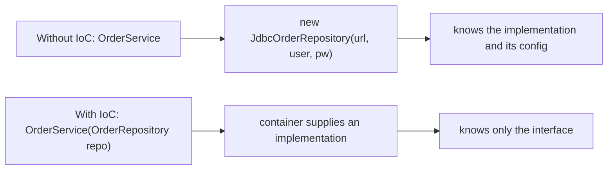

**Dependency injection is one form of it:** IoC is the general principle — the framework calls you, you do not call the framework. Dependency injection is the specific technique of handing collaborators in. Template methods, callbacks and event listeners are other forms of the same inversion.

**Example:**
```java
// Without IoC — untestable without a real database
public class OrderService {
    private final OrderRepository repository = new JdbcOrderRepository(DataSourceHolder.get());
}

// With IoC — the test passes an in-memory fake, the application passes the real one
public class OrderService {
    private final OrderRepository repository;
    public OrderService(OrderRepository repository) { this.repository = repository; }
}
```

**Advantages:** Classes depend on abstractions, implementations are swappable per environment, and unit tests need no container at all — you call the constructor yourself.

**Disadvantages:** The wiring becomes implicit, so "where does this instance come from?" requires knowing the container's rules; and over-abstraction produces interfaces with exactly one implementation forever.

> ⚠️ **Common misconception:** "IoC and dependency injection are the same thing." DI is one way to achieve IoC. The broader principle covers any case where the framework drives your code rather than the reverse.

**Common mistake:** Creating an interface for every class reflexively. Inject the concrete class when there is only ever going to be one; Spring is perfectly happy to inject it.

**Predict it:** You need the same `OrderService` to run against PostgreSQL in production and an in-memory map in tests. With inversion of control in place, how many lines of `OrderService` change?

**None.** The class only names the interface it needs; which implementation arrives is decided outside it. A change to *how* something is built never touches code that only knows *what* it needs — which is the entire reason for the inversion.

**Best intuition:** Say what you need, not how to get it. The container is the only code that knows how things are built.

**Terminology:** *inversion of control*, *dependency injection*, *collaborator*, *Hollywood principle*, *loose coupling*.

---

### 1.3 The ApplicationContext

**The problem:** The container takes over the wiring you would otherwise write by hand in `main()`, and inherits two duties with it. Objects must be created in dependency order — a repository before the service that needs it. And a mistake such as a missing dependency should be found before any traffic arrives, not on the first request that happens to need it.

**How it works:** You cannot order a list you have not finished reading, so startup runs in two phases. First the container reads every source of metadata and registers **bean definitions** — recipes describing what to create, not instances. (A *bean* is simply an object the container manages; 1.4 follows one through its life.) Recipes are just data, so the container can inspect the whole graph, order it, and let extensions edit it before a single object exists. Then it builds the singletons — the default kind of bean, one shared instance each — in dependency order, skipping any marked `@Lazy`: each is normally created, injected and initialised before anything that needs it (1.4 covers the circular exception). When all of them are ready it publishes a `ContextRefreshedEvent`. Spring calls the whole sequence a **refresh**, after the `refresh()` method that runs it.

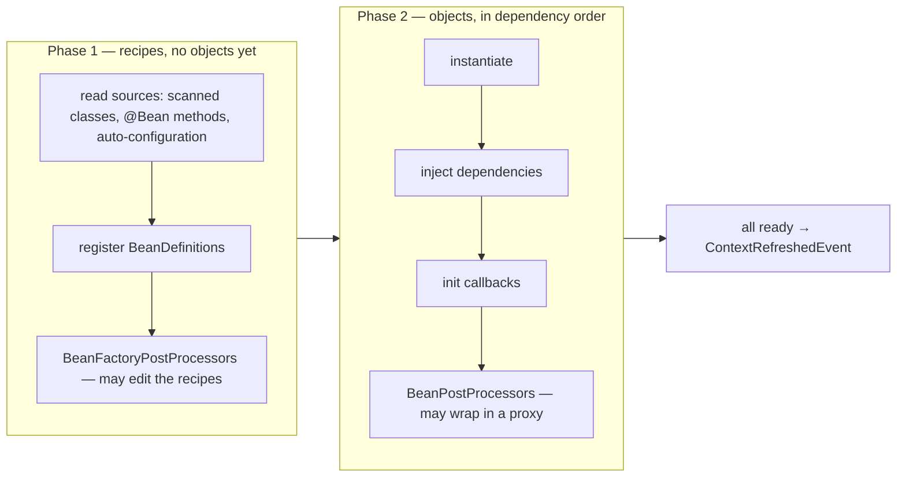

**Two extension points worth knowing:** Two phases leave two natural places to step in, and Spring has one hook for each. A `BeanFactoryPostProcessor` edits recipes, so it runs before any bean is created and can modify definitions — property placeholder resolution works this way. A `BeanPostProcessor` edits objects, so it runs around each bean's initialisation and can replace it with a proxy — which is how `@Transactional`, `@Async` and `@Cacheable` are applied. The container is the one calling `new`, so it decides what callers receive.

**Example:**
```java
@Component
class StartupLogger {
    @EventListener(ApplicationReadyEvent.class)
    void onReady() {                 // after the context is fully refreshed and runners have run
        log.info("application ready");
    }
}
```
`ContextRefreshedEvent` means the container has finished building. Spring Boot publishes `ApplicationReadyEvent` after that, once any `ApplicationRunner` and `CommandLineRunner` beans have run — listen for it when you mean "the application is up".

**Eager by default:** Singletons are created at startup, not on first use. That is deliberate: building everything up front is what turns a missing dependency into a startup failure instead of an error on the first request that needs it.

**Advantages:** One place that knows the whole object graph, failures at startup instead of under traffic, and well-defined hooks for framework features.

**Disadvantages:** Startup time grows with bean count, and a context that fails to start produces long error chains where the real cause is often several `Caused by` lines down.

> 💡 **Tip:** Read a failed startup from the bottom of the stack trace upwards, and check Spring Boot's "Description / Action" block first — it usually names the missing bean or the conflicting property directly.

**Common mistake:** Calling `context.getBean(...)` inside application code. That is service-location, not injection: it reintroduces the coupling the container exists to remove and hides the dependency from tests.

**Predict it:** To speed up startup, a bean is marked `@Lazy`, and one of its dependencies is misconfigured. When do you find out?

**On first use — not at startup.** Possibly days later, in production, on the request that first needs the bean. Eager creation is the thing that moves wiring errors to boot time; opting out of it moves them back to runtime.

**Best intuition:** The context is the wiring `main()` you would otherwise write by hand, run for you: a map from bean definitions to live objects, built once, in a defined order, before traffic arrives. Everything else follows from holding that list — it can check it before running it (fail fast), edit it (`BeanFactoryPostProcessor`), and wrap what it builds (`BeanPostProcessor`).

**Terminology:** *bean definition*, *singleton*, *refresh*, *`BeanPostProcessor`*, *`BeanFactoryPostProcessor`*, *`ContextRefreshedEvent`*, *`ApplicationReadyEvent`*.

---

### 1.4 Beans and the Bean Lifecycle

**The problem:** Some work can only happen at a particular moment. A cache can be warmed only after its repository is injected; a pool must be closed before the JVM exits; and a proxy must be in place before the bean is handed to anyone, because whoever receives the raw object bypasses it.

**How it works:** So every bean goes through the same fixed sequence, and each stage exists because something needs that exact moment: instantiate; populate dependencies; aware-interface callbacks; `BeanPostProcessor.postProcessBeforeInitialization`; initialisation callbacks (`@PostConstruct`, then `afterPropertiesSet`, then a custom `initMethod`) — the first moment every dependency is guaranteed present; `postProcessAfterInitialization` — where proxies are normally created, because it is the last stop before the bean is handed out, so whatever it returns is what everyone receives; and finally hand the bean out.

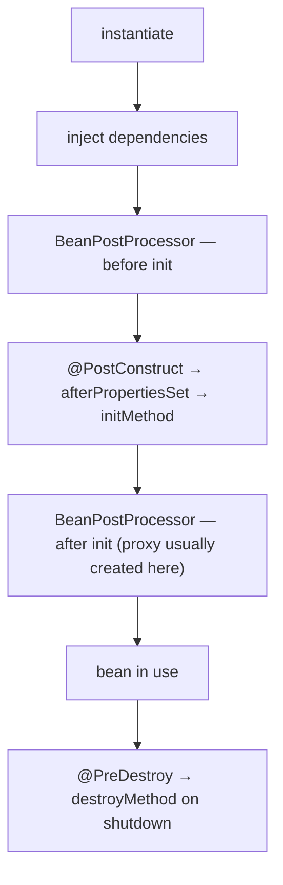

**Example:**
```java
@Component
public class ConnectionWarmer {
    private final DataSource dataSource;

    ConnectionWarmer(DataSource dataSource) { this.dataSource = dataSource; }

    @PostConstruct
    void warmUp() throws SQLException {
        try (var connection = dataSource.getConnection()) { connection.isValid(1); }
    }

    @PreDestroy
    void shutdown() { log.info("closing"); }
}
```

**Destruction is only for singletons:** The container tracks singletons and calls their destroy callbacks on shutdown. Prototype beans are handed out and forgotten — Spring never destroys them, so anything holding a resource must be closed by the code that requested it.

**When the proxy comes early:** The rule is "before anyone receives the bean", not "after initialisation" — the two usually coincide. In a circular dependency they do not: when A and B need each other through fields or setters (1.6), B must receive A while A is still being built. If A is going to be proxied, B must get the proxy rather than the raw object, so Spring creates A's proxy early, through `getEarlyBeanReference`, before A's injection and init callbacks have finished. That works because a proxy only holds a reference to its target: it can exist before the target is finished, as long as nothing calls it until then. Spring Boot has rejected circular references by default since 2.6, so in a Boot application this path appears only when they are re-enabled.

**Advantages:** Deterministic setup and teardown, a standard place for warm-up and cleanup, and lifecycle hooks the framework itself uses consistently.

**Disadvantages:** Work in `@PostConstruct` runs during startup and delays readiness; and lifecycle ordering between beans is only guaranteed through dependency relationships, not declaration order.

> ⚠️ **Common misconception:** "`@PreDestroy` always runs." It runs on an orderly shutdown. A `kill -9`, an OOM kill or a crashed JVM skips it entirely — never rely on it for data integrity.

**Common mistake:** Doing slow I/O in `@PostConstruct` — fetching remote configuration, pre-loading caches — which blocks startup and delays the readiness probe in a container.

**Predict it:** Inside its `@PostConstruct` method, a bean calls one of its own `@Transactional` methods. Does a transaction start?

**No.** `@PostConstruct` runs before `postProcessAfterInitialization`, so normally the proxy does not exist yet — and even when it does, a call on `this` bypasses it. Initialisation code always runs on the raw object. Work that needs transactions at startup belongs in an `ApplicationReadyEvent` listener calling another bean.

**Best intuition:** The lifecycle is a pipeline with labelled stages. The one that matters most is "after initialisation", because it is the last stop before the bean is handed out — where your bean is normally swapped for a proxy.

**Terminology:** *`@PostConstruct`*, *`InitializingBean`*, *`DisposableBean`*, *graceful shutdown*, *lifecycle callback*.

---

### 1.5 Component Scanning and Stereotypes

**The problem:** Registering every class by hand does not scale, but scanning the entire classpath would be slow and would register classes nobody meant to — including other libraries' code.

**How it works:** So scanning is bounded and opt-in. `@ComponentScan` — included in `@SpringBootApplication` — walks only the packages beneath a base package, reads class metadata without loading every class, and registers only classes carrying `@Component` or an annotation meta-annotated with it. The default base package is the one holding the main application class.

**The stereotypes:**

| Annotation | Meaning | Extra behaviour |
|---|---|---|
| `@Component` | Any Spring-managed component | None |
| `@Service` | Business logic | None — documentation only |
| `@Repository` | Data access | Translates persistence exceptions into Spring's `DataAccessException` hierarchy |
| `@Controller` | Web controller | Handled by Spring MVC's handler mapping |
| `@RestController` | `@Controller` + `@ResponseBody` | Returns serialised bodies, not view names |

**Package layout matters:** Because scanning starts at the main class's package, putting the application class in a parent package of everything else is the convention. Classes outside that tree are invisible to scanning — a common cause of "no qualifying bean" on a class that plainly exists.

**Example:**
```java
@SpringBootApplication        // = @Configuration + @EnableAutoConfiguration + @ComponentScan
public class ShopApplication {
    public static void main(String[] args) {
        SpringApplication.run(ShopApplication.class, args);
    }
}
```

**Advantages:** Zero configuration for the common case, intent visible on the class itself, and filters available when you need to narrow or widen the scan.

**Disadvantages:** Scanning a very broad package costs startup time; and implicit registration makes it harder to see the full bean list without Actuator or a debugger.

> 💡 **Tip:** `@Repository`'s exception translation is a real feature, not decoration. It converts vendor-specific `SQLException`s into a consistent hierarchy, so callers are not coupled to the database driver.

**Common mistake:** Placing the main class in a sibling package, so half the application is never scanned and the failure appears as a missing bean at startup.

**Predict it:** The main class lives in `com.shop.app`, and a new `@Service` is added in `com.shop.billing`. What happens at startup?

**It is never registered.** `com.shop.billing` is a sibling of `com.shop.app`, not beneath it. Anything injecting the service fails with "no qualifying bean"; if nothing injects it, the feature silently does not exist. That is why the main class conventionally sits in the root package.

**Best intuition:** Scanning is "find everything marked as mine, under here". Stereotypes are those marks, plus a hint about the layer.

**Terminology:** *component scanning*, *stereotype annotation*, *meta-annotation*, *base package*, *exception translation*.

---

### 1.6 Dependency Injection Styles

**The problem:** An object should never be usable while half-built, and what it requires should be visible to anyone who constructs it — including a test with no container.

**How it works:** The three styles differ only in *when* dependencies arrive, and everything else follows from that. For constructor injection the container picks a constructor — if there is exactly one, no annotation is needed — resolves each parameter to a bean, and calls it, so the dependencies exist before the object does. For setter and field injection it creates the instance first and populates members afterwards, so those dependencies do not exist yet inside the constructor.

| | Constructor | Setter | Field |
|---|---|---|---|
| Fully built on construction | Yes | No | No |
| Fields can be `final` | Yes | No | No |
| Usable without the container | Yes | Yes | Only via reflection |
| Circular dependency | Fails at startup | Rejected by default since Boot 2.6 | Rejected by default since Boot 2.6 |
| Recommended | Yes | For optional deps | No |

**Example:**
```java
@Service
public class OrderService {
    private final OrderRepository repository;
    private final PaymentGateway gateway;

    // single constructor — @Autowired is unnecessary
    public OrderService(OrderRepository repository, PaymentGateway gateway) {
        this.repository = repository;
        this.gateway = gateway;
    }
}
```

**Circular dependencies:** Two beans requiring each other through constructors cannot both be built first — each needs the other to exist already — so the context fails, in any version. Setter and field injection *can* break such a cycle — create both objects, then fill in the references — and plain Spring does exactly that. Spring Boot 2.6+ refuses by default (`spring.main.allow-circular-references=false`), so in Boot a cycle fails whichever style it uses. The right fix is to extract the shared behaviour into a third bean, not to enable the workaround.

**Advantages of constructor injection:** Immutability, a compile-time-visible dependency list, no possibility of a half-initialised object, and tests that call the constructor directly.

**Disadvantages:** A long parameter list is awkward — though that is useful feedback that the class is doing too much.

> ⚠️ **Common misconception:** "`@Autowired` is required." Since Spring 4.3, a class with a single constructor gets it injected automatically. The annotation is only needed to disambiguate between several constructors.

**Common mistake:** Field injection in production code, which makes the class impossible to construct in a plain unit test and hides how many dependencies it really has.

**Predict it:** A class uses field injection, and its constructor calls `repository.count()` to log a startup message. What happens?

**A `NullPointerException`.** Field injection happens after the constructor returns, so inside the constructor the field is still `null`. Constructor injection cannot have this bug: the dependency is a parameter, so it exists before the body runs.

**Best intuition:** A constructor is a contract: "I cannot exist without these". Setters say "these are optional". Fields say nothing at all.

**Terminology:** *constructor injection*, *field injection*, *`@Autowired`*, *circular dependency*, *immutability*.

---

### 1.7 Configuration Classes and @Bean

**The problem:** Some beans must be built by code — third-party classes, builder-configured clients, choices made at startup. But `@Bean` methods are ordinary Java methods, so when one calls another, plain Java would build a brand-new object on every call and break the one-instance-per-container rule.

**How it works:** So Spring subclasses each `@Configuration` class with CGLIB — unless it opts out with `proxyBeanMethods = false` — and intercepts calls between `@Bean` methods: the first call creates the bean, and every later call returns the container-managed instance. Each `@Bean` method's return value becomes a bean named after the method.

**Example:**
```java
@Configuration
public class HttpConfig {

    @Bean
    RestClient paymentClient(PaymentProperties properties) {
        return RestClient.builder()
            .baseUrl(properties.baseUrl())
            .requestFactory(timeouts(properties))   // calls the method below
            .build();
    }

    @Bean
    ClientHttpRequestFactory timeouts(PaymentProperties properties) {
        var factory = new SimpleClientHttpRequestFactory();
        factory.setConnectTimeout((int) properties.connectTimeout().toMillis());
        return factory;
    }
}
```

**`@Configuration` versus `@Component` for bean methods:** In a `@Configuration` class (full mode) inter-method calls are intercepted and return the singleton. In a `@Component`, or a `@Configuration(proxyBeanMethods = false)` (lite mode), they are plain Java calls, so each call constructs a new object — a subtle source of duplicate connection pools.

**When to use `@Bean` over `@Component`:** For third-party classes you cannot annotate, for choosing an implementation based on configuration, and for objects that need builder-style construction.

**Conditional beans:** `@ConditionalOnMissingBean`, `@ConditionalOnProperty` and friends let a configuration back off when the application has defined its own. That mechanism is exactly how Spring Boot's auto-configuration stays overridable.

**Advantages:** Full Java — loops, conditionals and builders all work — type-safe, refactorable, and debuggable with ordinary breakpoints.

**Disadvantages:** Configuration spreads across many small classes if left ungoverned, and the full/lite distinction is invisible until something is created twice.

> 💡 **Tip:** Take configuration properties as a *parameter* of the `@Bean` method rather than autowiring a field. It keeps the configuration class free of state and makes the dependency explicit.

**Common mistake:** Annotating a bean-producing class with `@Component` instead of `@Configuration`, then wondering why two components got separate instances of a shared object.

**Predict it:** The class above is annotated `@Component` instead of `@Configuration`. `paymentClient()` calls `timeouts()`, and another bean also injects the `ClientHttpRequestFactory`. How many factories exist?

**Two.** Without the CGLIB subclass nothing intercepts the call, so `paymentClient()` builds a private factory of its own while the container registers a separate one. That is "lite mode" — and duplicated pools or caches, each half-used, are its typical symptom.

**Best intuition:** `@Configuration` is a recipe book the container reads; CGLIB makes sure each recipe is only cooked once.

**Terminology:** *`@Configuration` full mode*, *lite mode*, *CGLIB subclass*, *conditional bean*, *bean method*.

---

### 1.8 Bean Scopes

**The problem:** One shared instance is the cheapest arrangement and perfect for stateless services — but the moment an object holds data belonging to one request or one user, sharing it leaks that data to everyone else.

**How it works:** So the scope determines who holds the instance, and therefore whose data it may carry. Singleton beans live in the container's singleton cache for the whole application. Prototype beans are built fresh on every request for them. Web scopes store the instance against the current request or session and resolve it through a scoped proxy.

| Scope | Instances | Destroyed by Spring | Typical use |
|---|---|---|---|
| `singleton` (default) | One per container | Yes | Stateless services, repositories |
| `prototype` | One per lookup | No | Stateful helpers, builders |
| `request` | One per HTTP request | Yes | Per-request context |
| `session` | One per HTTP session | Yes | User-scoped state |
| `application` | One per `ServletContext` | Yes | Rarely needed |

**The injection trap:** Injection happens once, when the singleton is built. So injecting a prototype or request-scoped bean into a singleton captures *one* instance forever. The fix is a scoped proxy — `@Scope(value = "request", proxyMode = TARGET_CLASS)` — or an `ObjectProvider` that resolves the bean per call.

**Example:**
```java
@Component
@Scope(value = "request", proxyMode = ScopedProxyMode.TARGET_CLASS)
public class RequestContext {
    private String correlationId;      // safe: one instance per request
}
```

**Why singletons must be stateless:** One instance serves every concurrent request on every thread. Mutable instance fields in a singleton are shared mutable state without synchronisation — the most common source of data leaking between users in a Spring application.

**Advantages:** Memory-efficient by default, explicit when per-request state is genuinely needed, and proxies that keep the injection site simple.

**Disadvantages:** The singleton-holding-narrower-scope trap is easy to hit silently, and prototype beans receive no destruction callbacks.

> ⚠️ **Common misconception:** "Prototype means thread-safe." It means a new instance per injection point. A prototype injected once into a singleton is still shared by every thread using that singleton.

**Common mistake:** Adding a mutable field to a `@Service` — a cached "current user", an accumulating list — and exposing every request to every other request's data.

**Predict it:** A singleton `@Service` has a field `private String currentUser`, set at the start of each request and read later in the same request. Two users call it at the same moment. What can the first user end up seeing?

**The second user's data.** There is one instance for all threads, so both requests write the same field, and whichever wrote last wins. Nothing throws; data simply leaks between users — the reason singletons must be stateless.

**Best intuition:** Default to stateless singletons. If you need state, ask whose state it is, and pick the scope that matches that lifetime.

**Terminology:** *singleton scope*, *prototype*, *scoped proxy*, *`ObjectProvider`*, *stateless service*.

---

### 1.9 Qualifiers and Ambiguity

**The problem:** Injection is driven by type, but a type is not always unique — two `PaymentGateway` beans are normal — and a container that guessed would wire the wrong one silently.

**How it works:** So when the type is not enough, Spring uses more information in a fixed order, from most specific to least. First it collects every bean of the type. If the injection point carries a `@Qualifier`, only beans with that qualifier remain — the caller has said exactly what it wants. If several still remain, a `@Primary` bean wins; failing that, a bean whose name matches the parameter name; failing that, the highest `@Priority` (rarely used). If nothing narrows it to one, startup fails with `NoUniqueBeanDefinitionException`.

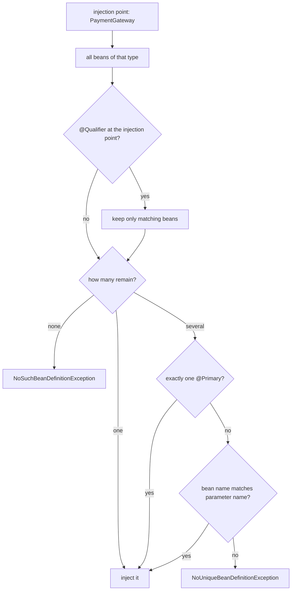

**Example:**
```java
@Bean @Primary
PaymentGateway stripeGateway() { ... }

@Bean @Qualifier("sandbox")
PaymentGateway sandboxGateway() { ... }

@Service
class Checkout {
    Checkout(PaymentGateway gateway) { }                              // gets stripe
}

@Service
class TestHarness {
    TestHarness(@Qualifier("sandbox") PaymentGateway gateway) { }     // gets sandbox
}
```

**Injecting all of them:** Declaring `List<PaymentGateway>` or `Map<String, PaymentGateway>` injects every matching bean — the idiomatic way to build a strategy registry, with the map keyed by bean name. `@Order` controls list ordering.

**Advantages:** Several implementations coexist cleanly, the default is explicit rather than accidental, and collection injection makes plugin-style designs trivial.

**Disadvantages:** Qualifier strings are untyped and refactor-unsafe; a custom qualifier annotation is the sturdier option in a large codebase.

> 💡 **Tip:** Prefer a custom annotation (`@Sandbox`) meta-annotated with `@Qualifier` over a string literal. It is checked by the compiler and findable by your IDE.

**Common mistake:** Relying on the parameter-name fallback, then having the build strip parameter names and break injection in a way that only shows up in the packaged jar.

**Predict it:** `stripeGateway` is `@Primary`. A constructor asks for `@Qualifier("sandbox") PaymentGateway gateway`. Which bean arrives?

**The sandbox one.** The qualifier narrows the candidates *before* `@Primary` is consulted, and `@Primary` only breaks ties among what is left. A default exists for callers who did not say what they want; a qualifier is the caller saying it.

**Best intuition:** Type first, narrowed by any qualifier the caller states; `@Primary` is the default for callers who did not.

**Terminology:** *`@Primary`*, *`@Qualifier`*, *`NoUniqueBeanDefinitionException`*, *collection injection*, *`@Order`*.

---

### 1.10 Proxies and AOP

**The problem:** Transactions, security, caching and retries must run around hundreds of methods. Writing that code into every method would bury the business logic and guarantee inconsistencies.

**How it works:** So Spring puts the code *around* the method instead of inside it. When a bean needs framework behaviour — transactions, security, caching, retry, async — a `BeanPostProcessor` replaces it in the container with a proxy. Callers receive the proxy, which runs the advice and then delegates to your object. Spring creates a **JDK dynamic proxy** when the bean implements an interface, and a **CGLIB subclass** otherwise; Spring Boot defaults to CGLIB throughout.

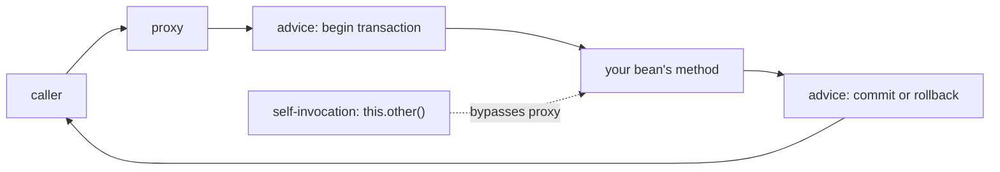

**The self-invocation problem:**
```java
@Service
public class OrderService {

    public void placeOrder(Order order) {
        save(order);                 // internal call — proxy NOT involved
    }

    @Transactional
    public void save(Order order) { ... }   // annotation silently does nothing here
}
```
The fix is to call through an injected reference to another bean, or to move the annotated method into a collaborator. Self-injection (through a `@Lazy` reference, since Boot rejects a plain self-reference as a cycle) and `AopContext.currentProxy()` (which needs `exposeProxy = true`) work but signal a design problem.

**AOP vocabulary:** an *aspect* is the concern (transactions), a *join point* is a place it can apply (a method call), a *pointcut* selects join points, and *advice* is the code that runs. Spring AOP only supports method execution join points on Spring-managed beans — it is not full AspectJ.

**Other things proxies break:** Everything else follows from *how* the proxy is made. A CGLIB proxy is a subclass that overrides your methods, so a method a subclass cannot override — `private`, `static` or `final` — cannot be advised, and a `final` class cannot be proxied at all. (Protected and package-private methods *can* be overridden, and since Spring Framework 6 `@Transactional` is honoured on them for class-based proxies — but public methods remain the portable choice.) And `this` inside your bean is always the raw object, never the proxy.

**Advantages:** Cross-cutting concerns declared once and applied by annotation, no boilerplate in business methods, and a uniform mechanism the whole framework shares.

**Disadvantages:** Behaviour that is invisible in the source, failure modes that are silent rather than loud, and a stack trace with extra frames in it.

> ⚠️ **Common misconception:** "Adding `@Transactional` to a method always makes it transactional." Only when the call arrives through the proxy — from another bean, on a method the proxy is able to override. Otherwise the annotation is inert.

**Common mistake:** Making an advised method `private` or `final` while refactoring, which quietly removes the transaction or the cache without any error.

**Predict it:** During a refactor, someone marks a `@Transactional` service method `final`. Spring Boot uses CGLIB proxies. Does the method still run in a transaction — and what else might go wrong?

**No transaction, and possibly a `NullPointerException`.** A CGLIB proxy works by overriding methods; a `final` method cannot be overridden, so the call runs directly on the proxy object without any advice. And the proxy is a separate subclass instance whose own fields were never injected — so if that method touches a dependency, it finds `null`.

**Best intuition:** Spring hands your callers a stand-in that does the paperwork before and after your method. Anything that skips the stand-in skips the paperwork.

**Terminology:** *JDK dynamic proxy*, *CGLIB*, *advice*, *pointcut*, *join point*, *self-invocation*.

---

[[#📖 Master Table of Contents|⬆ Back to top]]

*End of Group 1. Next: Spring Boot Fundamentals.*

---

## 2. Spring Boot Fundamentals

### Table of Contents (this group)
- [[#2.1 Spring vs Spring Boot]]
- [[#2.2 Starters and Dependency Management]]
- [[#2.3 Auto-Configuration]]
- [[#2.4 The Embedded Server]]
- [[#2.5 External Configuration]]
- [[#2.6 Profiles]]
- [[#2.7 Type-Safe Configuration Properties]]
- [[#2.8 Project Structure and Build]]
- [[#2.9 Application Startup and Runners]]
- [[#2.10 Packaging and Running]]

---

### 2.1 Spring vs Spring Boot

**The problem:** Spring removed hand-written object creation, but every application still declared the same infrastructure — servlet container, `DispatcherServlet`, data source, transaction manager, JSON mapper — almost identically, kept dozens of library versions compatible by hand, and needed an application server to run in.

**How it works:** So Spring Boot adds three things to the Spring Framework, one per repeated chore: auto-configuration that creates beans based on what is present, starters that resolve a consistent dependency set, and an embedded server plus a `main` method so the application is an ordinary process.

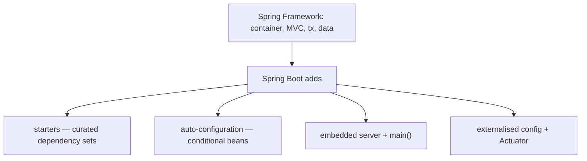

**What it does not change:** The programming model is identical. The same `@Service`, `@Transactional` and `@RestController` work with or without Boot; Boot only removes the configuration that would otherwise be written by hand.

**Opinionated but not closed:** Every default is conditional. Defining your own `ObjectMapper`, `DataSource` or `SecurityFilterChain` causes the corresponding auto-configuration to back off. That property — override by declaration, not by configuration flags — is what makes the opinions tolerable.

**Advantages:** Minutes to a running service, consistent dependency versions, production features (health, metrics, graceful shutdown) available immediately, and a vast body of documentation that assumes it.

**Disadvantages:** Behaviour you did not write is active by default, which makes debugging harder until you know how to read the auto-configuration report; and the dependency footprint of a starter is larger than a hand-picked set.

> ⚠️ **Common misconception:** "Spring Boot is a different framework from Spring." It is the same framework with a configuration layer on top. Everything you know about the container still applies.

**Common mistake:** Fighting the defaults with scattered property overrides instead of defining the bean you actually want, which is usually one method and far clearer.

**Predict it:** You add `spring-boot-starter-data-jpa` and a PostgreSQL driver, set `spring.datasource.url`, and write no configuration — a `DataSource` appears. Then you define your own `DataSource` bean. Which one does the application use?

**Yours — and Boot's is never created.** The data-source auto-configuration is guarded by `@ConditionalOnMissingBean` and is evaluated after your own configuration. Boot only fills the gaps you left; declaring the bean closes the gap.

**Best intuition:** Spring is the engine; Boot is the car built around it — already wired, already running, with every part still replaceable.

**Terminology:** *auto-configuration*, *starter*, *opinionated defaults*, *embedded server*, *backing off*.

---

### 2.2 Starters and Dependency Management

**The problem:** Every library depends on others, and only certain version combinations work together. Picked by hand, a mismatch compiles fine and fails at runtime with `NoSuchMethodError` on whichever path first crosses it.

**How it works:** So the problem is split in two. A starter answers *which libraries*: a jar with almost no code — just a POM listing the dependencies for one capability. `spring-boot-starter-parent` (or the `spring-boot-dependencies` BOM when you cannot use the parent) answers *which versions*: it pins a tested version for every library in the ecosystem, so your build declares artifacts without versions.

| Starter | Brings |
|---|---|
| `spring-boot-starter-web` | Spring MVC, Jackson, embedded Tomcat (renamed `spring-boot-starter-webmvc` in Boot 4) |
| `spring-boot-starter-data-jpa` | Spring Data JPA, Hibernate, a connection pool |
| `spring-boot-starter-security` | Spring Security and its filter chain |
| `spring-boot-starter-validation` | Jakarta Bean Validation (Hibernate Validator) |
| `spring-boot-starter-test` | JUnit 5, Mockito, AssertJ, Spring Test |
| `spring-boot-starter-actuator` | Health, metrics and management endpoints |

**Example:**
```xml
<parent>
  <groupId>org.springframework.boot</groupId>
  <artifactId>spring-boot-starter-parent</artifactId>
  <version>3.3.4</version>
</parent>

<dependencies>
  <dependency>
    <groupId>org.springframework.boot</groupId>
    <artifactId>spring-boot-starter-web</artifactId>   <!-- no version: managed -->
  </dependency>
</dependencies>
```

**Overriding a managed version:** Setting a property such as `<jackson-bom.version>` changes the pinned version across the whole tree. That is the supported mechanism; adding an explicit version to one dependency risks a split where two libraries expect different versions.

**Advantages:** No version matrix to maintain, a single upgrade point, and transitive sets that are actually tested together.

**Disadvantages:** Starters bring more than you may need — `starter-web` includes Tomcat even if you deploy elsewhere — and diagnosing a conflict requires reading `mvn dependency:tree`.

> 💡 **Tip:** `mvn dependency:tree -Dincludes=com.fasterxml.jackson.core` answers "which version am I actually getting and who asked for it" in one command.

**Common mistake:** Pinning individual library versions to fix one warning, which quietly desynchronises the tested set and produces a `NoSuchMethodError` months later.

**Predict it:** Your build inherits from the Boot parent. To silence a warning you add an explicit `<version>` to `jackson-databind` alone. What can go wrong, and when do you find out?

**A split version set, found at runtime.** The other Jackson modules stay at Boot's managed version while `jackson-databind` moves, so libraries in one family now expect different APIs. It compiles, then throws `NoSuchMethodError` on the first code path that crosses the mismatch. Setting `<jackson-bom.version>` would have moved the whole family together.

**Best intuition:** A starter is a shopping list; the parent POM is the price list that keeps every item compatible.

**Terminology:** *starter*, *BOM*, *dependency management*, *transitive dependency*, *version property*.

---

### 2.3 Auto-Configuration

**The problem:** The configuration most applications need is predictable from facts Spring can already see — which libraries are on the classpath and which properties are set. But a default must never override something the application chose deliberately.

**How it works:** So defaults are written as ordinary configuration classes guarded by conditions, and evaluated after yours. Auto-configuration classes are listed in each jar's `META-INF/spring/org.springframework.boot.autoconfigure.AutoConfiguration.imports`. At startup Boot evaluates every one against `@Conditional` annotations and applies those whose conditions match.

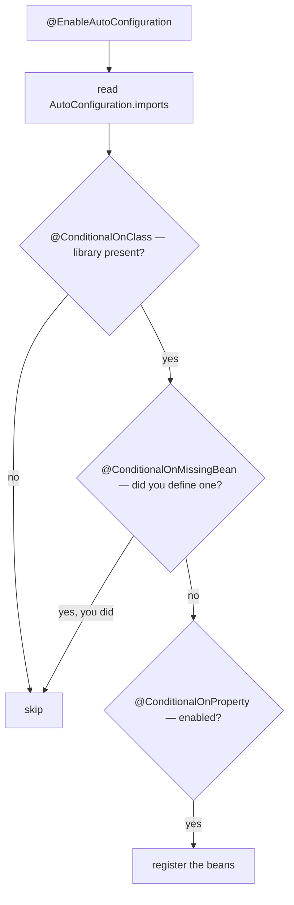

**The conditions that matter:**

| Condition | Meaning |
|---|---|
| `@ConditionalOnClass` | A class is on the classpath |
| `@ConditionalOnMissingBean` | You have not defined this bean yourself |
| `@ConditionalOnProperty` | A property has a given value |
| `@ConditionalOnWebApplication` | This is a servlet or reactive web app |
| `@ConditionalOnBean` | Another bean exists already |

**Example:**
```java
// Defining your own makes Boot's version back off entirely
@Bean
ObjectMapper objectMapper() {
    return JsonMapper.builder()
        .addModule(new JavaTimeModule())
        .disable(SerializationFeature.WRITE_DATES_AS_TIMESTAMPS)
        .build();
}
```

**Ordering:** Auto-configuration always runs *after* your own `@Configuration` classes are registered, which is what makes `@ConditionalOnMissingBean` reliable. `@AutoConfigureBefore` and `@AutoConfigureAfter` order auto-configurations relative to each other.

**Advantages:** Working defaults for dozens of libraries, overridable by simply declaring a bean, and a printed report explaining every decision.

**Disadvantages:** Behaviour appears from dependencies rather than code, so a new library on the classpath can change runtime behaviour without any source change.

> ⚠️ **Common misconception:** "Auto-configuration is reflection magic at runtime." It is ordinary `@Configuration` classes with conditions, evaluated once at startup. You can read them in the Boot source, and `--debug` tells you which applied.

**Common mistake:** Adding a dependency "just for one utility class" and unknowingly activating its auto-configuration — a security starter is the classic case, instantly locking every endpoint behind a login.

**Predict it:** You add `spring-boot-starter-security` to the build to use one of its utility classes, and change no code. What happens to your existing endpoints?

**They all start demanding a login.** `@ConditionalOnClass` sees Spring Security on the classpath and nothing defines a `SecurityFilterChain`, so Boot's default applies: every endpoint requires authentication — a login form for browsers, HTTP Basic for other clients — against one user with a generated password printed in the log. In Boot, what is on the classpath *is* configuration.

**Best intuition:** Boot asks a long list of yes/no questions about your classpath and configuration, and creates beans for every yes you have not already answered yourself.

**Terminology:** *`@EnableAutoConfiguration`*, *conditional*, *backing off*, *auto-configuration report*, *`AutoConfiguration.imports`*.

---

### 2.4 The Embedded Server

**The problem:** An external application server made the runtime something operations installed and configured separately, so production rarely matched a developer's machine — and every application deployed on that server shared its settings and its fate.

**How it works:** So the server becomes a dependency. A web starter brings a servlet container as an ordinary dependency. At startup Boot creates a `ServletWebServerFactory`, starts the container in-process, and registers the `DispatcherServlet` with it. The JVM process *is* the server.

**Choosing a container:**

| Container | Model | Notes |
|---|---|---|
| Tomcat (default) | Thread per request | Most widely deployed, best documented |
| Jetty | Thread per request | Lighter, strong WebSocket support |
| Undertow | Non-blocking I/O, thread pool | Low memory footprint; not supported in Spring Boot 4 |
| Netty (WebFlux) | Event loop | Reactive stack, not servlet-based |

**Example:**
```xml
<dependency>
  <groupId>org.springframework.boot</groupId>
  <artifactId>spring-boot-starter-web</artifactId>
  <exclusions>
    <exclusion>
      <groupId>org.springframework.boot</groupId>
      <artifactId>spring-boot-starter-tomcat</artifactId>
    </exclusion>
  </exclusions>
</dependency>
<dependency>
  <groupId>org.springframework.boot</groupId>
  <artifactId>spring-boot-starter-jetty</artifactId>
</dependency>
```

**Thread model:** The servlet containers use a bounded pool — `server.tomcat.threads.max` defaults to 200. Each request occupies one thread for its whole duration, so a slow downstream call consumes a thread until it completes. That single fact governs how a Spring MVC service behaves under load.

**Graceful shutdown:** With `server.shutdown=graceful` (the default from Boot 3.4) and `spring.lifecycle.timeout-per-shutdown-phase`, the container stops accepting connections, drains in-flight requests, then exits — the behaviour rolling deployments depend on.

**Advantages:** One artifact to deploy, identical runtime in development and production, trivial container images, and per-service tuning instead of a shared application server.

**Disadvantages:** Each service carries its own server, and container-level configuration moves into the application's properties where it is easy to overlook.

> 💡 **Tip:** The thread pool is the real concurrency limit of a Spring MVC service. Size it against your downstream dependencies' capacity, not upward until the error stops.

**Common mistake:** Raising `server.tomcat.threads.max` to fix saturation when the actual bottleneck is a 30-second call with no timeout holding every thread.

**Predict it:** Tomcat has its default 200 worker threads. A downstream service starts taking 30 seconds to respond, every request calls it, and traffic is 10 requests per second. Roughly how long until the service stops answering *anything* — health checks included?

**About 20 seconds.** Each request holds its thread for 30 seconds, so threads are consumed at 10 per second and none come back: 200 are gone in 20 seconds. After that every new request — the health check too — waits in the queue. Thread-per-request turns a slow dependency into a full outage unless outbound calls have timeouts.

**Best intuition:** The server is a library your application starts, not an environment your application is deployed into.

**Terminology:** *embedded container*, *`DispatcherServlet`*, *thread-per-request*, *graceful shutdown*, *`ServletWebServerFactory`*.

---

### 2.5 External Configuration

**The problem:** One artifact must run in every environment, so environment-specific values cannot be baked into it. But once values can come from files, environment variables and the command line, two sources will sometimes disagree — and the winner must be predictable.

**How it works:** So Boot assembles an `Environment` from many `PropertySource`s in a fixed precedence order — the more specific and deliberate the source, the higher it ranks — and resolves each property from the highest-priority source that defines it.

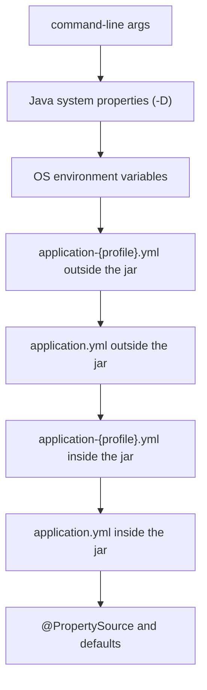

**Relaxed binding:** `spring.datasource.url` and `SPRING_DATASOURCE_URL` bind to the same property, as do `spring.jpa.open-in-view`, `spring.jpa.openInView` and `SPRING_JPA_OPENINVIEW`. That is what makes environment-variable configuration in containers practical — the uppercase, underscore-separated form is the canonical environment spelling.

**Example:**
```bash
java -jar app.jar --server.port=9090                 # command line wins
SPRING_DATASOURCE_URL=jdbc:postgresql://db/shop java -jar app.jar
java -jar app.jar --spring.config.additional-location=/etc/app/  # add an external config directory
```

**YAML versus properties:** YAML nests and is easier to read for deep structures; `.properties` is flatter and avoids YAML's indentation and type-coercion surprises. Boot reads both; mixing them in one application is legal and confusing.

**Advantages:** One artifact across environments, no rebuild to change a setting, and a documented precedence order that makes overrides predictable.

**Disadvantages:** With six sources in play, "where did this value come from?" needs a tool rather than a guess, and a stray environment variable can silently override a carefully reviewed file.

> 💡 **Tip:** `/actuator/env` shows every property, its value and the source that supplied it — the definitive answer to configuration arguments.

**Common mistake:** Committing environment-specific values — URLs, credentials, feature flags — into the packaged `application.yml`, which defeats the point and makes secrets part of the build artifact.

**Predict it:** The packaged `application.yml` sets `server.port: 8080`, the container sets `SERVER_PORT=9090`, and someone starts the jar with `--server.port=7070`. Which port does it listen on — and why that order?

**7070.** Command-line arguments outrank environment variables, which outrank files. The order follows intent: the file is the general default, the environment describes this deployment, and a command-line argument is someone deliberately overriding both, right now.

**Best intuition:** Configuration is a stack of overlays. The jar supplies defaults; each outer layer may replace them.

**Terminology:** *`PropertySource`*, *precedence order*, *relaxed binding*, *`spring.config.import`*, *`Environment`*.

---

### 2.6 Profiles

**The problem:** Environments differ in infrastructure — a stub gateway in testing, the live one in production — and expressing that as `if` statements would spread environment checks through the business code.

**How it works:** So each environment gets a name, and configuration is attached to the name. Active profiles are a set of names in the `Environment`. They select profile-specific configuration files (`application-prod.yml`) and gate beans annotated `@Profile`. Profile-specific properties override the base file; they do not replace it.

**Example:**
```java
@Configuration
public class GatewayConfig {

    @Bean
    @Profile("!prod")
    PaymentGateway stubGateway() { return new StubGateway(); }

    @Bean
    @Profile("prod")
    PaymentGateway stripeGateway(StripeProperties properties) { return new StripeGateway(properties); }
}
```
```yaml
# application.yml — shared defaults
spring:
  jpa:
    open-in-view: false
```
```yaml
# application-prod.yml — overrides only what differs
logging:
  level:
    root: WARN
```

**Activating them:** `--spring.profiles.active=prod`, `SPRING_PROFILES_ACTIVE=prod`, or `@ActiveProfiles("test")` in tests. Several can be active at once, and `spring.profiles.group` bundles related ones under a single name.

**Advantages:** Environment differences expressed as configuration rather than branching, test doubles swapped without touching production code, and one artifact that behaves correctly everywhere.

**Disadvantages:** Profile proliferation makes the effective configuration hard to reason about; and a bean that exists only in one profile means one environment runs code paths the others never exercise.

> ⚠️ **Common misconception:** "A profile-specific file replaces `application.yml`." It is layered on top — the base file still applies for everything the profile file does not override.

**Common mistake:** Putting business logic behind `@Profile`, so production runs code that was never executed in any test environment. Keep profile differences to infrastructure: endpoints, credentials, stubs.

**Predict it:** `application.yml` sets `logging.level.root: INFO` and `spring.jpa.open-in-view: false`. `application-prod.yml` sets only `logging.level.root: WARN`. With the `prod` profile active, what is `open-in-view`?

**`false`.** A profile file is an overlay on the base file, not a replacement: it overrides only the keys it sets, and everything else still comes from `application.yml`.

**Best intuition:** Profiles answer "which environment am I?" and nothing else. If a profile changes what the software *does*, it has become a feature flag in disguise.

**Terminology:** *active profile*, *`@Profile`*, *profile group*, *`spring.profiles.active`*, *default profile*.

---

### 2.7 Type-Safe Configuration Properties

**The problem:** Configuration is input typed by humans into files and environment variables, yet `@Value` injects it as scattered strings, unvalidated, with no single place listing what can be configured.

**How it works:** So configuration is parsed once, at the edge, into a typed object — exactly like a request body. `@ConfigurationProperties("prefix")` binds every property under that prefix onto the fields or record components of a class, converting types — `Duration`, `DataSize`, enums, nested objects, lists and maps — as it goes. Jakarta Bean Validation annotations on the class are enforced at startup when the class is annotated `@Validated`.

**Example:**
```java
@Validated
@ConfigurationProperties("payment")
public record PaymentProperties(
    @NotBlank String baseUrl,
    @NotNull Duration timeout,
    @Min(1) int maxRetries,
    Map<String, String> headers
) { }

@EnableConfigurationProperties(PaymentProperties.class)
@Configuration
class PaymentConfig { }
```
```yaml
payment:
  base-url: https://api.example.com
  timeout: 5s            # bound to Duration
  max-retries: 3
  headers:
    x-api-version: "2"
```

**Why it beats `@Value`:** One object instead of scattered strings, startup validation instead of runtime surprises, IDE completion from generated metadata, and a single place to document each setting.

**Immutability:** Record or constructor binding produces an immutable object, which is the right shape for configuration — nothing should mutate it after startup.

**Advantages:** Typed and validated, discoverable, testable by constructing the record directly, and easy to pass into `@Bean` methods.

**Disadvantages:** Binding failures produce verbose messages; and unknown keys are ignored by default, so a misspelt key silently leaves its field at the default — relaxed binding widens what counts as a match but does not catch typos.

> 💡 **Tip:** Add `spring-boot-configuration-processor` to the build. It generates metadata so your IDE auto-completes and documents your own properties exactly like Boot's.

**Common mistake:** A dozen `@Value` fields scattered across services, so no one place lists what the application can be configured with, and nothing checks that the values make sense — only that each key exists and converts.

**Predict it:** `payment.max-retries` is set to `0` by mistake. With the validated record above (`@Min(1)`), when do you find out? With `@Value("${payment.max-retries}") int maxRetries`, when?

**Record: at startup. `@Value`: possibly never.** Validation runs when the record is bound, so the application refuses to start and names the property. `@Value` happily injects `0`; the bug shows up only when a payment call fails and is never retried — in production, as missing behaviour rather than an error.

**Best intuition:** Configuration is input data. Parse it once, into a validated object, at the edge — exactly as you would with a request body.

**Terminology:** *`@ConfigurationProperties`*, *constructor binding*, *relaxed binding*, *`@Validated`*, *configuration metadata*.

---

### 2.8 Project Structure and Build

**The problem:** Component scanning needs a starting point, and it takes the main class's package — so the package layout is not just tidiness: it decides what Spring can see.

**How it works:** The main class's package is the component-scan root, so the conventional layout places it at the top and everything else beneath. Within that, packages are grouped either by layer or by feature.

```text
com.shop
├── ShopApplication.java
├── config/            cross-cutting @Configuration classes
├── order/             feature package: controller, service, repository, domain
│   ├── OrderController.java
│   ├── OrderService.java
│   ├── OrderRepository.java
│   └── Order.java
└── common/            shared utilities, error handling
```

**Layer packages versus feature packages:** Grouping by layer (`controller`, `service`, `repository`) is familiar and fine for small services. Grouping by feature keeps everything about orders in one package, makes dependencies between features visible, and scales better as the codebase grows.

**Build essentials:** The Spring Boot Maven or Gradle plugin builds the executable jar (`repackage` in Maven, `bootJar` in Gradle) and container images (`build-image`, `bootBuildImage`). `spring-boot-starter-test` is the only test dependency most projects need.

**Advantages:** Convention means scanning, tests and tooling work with no configuration, and any Spring developer can navigate the project immediately.

**Disadvantages:** Layer packages scatter one feature across the tree; and a single module grows until the build and startup become slow, at which point splitting is disruptive.

> 💡 **Tip:** Package by feature, not by layer, once a service has more than a handful of entities. The question "what does this feature touch?" then has a one-package answer.

**Common mistake:** Putting the application class in a package that is not a parent of the rest of the code, so component scanning misses half the application.

**Predict it:** A service has grown to 40 entities, packaged by layer. A change to refunds touches files in `controller`, `service`, `repository` and `domain`. With feature packages, how many packages would it touch — and what becomes visible that was hidden before?

**Usually one — `refund`.** And every dependency from refunds on another feature now appears as a cross-package import, so coupling between features shows up in the code instead of hiding inside shared layer packages.

**Best intuition:** The package tree is the application's table of contents. Make it describe the domain, not the framework.

**Terminology:** *base package*, *package by feature*, *Boot plugin*, *`repackage` goal*, *multi-module build*.

---

### 2.9 Application Startup and Runners

**The problem:** Some startup work needs the *finished* application — every bean created, the server listening — but constructors and `@PostConstruct` run while the context is still being assembled, when other beans may not exist yet.

**How it works:** So `SpringApplication.run()` performs a fixed sequence and puts the runners at the very end: create the environment, print the banner, create and refresh the context — creating all singletons and, as refresh's last step, starting the web server — call every `ApplicationRunner` and `CommandLineRunner`, then publish `ApplicationReadyEvent`.

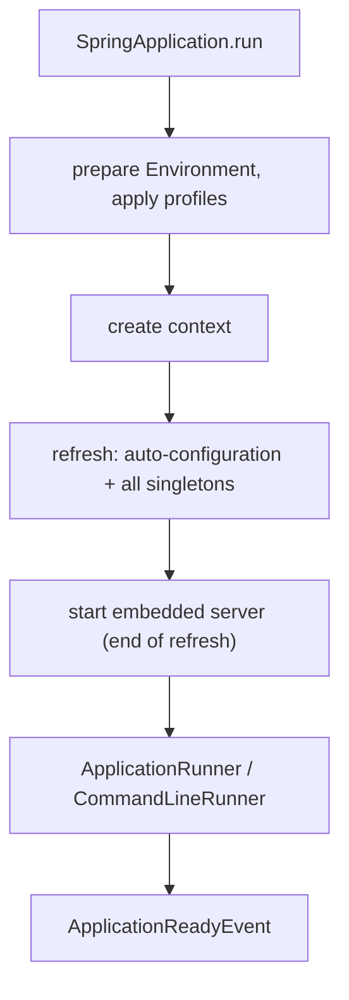

**Example:**
```java
@Component
public class SeedData implements ApplicationRunner {
    private final ProductRepository repository;

    SeedData(ProductRepository repository) { this.repository = repository; }

    @Override
    public void run(ApplicationArguments args) {
        if (args.containsOption("seed") && repository.count() == 0) {
            repository.saveAll(demoProducts());
        }
    }
}
```

**Runners versus `@PostConstruct`:** A runner executes after the whole context is ready and the server is listening, so every bean is available. `@PostConstruct` runs mid-construction, when other beans may not be. Anything needing the finished application belongs in a runner.

**Failure behaviour:** An exception from a runner propagates and stops the application — which is usually right. If startup work is best-effort, catch inside the runner and log, deliberately.

**Advantages:** A defined place for startup tasks, ordered with `@Order`, with access to command-line arguments and a fully built context.

**Disadvantages:** Runners delay readiness, so long work there keeps the service out of the load balancer; and they run on every instance, which matters for anything that should happen once per cluster.

> ⚠️ **Common misconception:** "A runner is a good place for scheduled or background work." It runs once, at startup, on the main thread. Recurring work belongs in `@Scheduled` or a message consumer.

**Common mistake:** Running database migrations in a runner across many replicas simultaneously. Use Flyway or Liquibase, which lock the schema-history table, rather than hand-rolled seeding.

**Predict it:** A runner seeds reference data and takes 90 seconds. During those 90 seconds, does the instance receive traffic?

**No — and a rolling deployment waits for it.** Readiness switches to `ACCEPTING_TRAFFIC` at `ApplicationReadyEvent`, which comes after the runners finish, so the instance stays out of the load balancer the whole time. That protects users, but it means slow startup work delays every deployment; and if a probe that *restarts* pods is pointed at readiness, it becomes a restart loop.

**Best intuition:** Runners are `main()` for an application that has already been assembled.

**Terminology:** *`ApplicationRunner`*, *`CommandLineRunner`*, *`ApplicationReadyEvent`*, *`ApplicationArguments`*, *startup ordering*.

---

### 2.10 Packaging and Running

**The problem:** With the server embedded, the application needs only its own classes and its dependencies in one runnable file — but the JDK cannot load classes from a jar nested inside another jar.

**How it works:** So Boot adds a small launcher that can. The Boot plugin repackages the ordinary jar into an executable one: your classes under `BOOT-INF/classes`, dependencies under `BOOT-INF/lib`, and a `JarLauncher` as the main class. The launcher installs a class loader that reads nested jars, then invokes your `main`.

**Layered jars:** The `tools` jar mode (Boot 3.3+, replacing the older `layertools` — see [[#11.1 Containerising the Application]]) splits the jar into `dependencies`, `spring-boot-loader`, `snapshot-dependencies` and `application`. Because dependencies change rarely and application code changes constantly, extracting these into separate container image layers makes most rebuilds push only a few megabytes.

**Example:**
```dockerfile
FROM eclipse-temurin:21-jre AS builder
WORKDIR /app
COPY target/app.jar app.jar
RUN java -Djarmode=tools -jar app.jar extract --layers --destination extracted

FROM eclipse-temurin:21-jre
WORKDIR /app
COPY --from=builder /app/extracted/dependencies/ ./
COPY --from=builder /app/extracted/spring-boot-loader/ ./
COPY --from=builder /app/extracted/snapshot-dependencies/ ./
COPY --from=builder /app/extracted/application/ ./
ENTRYPOINT ["java", "-jar", "app.jar"]      # a thin jar that references the extracted libraries
```

**Other packaging options:** `bootBuildImage` produces an OCI image with Cloud Native Buildpacks and no Dockerfile. A WAR is still possible for a traditional application server, and GraalVM native images trade build time and some runtime dynamism for sub-second startup.

**Advantages:** One artifact, no server to install, reproducible locally and in production, and layer-friendly images.

**Disadvantages:** Fat jars are large; the nested-jar layout confuses tools that expect a plain jar; and native images require extra configuration for reflection-heavy code.

> 💡 **Tip:** Set `-XX:MaxRAMPercentage` rather than a fixed `-Xmx` in containers. The JVM then sizes the heap from the container's memory limit, which is what actually constrains it.

**Common mistake:** Copying the whole fat jar into a container image as a single layer, so every code change pushes the full artifact including unchanged dependencies.

**Predict it:** An image copies the whole fat jar as one layer. You change one line of code and rebuild. How much does the registry have to receive — and with the layered version?

**The whole jar, often tens of megabytes — versus only the small application layer.** An image layer is reused only if its contents are byte-identical, and one changed class changes the fat jar. Layered, the dependency layers are unchanged and reused; only the application layer is new.

**Best intuition:** The jar is a self-contained application, not a library. Treat it as the unit of deployment.

**Terminology:** *fat jar*, *`JarLauncher`*, *layered jar*, *buildpack*, *native image*.

---

[[#📖 Master Table of Contents|⬆ Back to top]]

*End of Group 2. Next: REST APIs with Spring MVC.*

---

## 3. REST APIs with Spring MVC

### Table of Contents (this group)
- [[#3.1 HTTP and REST Fundamentals]]
- [[#3.2 The DispatcherServlet]]
- [[#3.3 Controllers and Request Mapping]]
- [[#3.4 Binding Request Data]]
- [[#3.5 Responses and Status Codes]]
- [[#3.6 JSON Serialization]]
- [[#3.7 Content Negotiation]]
- [[#3.8 Designing a CRUD API]]
- [[#3.9 Filters and Interceptors]]
- [[#3.10 Calling Other Services]]

---

### 3.1 HTTP and REST Fundamentals

**The problem:** Clients and servers built independently need a shared vocabulary for "read this", "change that" and "here is what happened" — and over an unreliable network, a client whose request timed out often cannot tell whether it was performed.

**How it works:** So HTTP fixes the shape of every exchange. A client opens a connection and sends a request line (method and path), headers and an optional body. The server replies with a status line, headers and a body. HTTP/1.1 keeps connections alive for reuse; HTTP/2 multiplexes many requests over one connection.

**Method semantics that matter:**

| Method | Safe | Idempotent | Typical use |
|---|---|---|---|
| `GET` | Yes | Yes | Read a resource |
| `POST` | No | No | Create, or a non-CRUD action |
| `PUT` | No | Yes | Replace a resource wholesale |
| `PATCH` | No | No | Partial update |
| `DELETE` | No | Yes | Remove a resource |

**Why idempotency matters:** A client that times out does not know whether the server acted. It may safely retry an idempotent request; retrying a `POST` can create a second order. That single property drives retry strategy, and `POST` endpoints that must be retryable need an idempotency key.

**REST in practice:** Most "REST" APIs are resource-oriented JSON over HTTP rather than Fielding's full constraint set — stateless, uniform interface, resource URLs, standard methods, but rarely hypermedia. That pragmatic subset is what interviewers mean by REST.

**Advantages:** Universally supported, cacheable by default for `GET`, debuggable with ordinary tools, and no shared client library required.

**Disadvantages:** Over- and under-fetching (the problem GraphQL targets), chatty interactions across several resources, and no built-in schema unless you add OpenAPI.

> ⚠️ **Common misconception:** "`PUT` is for update and `POST` is for create." The real distinction is idempotency and whether the client determines the resource identity. `PUT /orders/42` with a full body is a legitimate create if the client chooses the id.

**Common mistake:** Making `GET` endpoints that mutate state — a "view" that increments a counter. Caches and prefetchers will call them, and the effect is invisible until it is not.

**Predict it:** A client sends `PUT /orders/42` with a full body, the response times out, and it retries. Then the same happens with `POST /orders`. How many orders exist in each case?

**One after the `PUT`; possibly two after the `POST`.** `PUT` replaces order 42 with the same body, so repeating it changes nothing further — it is idempotent. `POST` asks the server to create something new each time, so if the first request succeeded and only the response was lost, the retry creates a second order. That is the whole reason retryable `POST`s need an idempotency key.

**Best intuition:** The URL is the noun, the method is the verb, and the status code is the outcome. Anything else is a design smell.

**Terminology:** *safe method*, *idempotent*, *resource*, *representation*, *statelessness*.

---

### 3.2 The DispatcherServlet

**The problem:** Every endpoint needs the same chores — routing, parsing, type conversion, serialisation, error translation. Written into each handler, the same code is repeated hundreds of times, and each copy behaves slightly differently.

**How it works:** So Spring MVC funnels every request through one servlet that performs the chores in a fixed pipeline and calls your method only for the part that is unique to it. Boot registers one `DispatcherServlet` mapped to `/`. For each request it consults `HandlerMapping`s to find the handler, builds a `HandlerExecutionChain` with interceptors, invokes the handler through a `HandlerAdapter` — which resolves arguments and converts the return value — and writes the response through an `HttpMessageConverter`.

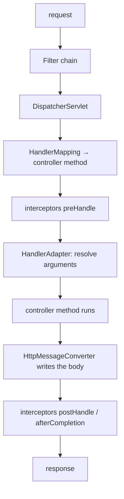

**Argument resolvers and message converters:** `HandlerMethodArgumentResolver`s turn request parts into parameters — one per annotation, plus built-ins for `Principal`, `HttpServletRequest` and so on. `HttpMessageConverter`s serialise and deserialise bodies; `MappingJackson2HttpMessageConverter` handles JSON. Both are extension points you can add to.

**Exception handling path:** An exception from the handler goes to `HandlerExceptionResolver`s, which is where `@ExceptionHandler` and `@ControllerAdvice` are applied before the response is written.

**Advantages:** One place solving routing, binding, serialisation and error handling; consistent behaviour across every endpoint; and well-defined extension points.

**Disadvantages:** A lot happens between the socket and your method, so diagnosing "why did my parameter arrive null?" means knowing which resolver ran.

> 💡 **Tip:** Set `logging.level.org.springframework.web=DEBUG` to see the mapping decision, the chosen handler and the converter used. It answers most request-binding questions immediately.

**Common mistake:** Assuming a controller method is called directly. It is invoked reflectively after a chain of resolvers; parameter annotations are what make binding work.

**Predict it:** A controller method declares `@RequestBody CreateOrderRequest request`, and its first line logs "creating order". A client sends the body as XML, and only a JSON converter is registered. Is anything logged?

**No.** Reading the body is the dispatcher's job and happens *before* your method is called. No converter can read XML into that type, so the request is rejected with 415 and the method never runs. A handler only ever sees arguments the pipeline has already prepared.

**Best intuition:** The dispatcher is a receptionist: it reads the request, decides who should handle it, hands them prepared arguments, and formats whatever they return.

**Terminology:** *`DispatcherServlet`*, *`HandlerMapping`*, *`HandlerAdapter`*, *argument resolver*, *message converter*.

---

### 3.3 Controllers and Request Mapping

**The problem:** With one dispatcher receiving everything, it needs a reliable way to decide which method handles a given request — and two methods that both claim the same request must be caught, not resolved by luck.

**How it works:** So each mapping is registered as a set of conditions, and all of them are compared at startup. `@RequestMapping` and its shortcuts register a mapping of path, method, headers, params and content types. At startup Spring builds a lookup structure and rejects exact duplicates; at request time it finds the most specific match, preferring exact paths over patterns, and treats a tie as an error rather than picking one.

**Example:**
```java
@RestController
@RequestMapping("/api/orders")
public class OrderController {

    @GetMapping                                  // GET /api/orders?status=OPEN
    List<OrderSummary> list(@RequestParam(defaultValue = "OPEN") Status status) { ... }

    @GetMapping("/{id}")                         // GET /api/orders/42
    OrderResponse get(@PathVariable Long id) { ... }

    @PostMapping(consumes = APPLICATION_JSON_VALUE)
    @ResponseStatus(HttpStatus.CREATED)
    OrderResponse create(@RequestBody @Valid CreateOrderRequest request) { ... }
}
```

**`@Controller` versus `@RestController`:** `@RestController` is `@Controller` plus `@ResponseBody` on every method, so return values are serialised into the body rather than resolved as view names. A plain `@Controller` is for server-rendered templates.

**Path patterns:** Spring Boot 3 uses `PathPatternParser`, which is faster than the old `AntPathMatcher` and slightly stricter — notably, a trailing slash no longer matches by default, so `/orders/` and `/orders` are different paths.

**Advantages:** Declarative routing visible on the method, fine-grained matching on headers and content types, and class-level prefixes that keep paths tidy.

**Disadvantages:** Mappings are spread across classes, so the full route table is not visible in one place without Actuator's `/actuator/mappings`.

> ⚠️ **Common misconception:** "Trailing slashes still match." Since Spring 6 trailing-slash matching is off by default; clients sending `/api/orders/` get a 404 unless the behaviour is explicitly restored.

**Common mistake:** Two mappings that match the same requests equally well. Identical mappings fail at startup with an ambiguous-mapping error; two different patterns of equal specificity — `/{id}` and `/{code}` on the same path — pass startup and fail on the first matching request. A literal such as `/orders/search` beside `/orders/{id}` is fine: the literal is more specific and wins.

**Predict it:** After upgrading from Spring Boot 2 to 3, a client calling `GET /api/orders/` — with a trailing slash — starts failing. Nothing in the controller changed. What does it get, and why?

**404.** Spring Framework 6 stopped treating a trailing slash as optional, so `/api/orders/` no longer matches a mapping for `/api/orders`. The controller didn't change; the matching rules did.

**Best intuition:** Each mapping is a predicate over the request. The dispatcher picks the most specific predicate that is true.

**Terminology:** *`@RequestMapping`*, *`PathPatternParser`*, *ambiguous mapping*, *`@RestController`*, *handler method*.

---

### 3.4 Binding Request Data

**The problem:** A request arrives as text — a path, a query string, headers, a body — but handler code wants typed values such as `Long id` and `CreateOrderRequest`. Something must cut the text into pieces, convert each one, and reject invalid input before business code sees it.

**How it works:** So each parameter declares where its value comes from, and a matching resolver fetches and converts it. Each parameter annotation selects an argument resolver. `@PathVariable` reads the URI template, `@RequestParam` the query string or form data, `@RequestHeader` a header, and `@RequestBody` runs the body through a message converter. Type conversion uses the `ConversionService`, which handles numbers, enums, dates and anything you register.

**Example:**
```java
@GetMapping("/search")
Page<OrderSummary> search(
        @RequestParam(required = false) String customer,
        @RequestParam(defaultValue = "0") @Min(0) int page,
        @RequestParam(defaultValue = "20") @Max(100) int size,
        @RequestHeader(value = "X-Correlation-Id", required = false) String correlationId,
        @DateTimeFormat(iso = DATE) @RequestParam(required = false) LocalDate since) { ... }
```

**Object binding for query parameters:** A plain object parameter without `@RequestBody` binds field by field from query parameters, which keeps long signatures manageable:
```java
record OrderQuery(String customer, Status status, int page, int size) { }

@GetMapping
Page<OrderSummary> list(OrderQuery query) { ... }     // binds from the query string
```

**Validation:** `@Valid` on a `@RequestBody` triggers Bean Validation before the method body runs and fails with `MethodArgumentNotValidException`. Constraints declared directly on parameters — `@Min(0) int page` — are checked by Spring MVC's built-in method validation (Spring 6.1+), which fails with `HandlerMethodValidationException` and, once it applies, covers the `@Valid` body too. A class-level `@Validated` switches to the older proxy-based validation, which throws `ConstraintViolationException` instead. Several exception types, all of which need handling.

**Advantages:** No manual parsing, declarative defaults and requirements, automatic type conversion, and validation at the boundary.

**Disadvantages:** Binding failures produce framework exceptions whose default messages are unhelpful to API clients; and missing parameter names in the bytecode break binding for records in some build setups.

> 💡 **Tip:** Compile with `-parameters` (Boot's parent POM and Gradle plugin set it). Without it, binding by parameter name — `@RequestParam String customer` with no explicit name — fails at runtime, and a build that lacks the flag can fail where the IDE worked.

**Common mistake:** `@RequestParam` without `required = false` or a default, so a missing optional filter returns 400 instead of ignoring the filter.

**Predict it:** `GET /api/orders/abc` reaches a method declaring `@PathVariable Long id`. Does your method run?

**No — the client gets 400.** Converting `"abc"` to `Long` is part of argument resolution, which happens before the method is invoked. The conversion fails, the request is rejected as a type mismatch, and your code never sees it.

**Best intuition:** Each annotation says which part of the request a parameter comes from. The framework handles the rest, including types.

**Terminology:** *argument resolver*, *`ConversionService`*, *`@Valid`*, *URI template*, *`-parameters`*.

---

### 3.5 Responses and Status Codes

**The problem:** A client, a cache, a load balancer and a monitoring system all need to know what happened — and none of them should have to parse your response body to find out.

**How it works:** So the outcome travels separately, as a standard three-digit code every HTTP tool understands. A returned object is serialised by a message converter with status 200. `ResponseEntity<T>` lets the method set the status, headers and body explicitly. `@ResponseStatus` on a method or an exception class sets a status declaratively.

**The codes that matter in an API:**

| Code | Meaning | Use when |
|---|---|---|
| 200 OK | Success with a body | Reads and updates |
| 201 Created | Resource created | `POST` that creates, with a `Location` header |
| 204 No Content | Success, no body | `DELETE`, or an update returning nothing |
| 400 Bad Request | Malformed or invalid input | Validation failures |
| 401 / 403 | Unauthenticated / forbidden | Missing or insufficient credentials |
| 404 Not Found | No such resource | Unknown id |
| 409 Conflict | State conflict | Duplicate, or optimistic-lock failure |
| 422 | Semantically invalid | Well-formed but business-invalid |
| 500 | Server fault | Unhandled failure — never for client errors |

**Example:**
```java
@PostMapping
ResponseEntity<OrderResponse> create(@RequestBody @Valid CreateOrderRequest request) {
    var order = service.create(request);
    return ResponseEntity
        .created(URI.create("/api/orders/" + order.id()))   // 201 + Location
        .body(OrderResponse.from(order));
}
```

**Advantages:** Clients can act on the status without parsing the body, caches and proxies behave correctly, and monitoring by status class becomes meaningful.

**Disadvantages:** `ResponseEntity` everywhere makes signatures noisy; mixing it with plain returns in one codebase is inconsistent.

> ⚠️ **Common misconception:** "Returning 200 with `{"error": ...}` is fine." It is not: every client treats 2xx as success, so dashboards show a healthy service while every request fails.

**Common mistake:** Returning 500 for client mistakes. A validation failure is 400; the 5xx rate should mean "we are broken", or alerting on it becomes worthless.

**Predict it:** An endpoint returns `200 OK` with `{"error": "payment failed"}` for failed payments. Then payments start failing for every request. What does the error-rate dashboard show, and what does a client library with automatic retries do?

**A healthy service, and no retries.** Dashboards and clients classify by status code, so every 200 counts as success. The outage is invisible to monitoring, and retry logic — which triggers on 5xx — never fires.

**Best intuition:** The status code is for machines, the body is for humans and clients. Get the code right first.

**Terminology:** *`ResponseEntity`*, *`@ResponseStatus`*, *`Location` header*, *status class*, *4xx versus 5xx*.

---

### 3.6 JSON Serialization

**The problem:** Objects live in memory; a network carries bytes. Every response object must become text the client can read, and every request body must become an object again — for every class, in both directions.

**How it works:** So one library, configured once, does the mapping by convention. Boot auto-configures an `ObjectMapper` and registers `MappingJackson2HttpMessageConverter`. Serialisation walks the object's properties — getters, or record components — and deserialisation matches JSON fields to constructor parameters or setters. (Spring Boot 4 moves to Jackson 3, whose core packages are `tools.jackson.*`; the model is the same.)

**Example:**
```java
public record OrderResponse(
    Long id,
    @JsonFormat(shape = STRING, pattern = "yyyy-MM-dd'T'HH:mm:ssXXX", timezone = "UTC") Instant createdAt,
    @JsonProperty("total_amount") BigDecimal total,
    @JsonInclude(NON_NULL) String note
) { }
```

**Configuration points:** Properties such as `spring.jackson.default-property-inclusion` and `spring.jackson.serialization.*` cover most needs; a `Jackson2ObjectMapperBuilderCustomizer` bean adjusts the auto-configured mapper without replacing it; declaring your own `ObjectMapper` replaces it entirely.

**Dates:** With `jackson-datatype-jsr310` (included by the web starter) `Instant`, `LocalDate` and friends serialise as ISO-8601 strings, provided `WRITE_DATES_AS_TIMESTAMPS` is disabled — which Boot does by default. Always serialise instants in UTC with an explicit offset.

**Advantages:** Zero code for the common case, annotations for the exceptions, records supported natively, and streaming for large payloads.

**Disadvantages:** Silent asymmetries — a field serialises but will not deserialise because there is no matching constructor parameter; and `FAIL_ON_UNKNOWN_PROPERTIES` behaviour differs between Boot's default (off) and vanilla Jackson (on).

> 💡 **Tip:** Keep API DTOs separate from entities and annotate the DTOs. Jackson annotations on an entity couple your database model to your wire format, and both change for different reasons.

**Common mistake:** Serialising a JPA entity directly, which triggers lazy loading during serialisation and either runs extra queries or throws `LazyInitializationException` mid-response — and once the body has started streaming, after the status line has already been sent.

**Predict it:** A JPA entity with a lazy `customer` association is returned directly from a controller, with open-in-view disabled. What can the client receive?

**A 500 — or, worse, a 200 with broken JSON.** Jackson walks every property while writing the response; touching the lazy `customer` after the transaction has closed throws `LazyInitializationException`. If nothing has been flushed yet, Spring can still turn that into a 500. If part of the body has already gone out, the status is fixed at 200 and the client receives truncated JSON. DTOs avoid the whole question.

**Best intuition:** Jackson maps a Java shape to a JSON shape. Owning both shapes separately is what keeps either free to change.

**Terminology:** *`ObjectMapper`*, *message converter*, *`@JsonProperty`*, *JSR-310 module*, *unknown properties*.

---

### 3.7 Content Negotiation

**The problem:** Clients differ in the formats they send and accept, and when client and server disagree, the failure should say exactly that — not surface as a confusing parse error deep in a handler.

**How it works:** So both sides declare formats in headers, and Spring matches them against what its converters can do. The `ContentNegotiationManager` determines the response media type, by default from the `Accept` header. Spring then picks a message converter that can produce it. For the request body, `Content-Type` selects the converter that reads it.

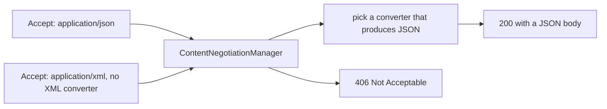

**Narrowing at the mapping:** `@GetMapping(produces = ...)` and `@PostMapping(consumes = ...)` constrain which requests a method handles. A mismatch yields 406 (cannot produce) or 415 (cannot consume) rather than a confusing failure inside the handler.

**Example:**
```java
@PostMapping(consumes = APPLICATION_JSON_VALUE, produces = APPLICATION_JSON_VALUE)
OrderResponse create(@RequestBody CreateOrderRequest request) { ... }
```

**Versioning via media types:** `produces = "application/vnd.shop.v2+json"` versions an API through content negotiation rather than the URL. It is cleaner in theory and harder to debug in practice, which is why URL versioning remains more common.

**Advantages:** One endpoint can serve several representations, mismatches fail with the correct status, and clients and servers agree explicitly on format.

**Disadvantages:** Misconfiguration produces 406 and 415 responses that look like routing bugs; and supporting several formats multiplies the surface you must test.

> ⚠️ **Common misconception:** "415 means the request body is invalid." 415 means the server cannot consume that `Content-Type`; an invalid body of the right type is 400.

**Common mistake:** A client omitting `Content-Type: application/json` on a `POST`, receiving 415, and the team debugging the handler rather than the header.

**Predict it:** One client posts valid JSON but forgets the `Content-Type` header. Another sends `Accept: application/xml` to a JSON-only API. Which status does each receive?

**415, then 406.** Without `Content-Type` the server cannot know the body is JSON, so no converter can *consume* it — 415 Unsupported Media Type. The second request is readable, but no converter can *produce* XML — 406 Not Acceptable. Reading problems are 415; writing problems are 406.

**Best intuition:** `Content-Type` describes what you are sending; `Accept` describes what you will take back.

**Terminology:** *content negotiation*, *`Accept`*, *`produces` / `consumes`*, *406*, *415*.

---

### 3.8 Designing a CRUD API

**The problem:** Every API needs the same operations on its resources, and if each one invents its own URLs, verbs and error formats, every client must reverse-engineer every API — and every change risks breaking someone.

**How it works:** So the design reuses HTTP's own conventions. Model resources as nouns, use methods as verbs, and keep the URL hierarchy shallow. One resource gets a collection path and an item path; sub-resources express containment.

```text
GET    /api/orders?status=OPEN&page=0&size=20   list, filtered and paged
POST   /api/orders                              create → 201 + Location
GET    /api/orders/{id}                         read   → 200 or 404
PUT    /api/orders/{id}                         replace
PATCH  /api/orders/{id}                         partial update
DELETE /api/orders/{id}                         remove → 204
GET    /api/orders/{id}/items                   sub-resource
POST   /api/orders/{id}/cancel                  action that is not CRUD
```

**Pagination:** Always page collection endpoints — a `GET /orders` with no limit becomes a full table scan and a multi-megabyte response the day the table grows. Spring Data's `Pageable` binds `page`, `size` and `sort` directly from query parameters.

**Error shape:** Pick one error body and use it everywhere. RFC 9457 `application/problem+json` is the standard, and Spring 6 supports it through `ProblemDetail`:
```json
{ "type": "https://api.shop/errors/insufficient-stock",
  "title": "Insufficient stock", "status": 409,
  "detail": "SKU ABC has 2 remaining", "instance": "/api/orders" }
```

**Advantages:** Predictable for consumers, documentable automatically from the code, and compatible with every HTTP tool and proxy.

**Disadvantages:** Strict resource modelling fits awkwardly around genuine actions and multi-resource operations, and versioning an API is painful however it is done.

> 💡 **Tip:** Design the error contract on day one. Retrofitting a consistent error shape across an existing API is a breaking change for every client.

**Common mistake:** Unbounded collection endpoints. They are fine in testing and become the slowest endpoint in production within months.

**Predict it:** `GET /api/orders` returns every order, unpaged, in 40 ms during testing. Two years later one tenant has 400,000 orders. What happens to that endpoint — and to the endpoints next to it?

**It becomes the slowest endpoint, and drags the others down.** Each call loads and serialises every row while holding a request thread and a database connection for seconds. Under concurrent calls those pools run out, so unrelated endpoints start waiting too. Paging bounds the work per request no matter how the data grows.

**Best intuition:** An API is a published contract. Choose the paths, codes and error shape as deliberately as a database schema.

**Terminology:** *resource*, *sub-resource*, *pagination*, *`ProblemDetail`*, *RFC 9457*.

---

### 3.9 Filters and Interceptors

**The problem:** Some work belongs to every request — correlation ids, logging, authentication, timing — and copying it into each controller method guarantees it will be missing somewhere.

**How it works:** So it is placed *around* the request instead of inside the handler, at one of two layers. Servlet `Filter`s wrap the entire dispatch — they run before the `DispatcherServlet` and see raw requests and responses. `HandlerInterceptor`s run inside it, with `preHandle`, `postHandle` and `afterCompletion` hooks, and know which handler method was selected.

| | Filter | Interceptor |
|---|---|---|
| Level | Servlet container | Spring MVC |
| Runs | Before and after dispatch | Around the handler |
| Knows the handler | No | Yes |
| Can wrap the request/response | Yes | No |
| Typical use | Security, correlation ids, compression | Auth checks per handler, timing, auditing |

**Example:**
```java
@Component
public class CorrelationIdFilter extends OncePerRequestFilter {
    @Override
    protected void doFilterInternal(HttpServletRequest request, HttpServletResponse response,
                                    FilterChain chain) throws ServletException, IOException {
        var id = Optional.ofNullable(request.getHeader("X-Correlation-Id"))
                         .orElse(UUID.randomUUID().toString());
        MDC.put("correlationId", id);
        response.setHeader("X-Correlation-Id", id);
        try {
            chain.doFilter(request, response);
        } finally {
            MDC.clear();                 // always, or the value leaks to the next request
        }
    }
}
```

**Ordering:** Filters run in `@Order` sequence, and Spring Security's chain is itself a filter — which is why a filter that must see an authenticated user has to be ordered after it.

**Advantages:** One place for cross-cutting request concerns, applied to every endpoint without touching controllers.

**Disadvantages:** Logic hidden from the controller's reader, ordering bugs that are hard to see, and `ThreadLocal`/MDC state that leaks across requests if not cleared.

> ⚠️ **Common misconception:** "A filter can read the request body and the controller will still get it." A body stream can be read once. Spring's `ContentCachingRequestWrapper` only records what the controller reads, so a filter can inspect the body *after* `chain.doFilter`; reading it beforehand needs a wrapper that buffers the whole body and replays it — all of it held in memory.

**Common mistake:** Populating MDC in a filter without clearing it in a `finally`. Thread pools reuse threads, so the next request logs the previous request's correlation id.

**Predict it:** A filter copies an incoming correlation header into the MDC but never clears it. Request A arrives with `abc`. Later, request B arrives with no correlation header. What id can appear in B's logs?

**`abc`.** The MDC is thread-local, and Tomcat reuses threads from a pool. If B lands on the thread that served A, it inherits A's leftover value, and B's activity is logged as A's. That is why the `finally { MDC.clear(); }` is not optional.

**Best intuition:** Filters are plumbing around the dispatcher; interceptors are plumbing around your handler.

**Terminology:** *`OncePerRequestFilter`*, *`HandlerInterceptor`*, *filter chain order*, *MDC*, *request wrapper*.

---

### 3.10 Calling Other Services

**The problem:** Calling another service brings back every concern of an inbound request — serialisation, error handling — plus a new one: the other side can be slow or silent, and a call that waits forever holds your thread forever.

**How it works:** So outbound calls go through a configured client object, built once, with timeouts and error handling attached. `RestClient` (Spring 6.1+) is the modern synchronous, fluent HTTP client. `WebClient` is the reactive one, usable synchronously via `block()` but intended for reactive stacks. Both support interceptors, error handling and timeouts; declarative HTTP interfaces generate an implementation from an annotated interface.

**Example:**
```java
@Bean
RestClient paymentClient(RestClient.Builder builder, PaymentProperties properties) {
    var http = HttpClient.newBuilder().connectTimeout(Duration.ofSeconds(2)).build();
    var factory = new JdkClientHttpRequestFactory(http);
    factory.setReadTimeout(Duration.ofSeconds(5));                 // always set both
    return builder.baseUrl(properties.url()).requestFactory(factory).build();
}

Receipt charge(ChargeRequest request) {
    return paymentClient.post()
        .uri("/charges")
        .body(request)
        .retrieve()
        .onStatus(HttpStatusCode::is4xxClientError,
                  (req, res) -> { throw new PaymentRejectedException(res.getStatusCode()); })
        .body(Receipt.class);
}
```

The connect timeout bounds reaching the server; the read timeout bounds waiting for its answer. (Boot 3.3's `ClientHttpRequestFactories` helper is deprecated from 3.4 in favour of `ClientHttpRequestFactoryBuilder`; the plain Spring `JdkClientHttpRequestFactory` above works from Boot 3.2, like `RestClient` itself.)

**Declarative clients:**
```java
@HttpExchange("/charges")
interface PaymentApi {
    @PostExchange Receipt charge(@RequestBody ChargeRequest request);
}
```

**Connection pooling:** Build the client once as a bean. A client created per call opens a new connection — and under load, exhausts ephemeral ports — while a shared one reuses pooled connections and pays the TLS handshake once.

**Advantages:** Typed requests and responses, central configuration of timeouts and headers, and natural places to add retries, metrics and tracing.

**Disadvantages:** Every outbound call is a failure mode — timeout, 5xx, connection reset — and the defaults are not safe: without explicit timeouts a call can hang until the socket gives up.

> ⚠️ **Common misconception:** "`RestTemplate` is fine for new code." It is in maintenance mode on Spring Framework 6 (Boot 3), documented as deprecated in Spring Framework 7 (Boot 4), and scheduled for removal in 8.0 — existing code keeps working for now, but new code should use `RestClient`.

**Common mistake:** Creating a `RestClient` or `WebClient` inside the method that uses it, discarding connection pooling and paying a full handshake per request.

**Predict it:** A `RestClient` has no read timeout. The payment service accepts connections but stops answering. What happens to each calling thread — and after 200 such calls?

**Each thread waits with no end — then the whole service stops.** Nothing ends the wait, so every call holds a request thread indefinitely. After 200 of them every Tomcat worker is stuck, and the service stops responding entirely — health checks included.

**Best intuition:** An outbound call is an inbound call for somebody else. Give it the same care: timeouts, error handling, observability.

**Terminology:** *`RestClient`*, *`WebClient`*, *`@HttpExchange`*, *connection pool*, *read timeout*.

---

[[#📖 Master Table of Contents|⬆ Back to top]]

*End of Group 3. Next: Backend Architecture & Layering.*

---

## 4. Backend Architecture & Layering

### Table of Contents (this group)
- [[#4.1 The Layered Architecture]]
- [[#4.2 The Controller Layer]]
- [[#4.3 The Service Layer]]
- [[#4.4 The Repository Layer]]
- [[#4.5 DTOs and the API Boundary]]
- [[#4.6 Mapping Between Layers]]
- [[#4.7 Bean Validation]]
- [[#4.8 Global Exception Handling]]
- [[#4.9 Domain Modelling]]
- [[#4.10 Hexagonal Architecture]]

---

### 4.1 The Layered Architecture

**The problem:** In one class that handles HTTP, business decisions and SQL, three kinds of change — API, rules, storage — collide in the same code, and none of it can be tested or reused without the other two.

**How it works:** So the code is split by reason to change, with dependencies pointing one way. Each layer depends only on the one below it, and each has a distinct responsibility: the controller adapts HTTP, the service owns the business operation and the transaction boundary, the repository owns persistence.

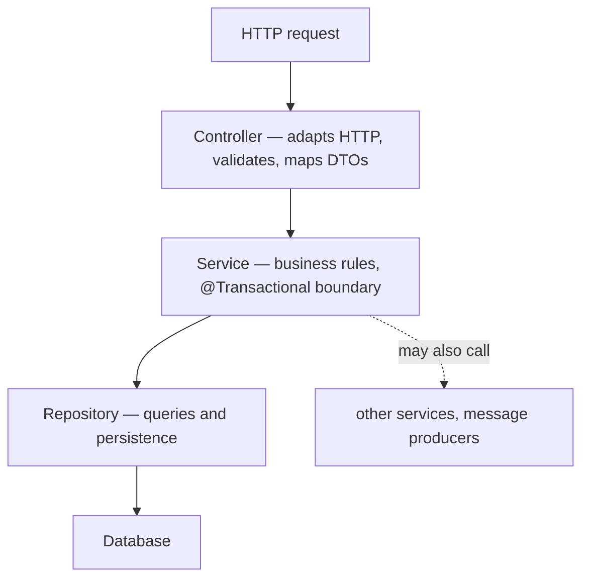

**Why each layer exists:** The controller changes when the API changes; the service when business rules change; the repository when storage changes. Three different reasons, three different rates — which is the entire argument for separating them.

**Where the transaction sits:** On the service method, because the business operation is the unit of work. A transaction on a repository method commits each step independently, which is almost never what the operation means.

**Example:**
```java
@RestController class OrderController {          // HTTP only
    @PostMapping ResponseEntity<OrderResponse> create(@RequestBody @Valid CreateOrderRequest r) {
        var order = service.place(r.toCommand());
        return ResponseEntity.created(uri(order)).body(OrderResponse.from(order));
    }
}

@Service class OrderService {                    // rules and transaction
    @Transactional
    public Order place(PlaceOrderCommand command) { ... }
}

interface OrderRepository extends JpaRepository<Order, Long> { }   // persistence
```

**Advantages:** Each layer is testable in isolation, the business logic is reusable from non-HTTP entry points, and new team members can predict where any given change belongs.

**Disadvantages:** For trivial CRUD it is ceremony — three classes and two mappings to read one row. And "service" becomes a dumping ground if nobody defends what belongs there.

> ⚠️ **Common misconception:** "Layers must be separate Maven modules." Packages are enough for almost every service. Modules add build complexity and should be introduced only when you need to enforce the boundary mechanically.

**Common mistake:** A controller calling a repository directly "because it is just a read". It bypasses the transaction and business rules, and the next change — a permission check, an audit event — has nowhere obvious to go.

**Predict it:** The same "place order" operation must now also be triggered by a Kafka message, not only by HTTP. In a properly layered service, what changes?

**Only a new entry point.** A message listener calls the existing service method exactly as the controller does. The service and repository do not change, because nothing in them knows about HTTP — the payoff for keeping HTTP in the controller.

**Best intuition:** HTTP in the controller, decisions in the service, SQL in the repository. If a class is doing two of those, it is in the wrong layer.

**Terminology:** *layer*, *separation of concerns*, *transaction boundary*, *anaemic service*, *layer violation*.

---

### 4.2 The Controller Layer

**The problem:** If HTTP details leak into business code, that code can only be reached over HTTP — and a scheduled job or message consumer performing the same operation must either fake a request or duplicate the logic.

**How it works:** So the controller is limited to translation. The controller converts between HTTP and the application. It binds and validates input, maps request DTOs to commands, calls one service method, maps the result to a response DTO, and chooses the status code.

**What does not belong here:** Business rules, transactions, repository calls and entity manipulation. A controller that contains an `if` about business state is holding a rule the service should own.

**Example:**
```java
@RestController
@RequestMapping("/api/orders")
class OrderController {
    private final OrderService service;

    OrderController(OrderService service) { this.service = service; }

    @PostMapping
    ResponseEntity<OrderResponse> create(@RequestBody @Valid CreateOrderRequest request) {
        var order = service.place(request.toCommand());             // one call
        return ResponseEntity.created(location(order.id())).body(OrderResponse.from(order));
    }

    @GetMapping("/{id}")
    OrderResponse get(@PathVariable Long id) {
        return OrderResponse.from(service.require(id));             // service throws if absent
    }
}
```

**Thin by design:** A controller method of three to five lines is the target. Anything longer usually means logic has leaked upward, or that one endpoint is doing several operations.

**Advantages:** HTTP concerns in one place, endpoints that are fast to test with `@WebMvcTest`, and services that can be reused by schedulers and consumers.

**Disadvantages:** The mapping code is boilerplate, and for very simple endpoints the indirection genuinely adds nothing.

> 💡 **Tip:** Let the service throw a domain exception for "not found" and translate it centrally. Returning `Optional` to the controller spreads null-handling across every endpoint.

**Common mistake:** `@Transactional` on a controller method. It wraps the whole handler — mapping, response building, any remote call — in the transaction, holding a database connection throughout, and puts the boundary in the wrong layer.

**Predict it:** The rule "orders over 10,000 need approval" is an `if` inside the controller. Later, a nightly batch job imports orders by calling `OrderService.place(...)` directly. What happens to large imported orders?

**They skip approval.** The rule lives in the HTTP adapter, and the batch job never passes through it. A rule in the controller protects one entry point; in the service or the domain it protects them all.

**Best intuition:** The controller is a translator at a border crossing. It checks papers and converts currency; it does not decide policy.

**Terminology:** *adapter*, *thin controller*, *request DTO*, *command*, *`@WebMvcTest`*.

---

### 4.3 The Service Layer

**The problem:** A business operation must happen completely or not at all, must work from any entry point, and must be testable on its own — none of which is possible while it is spread across controllers and repositories.

**How it works:** So each business operation gets one method, and that method is the unit of work. A service method is one business operation. It loads what it needs, applies rules, writes the result, and publishes any events — all inside one transaction, so the operation commits or rolls back as a whole.

**Example:**
```java
@Service
public class OrderService {
    private final OrderRepository orders;
    private final CustomerRepository customers;
    private final ApplicationEventPublisher events;

    @Transactional
    public Order place(PlaceOrderCommand command) {
        var customer = customers.findById(command.customerId())
            .orElseThrow(() -> new CustomerNotFoundException(command.customerId()));

        var order = Order.place(customer, command.lines());      // rules live in the domain
        orders.save(order);
        events.publishEvent(new OrderPlaced(order.id()));        // after commit, via listener
        return order;
    }
}
```

**Orchestration versus logic:** The service coordinates; the domain decides. `Order.place(...)` enforcing that an order needs at least one line keeps that rule with the data it constrains, instead of in a service that grows forever.

**External calls inside transactions:** Calling another service while a transaction is open holds a database connection for the duration of that HTTP call. Do the remote work before the transaction starts, or after it commits — a slow dependency should not consume connection-pool capacity.

**Advantages:** One place for business operations, a natural transaction boundary, reusable from any entry point, and unit-testable with faked repositories.

**Disadvantages:** Services accumulate — a 2,000-line `OrderService` is a common end state. Splitting by use case rather than by entity keeps them honest.

> ⚠️ **Common misconception:** "The service layer is where all the logic goes." If every rule is in services and the domain classes are field holders, you have an anaemic model: the data and the rules that govern it live apart.

**Common mistake:** Making an HTTP call to a payment provider inside `@Transactional`. The database transaction stays open across a network round trip, and under load the connection pool is exhausted by waiting threads.

**Predict it:** Inside `@Transactional place(...)` the service calls a payment API that takes 3 seconds. The connection pool has 10 connections. What is the maximum throughput of `place` — however many Tomcat threads there are?

**About 3.3 orders per second.** The open transaction holds a database connection for the whole 3-second call, so 10 connections allow 10 orders every 3 seconds, and extra threads simply queue for connections. Moving the remote call outside the transaction gives the connection back after the few milliseconds of real database work.

**Best intuition:** A service method is a paragraph describing one business action. If it needs sub-headings, it is more than one action.

**Terminology:** *use case*, *transaction boundary*, *orchestration*, *anaemic domain model*, *domain event*.

---

### 4.4 The Repository Layer

**The problem:** Business code needs to load and save data, but SQL and connection handling inside it weld it to one database technology and make it untestable without that database.

**How it works:** So persistence becomes an interface the service depends on — and because most such interfaces look alike, Spring Data writes the implementation. Spring Data generates an implementation of your repository interface at startup. `JpaRepository` supplies CRUD and paging; derived query methods are parsed from their names; `@Query` supplies JPQL or native SQL when the name would be unreadable.

**Example:**
```java
public interface OrderRepository extends JpaRepository<Order, Long> {

    List<Order> findByCustomerIdAndStatus(Long customerId, Status status);     // derived

    @Query("""
           select o from Order o
           join fetch o.lines
           where o.status = :status and o.createdAt > :since
           """)
    List<Order> findRecentWithLines(Status status, Instant since);             // explicit

    @Modifying
    @Query("update Order o set o.status = :status where o.id = :id")
    int updateStatus(Long id, Status status);       // bulk update — call it inside a transaction
}
```

**Projections:** Returning an interface or record with a subset of fields makes the query select only those columns — the straightforward way to avoid loading whole entities for a list view.

**Where custom logic goes:** An `OrderRepositoryCustom` interface with an implementation class lets you write Criteria API or `EntityManager` code while keeping one injected repository type.

**Advantages:** No boilerplate implementation, consistent paging and sorting, exception translation, and a seam where a test can substitute a fake.

**Disadvantages:** Derived method names become unreadable quickly; and the abstraction hides the SQL, so an inefficient query looks identical to an efficient one at the call site.

> 💡 **Tip:** Turn on `spring.jpa.show-sql` plus `logging.level.org.hibernate.SQL=DEBUG` in development. The repository API hides the SQL, and most performance problems are visible only there.

**Common mistake:** `findAll()` on a table that grows. It is correct in testing and loads the entire table in production — use paging or a filtered query from the start.

**Predict it:** A repository method is renamed from `findByCustomerId` to `findByCustomerID`, while the entity's field stays `customerId`. Does the build fail?

**No — the application fails at startup instead.** The compiler sees only an interface method name. Spring Data parses that name when it creates the repository, finds no `customerID` property, and stops the context. Derived queries are checked when the application starts, not when it compiles.

**Best intuition:** The repository is a typed query surface over one aggregate. If a method does not read or write that aggregate, it does not belong there.

**Terminology:** *Spring Data*, *derived query*, *projection*, *`@Modifying`*, *custom repository fragment*.

---

### 4.5 DTOs and the API Boundary

**The problem:** The database's shape and the API's shape start out similar but change for different reasons. If one class serves both, every schema change becomes an API change and every new internal column is published automatically.

**How it works:** So each side gets its own type. Request DTOs describe what a client may send; response DTOs describe what the API returns. Both are plain records with validation annotations, independent of the entities behind them.

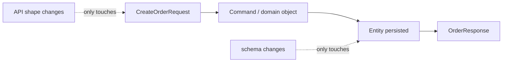

**Why not expose entities:** Three concrete reasons. Lazy associations trigger queries or exceptions during serialisation; every new column becomes a public field automatically; and binding a request directly onto an entity is mass assignment, letting a client set `status`, `price` or `role`.

**Example:**
```java
public record CreateOrderRequest(
    @NotNull Long customerId,
    @NotEmpty List<@Valid LineRequest> lines) {

    public PlaceOrderCommand toCommand() {
        return new PlaceOrderCommand(customerId, lines.stream().map(LineRequest::toLine).toList());
    }
}

public record OrderResponse(Long id, String status, BigDecimal total, Instant createdAt) {
    public static OrderResponse from(Order order) {
        return new OrderResponse(order.id(), order.status().name(), order.total(), order.createdAt());
    }
}
```

**Separate request and response types:** They differ more than they look. A request has no id and no timestamps; a response has no password and no internal flags. One shared type forces every field to be nullable and optional.

**Advantages:** The API contract is explicit and reviewable, the schema is free to change, validation lives at the boundary, and sensitive fields cannot leak by accident.

**Disadvantages:** More classes and a mapping step. For a small internal service that is real overhead — which is why some teams expose entities early and regret it later rather than immediately.

> ⚠️ **Common misconception:** "DTOs are unnecessary duplication." They are the same data with different *reasons to change*. Duplication of structure is not duplication of purpose.

**Common mistake:** One DTO reused for create, update and response, with half the fields ignored in each case. Every consumer then has to be told which fields apply where.

**Predict it:** A sign-up endpoint binds `@RequestBody User user` straight onto the JPA entity, which has a `role` field. A client adds `"role": "ADMIN"` to the request. What role does the new user get?

**`ADMIN`.** Jackson sets every field the JSON names, and the entity has a `role` field to set. That is mass assignment: binding to an entity lets clients write fields you never meant to expose. A request DTO without `role` makes it impossible.

**Best intuition:** The entity is how you store it; the DTO is what you promised. Keeping the promise separate is what lets storage evolve.

**Terminology:** *DTO*, *mass assignment*, *API contract*, *projection*, *command object*.

---

### 4.6 Mapping Between Layers

**The problem:** Once each layer has its own types, something must convert between them — and if that conversion is implicit or scattered, nobody can see what actually crosses each boundary.

**How it works:** So mapping is made an explicit step at each boundary. Mapping converts between DTOs, domain objects and entities. Options are a static factory on the DTO, a dedicated mapper class, or a generated mapper such as MapStruct that writes the code at compile time.

| Approach | Pros | Cons |
|---|---|---|
| Static factory on the DTO | No dependency, explicit, easy to read | Spreads mapping across DTOs |
| Dedicated mapper class | One place per boundary | Hand-written boilerplate |
| MapStruct | Generated, compile-time, fast | Annotation processor, generated code to debug |
| Reflection mappers | No code | Slow, silent on mismatches |

**Example:**
```java
@Mapper(componentModel = "spring")
public interface OrderMapper {
    @Mapping(target = "status", expression = "java(order.status().name())")
    OrderResponse toResponse(Order order);

    List<OrderResponse> toResponses(List<Order> orders);
}
```

**Where to map:** At the boundary, in one direction per layer. The controller maps DTO to command; the service works in domain terms; the repository works in entities. Mapping scattered through business logic is a sign the boundaries are leaking.

**Advantages:** Explicit, reviewable translation points, and compile-time safety when generated — a renamed field is reported at build time (as an error with `unmappedTargetPolicy = ERROR`) rather than silently producing `null`.

**Disadvantages:** Boilerplate, and three nearly identical shapes (DTO, domain, entity) in simple services where two would do.

> 💡 **Tip:** Reflection-based mappers that copy by field name fail silently when a name changes. Prefer explicit code or a compile-time generator; a mapping bug that compiles is the expensive kind.

**Common mistake:** Mapping in both directions in every layer, so an object is converted four times per request. Map once at each boundary, and let the middle work in one representation.

**Predict it:** `OrderResponse.total` is renamed to `totalAmount`. What happens with a reflection mapper that copies by field name — and with MapStruct?

**Reflection: `totalAmount` is silently `null` in every response. MapStruct: the build reports the unmapped property.** A reflection mapper looks for matching names at runtime and simply finds none. MapStruct generates the mapping code at compile time, so it notices a target property with no source — as a warning by default, or a failed build with `unmappedTargetPolicy = ERROR`.

**Best intuition:** Mapping is where you decide what crosses a boundary. Making it explicit is the point, not an inconvenience.

**Terminology:** *mapper*, *MapStruct*, *boundary*, *bidirectional mapping*, *compile-time safety*.

---

### 4.7 Bean Validation

**The problem:** Every value from outside can be missing, too long or malformed, and checking it with `if` statements at the top of each method is repetitive, easy to forget, and separates each rule from the field it describes.

**How it works:** So constraints are declared on the fields themselves and checked by one validator before your code runs. Jakarta Bean Validation annotations describe constraints on fields and parameters. `@Valid` on a controller parameter makes Spring validate before the handler body runs; `@Validated` on a class enables validation of method parameters anywhere in the application.

**The common constraints:**

| Annotation | Checks |
|---|---|
| `@NotNull` | Not null (an empty string passes) |
| `@NotEmpty` | Not null and not empty (string, collection, map) |
| `@NotBlank` | Not null and contains non-whitespace |
| `@Size(min, max)` | Length or size bounds |
| `@Min` / `@Max` / `@Positive` | Numeric bounds |
| `@Email` / `@Pattern` | Format |
| `@Past` / `@Future` | Temporal |

**Example:**
```java
public record CreateUserRequest(
    @NotBlank @Size(max = 100) String name,
    @NotBlank @Email String email,
    @NotNull @Past LocalDate dateOfBirth,
    @NotEmpty List<@NotBlank String> roles) { }

@PostMapping
UserResponse create(@RequestBody @Valid CreateUserRequest request) { ... }
```

**Nested and custom validation:** `@Valid` on a field cascades into nested objects. A custom constraint is an annotation plus a `ConstraintValidator`, which is the right home for rules such as "end date must follow start date".

**Several exception types:** In a controller, a `@Valid` body failure raises `MethodArgumentNotValidException`, and constraints placed directly on parameters raise `HandlerMethodValidationException` (Spring 6.1+). In other `@Validated` beans, violations raise `ConstraintViolationException`. A global handler must map each to 400 — `ConstraintViolationException` in particular reaches the client as a 500 if nothing handles it.

**Advantages:** Declarative, close to the data, reusable across layers, and automatically documented into OpenAPI.

**Disadvantages:** Default messages are developer-oriented; cross-field rules need custom validators; and validation annotations on entities fire when the entity is persisted or flushed, in the wrong layer, with a confusing exception.

> ⚠️ **Common misconception:** "`@NotNull` is enough for a required string." An empty string and a whitespace-only string both pass. `@NotBlank` is almost always what you meant.

**Common mistake:** Relying on validation annotations on JPA entities for API input. They run at persistence time, after business logic, and produce `ConstraintViolationException` from deep inside Hibernate rather than a clean 400.

**Predict it:** A required `name` field is annotated `@NotNull`. A client sends `"name": "   "`. Does validation pass?

**Yes.** `@NotNull` rejects only `null`, and three spaces are a perfectly non-null string. `@NotBlank` rejects null, empty and whitespace-only values — which is what "required text" actually means.

**Best intuition:** Validate the shape at the edge with annotations; validate business rules in the domain, where they can use more than one field.

**Terminology:** *Bean Validation*, *`@Valid` cascade*, *`ConstraintValidator`*, *validation groups*, *`MethodArgumentNotValidException`*.

---

### 4.8 Global Exception Handling

**The problem:** Exceptions arise everywhere, and if each controller converts them into responses itself, the API's error behaviour drifts — different status codes, different shapes, the occasional stack trace.

**How it works:** So translation from exception to response moves to one place. A `@RestControllerAdvice` class collects `@ExceptionHandler` methods. When a handler throws, Spring's exception resolvers find the most specific handler for that exception type and use its return value as the response.

**Example:**
```java
@RestControllerAdvice
public class ApiExceptionHandler {

    @ExceptionHandler(OrderNotFoundException.class)
    ProblemDetail notFound(OrderNotFoundException ex) {
        var problem = ProblemDetail.forStatusAndDetail(HttpStatus.NOT_FOUND, ex.getMessage());
        problem.setTitle("Order not found");
        problem.setType(URI.create("https://api.shop/errors/order-not-found"));
        return problem;
    }

    @ExceptionHandler(MethodArgumentNotValidException.class)
    ProblemDetail invalid(MethodArgumentNotValidException ex) {
        var problem = ProblemDetail.forStatus(HttpStatus.BAD_REQUEST);
        problem.setTitle("Validation failed");
        problem.setProperty("errors", ex.getBindingResult().getFieldErrors().stream()
            .collect(toMap(FieldError::getField, FieldError::getDefaultMessage)));
        return problem;
    }

    @ExceptionHandler(Exception.class)
    ProblemDetail unexpected(Exception ex) {
        var id = UUID.randomUUID().toString();
        log.error("unhandled error ref={}", id, ex);          // detail in the log
        var problem = ProblemDetail.forStatus(HttpStatus.INTERNAL_SERVER_ERROR);
        problem.setDetail("Unexpected error. Reference: " + id);   // reference for the client
        return problem;
    }
}
```

**`ProblemDetail` and RFC 9457:** Spring 6 includes `ProblemDetail`, a standard error body with `type`, `title`, `status`, `detail` and `instance`, plus arbitrary extra properties. Extending `ResponseEntityExceptionHandler` additionally gives standard handling of Spring's own exceptions.

**Advantages:** One consistent error contract, no try/catch in controllers, a single place to add logging and correlation ids, and documented error types.

**Disadvantages:** Centralised handling can hide where an exception originated; and a catch-all handler can mask genuine bugs if it does not log at `ERROR` with the stack trace.

> 💡 **Tip:** Include a reference id in every 500 response and log it with the stack trace. Support then has one value that ties a user's report to the exact exception.

**Common mistake:** Returning `ex.getMessage()` to the client. Messages frequently contain SQL fragments, class names or internal identifiers — log them, do not publish them.

**Predict it:** A servlet filter throws an exception before the request reaches any controller. Does your `@RestControllerAdvice` turn it into a `ProblemDetail`?

**No.** Advice is applied by the `DispatcherServlet`'s exception resolvers, and a filter runs outside the dispatcher. The exception goes to the servlet container, which forwards to Boot's `/error` endpoint — so the client gets Boot's default error body, not yours. Filters must write their own error responses.

**Best intuition:** Exceptions are the error contract of your API. Decide deliberately which ones a client can see and what they look like.

**Terminology:** *`@RestControllerAdvice`*, *`ProblemDetail`*, *RFC 9457*, *exception resolver*, *error reference id*.

---

### 4.9 Domain Modelling

**The problem:** When entities are only field holders, every rule about them lives in services — so the same rule is re-checked in several places and missed in one, and any code with a setter can create a state the business forbids.

**How it works:** So each rule moves into the object that owns the data it constrains. A domain model expresses the business in types: entities with identity, value objects without, and aggregates that enforce invariants over a cluster of objects. Rules live in the objects that own the data they constrain.

**Example:**
```java
// Value object: no identity, immutable, self-validating
public record Money(BigDecimal amount, Currency currency) {
    public Money {
        if (amount.scale() > 2) throw new IllegalArgumentException("max 2 decimal places");
    }
    public Money plus(Money other) {
        if (!currency.equals(other.currency)) throw new CurrencyMismatchException();
        return new Money(amount.add(other.amount), currency);
    }
}

// Aggregate root: enforces its own invariants
@Entity
public class Order {
    @Id @GeneratedValue private Long id;
    @Enumerated(STRING) private Status status;
    @OneToMany(cascade = ALL, orphanRemoval = true) private List<OrderLine> lines = new ArrayList<>();

    public void cancel() {
        if (status == Status.SHIPPED) throw new OrderAlreadyShippedException(id);
        status = Status.CANCELLED;                 // the rule lives with the state
    }
}
```

**Anaemic versus rich models:** An anaemic model is entities with getters and setters and all behaviour in services. It works, and it scales badly: the rule "a shipped order cannot be cancelled" ends up checked in three services, and eventually in only two.

**Value objects earn their keep:** `Money`, `EmailAddress` and `Quantity` make illegal states unrepresentable and remove a category of validation from every method that would otherwise take a `BigDecimal` and a `String`.

**Advantages:** Rules live where the data lives, invariants are enforced at construction, and the code reads like the business describes itself.

**Disadvantages:** JPA constrains domain design — no-argument constructors, mutable collections, lazy proxies — so a pure domain model and a JPA entity pull in different directions.

> ⚠️ **Common misconception:** "Domain-driven design means more layers." Its core is a model that reflects the business, not an architecture diagram. Starting with value objects and invariants in entities delivers most of the benefit.

**Common mistake:** Entities with public setters for every field. Any code anywhere can then put an order into a state the business does not allow, and no single place is responsible for preventing it.

**Predict it:** `Order` has `cancel()`, which refuses to cancel a shipped order — and also a public `setStatus(...)`. A new refund job calls `order.setStatus(CANCELLED)`. Is the rule enforced?

**No.** The setter is a second door that skips the check. An invariant holds only if *every* path to the state goes through the method that guards it — which is why fields that can break a rule should not have public setters.

**Best intuition:** Put the rule next to the data it protects. If changing a field can break an invariant, that field should not be publicly settable.

**Terminology:** *entity*, *value object*, *aggregate root*, *invariant*, *anaemic model*.

---

### 4.10 Hexagonal Architecture

**The problem:** In a layered design the business core depends on the persistence layer beneath it. When the rules are the valuable, long-lived part and frameworks and storage keep changing, that dependency points the wrong way: every infrastructure change reaches into the core.

**How it works:** So the dependency is inverted — the core declares what it needs, and infrastructure plugs in. The application core defines **ports** — interfaces describing what it needs and what it offers — and infrastructure supplies **adapters** implementing them. Dependencies point inward: the core knows nothing about HTTP, JPA or Kafka.

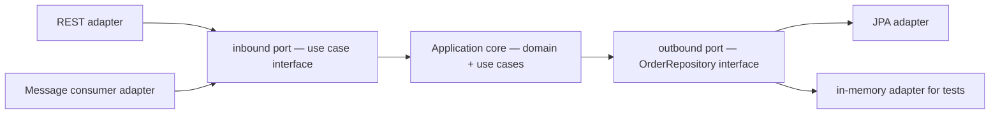

**Example:**
```java
// core: the port it needs, defined in domain terms
public interface OrderRepository {
    Optional<Order> findById(OrderId id);
    void save(Order order);
}

// infrastructure: the adapter, which may use Spring Data internally
@Component
class JpaOrderRepository implements OrderRepository {
    private final SpringDataOrderRepository jpa;
    public Optional<Order> findById(OrderId id) { return jpa.findById(id.value()).map(Mapper::toDomain); }
}
```

**What it buys:** The core is testable with no framework at all, and swapping a technology is an adapter change. The cost is an extra interface and mapping layer for every boundary.

**When it is worth it:** Complex domains with long lifespans, several entry points (HTTP, messaging, scheduled jobs), or a genuine expectation of changing infrastructure. A CRUD service over one table is not that case.

**Advantages:** Framework-independent business logic, fast and complete unit testing, and boundaries that are visible in the type system rather than by convention.

**Disadvantages:** More indirection and more mapping; and partially applied, it produces the costs of both styles with the benefits of neither.

> 💡 **Tip:** You can take the useful half without the ceremony: define repository interfaces in domain terms and keep framework annotations out of your domain classes. That alone captures most of the testability benefit.

**Common mistake:** Adopting ports and adapters for a simple service, then hollowing it out — adapters that pass straight through, ports with one implementation forever — leaving only the indirection.

**Predict it:** One aggregate must move from the relational database to a document store. In a hexagonal service, which code changes — and which tests still pass untouched?

**Only an outbound adapter changes, and every core test still passes.** The core depends on its own `OrderRepository` port, not on JPA, so a new adapter implementing that port is the entire migration. The core tests used an in-memory adapter all along, so they never knew JPA existed.

**Best intuition:** Layering asks "what calls what?"; hexagonal asks "what is the application, and what is merely how it is reached?".

**Terminology:** *port*, *adapter*, *dependency inversion*, *application core*, *onion/clean architecture*.

---

[[#📖 Master Table of Contents|⬆ Back to top]]

*End of Group 4. Next: SQL & Relational Data Modelling.*

---

## 5. SQL & Relational Data Modelling

### Table of Contents (this group)
- [[#5.1 The Relational Model]]
- [[#5.2 SELECT and Filtering]]
- [[#5.3 Joins]]
- [[#5.4 Aggregation]]
- [[#5.5 Subqueries and CTEs]]
- [[#5.6 Indexes]]
- [[#5.7 Query Plans]]
- [[#5.8 Schema Design]]
- [[#5.9 Constraints]]
- [[#5.10 Schema Migrations]]

---

### 5.1 The Relational Model

**The problem:** Data shaped around one program's objects answers that program's questions and nothing else; every new question, report or application needs code that navigates the stored structure by hand.

**How it works:** So data is stored as plain facts in tables, and relationships as values, independent of any program. Data lives in tables; each row is an assertion of fact, identified by a primary key. Relationships are expressed by storing a key value, not a pointer — a foreign key says "this row relates to that one", and the database enforces that the target exists.

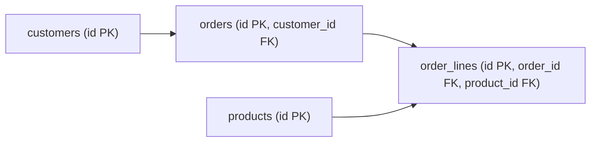

**Cardinality in tables:** One-to-many puts the foreign key on the many side. Many-to-many needs a join table holding both keys. One-to-one is a shared or unique foreign key, and usually indicates the two tables should be one.

**Why declarative matters:** SQL states the result you want. The optimiser chooses access paths, join order and algorithms based on statistics, so the same query can execute differently as the data grows — which is a feature, and the reason query plans must be checked rather than assumed.

**Advantages:** Each fact stored once, integrity enforced by the engine, a powerful query language, and transactional guarantees.

**Disadvantages:** The schema must be designed up front and migrated to change, and deeply hierarchical or schemaless data fits awkwardly.

> ⚠️ **Common misconception:** "The database is just storage the ORM talks to." It is a query engine with an optimiser and a concurrency model. Treating it as a dumb store is how application code ends up re-implementing joins in Java.

**Common mistake:** Designing tables to mirror Java classes rather than the data's own relationships, which produces schemas that are awkward to query from anything but the application.

**Predict it:** Orders store `customer_id`. Someone tries to delete a customer who still has orders, and the foreign key has no `ON DELETE` action. What happens?

**The delete is rejected.** The foreign key promises that every `customer_id` points at a real customer; deleting that customer would break the promise for every one of their orders, so the database refuses. The integrity rule lives in the data, not in whichever program happens to be deleting.

**Best intuition:** Tables are sets of facts; keys are how facts refer to each other; SQL asks questions about those sets.

**Terminology:** *relation*, *primary key*, *foreign key*, *cardinality*, *referential integrity*.

---

### 5.2 SELECT and Filtering

**The problem:** Tables are large, results are small, and moving rows across the network only to discard most of them wastes everything — so the filtering, sorting and limiting must happen inside the database, where the indexes are.

**How it works:** So a query describes the result, and the engine evaluates its clauses in a fixed logical order. Logically, the engine evaluates `FROM`, then `WHERE`, then `GROUP BY` and `HAVING`, then `SELECT`, then `ORDER BY`, then `LIMIT`. That order explains why a column alias defined in `SELECT` cannot be used in `WHERE` but can be in `ORDER BY`.

**Example:**
```sql
SELECT o.id,
       o.status,
       o.total_cents / 100.0 AS total
FROM orders o
WHERE o.created_at >= now() - interval '30 days'
  AND o.status IN ('OPEN', 'PAID')
ORDER BY o.created_at DESC
LIMIT 20 OFFSET 0;
```

**Three-valued logic:** `NULL` means unknown, so `NULL = NULL` is unknown rather than true, and `WHERE column = NULL` matches nothing. Use `IS NULL` and `IS NOT NULL`. A `NOT IN` list containing a `NULL` returns no rows at all — a classic silent bug.

**Sargable predicates:** A condition the engine can satisfy with an index is *sargable*. Wrapping a column in a function — `WHERE lower(email) = ?` or `WHERE date(created_at) = ?` — usually disables the index unless a matching expression index exists.

**Advantages:** Filtering and sorting happen where the data is, with indexes available, and only the result crosses the network.

**Disadvantages:** Subtle semantics — null handling, collation-dependent sorting, implicit type conversion — that differ between engines.

> ⚠️ **Common misconception:** "`SELECT *` is harmless." It fetches every column including large ones, prevents index-only scans, and breaks when someone adds a column. Name what you need.

**Common mistake:** Filtering in Java after loading rows. One `WHERE` clause replaces transferring and discarding thousands of rows, and it can use an index.

**Predict it:** `SELECT * FROM customers WHERE id NOT IN (SELECT referred_by FROM customers)`, where some customers have `referred_by = NULL`. How many rows come back?

**None.** `NOT IN` means "not equal to every value in the list", and comparing anything with `NULL` is *unknown*, not true — so no row can ever satisfy the condition. Three-valued logic, not a bug in the database. `NOT EXISTS` gives the intended answer.

**Best intuition:** Push work toward the data. Every row that does not need to leave the database should not.

**Terminology:** *predicate*, *sargable*, *three-valued logic*, *projection*, *logical evaluation order*.

---

### 5.3 Joins

**The problem:** Normalisation stores each fact once, in its own table — so almost every useful question needs facts from several tables combined again, and doing that by fetching both tables into the application would move far too much data.

**How it works:** So the engine reassembles them on demand, matching rows on a condition. A join matches rows from two inputs on a condition. The optimiser picks the algorithm: a **nested loop** (good when one side is small and the other indexed), a **hash join** (good for large unsorted inputs), or a **merge join** (good when both sides are already sorted).

| Join | Keeps |
|---|---|
| `INNER` | Rows matching on both sides |
| `LEFT` | All left rows, nulls where no match |
| `RIGHT` | All right rows, nulls where no match |
| `FULL` | All rows from both sides |
| `CROSS` | Every combination — the Cartesian product |

**Example:**
```sql
SELECT c.name, count(o.id) AS order_count
FROM customers c
LEFT JOIN orders o ON o.customer_id = c.id AND o.status = 'PAID'
GROUP BY c.id, c.name;
-- the extra condition is in ON, not WHERE: in WHERE it would turn this into an inner join
```

**The `LEFT JOIN` + `WHERE` trap:** Putting a condition on the right table in `WHERE` filters out the null-extended rows, silently converting a left join into an inner join. Conditions on the optional side belong in `ON`.

**Time/space complexity:** Nested loop is O(n × m) without an index and O(n log m) with one; hash join is O(n + m) plus memory for the hash table; merge join is O(n + m) when both inputs are already sorted.

**Advantages:** Combining normalised data on demand, with the engine choosing the algorithm based on actual sizes.

**Disadvantages:** Join order and algorithm choice depend on statistics, so plans change as data grows; and joining many tables multiplies the optimiser's search space.

> 💡 **Tip:** When a join produces more rows than expected, check the join condition for a missing key column. A partial condition silently produces a partial Cartesian product.

**Common mistake:** Filtering an outer join's optional side in `WHERE`, then wondering why customers with no orders disappeared.

**Predict it:** `SELECT c.name, o.id FROM customers c LEFT JOIN orders o ON o.customer_id = c.id WHERE o.status = 'PAID'`. Do customers with no orders appear?

**No.** The left join first keeps them, with `NULL` in every order column. Then `WHERE o.status = 'PAID'` runs on the joined rows, and `NULL = 'PAID'` is not true — so exactly the rows the left join was meant to keep are removed. Move the condition into `ON` and they come back.

**Best intuition:** `ON` decides what pairs up; `WHERE` decides which resulting rows survive. For outer joins those are very different questions.

**Terminology:** *inner/outer join*, *nested loop*, *hash join*, *merge join*, *Cartesian product*.

---

### 5.4 Aggregation

**The problem:** Many questions want summaries — counts, totals, averages per group — and computing them in the application means transferring every row just to produce a few numbers.

**How it works:** So the engine summarises next to the data. `GROUP BY` partitions rows into groups; aggregate functions produce one value per group; `HAVING` filters groups after aggregation, whereas `WHERE` filters rows before it. Every selected column must either be grouped or aggregated (PostgreSQL also accepts a column determined by a grouped primary key).

**Example:**
```sql
SELECT date_trunc('day', created_at) AS day,
       count(*)                      AS orders,
       sum(total_cents)              AS revenue_cents,
       avg(total_cents)::int         AS avg_cents
FROM orders
WHERE created_at >= now() - interval '7 days'    -- filter rows first: cheaper
  AND status = 'PAID'
GROUP BY 1
HAVING count(*) > 10                             -- filter groups after
ORDER BY 1;
```

**Window functions:** When you need an aggregate *alongside* the detail rows rather than instead of them, a window function is the tool: `sum(total) OVER (PARTITION BY customer_id)` adds a per-customer total to every row without collapsing them.

**Counting correctly:** `count(*)` counts rows; `count(column)` counts non-null values; `count(DISTINCT column)` counts distinct non-null values and is markedly more expensive. The difference is a frequent source of wrong numbers in reports.

**Time/space complexity:** Grouping needs a sort or a hash table — O(n log n) or O(n) with memory proportional to the number of groups. An index on the grouping columns can let the engine stream groups without sorting.

**Advantages:** Summaries computed next to the data, with far less transferred, and expressive enough to replace most reporting code.

**Disadvantages:** Aggregating large tables is expensive and competes with transactional load; and `NULL` handling in aggregates surprises people (`sum` of no rows is `NULL`, not zero).

> 💡 **Tip:** `coalesce(sum(x), 0)` when an empty result should be zero. Reports that show blank instead of zero are usually this.

**Common mistake:** Fetching rows to count them in the application. `count(*)` is one round trip that returns one number; loading ten thousand rows to call `.size()` moves all of them.

**Predict it:** A report runs `SELECT sum(total_cents) FROM orders WHERE created_at >= today` on a day with no orders yet. What does it return — and what does the dashboard show?

**`NULL`, so the dashboard shows a blank.** `sum` adds up the values that exist, and with no rows there are none to add — the answer is "unknown", not zero. `coalesce(sum(total_cents), 0)` states what the business actually means.

**Best intuition:** `WHERE` filters rows, `GROUP BY` forms piles, aggregates measure each pile, `HAVING` discards piles.

**Terminology:** *aggregate function*, *`GROUP BY`*, *`HAVING`*, *window function*, *cardinality*.

---

### 5.5 Subqueries and CTEs

**The problem:** Real questions are often layered — the answer to one question is the input to the next — and writing the whole thing as one flat query quickly becomes unreadable.

**How it works:** So queries can contain queries, and intermediate steps can be named. A subquery in `WHERE` filters against another result set; one in `FROM` acts as a derived table; a **correlated** subquery references the outer row and is evaluated per row. A CTE (`WITH name AS (...)`) names a subquery so the main query reads clearly.

**Example:**
```sql
WITH monthly AS (
    SELECT customer_id, sum(total_cents) AS spend
    FROM orders
    WHERE created_at >= date_trunc('month', now())
    GROUP BY customer_id
),
ranked AS (
    SELECT customer_id, spend,
           rank() OVER (ORDER BY spend DESC) AS position
    FROM monthly
)
SELECT c.name, r.spend, r.position
FROM ranked r
JOIN customers c ON c.id = r.customer_id
WHERE r.position <= 10;
```

**Correlated subqueries and cost:** A correlated subquery may run once per outer row. Modern optimisers often rewrite them as joins, but not always — if a query is unexpectedly slow, a correlated subquery in the `SELECT` list is a prime suspect.

**`EXISTS` versus `IN`:** `EXISTS` stops at the first match and handles nulls predictably; `IN` with a subquery containing `NULL` can return no rows for `NOT IN`. Prefer `EXISTS` for existence checks.

**Materialisation:** PostgreSQL historically materialised CTEs as an optimisation fence; since version 12 it inlines a side-effect-free CTE that is referenced only once, unless `MATERIALIZED` is specified. Behaviour differs by engine and version, which matters when a CTE-based query changes performance after an upgrade.

**Advantages:** Complex questions expressed in readable steps, recursive CTEs for hierarchies, and intermediate results named rather than repeated.

**Disadvantages:** Easy to write something the optimiser cannot flatten; and a long CTE chain can hide an expensive step behind a tidy name.

> ⚠️ **Common misconception:** "A CTE is a temporary table." It is a named subquery; whether it is materialised depends on the engine and version.

**Common mistake:** `NOT IN (SELECT column ...)` where the column is nullable, which returns zero rows. Use `NOT EXISTS`.

**Predict it:** A query lists 1,000 customers and, in its `SELECT` list, a correlated subquery computing each customer's latest order date. How many times can that subquery run?

**Up to 1,000 times — once per output row.** A correlated subquery depends on the current outer row, so it has to be re-evaluated for each one unless the optimiser can rewrite it into a join. Rewritten as a join with `max(...)` and `GROUP BY`, the work is done in one pass.

**Best intuition:** A CTE names a step in your reasoning. It helps the reader; whether it helps the optimiser depends on the engine.

**Terminology:** *CTE*, *derived table*, *correlated subquery*, *`EXISTS`*, *materialisation*.

---

### 5.6 Indexes

**The problem:** Finding rows by scanning the whole table costs time proportional to the table's size — fine at a thousand rows, an outage at a hundred million — and the table keeps growing.

**How it works:** So the database keeps an extra, sorted copy of some columns, where a lookup can jump straight to the right place. A B-tree index keeps the indexed columns sorted with pointers to rows, so a lookup costs O(log n) traversals instead of scanning the table. Range scans work because the structure is ordered.

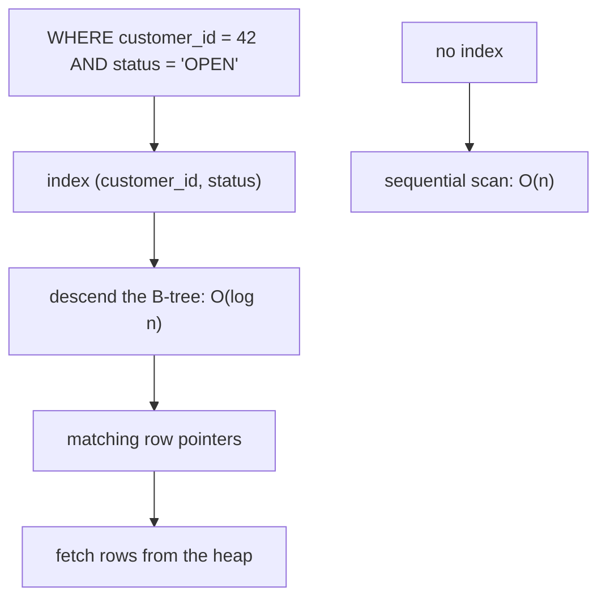

**Composite index order matters:** An index on `(customer_id, status)` serves `WHERE customer_id = ?`, and `WHERE customer_id = ? AND status = ?`, but not `WHERE status = ?` alone — the leftmost-prefix rule. Column order should follow equality predicates first, then range predicates, then sort columns.

**Covering indexes:** If an index contains every column a query needs, the engine can answer from the index alone — an index-only scan, avoiding the table entirely. Including a column deliberately for this is often the difference between a fast and a slow list endpoint.

**What indexes cost:** Every insert, update and delete must maintain every affected index. A table with eight indexes writes roughly eight times the index pages. Unused indexes are pure cost, and most schemas have several.

**Time/space complexity:** Lookup O(log n); insert O(log n) per index; storage proportional to indexed data size.

**Advantages:** Orders-of-magnitude faster filtered reads, enforced uniqueness, and support for ordering and joins.

**Disadvantages:** Slower writes, more storage, and plans that can regress when statistics drift.

> 💡 **Tip:** Index the columns you filter, join and sort on — and then check `pg_stat_user_indexes` (or the equivalent) for indexes that are never used and can be dropped.

**Common mistake:** Adding an index per column instead of one composite index matching the real query. Three single-column indexes rarely serve a three-predicate query as well as one correctly ordered composite.

**Predict it:** There is an index on `(customer_id, status)`. Which of these can use it: `WHERE customer_id = 42`, `WHERE customer_id = 42 AND status = 'OPEN'`, `WHERE status = 'OPEN'`?

**The first two; the third cannot use it efficiently.** The index is sorted by `customer_id` first and by `status` only *within* each customer — like a phone book sorted by surname, then first name. You can find every "Smith", or "Smith, Anna", but finding every "Anna" still means reading the whole book. (Some engines — PostgreSQL 18, MySQL 8, Oracle — can *skip-scan* such an index when the leading column has few distinct values: a rescue, not a design.)

**Best intuition:** An index is a sorted copy of some columns. It helps exactly when the query's access pattern matches that sort order.

**Terminology:** *B-tree*, *composite index*, *leftmost prefix*, *covering index*, *selectivity*.

---

### 5.7 Query Plans

**The problem:** SQL says *what* you want, never *how*, so the text of a slow query cannot tell you why it is slow — the decisions that matter were made inside the engine.

**How it works:** So the engine can show you those decisions. The planner enumerates execution strategies, estimates each one's cost from table statistics, and picks the cheapest. `EXPLAIN` shows the chosen plan; `EXPLAIN ANALYZE` executes it and reports actual rows and timings alongside the estimates.

**Reading one:**
```sql
EXPLAIN ANALYZE
SELECT o.id FROM orders o WHERE o.customer_id = 42 AND o.status = 'OPEN';

-- Index Scan using idx_orders_customer_status on orders  (cost=0.43..8.45 rows=1 width=8)
--   (actual time=0.021..0.023 rows=3 loops=1)
--   Index Cond: ((customer_id = 42) AND (status = 'OPEN'))
```

**What to look for:** A `Seq Scan` on a large table with a selective predicate means a missing or unusable index. A large gap between estimated and actual rows means stale statistics. Nested loops with high `loops=` counts indicate a join the optimiser underestimated.

**Why plans change:** Statistics are sampled and refreshed by autovacuum or `ANALYZE`. As a table grows, the same query can switch from an index scan to a sequential scan — correctly, because at some selectivity scanning is genuinely cheaper.

**Advantages:** The definitive answer to "why is this slow", available without changing any code, and comparable before and after a change.

**Disadvantages:** Output is verbose and engine-specific; and a plan on a small development dataset tells you little about production behaviour.

> 💡 **Tip:** Always use `EXPLAIN ANALYZE` on a realistic data volume. On a thousand-row development table, every plan looks fine.

**Common mistake:** Adding indexes speculatively without reading the plan, ending with a dozen indexes, slower writes, and the original query still unoptimised.

**Predict it:** A query that used an index for a year switches to a sequential scan after the table quadruples. The query and indexes are unchanged. Is the database wrong?

**Usually not.** The planner chooses by estimated cost. As the matching fraction of rows grows, jumping around the index for each row becomes more expensive than reading the table in order, so the cheapest plan genuinely changes. Check estimates against actual rows before blaming the planner — stale statistics are the other common cause.

**Best intuition:** The plan is the database explaining its reasoning. Optimisation is a conversation with it, not guesswork.

**Terminology:** *`EXPLAIN ANALYZE`*, *sequential scan*, *index scan*, *statistics*, *cost estimate*.

---

### 5.8 Schema Design

**The problem:** A fact stored in two places will eventually be updated in one and not the other, and from then on the data contradicts itself — with no way to tell which copy is right.

**How it works:** So the schema stores each fact once, and normalisation is the step-by-step method for getting there. Normalisation removes redundancy step by step: 1NF gives atomic columns, 2NF removes partial dependencies on a composite key, 3NF removes dependencies between non-key columns. In practice, aiming for 3NF and denormalising deliberately where measurements justify it is the working rule.

**Example:**
```sql
-- Denormalised: the customer's name repeats on every order and can drift
CREATE TABLE orders (id BIGSERIAL PRIMARY KEY, customer_name TEXT, total_cents BIGINT);

-- Normalised: the name lives once, orders reference it
CREATE TABLE customers (id BIGSERIAL PRIMARY KEY, name TEXT NOT NULL);
CREATE TABLE orders (
    id          BIGSERIAL PRIMARY KEY,
    customer_id BIGINT NOT NULL REFERENCES customers(id),
    total_cents BIGINT NOT NULL CHECK (total_cents >= 0)
);
```

**Deliberate denormalisation:** Storing a computed total on an order, or the product name on an order line, is sometimes correct — an order line should record the price *at the time of purchase*, not follow the product's current price. That is not redundancy; it is a different fact.

**Types matter:** `TIMESTAMPTZ` rather than `TIMESTAMP` for instants, integer minor units or `NUMERIC` for money, native `UUID` and `JSONB` types where the engine has them, and enums as constrained text or a lookup table rather than ordinals.

**Advantages:** Each fact stored once, inconsistency structurally impossible, and a schema that documents the domain.

**Disadvantages:** More joins for common reads, and changes to a widely referenced table are expensive to coordinate.

> ⚠️ **Common misconception:** "Normalise everything." Normalisation protects correctness; selective denormalisation serves performance. Both are design decisions, and both should be deliberate.

**Common mistake:** Storing money as `FLOAT`, or timestamps without a time zone. Both produce errors that appear months later and cannot be reconstructed.

**Predict it:** An order line stores `product_id` but not the price. Next month the product's price rises from 20 to 25. What does last month's invoice show if it is re-generated?

**25 — the wrong amount.** The line only points at the product, so it reads the *current* price. The price at the moment of purchase was a separate fact that was never stored. That is why order lines copy the price — not redundancy, but a different fact.

**Best intuition:** Each table should describe one kind of thing, and each column should be a fact about that thing and nothing else.

**Terminology:** *normalisation*, *3NF*, *denormalisation*, *surrogate key*, *natural key*.

---

### 5.9 Constraints

**The problem:** Application checks protect only writes that go through the application — but migrations, admin scripts, data fixes and other services write too, and concurrent requests can race past a check-then-write.

**How it works:** So the rule moves into the database, the one place every write must pass. Constraints are checked by the engine on every write, regardless of which client performs it. `PRIMARY KEY` implies unique and not null; `FOREIGN KEY` enforces that the referenced row exists; `UNIQUE` prevents duplicates; `CHECK` enforces a predicate per row.

**Example:**
```sql
CREATE TABLE order_lines (
    id         BIGSERIAL PRIMARY KEY,
    order_id   BIGINT NOT NULL REFERENCES orders(id) ON DELETE CASCADE,
    sku        TEXT   NOT NULL,
    quantity   INT    NOT NULL CHECK (quantity > 0),
    price_cents BIGINT NOT NULL CHECK (price_cents >= 0),
    UNIQUE (order_id, sku)
);
```

**Referential actions:** `ON DELETE CASCADE` removes children with the parent; `RESTRICT` blocks the delete; `SET NULL` orphans them. Cascades are convenient and dangerous — a single delete can remove a large subtree with no further confirmation.

**Why the database, not just the application:** Application checks cover the paths the application knows about. Migrations, admin scripts, data fixes and other services bypass them. A constraint cannot be bypassed.

**Advantages:** Guarantees that hold for every writer, self-documenting intent, and optimiser hints — a unique constraint tells the planner at most one row can match.

**Disadvantages:** Violations surface as database exceptions that must be translated into sensible API errors, and constraints on huge tables take time to add.

> 💡 **Tip:** Translate `DataIntegrityViolationException` into a 409 with a clear message. Unhandled, it becomes a 500 and the client learns nothing.

**Common mistake:** Enforcing uniqueness only in application code with a "check then insert". Under concurrency both checks pass and both inserts succeed — only a unique constraint actually prevents it.

**Predict it:** Sign-up checks "is this email taken?" and, if not, inserts the user. Two requests with the same email arrive within the same millisecond, and there is no unique constraint. How many users are created?

**Possibly two.** If both checks run before either insert, both see "not taken" and both insert. The gap between check and write is unavoidable in application code; a `UNIQUE` constraint makes the second insert fail inside the database, where the check and the write are one step.

**Best intuition:** Constraints are invariants the data keeps about itself, independent of any application.

**Terminology:** *referential integrity*, *`CHECK` constraint*, *cascade*, *deferrable constraint*, *unique index*.

---

### 5.10 Schema Migrations

**The problem:** The schema must change alongside the code, identically in every environment — and changes applied by hand drift, because nobody can reliably remember which `ALTER` already ran where.

**How it works:** So schema changes become numbered files applied by a tool that records what has run. Migration tools apply ordered, versioned scripts and record each one in a history table, inside a lock so concurrent instances cannot apply the same change twice. Flyway uses versioned SQL files; Liquibase uses changelogs in SQL, XML or YAML.

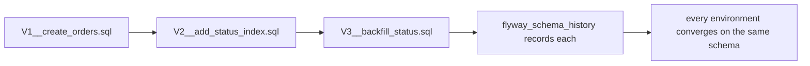

**Expand and contract:** A column rename that must not break a running deployment takes four releases: add the new column and write to both; backfill and switch reads to it; stop writing the old column; drop it. Stopping and dropping are separate because, during each rollout, the previous release is still running — and it must never meet a schema it cannot use. Every zero-downtime schema change follows this shape.

**Example:**
```sql
-- V7__add_order_reference.sql
ALTER TABLE orders ADD COLUMN reference TEXT;
UPDATE orders SET reference = 'ORD-' || id WHERE reference IS NULL;
ALTER TABLE orders ALTER COLUMN reference SET NOT NULL;

-- V8__index_order_reference.sql — its own migration: CONCURRENTLY cannot run inside a
-- transaction, and Flyway will not mix it with transactional statements by default
CREATE UNIQUE INDEX CONCURRENTLY idx_orders_reference ON orders (reference);
```

**Locking matters:** On PostgreSQL, most forms of `ALTER TABLE` take an `ACCESS EXCLUSIVE` lock — often only briefly, but it waits behind long-running transactions and every other query waits behind it. Adding an index without `CONCURRENTLY` blocks writes for the whole build. On a large table during business hours, that is an outage caused by a migration.

**Advantages:** Reproducible schemas across environments, reviewable changes in version control, and a history that explains how the schema reached its current state.

**Disadvantages:** Migrations are forward-only in practice — rollback scripts are rarely tested — and long-running ones can block deployments or lock tables.

> ⚠️ **Common misconception:** "`ddl-auto=update` is fine for small projects." It cannot drop or rename safely, it is not reviewable, it produces different results on different versions, and it will eventually do something surprising to production data. Use migrations from day one.

**Common mistake:** A migration that rewrites a large table during a deployment window, locking it and taking the service down with it. Backfill in batches, outside the migration, when the table is big.

**Predict it:** A migration that already ran in production is edited to fix a typo in a comment. The next deployment starts. What happens?

**Startup fails with a checksum mismatch.** Flyway stores a checksum of every applied migration; editing the file changes it, and Flyway refuses to continue because the history no longer matches what was applied. Applied migrations are immutable — a fix is a new migration.

**Best intuition:** A migration is a commit against the database. It should be small, reviewed, ordered and reversible in design even if not in script.

**Terminology:** *Flyway*, *Liquibase*, *expand and contract*, *schema history*, *`CONCURRENTLY`*.

---

[[#📖 Master Table of Contents|⬆ Back to top]]

*End of Group 5. Next: JPA & Hibernate.*

---

## 6. JPA & Hibernate

### Table of Contents (this group)
- [[#6.1 JPA and Hibernate]]
- [[#6.2 Entities and Mapping]]
- [[#6.3 Identifiers and Generation]]
- [[#6.4 Relationships and Ownership]]
- [[#6.5 The Persistence Context]]
- [[#6.6 Entity Lifecycle States]]
- [[#6.7 Dirty Checking and Flushing]]
- [[#6.8 Lazy and Eager Loading]]
- [[#6.9 The N+1 Problem]]
- [[#6.10 JPQL and Queries]]
- [[#6.11 Hibernate Caching]]

---

### 6.1 JPA and Hibernate

**The problem:** Objects and rows are different shapes — references versus foreign keys, object identity versus primary keys, inheritance versus flat tables — and converting between them by hand with JDBC is the same tedious, error-prone code for every class.

**How it works:** So a mapping layer does the conversion from declarations. JPA defines the annotations, the `EntityManager` API and JPQL; Hibernate implements them. Spring Data JPA sits above both, generating repository implementations that call the `EntityManager`. Three layers, each adding convenience and distance from the SQL.

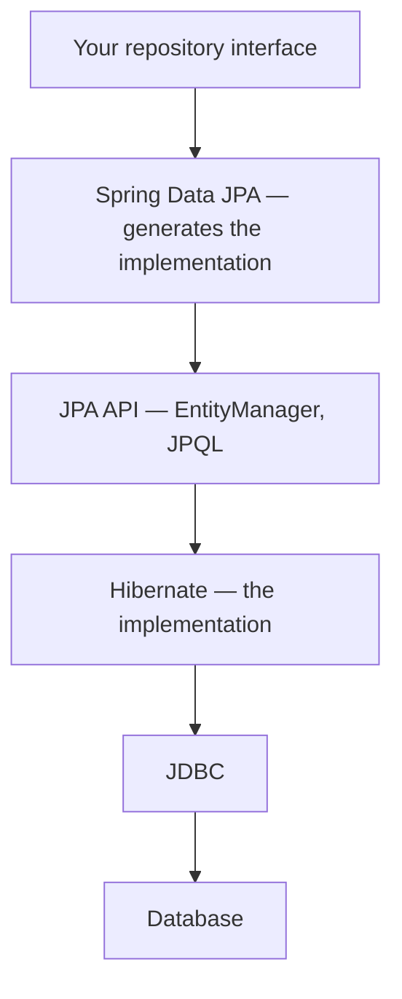

**What the mapping buys:** Rows become objects with identity and behaviour; associations become references; and a transaction's changes are collected and written in one batch instead of statement by statement.

**What it costs:** Every layer hides SQL. A single line of Java can issue one query, fifty queries, or an unbounded number. That is the entire source of JPA's reputation for being slow — the framework is fast, the generated access patterns are not.

**Advantages:** Far less boilerplate, portable queries, dirty checking, caching within a transaction, and a single programming model across databases.

**Disadvantages:** A steep conceptual model (persistence context, lifecycle states, lazy proxies), surprising behaviour when that model is misunderstood, and difficulty expressing some SQL.

> ⚠️ **Common misconception:** "JPA is slow." JPA generates ordinary SQL. What is slow is N+1 access patterns, loading entire object graphs and chatty transactions — all of which are visible the moment you log the SQL.

**Common mistake:** Treating repositories as magic and never looking at the generated SQL. Every serious JPA performance problem is obvious in the query log and invisible in the Java.

**Predict it:** `orderRepository.findAll()` followed by `orders.forEach(o -> o.getCustomer().getName())`, with `customer` mapped lazily, on a table of 500 orders from 500 different customers. How many SQL statements can run?

**Up to 501.** One `SELECT` for the orders, then one per distinct customer the first time each lazy proxy is touched. Nothing in the Java looks like a query — which is exactly why the SQL log, not the code, is where JPA performance is judged.

**Best intuition:** JPA is a translator between objects and rows. Knowing what it says on your behalf is the whole skill.

**Terminology:** *JPA*, *Hibernate*, *`EntityManager`*, *Spring Data JPA*, *object-relational impedance mismatch*.

---

### 6.2 Entities and Mapping

**The problem:** To convert automatically, the framework must know which class maps to which table and which field to which column — while the object model and the schema each keep their own conventions.

**How it works:** So the mapping is declared on the class, with conventions filling in everything you do not state. `@Entity` marks a class as persistent. Hibernate reads its fields (or getters) at startup, builds a mapping to columns, and generates SQL from it. Defaults follow convention — class name to table name, camelCase to snake_case through the naming strategy — and annotations override them.

**Example:**
```java
@Entity
@Table(name = "orders", indexes = @Index(name = "idx_orders_status", columnList = "status"))
public class Order {

    @Id @GeneratedValue(strategy = GenerationType.IDENTITY)
    private Long id;

    @Column(name = "customer_id", nullable = false)
    private Long customerId;

    @Enumerated(EnumType.STRING)              // never ORDINAL
    @Column(nullable = false, length = 20)
    private Status status;

    @Column(name = "created_at", nullable = false, updatable = false)
    private Instant createdAt;

    @Version                                   // optimistic locking
    private long version;

    protected Order() { }                      // required by Hibernate
}
```

**Requirements JPA imposes:** A no-argument constructor (may be `protected`), a non-final class, and no `final` methods or persistent fields. Hibernate relaxes some of these, but it builds lazy proxies by subclassing the entity, so a `final` class or method quietly loses lazy loading. These constraints are why a pure immutable domain model and a JPA entity pull in opposite directions.

**`EnumType.STRING` versus `ORDINAL`:** Ordinal stores the enum's position, so reordering the Java enum silently reinterprets existing data. Always map enums as `STRING`.

**Advantages:** Schema and object model decoupled, validation of the mapping at startup, and generated DDL for development.

**Disadvantages:** Annotations couple domain classes to persistence, and the mapping is easy to get subtly wrong in ways that only appear with real data.

> 💡 **Tip:** Set `spring.jpa.hibernate.ddl-auto=validate` in every environment. It verifies the mapping against the real schema at startup and fails fast on drift, without ever modifying the database.

**Common mistake:** `@Enumerated` left at its `ORDINAL` default. The first reordering of the enum corrupts the meaning of every existing row.

**Predict it:** `Status` is mapped with the default `EnumType.ORDINAL` and declared as `OPEN, PAID, SHIPPED`. A developer inserts `CANCELLED` between `OPEN` and `PAID`. What do existing `PAID` orders become?

**`CANCELLED` — and `SHIPPED` orders become `PAID`.** Ordinal mapping stores each value's *position*, and inserting a constant shifts every position after it. The rows did not change; their meaning did. `EnumType.STRING` stores the name, which reordering cannot affect.

**Best intuition:** An entity is a mapping declaration that happens to look like a class. Every annotation is a statement about the schema.

**Terminology:** *entity*, *naming strategy*, *`@Column`*, *`@Enumerated`*, *`@Version`*.

---

### 6.3 Identifiers and Generation

**The problem:** Hibernate files every managed entity under its id, so it needs the id as soon as an entity is persisted — but with database-generated ids, only the database can supply it, and asking for each one costs a round trip.

**How it works:** So the strategy decides *when* the id becomes known, and that timing decides what can be optimised. `@GeneratedValue` selects the strategy. `IDENTITY` relies on an auto-increment column, so Hibernate must execute the insert immediately to learn the id. `SEQUENCE` fetches values from a database sequence in advance, which allows inserts to be batched. `AUTO` picks per dialect; `UUID` generates in the application.

| Strategy | Id known before insert | Batching | Notes |
|---|---|---|---|
| `IDENTITY` | No | **Disabled** | Simple; forces an immediate insert per entity |
| `SEQUENCE` | Yes | Yes | Preferred on PostgreSQL and Oracle |
| `TABLE` | Yes | Yes | Portable, slow, contended — avoid |
| `UUID` | Yes | Yes | Distributed-friendly; larger, and random values fragment indexes |

**Example:**
```java
@Id
@GeneratedValue(strategy = GenerationType.SEQUENCE, generator = "order_seq")
@SequenceGenerator(name = "order_seq", sequenceName = "order_seq", allocationSize = 50)
private Long id;
```

**`allocationSize` matters:** With a pool of 50, Hibernate fetches one sequence value and uses 50 ids locally, cutting round trips by a factor of fifty on bulk inserts. The sequence's `INCREMENT BY` in the database must match, or ids will collide.

**Why `IDENTITY` blocks batching:** Hibernate needs the generated id to put the entity in the persistence context, and only the database can supply it — so it must insert each row immediately rather than accumulating a batch.

**Advantages:** Ids managed automatically, and sequence pooling makes bulk writes far cheaper.

**Disadvantages:** The choice is hard to change later, and UUID primary keys cost index locality and storage — enough to matter on large tables.

> ⚠️ **Common misconception:** "`IDENTITY` and `SEQUENCE` are interchangeable." They differ in when the id exists, which determines whether Hibernate can batch inserts at all. On a bulk-insert path, that is an order-of-magnitude difference.

**Common mistake:** `allocationSize` left at the default of 50 while the database sequence increments by one — a mismatch that makes the id ranges Hibernate hands out overlap, producing duplicate keys even from a single instance. Recent Hibernate versions check the increment at startup (`hibernate.id.sequence.increment_size_mismatch_strategy`); keep that check enabled.

**Predict it:** A job saves 10,000 new entities with `hibernate.jdbc.batch_size=50`. How many `INSERT` round trips with `IDENTITY` ids — and with a pooled `SEQUENCE`?

**About 10,000 versus about 200.** With `IDENTITY` the id exists only after each row is inserted, so Hibernate must send every insert immediately and cannot batch them. With a pooled sequence the ids are known in advance, so inserts are grouped 50 at a time — plus one sequence call per 50 ids.

**Best intuition:** The id strategy decides when Hibernate learns the identity, and that timing decides what it can optimise.

**Terminology:** *`@GeneratedValue`*, *sequence pooling*, *`allocationSize`*, *surrogate key*, *batch insert*.

---

### 6.4 Relationships and Ownership

**The problem:** The database has one foreign-key column, but a bidirectional object model has two references — the parent's collection and the child's field — and they can disagree. Something has to decide which one the database follows.

**How it works:** So exactly one side is declared the owner, and only that side is read when writing. The **owning side** holds the foreign key and is the only side Hibernate reads when deciding what to write. The inverse side declares `mappedBy` and is, for persistence purposes, read-only. In a bidirectional `@ManyToOne`/`@OneToMany` pair, the many side owns.

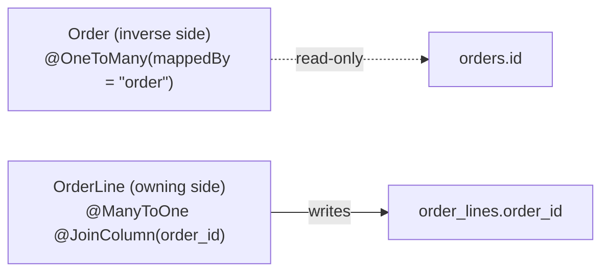

**Example:**
```java
@Entity
public class Order {
    @OneToMany(mappedBy = "order", cascade = CascadeType.ALL, orphanRemoval = true)
    private List<OrderLine> lines = new ArrayList<>();

    public void addLine(OrderLine line) {      // keep both sides consistent
        lines.add(line);
        line.setOrder(this);                   // without this, order_id stays null
    }
}

@Entity
public class OrderLine {
    @ManyToOne(fetch = FetchType.LAZY)         // override the eager default
    @JoinColumn(name = "order_id", nullable = false)
    private Order order;
}
```

**Cascading and orphan removal:** `cascade = ALL` propagates persist, merge and remove to children; `orphanRemoval = true` deletes a child removed from the collection. Both are appropriate when the child cannot exist without the parent — an order line — and dangerous when it can.

**`@ManyToMany` in practice:** It works, but a join table with no extra columns rarely stays that way. Modelling the join as its own entity with two `@ManyToOne`s is the more durable choice.

**Advantages:** Navigable object graphs, cascading lifecycle for genuine compositions, and collections maintained for you.

**Disadvantages:** Updating only the inverse side silently persists nothing; bidirectional relationships require helper methods; and careless cascades delete more than intended.

> ⚠️ **Common misconception:** "Adding a child to the parent's collection saves it." Only if the owning side's reference is set too. The collection is the inverse side, and Hibernate does not read it when writing the foreign key.

**Common mistake:** `order.getLines().add(line)` without `line.setOrder(order)`, producing rows with a null foreign key or no insert at all.

**Predict it:** With `Order.lines` mapped `mappedBy = "order"`, code calls only `order.getLines().add(line)` — never `line.setOrder(order)` — then commits. What does `order_lines.order_id` contain?

**At best `null` — and with the `NOT NULL` column mapped above, a failed insert.** The collection is the inverse side, and Hibernate does not read it when writing the foreign key. Only `line.order` — the owning side — determines the column, and it was never set. If the cascade inserts the line, it goes in with no `order_id`: rejected here, silently orphaned where the column allows null. Hence the helper method that sets both.

**Best intuition:** The database has one foreign key column. Exactly one side of your object model controls it, and that is the side Hibernate listens to.

**Terminology:** *owning side*, *`mappedBy`*, *cascade*, *orphan removal*, *join table*.

---

### 6.5 The Persistence Context

**The problem:** If every lookup returned a fresh object, one transaction could hold two copies of the same row, modified in two different ways — and there would be no answer to "which one should be saved?". Reading the same row repeatedly would also waste round trips.

**How it works:** So each transaction gets one workspace that keeps exactly one object per row. The persistence context is a first-level cache and a change tracker, scoped to a transaction. It maps entity identity (class plus id) to a single instance, and holds a snapshot of each entity's loaded state for dirty checking.

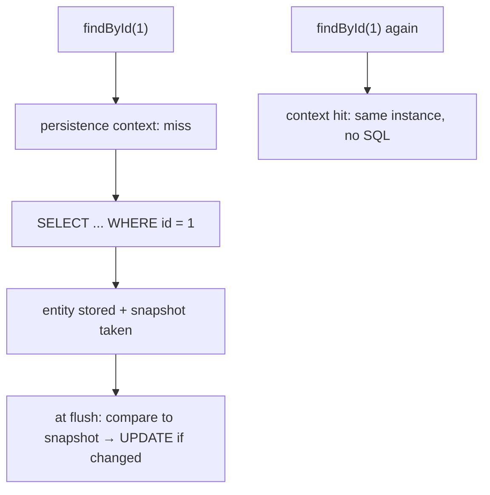

**Identity guarantee:** Within one context, `findById(1) == findById(1)` is true — the same Java object. That is why `==` works for managed entities inside a transaction and fails across transactions.

**Example:**
```java
@Transactional
public void rename(Long id, String name) {
    Order order = repository.findById(id).orElseThrow();
    order.setName(name);          // no save() needed
}                                  // flush at commit issues the UPDATE
```

**Scope and `open-in-view`:** By default Spring Boot keeps the persistence context open for the whole HTTP request (`spring.jpa.open-in-view=true`, with a warning at startup), so lazy loading works during serialisation. It also holds a database connection from the first query to the end of the request, and hides N+1 problems inside the view layer. Set it to `false` and fetch deliberately.

**Advantages:** Repeated reads are free, changes are detected automatically, writes are batched at flush, and object identity is consistent within a transaction.

**Disadvantages:** A long transaction accumulates entities and memory; and entities become detached the moment the context closes, which is where `LazyInitializationException` comes from.

> 💡 **Tip:** Set `spring.jpa.open-in-view=false` in new projects. The warning Boot logs about it is pointing at a real problem: a connection held until the request ends and lazy loads happening during serialisation.

**Common mistake:** Loading thousands of entities in one transaction for a batch job. They all stay in the context; memory grows until the job fails. Flush and clear in batches, or use a stateless session.

**Predict it:** Inside one `@Transactional` method, `findById(1)` is called twice. How many `SELECT`s run, and does `a == b` hold? Now call it in two separate transactions.

**One query, and `a == b` is true; across two transactions, two queries and `a != b`.** The context maps "Order #1" to a single instance for as long as the transaction lasts, so the second call never reaches the database. A new transaction starts with an empty workspace — unless `open-in-view` keeps one context across both, in which case it is still one query and the same instance.

**Best intuition:** The persistence context is a transaction-scoped workspace that remembers what it loaded and what it looked like at the time.

**Terminology:** *first-level cache*, *identity map*, *snapshot*, *`open-in-view`*, *detached*.

---

### 6.6 Entity Lifecycle States

**The problem:** The same Java object may be tracked by a persistence context or not, depending on *when* you hold it — so "what happens if I change it?" has no single answer until you know which.

**How it works:** So every entity is in one of four states, and the state decides what Hibernate does. Four states define what Hibernate will do with an object.

| State | Meaning | Changes are saved |
|---|---|---|
| Transient | New object, no id, unknown to Hibernate | No |
| Managed | In a persistence context, tracked | Yes, automatically |
| Detached | Was managed; the context has closed or released it | No |
| Removed | Scheduled for deletion at flush | — |

```mermaid
flowchart LR
    A["Transient: new Order()"] -->|persist| B["Managed"]
    B -->|commit / close| C["Detached"]
    C -->|merge| B
    B -->|remove| D["Removed"]
    D -->|flush| E["row deleted"]
```

**Example:**
```java
Order order = new Order();            // transient
repository.save(order);               // managed — persist
order.setStatus(SHIPPED);             // tracked automatically
// transaction commits → UPDATE issued

// Later, outside the transaction:
order.setStatus(CANCELLED);           // detached — nothing happens
repository.save(order);               // merge: copies state into a managed instance
```

**`persist` versus `merge`:** `persist` makes a transient object managed and will fail on a detached one. `merge` copies state into a managed instance and *returns* it — the object you passed in stays detached, which is why `merge`'s return value must be used.

**Advantages:** Explicit rules about when changes are written, and automatic persistence for managed entities with no save calls.

**Disadvantages:** The state is invisible in the code — the same object behaves differently depending on context — and detached entities are the root of several confusing bugs.

> ⚠️ **Common misconception:** "`save()` always issues an INSERT or UPDATE." For a managed entity it does nothing at all: dirty checking would have written the change anyway. For a detached one it merges.

**Common mistake:** Using the object passed to `merge` rather than the one it returns, so subsequent changes are made to a detached instance and silently lost.

**Predict it:** A service loads an order in one transaction and returns it. The controller then calls `order.setStatus(CANCELLED)` and returns 200. Is the order cancelled in the database?

**No.** When the transaction ended, nothing was going to write the order any more: it became detached — or, with `open-in-view` on, it stays attached to a context that is never flushed. Either way the change lives only in memory. The endpoint reports success and changes nothing. Changes must happen inside a transaction, or be merged back.

**Best intuition:** Ask "is anyone watching this object?" Managed means yes; everything else means your changes go nowhere unless you say so.

**Terminology:** *transient*, *managed*, *detached*, *removed*, *`merge`*.

---

### 6.7 Dirty Checking and Flushing

**The problem:** Writing an `UPDATE` by hand for every changed field is tedious and easy to get wrong — yet the information is already there, if someone remembers what the object looked like when it was loaded.

**How it works:** So Hibernate remembers, and works out the updates itself. When an entity is loaded, Hibernate keeps a snapshot of its state. At flush time it compares each managed entity against its snapshot and issues an `UPDATE` for each one that changed — by default writing every column; `@DynamicUpdate` limits it to the changed ones. Flush happens at commit, before a query that might be affected by pending changes, or on an explicit `flush()`.

**Example:**
```java
@Transactional
public void applyDiscount(Long id, int percent) {
    var order = repository.findById(id).orElseThrow();
    order.setTotalCents(order.getTotalCents() * (100 - percent) / 100);
    // no save(), no update statement written by you
}   // flush at commit: UPDATE orders SET ... WHERE id = ?
```

**Write-behind:** Statements are not sent as you make changes; they are accumulated and ordered at flush. That allows batching (`hibernate.jdbc.batch_size`) and is why the SQL log shows everything happening at the end of the method rather than where the code changed the field.

**Flush modes:** `AUTO` (the default) flushes before queries that could be affected and at commit. `COMMIT` flushes only at commit, which is faster but means a query may not see your own pending changes.

**Cost:** Dirty checking is proportional to the number of managed entities and their fields. A context holding 50,000 entities performs a large comparison at every flush — one reason batch jobs must clear the context periodically.

**Advantages:** No update statements to write, batched writes, and correct ordering of inserts, updates and deletes handled for you.

**Disadvantages:** Changes are invisible in the code's control flow, accidental modifications are persisted silently, and the SQL appears at a time that does not match the source.

> ⚠️ **Common misconception:** "Changing a managed entity without calling save does nothing." The opposite is true, and it is the most dangerous direction of the misunderstanding: any field you modify inside a transaction will be written.

**Common mistake:** Mutating a managed entity for a temporary calculation — adjusting a price to compute something — and persisting that change by accident at commit.

**Predict it:** Inside a `@Transactional` method, code temporarily sets `order.setTotalCents(0)` to compute a "what if" value, never calls `save()`, and returns. What is in the database afterwards?

**Zero.** The order is managed, so at commit Hibernate compares it to its snapshot, sees the changed total, and writes it. Not calling `save()` does not mean "do not save" — for a managed entity, every change is saved.

**Best intuition:** Inside a transaction, the entity *is* the row. Change the object and the row changes.

**Terminology:** *dirty checking*, *snapshot*, *flush*, *write-behind*, *`FlushMode`*.

---

### 6.8 Lazy and Eager Loading

**The problem:** Entities are connected in a graph, and following every reference on load would pull in far more data than any use case needs — but not following them means the data must be fetched later, when someone asks.

**How it works:** So unloaded associations are replaced by stand-ins that fetch on first touch. A lazy to-one association is represented by a proxy — a generated subclass that holds only the id — and a lazy collection by a Hibernate collection wrapper. Touching anything beyond the id triggers a query. Eager associations are fetched with their owner, usually by a join or a second query at load time.

| Association | Default | Recommended |
|---|---|---|
| `@ManyToOne` | EAGER | `LAZY` explicitly |
| `@OneToOne` | EAGER | `LAZY` (with caveats) |
| `@OneToMany` | LAZY | Keep LAZY |
| `@ManyToMany` | LAZY | Keep LAZY |

**Example:**
```java
@ManyToOne(fetch = FetchType.LAZY)       // override the eager default
@JoinColumn(name = "customer_id")
private Customer customer;
```

**`LazyInitializationException`:** Touching a lazy association after the persistence context has closed throws. With `open-in-view=false`, that happens during serialisation — which is a good thing: it surfaces the missing fetch at development time rather than hiding an N+1 in the view layer.

**Fetching deliberately:** Use a join fetch in the query that loads the data, an entity graph, or a projection that selects exactly the fields needed. The decision belongs to the query, not to the mapping.

**Advantages of lazy:** Only what you use is loaded, and object graphs do not pull in the whole database.

**Disadvantages:** Access outside a transaction fails; lazy loading inside loops produces N+1; and proxies break `getClass()` comparisons, `instanceof` checks against subtypes, and naive `equals` implementations.

> ⚠️ **Common misconception:** "Eager fetching avoids the N+1 problem." It can make it worse: eager associations are fetched for every entity in a result set, including the ones you never touch, and nested eager mappings multiply.

**Common mistake:** Switching a mapping to `EAGER` to fix a `LazyInitializationException`. That makes every query everywhere load the association. The fix is a join fetch in the specific query that needs it.

**Predict it:** `@ManyToOne Customer customer` is left at its default fetch type. A list endpoint loads 100 orders and only ever reads `order.id`. Is the customer data loaded anyway?

**Yes.** `@ManyToOne` defaults to `EAGER`, so every query that loads orders also loads their customers — usually as extra queries — whether or not anyone reads them. That default is why the advice is "map everything lazy, then fetch per query".

**Best intuition:** Fetching is a property of the query, not of the mapping. Map everything lazy; fetch what each use case needs.

**Terminology:** *proxy*, *`LazyInitializationException`*, *join fetch*, *entity graph*, *fetch plan*.

---

### 6.9 The N+1 Problem

**The problem:** Lazy loading turns a field access into an invisible query. Inside a loop, the invisible query runs once per item, so the number of round trips grows with the data while the code still looks like plain getters.

**How it works:** One query loads N parent entities. Accessing a lazy association on each one issues an additional query, giving N+1 round trips. Each is fast; the total is not, and it grows linearly with the page size.

```mermaid
flowchart TD
    A["SELECT * FROM orders LIMIT 50"] --> B["50 Order entities"]
    B --> C["for each: order.getLines()"]
    C --> D["SELECT * FROM order_lines WHERE order_id = ?  ×50"]
    D --> E["51 queries, ~51 round trips"]
```

**Example and fixes:**
```java
// Problem
List<Order> orders = repository.findByStatus(OPEN);
orders.forEach(o -> total += o.getLines().size());     // one query per order

// Fix 1: join fetch
@Query("select distinct o from Order o join fetch o.lines where o.status = :status")
List<Order> findByStatusWithLines(Status status);   // distinct: needed on Hibernate 5, redundant on 6

// Fix 2: entity graph
@EntityGraph(attributePaths = "lines")
List<Order> findByStatus(Status status);

// Fix 3: projection — do not load entities at all
@Query("select o.id as id, count(l) as lineCount from Order o left join o.lines l " +
       "where o.status = :status group by o.id")
List<OrderLineCount> countLines(Status status);
```

**Batch fetching as a safety net:** `@BatchSize(size = 50)` on the association makes Hibernate load lazy collections in batches of 50 — turning N+1 into N/50+1. It is a mitigation, not a substitute for fetching deliberately.

**Time complexity:** N+1 round trips where each has fixed latency. Over a 1 ms network link, 200 orders cost 200 ms of pure waiting — more than the queries themselves.

**Advantages of understanding it:** Nearly every "JPA is slow" complaint is this problem, and it is fixable without changing the architecture.

**Disadvantages:** It is invisible in the Java, appears only under real data volumes, and `open-in-view=true` hides it inside serialisation where no one is looking.

> 💡 **Tip:** Count queries per request in tests. A simple assertion that a list endpoint issues at most two queries catches every future regression of this kind.

**Common mistake:** Fixing N+1 by making associations eager, which trades one problem for a heavier one across the whole application.

**Predict it:** A page of 20 orders issues 21 queries and takes 30 ms. The page size is raised to 200. Roughly how many queries, and what happens to latency?

**201 queries, and latency grows about tenfold.** Each order still costs one extra round trip for its lines, so the work grows linearly with the page size. A join fetch keeps it at one query however large the page.

**Best intuition:** If a loop touches the database, you have an N+1. Fetch what the loop needs before the loop starts.

**Terminology:** *N+1*, *join fetch*, *`@EntityGraph`*, *`@BatchSize`*, *projection*.

---

### 6.10 JPQL and Queries

**The problem:** Once data is modelled as entities, writing queries in table and column names means thinking in two vocabularies and repeating the mapping by hand — yet some questions need SQL features no abstraction offers.

**How it works:** So queries can be written against the entity model, with native SQL as an escape hatch. JPQL queries entities and their fields, and Hibernate translates them into SQL against the mapped tables. The Criteria API builds the same queries programmatically, and native queries pass SQL straight through.

| Option | Use when |
|---|---|
| Derived method name | Simple, stable predicates |
| JPQL via `@Query` | Joins, fetch plans, anything named poorly |
| Criteria API | Predicates built dynamically at runtime |
| Native SQL | Database-specific features, bulk operations, complex analytics |
| Projections | You only need some columns |

**Example:**
```java
@Query("""
       select new com.shop.order.OrderSummary(o.id, o.status, sum(l.quantity))
       from Order o join o.lines l
       where o.createdAt >= :since
       group by o.id, o.status
       """)
List<OrderSummary> summaries(Instant since);

@Query(value = "select * from orders where to_tsvector(note) @@ plainto_tsquery(:q)",
       nativeQuery = true)
List<Order> search(String q);
```

**Bulk operations:** `@Modifying @Query("update ...")` runs directly in the database and bypasses the persistence context entirely — so entities already loaded become stale. Use `clearAutomatically = true` or perform bulk updates in their own transaction.

**Parameter binding:** Always bind parameters (`:name` or `?1`). String-concatenated JPQL is injectable in exactly the same way as SQL.

**Advantages:** Queries in domain vocabulary, portability across databases, type-safe projections, and a fallback to native SQL when needed.

**Disadvantages:** JPQL cannot express everything SQL can; dynamic queries in JPQL strings become unreadable; and the Criteria API is verbose enough that most teams avoid it.

> 💡 **Tip:** Use constructor expressions (`select new ...Dto(...)`) or interface projections for read models. Loading full entities to return three fields is the most common avoidable cost in a read endpoint.

**Common mistake:** Bulk `@Modifying` updates in the same transaction as loaded entities, leaving the persistence context holding stale objects — and any later change to one of them writes its stale values back over the bulk change, because Hibernate's default `UPDATE` sets every column.

**Predict it:** In one transaction, an `OPEN` order is loaded; then `@Modifying @Query("update Order o set o.status = 'ARCHIVED' where ...")` archives it in bulk; then the code sets the loaded order's `note`. At commit, what is the status in the database?

**`OPEN` — the bulk update is overwritten.** The bulk query writes straight to the database and bypasses the persistence context, which still holds the order as it was loaded. Setting `note` makes that stale entity dirty, and Hibernate's default `UPDATE` writes every column — including the old status. `clearAutomatically = true`, or a separate transaction, prevents it.

**Best intuition:** Write the query you want in SQL first, then decide which JPA mechanism expresses it most clearly.

**Terminology:** *JPQL*, *Criteria API*, *native query*, *constructor expression*, *`@Modifying`*.

---

### 6.11 Hibernate Caching

**The problem:** Some rows are read over and over — within one transaction, and across many — and each re-read repeats work whose answer has not changed. But a cache shared across transactions can serve data that changed underneath it.

**How it works:** So there are two caches with very different risks. The **first-level cache** is the persistence context — mandatory, per context (normally one transaction), guaranteeing one instance per row. The **second-level cache** is optional, shared across transactions in the same JVM (or distributed), and caches entity state by id. The **query cache** caches query results and requires the second-level cache.

```mermaid
flowchart TD
    A["findById(1)"] --> B{"first-level (persistence context)"}
    B -->|hit| C["same instance, no SQL"]
    B -->|miss| D{"second-level cache (if enabled)"}
    D -->|hit| E["hydrate entity, no SQL"]
    D -->|miss| F["SELECT from the database"]
```

**When the second level helps:** Read-mostly reference data — countries, product categories, configuration — read often and written rarely. It does not help write-heavy entities, where invalidation costs more than it saves.

**Example:**
```java
@Entity
@Cacheable
@org.hibernate.annotations.Cache(usage = CacheConcurrencyStrategy.READ_WRITE)
public class Country { }
```

**Invalidation is the hard part:** Hibernate invalidates entries it writes itself. Changes made by another application or a migration are invisible to it, so the cache serves stale data until eviction. (A native update run *through* Hibernate is the opposite extreme: unable to tell which entities the SQL touched, Hibernate evicts every cached region.)

**Advantages:** Dramatically fewer queries for hot reference data, and the first-level cache makes repeated reads within a transaction free without any configuration.

**Disadvantages:** Stale data on external writes, extra memory, distributed invalidation complexity, and a query cache that is frequently slower than the query it replaces.

> ⚠️ **Common misconception:** "Enabling the second-level cache makes the application faster." It makes repeated reads of cached entities faster and everything else slightly slower. Measure before enabling, and enable per entity, never globally.

**Common mistake:** Enabling the query cache by default. It invalidates aggressively on any write to the involved tables, so on a write-heavy table it does more work than it saves.

**Predict it:** `Country` is in the second-level cache. A DBA renames a country with a SQL script run directly against the database. What do application instances return?

**The old name, until the cache entry expires or is evicted.** Hibernate invalidates entries only for writes *it* performs; a change made outside the application never reaches it. That blind spot is why the second level suits data that changes rarely and only through the application.

**Best intuition:** First level is a transaction's memory; second level is a real cache with real invalidation problems. Treat them as different things.

**Terminology:** *first-level cache*, *second-level cache*, *query cache*, *cache concurrency strategy*, *invalidation*.

---

[[#📖 Master Table of Contents|⬆ Back to top]]

*End of Group 6. Next: Transactions & Data Consistency.*

---

## 7. Transactions & Data Consistency

### Table of Contents (this group)
- [[#7.1 ACID and Transactions]]
- [[#7.2 The Transactional Annotation]]
- [[#7.3 Propagation]]
- [[#7.4 Isolation Levels]]
- [[#7.5 Rollback Rules]]
- [[#7.6 Transaction Boundaries]]
- [[#7.7 Optimistic Locking]]
- [[#7.8 Pessimistic Locking]]
- [[#7.9 Connection Pooling]]
- [[#7.10 Distributed Transactions]]

---

### 7.1 ACID and Transactions

**The problem:** A business operation is several statements, and the system can fail between any two of them — a crash, a lost connection, a constraint violation — leaving data half-changed in a state that matches no real-world event.

**How it works:** So the database lets statements be grouped and makes the group all-or-nothing. A transaction begins, performs reads and writes, and ends with a commit or a rollback. The database achieves atomicity and durability through a write-ahead log: changes are recorded in the log before the data pages, so a crash can be replayed or undone.

**The four properties in practice:**

| Property | What it means | What breaks without it |
|---|---|---|
| Atomicity | All operations or none | Half-applied operations after a failure |
| Consistency | Constraints hold at commit | Invalid data persisted |
| Isolation | Concurrent transactions do not interfere | Dirty reads, lost updates |
| Durability | Committed data survives a crash | Acknowledged writes lost |

**Example:**
```sql
BEGIN;
UPDATE accounts SET balance = balance - 100 WHERE id = 1;
UPDATE accounts SET balance = balance + 100 WHERE id = 2;
COMMIT;            -- both, or after a crash, neither
```

**Where consistency actually comes from:** The database enforces its constraints; the application enforces business invariants. "Consistency" in ACID means the transaction moves the database from one valid state to another — the definition of valid is partly yours.

**Advantages:** A reliable foundation for correctness, with failure handling delegated to a system designed for it.

**Disadvantages:** Isolation costs concurrency, long transactions hold locks and connections, and the guarantees stop at the boundary of one database.

> ⚠️ **Common misconception:** "ACID means my application is correct." It means the database keeps its promises. A transaction that commits the wrong values commits them atomically and durably.

**Common mistake:** Treating a transaction as a performance feature — wrapping a whole batch in one to "make it faster". It makes rollback all-or-nothing and holds locks for the duration.

**Predict it:** A transfer has run `UPDATE accounts SET balance = balance - 100 WHERE id = 1`, and the server loses power before the second `UPDATE` and the `COMMIT`. After the restart, what is account 1's balance?

**Unchanged.** The debit was never committed, so during recovery the database uses its write-ahead log to discard it. Only work whose `COMMIT` reached the log survives; everything before it is undone as if it never happened.

**Best intuition:** A transaction is a bracket around a set of changes. Inside, nothing is visible to others; at the closing bracket, either all of it is, or none.

**Terminology:** *ACID*, *write-ahead log*, *commit*, *rollback*, *unit of work*.

---

### 7.2 The Transactional Annotation

**The problem:** Every transactional operation needs the same begin, commit, rollback and close code around it, and writing that by hand in every method is repetitive and easy to get wrong — a forgotten rollback, a leaked connection.

**How it works:** So the code is written once, in a proxy, and requested by annotation. `@Transactional` is implemented by a proxy. Before the method, the interceptor obtains a connection and begins a transaction; after it returns, it commits; if it throws a matching exception, it rolls back. The transaction is bound to the thread, so everything called within it participates.

```mermaid
flowchart TD
    A["caller invokes the proxy"] --> B["TransactionInterceptor: begin"]
    B --> C["your method body"]
    C -->|returns| D["commit"]
    C -->|throws RuntimeException| E["rollback"]
    D --> F["connection returned to the pool"]
    E --> F
```

**Example:**
```java
@Service
public class OrderService {

    @Transactional
    public Order place(PlaceOrderCommand command) { ... }

    @Transactional(readOnly = true)
    public Order find(Long id) { ... }             // hints Hibernate to skip dirty checking
}
```

**`readOnly = true`:** It tells Hibernate to skip dirty-check snapshots and marks the JDBC connection read-only, which lets some drivers and routers send the query to a replica. Whether the database then rejects writes depends on the driver — PostgreSQL's turns it into a read-only transaction, others treat it as a hint — so use it as an optimisation and a statement of intent, not as access control.

**Where it must not go:** Private methods (the proxy cannot intercept them), controllers (the boundary belongs to the service) and repository methods for multi-step operations (each would commit independently).

**Advantages:** Declarative, consistent, composable through propagation, and free of boilerplate connection handling.

**Disadvantages:** Proxy-based, so self-invocation silently skips it; the default rollback rule is counter-intuitive; and it is easy to make a transaction accidentally large.

> ⚠️ **Common misconception:** "`@Transactional` on any method works." It works when the call arrives through the proxy, from another bean, on a method the proxy can override — not `private`, `static` or `final`. Internal calls are not advised — see [[#1.10 Proxies and AOP]].

**Common mistake:** `@Transactional` on a controller method, which stretches the transaction over mapping, response building and any remote call the controller makes — holding a connection throughout.

**Predict it:** A service method `importAll()` — not transactional itself — loops over 100 records calling `this.importOne(record)`, which is annotated `@Transactional`. Record 50 fails halfway. What has been committed?

**Records 1–49, plus whatever record 50 wrote before failing.** `this.importOne(...)` never passes through the proxy, so the annotation does nothing; each repository call runs and commits in its own small transaction. There is no unit to roll back.

**Best intuition:** The annotation does not do anything itself. It instructs the proxy to wrap your method in begin/commit.

**Terminology:** *`TransactionInterceptor`*, *`PlatformTransactionManager`*, *`readOnly`*, *thread-bound transaction*, *proxy*.

---

### 7.3 Propagation

**The problem:** Transactional methods call other transactional methods, and every such call has to answer one question: join the caller's transaction and share its fate, or run independently?

**How it works:** So each method declares its answer. When a transactional method is called while a transaction is already active, the propagation setting decides what happens.

| Propagation | Existing transaction | No transaction |
|---|---|---|
| `REQUIRED` (default) | Join it | Start one |
| `REQUIRES_NEW` | Suspend it, start a new one | Start one |
| `NESTED` | Savepoint within it | Start one |
| `SUPPORTS` | Join it | Run without one |
| `NOT_SUPPORTED` | Suspend it | Run without one |
| `MANDATORY` | Join it | Throw |
| `NEVER` | Throw | Run without one |

```mermaid
flowchart TD
    A["outer @Transactional"] --> B["inner REQUIRED"]
    B --> C["same transaction: inner rollback dooms the whole thing"]
    A --> D["inner REQUIRES_NEW"]
    D --> E["outer suspended, new connection, independent commit"]
```

**Example — the audit case:**
```java
@Transactional(propagation = Propagation.REQUIRES_NEW)
public void recordAudit(AuditEvent event) {
    auditRepository.save(event);        // committed even if the caller rolls back
}
```

**The `REQUIRED` rollback trap:** Once a `RuntimeException` crosses *any* transactional proxy taking part in the shared transaction — the inner service method, or a repository method it calls — the transaction is marked rollback-only. Catching the exception afterwards, at any level, does not undo the mark, and the outer commit fails with `UnexpectedRollbackException`.

**`REQUIRES_NEW` costs a connection:** The outer transaction is suspended but still holds its connection, so the inner one needs a second. Under concurrency that can deadlock the pool: when every connection is held by an outer transaction waiting for a second one, none can ever be granted.

**Advantages:** Composable transactional methods, independent commits for audit and logging, and savepoints for partial rollback with `NESTED`.

**Disadvantages:** Subtle interactions that are hard to reason about, extra connections for `REQUIRES_NEW`, and `NESTED` support depending on the driver and transaction manager.

> ⚠️ **Common misconception:** "Catching the exception prevents the rollback." Only if it never crossed a transactional proxy. Once it has — leaving the inner method, or a repository call inside it — the transaction is marked rollback-only and the outer commit will fail.

**Common mistake:** Using `REQUIRES_NEW` to "isolate" a step without realising it takes a second connection from the same pool — then deadlocking under load when the pool is exhausted.

**Predict it:** An outer `@Transactional` method calls an inner `REQUIRED` method that throws a `RuntimeException`. The outer method catches it, logs it, and returns normally. What happens when the outer method finishes?

**The commit fails with `UnexpectedRollbackException`.** Both methods share one transaction, and the exception leaving the inner method's proxy already marked it rollback-only. Catching the exception afterwards does not erase the mark — the shared transaction can no longer commit.

**Best intuition:** `REQUIRED` means "we are all in this together"; `REQUIRES_NEW` means "my result stands regardless of yours".

**Terminology:** *propagation*, *`REQUIRES_NEW`*, *savepoint*, *rollback-only*, *`UnexpectedRollbackException`*.

---

### 7.4 Isolation Levels

**The problem:** Concurrent transactions touching the same rows can see each other's half-finished work. Making them fully independent — as if they ran one at a time — is possible, but it costs throughput through waiting or aborted transactions.

**How it works:** So isolation is a dial rather than a switch: each level prevents a specific set of anomalies, at a corresponding cost in concurrency.

| Level | Dirty read | Non-repeatable read | Phantom read |
|---|---|---|---|
| `READ_UNCOMMITTED` | Possible | Possible | Possible |
| `READ_COMMITTED` | Prevented | Possible | Possible |
| `REPEATABLE_READ` | Prevented | Prevented | Possible (in theory) |
| `SERIALIZABLE` | Prevented | Prevented | Prevented |

**The anomalies, concretely:** A *dirty read* sees another transaction's uncommitted change. A *non-repeatable read* gets different values when reading the same row twice. A *phantom read* gets different rows when running the same query twice because another transaction inserted matching rows.

**Engine defaults differ:** PostgreSQL and Oracle default to `READ_COMMITTED`; MySQL's InnoDB defaults to `REPEATABLE_READ`. PostgreSQL implements `REPEATABLE_READ` with snapshot isolation, which also prevents phantoms — so the standard's table and a given engine's behaviour are not identical.

**Example:**
```java
@Transactional(isolation = Isolation.REPEATABLE_READ)
public Report build(Long id) {
    var header = repository.sum(id);
    var detail = repository.lines(id);     // consistent with header at this level
    return new Report(header, detail);
}
```

**Advantages:** A dial between strict correctness and throughput, set per transaction where it matters.

**Disadvantages:** Higher levels increase locking or abort rates, behaviour differs between engines, and `SERIALIZABLE` requires retry logic because transactions can fail with serialisation errors.

> ⚠️ **Common misconception:** "Higher isolation is safer, so use `SERIALIZABLE`." It is safer per transaction and worse for throughput — and it introduces serialisation failures the application must catch and retry.

**Common mistake:** Changing the isolation level to fix a lost-update problem that optimistic locking would solve more cheaply and more explicitly.

**Predict it:** Under `READ_COMMITTED`, two requests each read a stock count of 10, each subtract 1 in Java, and each write 9. What is the final count — and does the isolation level prevent it?

**9, not 8 — and no.** `READ_COMMITTED` only promises you never read uncommitted data, and both reads were of committed data. The second write simply overwrites the first: a lost update. A version column, or an atomic `UPDATE ... SET count = count - 1`, prevents it.

**Best intuition:** Isolation answers "what can I see of work that is still in flight?" — and every answer that sees less costs more.

**Terminology:** *dirty read*, *non-repeatable read*, *phantom*, *snapshot isolation*, *serialisation failure*.

---

### 7.5 Rollback Rules

**The problem:** When a method fails, the framework must decide whether the work done so far is invalid — and not every exception means that. Some signal an expected business outcome that the caller is meant to handle.

**How it works:** So Spring follows the EJB convention for telling them apart: unchecked exceptions are unexpected failures, checked exceptions are anticipated outcomes. Spring's default rolls back on `RuntimeException` and `Error`, and commits on checked exceptions. The rule is configurable per method with `rollbackFor` and `noRollbackFor` — and, since Spring Framework 6.2, globally with `@EnableTransactionManagement(rollbackOn = ALL_EXCEPTIONS)`.

**Example:**
```java
// Default: a checked exception COMMITS the transaction
@Transactional
public void risky() throws IOException {
    repository.save(entity);
    throw new IOException("boom");        // committed — almost certainly not intended
}

// Explicit
@Transactional(rollbackFor = Exception.class)
public void safer() throws IOException { ... }
```

**Marking rollback-only:** Code can call `TransactionAspectSupport.currentTransactionStatus().setRollbackOnly()` to doom a transaction without throwing. In the method that started the transaction, the commit then quietly becomes a rollback; in an inner method that merely joined it, the outer commit fails with `UnexpectedRollbackException`, which surprises callers expecting success.

**Catching inside the transaction:** Catching an exception and continuing leaves the transaction intact only if the exception never crossed a transactional proxy — a repository's included. If an inner `REQUIRED` method already triggered a rollback mark, catching it afterwards does not help.

**Advantages:** Sensible behaviour for the common case, with per-method control when the default is wrong.

**Disadvantages:** The checked-exception default is counter-intuitive and causes real data bugs; and the rollback-only mechanism produces failures far from their cause.

> ⚠️ **Common misconception:** "Any exception rolls back." Checked exceptions commit by default. A method declaring `throws IOException` that fails mid-way leaves earlier writes persisted.

**Common mistake:** Catching and logging an exception inside a transactional method and returning normally, having already lost the ability to commit — or having silently committed partial work.

**Predict it:** A `@Transactional` method saves an order, then calls `paymentGateway.charge()`, which throws a checked `PaymentDeclinedException`. There is no `rollbackFor`. Is the order in the database?

**Yes.** A checked exception commits by default, so the order is saved even though payment failed — Spring treated the decline as an anticipated outcome. If it means the operation failed, say so with `rollbackFor`, or make the exception unchecked.

**Best intuition:** Spring assumes unchecked means "unexpected failure" and checked means "an outcome you planned for". If your checked exception is a failure, say so with `rollbackFor`.

**Terminology:** *rollback rule*, *`rollbackFor`*, *rollback-only*, *`UnexpectedRollbackException`*, *checked exception*.

---

### 7.6 Transaction Boundaries

**The problem:** A transaction holds a database connection — and its row locks — from begin to commit, so its width decides two things at once: what is atomic, and how long everyone else waits for those resources.

**How it works:** So the boundary is a deliberate design choice. The boundary is set where `@Transactional` is applied. Everything inside holds one connection and one transaction; everything outside is separate. The width of that bracket decides lock duration, connection hold time and what is atomic.

```mermaid
flowchart TD
    A["HTTP request"] --> B["controller: validate, map"]
    B --> C["service @Transactional — BEGIN"]
    C --> D["load, decide, write"]
    D --> E["COMMIT, connection released"]
    E --> F["controller: map response, serialise"]
    G["remote call inside C..E"] -.holds a connection while waiting.-> C
```

**Keep them narrow:** Load what you need, decide, write, commit. Remote calls, file I/O, long computations and user interaction belong outside. A transaction open across a two-second HTTP call ties up a pooled connection for two seconds.

**Example:**
```java
public Order place(PlaceOrderCommand command) {
    var quote = pricingClient.quote(command);        // remote call, no transaction
    return orderWriter.persist(command, quote);      // short transaction, in another bean
}

@Service
class OrderWriter {
    @Transactional
    public Order persist(PlaceOrderCommand command, Quote quote) { ... }
}
```

The transactional step lives in a separate bean on purpose: called as `this.persist(...)`, it would bypass the proxy and run with no transaction at all — see [[#1.10 Proxies and AOP]]. `TransactionTemplate` is the programmatic alternative when only a block needs wrapping.

**Read-only transactions:** Marking query methods `@Transactional(readOnly = true)` avoids dirty-check overhead and documents intent. For a single inherited CRUD call such as `findById`, Spring Data already runs it in its own read-only transaction, so the annotation adds little beyond clarity; declared query methods (`findByStatus`, `@Query`) get no transaction of their own by default.

**Advantages:** Explicit atomicity, short lock windows, predictable connection usage, and a clear place to reason about consistency.

**Disadvantages:** Choosing the boundary is a design decision with no mechanical answer; too narrow loses atomicity, too wide destroys throughput.

> 💡 **Tip:** Compute first, then persist. Any work that does not need the database should happen before the transaction opens.

**Common mistake:** One transaction around an entire batch job, so a failure at item 9,000 rolls back 9,000 items — and locks were held for the whole run.

**Predict it:** Pricing takes 2 seconds and the pool has 10 connections. Version A calls pricing inside the transaction; version B calls it before. Roughly how many orders per second can each place?

**A: about 5. B: hundreds.** In A every order holds a connection for over 2 seconds, so 10 connections serve about 5 orders a second. In B the connection is held only for the milliseconds of database work, and the pool stops being the limit.

**Best intuition:** A transaction is a lock on part of the database. Hold it for as little time as the operation genuinely requires.

**Terminology:** *boundary*, *connection hold time*, *lock window*, *read-only transaction*, *unit of work*.

---

### 7.7 Optimistic Locking

**The problem:** Two users load the same order, both edit it, both save — and without protection the second save silently overwrites the first. Holding a database lock between a user's read and their save is impossible when the gap spans HTTP requests and minutes of thinking.

**How it works:** So instead of preventing the conflict, the write *detects* it. A `@Version` column is incremented on every update. Hibernate includes the loaded version in the `WHERE` clause; if no row matches, another transaction has changed it, and `OptimisticLockException` is thrown.

**Example:**
```java
@Entity
public class Order {
    @Id private Long id;
    @Version private long version;          // managed entirely by Hibernate
}
```
```sql
-- Hibernate's update
UPDATE orders SET status = ?, version = 4 WHERE id = ? AND version = 3;
-- 0 rows updated → someone else won → OptimisticLockException
```

```mermaid
flowchart TD
    A["T1 reads order v3"] --> B["T2 reads order v3"]
    B --> C["T2 updates → v4, commits"]
    A --> D["T1 updates WHERE version = 3"]
    D --> E["0 rows affected → OptimisticLockException"]
```

**Handling the conflict:** Retry the whole operation — reload, reapply, save — or return 409 and let the client decide. Which is right depends on whether the operation is mechanical (retry) or involves a human decision (report).

**Why it fits web applications:** A user's edit spans a request, a think time and another request. Holding a database lock across that is impossible; detecting the conflict at write time is both feasible and correct.

**Advantages:** No locks held between requests, scales well under low contention, and makes lost updates impossible rather than merely unlikely.

**Disadvantages:** Work is wasted when a conflict occurs, retries must be written, and under high contention the failure rate can become significant.

> ⚠️ **Common misconception:** "`@Version` prevents concurrent modification." It detects it. The application still decides what to do, and without handling the exception the user simply sees an error.

**Common mistake:** Adding `@Version` and never handling `OptimisticLockException`, so concurrent edits surface as 500s rather than as a meaningful conflict response.

**Predict it:** A REST API returns an order without its version. The client edits it and PUTs it back; the server loads the order, applies the changes and saves. Another user changed the order in between. Does `@Version` catch the conflict?

**No.** The server compares against the version it *just loaded*, which already includes the other user's change, so the check always passes. The version must travel through the client — as a field or an `ETag` — and be compared with what the client originally read.

**Best intuition:** Optimistic locking is a collision detector, not a collision preventer.

**Terminology:** *`@Version`*, *`OptimisticLockException`*, *lost update*, *conflict retry*, *409 Conflict*.

---

### 7.8 Pessimistic Locking

**The problem:** When many transactions fight over the same row — the last few units of a popular product — detecting conflicts after the fact means most of them fail and retry, repeatedly, wasting work and treating users unfairly.

**How it works:** So the conflict is prevented rather than detected: the first transaction locks the row and the rest wait their turn. The transaction acquires a database lock when reading. `PESSIMISTIC_WRITE` issues `SELECT ... FOR UPDATE`, blocking other writers (and, depending on the engine, readers requesting a lock) until commit.

**Example:**
```java
public interface StockRepository extends JpaRepository<Stock, Long> {
    @Lock(LockModeType.PESSIMISTIC_WRITE)
    @Query("select s from Stock s where s.sku = :sku")
    Optional<Stock> findForUpdate(String sku);
}

@Transactional
public void reserve(String sku, int quantity) {
    var stock = repository.findForUpdate(sku).orElseThrow();   // serialised here
    stock.reserve(quantity);
}
```

**When it is the right choice:** High contention on a single row where retrying is expensive or unfair — stock for a popular item, seat allocation, a counter incremented by many writers. Queueing beats repeatedly colliding and retrying.

**Lock timeouts:** Always set one — `jakarta.persistence.lock.timeout` where the dialect honours it, or the engine's own setting, such as PostgreSQL's `lock_timeout`. Without a timeout, a blocked transaction waits indefinitely and holds its own connection and locks while doing so — the ingredients for a cascade.

**Deadlocks:** Two transactions locking the same rows in opposite orders deadlock; the database detects it and kills one. Consistent lock ordering is the prevention, and the application must be ready to retry the victim.

**Advantages:** No wasted work from conflicts, predictable serialisation of a hot row, and correctness under heavy contention.

**Disadvantages:** Reduced concurrency by construction, locks held for the transaction's duration, deadlock risk, and connections consumed while waiting.

> 💡 **Tip:** Lock the narrowest row for the shortest time. A `FOR UPDATE` that also performs a remote call before committing blocks every other writer for the duration of that call.

**Common mistake:** Pessimistic locks held across external calls, turning a two-second dependency into a two-second global serialisation point.

**Predict it:** Transaction A locks product 1 and then product 2; at the same moment transaction B locks product 2 and then product 1. What happens?

**A deadlock — and the database kills one of them.** Each holds the lock the other needs, so neither can proceed; the database detects the cycle and aborts one transaction, which must be retried. Locking rows in a consistent order, say by id, makes the cycle impossible.

**Best intuition:** Optimistic locking says "go ahead and we will check"; pessimistic says "wait your turn".

**Terminology:** *`FOR UPDATE`*, *`PESSIMISTIC_WRITE`*, *lock timeout*, *deadlock*, *lock ordering*.

---

### 7.9 Connection Pooling

**The problem:** Opening a database connection costs authentication, TLS and session setup — often more than the query itself — and the database can only serve a limited number of connections at once.

**How it works:** So connections are opened once and lent out. HikariCP keeps a pool of open connections. A thread borrows one for the duration of its transaction (or its query) and returns it afterwards. When all are in use, further requests wait up to `connection-timeout` and then fail.

**Example configuration:**
```yaml
spring:
  datasource:
    hikari:
      maximum-pool-size: 10
      minimum-idle: 10
      connection-timeout: 3000      # fail fast rather than queue forever
      max-lifetime: 1800000         # below any proxy or database idle timeout
      leak-detection-threshold: 20000
```

**Sizing:** More is not better. A common starting point is `(core_count × 2) + effective_spindle_count`, and for most services a pool of 10–20 per instance is appropriate. The database has its own connection ceiling, and total connections across all instances must stay below it.

**The interaction that matters:** Pool size × instance count must be under the database's `max_connections`. Autoscaling that multiplies instances can exhaust the database's limit, at which point every service fails simultaneously.

**Advantages:** Connection setup paid once, bounded concurrency against the database, and fast failure when saturated rather than unbounded queueing.

**Disadvantages:** A fixed ceiling that becomes the bottleneck under load, and exhaustion symptoms — timeouts waiting for a connection — that look like database slowness but are not.

> ⚠️ **Common misconception:** "A bigger pool handles more load." Past the database's capacity, a larger pool increases contention inside the database and makes everything slower. The pool is a queue, and queueing in the application is cheaper than overwhelming the server.

**Common mistake:** Diagnosing "connection timeout" as a database problem when the cause is transactions held open across slow remote calls. The database is idle; the pool is full.

**Predict it:** Each instance has a pool of 20, the database allows 200 connections, and autoscaling grows the service from 6 to 12 instances during a spike. What happens?

**Instances start failing to connect.** 12 × 20 = 240 connections wanted against a limit of 200, so new instances — and any that reconnect — are refused, exactly when load is highest. Pool size × instances must stay below the database's limit at maximum scale.

**Best intuition:** The pool is the width of the pipe to the database. Everything that holds a connection longer than necessary narrows it.

**Terminology:** *HikariCP*, *pool size*, *connection timeout*, *leak detection*, *`max_connections`*.

---

### 7.10 Distributed Transactions

**The problem:** A local transaction is atomic within one database, but "save the order and publish `OrderPlaced`" writes to two systems. No local transaction covers both, so one write can succeed while the other fails.

**How it works:** One answer is to coordinate the systems; the other is to avoid needing to. Two-phase commit coordinates several resource managers: a prepare phase where each votes, then a commit phase. It provides atomicity across systems at the cost of a coordinator, blocking during the window between phases, and recovery complexity after a coordinator failure.

```mermaid
flowchart TD
    A["Service writes to DB + must publish an event"] --> B{"Atomic across both?"}
    B -->|2PC| C["coordinator, prepare/commit, blocking"]
    B -->|Outbox| D["write data + outbox row in ONE transaction"]
    D --> E["relay polls or tails the log → publishes"]
    E --> F["at-least-once delivery, consumers idempotent"]
```

**The outbox pattern:** Write the event into an `outbox` table inside the same database transaction as the business change. A separate process reads unpublished rows and sends them to the broker, marking them sent. The database transaction is the only atomic unit, and delivery becomes at-least-once.

**Sagas:** A long business process becomes a sequence of local transactions, each with a compensating action if a later step fails. There is no rollback — there is a deliberate undo, which must be designed as part of the business logic.

**Example:**
```java
@Transactional
public void place(Order order) {
    orderRepository.save(order);
    outboxRepository.save(OutboxEvent.of("order.placed", order));   // same transaction
}
// A relay publishes outbox rows afterwards; consumers must be idempotent.
```

**Advantages of avoiding 2PC:** No coordinator, no blocking across systems, and failure modes that are local and understandable.

**Disadvantages:** Eventual consistency rather than immediate, idempotent consumers required, and compensations that are genuine business decisions rather than technical rollbacks.

> ⚠️ **Common misconception:** "Saving to the database and publishing to Kafka in one `@Transactional` method is atomic." It is not. The broker is not in the database transaction — if the publish fails after the commit, the systems disagree permanently.

**Common mistake:** Publishing an event before the transaction commits, so consumers act on a change that is subsequently rolled back. `@TransactionalEventListener(AFTER_COMMIT)` or the outbox pattern avoids it.

**Predict it:** A method saves an order, commits, then publishes `OrderPlaced` to Kafka — and the process is killed right after the commit, before the send completes. What happens to the event? And with the outbox pattern instead?

**Direct publishing: the event is lost for good. Outbox: it is merely delayed.** Directly, the only record that an event should exist was in the dead process's memory. With the outbox, the event was written to a table in the same transaction as the order, so it exists as soon as the order does, and the relay sends it once a process is running again. The price is that consumers may see it twice and must be idempotent.

**Best intuition:** One database transaction is the only atomicity you get cheaply. Everything beyond it is a design problem, not a configuration setting.

**Terminology:** *two-phase commit*, *outbox pattern*, *saga*, *compensating transaction*, *at-least-once delivery*.

---

[[#📖 Master Table of Contents|⬆ Back to top]]

*End of Group 7. Next: Spring Security & JWT.*

---

## 8. Spring Security & JWT

### Table of Contents (this group)
- [[#8.1 Authentication and Authorisation]]
- [[#8.2 The Security Filter Chain]]
- [[#8.3 Configuring HttpSecurity]]
- [[#8.4 Password Hashing]]
- [[#8.5 Users and Authentication Providers]]
- [[#8.6 Stateless Authentication]]
- [[#8.7 JSON Web Tokens]]
- [[#8.8 Role-Based Access Control]]
- [[#8.9 Method Security]]
- [[#8.10 OAuth2 and Resource Servers]]
- [[#8.11 CORS and CSRF]]

---

### 8.1 Authentication and Authorisation

**The problem:** Every request raises two separate questions — who is calling, and may they do this? — and they fail for different reasons, need different responses, and change for different reasons.

**How it works:** So they are separate steps sharing one record of the caller. Authentication produces an `Authentication` object — a principal, credentials and granted authorities — and stores it in the `SecurityContext`, which is bound to the current thread. Authorisation later reads that context and decides whether the request or method call is permitted.

```mermaid
flowchart LR
    A["credentials: password or token"] --> B["authenticate"]
    B -->|valid| C["Authentication in SecurityContext"]
    B -->|invalid| D["401"]
    C --> E["authorise: does it have the required authority?"]
    E -->|yes| F["controller runs"]
    E -->|no| G["403"]
```

**The `SecurityContext`:** Held in a `ThreadLocal` via `SecurityContextHolder`, so any code on the request thread can read the current user. That convenience has a cost: work moved to another thread — `@Async`, a thread pool, a reactive pipeline — does not see it unless the context is propagated.

**Example:**
```java
@GetMapping("/me")
UserResponse me(@AuthenticationPrincipal Jwt jwt) {          // injected from the context
    return users.profile(jwt.getSubject());
}
```

**Advantages:** A clean separation between proving identity and checking permission, so each can change independently, with the current identity available anywhere on the request path.

**Disadvantages:** Thread-local context does not cross thread boundaries automatically, and the two failure codes are easy to confuse.

> ⚠️ **Common misconception:** "401 means the user lacks permission." 401 means not authenticated — no valid credentials. A known user lacking permission is 403.

**Common mistake:** Reading the current user via `SecurityContextHolder` inside an `@Async` method and getting `null`, because the context was never propagated to the worker thread.

**Predict it:** A request with a valid token for Alice, who lacks `ADMIN`, calls an admin endpoint. Another request arrives with an expired token. Which status does each get?

**403 for Alice, 401 for the expired token.** Alice's identity was proven, so authentication succeeded and only authorisation failed. The expired token proves nothing, so authentication itself failed. 401 asks "who are you?"; 403 says "I know who you are — no".

**Best intuition:** Authentication is checking the passport; authorisation is checking the visa.

**Terminology:** *principal*, *`Authentication`*, *`SecurityContext`*, *granted authority*, *401 versus 403*.

---

### 8.2 The Security Filter Chain

**The problem:** If every controller had to check credentials and permissions itself, one forgotten check would be an open endpoint — and it would look exactly like a correct one.

**How it works:** So security runs *before* any controller, as a chain of filters every request must pass through. Spring Security registers a single servlet filter, `DelegatingFilterProxy`, which hands each request to a `FilterChainProxy`. That proxy picks the first `SecurityFilterChain` whose matcher fits the request and runs its ordered filters.

```mermaid
flowchart TD
    A["request"] --> B["DelegatingFilterProxy"]
    B --> C["FilterChainProxy: pick the matching SecurityFilterChain"]
    C --> D["SecurityContextHolderFilter"]
    D --> E["CorsFilter / CsrfFilter"]
    E --> F["authentication filter: BearerTokenAuthenticationFilter, UsernamePassword..."]
    F --> G["ExceptionTranslationFilter"]
    G --> H["AuthorizationFilter"]
    H --> I["DispatcherServlet → controller"]
```

**Several chains:** You can declare more than one `SecurityFilterChain` with `securityMatcher` and `@Order` — a stateless JWT chain for `/api/**` and a session-based form-login chain for `/admin/**`. Order matters: the first matching chain wins.

**Exception translation:** `ExceptionTranslationFilter` converts `AuthenticationException` into a 401 (via an `AuthenticationEntryPoint`) and `AccessDeniedException` into a 403 (via an `AccessDeniedHandler`). Customising those two is how you return `ProblemDetail` bodies instead of default error pages.

**Advantages:** Security enforced before any application code runs, a pluggable sequence of focused filters, and different policies for different parts of the application.

**Disadvantages:** The chain is long and implicit; debugging "why did this return 401?" requires knowing which filter rejected it.

> 💡 **Tip:** Set `logging.level.org.springframework.security=TRACE` in development. It prints every filter the request passes through and which one made the decision — the fastest route to understanding a surprising 401 or 403.

**Common mistake:** Two `SecurityFilterChain` beans without explicit `@Order` and `securityMatcher`, so the wrong chain handles a path and its rules silently do not apply.

**Predict it:** A `@RestControllerAdvice` has an `@ExceptionHandler(AccessDeniedException.class)` returning a custom body. A request is rejected by a URL rule in the security configuration. Does the client receive the custom body?

**No.** URL rules are enforced by `AuthorizationFilter`, inside the filter chain, before the `DispatcherServlet` is reached — and controller advice only sees exceptions thrown inside the dispatcher. The 403 comes from `ExceptionTranslationFilter`, so customise its `AccessDeniedHandler` instead.

**Best intuition:** The filter chain is a sequence of checkpoints. Each one either waves the request through, enriches it, or turns it away.

**Terminology:** *`DelegatingFilterProxy`*, *`FilterChainProxy`*, *`SecurityFilterChain`*, *`ExceptionTranslationFilter`*, *entry point*.

---

### 8.3 Configuring HttpSecurity

**The problem:** Access rules spread across controllers cannot be reviewed as a whole — nobody can answer "which endpoints are public?" — and a forgotten rule must never mean an open endpoint.

**How it works:** So all URL rules live in one bean, as an ordered list ending in a default. A `SecurityFilterChain` bean is built from `HttpSecurity` using the lambda DSL. Spring Security 6 removed `WebSecurityConfigurerAdapter` and `antMatchers`; the current APIs are `authorizeHttpRequests` and `requestMatchers`.

**Example:**
```java
@Configuration
@EnableWebSecurity
@EnableMethodSecurity
public class SecurityConfig {

    @Bean
    SecurityFilterChain api(HttpSecurity http) throws Exception {
        return http
            .securityMatcher("/api/**")
            .csrf(csrf -> csrf.disable())                         // stateless API, no cookies
            .cors(Customizer.withDefaults())
            .sessionManagement(s -> s.sessionCreationPolicy(SessionCreationPolicy.STATELESS))
            .authorizeHttpRequests(auth -> auth
                .requestMatchers(HttpMethod.POST, "/api/auth/login").permitAll()
                .requestMatchers("/api/admin/**").hasRole("ADMIN")
                .requestMatchers(HttpMethod.GET, "/api/products/**").permitAll()
                .anyRequest().authenticated())
            .oauth2ResourceServer(o -> o.jwt(Customizer.withDefaults()))
            .build();
    }
}
```

**Rule order:** `authorizeHttpRequests` evaluates matchers top to bottom and stops at the first match. Specific rules go first; `anyRequest()` must come last. A broad `permitAll()` placed early silently opens everything below it.

**Deny by default:** Ending with `anyRequest().authenticated()` — or `denyAll()` — means a new endpoint is protected unless someone deliberately opens it. The opposite default means a forgotten rule is an exposed endpoint.

**Advantages:** All URL-level rules in one reviewable place, a fluent DSL, and the ability to compose several chains for different areas of the application.

**Disadvantages:** Ordering mistakes are silent; and URL rules alone cannot express "only the owner of this order", which needs method-level or domain-level checks.

> ⚠️ **Common misconception:** "`WebSecurityConfigurerAdapter` is how you configure Spring Security." It was deprecated in 5.7 and removed in 6. Most tutorials predate that; current code declares `SecurityFilterChain` beans.

**Common mistake:** Putting `.requestMatchers("/api/**").permitAll()` above more specific rules, opening every API endpoint with no error and no warning.

**Predict it:** The rules are, in this order, `requestMatchers("/api/**").authenticated()` and then `requestMatchers("/api/admin/**").hasRole("ADMIN")`. An ordinary logged-in user calls `/api/admin/users`. Allowed?

**Yes.** Rules are checked top to bottom and the first match wins. `/api/admin/users` matches `/api/**` first, which only requires authentication, so the admin rule is never consulted. Specific rules must come before general ones.

**Best intuition:** The configuration is an ordered list of "if the request looks like this, require that" — read top to bottom, first match wins.

**Terminology:** *`SecurityFilterChain`*, *`authorizeHttpRequests`*, *`requestMatchers`*, *`securityMatcher`*, *deny by default*.

---

### 8.4 Password Hashing

**The problem:** Databases leak — through backups, bugs and breaches — and every stored password leaks with them, including for every other site where users reused it. Storing a *fast* hash barely helps: a GPU can test billions of guesses per second against it.

**How it works:** So the stored value is made one-way *and* deliberately expensive to compute. A `PasswordEncoder` turns a password into a salted, slow hash. At login the stored hash's salt and parameters are reused to hash the attempt, and the results are compared in constant time. The salt makes identical passwords produce different hashes; the work factor makes each guess expensive.

| Algorithm | Characteristic |
|---|---|
| BCrypt | Default in Spring; adaptive cost factor; widely supported |
| Argon2id | Memory-hard; resists GPU attacks; current recommendation for new systems |
| SCrypt | Memory-hard; older alternative |
| PBKDF2 | FIPS-compliant; needs high iteration counts |
| SHA-256, MD5 | **Never** for passwords — designed to be fast |

**Example:**
```java
@Bean
PasswordEncoder passwordEncoder() {
    return PasswordEncoderFactories.createDelegatingPasswordEncoder();   // stores "{bcrypt}$2a$10$..."
}

public void register(RegisterRequest request) {
    users.save(new User(request.email(), passwordEncoder.encode(request.password())));
}
```

**Delegating encoders:** The stored value carries a prefix such as `{bcrypt}` or `{argon2}`, so the algorithm can be upgraded without invalidating existing hashes — new passwords use the new algorithm, old ones are verified with the old one and can be re-hashed on next login.

**Advantages:** A database leak does not reveal passwords, algorithm upgrades are incremental, and comparison is constant-time.

**Disadvantages:** Deliberate slowness costs CPU at every login, and a work factor tuned too low provides little protection while one tuned too high slows authentication and invites denial of service.

> ⚠️ **Common misconception:** "SHA-256 with a salt is fine." Fast hashes let an attacker test billions of guesses per second on a GPU. Password hashes must be deliberately slow.

**Common mistake:** Logging the raw password — in a request log, a debug statement, or an exception message — which undoes all the hashing in one line.

**Predict it:** Two users choose the same password. With BCrypt, are their stored hashes equal? With unsalted SHA-256?

**BCrypt: different. SHA-256: identical.** BCrypt mixes a random salt into each hash and stores it alongside, so equal passwords produce unequal hashes. Unsalted, an attacker sees at a glance which users share a password, and one precomputed table cracks them all.

**Best intuition:** A password hash is a lock that is cheap to check once and expensive to pick a billion times.

**Terminology:** *salt*, *work factor*, *BCrypt*, *Argon2id*, *`DelegatingPasswordEncoder`*.

---

### 8.5 Users and Authentication Providers

**The problem:** Users may live in a database, a directory or an external system, and credentials may be passwords, tokens or certificates. Hard-wiring one combination into login code turns every change of either into a rewrite.

**How it works:** So login is split into replaceable parts: one that coordinates, ones that check credentials, and one that finds users. The `AuthenticationManager` (usually a `ProviderManager`) asks each `AuthenticationProvider` in turn whether it can authenticate the request. `DaoAuthenticationProvider` loads the user through a `UserDetailsService`, checks the password with the `PasswordEncoder`, and returns an authenticated token with the user's authorities.

```mermaid
flowchart LR
    A["login request"] --> B["AuthenticationManager"]
    B --> C["DaoAuthenticationProvider"]
    C --> D["UserDetailsService.loadUserByUsername"]
    D --> E["PasswordEncoder.matches"]
    E -->|ok| F["authenticated token with authorities"]
    E -->|fail| G["BadCredentialsException → 401"]
```

**Example:**
```java
@Service
class AppUserDetailsService implements UserDetailsService {
    private final UserRepository users;

    public UserDetails loadUserByUsername(String email) {
        var user = users.findByEmail(email)
            .orElseThrow(() -> new UsernameNotFoundException("not found"));
        return User.withUsername(user.getEmail())
            .password(user.getPasswordHash())
            .roles(user.getRoles().toArray(String[]::new))
            .accountLocked(user.isLocked())
            .build();
    }
}
```

**User enumeration:** Spring hides whether the username or the password was wrong — both produce `BadCredentialsException` — so attackers cannot use login responses to discover which accounts exist. Custom login code frequently undoes that protection.

**Advantages:** Credential storage, credential checking and identity source are all replaceable independently, and several providers can coexist (database users plus LDAP, for example).

**Disadvantages:** The abstraction layers obscure a simple operation, and custom providers are easy to write insecurely.

> 💡 **Tip:** Return the same error and take the same time for "no such user" and "wrong password". Distinguishable responses — even by timing — let attackers enumerate accounts.

**Common mistake:** A hand-written login endpoint that returns "user not found" and "incorrect password" as different messages, giving attackers a free account-existence oracle.

**Predict it:** A custom login endpoint returns "no such user" for unknown emails and "wrong password" otherwise. Without knowing any password, what can an attacker learn?

**Which emails have accounts.** Two different answers turn the login form into a membership oracle — useful for targeted phishing and credential stuffing. Spring answers both cases with `BadCredentialsException` precisely to remove that signal.

**Best intuition:** The provider is a clerk; the `UserDetailsService` is the filing cabinet; the encoder is the signature check.

**Terminology:** *`AuthenticationManager`*, *`AuthenticationProvider`*, *`UserDetailsService`*, *`UserDetails`*, *user enumeration*.

---

### 8.6 Stateless Authentication

**The problem:** A session lives in one server's memory. Behind a load balancer, the next request may land on an instance that has never heard of it — so sessions need sticky routing or a shared session store.

**How it works:** So the proof travels with every request instead, and any instance can check it. With `SessionCreationPolicy.STATELESS`, Spring Security never creates an HTTP session. Each request presents a token in `Authorization: Bearer <token>`; a filter validates it and builds the `SecurityContext` for that request only.

| | Session-based | Token-based (stateless) |
|---|---|---|
| Server state | Session store | None |
| Scaling out | Sticky sessions or shared store | Any instance verifies |
| Revocation | Delete the session | Hard — wait for expiry or keep a denylist |
| Credential transport | Cookie | `Authorization` header |
| CSRF exposure | Yes | No (when not using cookies) |

**The revocation problem:** A session can be invalidated instantly. A self-contained token stays valid until it expires, because nothing is checked against server state. Short access-token lifetimes plus refresh tokens — which *are* checked — is the standard compromise.

**Example:**
```java
http.sessionManagement(s -> s.sessionCreationPolicy(SessionCreationPolicy.STATELESS))
    .oauth2ResourceServer(o -> o.jwt(Customizer.withDefaults()));
```

**Advantages:** Horizontal scaling without shared session storage, natural fit for mobile and service-to-service clients, and no CSRF exposure when cookies are not used.

**Disadvantages:** Logout and revocation are genuinely harder, tokens are larger than session ids, and storing tokens safely in a browser is a real problem.

> ⚠️ **Common misconception:** "JWTs are more secure than sessions." They are differently secure. Sessions are easier to revoke; stateless tokens are easier to scale. Neither is automatically better.

**Common mistake:** Long-lived access tokens — days or weeks — with no revocation mechanism, so a leaked token stays usable for its entire lifetime.

**Predict it:** A user's access token is stolen, and the user logs out immediately. Can the attacker still use the token?

**Yes, until it expires.** A stateless token is verified by its signature alone, with nothing checked against server state, so "logging out" changes nothing the verifier looks at. That is why access tokens are short-lived, and refresh tokens — which *are* checked — carry the long-term session.

**Best intuition:** A session is a coat-check ticket the server must look up. A stateless token is a signed letter anyone can verify — and no one can recall once sent.

**Terminology:** *stateless*, *bearer token*, *revocation*, *refresh token*, *`SessionCreationPolicy`*.

---

### 8.7 JSON Web Tokens

**The problem:** A stateless token must prove two things to any server that receives it — who the user is, and that the token came from a trusted issuer unchanged — without that server calling anyone to check.

**How it works:** So the claims are signed. A JWT has three base64url parts: a header naming the algorithm, a payload of claims, and a signature over both. Verification checks the signature with the issuer's key and then checks the claims — expiry (`exp`), issuer (`iss`), audience (`aud`), not-before (`nbf`).

```mermaid
flowchart LR
    A["header: alg, kid"] --> D["signature = sign(header.payload, key)"]
    B["payload: sub, roles, exp, iss, aud"] --> D
    D --> E["token = header.payload.signature"]
    E --> F["verifier: check signature, then exp, iss, aud"]
```

**Symmetric versus asymmetric:** HS256 uses one shared secret for signing and verifying, so every verifier could also mint tokens. RS256 or ES256 sign with a private key and verify with a public one, published as a JWKS endpoint — the right choice whenever more than one service verifies.

**Example (self-issued, using Spring's built-in support):**
```java
@Bean
JwtEncoder jwtEncoder(RSAKey key) {
    return new NimbusJwtEncoder(new ImmutableJWKSet<>(new JWKSet(key)));
}

public String issue(UserDetails user) {
    var now = Instant.now();
    var claims = JwtClaimsSet.builder()
        .issuer("https://auth.shop.example")
        .subject(user.getUsername())
        .audience(List.of("shop-api"))
        .issuedAt(now)
        .expiresAt(now.plus(Duration.ofMinutes(15)))          // short-lived
        .claim("roles", user.getAuthorities().stream().map(GrantedAuthority::getAuthority).toList())
        .build();
    return jwtEncoder.encode(JwtEncoderParameters.from(claims)).getTokenValue();
}
```

**What not to put in a token:** Anything secret. The payload is encoded, not encrypted — anyone with the token reads it. Keep claims minimal: identity, roles, expiry.

**Advantages:** Self-contained, verifiable by any service holding the public key, and a standard understood by every platform.

**Disadvantages:** Cannot be revoked before expiry without extra state, grows with claims, and has a history of implementation vulnerabilities around algorithm handling.

> ⚠️ **Common misconception:** "A JWT is encrypted." A standard JWS-signed JWT is only signed. Paste one into any decoder and the claims are readable.

**Common mistake:** Accepting the algorithm named in the token's header. The infamous `alg: none` and RS256-to-HS256 confusion attacks exploit verifiers that trust the header; always pin the expected algorithm.

**Predict it:** A user decodes their own JWT, changes `"roles": ["USER"]` to `["ADMIN"]`, re-encodes it and sends it. What happens?

**It is rejected.** The signature was computed over the original header and payload; change one byte of the payload and the signature no longer verifies — and without the signing key the user cannot produce a valid new one. Anyone can *read* a JWT; nobody can *change* it undetected.

**Best intuition:** A JWT is a signed postcard: anyone can read it, nobody can alter it undetected.

**Terminology:** *claims*, *JWS*, *RS256 versus HS256*, *JWKS*, *`exp`/`iss`/`aud`*.

---

### 8.8 Role-Based Access Control

**The problem:** Granting permissions user by user stops working after a few dozen people: nobody can answer who may do what, and every new hire means editing permissions one at a time.

**How it works:** So permissions are attached to roles, and roles to users. Spring represents permissions as `GrantedAuthority` strings. A *role* is an authority with a `ROLE_` prefix: `hasRole("ADMIN")` checks for `ROLE_ADMIN`, while `hasAuthority("orders:write")` checks the exact string. Roles group permissions; authorities can be fine-grained.

**Example — mapping JWT claims to authorities:**
```java
@Bean
JwtAuthenticationConverter jwtAuthenticationConverter() {
    var authorities = new JwtGrantedAuthoritiesConverter();
    authorities.setAuthoritiesClaimName("roles");
    authorities.setAuthorityPrefix("ROLE_");
    var converter = new JwtAuthenticationConverter();
    converter.setJwtGrantedAuthoritiesConverter(authorities);
    return converter;
}
```

**Roles versus permissions:** Coarse roles (`ADMIN`, `USER`) are simple and quickly become insufficient — "support can view orders but not refund them". Fine-grained authorities (`orders:read`, `orders:refund`) assigned to roles scale further, and checks then name the permission, not the role.

**What RBAC cannot express:** "Users may edit their own orders" depends on the data, not the role. That is attribute- or ownership-based authorisation, enforced in method security or the domain.

**Advantages:** Auditable, manageable permissions, consistent checks, and a direct mapping from organisational roles to system capabilities.

**Disadvantages:** Role explosion as special cases accumulate, and no native way to express ownership or other data-dependent rules.

> ⚠️ **Common misconception:** "`hasRole` takes the full authority name." It adds the `ROLE_` prefix itself. In the URL DSL, `hasRole("ROLE_ADMIN")` is rejected at startup for exactly that reason; in `@PreAuthorize` SpEL it is tolerated because the prefix is not added twice. Pass the bare role name — or use `hasAuthority("ROLE_ADMIN")` to state the full string.

**Common mistake:** Checking roles in controllers with `if (user.isAdmin())` scattered across the codebase, so the access model exists only as a pattern no one can audit.

**Predict it:** Your JWTs carry `"roles": ["ADMIN"]`, the resource server uses the default JWT converter, and a rule requires `hasRole("ADMIN")`. Does an administrator get in?

**No.** The default `JwtGrantedAuthoritiesConverter` reads only the `scope` (or `scp`) claim and turns each value into a `SCOPE_` authority; your `roles` claim is ignored. `hasRole("ADMIN")` looks for `ROLE_ADMIN`, which does not exist. Configuring the converter to read `roles` with the `ROLE_` prefix — the example above — is the fix.

**Best intuition:** Roles describe who someone is in the organisation; permissions describe what the system lets them do. Check permissions.

**Terminology:** *`GrantedAuthority`*, *`ROLE_` prefix*, *permission*, *role explosion*, *ownership check*.

---

### 8.9 Method Security

**The problem:** URL rules protect entry points, but one operation can be reached through several — another endpoint, a scheduled job, a message consumer — and some rules depend on the data itself, such as "only the order's owner", which no URL pattern can express.

**How it works:** So the rule is attached to the method that performs the operation. `@EnableMethodSecurity` (added in Spring Security 5.6 and the standard in 6, replacing the deprecated `@EnableGlobalMethodSecurity`) registers interceptors for `@PreAuthorize`, `@PostAuthorize`, `@PreFilter` and `@PostFilter`. They are AOP proxies, so they share every proxy limitation — including self-invocation.

**Example — ownership checks:**
```java
@Service
public class OrderService {

    @PreAuthorize("hasAuthority('orders:read') and @orderAccess.isOwner(#orderId, authentication)")
    public Order get(Long orderId) { ... }

    @PreAuthorize("hasRole('ADMIN')")
    public void refund(Long orderId) { ... }

    @PostAuthorize("returnObject.customerId == authentication.name")
    public Order load(Long orderId) { ... }      // checked after loading
}

@Component("orderAccess")
class OrderAccess {
    boolean isOwner(Long orderId, Authentication auth) {
        return orders.existsByIdAndCustomerId(orderId, auth.getName());
    }
}
```

**Why method level as well as URL level:** URL rules protect HTTP entry points. The same service method may be called from a scheduled job, a consumer or another endpoint; method security protects the operation wherever it is reached from.

**`@PostAuthorize` trade-off:** It checks after the method runs, so the data has already been loaded — acceptable for reads, dangerous for anything with side effects.

**Advantages:** Rules attached to the operation, ownership and data-dependent checks through SpEL and bean references, and protection that survives new entry points.

**Disadvantages:** Proxy limitations, SpEL expressions that are strings and fail at runtime rather than compile time, and rules scattered across services unless conventions keep them tidy.

> 💡 **Tip:** Put non-trivial authorisation logic in a named bean (`@orderAccess.isOwner(...)`) rather than in a long SpEL string. The bean is testable, typed and debuggable; the string is none of those.

**Common mistake:** Protecting only the controller URL, then adding a second endpoint or a consumer that calls the same service method with no check at all.

**Predict it:** `GET /api/orders/{id}` requires authentication only, and the service method has no ownership check. User 7 requests `/api/orders/1001`, which belongs to user 9. What happens?

**User 7 sees user 9's order.** Authentication proved who user 7 is; nothing checked whose order it is. That is an IDOR — insecure direct object reference — fixed by an ownership check on the operation, like the `@orderAccess.isOwner(...)` rule above.

**Best intuition:** URL rules guard the doors; method security guards the safe. A building needs both.

**Terminology:** *`@EnableMethodSecurity`*, *`@PreAuthorize`*, *`@PostAuthorize`*, *SpEL*, *IDOR*.

---

### 8.10 OAuth2 and Resource Servers

**The problem:** If every application implements login itself, every application stores passwords, handles resets and MFA, and issues tokens — each getting it slightly wrong in its own way — and users log in separately everywhere.

**How it works:** So one trusted service performs login and issues tokens, and every API only verifies them. In OAuth2 an **authorisation server** authenticates the user and issues tokens; a **client** obtains them; a **resource server** — your API — validates them. OpenID Connect adds identity on top, with an ID token describing the user. As a resource server, Spring fetches the issuer's public keys from its JWKS endpoint and verifies tokens locally.

```mermaid
flowchart LR
    A["Client app"] -->|login| B["Authorisation server (Keycloak, Okta, Auth0)"]
    B -->|access token| A
    A -->|Bearer token| C["Your API — resource server"]
    C -->|fetch public keys once, cache| B
    C --> D["verify signature + iss + aud + exp locally"]
```

**Example:**
```yaml
spring:
  security:
    oauth2:
      resourceserver:
        jwt:
          issuer-uri: https://auth.shop.example/realms/shop   # discovers the JWKS endpoint
          audiences: shop-api
```
```java
http.oauth2ResourceServer(o -> o.jwt(jwt -> jwt.jwtAuthenticationConverter(converter)));
```

**Grant types that matter today:** Authorization Code with PKCE for browser and mobile apps; Client Credentials for service-to-service. The Implicit and Password grants are discouraged by the OAuth security best current practice (RFC 9700) and dropped from the OAuth 2.1 draft — do not use them in new systems.

**Build or buy:** Issuing your own JWTs is fine for a single application with simple needs. As soon as there are several services, social login, MFA or compliance requirements, a dedicated identity provider is less work and far less risk.

**Advantages:** Login, MFA and password storage centralised, tokens verifiable by any service, and standard protocols supported everywhere.

**Disadvantages:** Protocol complexity, a critical external dependency, and configuration mistakes — wrong audience, missing issuer check — that silently weaken security.

> ⚠️ **Common misconception:** "OAuth2 is an authentication protocol." It is an authorisation-delegation protocol. OpenID Connect is the authentication layer built on top of it.

**Common mistake:** Validating the token's signature but not its audience, so a token issued for a different API is accepted by yours.

**Predict it:** Your API validates token signatures against the company identity provider but does not check `aud`. A token issued by the same provider for a different internal service is sent to your API. Is it accepted?

**Yes — and it should not be.** The signature is valid because the same issuer signed it; only the audience says which API the token was meant for. Without that check any token from the issuer works everywhere, so one compromised low-privilege service becomes a key to yours.

**Best intuition:** The authorisation server is the passport office; your API only checks passports — it never issues them.

**Terminology:** *authorisation server*, *resource server*, *OpenID Connect*, *PKCE*, *client credentials*.

---

### 8.11 CORS and CSRF

**The problem:** Browsers attach a site's cookies to every request sent to it — even when another website's page triggered the request. Without rules, any page you visit could read your bank's responses, or submit forms to it as you.

**How it works:** So browsers block cross-origin reads by default — the *same-origin* rule — CORS lets a server re-open it selectively, and CSRF tokens prove a state-changing request came from the site's own pages. For **CORS**, a browser sends a cross-origin request (or an `OPTIONS` preflight for non-simple requests); the server answers with `Access-Control-Allow-*` headers, and the browser decides whether page JavaScript may read the response. For **CSRF**, Spring issues a token that must accompany state-changing requests; a forged request from another site cannot read it, so it fails.

| | CORS | CSRF |
|---|---|---|
| Purpose | Lets chosen origins read responses, relaxing the same-origin rule | Blocks forged state-changing requests |
| Enforced by | The browser | The server |
| Relevant when | Browser JavaScript calls your API cross-origin | Authentication uses cookies |

**Example:**
```java
@Bean
CorsConfigurationSource corsConfigurationSource() {
    var config = new CorsConfiguration();
    config.setAllowedOrigins(List.of("https://shop.example"));    // explicit, never "*" with credentials
    config.setAllowedMethods(List.of("GET", "POST", "PUT", "DELETE"));
    config.setAllowedHeaders(List.of("Authorization", "Content-Type"));
    config.setAllowCredentials(true);
    var source = new UrlBasedCorsConfigurationSource();
    source.registerCorsConfiguration("/api/**", config);
    return source;
}
```

**When to disable CSRF:** A stateless API authenticated only by an `Authorization` header is not exposed, because browsers do not attach that header automatically. Any cookie-based authentication — sessions, or tokens stored in cookies — needs CSRF protection kept on.

**Advantages:** CORS lets you serve browser clients from other origins deliberately; CSRF protection closes an attack that is otherwise invisible to the server.

**Disadvantages:** Misconfigured CORS either breaks legitimate clients or opens the API to any site; and CSRF tokens add friction to single-page applications using cookies.

> ⚠️ **Common misconception:** "CORS is a server-side security control." It is enforced by browsers. A script, `curl` or another server ignores it entirely — it does not replace authentication.

**Common mistake:** `allowedOrigins("*")` combined with credentials, or reflecting the request's `Origin` header back unchecked — which lets any website make authenticated calls through the user's browser.

**Predict it:** Your API uses session cookies marked `SameSite=None` and has CSRF disabled. A logged-in user visits `evil.example`, whose page auto-submits a form that POSTs to `/api/account/email`, an endpoint that accepts form data. CORS allows only your own origin. Is the email changed?

**Yes.** The browser sends the POST with the user's cookie regardless of CORS — CORS only stops `evil.example` from *reading* the response, and the attacker does not need to read it. Only a CSRF token, or `SameSite=Lax`/`Strict` cookies (Chrome applies `Lax` when a cookie sets no attribute; not every browser does), would have stopped the write.

**Best intuition:** CORS decides which websites may read your answers; CSRF protection decides whether a request genuinely came from your own pages.

**Terminology:** *origin*, *preflight*, *`Access-Control-Allow-Origin`*, *CSRF token*, *SameSite cookie*.

---

[[#📖 Master Table of Contents|⬆ Back to top]]

*End of Group 8. Next: Testing Spring Applications.*

---

## 9. Testing Spring Applications

### Table of Contents (this group)
- [[#9.1 The Testing Pyramid]]
- [[#9.2 Unit Tests with JUnit 5]]
- [[#9.3 Mocking with Mockito]]
- [[#9.4 Test Slices]]
- [[#9.5 Testing Controllers with MockMvc]]
- [[#9.6 Testing Repositories]]
- [[#9.7 Full Integration Tests]]
- [[#9.8 Testcontainers]]
- [[#9.9 Testing Security]]
- [[#9.10 Testing External Calls]]

---

### 9.1 The Testing Pyramid

**The problem:** No single kind of test is both fast and fully convincing: tests that isolate one class are fast and precise but prove little about the assembled system, while tests of the whole system prove a lot but are slow and vague about what broke.

**How it works:** So a suite mixes levels. Each level trades feedback speed and precision for realism. Unit tests isolate one class and fail precisely; slice tests verify one layer with real Spring behaviour; integration tests wire the application to real infrastructure; end-to-end tests drive the deployed system.

```mermaid
flowchart TD
    A["End-to-end — few, slow, broad"] --> B["Integration — @SpringBootTest + Testcontainers"]
    B --> C["Slices — @WebMvcTest, @DataJpaTest"]
    C --> D["Unit — JUnit + Mockito, many, milliseconds"]
```

**Why proportions matter:** A suite dominated by full integration tests takes minutes and fails vaguely; one with only unit tests passes while the wiring is broken. The pyramid is a heuristic for getting both speed and confidence.

**The Spring-specific layer:** Slices are Spring's contribution. They test real framework behaviour — request mapping, JSON binding, JPA queries — without the cost of the whole context, which is exactly the region where pure unit tests are blind.

**Advantages:** Fast feedback for most changes, precise failure messages, and enough integration coverage to catch wiring and configuration errors.

**Disadvantages:** It is a heuristic, not a law — some applications (thin CRUD over a database) get more value from integration tests than from mocked unit tests.

> ⚠️ **Common misconception:** "More unit tests are always better." Unit tests that mock everything prove only that the code calls its mocks. For a service that is mostly database interaction, a repository slice test proves far more.

**Common mistake:** Every test annotated `@SpringBootTest`, so the suite takes ten minutes and developers stop running it locally.

**Predict it:** A service is almost entirely queries and mapping. Its unit tests mock the repository, and all of them pass. Do they prove the queries work?

**No.** A mocked repository returns whatever the test told it to, so the SQL never runs. The tests prove only that the service calls its mock correctly. For this service, a repository slice test against the real database is the lowest level that can actually observe the behaviour.

**Best intuition:** Test each behaviour at the lowest level that can actually observe it.

**Terminology:** *unit test*, *slice test*, *integration test*, *end-to-end test*, *test pyramid*.

---

### 9.2 Unit Tests with JUnit 5

**The problem:** A business rule has many cases — valid, invalid, boundary — and verifying each one by starting the application would take minutes and fail vaguely.

**How it works:** So each rule is checked directly on one class, with nothing else running. JUnit Jupiter discovers `@Test` methods, creates a new instance of the test class per test by default, runs `@BeforeEach`/`@AfterEach` around each one, and reports assertion failures. Parameterised tests run one method over many inputs.

**Example:**
```java
class OrderTest {

    @Test
    void cannotCancelAShippedOrder() {
        var order = OrderFixtures.shipped();
        assertThatThrownBy(order::cancel)
            .isInstanceOf(OrderAlreadyShippedException.class);
    }

    @ParameterizedTest
    @CsvSource({ "0, false", "1, true", "100, true", "-1, false" })
    void validatesQuantity(int quantity, boolean valid) {
        assertThat(Quantity.isValid(quantity)).isEqualTo(valid);
    }
}
```

**AssertJ:** `spring-boot-starter-test` includes AssertJ, whose fluent assertions (`assertThat(list).hasSize(3).extracting(Order::status).containsOnly(OPEN)`) produce far clearer failure messages than JUnit's built-ins.

**What makes a good unit test:** One behaviour per test, a name that states the rule, arrange-act-assert structure, and no dependence on order, time, or other tests. Inject the clock rather than calling `Instant.now()` in the code under test.

**Advantages:** Millisecond execution, precise failures, no infrastructure, and documentation of business rules in executable form.

**Disadvantages:** They cannot detect integration problems — wrong SQL, broken JSON mapping, missing configuration — and over-specified ones break on every refactor.

> 💡 **Tip:** Name tests after the rule, not the method: `cannotCancelAShippedOrder` rather than `testCancel2`. The test report then reads as a specification.

**Common mistake:** Tests that depend on the current time, random values or execution order, producing intermittent failures that erode trust in the whole suite.

**Predict it:** A test passes when run alone but fails when the whole suite runs. What is the most likely cause?

**State shared between tests.** JUnit creates a fresh test instance per method, but `static` fields, singletons, the system clock and databases are shared — so one test's leftovers change another's starting point, and the run order is deterministic but deliberately non-obvious. Reliable unit tests own everything they depend on.

**Best intuition:** A unit test is a precise, cheap experiment on one class. If it needs a framework to run, it is not a unit test.

**Terminology:** *JUnit Jupiter*, *`@ParameterizedTest`*, *AssertJ*, *arrange-act-assert*, *test isolation*.

---

### 9.3 Mocking with Mockito

**The problem:** The class under test calls collaborators — a repository, a payment client — and using real ones drags in a database and a network, making the test slow, unpredictable, and unable to produce failures on demand.

**How it works:** So collaborators are replaced by programmable stand-ins. Mockito creates a stand-in for a type — since Mockito 5 by instrumenting the class inline rather than subclassing it — whose methods return defaults (null, zero, empty) until stubbed. It records every call, so tests can verify interactions afterwards.

**Example:**
```java
@ExtendWith(MockitoExtension.class)
class CheckoutServiceTest {

    @Mock OrderRepository orders;
    @Mock PaymentGateway payments;
    @InjectMocks CheckoutService service;

    @Test
    void chargesThenSavesTheOrder() {
        when(payments.charge(any())).thenReturn(new Receipt("r-1"));

        service.checkout(CartFixtures.oneItem());

        verify(payments).charge(argThat(c -> c.amountCents() == 1999));
        verify(orders).save(argThat(o -> o.receiptId().equals("r-1")));
    }
}
```

**Mocks, stubs, spies and fakes:**

| Double | Behaviour | Use when |
|---|---|---|
| Stub | Returns canned answers | You need a collaborator's output |
| Mock | Records and verifies calls | The interaction itself is the behaviour |
| Spy | Real object, selectively stubbed | Partial behaviour of a real object |
| Fake | Simple working implementation | An in-memory repository, a fixed clock |

**Strict stubs:** `MockitoExtension` uses strict stubs by default, failing tests that stub methods never called — which catches tests that no longer exercise what they claim to.

**Advantages:** Isolation from slow or unavailable dependencies, control over failure scenarios, and verification of interactions that have no other observable effect.

**Disadvantages:** Heavy mocking couples tests to implementation details, so refactoring breaks tests that should still pass; and mocks can drift from the real collaborator's behaviour.

> ⚠️ **Common misconception:** "Mock everything the class touches." Mock what is slow, non-deterministic or external. Value objects, simple collaborators and in-memory fakes make tests more realistic and less brittle.

**Common mistake:** Mocking the class under test's own dependencies so thoroughly that the test merely restates the implementation line by line — it passes after any change that keeps the calls the same, and fails after any that does not.

**Predict it:** A test stubs `repository.findById(42L)`, but because of a bug the service calls `findById(43L)`. Without strict stubbing, what does the mock return?

**An empty `Optional` — not an error.** An unstubbed call returns a default value (`null`, zero, an empty `Optional` or collection), so the test fails somewhere confusing, or even passes. Strict stubs — the default with `MockitoExtension` — report the unused or mismatched stub instead, pointing straight at the bug.

**Best intuition:** Mock the boundaries of your system, not the furniture inside it.

**Terminology:** *mock*, *stub*, *spy*, *fake*, *`@InjectMocks`*, *strict stubs*.

---

### 9.4 Test Slices

**The problem:** Starting the whole application for every test is slow, yet a plain unit test cannot exercise Spring's own behaviour — request mapping, JSON conversion, JPA queries — where many bugs live.

**How it works:** So a slice starts only the part of Spring that one layer needs. A slice annotation enables only the auto-configurations relevant to one layer and limits component scanning to matching beans. Collaborators outside the slice must be provided as mocks with `@MockitoBean`.

| Slice | Loads | Typical collaborators to mock |
|---|---|---|
| `@WebMvcTest` | Controllers, advice, filters, security, Jackson | Services |
| `@DataJpaTest` | Entities, repositories, `EntityManager`, data source | None |
| `@JsonTest` | Jackson configuration, `JacksonTester` | None |
| `@RestClientTest` | `RestClient`/`RestTemplate`, `MockRestServiceServer` | None |
| `@WebFluxTest` | WebFlux controllers, `WebTestClient` | Services |

**`@MockitoBean` replaces `@MockBean`:** Spring Framework 6.2 introduced `@MockitoBean` and `@MockitoSpyBean`, and Spring Boot 3.4 deprecated `@MockBean` and `@SpyBean`. The behaviour is the same — replace a bean in the context with a Mockito mock — but new code should use the framework annotations.

**Context caching:** Spring caches application contexts across tests that share the same configuration. Every distinct combination of slices, `@MockitoBean`s and properties creates a new context, so many slightly different test configurations quietly multiply startup time.

**Advantages:** Real framework behaviour in the layer under test, start-up in a fraction of a second rather than many, and focused failures.

**Disadvantages:** Easy to be surprised by what is or is not loaded, and each unique mock set defeats context caching.

> 💡 **Tip:** Standardise a small number of test base configurations. Ten test classes with ten different `@MockitoBean` combinations create ten contexts; ten with the same combination share one.

**Common mistake:** Using `@SpringBootTest` where `@WebMvcTest` would do, paying full start-up — database connection included — to test a status code.

**Predict it:** Ten `@WebMvcTest` classes each declare a different set of `@MockitoBean`s. How many application contexts does the suite start?

**Ten.** Spring caches contexts by their configuration, and each distinct set of mock beans is a distinct configuration, so none can be reused. Give the classes one shared set of mocks and they share one context.

**Best intuition:** A slice is a thin vertical cut through the application: real for the layer you test, mocked beyond it.

**Terminology:** *test slice*, *`@MockitoBean`*, *context caching*, *`@WebMvcTest`*, *`@DataJpaTest`*.

---

### 9.5 Testing Controllers with MockMvc

**The problem:** Most controller bugs live in the web plumbing — the wrong path, a missing validation, a bad status, a renamed JSON field — and none of it runs when the controller method is called directly as plain Java.

**How it works:** So the test sends requests through the real Spring MVC machinery, just without a network. MockMvc drives the real `DispatcherServlet` with mock request and response objects, so mapping, argument resolution, validation, message conversion, exception handling and security filters all run — without a network socket.

**Example:**
```java
@WebMvcTest(OrderController.class)
class OrderControllerTest {

    @Autowired MockMvc mockMvc;
    @MockitoBean OrderService service;

    @Test
    void returns404WhenOrderDoesNotExist() throws Exception {
        when(service.require(99L)).thenThrow(new OrderNotFoundException(99L));

        mockMvc.perform(get("/api/orders/99").with(jwt()))
               .andExpect(status().isNotFound())
               .andExpect(content().contentType("application/problem+json"))
               .andExpect(jsonPath("$.title").value("Order not found"));
    }

    @Test
    void rejectsInvalidBody() throws Exception {
        mockMvc.perform(post("/api/orders").with(jwt())
                    .contentType(APPLICATION_JSON)
                    .content("{\"customerId\": null, \"lines\": []}"))
               .andExpect(status().isBadRequest())
               .andExpect(jsonPath("$.errors.customerId").exists());
    }
}
```

**`MockMvcTester`:** Spring Framework 6.2 adds an AssertJ-based alternative, `MockMvcTester`, with fluent assertions instead of `andExpect` chains. Both drive the same machinery.

**What to assert:** Status codes, error bodies, JSON field names and formats, headers such as `Location`, and validation responses — the contract clients depend on, which service-level tests cannot see.

**Advantages:** Fast, precise and realistic for the web layer, including security and error handling, with no server start-up.

**Disadvantages:** Not a real HTTP stack — servlet container behaviour such as connector limits, compression or certain filters registered outside Spring is not exercised.

> ⚠️ **Common misconception:** "`@WebMvcTest` tests the whole request." It tests the web layer with mocked services. The service and database behaviour must be tested elsewhere.

**Common mistake:** Asserting only the status code. A test that checks `200` but not the body passes when a field is renamed, which is exactly the change that breaks clients.

**Predict it:** A test calls `controller.create(request)` directly, passing a request with an invalid email, and the parameter is annotated `@Valid`. Does validation fail?

**No — the method simply runs.** `@Valid` is enforced during Spring MVC's argument resolution, which happens only when a request passes through the `DispatcherServlet`. A direct Java call skips the whole pipeline; MockMvc runs it.

**Best intuition:** MockMvc tests the API contract — what goes in, what comes out — with everything behind it held still.

**Terminology:** *MockMvc*, *`MockMvcTester`*, *JSONPath*, *request post-processor*, *web slice*.

---

### 9.6 Testing Repositories

**The problem:** Whether a query is correct depends on the database engine that runs it — and a test with a mocked repository never executes the SQL at all.

**How it works:** So the JPA layer is started against a real database, with each test rolled back afterwards. `@DataJpaTest` configures JPA, repositories and a data source, and wraps each test in a transaction rolled back afterwards. Before Boot 3.4 it replaced *any* configured data source with an embedded database by default, so Testcontainers needed `replace = NONE`; from Boot 3.4 the default (`NON_TEST`) keeps a data source that already points at a test database, such as a `@ServiceConnection` container. The explicit `NONE` below works on every version.

**Example:**
```java
@DataJpaTest
@AutoConfigureTestDatabase(replace = AutoConfigureTestDatabase.Replace.NONE)
@Testcontainers
class OrderRepositoryTest {

    @Container @ServiceConnection
    static PostgreSQLContainer<?> postgres = new PostgreSQLContainer<>("postgres:16-alpine");

    @Autowired OrderRepository repository;
    @Autowired TestEntityManager em;

    @Test
    void findsOpenOrdersWithLinesInOneQuery() {
        em.persistAndFlush(OrderFixtures.openWithLines(3));
        em.clear();                                         // force a real load

        var orders = repository.findOpenWithLines();

        assertThat(orders).singleElement()
            .extracting(o -> o.getLines().size()).isEqualTo(3);
    }
}
```

**Flush and clear:** Without `em.flush()` and `em.clear()`, a test may read entities straight from the persistence context and never execute the query under test. Clearing forces the repository to go to the database.

**Why the real engine:** H2 accepts SQL PostgreSQL rejects, ignores some constraints, and plans queries differently. A query passing on H2 proves little about production.

**Advantages:** Verifies real queries, mappings, constraints and fetch plans, quickly, with automatic cleanup.

**Disadvantages:** Transaction rollback hides commit-time behaviour, and an embedded database — the default replacement before Boot 3.4 — gives false confidence.

> ⚠️ **Common misconception:** "`@DataJpaTest` tests my queries against my database." Before Boot 3.4 it swapped in an embedded database by default, and it still does when the configured data source is not a test database — your queries may never have run against your actual engine.

**Common mistake:** Saving and then immediately reading back without clearing the persistence context, so the test passes from the first-level cache even when the query is wrong.

**Predict it:** A test saves an order with three lines and immediately calls `repository.findOpenWithLines()`, whose fetch join is broken. The test passes. How?

**The result comes back as the in-memory object the test built.** The query runs, but each row resolves to the instance already in the persistence context — with its lines already attached by the test — so the broken fetch is never noticed. Flushing and clearing first forces everything to be loaded from the database.

**Best intuition:** A repository test exists to make the SQL actually run. Anything that lets it skip the database defeats it.

**Terminology:** *`@DataJpaTest`*, *`TestEntityManager`*, *embedded database*, *flush and clear*, *test rollback*.

---

### 9.7 Full Integration Tests

**The problem:** Every piece can pass its own tests while the assembled application still fails — a missing bean, a security rule blocking the endpoint, a transaction that never commits, a property that is not set.

**How it works:** So a few tests start the whole application and use it the way a client would. `@SpringBootTest` builds the complete application context. With `webEnvironment = RANDOM_PORT` it starts a real server on a free port, and a client such as `TestRestTemplate`, `WebTestClient` or `RestClient` makes genuine HTTP calls.

**Example:**
```java
@SpringBootTest(webEnvironment = SpringBootTest.WebEnvironment.RANDOM_PORT)
@Testcontainers
class CheckoutIntegrationTest {

    @Container @ServiceConnection
    static PostgreSQLContainer<?> postgres = new PostgreSQLContainer<>("postgres:16-alpine");

    @Autowired TestRestTemplate http;
    @Autowired OrderRepository orders;

    @Test
    void placesAnOrderEndToEnd() {
        var response = http.withBasicAuth("alice", "secret")
            .postForEntity("/api/orders", OrderFixtures.request(), OrderResponse.class);

        assertThat(response.getStatusCode()).isEqualTo(HttpStatus.CREATED);
        assertThat(orders.findById(response.getBody().id())).isPresent();   // really committed
    }
}
```

**Transactions in integration tests:** Unlike slices, a `RANDOM_PORT` test's HTTP call runs in the server's own thread and transaction — the test's transaction does not roll it back. Data must be cleaned up explicitly, or each test must create its own isolated data.

**Context reuse:** Integration contexts are expensive. Keep their configuration identical across test classes so Spring caches one context, and avoid `@DirtiesContext`, which discards it.

**Advantages:** Proves configuration, wiring, security, transactions and serialisation work together — the failures that only appear when everything is assembled.

**Disadvantages:** Slow start-up, cleanup responsibility, and broad failures that point at "something in the stack".

> 💡 **Tip:** Isolate test data by unique identifiers rather than wiping tables between tests. It makes tests parallelisable and removes ordering dependencies.

**Common mistake:** `@DirtiesContext` sprinkled to fix interference between tests, multiplying context start-ups until the suite takes many minutes.

**Predict it:** A `RANDOM_PORT` integration test is annotated `@Transactional`, expecting its data to be rolled back, and it creates an order through an HTTP call. Is the order in the database afterwards?

**Yes.** The request is served by the embedded server on its own thread, in its own transaction, which commits normally; the test's transaction surrounds only the test thread. Data created over HTTP must be cleaned up, or isolated by unique keys.

**Best intuition:** An integration test asks "does the assembled application actually work?". Ask it a few important times, not for every rule.

**Terminology:** *`@SpringBootTest`*, *`RANDOM_PORT`*, *`TestRestTemplate`*, *`@DirtiesContext`*, *test data isolation*.

---

### 9.8 Testcontainers

**The problem:** Tests need real infrastructure — a database, a broker, a cache. Shared test servers drift and collide between developers, and in-memory substitutes behave differently from the engine you deploy.

**How it works:** So every test run gets its own real, disposable instance in a container. Testcontainers uses the Docker API to start containers before tests and stop them afterwards. With `@ServiceConnection` (Spring Boot 3.1+), Boot reads the container's host, port and credentials and configures the matching connection details automatically.

```mermaid
flowchart LR
    A["test class loads"] --> B["Testcontainers starts postgres:16 in Docker"]
    B --> C["@ServiceConnection → Boot sets URL, user, password"]
    C --> D["context starts against the real engine"]
    D --> E["tests run"]
    E --> F["container removed"]
```

**Example:**
```java
@TestConfiguration(proxyBeanMethods = false)
class TestcontainersConfig {
    @Bean @ServiceConnection
    PostgreSQLContainer<?> postgres() { return new PostgreSQLContainer<>("postgres:16-alpine"); }

    @Bean @ServiceConnection
    KafkaContainer kafka() { return new KafkaContainer(DockerImageName.parse("apache/kafka:3.8.0")); }
}
```

**Reuse and speed:** A container declared as a static field or a bean in a shared test configuration is started once per context, not per test. Combined with Spring's context caching, the whole suite can share one database container.

**Local development:** The same configuration can back `spring-boot:test-run` (or a `TestApplication` main method), starting the application locally against containers with no manual setup.

**Advantages:** Tests run against the same engines and versions as production, with no shared test environment to coordinate, and identical behaviour on every developer machine and in CI.

**Disadvantages:** Requires Docker on every machine and CI agent, adds container start-up time, and image pulls can make the first run slow.

> ⚠️ **Common misconception:** "In-memory databases are close enough." SQL dialect, constraint enforcement, locking, JSON types and query planning all differ. Tests that pass on H2 regularly fail on PostgreSQL.

**Common mistake:** Using `latest` image tags, so the database version under test changes silently between runs and differs from production.

**Predict it:** A list endpoint sorts by `shipped_at ASC`, and unshipped orders have `shipped_at = NULL`. A test on H2 with default settings asserts that unshipped orders come first, and passes. What does production on PostgreSQL return?

**Unshipped orders last.** H2 sorts `NULL` first in ascending order; PostgreSQL sorts it last. Both are correct by their own rules — the test simply verified H2's. Running PostgreSQL in a container makes the test check the behaviour production will actually have.

**Best intuition:** Testcontainers turns "works on the shared test database" into "works on the exact thing we deploy against".

**Terminology:** *Testcontainers*, *`@ServiceConnection`*, *container reuse*, *image pinning*, *test-run*.

---

### 9.9 Testing Security

**The problem:** A missing access rule looks exactly like a correct one — the endpoint works perfectly, for everyone — so happy-path tests, which always use an allowed user, can never notice it.

**How it works:** So security tests deliberately try to get in without permission. `spring-security-test` provides ways to establish a security context in tests: `@WithMockUser` for simple role-based tests, request post-processors such as `jwt()` and `user()` for MockMvc, and `@WithSecurityContext` for custom principals.

**Example:**
```java
@WebMvcTest(AdminController.class)
@Import(SecurityConfig.class)               // the real rules, not the defaults
class AdminControllerSecurityTest {

    @Autowired MockMvc mockMvc;
    @MockitoBean AdminService service;

    @Test
    void anonymousIsRejected() throws Exception {
        mockMvc.perform(get("/api/admin/users")).andExpect(status().isUnauthorized());
    }

    @Test
    void userWithoutRoleIsForbidden() throws Exception {
        mockMvc.perform(get("/api/admin/users").with(jwt().authorities(new SimpleGrantedAuthority("ROLE_USER"))))
               .andExpect(status().isForbidden());
    }

    @Test
    void adminIsAllowed() throws Exception {
        mockMvc.perform(get("/api/admin/users").with(jwt().authorities(new SimpleGrantedAuthority("ROLE_ADMIN"))))
               .andExpect(status().isOk());
    }
}
```

**Import the real configuration:** A slice that does not load your `SecurityFilterChain` tests Spring's default security, not yours. Import or include the actual configuration explicitly.

**Method security:** Test `@PreAuthorize` rules by calling the service through the Spring context with an established security context, asserting `AccessDeniedException` — and test ownership with two different users.

**Advantages:** Access rules become regression-tested code, with each role's access to each endpoint pinned down explicitly.

**Disadvantages:** Easy to test default security instead of your own, and `@WithMockUser` bypasses token parsing, so token-specific behaviour needs separate tests.

> 💡 **Tip:** For every protected endpoint, three tests: anonymous (401), wrong role (403), right role (2xx). Missing any one of them is how open endpoints go unnoticed.

**Common mistake:** Security tests that only check the permitted case. They prove the endpoint works, not that it is protected.

**Predict it:** Every endpoint has a test that calls it as an admin and expects 200. A new endpoint is added with no rule, and the chain happens to end in `permitAll()`. Do the tests catch it?

**No.** The admin test gets 200 whether or not a rule exists, so it cannot tell protected from public. Only the anonymous (expect 401) and wrong-role (expect 403) tests fail when protection is missing.

**Best intuition:** Security tests are mostly negative tests — the point is to prove what *cannot* happen.

**Terminology:** *`@WithMockUser`*, *`jwt()` post-processor*, *`@WithSecurityContext`*, *negative test*, *`AccessDeniedException`*.

---

### 9.10 Testing External Calls

**The problem:** The interesting cases with another service are its failures — errors, slowness, malformed responses — which the real service rarely produces on demand, and which mocking your client interface skips entirely.

**How it works:** So the test replaces the dependency at the network level and scripts its misbehaviour. A fake HTTP server stands in for the dependency. `MockRestServiceServer` intercepts calls made through a `RestClient` or `RestTemplate` built from the test's builder; WireMock runs a real HTTP server, so it works with any client and exercises real timeouts and connection behaviour.

**Example:**
```java
@SpringBootTest
@WireMockTest(httpPort = 8089)
class PaymentClientTest {

    @Autowired PaymentClient client;      // configured with base URL http://localhost:8089

    @Test
    void translatesA503IntoUnavailable() {
        stubFor(post("/charges").willReturn(aResponse().withStatus(503)));
        assertThatThrownBy(() -> client.charge(ChargeFixtures.any()))
            .isInstanceOf(PaymentUnavailableException.class);
    }

    @Test
    void timesOutOnASlowProvider() {
        stubFor(post("/charges").willReturn(aResponse().withFixedDelay(6_000)));
        assertThatThrownBy(() -> client.charge(ChargeFixtures.any()))
            .isInstanceOf(ResourceAccessException.class);    // RestClient wraps the timeout; the root cause depends on the HTTP library
    }
}
```

**What to test:** The unhappy paths a real dependency rarely produces on demand — 4xx and 5xx responses, malformed bodies, slow responses beyond the timeout, connection resets — and your retry and circuit-breaker behaviour against them.

**Contract tests:** Recorded or shared contracts (Spring Cloud Contract, Pact) verify that your expectations of a dependency match what it actually does, catching drift that a hand-written stub would hide.

**Advantages:** Deterministic, fast tests of failure handling, with no dependency on another team's environment being up.

**Disadvantages:** Stubs encode your assumptions; if they are wrong, the tests pass and production fails — which is why contract testing exists.

> ⚠️ **Common misconception:** "Mocking the client interface is enough." It skips serialisation, status handling and timeouts — the parts most likely to be wrong. Stub at the HTTP level.

**Common mistake:** Testing only the successful response, so timeout configuration, error translation and retries are never exercised until a real outage.

**Predict it:** A test mocks your `PaymentClient` interface to throw a timeout exception, and the service handles it correctly. In production the underlying `RestClient` has no read timeout. Does the test prove the service survives a slow payment provider?

**No.** The mock throws instantly, but the real client — with no read timeout — would wait indefinitely and never throw at all. Only a fake HTTP server that delays its response exercises the timeout configuration that actually matters.

**Best intuition:** Stub the network, not the code. The interesting bugs are in how your client reacts to the network misbehaving.

**Terminology:** *WireMock*, *`MockRestServiceServer`*, *stub*, *contract testing*, *fault injection*.

---

[[#📖 Master Table of Contents|⬆ Back to top]]

*End of Group 9. Next: Caching & Messaging.*

---

## 10. Caching & Messaging

### Table of Contents (this group)
- [[#10.1 Why Cache]]
- [[#10.2 The Spring Cache Abstraction]]
- [[#10.3 Redis]]
- [[#10.4 Caching Patterns]]
- [[#10.5 Expiry and Invalidation]]
- [[#10.6 Event-Driven Architecture]]
- [[#10.7 Kafka Fundamentals]]
- [[#10.8 Producing Messages]]
- [[#10.9 Consumers and Consumer Groups]]
- [[#10.10 Delivery Semantics and Idempotency]]
- [[#10.11 Retries and Dead-Letter Topics]]

---

### 10.1 Why Cache

**The problem:** Many reads ask the same question repeatedly, and every repeat makes the database or remote service redo work whose answer has not changed — costing latency for users and load on the source.

**How it works:** So the answer is kept somewhere faster and reused. A cache trades freshness and memory for speed. On a hit, the answer comes from a fast store; on a miss, it comes from the source and is stored for next time. Its value depends entirely on the hit ratio — how often the same question recurs before the answer changes.

**Cache levels:**

| Level | Example | Latency | Shared across instances |
|---|---|---|---|
| In-process | Caffeine, `ConcurrentHashMap` | Nanoseconds | No |
| Distributed | Redis | Sub-millisecond over the network | Yes |
| HTTP / CDN | `Cache-Control`, CDN edge | Avoids the request entirely | Yes |
| Database | Buffer pool | Avoids disk | — |

**When caching pays:** Read-heavy data, expensive to compute or fetch, tolerant of brief staleness — product catalogues, configuration, exchange rates, permission lookups. It pays poorly for data that changes on every write, or that each user reads once.

**What it costs:** Staleness, memory, invalidation logic, a new failure mode (the cache itself), and harder debugging — "is this value from the cache or the database?" becomes a question on every incident.

**Advantages:** Dramatic latency reductions, lower load on databases and downstream services, and resilience when the source is briefly slow.

**Disadvantages:** Stale reads, consistency bugs that are intermittent and hard to reproduce, and a temptation to cache instead of fixing a slow query.

> ⚠️ **Common misconception:** "Caching fixes slow endpoints." It hides them for cache hits. Misses — cold start, eviction, a new key — still pay the full cost, and a slow query behind a cache is an outage waiting for a cache restart.

**Common mistake:** Caching before measuring. Without a hit-ratio estimate, a cache can add complexity and memory while serving almost nothing.

**Predict it:** A cache in front of the product database has a 95% hit ratio, and the database comfortably handles the 5% of misses. The cache restarts and comes back empty. What happens to the database?

**It suddenly receives about twenty times its normal load.** With a 95% hit ratio it was only ever serving one read in twenty; an empty cache sends every read through until it warms. That stampede — the thundering herd — is why a cache must be an optimisation the system can survive losing.

**Best intuition:** A cache is a bet that the same question will be asked again before the answer changes.

**Terminology:** *hit ratio*, *staleness*, *in-process cache*, *distributed cache*, *cold cache*.

---

### 10.2 The Spring Cache Abstraction

**The problem:** Caching by hand repeats the same lines in every method — build a key, look it up, call the real code on a miss, store the result — mixing infrastructure into business logic and tying it to one cache product.

**How it works:** So caching becomes an annotation, applied by a proxy over a replaceable cache store. `@EnableCaching` registers a proxy interceptor. For `@Cacheable`, it computes a key from the method arguments, asks the `CacheManager` for the named cache, and returns the cached value if present — otherwise it invokes the method and stores the result.

```mermaid
flowchart TD
    A["call find(42)"] --> B["proxy computes key: 42"]
    B --> C{"cache 'products' has 42?"}
    C -->|hit| D["return cached value — method not called"]
    C -->|miss| E["invoke method"]
    E --> F["store result under 42"]
    F --> G["return result"]
```

**Example:**
```java
@Service
public class ProductService {

    @Cacheable(cacheNames = "products", key = "#id", unless = "#result == null")
    public Product find(Long id) { ... }

    @CachePut(cacheNames = "products", key = "#product.id")
    public Product update(Product product) { ... }          // refresh the entry

    @CacheEvict(cacheNames = "products", key = "#id")
    public void delete(Long id) { ... }

    @Cacheable(cacheNames = "rates", sync = true)            // one loader per key per instance
    public Rates current(String currency) { ... }
}
```

**Proxy limitations again:** Caching is AOP, so self-invocation bypasses it, and so do methods the proxy cannot override (`private`, `final`) — keep cached methods public and call them from other beans; see [[#1.10 Proxies and AOP]].

**Keys matter:** The default key is built from all arguments. Arguments that are mutable objects or lack proper `equals`/`hashCode` produce missed hits or, worse, collisions. Explicit SpEL keys make the intent clear.

**Advantages:** Caching declared rather than coded, swappable cache providers, and consistent key and eviction behaviour across the application.

**Disadvantages:** Hidden behaviour at the call site, proxy limitations, and no built-in protection against stampedes across instances.

> ⚠️ **Common misconception:** "`@Cacheable` caches the method's work for everyone." It caches per key, per cache store. With an in-process provider, each instance has its own copy, so eviction on one instance leaves the others stale.

**Common mistake:** Caching a method that returns a mutable object, then modifying the returned object — which modifies the cached copy for every later caller (with in-process caches).

**Predict it:** `ProductService.find(id)` is `@Cacheable`. In the same class, `findAll(ids)` loops and calls `find(id)` for each id. How many database reads does the *second* call to `findAll` with the same ids make?

**All of them, again.** The calls from `findAll` go to `this.find(...)`, never through the proxy, so the cache is neither consulted nor filled. Only callers outside the bean, going through the proxy, get cached results.

**Best intuition:** `@Cacheable` turns a method into "look it up first, compute only if you must".

**Terminology:** *`@Cacheable`*, *`@CacheEvict`*, *`@CachePut`*, *`CacheManager`*, *cache key*.

---

### 10.3 Redis

**The problem:** An in-process cache lives inside one instance: ten instances hold ten separate copies, warmed separately, evicted separately, and lost on every restart.

**How it works:** So the cache moves into its own shared server. Redis keeps its dataset in memory and executes commands on a single main thread, which makes each command atomic and latency predictable. Persistence is optional — RDB snapshots and/or an append-only file — and replication and clustering provide availability and scale.

**Data structures and their uses:**

| Structure | Use |
|---|---|
| String | Cached values, counters (`INCR`), distributed locks |
| Hash | Objects with fields, partial updates |
| List | Queues, recent-items lists |
| Set | Membership, unique tags |
| Sorted set | Leaderboards, rate-limit windows, time-ordered data |
| Stream | Append-only log with consumer groups |

**Example:**
```java
@Bean
RedisCacheManager cacheManager(RedisConnectionFactory factory) {
    var json = RedisSerializationContext.SerializationPair
        .fromSerializer(new GenericJackson2JsonRedisSerializer());
    var defaults = RedisCacheConfiguration.defaultCacheConfig()
        .entryTtl(Duration.ofMinutes(10))
        .serializeValuesWith(json)
        .disableCachingNullValues();
    return RedisCacheManager.builder(factory)
        .cacheDefaults(defaults)
        .withCacheConfiguration("rates", defaults.entryTtl(Duration.ofMinutes(1)))   // derive, or lose the JSON setting
        .build();
}
```

**Serialisation:** Spring's Redis cache defaults to JDK serialisation, which ties stored values to Java class versions and breaks on refactors. JSON serialisation survives class changes and is readable when debugging.

**Memory limits:** With `maxmemory` set, an eviction policy such as `allkeys-lru` removes old keys when memory fills. Without a limit, Redis can exhaust the host's memory; with a limit but the default `noeviction` policy, it rejects writes once full.

**Advantages:** Sub-millisecond latency, shared state across instances, atomic operations, and versatile data structures beyond plain key-value.

**Disadvantages:** Memory-bound, an extra piece of infrastructure to operate, and data loss on failover unless persistence and replication are configured with care.

> ⚠️ **Common misconception:** "Redis is a database, so data in it is safe." As a cache it is designed to lose data — eviction, restarts, asynchronous replication. Treat every value as reconstructible.

**Common mistake:** Using `KEYS *` in production code. It scans the entire keyspace on the single thread and blocks every other client; `SCAN` iterates incrementally.

**Predict it:** One client runs `KEYS user:*` on a production Redis holding 50 million keys. What do *other* clients experience while it runs?

**They all wait.** Redis executes commands one at a time on its main thread, so a command that walks 50 million keys blocks every other command until it finishes. The single thread is what makes each command atomic and fast — and what makes one slow command everyone's problem. `SCAN` walks the keyspace in small steps instead.

**Best intuition:** Redis is a very fast, shared, forgetful memory. Use it for things you can afford to recompute.

**Terminology:** *in-memory store*, *eviction policy*, *TTL*, *RDB/AOF*, *Lettuce*.

---

### 10.4 Caching Patterns

**The problem:** With a cache beside the database, every read and write raises the same question — who fills the cache, and who keeps it in step with the source? — and each answer trades freshness, write cost and failure behaviour differently.

**How it works:** So the patterns are simply the possible answers. They differ in which component owns reading and writing the cache, and therefore in consistency and write cost.

```mermaid
flowchart TD
    A["Cache-aside (lazy loading)"] --> A1["read: cache → miss → DB → store in cache"]
    A --> A2["write: update DB → evict cache entry"]
    B["Write-through"] --> B1["write: cache and DB together, synchronously"]
    C["Write-behind"] --> C1["write: cache now, DB later, asynchronously"]
```

| Pattern | Read path | Write path | Consistency | Risk |
|---|---|---|---|---|
| Cache-aside | App loads on miss | App writes DB, evicts | Eventually consistent | Stale reads in a race |
| Write-through | Always cached | Cache + DB synchronously | Fresher reads, still racy | Slower writes |
| Write-behind | Always cached | Cache now, DB later | Weak | Data loss if the cache fails |
| Read-through | Cache loads on miss | — | Like cache-aside | Needs a loader in the cache layer |

**Evict, do not update, on write:** In cache-aside, deleting the entry after the database write is safer than writing the new value into the cache. Two concurrent writers updating the cache can leave it holding the older value; eviction just forces the next reader to load the current one.

**The cache-aside race:** A reader misses, loads the old value from the database, a writer updates the database and evicts, then the reader stores the old value — stale until expiry. A TTL bounds how long such races can persist, which is why even invalidated caches should have one.

**Advantages:** Cache-aside is simple, resilient (a cache outage degrades to database reads), and caches only what is actually read.

**Disadvantages:** Every pattern has a window of inconsistency; write-behind can lose acknowledged writes; and none is free of race conditions without additional coordination.

> 💡 **Tip:** Default to cache-aside with eviction on write and a TTL. Reach for the other patterns only when a measured requirement demands them.

**Common mistake:** Updating the cache with the new value on write, rather than evicting, and leaving a stale value behind after two concurrent writes interleave.

**Predict it:** On update, code writes the new price to the database and then *puts* the new value into the cache. Two updates — to 10, then to 12 — run concurrently. What can the cache end up holding?

**10, while the database says 12.** If the second update's cache write lands before the first's, the older value wins and stays until it expires. Evicting instead of writing makes the order irrelevant: the next read simply reloads from the database.

**Best intuition:** On write, tell the cache to forget, not to remember something new. Forgetting is the operation that cannot go wrong.

**Terminology:** *cache-aside*, *write-through*, *write-behind*, *read-through*, *eviction on write*.

---

### 10.5 Expiry and Invalidation

**The problem:** Data changes, but a cache keeps answering with what it stored — and it usually cannot see the change happen. Something must decide when a stored answer stops being trustworthy.

**How it works:** So staleness is bounded in two complementary ways. **Time-based expiry** (TTL) bounds staleness without any knowledge of changes. **Event-based invalidation** evicts entries when the source changes — directly from the writing code, or by consuming change events. Most systems combine both: invalidate where possible, and keep a TTL as a safety net.

**The stampede problem:** When a popular entry expires, many concurrent requests miss at once and all hit the database to rebuild it. Mitigations: `@Cacheable(sync = true)` (one loader per key, per instance), a distributed lock around the rebuild, randomised TTL jitter so entries do not expire together, and refreshing entries before they expire.

**Example:**
```java
// Evict once the writing transaction has committed — on this instance only;
// other instances' in-process caches need a broadcast (see below)
@TransactionalEventListener(phase = TransactionPhase.AFTER_COMMIT)
public void onProductChanged(ProductChanged event) {
    cacheManager.getCache("products").evict(event.productId());
}
```

**Invalidate after commit:** Evicting before the transaction commits lets a concurrent reader reload the *old* value from the database and re-cache it. Evict after commit, or the eviction can be undone by a race.

**Distributed invalidation:** With in-process caches on several instances, an eviction on one instance must be broadcast — through Redis pub/sub, Kafka, or by using a shared distributed cache instead.

**Advantages:** TTLs give a hard bound on staleness with no coordination; event invalidation gives near-immediate freshness for the data that matters.

**Disadvantages:** Choosing TTLs is a business decision disguised as a technical one; event-based invalidation adds moving parts that can themselves fail silently.

> ⚠️ **Common misconception:** "With invalidation in place, TTLs are unnecessary." Invalidation messages can be lost, delayed or raced. A TTL is what eventually corrects whatever invalidation missed.

**Common mistake:** Identical TTLs on a large set of entries populated at the same time — they all expire together and produce a synchronised stampede.

**Predict it:** 10,000 entries are loaded at startup, all with a TTL of exactly 10 minutes. What does the database see at minute 10 — and at minute 20?

**A burst of 10,000 misses every 10 minutes.** Entries loaded together expire together, so the database sees a periodic spike that looks like a mysterious recurring incident. Adding random jitter to each TTL spreads the expiries out.

**Best intuition:** A TTL is the maximum time you are willing to be wrong. Invalidation is how you try to be wrong for less time than that.

**Terminology:** *TTL*, *invalidation*, *cache stampede*, *TTL jitter*, *refresh-ahead*.

---

### 10.6 Event-Driven Architecture

**The problem:** When placing an order must also bill, reserve stock and send an email, calling each service directly makes the order service know all of them, wait for all of them, and fail whenever any of them is down.

**How it works:** So the order service just announces what happened, and the others listen. A producer publishes an event describing a fact that already happened. A broker stores and distributes it. Consumers subscribe and react independently, at their own pace, without the producer knowing they exist.

```mermaid
flowchart LR
    A["Order service"] -->|"OrderPlaced"| B["Broker (Kafka)"]
    B --> C["Billing — creates invoice"]
    B --> D["Inventory — reserves stock"]
    B --> E["Notifications — sends email"]
    B --> F["Analytics — records sale"]
```

**Events versus commands:** An event says "this happened" (`OrderPlaced`) and has any number of consumers. A command says "do this" (`ReserveStock`) and has one intended handler. Mixing the two blurs ownership.

**What it buys:** Temporal decoupling (consumers can be down and catch up), the ability to add consumers without changing producers, and natural buffering of load spikes.

**What it costs:** Eventual consistency — the invoice exists a moment after the order, not at the same instant — harder debugging across services, and the need for idempotent consumers, schema evolution and observability across asynchronous hops.

**Advantages:** Loose coupling, independent scaling and deployment, resilience to consumer outages, and an event history useful for audit and replay.

**Disadvantages:** No immediate consistency, distributed failure modes, and flows that are hard to follow without tracing.

> ⚠️ **Common misconception:** "Events make services independent." They remove runtime coupling but add schema coupling — every consumer depends on the event's shape, so changing it is a coordinated change.

**Common mistake:** Using events for request/response interactions that need an immediate answer, then building correlation-and-wait machinery that reinvents a synchronous call badly.

**Predict it:** The notification service is down for an hour while orders keep coming in. With direct HTTP calls, what happens? With events through a broker?

**Direct calls: orders fail, or notifications are lost. Events: nothing is lost — the consumer catches up.** The broker keeps the `OrderPlaced` events while the consumer is down, and it works through the backlog when it returns. The producer never even knew it was gone.

**Best intuition:** An event is a newspaper headline, not a phone call. You publish it; whoever cares reads it.

**Terminology:** *event*, *command*, *producer*, *consumer*, *eventual consistency*.

---

### 10.7 Kafka Fundamentals

**The problem:** Events need a home that is durable, very fast, and readable by many independent consumers — each at its own pace, including ones added later that want to read the history from the start.

**How it works:** So Kafka stores events as an append-only log that is read rather than consumed. A topic is split into partitions, each an ordered, append-only log replicated across brokers. Producers append records; consumers read sequentially and track their position as an offset. Records are retained by time or size, independent of consumption.

```mermaid
flowchart TD
    A["topic: orders"] --> B["partition 0: offsets 0,1,2,3…"]
    A --> C["partition 1: offsets 0,1,2…"]
    A --> D["partition 2: offsets 0,1,2,3,4…"]
    B --> E["leader on broker 1, replicas on 2 and 3"]
```

**Ordering guarantee:** Order is guaranteed *within a partition* only. Records with the same key go to the same partition, so per-key order (all events for order 42) holds, while global order across the topic does not.

**Replication and durability:** Each partition has a leader and followers. With `acks=all` and `min.insync.replicas=2`, a write is acknowledged only once at least two replicas have it — surviving the loss of a broker.

**Partitions are the unit of parallelism:** A consumer group can have at most as many active consumers as there are partitions. (Kafka 4's newer *share groups*, built for queue-style consumption, lift that limit; ordinary consumer groups keep it.) Partition count is therefore a capacity decision, and increasing it later changes which partition each key maps to.

**KRaft:** Kafka now manages cluster metadata with its own Raft-based controller quorum. ZooKeeper mode was deprecated and then removed in Kafka 4.0, so new clusters run KRaft only.

**Advantages:** Very high throughput, durable and replayable history, many independent consumers per topic, and horizontal scaling through partitions.

**Disadvantages:** Operational complexity, ordering only per partition, partition counts that are hard to change, and a learning curve around offsets and rebalancing.

> ⚠️ **Common misconception:** "Kafka is a message queue." It is a distributed log. Messages are not removed when read; consumers track their own position and can rewind to replay history.

**Common mistake:** Choosing too few partitions, capping consumer parallelism permanently — or increasing them later and breaking per-key ordering for keys that move to a new partition.

**Predict it:** A topic has 6 partitions. To catch up on lag, its consumer group scales from 6 to 10 consumers. How much faster does it go?

**Not at all.** Within a group each partition is read by exactly one consumer, so 6 partitions keep at most 6 consumers busy; the other 4 sit idle. The partition count caps parallelism.

**Best intuition:** A partition is a numbered tape. Producers write at the end; each consumer group keeps its own bookmark.

**Terminology:** *topic*, *partition*, *offset*, *replication factor*, *KRaft*.

---

### 10.8 Producing Messages

**The problem:** Once published, a message is read by consumers you may not know, possibly for days — so the producer's choices decide which messages stay in order, whether a message can be lost, and whether consumers can still read it after the format changes.

**How it works:** So each of those is a deliberate setting. The producer serialises the key and value, chooses a partition (by hashing the key, or spreading keyless records), batches records per partition, and sends batches to partition leaders. Acknowledgements are governed by `acks`.

**The settings that matter:**

| Setting | Effect |
|---|---|
| `acks=all` | Wait for all in-sync replicas — durable |
| `enable.idempotence=true` | Broker deduplicates producer retries; default since Kafka 3.0 |
| `linger.ms`, `batch.size` | Trade a little latency for much better throughput |
| `compression.type` | `lz4` or `zstd` cut network and storage |
| `key` | Determines partition, and therefore ordering |

**Example:**
```java
@Service
public class OrderEvents {
    private final KafkaTemplate<String, OrderPlaced> kafka;

    public CompletableFuture<SendResult<String, OrderPlaced>> publish(OrderPlaced event) {
        return kafka.send("orders", event.orderId().toString(), event)    // key = order id
            .whenComplete((result, ex) -> {
                if (ex != null) log.error("publish failed for {}", event.orderId(), ex);
            });
    }
}
```

**Sends are asynchronous:** `send` returns a future. Ignoring it means failures are never observed — the code believes the event was published when the broker never acknowledged it.

**Schemas:** JSON is easy to start with and loose. Avro or Protobuf with a schema registry enforces compatibility rules, so a producer cannot publish a change that breaks existing consumers.

**Advantages:** High-throughput batched delivery, idempotent retries, per-key ordering through partitioning, and tunable durability.

**Disadvantages:** Asynchronous failure handling is easy to neglect, and choosing keys and schemas correctly has consequences that are hard to undo later.

> ⚠️ **Common misconception:** "`kafkaTemplate.send(...)` returning means the message is stored." It means the record was handed to the producer's buffer. Only a completed future with no exception means the broker acknowledged it.

**Common mistake:** Producing without a key for events that must be processed in order, spreading one entity's events across partitions where their order is no longer guaranteed.

**Predict it:** Order events are published with a random key. A consumer handles order 42's events `Created`, `Paid` and `Shipped`. Are they guaranteed to arrive in that order?

**No.** A random key spreads them across partitions, and Kafka orders messages only *within* a partition. Using the order id as the key sends all of an order's events to one partition, in the order they were sent.

**Best intuition:** The key is a routing decision. Pick it so that everything that must stay in order shares one.

**Terminology:** *`KafkaTemplate`*, *partition key*, *`acks`*, *idempotent producer*, *schema registry*.

---

### 10.9 Consumers and Consumer Groups

**The problem:** One consumer reading a busy topic falls behind, and if it crashes, processing stops. Running several copies is the obvious fix — but they must not all process the same message, and someone has to take over a crashed copy's work.

**How it works:** So consumers join a group, and the group divides the partitions among its members. Consumers in a group coordinate through a group coordinator broker, which assigns partitions among them. Each consumer polls its partitions, processes records, and commits offsets. When members join or leave, a **rebalance** reassigns partitions.

```mermaid
flowchart TD
    A["topic: orders, 4 partitions"] --> B["group 'billing'"]
    B --> C["consumer A: P0, P1"]
    B --> D["consumer B: P2, P3"]
    A --> E["group 'analytics' — independent"]
    E --> F["consumer X: P0–P3"]
```

**Example:**
```java
@KafkaListener(topics = "orders", groupId = "billing", concurrency = "3")
public void onOrderPlaced(OrderPlaced event, @Header(KafkaHeaders.RECEIVED_KEY) String key) {
    billing.createInvoice(event);       // must be idempotent
}
```

**Offset commits:** Spring Kafka commits after the listener returns (by default, in batches after processing). If the consumer crashes after processing but before committing, the records are delivered again — the source of at-least-once duplicates.

**Rebalances:** During a rebalance, partitions are revoked and reassigned. Long processing that exceeds `max.poll.interval.ms` makes Kafka think the consumer died, triggering a rebalance — and a redelivery of in-flight records. Cooperative rebalancing and static membership reduce disruption.

**Consumer lag:** The gap between the latest offset and the group's committed offset is the single most important consumer metric — it measures how far behind processing is.

**Advantages:** Horizontal scaling up to the partition count, automatic failover between consumers, and many independent groups reading the same data.

**Disadvantages:** Parallelism capped by partitions, rebalance pauses, redelivery after crashes, and slow consumers that silently fall behind.

> ⚠️ **Common misconception:** "Adding consumers always increases throughput." Beyond the partition count, extra consumers in a group sit idle.

**Common mistake:** Slow synchronous calls inside the listener — a remote API per message — exceeding the poll interval, causing rebalance storms that make throughput collapse further.

**Predict it:** Processing one record calls a struggling service and takes 6 minutes, while `max.poll.interval.ms` is at its default of 5 minutes. What happens?

**The consumer is thrown out of the group, and the record is processed twice.** Missing the poll interval tells the coordinator the consumer is dead, so its partitions are reassigned and the uncommitted record goes to another member — while the first is still working on it. Repeated, that is a rebalance storm.

**Best intuition:** A consumer group is a team sharing the partitions as their workload; offsets are each team's bookmark.

**Terminology:** *consumer group*, *rebalance*, *offset commit*, *consumer lag*, *`max.poll.interval.ms`*.

---

### 10.10 Delivery Semantics and Idempotency

**The problem:** A consumer processes a message and then records that it is done. A crash between those two steps forces a choice: treat the message as done and risk losing it, or process it again and risk doing it twice.

**How it works:** So the delivery guarantee is simply the order of those two steps. The guarantee follows from when offsets are committed relative to processing. Commit before processing: a crash loses the message (at most once). Commit after processing: a crash reprocesses it (at least once). Exactly-once requires Kafka transactions that atomically commit output records and consumer offsets — and holds only within Kafka.

| Guarantee | Mechanism | Failure behaviour |
|---|---|---|
| At most once | Commit first | Messages lost |
| At least once | Process then commit | Messages duplicated |
| Exactly once | Kafka transactions, read-process-write within Kafka | Neither, inside Kafka only |

**Idempotent consumers:** Since at-least-once means duplicates, side effects must be safe to repeat. Techniques: a processed-message table keyed by event id, checked in the same database transaction as the effect; natural idempotency (upsert by business key, "set status to PAID" rather than "add 1"); and unique constraints that reject the duplicate write.

**Example:**
```java
@Transactional
@KafkaListener(topics = "payments", groupId = "orders")
public void onPaymentReceived(PaymentReceived event) {
    if (processed.existsById(event.eventId())) return;        // duplicate — ignore
    orders.markPaid(event.orderId());
    processed.save(new ProcessedEvent(event.eventId()));      // same transaction as the effect
}
```

**Exactly-once has edges:** Kafka's exactly-once covers reading from and writing to Kafka. The moment a consumer writes to a database or calls an API, the guarantee stops at Kafka's boundary and idempotency is again the application's job.

**Advantages:** At-least-once with idempotent consumers is simple, robust and correct for nearly every business workload.

**Disadvantages:** Every consumer must be designed for duplicates, and the deduplication store becomes another thing to maintain and clean up.

> ⚠️ **Common misconception:** "Kafka's exactly-once means my consumer processes each message once." It applies to Kafka-to-Kafka processing. Side effects in your database or other systems still need idempotency.

**Common mistake:** Non-idempotent effects — "increment balance by amount" — in an at-least-once consumer, so every redelivery after a crash or rebalance double-counts.

**Predict it:** A consumer charges a card, then commits the offset. It crashes after the charge but before the commit, and restarts. What happens — and how do you make it not matter?

**The card is charged again.** The offset was never committed, so the record is redelivered and processed a second time — at-least-once delivery doing exactly what it promises. Passing the event id as the payment provider's idempotency key, or recording it in the same transaction as a database effect, turns the second delivery into a no-op.

**Best intuition:** Assume every message arrives twice. Design so that the second arrival changes nothing.

**Terminology:** *at-least-once*, *exactly-once semantics*, *idempotent consumer*, *deduplication*, *Kafka transactions*.

---

### 10.11 Retries and Dead-Letter Topics

**The problem:** Kafka delivers a partition's records strictly in order, so a record that keeps failing blocks every record behind it for as long as it is retried — while other failures are only temporary and deserve another try. Spring Kafka's default handler gives up after ten attempts and merely logs the record, so without a dead-letter topic a permanent failure is silently dropped.

**How it works:** So failures are split in two: retry the temporary ones in place, and move the permanent ones aside. Spring Kafka's `DefaultErrorHandler` retries a failed record in place with a back-off, then passes it to a recoverer — typically `DeadLetterPublishingRecoverer`, which publishes it to a dead-letter topic (by default `<topic>.DLT`) with failure metadata in headers. `@RetryableTopic` instead provides **non-blocking** retries through dedicated retry topics, so the main partition keeps flowing.

```mermaid
flowchart TD
    A["record fails"] --> B{"retryable exception?"}
    B -->|no: deserialisation, validation| E["dead-letter topic immediately"]
    B -->|yes| C["retry with back-off"]
    C -->|succeeds| D["commit, continue"]
    C -->|exhausted| E
    E --> F["alert, inspect, fix, replay"]
```

**Example:**
```java
@Bean
DefaultErrorHandler errorHandler(KafkaTemplate<Object, Object> template) {
    var recoverer = new DeadLetterPublishingRecoverer(template);
    var backOff = new ExponentialBackOff(1_000, 2.0);
    backOff.setMaxElapsedTime(30_000);
    var handler = new DefaultErrorHandler(recoverer, backOff);
    handler.addNotRetryableExceptions(ValidationException.class, DeserializationException.class);
    return handler;
}
```

**Blocking versus non-blocking retries:** In-place retries hold the partition: nothing behind the failing record is processed until retries finish, which preserves order. Retry topics release the partition but break per-key ordering, because the failed record is processed later than its successors.

**Poison pills:** A record that can never be deserialised fails before your listener runs. Without an `ErrorHandlingDeserializer`, the consumer can fail on it at every poll, blocking the partition entirely.

**Advantages:** One bad record cannot halt a partition, transient failures recover automatically, and failed records are preserved for diagnosis and replay.

**Disadvantages:** Dead-letter topics are where problems go to be forgotten unless monitored; and non-blocking retries trade ordering for throughput.

> 💡 **Tip:** Wrap your deserialisers in `ErrorHandlingDeserializer`. Without it, one malformed message — a poison pill — can stop a consumer group indefinitely.

**Common mistake:** A dead-letter topic with no alerting and no replay process, so failed records accumulate silently and the business discovers the gap weeks later.

**Predict it:** A record contains malformed JSON, and the consumer has no `ErrorHandlingDeserializer`. What can happen to its partition?

**It can stall.** The failure happens while deserialising, inside the consumer's poll — before your listener or its error handler ever see the record — so the same bad record can fail on every poll while everything behind it waits. `ErrorHandlingDeserializer` turns the failure into something the error handler can route to the dead-letter topic.

**Best intuition:** Retries handle bad moments; the dead-letter topic handles bad messages. Each needs a different response.

**Terminology:** *`DefaultErrorHandler`*, *dead-letter topic*, *`@RetryableTopic`*, *poison pill*, *`ErrorHandlingDeserializer`*.

---

[[#📖 Master Table of Contents|⬆ Back to top]]

*End of Group 10. Next: Packaging, Deployment & Observability.*

---

## 11. Packaging, Deployment & Observability

### Table of Contents (this group)
- [[#11.1 Containerising the Application]]
- [[#11.2 Docker Compose for Local Environments]]
- [[#11.3 API Documentation with OpenAPI]]
- [[#11.4 API Versioning]]
- [[#11.5 Pagination, Sorting and Filtering]]
- [[#11.6 Logging]]
- [[#11.7 Spring Boot Actuator]]
- [[#11.8 Health Checks and Probes]]
- [[#11.9 Metrics with Micrometer]]
- [[#11.10 Distributed Tracing]]
- [[#11.11 Configuration and Secrets]]

---

### 11.1 Containerising the Application

**The problem:** An application's behaviour depends on more than its jar — the JVM version, operating-system libraries, the file layout — and when those differ between machines, the same build behaves differently. A container platform also needs one standard unit it can start, stop and move.

**How it works:** So the runtime is packaged together with the application, as an image. An image is a stack of read-only layers. Each Dockerfile instruction adds one, and layers that have not changed are reused from cache on rebuild and on pull. A Spring Boot fat jar is one large file, so changing one line of code invalidates the whole thing — which is why Boot can split it into layers ordered from least to most frequently changed: dependencies, the loader, snapshot dependencies, and your application classes.

**Example — a layered Dockerfile (Boot 3.3+ `tools` jar mode):**
```dockerfile
FROM eclipse-temurin:21-jre AS builder
WORKDIR /builder
COPY target/*.jar application.jar
RUN java -Djarmode=tools -jar application.jar extract --layers --destination extracted

FROM eclipse-temurin:21-jre
RUN useradd --system --uid 1001 app
USER app
WORKDIR /application
COPY --from=builder /builder/extracted/dependencies/ ./
COPY --from=builder /builder/extracted/spring-boot-loader/ ./
COPY --from=builder /builder/extracted/snapshot-dependencies/ ./
COPY --from=builder /builder/extracted/application/ ./
ENTRYPOINT ["java", "-XX:MaxRAMPercentage=75", "-jar", "application.jar"]
```

**Without a Dockerfile:** `./mvnw spring-boot:build-image` (or `./gradlew bootBuildImage`) builds a layered, non-root image with Cloud Native Buildpacks. It is a sensible default when you have no special requirements.

**The JVM inside a container:**

| Concern | What to know |
|---|---|
| Memory | Modern JVMs read the container's memory limit. The default maximum heap is only 25% of it, so set `-XX:MaxRAMPercentage` (commonly 70–80%) and leave room for metaspace, threads and direct buffers |
| CPU | The JVM sizes GC threads and the common fork-join pool from the CPU limit; a limit below one CPU makes everything slow |
| Signals | The exec form of `ENTRYPOINT` makes `java` PID 1 so it receives `SIGTERM`; the shell form wraps it in `sh`, which may not forward the signal |
| Shutdown | Graceful shutdown lets in-flight requests finish; it is on by default from Boot 3.4 (`server.shutdown=graceful`) and bounded by `spring.lifecycle.timeout-per-shutdown-phase` (30s) |
| User | Run as a non-root user so a compromised process cannot modify the image or escalate easily |

**Start-up time:** Class Data Sharing (supported by Boot 3.3+) and GraalVM native images both reduce start-up, at different costs. Native images start in milliseconds but build slowly and restrict reflection. See [[#2.10 Packaging and Running]] for the jar itself.

**Advantages:** One immutable artifact per build, identical in every environment, with fast rebuilds and small pulls when layered.

**Disadvantages:** A new runtime to understand — memory limits, signals, PID 1 — and a supply chain to patch: the base image's vulnerabilities become yours.

> ⚠️ **Common misconception:** "The JVM ignores container limits." Old JVMs did. Every supported JDK is container-aware; the real problem today is the conservative 25% default heap, which wastes most of the memory you pay for.

**Common mistake:** Setting `-Xmx` equal to the container memory limit. Heap is not the only memory the JVM uses, so the kernel kills the process for exceeding its limit — an `OOMKilled` with no Java `OutOfMemoryError` in the logs.

**Predict it:** A container has a 1 GiB memory limit and the JVM runs with no heap flags. Under load the service slows to a crawl with long GC pauses, while `docker stats` shows most of the gigabyte unused. Why?

**The JVM gave itself only a quarter of the box.** A container-aware JVM defaults its maximum heap to 25% of the memory limit, so the heap thrashes at about 256 MiB while the rest sits idle. `-XX:MaxRAMPercentage=75` lets the heap use most of what you pay for, leaving room for metaspace, threads and buffers.

**Best intuition:** The image is the unit of deployment; the JVM inside it must be told how big its box is.

**Terminology:** *image layer*, *multi-stage build*, *buildpacks*, *PID 1*, *`MaxRAMPercentage`*, *graceful shutdown*.

---

### 11.2 Docker Compose for Local Environments

**The problem:** Running locally means installing and starting a database, a cache and a broker at the right versions, then copying their connection details into configuration — repeated by every developer, slightly differently each time.

**How it works:** So the infrastructure is described in one checked-in file, and Boot starts it and wires the connections. With the `spring-boot-docker-compose` module (Boot 3.1+) on the classpath, starting the application looks for `compose.yaml` in the working directory, runs `docker compose up`, waits for the containers, and creates connection details for services it recognises — so `spring.datasource.url` and friends need not be configured by hand. On shutdown it stops the containers.

```mermaid
flowchart LR
    A["./mvnw spring-boot:run"] --> B["find compose.yaml"]
    B --> C["docker compose up"]
    C --> D["recognise postgres, redis images"]
    D --> E["create ServiceConnection details"]
    E --> F["DataSource and Redis beans point at the containers"]
```

**Example:**
```yaml
# compose.yaml
services:
  postgres:
    image: postgres:16-alpine
    environment:
      POSTGRES_DB: orders
      POSTGRES_USER: orders
      POSTGRES_PASSWORD: secret
    ports: ["5432"]
  redis:
    image: redis:7-alpine
    ports: ["6379"]
```
```xml
<dependency>
    <groupId>org.springframework.boot</groupId>
    <artifactId>spring-boot-docker-compose</artifactId>
    <optional>true</optional>   <!-- keeps it out of the packaged jar -->
</dependency>
```

**Two local-environment approaches:**

| | Docker Compose support | Testcontainers at development time |
|---|---|---|
| Defined in | `compose.yaml` | Java configuration with `@ServiceConnection` beans |
| Started by | Running the app normally | A test-scope `main` using `SpringApplication.from(...).with(...)` |
| Shared with tests | No, skipped in tests by default | Yes, the same container definitions |
| Best for | Teams already using Compose | Teams already using Testcontainers |

**Advantages:** One command starts the whole environment, versions are pinned in a file under version control, and no connection configuration is duplicated.

**Disadvantages:** Requires Docker on every developer machine, adds start-up time, and local images can still drift from the managed services used in production.

> ⚠️ **Common misconception:** "Compose support will start containers in production." It is designed as a development-time dependency: mark it `optional` (Maven) or `developmentOnly` (Gradle) so it is not packaged, and it is skipped in tests by default.

**Common mistake:** Using `latest` image tags. A new major version arrives silently one morning and every developer's environment changes at once.

**Predict it:** `compose.yaml` declares `ports: ["5432"]` with no host port. Two developers' projects each run their own PostgreSQL on the same machine at once. Do they collide on port 5432?

**No.** Without a host port, Docker maps each container to a free random port, and Boot reads the actual mapping when it creates the connection details. Nothing has to be configured, and nothing collides.

**Best intuition:** `compose.yaml` is the project's local infrastructure, checked in next to the code that depends on it.

**Terminology:** *`compose.yaml`*, *service connection*, *lifecycle management*, *`developmentOnly`*.

---

### 11.3 API Documentation with OpenAPI

**The problem:** Clients need an exact description of what an API accepts and returns, and documentation written by hand drifts out of date the day after it is written, because nothing forces it to change with the code.

**How it works:** So the description is generated from the code itself. `springdoc-openapi` inspects your controllers at runtime — mappings, parameter types, request and response classes, validation annotations — and builds an OpenAPI 3 document served at `/v3/api-docs`. Swagger UI, at `/swagger-ui.html`, renders it. Annotations from `io.swagger.v3.oas.annotations` add descriptions, examples and response codes the code cannot express.

**Example:**
```java
@Tag(name = "Orders")
@RestController
@RequestMapping("/api/orders")
class OrderController {

    @Operation(summary = "Place an order")
    @ApiResponse(responseCode = "201", description = "Order created")
    @ApiResponse(responseCode = "422", description = "Business rule violated",
                 content = @Content(schema = @Schema(implementation = ProblemDetail.class)))
    @PostMapping
    ResponseEntity<OrderResponse> place(@Valid @RequestBody PlaceOrderRequest request) { ... }
}
```
```xml
<dependency>
    <groupId>org.springdoc</groupId>
    <artifactId>springdoc-openapi-starter-webmvc-ui</artifactId>
    <version>${springdoc.version}</version>   <!-- the 2.x line targets Boot 3.x -->
</dependency>
```

**Code-first versus contract-first:**

| | Code-first | Contract-first |
|---|---|---|
| Source of truth | Controllers, documentation generated | An OpenAPI file, code generated or checked against it |
| Speed to start | Fast | Slower, design before code |
| Contract stability | Changes whenever code changes | Changes are deliberate and reviewable |
| Best for | Internal APIs, one team | Public or cross-team APIs |

**Advantages:** Documentation that cannot drift from the code, an interactive console for testing, and client SDKs generated from the document.

**Disadvantages:** Annotation noise in controllers, and a generated document only as good as the types — `Map<String, Object>` responses document nothing.

> ⚠️ **Common misconception:** "Use Springfox." Springfox is unmaintained and does not support Spring Boot 3. springdoc-openapi is the maintained choice.

**Common mistake:** Leaving Swagger UI publicly reachable in production for an internal API, advertising every endpoint and parameter to anyone who finds it.

**Predict it:** An endpoint returns `Map<String, Object>`. What does the generated OpenAPI document say about its response?

**Almost nothing — "an object with arbitrary properties".** springdoc can describe only the types the code declares, and a `Map` declares no fields. A response record with named, typed fields documents itself: generated documentation is exactly as precise as the types behind it.

**Best intuition:** OpenAPI turns your API's shape into data — documentation, clients and contract checks are all consumers of that data.

**Terminology:** *OpenAPI*, *Swagger UI*, *springdoc*, *code-first*, *contract-first*.

---

### 11.4 API Versioning

**The problem:** Sooner or later an API must change in a way that breaks existing clients — and clients, mobile apps above all, cannot all upgrade at the moment the server does.

**How it works:** So old and new contracts run side by side, and something in each request says which one it wants. A version identifier selects which contract a request is served by. Before Spring Framework 7, Spring had no versioning feature: you expressed the version through the URL path or through mapping conditions on headers or media types. Spring Framework 7 (Spring Boot 4) adds first-class support — a `version` attribute on request mappings plus a configurable strategy for reading the version.

**Strategies:**

| Strategy | Example | Trade-offs |
|---|---|---|
| URL path | `/api/v2/orders` | Visible, cacheable, easy to route; changes resource URLs |
| Header | `X-API-Version: 2` | Clean URLs; invisible in logs and browser links |
| Media type | `Accept: application/vnd.shop.v2+json` | Most "RESTful"; awkward for clients and tooling |
| Query parameter | `?version=2` | Simple; easy to omit by accident |

**Example — Boot 3.x, path versioning:**
```java
@RestController
@RequestMapping("/api/v1/orders")
class OrderControllerV1 { ... }

@RestController
@RequestMapping("/api/v2/orders")
class OrderControllerV2 { ... }   // both delegate to the same service layer
```

**What breaks clients:** Removing or renaming a field, changing a field's type or meaning, making an optional input required, and changing status codes or error shapes. Adding an optional field or a new endpoint does not — provided clients ignore unknown fields, which Spring Boot's Jackson configuration does by default.

**Advantages:** Old clients keep working while new ones adopt changes, and retirement of old behaviour becomes a planned event.

**Disadvantages:** Every live version must be tested, documented and maintained, so versions are a cost to minimise, not a feature to multiply.

> ⚠️ **Common misconception:** "Every change needs a new version." Most changes can be additive. Version only for genuinely breaking changes, and evolve within a version otherwise.

**Common mistake:** Duplicating the whole service layer per version. Versioning belongs at the edge — controllers and DTOs — mapping onto one shared domain model.

**Predict it:** The version 1 order response gains a new optional field, `estimatedDelivery`. Do existing clients break?

**No — provided they ignore unknown fields.** Adding an optional field is an additive change: a tolerant reader skips what it does not know, and Spring Boot's Jackson setup does exactly that by default. No new version is needed. Removing or renaming the field later would be breaking.

**Best intuition:** A version is a promise to existing clients; make few promises and keep them.

**Terminology:** *breaking change*, *additive change*, *tolerant reader*, *deprecation*, *sunset*.

---

### 11.5 Pagination, Sorting and Filtering

**The problem:** A collection endpoint that returns every row is fine with a hundred rows and an outage with a million — and the table keeps growing while the endpoint's code never changes.

**How it works:** So every collection is returned in bounded pages, cut by the database. Spring Data's web support resolves a `Pageable` from `?page=2&size=20&sort=createdAt,desc`. A repository method accepting `Pageable` adds `LIMIT`/`OFFSET` and `ORDER BY` to its query and, when it returns `Page<T>`, runs a second `count` query for the total — skipped only when the page itself reveals it, such as a short first page.

**Return types:**

| Type | Extra query | Knows total | Use for |
|---|---|---|---|
| `Page<T>` | `COUNT(*)` | Yes | UIs that show page numbers |
| `Slice<T>` | None, fetches one extra row | No, only "has next" | Infinite scroll, "load more" |
| `Window<T>` with keyset scrolling | None | No | Deep or large result sets |

**Offset versus keyset:**
```sql
-- offset: the database reads and discards 100,000 rows before returning 20
SELECT * FROM orders ORDER BY created_at DESC, id DESC LIMIT 20 OFFSET 100000;

-- keyset: seeks straight to the position using an index
SELECT * FROM orders
WHERE (created_at, id) < (:lastCreatedAt, :lastId)
ORDER BY created_at DESC, id DESC LIMIT 20;
```

**Filtering:** For a few optional filters, derived queries or `@Query` with nullable parameters suffice. For many combinable filters, JPA `Specification`s compose predicates without string concatenation.

```java
public interface OrderRepository extends JpaRepository<Order, Long>, JpaSpecificationExecutor<Order> { }

static Specification<Order> hasStatus(OrderStatus status) {
    return (root, query, cb) -> status == null ? null : cb.equal(root.get("status"), status);
}

Page<Order> page = repository.findAll(hasStatus(status).and(placedAfter(from)), pageable);
```

**Response shape:** Serialising `PageImpl` directly exposes an unstable, implementation-specific JSON shape, and Spring Data 3.3+ warns when you do. Return `PagedModel` (or your own page DTO) so the response contract is stable.

**Advantages:** Bounded memory and response size, predictable latency, and a consistent query-parameter contract across endpoints.

**Disadvantages:** `COUNT(*)` on large tables is expensive, offset pagination degrades with depth, and rows inserted between page requests shift what each page contains.

> ⚠️ **Common misconception:** "Sorting by any field the client sends is fine." Spring Data rejects unknown properties, so it is not an injection risk — but sorting by an unindexed column turns a fast page into a full table scan. Allow-list sortable fields.

**Common mistake:** Sorting by a non-unique column such as `created_at` alone. Rows with equal values can appear on two pages or none; always add a unique tie-breaker such as `id`.

**Predict it:** A client pages through orders newest-first, 20 at a time, using offsets. While it reads page 3, five new orders arrive. What does page 4 contain?

**Five orders the client has already seen.** Offsets count positions, and the five new rows pushed everything down by five, so page 4 starts five rows earlier in the old ordering. Keyset pagination — "after this `created_at` and `id`" — anchors to a row instead of a position and is unaffected.

**Best intuition:** Every collection endpoint is paginated from day one, because the table will grow and the clients will not change.

**Terminology:** *`Pageable`*, *`Page`*, *`Slice`*, *offset pagination*, *keyset pagination*, *`Specification`*.

---

### 11.6 Logging

**The problem:** Nobody can attach a debugger to production; the only record of what the application did is what it wrote down while doing it — and across many instances that record is useless unless it is searchable and correlated.

**How it works:** So code records events through one logging API, and configuration decides what is kept, in what format, and where it goes. Application code calls the SLF4J API. Spring Boot routes every common logging API — SLF4J, Commons Logging, `java.util.logging`, Log4j — into one backend, Logback by default, configured through `application.yml` or `logback-spring.xml`. Each logger has a level, inherited from its package unless set explicitly.

**Levels and their purpose:**

| Level | Use for | On in production? |
|---|---|---|
| `ERROR` | A failure needing attention | Yes |
| `WARN` | Something unexpected but handled | Yes |
| `INFO` | Significant business or lifecycle events | Yes, sparingly |
| `DEBUG` | Diagnostic detail | Per package, temporarily |
| `TRACE` | Very fine-grained detail | Rarely |

**Example:**
```java
log.info("order placed orderId={} customerId={}", order.id(), order.customerId());
log.warn("payment retry attempt={} orderId={}", attempt, order.id());
log.error("payment failed orderId={}", order.id(), ex);   // throwable last: stack trace logged
```
```yaml
logging:
  level:
    root: INFO
    com.example.orders: DEBUG
    org.hibernate.SQL: DEBUG          # temporarily, to see generated SQL
  structured:
    format:
      console: ecs                    # Boot 3.4+: JSON in Elastic Common Schema
```

**Structured logging (Boot 3.4+):** Built-in JSON output in Elastic Common Schema, Logstash or GELF format, with MDC entries included as fields. Before 3.4, the usual route was a Logback encoder such as `logstash-logback-encoder`.

**Correlation:** The MDC (Mapped Diagnostic Context) attaches key-value pairs to every log line on the current thread. With tracing enabled — see [[#11.10 Distributed Tracing]] — Boot puts the trace and span ids in the MDC and includes them in the default log pattern (Boot 3.2+), so every line of a request can be found from its trace id.

**Advantages:** One logging backend for every library, consistent configuration, and machine-searchable output.

**Disadvantages:** Log volume costs real money at scale, synchronous logging adds latency, and logs scatter across instances unless shipped to a central platform.

> ⚠️ **Common misconception:** "Logging more is safer." Excessive `INFO` logging buries the signal, inflates storage costs and can leak personal data. Log events that someone will search for.

**Common mistake:** `log.error("failed: " + ex.getMessage())`. The stack trace is lost and the string is built even if the level is disabled. Pass the exception as the last argument.

**Predict it:** `log.debug("order " + order)` sits in a hot loop, and the level is `INFO`. Is anything logged — and is anything wasted?

**Nothing is logged, but the work is still done.** The string concatenation and `order.toString()` run before `debug` is even called, only to be discarded. With `log.debug("order {}", order)` the message is built only if `DEBUG` is enabled.

**Best intuition:** A log line is a record for a stranger investigating an incident at 3 a.m.: what happened, to which entity, and why.

**Terminology:** *SLF4J*, *Logback*, *log level*, *MDC*, *structured logging*, *log correlation*.

---

### 11.7 Spring Boot Actuator

**The problem:** Every production service needs the same operational answers — is it healthy, what are its metrics, which configuration and log levels is it running — and building that diagnostics layer by hand in each service is wasted and inconsistent.

**How it works:** So Boot provides the answers as ready-made endpoints, each switched on and exposed deliberately. `spring-boot-starter-actuator` registers endpoints as beans. Each endpoint has an access level — from Boot 3.4 `none`, `read-only` or `unrestricted`, previously simply enabled or disabled — and is separately exposed or not over HTTP or JMX. Over HTTP, only `health` is exposed by default; everything else must be opted in.

**Key endpoints:**

| Endpoint | Shows | Sensitivity |
|---|---|---|
| `health` | Application and dependency status | Low, details should be restricted |
| `info` | Build, Git and custom information | Low |
| `metrics`, `prometheus` | Micrometer metrics | Low to medium |
| `loggers` | Log levels, changeable at runtime | Medium, writes allowed |
| `env`, `configprops` | Configuration sources and values | High, values masked by default since Boot 3.0 |
| `beans`, `mappings`, `conditions` | Context internals | Medium, reveals structure |
| `threaddump` | All thread stacks | Medium |
| `heapdump` | The entire heap, secrets included | Very high |

**Example:**
```yaml
management:
  server:
    port: 8081                         # actuator on a separate, internal port
  endpoints:
    web:
      exposure:
        include: health, info, prometheus
  endpoint:
    health:
      show-details: when-authorized
```
```java
@Bean
@Order(1)
SecurityFilterChain actuatorSecurity(HttpSecurity http) throws Exception {
    http.securityMatcher(EndpointRequest.toAnyEndpoint())
        .authorizeHttpRequests(auth -> auth
            .requestMatchers(EndpointRequest.to(HealthEndpoint.class, InfoEndpoint.class)).permitAll()
            .anyRequest().hasRole("OPS"))
        .httpBasic(Customizer.withDefaults());
    return http.build();
}
```

**Custom endpoints:** `@Endpoint(id = "feature-flags")` with `@ReadOperation` and `@WriteOperation` methods, exposed and secured exactly like the built-in ones.

**Advantages:** Uniform operational information across every service, runtime log-level changes without redeploying, and metrics that monitoring systems scrape directly.

**Disadvantages:** A powerful attack surface when exposed carelessly, and endpoint behaviour that changes between Boot versions.

> ⚠️ **Common misconception:** "`exposure.include: '*'` is fine behind a firewall." Internal networks get breached, and `heapdump` hands an attacker every secret the process holds in memory.

**Common mistake:** Exposing actuator on the public port with the same security as the API — or with none, because the endpoints were added "temporarily".

**Predict it:** `management.endpoints.web.exposure.include: "*"` is set on the public port, with no authentication. What can a stranger download?

**A copy of the process's memory.** `/actuator/heapdump` returns the whole JVM heap — database passwords, tokens and whatever user data was in flight. Masking values in `env` does not help when the raw memory is available. Expose only what monitoring needs, on an internal port.

**Best intuition:** Actuator is the service's control panel; put it in a locked room and give out keys deliberately.

**Terminology:** *endpoint*, *exposure*, *management port*, *`EndpointRequest`*, *sanitisation*.

---

### 11.8 Health Checks and Probes

**The problem:** A platform running many copies of a service must keep deciding two things about each — should it receive traffic, and should it be restarted? — without seeing inside the process. A wrong answer to either question causes outages.

**How it works:** So the application answers the two questions separately, on two endpoints. `/actuator/health` aggregates every `HealthIndicator` bean — database, disk space, Redis and others are auto-configured — into one status. `DOWN` or `OUT_OF_SERVICE` returns HTTP 503. Boot also tracks two availability states: **liveness** (`CORRECT` or `BROKEN`) and **readiness** (`ACCEPTING_TRAFFIC` or `REFUSING_TRAFFIC`), exposed as health groups at `/actuator/health/liveness` and `/actuator/health/readiness`. These groups are enabled automatically on Kubernetes.

**The three Kubernetes probes:**

| Probe | Question | On failure | Should check |
|---|---|---|---|
| Startup | Has the app finished starting? | Keep waiting, then restart | Liveness endpoint, with a generous threshold |
| Liveness | Is the process irrecoverably broken? | Restart the container | Internal state only |
| Readiness | Can it serve traffic now? | Remove from load balancing | Internal state, dependencies only with care |

**Example:**
```yaml
# Kubernetes container spec
startupProbe:
  httpGet: { path: /actuator/health/liveness, port: 8081 }
  periodSeconds: 5
  failureThreshold: 30            # up to 150s to start
livenessProbe:
  httpGet: { path: /actuator/health/liveness, port: 8081 }
  periodSeconds: 10
  failureThreshold: 3
readinessProbe:
  httpGet: { path: /actuator/health/readiness, port: 8081 }
  periodSeconds: 5
  failureThreshold: 2
```

**Lifecycle:** Readiness becomes `ACCEPTING_TRAFFIC` only after start-up runners complete, and switches to `REFUSING_TRAFFIC` when graceful shutdown begins. Application code can change state itself, for example `AvailabilityChangeEvent.publish(context, ReadinessState.REFUSING_TRAFFIC)` while warming a cache.

**Advantages:** The platform routes traffic only to ready instances and replaces broken ones automatically, without human intervention.

**Disadvantages:** Badly designed probes cause the outages they are meant to prevent — restart loops, or every instance marked unready at once.

> ⚠️ **Common misconception:** "Liveness should check the database." If the database is down, restarting every application instance fixes nothing and adds a restart storm on top of the outage. Liveness asks only whether *this process* is broken.

**Common mistake:** Probing the management port only. If actuator runs on a separate port, a probe can succeed while the main server is wedged; `management.endpoint.health.probes.add-additional-paths=true` exposes `/livez` and `/readyz` on the main port as well.

**Predict it:** The liveness probe includes the database health check. The database fails over and is unreachable for 40 seconds. What do the pods do?

**They all restart — and the outage gets longer.** Every pod fails liveness at once, so the platform kills them all; they then start up slowly, against a database that may still be recovering. A restart cannot fix the database, so liveness should check only the process itself.

**Best intuition:** Liveness asks "should I be killed?", readiness asks "should I be sent work?" — and the honest answer to both is usually about the process itself.

**Terminology:** *`HealthIndicator`*, *health group*, *liveness*, *readiness*, *startup probe*, *availability state*.

---

### 11.9 Metrics with Micrometer

**The problem:** Logs record individual events, but most operational questions are about trends — is latency rising, is the error rate climbing, is the pool nearly full? — and answering those by searching millions of log lines is slow and expensive.

**How it works:** So the application keeps running numbers instead — counters, timers and gauges, sliced by a few tags. Code records measurements on meters registered in a `MeterRegistry`. Each meter has a name and a set of tags (dimensions). A registry implementation — Prometheus, OTLP, Datadog and others — exports them. Spring Boot auto-configures the registry and instruments HTTP requests, the JVM, connection pools, caches, Kafka clients and more.

**Meter types:**

| Meter | Measures | Example |
|---|---|---|
| `Counter` | A count that only increases | Orders placed |
| `Timer` | Count, total time and distribution of durations | Payment call latency |
| `Gauge` | A current value sampled on read | Queue depth, cache size |
| `DistributionSummary` | Distribution of non-time values | Order value, payload size |
| `LongTaskTimer` | In-flight long operations | A running batch job |

**Example:**
```java
@Component
class CheckoutMetrics {
    private final Counter ordersPlaced;
    private final Timer paymentLatency;

    CheckoutMetrics(MeterRegistry registry) {
        this.ordersPlaced = Counter.builder("orders.placed")
                .tag("channel", "web")
                .register(registry);
        this.paymentLatency = Timer.builder("payment.authorise")
                .publishPercentileHistogram()
                .register(registry);
    }

    void recordOrder() { ordersPlaced.increment(); }

    <T> T timePayment(Supplier<T> call) { return paymentLatency.record(call); }
}
```
```yaml
management:
  endpoints.web.exposure.include: health, prometheus
  metrics:
    tags:
      application: orders
    distribution:
      percentiles-histogram:
        http.server.requests: true
```

**Observation API:** Since Boot 3.0, Spring's own instrumentation uses Micrometer's `Observation` API: one instrumentation point produces both a timer metric and a trace span — see [[#11.10 Distributed Tracing]]. `@Observed` on a method does the same for your code (with an `ObservedAspect` bean).

**Advantages:** Vendor-neutral instrumentation, rich automatic metrics with no code, and cheap aggregation compared with logs.

**Disadvantages:** Cardinality explosions from unbounded tag values, and percentiles that are easy to compute wrongly.

> ⚠️ **Common misconception:** "Average latency tells me how users experience the service." Averages hide the slow tail. Track percentiles — p95, p99 — computed from histograms so they can be aggregated across instances.

**Common mistake:** Tagging metrics with user ids, order ids or raw URLs. Every distinct value creates a new time series, and the monitoring system's memory and bill explode.

**Predict it:** Someone adds a `customerId` tag to the `orders.placed` counter. The service has 2 million customers. What happens to the monitoring system?

**It can be overwhelmed.** Every distinct tag value creates a separate time series, so one counter becomes up to 2 million series — memory, storage and the bill explode. Tags must come from small, fixed sets of values: channel, region, outcome.

**Best intuition:** Metrics are the vital signs of the service; tags slice them, so tags must come from a small, fixed set of values.

**Terminology:** *meter*, *tag*, *cardinality*, *histogram*, *percentile*, *`MeterRegistry`*, *Observation*.

---

### 11.10 Distributed Tracing

**The problem:** One user request may pass through five services. When it is slow or fails, each service's logs show only its own piece, and nobody can see the whole journey or tell which hop is to blame.

**How it works:** So every hop records its part under one shared trace id, carried along in request headers. When a request arrives, the tracer starts a **span** and either continues the caller's trace (from the `traceparent` header, W3C Trace Context) or starts a new one. Outgoing calls through instrumented clients carry the context onward. Each service exports its finished spans to a tracing backend, which assembles them by trace id.

```mermaid
sequenceDiagram
    participant C as Client
    participant O as orders
    participant P as payments
    participant K as Kafka
    participant S as shipping
    C->>O: POST /orders (new trace abc)
    O->>P: POST /payments traceparent abc
    P-->>O: 200
    O->>K: OrderPlaced header traceparent abc
    K->>S: consume, continue trace abc
```

**Spring Boot 3.x setup:** Micrometer Tracing with a bridge plus an exporter.
```xml
<dependency>
    <groupId>io.micrometer</groupId>
    <artifactId>micrometer-tracing-bridge-otel</artifactId>
</dependency>
<dependency>
    <groupId>io.opentelemetry</groupId>
    <artifactId>opentelemetry-exporter-otlp</artifactId>
</dependency>
```
```yaml
management:
  tracing:
    sampling:
      probability: 0.1              # the default: trace 10% of requests
  otlp:
    tracing:
      endpoint: http://otel-collector:4318/v1/traces
```

**What is instrumented:** Incoming HTTP requests, `RestClient`, `RestTemplate` and `WebClient` built from Boot's auto-configured builders, and Kafka when `observation-enabled` is set on the template and listener container. Clients created with `new RestTemplate()` are invisible to tracing, and the trace breaks there.

**Across threads:** Trace context lives in thread-local state. Work handed to another thread loses it unless the executor propagates it — for example with Spring Framework 6.1's `ContextPropagatingTaskDecorator`.

**Advantages:** A per-request timeline across services, immediate location of the slow or failing hop, and trace ids that tie together the logs ([[#11.6 Logging]]) and metrics ([[#11.9 Metrics with Micrometer]]) of every service involved.

**Disadvantages:** Instrumentation gaps break traces silently, storage of every span is expensive, and sampling means a particular request may not have been recorded.

> ⚠️ **Common misconception:** "Spring Cloud Sleuth does this." Sleuth does not support Spring Boot 3; Micrometer Tracing is its successor.

**Common mistake:** Sampling 100% in production "to be safe". Trace volume and backend cost scale with traffic; sample a fraction and use tail sampling in a collector to keep errors and slow requests.

**Predict it:** Service A is traced, and it calls service B through a client created with `new RestTemplate()`. What does the trace show for B's part of the request?

**B appears as a separate, unrelated trace.** A hand-built client is not instrumented, so it never adds the `traceparent` header; B sees a request without trace context and starts a fresh trace. Clients built from Boot's auto-configured builders carry the context automatically.

**Best intuition:** A trace is the request's itinerary — every stop, how long it stayed, and where it got lost.

**Terminology:** *trace*, *span*, *trace context*, *`traceparent`*, *sampling*, *bridge*, *exporter*.

---

### 11.11 Configuration and Secrets

**The problem:** One image must run in every environment, so the values that differ cannot be baked in — and some of those values are secrets, which become public, for practical purposes, the moment they reach a repository, an image layer or a log.

**How it works:** So configuration is supplied from outside at runtime, and secrets through channels built for them. Spring Boot builds its `Environment` from ordered property sources — see [[#2.5 External Configuration]]. In deployment, values arrive through environment variables (relaxed binding maps `SPRING_DATASOURCE_URL` to `spring.datasource.url`), mounted files, or imported external sources via `spring.config.import`.

**Where secrets should come from:**

| Source | How Boot reads it | Notes |
|---|---|---|
| Mounted files (Kubernetes Secret volume) | `spring.config.import=configtree:/etc/secrets/` | Each file name becomes a property, its content the value |
| Environment variables | Directly, with relaxed binding | Simple; visible to anything that can inspect the process |
| HashiCorp Vault | Spring Cloud Vault, `spring.config.import=vault://` | Dynamic, short-lived credentials possible |
| Cloud secret managers | Spring Cloud AWS, GCP or Azure integrations | Managed rotation and auditing |

**Example:**
```yaml
spring:
  config:
    import: "optional:configtree:/etc/secrets/"
  datasource:
    url: ${DB_URL}
    username: ${db-username}         # from /etc/secrets/db-username
    password: ${db-password}         # from /etc/secrets/db-password
```

**Typed and validated:** Bind settings to `@ConfigurationProperties` classes annotated `@Validated` — see [[#2.7 Type-Safe Configuration Properties]] — so a missing or malformed value fails start-up immediately instead of failing the first request that needs it.

**Advantages:** One image for every environment, secrets that never touch source control, and configuration errors caught at start-up.

**Disadvantages:** Configuration spread across files, platform objects and secret stores can be hard to trace; rotating a secret usually still requires a restart unless designed for.

> ⚠️ **Common misconception:** "Kubernetes Secrets are encrypted." By default they are only base64-encoded and stored in etcd; encryption at rest and access control must be configured separately.

**Common mistake:** Committing a secret "temporarily" and deleting it in the next commit. It remains in Git history forever and must be treated as leaked and rotated.

**Predict it:** A password is committed, noticed an hour later, and removed in the next commit. Is it safe now?

**No.** The first commit is still in the repository's history — and in every clone and fork made during that hour. Deleting it in a later commit hides it only from the current files. The only real fix is to rotate the password, so the leaked value stops working.

**Best intuition:** Configuration describes the environment; secrets are the keys to it — store, ship and rotate them separately.

**Terminology:** *externalised configuration*, *config tree*, *`spring.config.import`*, *secret rotation*, *relaxed binding*.

---

[[#📖 Master Table of Contents|⬆ Back to top]]

*End of Group 11. Next: Putting It Together: a Production Service.*

---

## 12. Putting It Together: a Production Service

### Table of Contents (this group)
- [[#12.1 The Reference Architecture]]
- [[#12.2 Designing the Domain and API]]
- [[#12.3 Timeouts, Retries and Circuit Breakers]]
- [[#12.4 Rate Limiting and Backpressure]]
- [[#12.5 Idempotent APIs]]
- [[#12.6 Performance and Load Testing]]
- [[#12.7 Zero-Downtime Deployment]]
- [[#12.8 Feature Flags and Safe Releases]]
- [[#12.9 Operating the Service]]
- [[#12.10 Upgrading Spring Boot]]
- [[#12.11 Explaining the System in an Interview]]

---

### 12.1 The Reference Architecture

**The problem:** Each earlier technique solves one problem in isolation, but a real service faces all of them at once — and the choices interact: the transaction boundary decides how events are published, the API decides what can be cached, the deployment model decides how schema changes are made.

**How it works:** So the service is designed as one system, with each concern given a deliberate home. The order service is a single deployable Spring Boot application with clear internal boundaries. Requests enter through the security filter chain and controllers, business rules live in services and the domain model, persistence goes through Spring Data JPA, and side effects leave through two doors: synchronous HTTP to the payment service, and asynchronous events through a transactional outbox to Kafka.

```mermaid
flowchart LR
    Client["Client, JWT"] --> GW["API gateway / ingress"]
    GW --> API["Controllers + Security"]
    API --> SVC["Order service layer"]
    SVC --> DB[("PostgreSQL: orders, outbox")]
    SVC --> CACHE[("Redis: catalogue cache")]
    SVC -->|"RestClient + resilience"| PAY["Payment service"]
    DB --> RELAY["Outbox relay"]
    RELAY --> KAFKA[["Kafka: order-events"]]
    KAFKA --> SHIP["Shipping"]
    KAFKA --> MAIL["Notifications"]
```

**Where each group appears:**

| Concern | Choice | Group |
|---|---|---|
| Wiring and configuration | Constructor injection, `@ConfigurationProperties` | 1, 2 |
| API | REST with Spring MVC, `ProblemDetail` errors, OpenAPI | 3, 11 |
| Structure | Package by feature, layered inside each feature | 4 |
| Data | PostgreSQL, Flyway migrations, JPA with explicit fetch plans | 5, 6 |
| Consistency | Short transactions, optimistic locking, outbox | 7 |
| Security | OAuth2 resource server validating JWTs, method security | 8 |
| Testing | Slices, Testcontainers, contract tests for the payment client | 9 |
| Performance and events | Redis cache-aside, Kafka with idempotent consumers | 10 |
| Operations | Actuator, Micrometer, OpenTelemetry, Kubernetes probes | 11 |

**Package layout:**
```text
com.shop.orders
├── order/            api, application, domain, persistence for orders
├── payment/          payment client, resilience configuration
├── catalogue/        product lookups, cache
├── outbox/           outbox entity, relay
└── shared/           error handling, security, observation config
```

**Advantages:** One deployable, one database, simple local development and transactions — while internal boundaries keep the option of extracting a service later.

**Disadvantages:** Everything scales together, and the boundaries hold only as long as the team defends them; a modular monolith can still decay into a tangled one.

> ⚠️ **Common misconception:** "Production-grade means microservices." Most services should start as a well-structured single application. Splitting introduces network failure, distributed data and operational cost that must be justified by real scaling or team needs.

**Common mistake:** Publishing events directly from the service method inside the transaction. If the commit fails, the event is already out; if the asynchronous send fails after the commit, the order exists with no event. The outbox — [[#7.10 Distributed Transactions]] — removes the gap.

**Predict it:** The payment provider is down for ten minutes. What happens to customers placing orders in this service?

**Their orders are still accepted — as pending.** The payment client's timeout and circuit breaker fail fast, the fallback leaves the order pending, and the `OrderPlaced` event already in the outbox lets payment be retried once the provider returns. A failing dependency degrades one step instead of taking down the whole flow.

**Best intuition:** A production service is a set of well-understood parts whose failure modes have each been thought about in advance.

**Terminology:** *modular monolith*, *transactional outbox*, *bounded context*, *reference architecture*.

---

### 12.2 Designing the Domain and API

**The problem:** The domain model and the API contract are the decisions most expensive to change later: once clients integrate and data is stored, every change means migrations, versioning and coordinated releases — so a rule placed in the wrong spot tends to stay there.

**How it works:** So both are designed deliberately, before the code. Model the domain first — entities, value objects, invariants and state transitions — then design the API as a separate, stable view of it. The `Order` aggregate owns its lines and enforces its rules; the API exposes commands (`place`, `cancel`) and queries, never the entity itself.

**Order state machine:**
```mermaid
stateDiagram-v2
    [*] --> PENDING_PAYMENT: place
    PENDING_PAYMENT --> CONFIRMED: payment authorised
    PENDING_PAYMENT --> CANCELLED: payment failed or timeout
    CONFIRMED --> SHIPPED: shipment dispatched
    CONFIRMED --> CANCELLED: cancel
    SHIPPED --> [*]
    CANCELLED --> [*]
```

**Example — invariants live in the aggregate:**
```java
@Entity
public class Order {
    @Id @GeneratedValue private Long id;
    @Version private long version;
    @Enumerated(EnumType.STRING) private OrderStatus status;
    @OneToMany(mappedBy = "order", cascade = CascadeType.ALL, orphanRemoval = true)
    private List<OrderLine> lines = new ArrayList<>();

    public void cancel() {
        if (status == OrderStatus.SHIPPED) {
            throw new OrderAlreadyShippedException(id);
        }
        status = OrderStatus.CANCELLED;
    }
}
```

**API conventions for the service:**

| Decision | Choice |
|---|---|
| Identifiers | Opaque public ids, not sequential database keys |
| Money | Integer minor units plus currency code, never `double` |
| Errors | RFC 9457 `ProblemDetail` with a stable `type` URI per error |
| Collections | Always paginated, with a maximum page size |
| Commands on state | Explicit action endpoints such as `POST /orders/{id}/cancel` |
| Retries | `Idempotency-Key` required on `POST /orders` |

**Advantages:** Rules enforced in one place, an API that can stay stable while internals change, and state transitions that are explicit and testable.

**Disadvantages:** More types — entities, DTOs, mappers — and up-front design effort that feels slow on day one.

> ⚠️ **Common misconception:** "A `PATCH` that sets `status` is simpler than action endpoints." It moves business rules to the client and allows illegal transitions; action endpoints let the domain decide what a cancellation means.

**Common mistake:** Exposing JPA entities as API responses, which couples the contract to the schema and risks lazy-loading and serialisation surprises — see [[#4.5 DTOs and the API Boundary]].

**Predict it:** The API offers `PATCH /orders/{id}` accepting `{"status": "CANCELLED"}`, while the rule "shipped orders cannot be cancelled" lives in `Order.cancel()`. A client patches a shipped order. Is the rule enforced?

**Only if the PATCH handler happens to call `cancel()`.** A generic status update tends to set the field directly, so the rule depends on every current and future handler remembering it. An explicit `POST /orders/{id}/cancel` calls `cancel()` by design — the domain decides, every time.

**Best intuition:** The domain model is how the business works; the API is the promise you make about it to the outside world.

**Terminology:** *aggregate*, *invariant*, *state machine*, *command*, *query*, *problem details*.

---

### 12.3 Timeouts, Retries and Circuit Breakers

**The problem:** In a distributed system a slow or failing dependency is normal, and a caller that waits patiently soon has every thread waiting on it — so one sick service makes every service that calls it sick too.

**How it works:** So each remote call is wrapped in layers that bound the waiting, forgive brief faults, and stop hammering a dependency that is clearly down. The three patterns wrap a remote call in layers. The timeout bounds each attempt. Retries repeat failed attempts with exponential back-off and jitter. The circuit breaker counts failures over a sliding window; when the failure rate crosses a threshold it **opens** and rejects calls immediately, then after a wait lets a few trial calls through (**half-open**) to decide whether to close again.

```mermaid
stateDiagram-v2
    [*] --> CLOSED
    CLOSED --> OPEN: failure rate above threshold
    OPEN --> HALF_OPEN: wait duration elapsed
    HALF_OPEN --> CLOSED: trial calls succeed
    HALF_OPEN --> OPEN: trial calls fail
```

**Example — timeouts on the client, resilience with Resilience4j:**
```java
@Bean
RestClient paymentsClient(RestClient.Builder builder) {
    HttpClient http = HttpClient.newBuilder().connectTimeout(Duration.ofSeconds(1)).build();
    var factory = new JdkClientHttpRequestFactory(http);
    factory.setReadTimeout(Duration.ofSeconds(2));
    return builder.baseUrl("http://payments").requestFactory(factory).build();
}

@Retry(name = "payments", fallbackMethod = "paymentUnavailable")   // fallback on the outermost layer
@CircuitBreaker(name = "payments")
public PaymentResult authorise(PaymentRequest request) {
    return paymentsClient.post().uri("/authorisations")
            .header("Idempotency-Key", request.idempotencyKey())
            .body(request).retrieve().body(PaymentResult.class);
}

private PaymentResult paymentUnavailable(PaymentRequest request, Throwable cause) {
    return PaymentResult.pending(request.orderId());   // settle asynchronously later
}
```
```yaml
resilience4j:
  circuitbreaker:
    instances:
      payments:
        sliding-window-size: 50
        minimum-number-of-calls: 20
        failure-rate-threshold: 50
        wait-duration-in-open-state: 30s
  retry:
    instances:
      payments:
        max-attempts: 3
        wait-duration: 200ms
        enable-exponential-backoff: true
        retry-exceptions:
          - org.springframework.web.client.ResourceAccessException
```

**Ordering matters:** With Resilience4j's default aspect order, `Retry` wraps `CircuitBreaker`, so each retry attempt is recorded by the breaker, and an open breaker fails attempts immediately. The fallback belongs on the outermost layer: on the inner `@CircuitBreaker` it would turn every failure into a normal return, and the retry would never fire. Spring Framework 7 also adds `@Retryable` and `@ConcurrencyLimit` to the core framework, which covers simple cases without an extra library.

**Advantages:** Bounded waiting, recovery from transient faults, fast failure during outages, and protection of both the caller's threads and the struggling dependency.

**Disadvantages:** Many tuning parameters, behaviour that is hard to reason about when layered, and fallbacks that can hide real failures if nobody monitors them.

> ⚠️ **Common misconception:** "A circuit breaker makes calls succeed." It makes them *fail faster*. Its value is protecting the caller's resources and giving the dependency room to recover.

**Common mistake:** Retrying at every layer. Three attempts at each of three layers is twenty-seven calls to the bottom service for one user request — retry amplification that turns a blip into an outage. Retry in one place, usually closest to the failing call.

**Predict it:** Service A calls B, B calls C, and every layer retries up to 3 times. C has a brief hiccup. How many requests can one user request produce at C?

**Up to 27.** Each attempt by A triggers up to 3 attempts by B, each of which tries C up to 3 times: 3 × 3 × 3. Retrying at every layer multiplies load exactly when the bottom service is weakest — so retry in one place.

**Best intuition:** Timeouts stop you waiting forever, retries forgive small failures, and the circuit breaker stops you hammering a door that is clearly shut.

**Terminology:** *timeout*, *exponential back-off*, *jitter*, *circuit breaker*, *half-open*, *fallback*, *retry amplification*.

---

### 12.4 Rate Limiting and Backpressure

**The problem:** Capacity is finite. A service that accepts unlimited work eventually exhausts its threads, connections or memory — and then fails for everyone, not just for the excess requests.

**How it works:** So excess work is refused early and cheaply, instead of being accepted and failing late. A rate limiter tracks request counts per key — client, user, API key — and rejects requests over the limit. The **token bucket** algorithm is the most common: tokens refill at a steady rate up to a capacity, each request spends one, and an empty bucket means rejection, which allows short bursts while enforcing an average rate. Backpressure applies the same idea inward: every queue and pool is bounded, and when full, new work is rejected quickly instead of waiting indefinitely.

**Where limits live in a Spring Boot service:**

| Resource | Setting | Default |
|---|---|---|
| Tomcat request threads | `server.tomcat.threads.max` | 200 |
| Tomcat connection backlog | `server.tomcat.accept-count` | 100 |
| Database connections | `spring.datasource.hikari.maximum-pool-size` | 10 |
| Waiting for a connection | `spring.datasource.hikari.connection-timeout` | 30s |
| Concurrent calls to a dependency | Resilience4j `Bulkhead` | Configured per instance |

**Example — a per-client limit returning 429:**
```java
@Component
class RateLimitFilter extends OncePerRequestFilter {
    // Bucket4j; this map is unbounded and per instance, so production uses an expiring cache or Redis
    private final Map<String, Bucket> buckets = new ConcurrentHashMap<>();

    @Override
    protected void doFilterInternal(HttpServletRequest request, HttpServletResponse response,
                                    FilterChain chain) throws ServletException, IOException {
        String client = clientId(request);
        Bucket bucket = buckets.computeIfAbsent(client, k -> Bucket.builder()
                .addLimit(limit -> limit.capacity(100).refillGreedy(100, Duration.ofMinutes(1)))
                .build());
        if (bucket.tryConsume(1)) {
            chain.doFilter(request, response);
        } else {
            response.setStatus(429);
            response.setHeader("Retry-After", "60");
        }
    }
}
```

**Virtual threads change the picture:** With `spring.threads.virtual.enabled=true` (Boot 3.2+, Java 21+), requests no longer queue for a bounded thread pool, so thousands can reach the database pool at once. The thread pool was acting as accidental backpressure; with virtual threads, explicit limits — bulkheads, semaphores, pool timeouts — must take its place.

**Advantages:** Fair sharing between clients, protection from abuse and runaway callers, and graceful degradation under overload instead of collapse.

**Disadvantages:** In-memory limits are per instance, so a fleet-wide limit needs shared state such as Redis or an API gateway; and limits that are too tight reject legitimate traffic.

> ⚠️ **Common misconception:** "Larger queues and pools mean more capacity." They mean more waiting. Past the point of saturation, extra queued work only raises latency until timeouts fail it anyway.

**Common mistake:** A 30-second connection-pool timeout behind a 5-second client timeout. Requests wait long after the client has given up, doing work nobody will receive.

**Predict it:** With virtual threads enabled, a spike sends 5,000 concurrent requests into a service whose connection pool has 10 connections and a 30-second connection timeout. What do clients experience?

**Long waits, then a wave of timeouts.** Virtual threads let all 5,000 requests in at once, so most of them queue for a connection — for up to 30 seconds each, long after their clients have given up. The bounded thread pool used to limit this by accident; now an explicit bulkhead or a short pool timeout must.

**Best intuition:** A healthy service under overload says "not now" quickly to some requests, so it can say "yes" properly to the rest.

**Terminology:** *token bucket*, *429 Too Many Requests*, *`Retry-After`*, *bulkhead*, *load shedding*, *backpressure*.

---

### 12.5 Idempotent APIs

**The problem:** Networks fail after the server has acted but before the client hears back, and from the client's side "the request failed" and "the response was lost" look identical — so it must retry, and the server must not perform the operation twice.

**How it works:** So each logical operation carries a key the client chooses, and the server remembers what it answered for that key. The client generates a unique key per logical operation and sends it in an `Idempotency-Key` header, reusing it on every retry. The server records the key with a hash of the request and, once complete, the response. A repeat with the same key returns the stored response; a repeat while the first is still running is rejected with `409 Conflict`; the same key with a different body is a client error.

```mermaid
flowchart TD
    A["POST /orders with Idempotency-Key K"] --> B{"key K stored?"}
    B -->|no| C["insert K as IN_PROGRESS"]
    C --> D["place order, store response, mark COMPLETED"]
    D --> E["201 Created"]
    B -->|"yes, COMPLETED, same body"| F["return stored response"]
    B -->|"yes, IN_PROGRESS"| G["409 Conflict, retry later"]
    B -->|"yes, different body"| H["422 Unprocessable Content"]
```

**Example — storage:**
```sql
CREATE TABLE idempotency_keys (
    idempotency_key VARCHAR(100) PRIMARY KEY,
    request_hash    CHAR(64)     NOT NULL,
    status          VARCHAR(20)  NOT NULL,
    response_status INT,
    response_body   JSONB,
    created_at      TIMESTAMPTZ  NOT NULL DEFAULT now()
);
```

**Why the unique key matters:** Two concurrent retries both checking "is the key stored?" can both see "no". The primary-key constraint makes the second insert fail, so exactly one request proceeds — the database, not the application, decides the race.

**Same transaction:** Storing the completed response in the same transaction as the order means a crash cannot leave an order without a record of its key, or a key marked complete without an order.

**Advantages:** Safe client retries, protection from double charges and duplicate orders, and simpler client code that can retry on any network error.

**Disadvantages:** Extra storage and a lookup per request, keys to expire and clean up, and subtle handling of in-progress and mismatched requests.

> ⚠️ **Common misconception:** "Checking for a duplicate order by its contents is enough." Two genuine identical orders are legitimate. Only a client-generated key distinguishes a retry from a second intentional request.

**Common mistake:** Storing the key only after the operation succeeds. A crash between the effect and the write leaves no trace, and the retry performs the operation again.

**Predict it:** Two retries of the same `POST /orders`, carrying the same idempotency key, reach two different instances within the same millisecond. Both check "is this key stored?". How many orders are created?

**One.** Both checks may see "no", but both then try to insert the key, and the primary-key constraint lets only one insert succeed; the other request fails cleanly and returns 409 or the stored result. The race is settled by the database, not by timing.

**Best intuition:** The idempotency key is the client saying "this is the same request as before"; the server's job is to remember what it answered.

**Terminology:** *idempotency*, *idempotency key*, *request fingerprint*, *at-least-once*, *exactly-once effect*.

---

### 12.6 Performance and Load Testing

**The problem:** Performance problems — pool exhaustion, slow queries, memory leaks — appear only under concurrency, volume and time, and production is an expensive place to discover them.

**How it works:** So realistic load is generated deliberately, before real users generate it. A load-testing tool generates requests against a production-like environment following a workload model, while monitoring records latency percentiles, throughput, errors and resource saturation. The result answers specific questions: how much traffic can one instance sustain within the latency objective, and what saturates first?

**Test types:**

| Type | Shape | Finds |
|---|---|---|
| Load | Expected peak, sustained | Whether objectives are met at normal peak |
| Stress | Increasing until failure | The breaking point and how it fails |
| Soak | Normal load for hours | Leaks, slow degradation, pool exhaustion |
| Spike | Sudden jump | Autoscaling lag, cold caches, queue overflow |

**Little's Law:** concurrency = throughput × latency. At 400 requests per second and 50 ms per request, about 20 requests are in flight at any moment — a quick way to sanity-check thread and connection pool sizes.

**Example — a Gatling simulation (Java DSL):**
```java
public class PlaceOrderSimulation extends Simulation {

    HttpProtocolBuilder protocol = http.baseUrl("https://orders.staging.internal")
            .contentTypeHeader("application/json");

    ScenarioBuilder placeOrder = scenario("place order")
            .exec(http("place").post("/api/orders")
                    .header("Idempotency-Key", session -> UUID.randomUUID().toString())
                    .body(StringBody("{\"customerId\": 1, \"lines\": [{\"sku\": \"A-1\", \"quantity\": 1}]}"))
                    .check(status().is(201)));

    {
        setUp(placeOrder.injectOpen(constantUsersPerSec(50).during(Duration.ofMinutes(10))))
                .protocols(protocol)
                .assertions(global().responseTime().percentile(99.0).lt(500),
                            global().failedRequests().percent().lt(1.0));
    }
}
```

**Finding the bottleneck:** Java Flight Recorder (`-XX:StartFlightRecording`) and async-profiler show where CPU and allocation go; HikariCP pending-connection metrics and database query statistics show whether the database is the limit.

**Advantages:** Capacity known before launch, regressions caught before users feel them, and evidence for scaling and sizing decisions.

**Disadvantages:** Realistic environments and data are expensive, and an unrealistic test produces confident but wrong conclusions.

> ⚠️ **Common misconception:** "The test passed on a laptop with an empty database." Query plans, cache hit ratios and index behaviour change completely with production data volumes. Test with realistic data or the results do not transfer.

**Common mistake:** A closed workload model — a fixed number of virtual users each waiting for a response — when real traffic is open. When the service slows, a closed model sends *less* traffic, hiding exactly the latency spike you wanted to find (coordinated omission).

**Predict it:** A closed-model load test — 50 virtual users, each waiting for its response before sending the next request — reports a p99 of 300 ms. In production the service sometimes stalls for 5 seconds. Why did the test not see it?

**The test slowed down whenever the service did.** During a stall all 50 virtual users were waiting, so almost no requests were sent — and almost none were measured as slow. That is coordinated omission. Real users keep arriving regardless; an open model sends requests at a fixed rate and captures the stall.

**Best intuition:** A load test is an experiment: state the question and the expected result first, then let the measurements decide.

**Terminology:** *throughput*, *percentile latency*, *saturation*, *Little's Law*, *open and closed workload*, *coordinated omission*, *JFR*.

---

### 12.7 Zero-Downtime Deployment

**The problem:** Services that deploy many times a day cannot pause for each release — and during any gradual rollout, old and new versions run at the same time against the same database, topics and caches.

**How it works:** So instances are replaced gradually and gracefully, and every change is made compatible with the version before it. In a Kubernetes rolling update, new pods start alongside old ones and receive traffic only once ready; old pods are then terminated one by one. Each termination must drain cleanly, and for the duration of the rollout both versions run at once — against the same database and the same topics.

```mermaid
sequenceDiagram
    participant K as Kubernetes
    participant LB as Endpoints / LB
    participant P as Old pod
    par at the same moment
        K->>LB: remove pod from endpoints
    and
        K->>P: run preStop hook (sleep 10s)
    end
    Note over LB: propagation takes seconds
    K->>P: SIGTERM after preStop
    P->>P: readiness REFUSING_TRAFFIC, finish in-flight requests
    P-->>K: exit 0 within grace period
```

**Deployment strategies:**

| Strategy | How | Rollback | Cost |
|---|---|---|---|
| Rolling | Replace instances gradually | Roll forward or back gradually | Low |
| Blue-green | Full new environment, switch traffic at once | Switch back instantly | Double capacity briefly |
| Canary | Small share of traffic to the new version first | Route traffic away | Needs traffic splitting and good metrics |

**The database must work with both versions:** Use the **expand-and-contract** pattern for breaking schema changes. To rename a column: add the new column and write both (release 1), backfill, read from the new column (release 2), stop writing the old one (release 3), and drop it (release 4). Each step is compatible with the version before it — see [[#5.10 Schema Migrations]].

**Example:**
```yaml
spec:
  strategy:
    rollingUpdate:
      maxSurge: 1
      maxUnavailable: 0
  template:
    spec:
      terminationGracePeriodSeconds: 45
      containers:
        - name: orders
          lifecycle:
            preStop:
              exec:
                command: ["sh", "-c", "sleep 10"]
```

**Advantages:** Frequent, low-risk releases with no maintenance windows and fast rollback.

**Disadvantages:** Every change must be backward compatible for at least one release — schema, events, API, caches — which demands discipline and multi-step changes.

> ⚠️ **Common misconception:** "Graceful shutdown alone gives zero downtime." Kubernetes removes the pod from load balancing *concurrently* with sending `SIGTERM`. Without a short `preStop` delay, requests keep arriving at a pod that has already begun shutting down.

**Common mistake:** A migration that renames or drops a column in the same release as the code change. During the rollout the old pods still use the old name, and every one of their queries fails.

**Predict it:** A release renames the column `customer_ref` to `customer_id` in its migration and updates the code in the same release. Pods are replaced one at a time. What happens during the rollout?

**The old pods start failing.** The migration runs as the first new pod starts, so for the rest of the rollout the old pods still query `customer_ref`, which no longer exists. Expand and contract — add, migrate, switch, then drop in a later release — keeps both versions working.

**Best intuition:** During a deployment, yesterday's code and today's code share everything; design every change so they can.

**Terminology:** *rolling update*, *blue-green*, *canary*, *expand and contract*, *`preStop`*, *termination grace period*.

---

### 12.8 Feature Flags and Safe Releases

**The problem:** Once code is deployed, everyone gets it at once, and undoing it means another deployment. A risky change should instead reach users gradually — and be switched off in seconds if it misbehaves.

**How it works:** So the decision about who sees new behaviour moves from deploy time to run time. Code paths are guarded by flag checks. A flag service or configuration source evaluates each flag per request, optionally against a context — user id, tenant, region, percentage bucket — and the result can change at runtime without a redeploy.

**Flag types:**

| Type | Purpose | Lifetime |
|---|---|---|
| Release | Hide unfinished or risky work | Days to weeks, then removed |
| Ops / kill switch | Disable an expensive or failing feature under stress | Long-lived |
| Experiment | A/B test variants | Duration of the experiment |
| Permission | Enable features for specific customers or plans | Long-lived |

**Example — OpenFeature, a vendor-neutral flag API:**
```java
Client flags = OpenFeatureAPI.getInstance().getClient();

public Quote quote(Order order) {
    var context = new ImmutableContext(order.customerId().toString());
    if (flags.getBooleanValue("new-pricing-engine", false, context)) {
        return newPricing.quote(order);
    }
    return legacyPricing.quote(order);
}
```

**Progressive delivery:** Deploy with the flag off, enable for internal users, then 1%, 10%, 50% and 100%, watching error rates and business metrics at each step. Rollback is turning the flag off — seconds, not a redeploy.

**Advantages:** Deploy and release decoupled, instant rollback of a feature, trunk-based development without long-lived branches, and real-traffic validation with limited blast radius.

**Disadvantages:** Combinatorial code paths to test, flag evaluation as a runtime dependency, and "flag debt" when old flags are never removed.

> ⚠️ **Common misconception:** "Feature flags replace testing." They limit the blast radius of a bad change; they do not prevent it. Both flag states still need tests.

**Common mistake:** Leaving release flags in the code for years. Dead branches accumulate, nobody remembers which state is live, and someone eventually flips the wrong one.

**Predict it:** A new pricing engine is enabled for 10% of users by flag, and a pricing bug appears at 14:05. How long until no user is affected — with the flag, and without it?

**With the flag, seconds: someone switches it off. Without it, as long as a rollback deployment takes.** The new code is deployed either way; the flag only decides who reaches it, and that decision can change instantly.

**Best intuition:** Deployment moves code to production; a flag decides who that code is for.

**Terminology:** *feature flag*, *kill switch*, *progressive delivery*, *dark launch*, *flag debt*, *OpenFeature*.

---

### 12.9 Operating the Service

**The problem:** Most of a service's cost and its users' experience come from how it runs — but "is it healthy?" has no answer until it is defined, and alerting on every glitch trains people to ignore alerts.

**How it works:** So health is defined in user terms, with a target and an explicit budget for failure. Operations start from what users need. A **service level indicator** (SLI) measures it — the proportion of successful requests, the proportion under 300 ms. A **service level objective** (SLO) sets the target — 99.9% over 30 days. The gap between 100% and the target is the **error budget**, which can be spent on risky releases and is protected when it runs low.

**The four golden signals:**

| Signal | Example metric |
|---|---|
| Latency | `http.server.requests` p99, split by success and error |
| Traffic | Requests per second per endpoint |
| Errors | 5xx rate, failed payments, dead-lettered events |
| Saturation | Connection pool usage, CPU throttling, consumer lag |

**Alerting on burn rate:** Alert when the error budget is being consumed fast, not on every error. Burning at 14.4 times the sustainable rate for an hour consumes 2% of a 30-day budget — worth paging someone; a slow burn over days deserves a ticket instead.

**Incidents:** Mitigate first — roll back, disable the flag, shed load — and diagnose afterwards. Then write a blameless post-incident review that asks what made the failure possible and which safeguards to add.

**Advantages:** Alerts that mean something, an objective basis for trading speed against reliability, and a learning loop from every incident.

**Disadvantages:** SLOs take effort to define and agree, and good operations need runbooks, dashboards and on-call rotations that are easy to neglect.

> ⚠️ **Common misconception:** "We should aim for 100% availability." Users cannot tell 99.99% from 100%, and every extra nine costs far more than the last. The SLO should be as reliable as users need and no more.

**Common mistake:** Paging on causes — high CPU, a single failed request — rather than user-visible symptoms. On-call engineers learn to ignore pages, and the real incident is missed.

**Predict it:** The SLO is 99.9% of requests succeeding over 30 days. A bad deploy causes 100% errors for 20 minutes. How much of the month's error budget is gone?

**Almost half.** With steady traffic, 0.1% of 30 days is about 43 minutes of total failure, and 20 minutes of complete failure spends roughly 46% of it. The team now knows — as a number — how much risk is left for the rest of the month.

**Best intuition:** The error budget turns "is it reliable enough?" from an argument into a number.

**Terminology:** *SLI*, *SLO*, *error budget*, *burn rate*, *golden signals*, *runbook*, *post-incident review*.

---

### 12.10 Upgrading Spring Boot

**The problem:** A framework version eventually stops receiving security fixes, and the longer an upgrade waits, the larger it becomes — skipping several versions turns a routine bump into a risky project.

**How it works:** So upgrades are done often, in small steps, along a predictable release cadence. Spring Boot releases a minor version about every six months, in May and November, each with a limited window of free (OSS) support. A major version — 2.0 in 2018, 3.0 in November 2022, 4.0 in November 2025 — raises baselines and removes APIs deprecated in the previous line.

**What the major upgrades changed:**

| Upgrade | Main changes |
|---|---|
| 2.x to 3.0 | Java 17 baseline, Jakarta EE 9+ (`javax.*` to `jakarta.*`), Spring Framework 6, Hibernate 6, Spring Security 6, Micrometer Observation and Tracing |
| 3.x to 4.0 | Spring Framework 7, Jakarta EE 11, Java 17 still the minimum, Jackson 3 as the default JSON library, modularised auto-configuration, native API versioning, removal of APIs deprecated in 3.x |

**A safe upgrade path:**
```mermaid
flowchart LR
    A["latest patch of current minor"] --> B["each later minor in turn"]
    B --> C["last minor of the line, e.g. 3.5.x"]
    C --> D["remove every deprecation warning"]
    D --> E["next major"]
```

**Tooling:** `spring-boot-properties-migrator` (added temporarily as a runtime dependency) reports renamed and removed configuration properties at start-up. OpenRewrite publishes automated migration recipes for Spring Boot versions, which handle much of the mechanical work such as package renames.

**Example:**
```xml
<!-- temporarily, during the upgrade only -->
<dependency>
    <groupId>org.springframework.boot</groupId>
    <artifactId>spring-boot-properties-migrator</artifactId>
    <scope>runtime</scope>
</dependency>
```

**Advantages:** Continued security fixes, better performance and new features, and small, routine upgrade steps instead of rare, dangerous ones.

**Disadvantages:** Third-party libraries may lag behind a new major version, and a large application can need weeks of work for a major upgrade.

> ⚠️ **Common misconception:** "We can stay on an old version if it works." Once a version leaves OSS support, new vulnerabilities in it go unpatched unless you pay for commercial support. "Works" quietly becomes "works and is exploitable".

**Common mistake:** Jumping several minor versions and a major at once, then facing hundreds of compile errors and behaviour changes with no way to tell which step caused which.

**Predict it:** An application on Boot 3.2 still uses `@MockBean`, which Boot 3.4 deprecated. The team jumps straight from 3.2 to 4.0. What happens to those tests?

**They stop compiling.** APIs deprecated in one major line are removed in the next, and the team never saw the deprecation warnings, because it skipped the versions that issued them. Upgrading through 3.4 and 3.5 first turns each removal into a warning while there is still time to act on it.

**Best intuition:** Upgrades are like dental hygiene: a little, regularly, is cheap; a lot, rarely, is painful.

**Terminology:** *OSS support window*, *baseline*, *deprecation*, *properties migrator*, *OpenRewrite*, *Jakarta EE*.

---

### 12.11 Explaining the System in an Interview

**The problem:** Knowing every piece separately does not show that you can reason about a whole system — and "walk me through something you built" tests exactly that, usually in ten minutes, with the interviewer free to dig anywhere.

**How it works:** So the answer follows an arc from problem, to decisions, to failure and trade-offs. A strong system walkthrough follows a predictable arc, so the interviewer can follow along and choose where to dig deeper. Each step should include a decision and the reason for it, because the reasoning is what is being assessed.

**The arc:**

| Step | Cover | Order-service example |
|---|---|---|
| Problem | Users, scale, constraints | Online orders, 200 per second at peak, payment via a third party |
| Architecture | Components and why | Modular monolith, PostgreSQL, Redis, Kafka |
| Key flow | One request end to end | Place order: validate, reserve, pay, persist, outbox, event |
| Consistency | Transactions and their limits | Local transaction plus outbox; no distributed transaction |
| Failure | What breaks and what happens | Payment timeout leads to a pending order settled later |
| Observability | How you know it works | SLOs, golden signals, traces through Kafka |
| Trade-offs | What you gave up | Eventual consistency for shipping and notifications |
| Reflection | What you would change | Keyset pagination earlier, contract tests sooner |

```mermaid
flowchart LR
    A["Problem"] --> B["Architecture"]
    B --> C["Key flow"]
    C --> D["Failure handling"]
    D --> E["Operations"]
    E --> F["Trade-offs and reflection"]
```

**Numbers make it real:** Request rates, latency objectives, data volumes and team size show that you operated the system rather than only reading about it. Approximate figures are fine; invented precision is not.

**Advantages:** A structured answer stays within time, shows judgement as well as knowledge, and invites the follow-up questions you are prepared for.

**Disadvantages:** A memorised script sounds rehearsed; the arc is a skeleton, not a speech.

> ⚠️ **Common misconception:** "I should present the system as flawless." Interviewers trust candidates who can name the weaknesses and the trade-offs they accepted; a system with no flaws sounds like a system you did not build.

**Common mistake:** Listing technologies — "we used Spring Boot, Kafka, Redis and Kubernetes" — instead of explaining the problems they solved and what they cost.

**Predict it:** Two candidates describe the same system. One lists its technologies; the other explains why each was chosen and what it cost. The interviewer asks: "what happens if Kafka is down?". Who can answer?

**Only the second.** Knowing *why* the outbox exists — so an event cannot be lost while Kafka is unavailable — is the same knowledge that answers the failure question. A list of tools contains no reasons, so it cannot stretch to a question it did not anticipate.

**Best intuition:** Tell the story of decisions, not the inventory of tools.

**Terminology:** *system walkthrough*, *trade-off*, *failure mode*, *STAR*, *back-of-the-envelope estimate*.

---

[[#📖 Master Table of Contents|⬆ Back to top]]

*End of Group 12 — curriculum complete.*

---

## 🎓 Where to Go Next

You now understand how a Spring Boot backend works beneath the annotations — the container, the request pipeline, persistence and transactions, security, testing, messaging and the production machinery around them.

Continue to **`2_interview.md`**, which turns that understanding into answers: definitions, comparisons, edge cases, and the follow-up questions interviewers use to find out whether you have really built and run this.
